[English](README.md) | [中文](README.zh.md)

# ClawBench — AI Workstation Built for Mobile

<p align="center">
  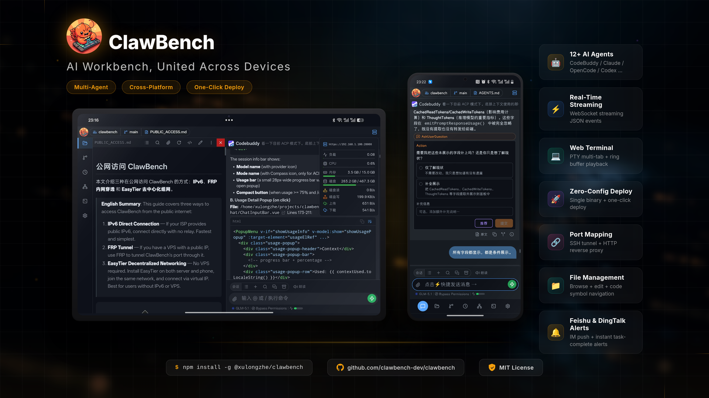
</p>

**From Terminal to Palm** — An AI workstation built for mobile.

Brings the full power of AI coding agents to browsers and mobile apps, creating a true mobile development environment. File browsing, code editing, AI conversation, Git operations, scheduled tasks — one app does it all.

Core Advantage: Native passthrough of AI capabilities (tool calls, extended thinking, Skills, MCP) with zero adaptation cost, fully preserving the power of coding agents. Unlike other mobile AI tools that are merely "remote controllers," ClawBench is a full-featured mobile workstation — files, code, Git, AI, scheduled tasks, TTS, get real work done on your phone without needing a PC online.

- **Supported Platforms**: Browser (PC / Tablet / Phone), Android App, PWA
- **AI Backends**: CodeBuddy, Claude Code, OpenCode, Codex, Qoder CLI, VeCLI, CodeWhale, MiMo-Code, Pi, Copilot, Kimi, Antigravity, Grok Build

<p align="center">
  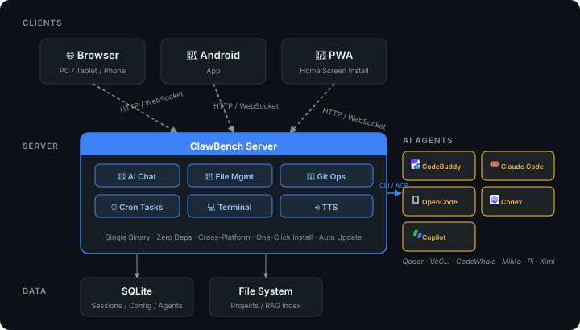
</p>

---

## Screenshots

### Login & Navigation

| Login | Home | Select Project | Settings Panel |
|-------|------|----------------|----------------|
| 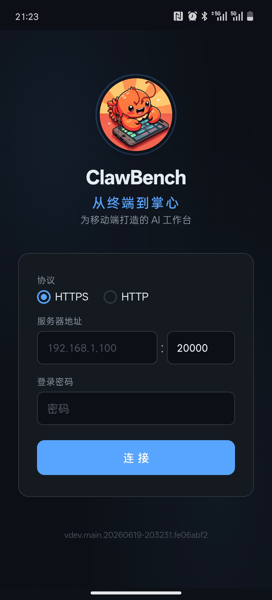 |  |  | 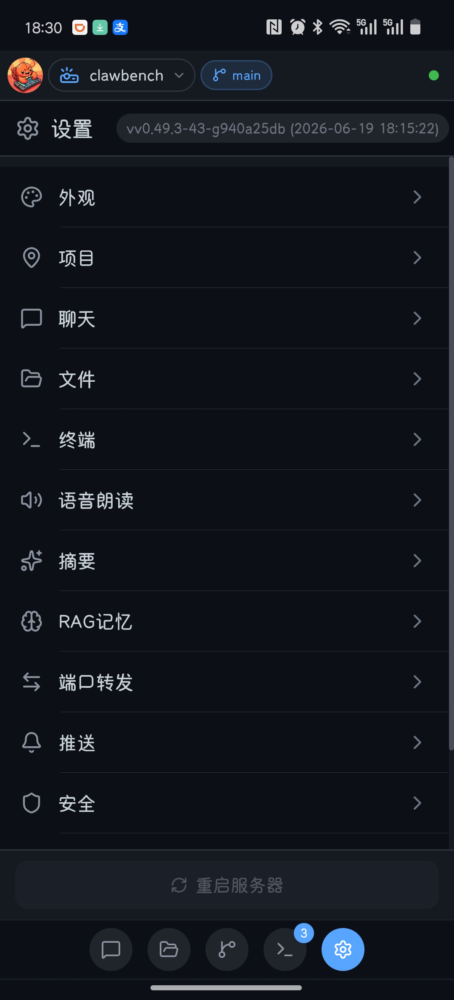 |

### File Browsing & Code Editing

| File Browser | Search & Filter | Code Editor | Quote & Ask |
|-------------|----------------|-------------|-------------|
|  |  |  |  |

### Markdown & Document Preview

| Markdown Render | LaTeX Formulas | Mermaid Diagrams | Table of Contents |
|-----------------|----------------|------------------|-------------------|
|  |  |  | 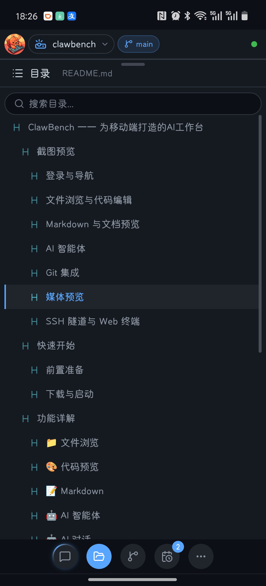 |

### AI Agents

| Agent Selection | AI Conversation | ACP Permission | RAG Search | Session Manager |
|-----------------|-----------------|----------------|------------|-----------------|
|  | 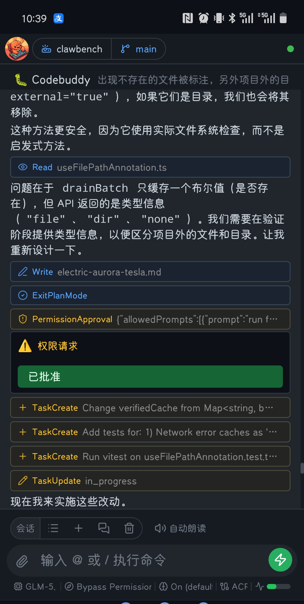 | 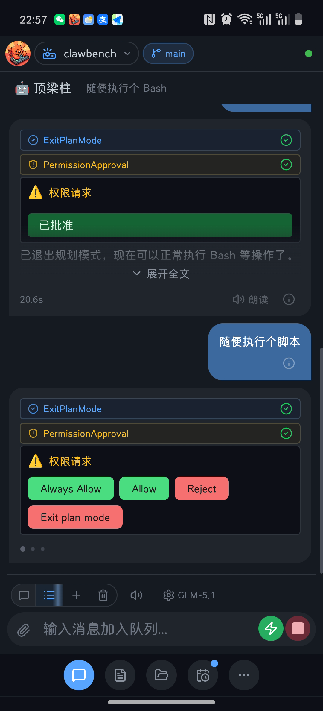 | 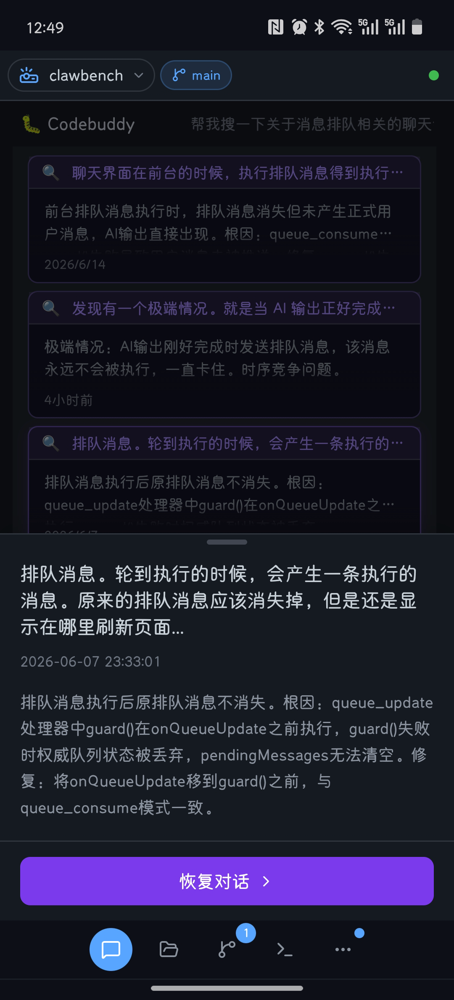 |  |

| Recommended Reply |
|------------------------------|
| 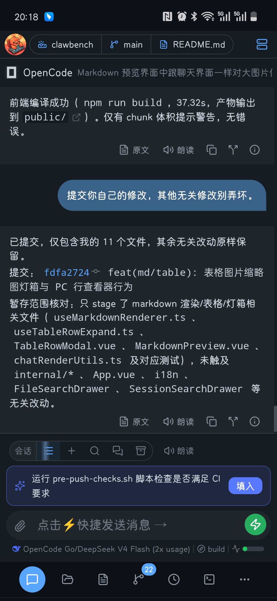 |

| Scheduled Tasks | Create Task | Task Card |
|-----------------|-------------|-----------|
| 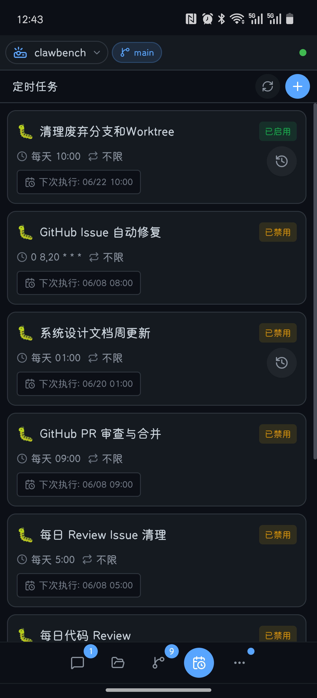 |  |  |

### Git Integration

| Commit History & Branch Graph | Branch Management | Commit Detail | Comparison Report |
|-------------------------------|-------------------|---------------|-------------------|
|  | 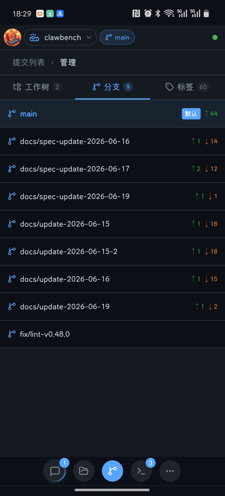 |  |  |

### Media Preview

| Image Viewer | Video Player | Audio Player | PDF Preview |
|-------------|-------------|-------------|------------|
| 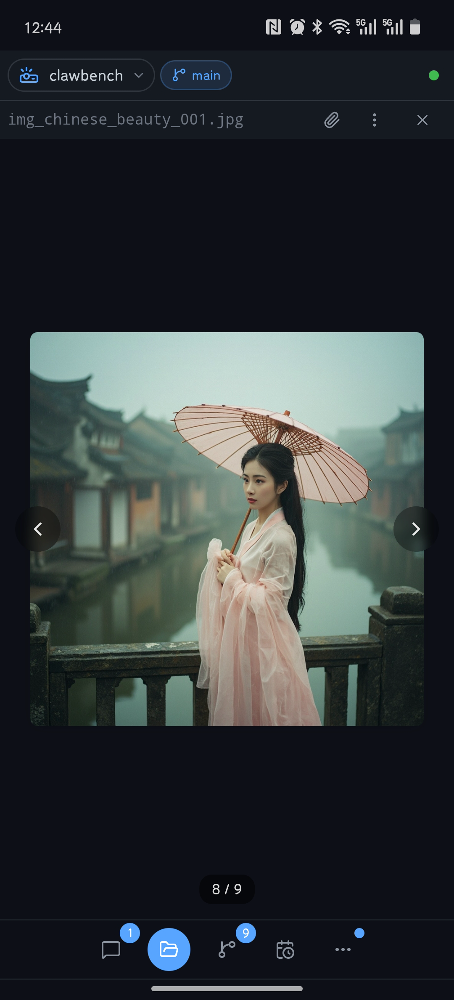 |  |  |  |

### SSH Tunnel & Web Terminal

| Port Forwarding | Interactive Terminal | Key/Symbol Configuration |
|----------------|---------------------|-------------------------|
|  | 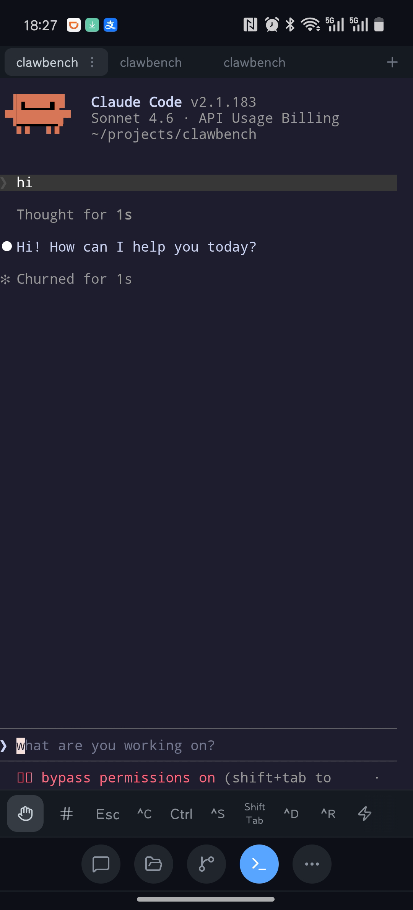 | 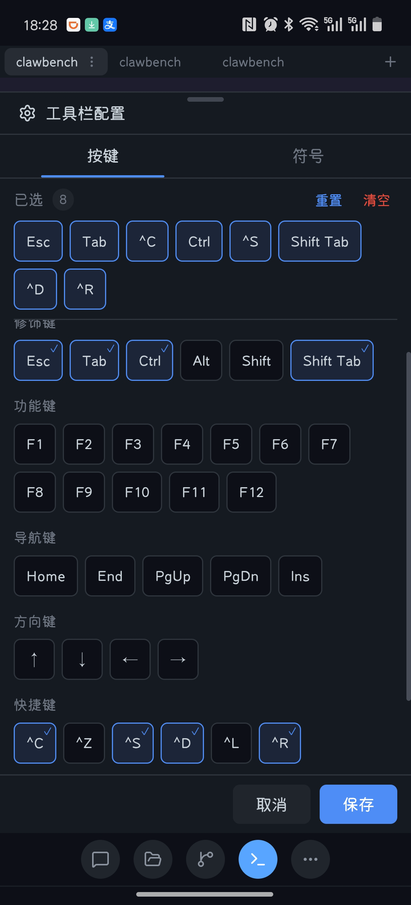 |

### System Resource Monitor

| System Monitor |
|----------------|
| 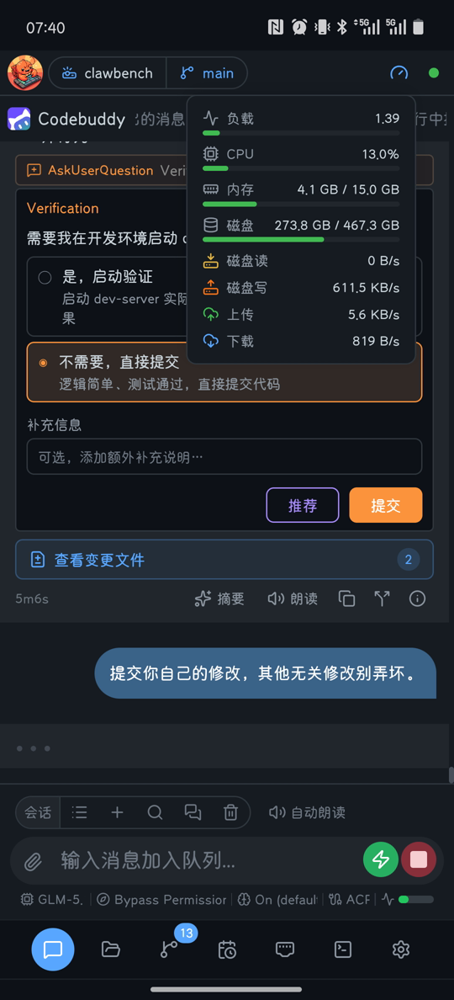 |

- Real-time monitoring of server CPU, memory, disk, and network usage
- Header panel display with WebSocket push updates
- Auto-switches to connection status indicator (disconnected/reconnecting) when WS is down, replacing the resource panel

---

## Quick Start

### Prerequisites

- **A PC (Linux / macOS / Windows)**: To run the ClawBench server, with at least one AI coding agent CLI installed (CodeBuddy, Claude Code, OpenCode, Codex, Qoder CLI, VeCLI, CodeWhale, MiMo-Code, Pi, Copilot, or Kimi)
- **A phone**: Install the [ClawBench Android App](https://github.com/xulongzhe/clawbench/releases), or use a mobile browser (Chrome recommended) to access the server address

### npm Install

Install via npm in one command:

```bash
npm install -g @xulongzhe/clawbench
# Start
clawbench
```

Supports Linux (x64/arm64), macOS (Intel/Apple Silicon), and Windows (x64). npm automatically selects the correct platform-specific binary package.

### Download & Start

Download the latest ZIP package from [GitHub Releases](https://github.com/xulongzhe/clawbench/releases), extract and you're ready:

```bash
wget https://github.com/xulongzhe/clawbench/releases/latest/download/clawbench-linux-amd64.zip
unzip clawbench-linux-amd64.zip
cd clawbench
./clawbench
```

### Docker Deployment

```bash
docker pull ghcr.io/clawbench-dev/clawbench:latest
docker run -d -p 20000:20000 -v clawbench-data:/data ghcr.io/clawbench-dev/clawbench:latest
```

Customize the host port with `-p` (e.g., `-p 20300:20000`). The `clawbench-data` volume persists all data. To view the auto-generated password:

```bash
docker exec $(docker ps -qf ancestor=ghcr.io/clawbench-dev/clawbench) cat /data/.clawbench/auto-password
```

> A random 8-character hex password is auto-generated on first startup and printed to the console in a bordered box. Save it securely.

Once deployed, access `http://server-ip:20000` from your phone app or mobile browser:

- **Phone App**: Native integration, auto-connect, full feature support
- **Mobile Browser**: **Chrome** recommended — supports installing as a PWA app (Add to Home Screen) for a near-native experience

> 📡 **Public Access**: To access ClawBench from the public internet (commuting, traveling, etc.), see the **[Public Access Guide](docs/PUBLIC_ACCESS.md)**  — supports IPv6 direct connection, FRP tunnel, and EasyTier decentralized networking (no VPS required).

---

## Features

### 📁 File Browser
- Recursive directory browsing with 120+ file extension support (including Office documents .docx/.xlsx/.xls/.pptx)
- Search filtering, sorting (name/time/extension/size)
- **Office document preview**: Word, Excel, and PowerPoint documents rendered natively in the browser — no download needed
- **File Preview Overlay**: Office files open in a preview overlay on top of the browse tab, supporting navigation stack (multi-file switching + back)
- **List/Grid View Toggle**: Grid view shows image thumbnails for visual file browsing
- **Image Thumbnails**: Backend generates proportional thumbnails for quick preview
- Context menu: rename, delete, copy, cut, paste, new file/folder, download, open as project
- **Multi-Select Operations**: Toggle multi-select mode from toolbar, batch copy/cut/delete; mobile long-press triggers context menu
- File upload (all file types supported, configurable size and count)
- Toggle hidden file visibility
- **Document search exclusion**: Office documents are excluded from file content search to improve performance (same as PDF)
- **Drill-down Browsing + Edge Swipe Back**: Tap folders to drill down, swipe from right edge to go back — intuitive mobile navigation
- **Breadcrumb Drag to Chat**: Drag breadcrumb segments (including Home icon) to chat area to attach directory path as context — consistent with file manager drag behavior
- **Ctrl+F/Cmd+F Context-Aware Search**: Automatically opens the appropriate search drawer based on current tab — Chat tab: session search (RAG); `view` tab with a file open: in-file content search; `view` tab empty state or `browse` tab: filename search; if already open, focuses the search input
- **Separate File View Tab**: Directory browsing (`browse`) and file viewing (`view`) are independent tabs — opening a file auto-switches to `view`, closing it stays on `view` showing empty state (recent files list), no auto-return to file manager
- **File Preview Overlay**: Click a file to open a preview overlay in the `view` tab; supports navigation stack (multi-file switching + back), close to return to empty state
- **Binary File Preview**: Binary files show a placeholder UI with "Open as text" option; large files auto-truncate (64KB binary / 512KB text), truncation notice banner when truncated
- **OpenAPI/Swagger Preview**: OpenAPI spec files (YAML/JSON) rendered as interactive Swagger UI with "Try it out" support; CORS proxy (`/api/openapi-proxy`) enables direct API testing from the preview
- **File Share Link**: Generate an unguessable public link for any file — anyone with the link can read or download it without logging in (Markdown with TOC, code, images/PDF/media/Office preview). Regenerate rotates the token so old links die instantly; closing the share revokes the link; a shared-files drawer lists and manages all active shares (open file / open in new tab / copy link / one-click clear)

### 🎨 Code Preview & Editing
- CodeMirror-based code browsing and editing dual mode, read-only by default, one-click switch to edit mode
- Syntax highlighting, sticky line numbers, word wrap toggle, 30+ language extensions (high-frequency static imports, low-frequency lazy loading)
- **Code Autocompletion**: Language-aware autocompletion for 11 languages (JS/TS/HTML/CSS/Python/SQL/Go/Less/Sass/Liquid/Markdown) in edit mode, leveraging CodeMirror's built-in completion sources
- **Sticky Scroll**: VS Code-style sticky scroll based on backend tree-sitter symbol data, showing enclosing scope context (functions, classes, structs, etc.) as you scroll
- **VS Code-Style Search Bar**: `Ctrl+F`/`Cmd+F` opens an inline search bar (case / whole-word / regexp toggles built into the input, prev/next/match count, optional replace row in edit mode) — a custom panel shared by CodeMirror, with the same interaction for Markdown preview
- **Double-click to copy code line content** (flash animation feedback)
- **File Change Flash Highlight**: When files are modified externally, deleted characters flash red and new characters flash blue for quick change identification
- **Quote & Ask**: Select a code snippet, one-click ask AI, auto-attaches file path and line number
- **File Path Navigation**: Clickable file paths in code previews with import path resolution (e.g., @/composables/useFoo resolves to the actual file path); line range navigation support (e.g., `file.go:42-50`) with flash highlight
- **Edit Mode**: undo/redo, save & exit, unsaved changes confirmation dialog, visual distinction for edit mode (accent-tinted background + top border)
- **Markdown Heading-Anchored Scroll Sync**: Scroll position synchronized between rendered view and source edit based on heading anchors
- **Excalidraw Canvas**: `.excalidraw` files open directly in an in-app canvas editor (embedded independent build in an iframe) with drawing and editing, save-writes back to the original file; language and theme follow the app settings, with unsaved-change confirmation on exit
- Swipe gestures: swipe left/right to switch files

### 📝 Markdown
- Toggle between rendered view / source view
- **Quote & Ask**: Select text, one-click ask AI
- Smart table of contents drawer (TOC) with tree-sitter code symbol extraction (100+ languages, 17 symbol kind icons), LaTeX math, Mermaid diagrams
- **Image Lightbox**: Images support zoom, swipe browsing; Mermaid SVG diagrams can be navigated alongside images in lightbox
- **File Path Navigation**: Clickable file paths in Markdown, with line range navigation
- **HTML Export**: Export the rendered Markdown as a standalone self-contained HTML file (media embedded as base64, KaTeX fonts inlined) rebuilt from the shared render pipeline so the exported document matches the in-app preview pixel-for-pixel — including the user's code/UI font choice, right-side TOC rail and lightbox zoom/pan

### 🤖 AI Agents
- **Streaming Response**: Real-time WebSocket push, thinking process and tool calls fully visible
- **Multi-Agent Support**: General assistant, coding expert, handyman, etc.; custom agents can be loaded via `config/agents/*.yaml` (supplementary method for non-standard agents)
- **AI Backend Switching**: CodeBuddy, Claude Code, OpenCode, Codex, Qoder CLI, VeCLI, CodeWhale, MiMo-Code, Pi, Copilot, Kimi, Antigravity, Grok Build — session-level isolation
- **Thinking Effort Levels**: Per-agent thinking depth selection (Low / Medium / High, etc.), supported by 10 backends (Claude/CodeBuddy/OpenCode/Codex/MiMo/Pi/Copilot/Kimi/Antigravity/Grok), selection auto-persisted
- **Model Selection Modal**: Unified model switching and thinking effort selection in a dual-tab interface, with search filtering, one-click model list refresh (for agents supporting auto-discovery), and long-press to set default model
- **Model Selection Persistence**: Model choice and thinking effort per agent auto-saved to localStorage, restored on reload/session switch
- **Scheduled Tasks**: AI creates Cron schedules via CLI subcommands, executes automatically; independent tab with 3-level breadcrumb navigation (list → detail with merged overview & history → execution detail); task cards embedded in chat messages; frequency presets (hourly/daily/weekly/monthly) + custom cron expressions; per-execution read tracking + TTS playback; execution auto-summary + completion notification (sound/haptic/toast)
- **Continue Conversation**: One-click continue conversation from task execution detail, auto-copies history messages and summaries to a new session, inherits backend/agent/model/thinking effort; sessions originated from scheduled tasks show a purple "Task" badge in session list
- **Multi-Session Management**: Create, switch, archive independent sessions, swipe to switch; archived sessions recoverable via search, physical delete (irreversible) and archive retention auto-cleanup available; Ctrl/Cmd+Delete to quick-archive current session
- **Swipe Session Toggle**: Toggle left/right swipe session switching in Settings → Chat; defaults to off to prevent accidental switches when scrolling wide content
- **Wide-Screen Chat Toggle**: A button at the bottom of the wide-screen dock hides/shows the chat area — when hidden, the left pane takes the full width for focused work (files, terminal, etc.) and can be restored on demand
- **Image Upload**: Upload images for AI conversation (multimodal)
- **Disconnect Protection**: Messages persist immediately, no data loss on disconnect, 15s heartbeat keep-alive + 30s timeout auto-reconnect (live content updates during polling fallback); on reconnect, auto-checks session state to prevent UI stuck when AI completed during disconnect
- **Auto Resume**: Automatically sends "continue" after Claude/CodeBuddy/Qoder/CodeWhale/MiMo/Pi/Copilot/Kimi exits Plan Mode
- **Message Queue**: Messages queue when AI is busy, sent sequentially; queued messages are persisted to the database and dequeued in order for execution
- **Message Clusters**: Auto-analyze chat history patterns, group semantically similar user messages into clusters, one-click add to Quick Send; Union-Find + Sørensen-Dice similarity, on-demand computation with progress tracking
- **Auto Summary**: Automatically generates a summary of the last assistant message on session complete; **message display modes** control the default view — Mixed (default: the most recent AI reply shows full text, older messages show summaries), Summary-only or Original-only; individual messages can still be toggled via the bottom banner; summary view also surfaces warning/error banners that were part of the reply; TTS playback also uses the summary
- **Recommended Reply**: Automatically generates a next-step suggestion after AI reply; recommendation banner above input box, one-click to accept; aware of quick commands and project context
- **@ Commands**: Type `@chatsearch` to search conversation history, `@task` to manage scheduled tasks — autocomplete popup menu, purple command badge in user messages
- **RAG Results Card**: RAG search results in AI responses rendered as purple-themed cards; click to open detail drawer, one-click resume conversation
- **Inline Thinking Streaming**: Thinking process streams inline during active session; auto-collapses to clickable chip on completion; thinking content lazy-loaded — after stream ends, only thumbnail is kept, full text loaded on demand when expanded
- **Session Progress Indicator**: Session drawer shows capsule progress bar with color-coded fill (blue/orange/red) based on usage
- **ACP Context State Persistence**: Mode, thinking effort, and context usage auto-persisted to database; state survives server restarts
- **Token Usage Detail**: The context-usage panel and message details show input/output/cache-read tokens, cache hits (with hit-rate hit/(hit+miss)), thinking tokens and credit sub-items that stay stable during streaming; tapping an assistant message opens message-level metadata (backend session ID, model, duration, trace identity). Usage comes from per-agent ACP `_meta` extensions normalized by the backend
- **CodeBuddy Local Skills in ACP Mode**: `~/.codebuddy/skills/` skills (SKILL.md with name + description) are auto-scanned and exposed as `/` slash commands in web sessions, with a skills summary injected into the system prompt — matching TUI mode behavior

### 🤖 AI Conversation
- **Tool Call Visualization**: Name, parameters, execution results displayed in real time with success/error status
- **Extended Thinking**: Complex tasks auto-trigger extended thinking, reasoning visible in real time
- **File Path Navigation**: Clickable file paths in AI responses, with line range navigation
- **Localhost URL Navigation**: localhost URLs in AI responses (e.g., http://localhost:3000) are auto-detected with an open button; in App mode, port mapping is auto-registered and the URL opens via WebView with zero manual config
- **Quick Send**: Preset common commands (continue, build, commit, etc.) with drag reorder; an input-bar trailing icon injects the command into the input box for editing before sending; input placeholder hints at the current quick send; message clusters analysis discovers recurring patterns and adds them
- **Input Draft & Attachment Restore**: When switching sessions, unsent input text, attached files and staged quotes are snapshotted and restored when you switch back — no lost input from accidental session switches
- **Quote & Ask**: Select code or text, ask AI directly, auto-attaches context
- **Current Directory Attachment**: Chat input supports attaching current directory context, AI auto-gets directory structure
- **Drag & Paste Upload**: Drag files onto chat area or paste clipboard content (screenshots/files), auto-upload and attach as tags without opening the attach drawer
- **Compact Context**: When ACP session context usage ≥ 75%, a "Compact context" button appears in the session-info bar, one-click sends `/compact` command to free context space
- **Unread Badge**: Chat panel icon shows unread message count
- **Attach Drawer Footer**: Selected files shown as persistent scrollable tags at the bottom of the attach drawer, with direct removal support
- **Auto-Approve Indicator**: Mode chip turns green when auto-approve is enabled, providing visual feedback for ACP permission mode
- **Reset Session**: A "Reset session" button on AI error/warning banners restarts a stuck agent process (e.g., a tool approved but never executed); the external session ID and chat history are preserved, context is restored on reconnect and the last user message is re-sent
- **Completion Popup**: When a session or scheduled task finishes while the chat UI is not in the foreground (you're on another tab or a different session), an Android-notification-style card slides in from the top — showing the full summary, project name/path, the last user message and the agent backend icon, with a built-in quick input to follow up, a mark-as-read button and a jump button to the session/task detail. Sending a follow-up message or tapping mark-as-read clears the unread badge for that session (via `/api/ai/chat/read`, project-aware so cross-project popups work) and shows a success toast; tapping the backdrop closes the popup (ignored within the first second to prevent accidental taps). The user message renders as a quote-style block that expands on tap. External-project popups show a footer divider with the project name/path. Multiple completions queue up and show one at a time; replaces the old in-UI toast
- **Scroll Position Retention**: Scrolling position is kept while you read older messages within a session (loading more history mid-session doesn't jump the view); switching sessions/projects always returns to the bottom (tab switches rely on the browser's native scroll retention). After sending a message, if scrolling has stopped, the view unconditionally snaps back to the bottom
- **Per-Project Session Restore**: Each project remembers the session you last opened (keyed by project root), and reopens it automatically on entry — falling back to default behavior when that session is gone. Jumping between projects doesn't lose your place
- **Auto Clear Unread**: The current session is marked read automatically when execution finishes or when you switch back to the foreground — unread badges exist only for sessions you're not looking at, and clear the moment you return

### 🖼️ Media Preview
- In-app preview of images, audio, video
- Lightbox zoom, fullscreen view, support for pinch-zoom and drag

### 📄 Office Document Preview
- **Word (.docx)**: Native document rendering with table and image support
- **Excel (.xlsx/.xls)**: Spreadsheet preview with multi-sheet switching, toolbar auto-hidden
- **PowerPoint (.pptx)**: Slide-by-slide preview with pinch-to-zoom (mobile) and Ctrl+scroll zoom (desktop)
- **Loading & Error Handling**: Skeleton animation on load; retry and download buttons on failure
- **AI Integration**: Select text from Office documents and one-click ask AI, file path context auto-attached

### 🔊 TTS Speech Synthesis
- Auto-summarize and read AI replies aloud, listen while reading
- **5 TTS Engines**: Edge TTS (free, native Go implementation, no external dependency), MiniMax (best quality), Piper / Kokoro / MOSS-Nano (local offline)
- **Summarization Backends**: simple (text-only cleanup) and api (OpenAI/Anthropic compatible) modes
- See [TTS Deployment Guide](docs/TTS.en.md)

### 🎤 Voice Input (STT)
- Microphone recording → ASR recognition → text filled into chat input, no typing needed on mobile
- **Dual Mode**: Streaming (WebSocket real-time incremental + final full recognition) and non-streaming (one-shot recognition after recording)
- **vLLM Whisper Engine**: Connect via OpenAI-compatible endpoint, supports local deployment
- **Shortcut Key**: Configurable shortcut key (default F9) to toggle recording

### 📂 Git Integration
- Project-level / file-level commit history browsing
- **Git Branch Graph**: Vertical branch topology, intuitive branch relationships
- **Git Diff View**: View changes relative to HEAD, character-level highlighting
- Commit detail view (author, time, commit message)
- Working tree changes view (staged / unstaged files)
- **3-Tab Management**: Worktree / Branches / Tags tabs for unified management, default tab persisted to localStorage
- **Swipe to Delete**: Branches, worktrees, and tags support swipe-to-delete with safety guards (current branch, default branch, and current worktree cannot be deleted)
- **Tag Management**: Browse project tags, click a tag to checkout, auto-prompt for dirty working tree

### 🔀 SSH Tunnel Port Mapping
- **Remote Development**: Access server local ports directly from Android App
- **Protocol Transparent**: HTTP, HTTPS, WebSocket, SSE, gRPC — no URL rewriting needed
- **Custom Target Host**: Map to any reachable host (LAN/remote, not limited to 127.0.0.1)
- **Auto Port Assignment**: Automatically allocates local ports when mapping the same target port to different hosts
- **Port Editing**: Modify existing port mapping configurations
- **Auto-Open Localhost URLs**: localhost URLs appearing in chat (e.g., web services started by AI) can be opened with one tap — port mapping is auto-registered and the URL opens via WebView in App mode
- **Tunnel Health Check & Reconnect**: Auto-checks tunnel health before opening localhost URLs; reconnects if unhealthy; one-tap reconnect for disconnected tunnels

### 💻 Web Terminal
- **Interactive Terminal**: PTY + WebSocket + xterm.js, operate server terminal directly in browser
- **Concurrent Sessions**: Each client gets an independent PTY session, no interference
- **Multi-Tab Management**: Close all tabs, empty state with create button, dock icon shows active session count; background tabs show an unread dot when new output arrives
- **Three-Mode Gesture System**: Browse (default, touch scroll), Gesture (Termius-style swipe→arrow keys, hold-to-repeat, double-tap→Tab, pinch-to-zoom), Selection (drag-to-select text + floating copy bar)
- **Virtual Key Toolbar**: Color-coded key groups (modifiers, shortcuts, navigation, arrows, actions), three-state modifier toggle
- **Key/Symbol Configuration**: Full-screen configuration drawer with keys and symbols dual tabs; supports tap-to-add, drag-to-reorder, gesture mode auto-hides certain keys; configuration persisted to database
- **Symbol Bar**: Expandable symbol input row with 19 high-frequency terminal symbols, smart sorting using exponential decay (balances frequency and recency)
- **Selected Text Auto-Copy**: Selected terminal text automatically copied to clipboard with toast feedback
- **Quick Commands**: CRUD management of common commands with drag reorder, hidden flag, auto-execute (auto-run on every connect/reconnect)
- **Android Volume Keys**: Volume up/down remapped to arrow keys when terminal is open in the app
- **Android Soft Keyboard Stability**: Read-only mode prevents soft keyboard popup; tapping terminal avoids keyboard collapse-then-reopen flicker
- **Terminal Theme Switching**: 157 xterm-theme themes available, `auto` mode follows app dark/light theme
- **Terminal Input Drawer**: Mobile multi-line text input with clipboard paste support
- See [Web Terminal User Guide](docs/TERMINAL.en.md)

### 🌐 Internationalization
- Chinese / English bilingual UI, auto-detect system language

### 📱 Android App
- Native bridge integration: auto-login, file download (including POST archive downloads), port mapping management
- Static HTML login page: shown on first launch or connection failure, matches web UI visual style
- SSH password management, server dialog
- WebView connection protection: WebView hidden during connection attempts to prevent browser error page flash
- **Self-Update**: One-click version check, binary download, and service restart from the Web UI; disconnect recovery with polling fallback; version skip option
- **Android Version Mismatch Detection**: WebView startup compares APK version with server version; shows `VersionMismatchOverlay` prompting APK update when mismatched
- **Floating Status Window**: System-level overlay capsule (Android 8.0+ `TYPE_APPLICATION_OVERLAY`) that shows real-time session stats (running / pending-approval / unread counts) via the background WebSocket channel. Shows an "idle" capsule state when there's nothing to report rather than hiding. Draggable with edge-snapping and position persistence; tap expands a grouped session-list panel (per-project headers with name+path, status dots + unread badges) to jump straight into a session. Toggle + `SYSTEM_ALERT_WINDOW` permission flow in Settings
- **Live Updates (Dynamic Island)**: Android 16 live-update notifications surface session state on the status bar and lock screen — a single-line status-bar chip (pending approvals > unread > running, highest priority only, auto-removed when empty) plus an expanded-by-default card on the lock screen / notification drawer (full three-group counts). Shares the same overview data as the floating window, so the numbers always agree. Independent opt-in toggle in Settings (on by default); requires the system "Live Updates" notification permission, with graceful fallback to a plain ongoing notification
- **Full Android i18n**: Native Android UI is fully bilingual (English default + Chinese mirror) — hardcoded Chinese in login/connection errors and notification text has been moved to string resources, with a three-layer language resolution (in-app choice > cookie > system locale)

### 🔔 Notifications
- Notification sound + haptic feedback (alerts when AI completes); sound can be toggled off in settings to prevent Bluetooth headphone interruption
- Browser push notifications
- **Task Completion Push**: Scheduled task completion notifications include response preview summary; tap to navigate to execution details
- **DingTalk/Feishu Bot Push**: Instant push via DingTalk or Feishu bot on AI session completion, permission approval, and scheduled task status changes; view session list and send messages to sessions from IM
- See [DingTalk Push Setup](docs/DINGTALK_PUSH.en.md) | [Feishu Push Setup](docs/FEISHU_PUSH.en.md)


### 🎨 Themes
- **36 Named Themes**: VSCode-style self-contained color schemes sorted by background brightness — 16 light (GitHub Light, One Light, Ayu Light, Light Modern, Light Plus, Quiet Light, Vitesse Light, Bluloco Light, Material Lighter, Alabaster, Everforest Light, High Contrast Light, Nord Light, Catppuccin Latte, Solarized Light, Gruvbox Light) and 20 dark (Solarized Dark/Deep, Monokai, Material Darker, Dark Plus, Bluloco Dark, Nord, Everforest Dark, One Dark Pro, Dracula, Rose Pine, Gruvbox Dark, GitHub Dark, Catppuccin Mocha, Vitesse Dark, Tokyo Night, Kanagawa, Ayu Dark, Night Owl, High Contrast Dark)
- **Follow System**: `auto` mode picks the default GitHub Light/Dark based on the system color scheme
- **Quick Theme Picker**: Palette button in the header switches themes on the fly with live color previews; its dropdown mirrors the project-picker panel style and pins a "More appearance options" entry that deep-links into Settings → Appearance (full theme grid + fonts + UI zoom)
- **Custom Fonts**: Pick from common open-source fonts for code (monospace) and interface (proportional) channels with optional fallback fonts — pure CSS font-stack switching, falls back to defaults when a font isn't installed; App header font configuration, Markdown export and the xterm/CodeMirror/Mermaid renderers all honor the selection
- **Persistent & Status Bar Aware**: Selection is saved locally and restored on reload; Android status bar color follows the active theme

### 📱 PWA Support
- Installable to home screen, runs in standalone window

### 🔒 Security
- Optional password protection (SHA-256 salted hash storage, password change available in settings panel)
- Multi-instance cookie isolation (cookies auto-prefixed by port, no collisions on same domain)
- Path traversal protection, all operations restricted to project directory
- Git parameter injection protection (SHA/branch name/tag name validation, `--` separator)
- Configurable file upload size and count (default 100MB / 20 files), all file types supported
- XSS protection (DOMPurify sanitization)
- File share links use unguessable capability tokens as the sole credential — revoking or regenerating a link kills it instantly; when unused, the public endpoints return 404 so the feature has zero exposure
- TLS support (auto-discover certificate directory; drop in fullchain.pem + privkey.pem to enable HTTPS)

---

## FAQ

See **[FAQ](docs/FAQ.en.md)** .

---

## License

Copyright (c) 2026 xulongzhe

Licensed under the MIT License
