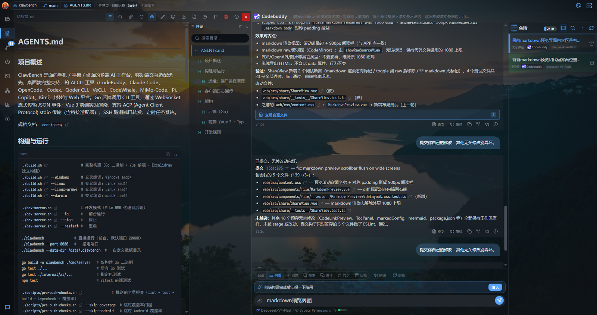
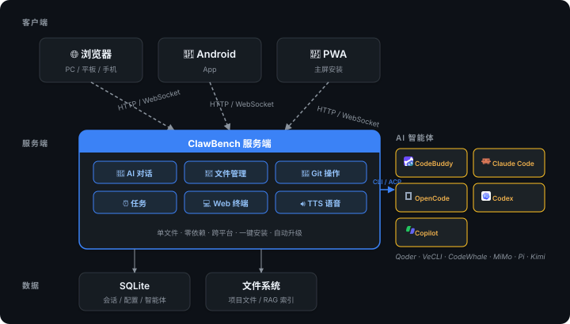
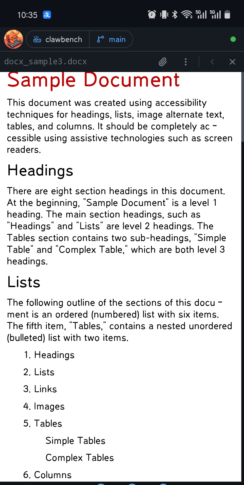
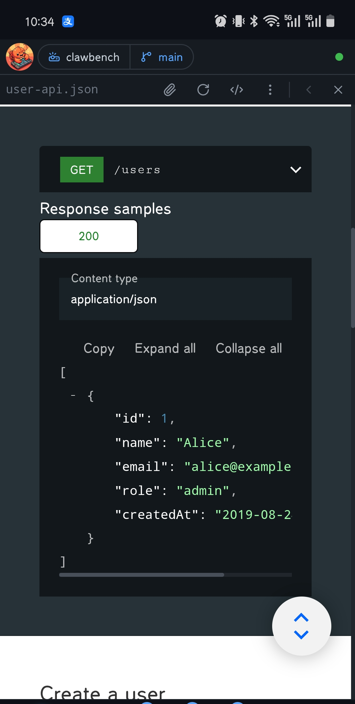
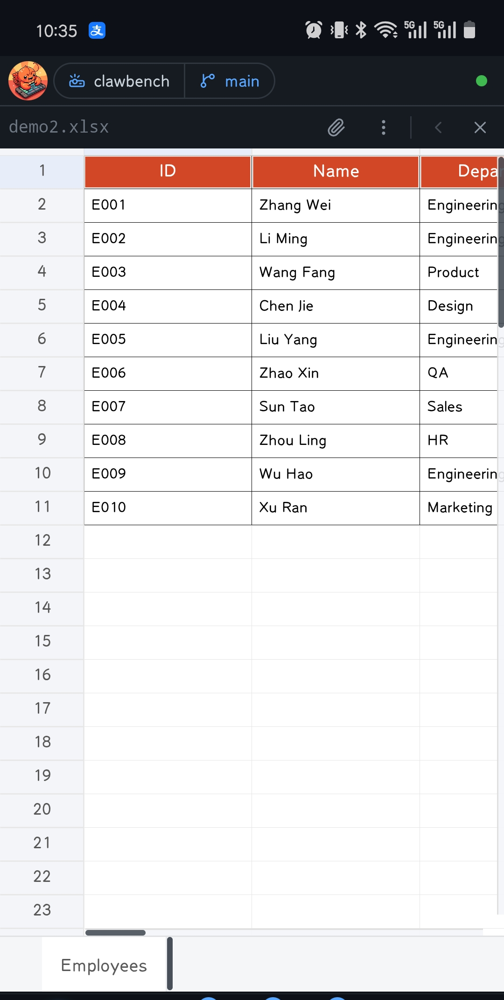
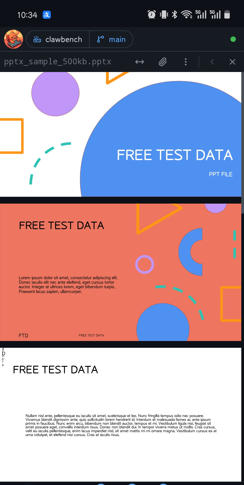

[中文](README.zh.md) | [English](README.md)

# ClawBench —— 多端一体的 AI 工作台

<p align="center">
  
</p>

<p align="center">
  
</p>

> 🎬 **演示视频**：[OpenClaw 和 Hermes 就是玩具，于是我写了一个能干活的](https://b23.tv/ewACF0h) — Bilibili

**从掌心到桌面，多端一体的 AI 工作台。**

将强大的 AI 编程智能体能力带到每一块屏幕——手机、平板与桌面。文件浏览、代码编辑、AI 对话、Git 操作、定时调度、命令行终端 —— 一个应用，全部搞定，无论你在通勤路上还是坐在桌前。

**单文件部署，无任何依赖**

<p align="center">
  
</p>

- **支持平台**：浏览器（PC / 平板 / 手机）、Android App、PWA；AI 智能体可在 PC 上运行，也可通过 [Termux](docs/TERMUX.md) 在安卓手机上完全运行
- **AI 后端**：CodeBuddy、Claude Code、OpenCode、Codex、Qoder CLI、VeCLI、CodeWhale、MiMo-Code、Pi、Copilot、Kimi、Antigravity、Grok Build、ZCode

---

## 截图预览

### 登录与导航

| 登录 | 首页 | 选择项目 | 设置面板 |
|------|------|----------|----------|
|  |  |  |  |

### 文件浏览与代码编辑

| 文件浏览 | 搜索过滤 | 代码编辑器 | 引用提问 |
|----------|----------|------------|----------|
|  |  |  |  |

### Markdown 与文档预览

| Markdown 渲染 | LaTeX 公式 | Mermaid 图表 | 目录导航 |
|---------------|------------|-------------|----------|
|  |  |  |  |


### AI 智能体

| 智能体选择 | AI 对话 | ACP 权限审批 | RAG 检索 | 会话管理 |
|------------|---------|-------------|----------|----------|
|  |  |  |  |  |

| 推荐回复 |
|----------|
|  |

| 任务 | 创建任务 | 任务卡片 |
|----------|----------|----------|
|  |  |  |

### Git 集成

| 提交历史与分支图 | 分支管理 | 提交详情 | 比较报告 |
|------------------|----------|----------|----------|
|  |  |  |  |

### 媒体预览

| 图片查看 | 视频播放 | 音频播放 | PDF 预览 |
|----------|----------|----------|----------|
|  |  |  |  |

### Office 文档与 Open API 预览

| Word 文档 | Open API 预览 | Excel 表格 | PPT 幻灯片 |
|-----------|---------------|------------|------------|
|  |  |  |  |

### SSH 隧道与 Web 终端

| 端口映射 | 交互式终端 | 按键/符号配置 |
|---------|-----------|--------------|
|  |  |  |

### 系统资源监控

| 系统监控 |
|----------|
|  |

- 实时监控服务器 CPU、内存、磁盘、网络使用情况
- 应用头部面板展示，WebSocket 推送更新
- WS 断线/重连时自动切换为连接状态提示（断开/重连中），替代系统资源面板

---

## 快速开始

### 前置准备

- **一台 PC（Linux / macOS / Windows）或装有 Termux 的安卓手机**：用于运行 ClawBench 服务端，并安装至少一个 AI 编程智能体 CLI（CodeBuddy、Claude Code、OpenCode、Codex、Qoder CLI、VeCLI、CodeWhale、MiMo-Code、Pi、Copilot、Kimi）
- **任意设备**：安装 [ClawBench Android App](https://github.com/xulongzhe/clawbench/releases)，或用任意浏览器（桌面 / 平板 / 手机）访问服务端地址

### npm 安装

通过 npm 一键安装，国内用户走淘宝源秒下：

```bash
# 配置淘宝镜像（仅需一次）
npm config set registry https://registry.npmmirror.com/
# 全局安装
npm install -g @xulongzhe/clawbench
# 启动
clawbench
```

### 安装包部署

从 [GitHub Releases](https://github.com/xulongzhe/clawbench/releases) 下载最新版 ZIP 包，解压即可运行，无需安装：

```bash
wget https://github.com/xulongzhe/clawbench/releases/latest/download/clawbench-linux-amd64.zip
unzip clawbench-linux-amd64.zip
cd clawbench
./clawbench
```


### Docker 部署

```bash
docker pull ghcr.io/clawbench-dev/clawbench:latest
docker run -d --restart unless-stopped -p 20000:20000 -v clawbench-data:/data ghcr.io/clawbench-dev/clawbench:latest
```

修改 `-p` 可自定义端口（如 `-p 20300:20000`），`clawbench-data` 卷持久化数据。

> `--restart unless-stopped`（或 `always`）是应用内升级的必要条件：容器会替换自身二进制并以退出码 0 退出，依赖 Docker 重启策略把新版本拉起来。请勿使用 `--restart on-failure`——优雅退出的退出码为 0，不会触发重启，容器会停在停止状态。推荐的升级方式仍是 `docker pull` 后重建容器——用未更新的镜像重建会回退就地替换的结果。

> 首次启动会自动生成32位随机密码，以字符框突出打印到控制台，请妥善保存。

部署完成后，使用手机 App 或任意浏览器访问 `http://服务器IP:20000` 即可开始使用。

### 📱 在安卓手机上完全运行（Termux）

> 完整指南见 **[Termux（安卓）](docs/TERMUX.md)** 。

ClawBench 可在安卓手机的 [Termux](https://f-droid.org/repo/com.termux.app.apk) 终端模拟器中**完全运行**：纯 Go 的 `linux-arm64` 后端、内置 Web 前端、AI 编程智能体全部在手机本地执行，无需额外 PC 或服务器：

```bash
pkg install -y nodejs-lts git
npm install -g @xulongzhe/clawbench
clawbench
```

> 📡 **公网访问**：如需从外网访问 ClawBench（通勤途中、出差等场景），请参阅 **[公网访问指南](docs/PUBLIC_ACCESS.md)** ，支持 IPv6 直连、FRP 内网穿透和 EasyTier 去中心化组网（无需 VPS）三种方式。

---

## 功能详解

### 📁 文件浏览
- 递归目录浏览，支持 120+ 种文件扩展名（含 Office 文档 .docx/.xlsx/.xls/.pptx）
- 搜索过滤、排序（名称/时间/扩展名/大小）
- **Office 文档预览**：支持 Word、Excel、PowerPoint 文档直接在浏览器中原生渲染，无需下载到本地
- **文件预览覆盖层**：点击 Office 文件在文件浏览页上方弹出预览覆盖层，支持导航栈返回
- **列表/网格视图切换**：网格视图以图片缩略图展示文件，直观浏览图片资源
- **图片缩略图**：后端生成等比缩放缩略图，快速预览图片内容
- 右键菜单：重命名、删除、复制、剪切、粘贴、新建文件/文件夹、下载、作为项目打开
- **多选操作**：工具栏切换多选模式，批量复制/剪切/删除，移动端长按触发右键菜单
- 文件上传（支持所有文件类型，大小和数量可配置）
- **文件夹上传**：拖放文件夹上传，保持嵌套目录结构（包括空目录）；也支持文件夹选择器上传
- **目录树下载**：使用 File System Access API 将整个目录下载到本地，保持完整目录结构
- **目录跳转**：工具栏定位按钮，输入路径直接跳转到目标目录
- **拖放移动**：文件管理器内拖放文件/目录到目标目录
- **粘贴上传**：Ctrl+V 粘贴剪贴板图片上传到当前目录
- **排序**：按名称/时间/类型/大小排序，支持升序/降序
- **键盘快捷键**：Ctrl+C/X/V 剪贴板操作、Delete 删除、F2 重命名、Ctrl+N 新建文件、Alt+Up 上级目录、Ctrl+R 刷新、Ctrl+Shift+H 显示隐藏文件、Ctrl+1/Ctrl+2 列表/网格切换
- 隐藏文件显示/隐藏切换
- **文档搜索排除**：Office 文档不参与文件内容搜索，提升搜索性能（PDF 同理）
- **下钻浏览 + 边缘滑动回退**：点击文件夹下钻进入，右边缘左滑返回上一级，移动端直觉操作
- **面包屑拖拽到聊天**：拖拽面包屑段（含 Home 图标）到聊天区域，自动附加目录路径作为上下文，与文件管理器拖拽行为一致
- **Ctrl+F/Cmd+F 上下文感知搜索**：根据当前标签页自动打开对应搜索抽屉——聊天标签：会话搜索（RAG）；`view` Tab 有文件打开：文件内容搜索；`view` Tab 空状态或 `browse` Tab：文件名搜索；已打开时聚焦输入框
- **文件浏览独立 Tab**：目录浏览（`browse`）和文件查看（`view`）各自独立，打开文件自动切换到 `view` Tab，关闭文件后停留在 `view` 显示空状态（最近文件列表），不自动跳回文件管理器
- **文件预览覆盖层**：点击文件直接在 `view` Tab 中弹出预览覆盖层，支持导航栈（多文件切换 + 返回），关闭即回到空状态
- **停靠预览窗格**：工具栏的预览开关（眼睛图标）在文件列表下方展开一个可调高度的预览窗格——点任意条目就地预览，不必离开文件管理器。文件复用代码链接预览卡片的渲染（代码切片、媒体播放器、Markdown），**目录则直接列出内容**，不用先进去再退出来，并带「打开目录」按钮可直接让文件管理器跳进去（快捷预览卡里则是原地展开该目录）。目录里的图片复用文件管理器的缩略图。窗格与列表之间的分隔条可拖拽调高（桌面与移动端统一为单行 28px 标题栏）
- **跨界面跳转与精准返回**：从对话消息/任务卡片点开文件时记录来源上下文——返回键精准退回原对话或任务而非错乱切 Tab；桌面文件顶栏左上角导航簇、移动端底部居中悬浮胶囊（大拇指热区）双入口。跳回文件时精确还原阅读位置
- **二进制文件预览**：二进制文件显示占位界面，支持"以文本方式打开"；大文件自动截断（64KB 二进制 / 512KB 文本），截断时显示提示横幅
- **OpenAPI/Swagger 预览**：OpenAPI 规范文件（YAML/JSON）渲染为交互式 Swagger UI，支持"Try it out"在线测试；CORS 代理（`/api/openapi-proxy`）使预览内可直接调用 API
- **文件分享链接**：为任意文件生成不可猜测的公开链接，任何拿到链接的人免登录即可只读查看或下载（Markdown 带 TOC、代码、图片/PDF/音视频/Office 预览）。重新生成会轮换 token 使旧链接立即失效；关闭分享即撤销链接；"已分享文件"抽屉集中管理所有有效分享（打开文件/新标签页打开/复制链接/一键清空）

### 🎨 代码预览与编辑
- 基于 CodeMirror 的代码浏览/编辑双模式，只读模式默认，一键切换编辑模式
- 语法高亮，粘性行号，自动换行切换，30+ 语言扩展（高频语言静态导入，低频语言懒加载）
- **代码自动补全**：编辑模式下为 11 种语言提供语言感知的自动补全（JS/TS/HTML/CSS/Python/SQL/Go/Less/Sass/Liquid/Markdown），基于 CodeMirror 内置补全源
- **Sticky Scroll**：VS Code 风格的粘性滚动，基于后端 tree-sitter 符号数据，滚动时自动显示当前所在的作用域上下文（函数/类/结构体等）
- **VS Code 风格搜索条**：`Ctrl+F`/`Cmd+F` 打开内嵌搜索条（大小写/全词/正则三个选项图标内联在输入框内，支持上一个/下一个/匹配计数，编辑模式下带替换行）——CodeMirror 与 Markdown 预览共用同一套交互的自定义搜索面板
- 双击复制代码行内容（闪烁动画反馈）
- **文件改动闪烁高亮**：文件被外部修改时，删除字符红色脉冲闪烁，新增字符蓝色脉冲闪烁，快速定位改动
- **引用提问**：选中代码片段后，一键向 AI 提问，自动附上文件路径和行号
- **文件路径跳转**：代码预览中的文件路径可点击跳转，支持 import 路径解析（如 @/composables/useFoo 解析为实际文件路径）；支持行范围导航（如 `file.go:42-50`），高亮闪烁指定行范围
- **编辑模式**：undo/redo、保存退出、未保存变更确认对话框、编辑模式视觉区分（强调色背景+顶部边框）
- **Markdown 标题锚定滚动同步**：在渲染视图和源码编辑之间切换时，根据标题锚点同步滚动位置
- **Excalidraw 画布**：`.excalidraw` 文件直接在应用内打开画布编辑器（iframe 内嵌独立构建），支持绘制、编辑、保存写回原文件；语言和主题跟随应用系统设置，退出时自动检测未保存修改并提示
- 滑动手势：左右滑动切换文件

### 📝 Markdown
- 渲染视图 / 源码视图一键切换
- **引用提问**：选中文本，一键向 AI 提问
- 智能目录抽屉（TOC），支持 Tree-sitter 代码符号提取（100+ 语言，17 种符号类型图标），LaTeX 数学公式，Mermaid 图表
- **图片灯箱**：图片支持放大、左右切换浏览；Mermaid SVG 图表可与图片一起在灯箱中导航
- **文件路径跳转**：Markdown 中的文件路径可点击跳转，支持行范围导航
- **代码链接预览**：开启「设置 → 项目与文件 → 文件显示 → 文件链接预览」后，点击 Markdown 预览中验证通过的文件路径或 `path:line` 链接弹出代码切片浮层卡片——桌面端卡片常驻至显式关闭（点击卡片外、Esc 或关闭按钮）、`Ctrl/Cmd+Click` 固定（Pin），触摸设备点击路径弹出底部抽屉；支持语法高亮、范围行高亮、拖拽定位，以及"引用到对话 / 复制路径 / 打开目录 / 在预览中查找"等操作，大文件自动切片保护（最大 200 行 / 512 KiB，超大文件给出警告）
- **HTML 导出**：渲染视图工具栏一键导出为自包含 HTML 文件（媒体 base64 内嵌、KaTeX 字体内联），由共享渲染管线从源码重建，导出文档与 App 内预览逐像素一致——含所选代码/界面字体、右侧 TOC 常驻侧栏与灯箱缩放/平移交互

### 🤖 AI 智能体
- **流式响应**：WebSocket 实时推送，思维过程、工具调用全程可见
- **多 Agent 支持**：全能助手、编码专家、勤杂工等；自定义 Agent 可通过 `config/agents/*.yaml` 加载（非常规 Agent 的补充方式）
- **AI 后端切换**：CodeBuddy、Claude Code、OpenCode、Codex、Qoder CLI、VeCLI、CodeWhale、MiMo-Code、Pi、Copilot、Kimi、Antigravity、Grok Build、ZCode，会话级隔离
- **深度思考档位**：支持按智能体选择思考深度（Low / Medium / High 等），Claude/CodeBuddy/OpenCode/Codex/MiMo/Pi/Copilot/Kimi/Antigravity/Grok/ZCode 十一后端支持，选择自动持久化
- **模型选择模态框**：统一模型切换与思考深度选择，双 Tab 界面，搜索过滤，一键刷新模型列表（支持自动发现的智能体），长按设为默认模型
- **模型选择持久化**：每个智能体的模型选择和思考档位自动保存到 localStorage，刷新/切换会话自动恢复
- **任务**：通过 `/cb-task` 内置命令创建，定时任务按 Cron 自动执行、事件任务由 GitHub/GitLab 事件触发；独立标签页管理，3 级面包屑导航（列表 → 详情「概览+历史合一」→ 执行详情）；频率预设（每小时/每天/每周/每月）+ 自定义 Cron 表达式；任务卡片内嵌聊天消息；执行级别已读追踪 + TTS 朗读；执行完成后自动摘要 + 完成通知（音效/震动/Toast）
- **继续对话**：任务执行详情页可一键继续对话，自动复制历史消息和摘要到新会话，继承后端/智能体/模型/思考档位；续接会话标题带时间戳前缀（`[MM-DD HH:MM]`），并锁定标题避免被首条消息覆盖
- **多会话管理**：创建、切换、归档独立会话，滑动切换；归档会话可通过搜索恢复，支持物理删除（不可恢复）和归档留存期自动清理；Ctrl/Cmd+Delete 快捷归档当前会话。会话列表是**单一扁平列表**（不再分「置顶 / 最近」两组），置顶会话仍排在最前并带三角标记——用户要的只是"置顶的在上面"，一个标记就够，不必为此多一层分组结构
- **会话标签**：给会话打自己的标签（bug 修复 / 重构 / 调研……）——长按会话行（桌面右键）选「设置标签」，就地勾选或新建，会话行下方显示标签行；列表上方标签过滤栏一点即筛选（带标题与清除按钮，标签多时自动换行并在超出后滚动，不再被裁掉看不见）。标签**按项目隔离**（A 项目的「bug」和 B 项目的「bug」是两条独立记录，各自管理、各自计数），新建时可选「全局」作用域用于「待跟进」这类跨项目语义。颜色由标签名哈希派生，不用挑颜色，同名永远同色，且色板按明暗主题校准过对比度——标签文字在全部 36 个主题下都清晰可读。设置面板里标签胶囊本身就是选中控件（选中即实心填充该标签自己的颜色），删除按钮常驻可见，加载/保存/删除失败都会明确提示而不再静默
- **未读按条目计数**：未读按**条目**而非事件条数——同一 issue 连来三条评论只算一条未读，因为用户想知道的是"哪些东西有动静"而不是"发生了几件事"。任务侧按执行记录逐条计数（能表达"第 3 次执行看过了、第 5 次没看"）。任务 tab 不再因为切到该 tab 就自动清零，只有打开执行详情或点「全部标为已读」才清
- **滑动会话切换开关**：可在设置中开关聊天区域左右滑动切换会话，默认关闭避免滚动宽内容时误触
- **宽屏聊天区切换**：宽屏 Dock 底部提供聊天区隐藏/显示按钮，隐藏后左侧面板占满宽度，专注文件/终端等工作区，需要时一键恢复
- **图片上传**：支持上传图片与 AI 对话（多模态）
- **断连保护**：消息立即落库，网络断开不丢失，15 秒心跳保活 + 30 秒超时自动重连（降级轮询时实时更新内容）；重连后自动检查会话状态，防止因断线期间 AI 完成但界面卡死
- **自动恢复**：Claude / CodeBuddy / Qoder / CodeWhale / MiMo / Pi / Copilot / Kimi 退出 Plan Mode 后自动发送"继续"
- **消息队列**：AI 忙碌时消息排队，依次发送；排队消息实时落库，队列按数据库记录按序出队执行
- **消息聚类分析**：自动分析聊天历史消息模式，将语义相似的用户消息聚类分组，一键添加到快捷发送；Union-Find + Sørensen-Dice 相似度算法，按需计算带进度追踪
- **自动摘要**：会话完成后自动生成最后一条助手消息的摘要；**消息展示模式**控制默认展示方式——混合模式（默认：最近一条 AI 回复展示原文，其余展示摘要）/ 摘要模式 / 原文模式，单条消息仍可通过底部横幅单独切换；摘要视图也会展示原回复中的 warning/error 横幅；TTS 朗读也使用摘要
- **推荐回复**：AI 回复完成后自动生成下一步建议，输入框上方展示推荐横幅，一键采纳填入输入框；支持快捷指令感知和项目上下文感知
- **斜杠命令**：输入 `/` 打开统一的自动补全菜单，合并智能体的 ACP 命令与 ClawBench 内置命令——`cb-chatsearch`（搜索历史对话）、`cb-task`（管理任务）、`cb-usage`（查看 token 用量）。每条命令左侧带色条 + 图标，智能体命令（蓝色）与 ClawBench 命令（紫色）视觉区分；用户消息显示对应的命令徽章
- **RAG 结果卡片**：AI 回复中的 RAG 搜索结果渲染为紫色卡片，点击弹出详情抽屉，可一键恢复对话
- **思维流内联显示**：思考过程流式内联展示，完成后自动折叠为可点击芯片；思考内容惰性加载，流结束后仅保存缩略信息，展开时按需加载全文
- **子智能体内容分组**：ACP 智能体派生子智能体时（CodeBuddy Task/Agent、Claude/Codex 子线程），子智能体的思考/文本/工具调用折叠进发起它的父 Agent 卡片，不再平铺淹没主对话——折叠态显示"N 步"胶囊，展开递归渲染完整子轨迹（子思考仍惰性加载）。归属用智能体在 `_meta` 上打的父工具调用 id 精确判定（CodeBuddy 扁平键 / Claude·Qoder 嵌套键），并行子智能体不会互相错配；孤儿或嵌套子块回退扁平渲染，不丢内容
- **会话进度指示**：会话抽屉显示胶囊进度条，颜色随用量变化（蓝/橙/红）
- **ACP 上下文状态持久化**：模式、思考档位、上下文用量自动持久化到数据库，服务器重启后状态不丢失
- **Token 用量明细**：上下文用量面板与消息详情展示输入/输出/缓存读、缓存命中（命中率 hit/(hit+miss)）、thinking token 与信用额度等分项，流式过程中稳定显示不闪烁（ACP usage 采用「最新完整快照」整体采用语义——每轮内多次 usage_update 通知，带 token 计数的完整快照整体替换，纯 cost 裸通知永不覆盖，保证面板稳定）；点击助手消息可查看消息级元数据（后端会话 ID、模型、耗时、追踪标识），用量来源为各 Agent ACP `_meta` 扩展的归一化解析
- **用量数据统计**：Dock 新增「数据统计」页签——按项目聚合 `chat_metadata` 用量行，用量总览（input vs output 环形饼图，点击 input 扇区下钻缓存命中构成 + 命中率卡）、按指标拆分的图表（每个选中指标一张，可在直方图/饼图/时间趋势间切换，类目为所选维度的组合）；支持 24h/7d/30d/自定义时间范围与 model/backend/agent 维度筛选，移动端窄容器自动纵向堆叠。用量行是独立台账（冗余项目/后端/智能体列、不级联删除），删除会话或回溯不会抹掉已消耗的 token
- **代码量统计（存量 + 增量）**：数据统计页签另含两个子页——**代码存量**（`GET /api/git/cloc`，gocloc 对当前工作区做快照：按语言统计代码/注释/空白行与文件数，不要求 Git 仓库，自动排除依赖与构建产物）与**代码增量**（`GET /api/git/stats`，按时间范围统计各作者的新增/删除/净增行数与提交数，按 committer date 分桶，附可按作者过滤的每日趋势图）
- **CodeBuddy ACP 模式本地技能**：自动扫描 `~/.codebuddy/skills/` 的 `SKILL.md`（name + description），技能以 `/` 斜杠命令形式出现在 Web 会话中，同时技能摘要注入系统提示词——与 TUI 模式行为一致

### 🤖 AI 对话
- **工具调用可视化**：名称、参数、执行结果实时展示，成功/失败状态一目了然
- **深度思考**：复杂任务自动触发 extended thinking，推理过程实时可见
- **文件路径跳转**：AI 回复中的文件路径可点击跳转，支持行范围导航
- **代码链接预览**：开启「文件链接预览」设置后，聊天消息中的文件路径同样支持代码切片浮层预览——点击路径弹出卡片、`Ctrl/Cmd+Click` 固定、触摸设备点出底部抽屉，无需打开文件即可快速浏览 AI 引用的代码片段
- **Localhost URL 跳转**：AI 回复中的 localhost URL（如 http://localhost:3000）自动识别并添加打开按钮，App 模式下自动注册端口映射并通过 WebView 打开，无需手动配置
- **快捷发送**：预设常用指令（继续、编译、提交等），支持拖拽排序，输入框行尾图标一键加入输入框（便于编辑后再发送），输入框占位提示当前快捷指令；消息聚类分析一键发现常用模式并添加
- **输入草稿与附件恢复**：切换会话时未发送的输入文本、已选附件和引用提问自动保存，切回时恢复，避免误切会话丢失输入内容
- **引用提问**：选中代码或文本，直接向 AI 提问，自动附带上下文
- **交互式提问卡**：AI 可在对话中提出结构化问题（`<ask-question>` 块由后端转换为 `AskUserQuestion` 工具调用），前端渲染为交互式选项卡片——每个问题一张卡，选项可单选或多选，另有可选的自由文本补充栏、"推荐"按钮（让 AI 说出它建议选哪个）和"提交"按钮（把所选标签作为回复发回）。单选模式下再次点击已选中的选项即取消选中，误触后可回到未选状态而无需被迫改选其他项（提交按钮随之重新禁用，直到重新作答）。已填的答案会**跨重渲染保留**——切出去期间 AI 回复、列表重挂载、或前后台切换触发历史重载时，补充信息与勾选都不会丢，已提交状态也不会退回可提交
- **当前目录附加**：聊天输入支持附加当前目录上下文，AI 自动获取目录结构
- **拖放/粘贴上传**：拖拽文件到聊天区域或粘贴剪贴板文件（截图/文件），自动上传并附加为标签，无需打开附件抽屉
- **压缩上下文**：ACP 会话上下文用量 ≥ 75% 时，会话信息栏显示「压缩上下文」按钮，一键发送 `/compact` 命令释放上下文空间
- **未读徽章**：聊天面板图标显示未读消息数
- **附件抽屉已选文件**：附件抽屉底部常驻显示已选文件标签，支持横向滚动和直接移除
- **自动审批指示**：模式芯片在启用 auto-approve 时变为绿色，直观显示权限模式
- **重置会话**：AI 错误/警告横幅上提供"重置会话"按钮，会话卡死（如工具已批准但未执行）时一键重启 AI 进程；保留外部会话 ID 与聊天历史，重连后自动恢复上下文并重发最后一条用户消息
- **完成弹窗**：会话或任务完成且聊天界面不在前台时（在看其他 Tab 或当前会话不是目标会话），顶部滑入 Android 通知风格的完成卡片——展示摘要全文、项目名/路径、最近一条用户消息和智能体图标，内置快捷输入框可直接追问，带标记已读按钮和跳转按钮（跳转会话/任务执行详情）；发送追问或点标记已读会调用 `/api/ai/chat/read` 清空该会话未读（独立端点、支持外部项目路径，跨项目弹窗也能标记已读），发送成功弹确认气泡，点击空白处关闭弹窗（展示不足 1 秒防误触）；用户消息以引用式样块展示，可点击展开；外部项目弹窗显示项目名/路径 Footer 区隔。多个完成事件排队依次展示，取代了旧的会话结束 Toast 气泡
- **滚动保持机制**：向上翻旧内容时滚动位置保留（同会话中途加载旧消息不跳屏），会话/项目切换永远滚到底部；Tab 切换靠浏览器原生保留位置。发送消息后停止滚动则无条件拉回底部
- **按项目恢复上次会话**：每个项目独立记住最近打开的会话，进入项目自动恢复；会话失效时自动回退默认逻辑
- **消息回溯（Rewind）**：助手消息上的回溯按钮（位于 Fork 旁）可将会话原址截断到该消息——删除其后所有消息（含摘要/RAG 索引）并重启 AI 会话，被删除的最近一条用户问题自动回填输入框供重新编辑发送。最后一条消息禁用、流式中不显示；操作前有确认对话框，适合从 AI 走偏处重来且保留此前上下文
- **分叉/回溯的上下文预算**：分叉与回溯要把此前对话注入一个全新的 AI 会话，因此历史会先压缩到字符预算内（`chat.fork_context_budget`，默认 100000）：先把 tool input 里 `content`/`old_string`/`code` 等大字段替换为占位符（保留定位字段），再**保留全部用户消息**（从最新往回；放不下的截断而非丢弃——一条残缺的指令仍然约束模型），助手条目随后填充剩余空间、放不下就跳过。实测用户消息平均约 51 字符而助手条目平均约 12 KB，因此"保留全部用户消息"几乎不占预算。新会话拿到的是对话骨架而不是被稀释的全文
- **对话索引搜索**：用户消息索引抽屉顶部带搜索框——纯前端即时过滤已全量加载的消息列表，匹配消息正文与附件名（Windows 反斜杠归一），命中字符以 `<mark>` 高亮，计数徽章显示「命中/总数」，无匹配显示空态
- **登录过期自动跳转**：会话 cookie（7 天）过期后所有 `/api/*` 请求被 401 拒绝——前端统一包装 `fetch`，凡响应体恰为 `{ error: "unauthorized" }` 即整页跳转 `/login` 重新走挂载鉴权流（Web 显示登录页，Android App 模式沿用已存密码自动重登）
- **未读自动清除**：当前会话执行结束或切回前台时自动标记已读——未读徽标只为"用户没在看"的会话保留，回到会话即消失

### 🖼️ 媒体预览
- 图片、音频、视频应用内直接预览
- 灯箱放大、全屏查看，支持缩放和拖拽

### 📄 Office 文档预览
- **Word (.docx)**：原生渲染文档内容，支持表格、图片排版
- **Excel (.xlsx/.xls)**：预览表格数据，支持多 Sheet 切换，自动隐藏工具栏
- **PowerPoint (.pptx)**：幻灯片翻页预览，支持触摸双指缩放（移动端）和 Ctrl+滚轮缩放（桌面端）
- **加载与容错**：加载中显示骨架动画，失败时提供重试和下载按钮
- **与 AI 对话集成**：选中 Office 文档中的文本可一键向 AI 提问，自动附带文件路径上下文

### 🔊 TTS 语音朗读
- AI 回复自动总结后朗读，边听边看
- **5 种 TTS 引擎**：Edge TTS（免费，原生 Go 实现，无外部依赖）、MiniMax（音质最佳）、Piper / Kokoro / MOSS-Nano（本地离线）
- **总结后端**：simple（纯文本清洗）和 api（OpenAI/Anthropic 兼容）两种模式
- 详见 [TTS 语音合成部署指南](docs/TTS.md)

### 🎤 语音输入（STT）
- 麦克风录音 → ASR 识别 → 文字填入输入框，移动端无需打字
- **双模式**：流式（WebSocket 实时增量识别 + 最终全量）和非流式（录音完成后一次性识别）
- **vLLM Whisper 引擎**：通过 OpenAI 兼容端点接入，支持本地部署
- **快捷键触发**：可配置快捷键（默认 F9）切换录音

### 📂 Git 集成
- 项目级 / 文件级提交历史浏览
- **Git 分支图**：纵向分支拓扑图，直观展示分支关系
- **Git Diff 视图**：查看文件相对 HEAD 的变更，字符级高亮
- 提交详情查看（作者、时间、提交信息）
- 工作树变更视图（已暂存 / 未暂存文件）
- **三标签页管理**：工作树 / 分支 / 标签三标签页统一管理，默认标签持久化到 localStorage
- **滑动删除**：分支、工作树、标签支持左滑删除，安全保护（当前分支/默认分支/当前工作树不可删除）
- **标签管理**：浏览项目标签，点击标签可 Checkout，脏工作树自动弹窗处理

### 🔗 GitHub / GitLab 集成
- **forge 面板四个页签**：一个 Dock 面板内含**动态**（跨 issue/PR/流水线的收件箱，支持未读/已读/全部三种视图，默认落点）、议题、合并、流水线。每个页签空状态显示它自己的图标，图标取自与页签标签同一份注册表，两者不会漂移
- **Issue 与 PR/MR 浏览**：类型与状态筛选（Open/Closed/All）、「跟我相关」（分配给我 / 我提的 / 待我 review，身份从 token 自动识别）、服务端搜索、滚动分页；详情展示正文 + 评论时间线，复用聊天同款 Markdown 渲染（路径跳转、代码链接预览、双击复制引用）
- **仓库绑定**：优先从项目 git remote 自动识别并绑定（官方 host 自动绑定，自建实例需确认 host），也支持手动填 URL；绑定关系随项目走。自建实例**同时支持 http 与 https**（随凭据填写的协议会被记住并使用，只填主机名则回落到 https）——host 仍是身份键，同一实例两种协议访问到的仍是同一个仓库
- **变化感知与未读**：后台轮询仓库变化，标签页显示未读徽标；六类事件（新开 / 关闭 / 合并 / 重开 / 评论 / CI 完成）可分别开关通知，未读计数独立于通知开关。未读按**条目**计数——同一 issue 的三条评论算一条未读；可单条标记已读，也可整仓库一键清除
- **动态页签**：聚合所有条目并可在未读/已读/全部之间切换（默认未读），带行级已读标记与「有新评论」这类事件原因文案。没有已读视图时，点开一行只是本地置灰、下次加载该行就彻底消失，用户无法回看自己读过什么
- **CI 运行浏览与 PR 双向关联**：CI 完成事件配套流水线列表与详情（状态筛选默认**全部**——它本质是运行历史，默认藏起成功运行会让页签看起来是空的；含运行标题、分支、commit、耗时），失败的 run 不必离开 App 就能查看。标题取**每次运行**的标题（commit message / 手动输入的 run 名）而非 workflow 名——否则十条运行全叫「CI」无法区分。流水线 ↔ PR 两个方向都能跳：从运行详情进关联 PR，从 PR 详情折叠展开该变更的流水线（按需加载，回答「这个变更通过 CI 了吗」——这是审查时的主路径）
- **事件触发任务**：任务可选「触发方式：事件」，订阅 `issue.opened`、`pr.merged`、`pipeline_done` 等事件；事件到达自动唤起 AI 任务，prompt 前置只读的事件上下文（仓库、编号、标题、链接、作者、评论正文等按事件类型条件注入），执行记录可深链回原始 issue/PR。内置全局暂停开关与 AI 自产事件抑制（防止 AI 写回仓库又触发自己）；**流水线事件刻意豁免该抑制**——AI 自己推的代码让 CI 失败，正是最该让修复任务跑起来的场景，因此 actor 以 `ACTOR_IS_SELF` 变量透传，由 prompt 自行判断
- **引用到对话**：详情页 header 的引用按钮把 issue/PR 作为 URL 附件带入聊天（chip 显示 `owner/repo#123`），可再划取文本补充，一键让 AI 分析该 Issue/PR；正文也支持双击复制与划取引用
- **凭据与安全**：token 按 `(平台, host)` 隔离存储（自建 GitLab 各自独立），配置接口只回传存在性、不回传明文，另附各 host 的协议（仅"怎么连"、非"怎么认证"）；自建实例可开启「跳过 TLS 校验」支持自签名证书（默认关，有安全风险）。内网/自建 host **服务端不再拦截**，改为在绑定弹窗里提示——硬拦截会让内网自建 GitLab 完全无法使用；自动绑定仍只限官方 host

### 🔀 SSH 隧道端口映射
- **远程开发**：在 Android App 上直接访问服务器本地端口
- **全协议透明**：HTTP、HTTPS、WebSocket、SSE、gRPC，无需 URL 重写
- **指定目标地址**：支持映射到任意可达主机（局域网/远程主机，不仅限 127.0.0.1）
- **自动端口分配**：同一目标端口映射到不同主机时自动分配本地端口
- **端口编辑**：支持修改已注册的端口映射配置
- **Localhost URL 自动打开**：聊天中出现的 localhost URL（如 AI 启动的 Web 服务），App 模式下一键自动注册端口映射并通过 WebView 打开
- **隧道健康检测与重连**：打开 localhost URL 前自动检测隧道健康状态，异常时自动重连；断开的隧道支持一键重连

### 💻 Web 终端
- **交互式终端**：基于 PTY + WebSocket + xterm.js，浏览器内直接操作服务器终端
- **多会话并发**：每个客户端拥有独立 PTY 会话，互不干扰
- **多标签管理**：支持关闭所有标签页，空状态显示创建按钮，Dock 图标显示活跃会话数；标签页后台产生新输出时显示未读圆点提示
- **三模式手势系统**：浏览（默认，支持触摸滚动）、手势（Termius 风格滑动→方向键、长按重复、双击→Tab、捏合缩放）、选择（拖拽选择文本+浮动复制栏）
- **虚拟按键栏**：按类型分组的颜色编码按键（修饰键、快捷键、导航键、方向键、操作键），修饰键支持三态切换
- **按键/符号配置**：全屏配置抽屉，按键和符号双标签页，支持点选添加、拖拽排序、手势模式自动隐藏部分按键，配置持久化到数据库
- **符号栏**：可展开的符号输入行，19 个终端高频符号，过渡动画
- **选中文本自动复制**：选中终端文本自动复制到剪贴板，Toast 反馈
- **快捷命令**：CRUD 管理常用命令，支持拖拽排序、隐藏、自动执行（每次连接自动运行）
- **Android 音量键**：App 内终端打开时，音量键映射为方向键上下
- **Android 软键盘稳定性**：只读模式下阻止软键盘弹出，点击终端时避免键盘收起再弹出的闪烁
- **终端主题切换**：157 个 xterm-theme 主题可选，支持 `auto` 模式跟随 App 深色/浅色主题自动切换
- **终端输入抽屉**：移动端多行文本输入，支持从剪贴板粘贴填充
- 详见 [Web 终端使用指南](docs/TERMINAL.md)

### 🌐 国际化
- 中文 / 英文双语界面，自动检测系统语言

### 📱 Android App
- 原生桥接集成：自动登录、文件下载（支持 POST 下载压缩包）、端口映射管理
- 静态 HTML 登录页：首次启动或连接失败时显示，与 Web 端视觉风格统一
- SSH 密码管理、服务器对话框
- WebView 连接保护：连接期间隐藏 WebView，防止浏览器错误页闪现
- **统一物理返回键**：Android 物理/预测返回键委托给 JS 层，汇入 App 统一返回状态机裁决（关浮层 → 退编辑 → 文件历史 → 跳转来源 → 父目录）；无可返回时双击退出保护（2 秒内第二按才退出）
- 终端音量键映射：打开终端时音量键作为方向键
- **应用自升级**：Web 端一键检查版本、下载二进制、重启服务；断线恢复轮询兜底；版本跳过选项。下载会校验 npm registry 的 ECDSA 签名（信任锚固定在 npmjs 的 keys，与提供元数据的镜像无关）与声明的 integrity 哈希——**哈希不匹配直接阻断**，而"无法验证"（缺签名、keys 不可达、无 integrity 字段）只在用户确认后放行，且服务端会重新比对原因码指纹，避免复用陈旧的确认
- **Android 版本不匹配检测**：加载 WebView 之前，原生层对比 APK 版本与 `/api/health` 返回的服务器版本；APK 落后时弹出阻塞式原生弹窗，提供「下载 APK」与「强制跳过」（不记忆跳过，每次启动都会重新提示）
- **桌面悬浮状态窗**：系统级悬浮胶囊（Android 8.0+ `TYPE_APPLICATION_OVERLAY`），通过后台 WebSocket 通道实时显示会话统计（执行中 / 权限待审 / 未读计数）；**只在有事时才显示**——后台有活跃会话、待审批、未读或运行中的任务时出现，全部清空即隐藏，不常驻空胶囊；可拖动贴边并记住位置；点击展开按项目分组的会话列表面板（项目分组头显示项目名+路径，状态点 + 未读徽章），点击会话行直达对应会话；设置中提供开关和 `SYSTEM_ALERT_WINDOW` 权限申请流程
- **Live Updates 实时状态（灵动岛）**：Android 16 实时更新通知把会话状态带上状态栏和锁屏——状态栏单行状态胶囊（待审批 > 未读 > 运行中，按紧急度取最高，全空自动移除）+ 锁屏/通知抽屉默认展开卡片（三组完整计数）；与悬浮窗共享同一份 overview 数据，统计永远一致；独立于悬浮窗的开关（默认开），需系统「实时更新」通知权限，不支持时自动回退普通常驻通知
- **全量国际化**：Android 原生 UI 全面双语（英文默认 + 中文镜像），登录/连接错误/通知文字等硬编码中文全部抽离，语言跟随 App 内选择 / Cookie / 系统 locale 三层保障

### 🔔 通知
- 通知音效 + 触觉反馈（AI 完成时提醒）；可在设置中关闭音效，避免打断蓝牙耳机播放
- 浏览器推送通知
- **任务完成推送**：任务执行完成后推送包含响应预览摘要，点击跳转至执行详情
- **钉钉/飞书机器人推送**：AI 会话完成、权限审批、任务状态变更时通过钉钉或飞书机器人即时推送；支持在 IM 中查看会话列表、向会话发送消息
- 详见 [钉钉推送配置](docs/DINGTALK_PUSH.md) | [飞书推送配置](docs/FEISHU_PUSH.md)


### 🎨 主题
- **36 个命名主题**：VSCode 风格自包含配色方案，按亮度从浅到深排列——亮色 16 个（GitHub Light、One Light、Ayu Light、Light Modern、Light Plus、Quiet Light、Vitesse Light、Bluloco Light、Material Lighter、Alabaster、Everforest Light、High Contrast Light、Nord Light、Catppuccin Latte、Solarized Light、Gruvbox Light），暗色 20 个（Solarized Dark/Deep、Monokai、Material Darker、Dark Plus、Bluloco Dark、Nord、Everforest Dark、One Dark Pro、Dracula、Rose Pine、Gruvbox Dark、GitHub Dark、Catppuccin Mocha、Vitesse Dark、Tokyo Night、Kanagawa、Ayu Dark、Night Owl、High Contrast Dark）
- **跟随系统**：`auto` 模式下根据系统深浅色自动选择默认 GitHub Light/Dark，并**实时跟随**——切换系统外观立即生效，无需刷新（含 iOS 主屏 PWA 从后台恢复的情形，此时媒体查询的 change 事件不可靠）。选 `auto` 不会被解析出的具体主题覆盖，因此会一直跟随，而不是固定在启动时应用的那个主题上
- **自定义壁纸背景**：支持上传图片或从服务器本地路径设置为主题背景图（`.wallpaper-layer` 渲染，全局跨项目共享，`POST /api/theme/local/upload` 入库 + `POST /api/theme/local/select` 选中、`GET /api/file/theme-wallpaper` 读取），配套滑块调节面板不透明度（下限 0.5 保证可读性）与高斯模糊；壁纸开启后 header/Tab/面板/卡片/CodeMirror 等界面层半透明透出底层背景，CodeMirror 等编辑区保持不透明保证可读
- **快捷主题选择器**：Header 上的调色板按钮可即时切换主题，并带实时配色预览；下拉面板风格与项目选择界面统一，底部固定"更多外观选项"入口，点击深链到设置 → 外观（完整主题网格/字体/界面缩放）
- **自定义字体**：支持选择常用开源字体作为代码字体（等宽）与界面字体（比例）主通道，可另配备选字体——纯 CSS 字体栈切换，设备未安装自动回退默认栈；导出 HTML 与 xterm/CodeMirror/Mermaid 等 JS 渲染器均跟随所选字体
- **持久化与状态栏适配**：选择本地保存、刷新后恢复；Android 状态栏颜色跟随当前主题

### 📱 PWA 支持
- 可安装到主屏幕，独立窗口运行

### 🔒 安全
- 可选密码保护（SHA-256 加盐哈希存储，设置面板支持修改密码）
- 多实例部署安全隔离（Cookie 按端口自动前缀，同域名不同端口互不干扰）
- 路径穿越防护，所有操作限制在项目目录内
- Git 参数注入防护（SHA/分支名/标签名校验，`--` 分隔符）
- 文件上传大小和数量可配置（默认 100MB / 20 个），支持所有文件类型
- XSS 防护（DOMPurify 净化）
- 文件分享链接以不可猜测的 capability token 为唯一凭证——撤销或重新生成链接立即失效；未使用该功能时公开端点一律 404，零暴露
- 本机请求不再凭地址免密：内置 `/cb-*` 命令给 AI 子进程签发短时 HMAC 令牌（30 分钟、进程内随机密钥），AI 以请求头携带——本机进程不能仅凭"在本机"就访问 API
- 客户端日志上报与 SSH 端点需鉴权（日志端点是"向磁盘追加写入"的原语；公开的 SSH 端点只回传 `{enabled, port}`）
- TLS 支持（自动发现证书目录，放入 fullchain.pem + privkey.pem 即可启用 HTTPS）

---

## 常见问题

详见 **[FAQ](docs/FAQ.md)** 。

---

## 许可证

Copyright (c) 2026 xulongzhe

Licensed under the MIT License
