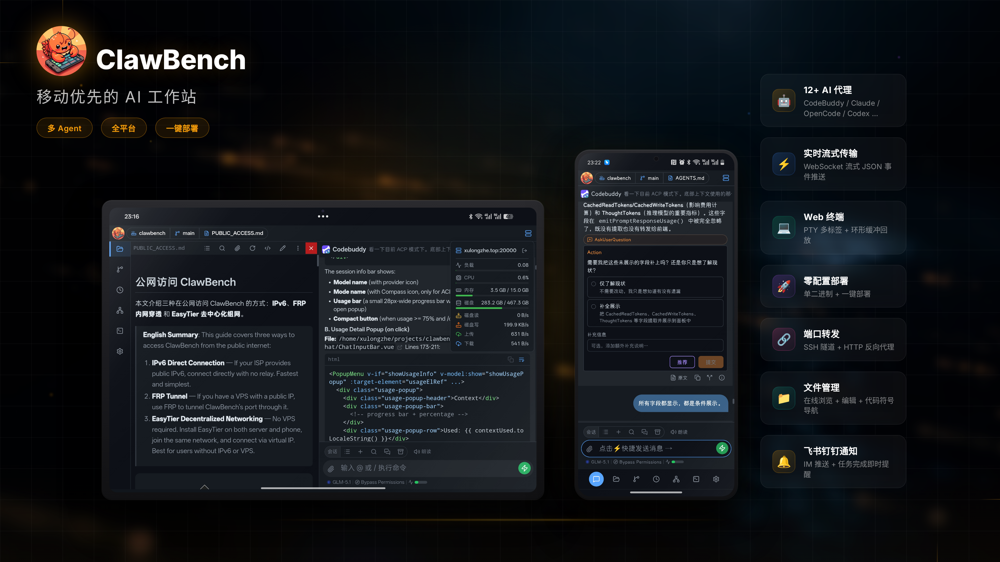

# Product Hero Image

ClawBench product hero image showcasing the mobile and tablet experience.



## Live Preview

Open `screenshots/product_hero.html` in a browser to view the full interactive version.

## Assets

| File | Description |
|------|-------------|
| `screenshots/product_hero.png` | Final export (1920×1080, 2x DPR) |
| `screenshots/product_hero.html` | Pure HTML/CSS version, editable |
| `screenshots/product_hero_assets/bg_tech.jpg` | MiniMax-generated tech background |
| `screenshots/product_hero_assets/phone_screenshot.jpg` | Phone screenshot |
| `screenshots/product_hero_assets/tablet_screenshot.jpg` | Tablet screenshot |
| `screenshots/product_hero_assets/logo.png` | ClawBench Logo |

## Customization

Edit the following in `product_hero.html`:

- **Device sizes**: `width` and `height` of `.tablet-screen` / `.phone-screen`
- **Feature highlights**: Right-side `.feature-card` section
- **Branding**: Top-left `.brand` section
- **Background**: Replace `bg_tech.jpg` or modify `filter` on `.bg-image`

Re-export after changes:

```bash
cd docs
node -e "
const { chromium } = require('playwright');
(async () => {
  const browser = await chromium.launch();
  const page = await browser.newPage({
    viewport: { width: 1920, height: 1080 },
    deviceScaleFactor: 2,
  });
  await page.goto('file://' + process.cwd() + '/screenshots/product_hero.html');
  await page.waitForTimeout(2000);
  await page.screenshot({ path: 'screenshots/product_hero.png', fullPage: false });
  await browser.close();
  console.log('Done');
})();
"
```
