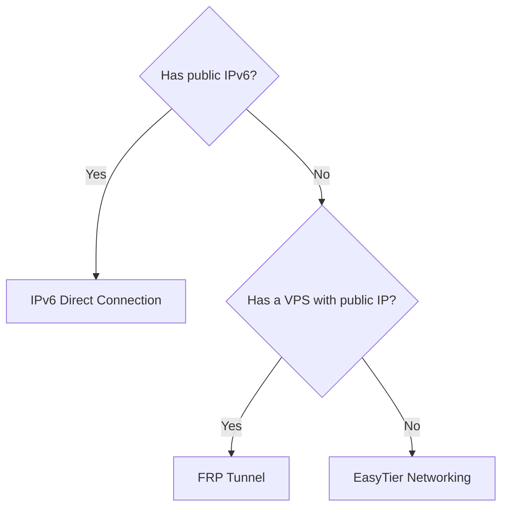

# Accessing ClawBench from the Public Internet

This guide covers three ways to access ClawBench from the public internet: **IPv6**, **FRP tunnel**, and **EasyTier decentralized networking**.



---

## Method 1: IPv6 Public Direct Connection

Most home broadband connections in China now support IPv6. This is the simplest and most stable way to access the public internet — no third-party relay, with fast direct connections and low latency.

### 1. Confirm IPv6 Support

On the server, run:

```bash
ip -6 addr show
```

If you see an address starting with `inet6`, the server has an IPv6 address. For example:

```
2: eth0: <...> mtu 1500 state UP qlen 1000
    inet6 240e:390:1234:5678::123/64 scope global
    inet6 fe80::abcd:ef01:2345:6789/64 scope link
```

Focus on the address with `scope global` — that is your public IPv6 address.

### 2. Configure the Router

Most home routers enable IPv6 by default, but the configuration entry differs by brand:

| Brand | Typical Settings Path | Recommended Mode |
|-------|-----------------------|------------------|
| **TP-Link / Mercury / FAST** | Advanced Settings → IPv6 → Enable | `PPPoEv6` or `Auto-config (SLAAC)` |
| **Xiaomi / Redmi** | Common Settings → Internet → IPv6 toggle | `Native` or `DHCPv6` |
| **Huawei / Honor Router** | More Functions → Network Settings → IPv6 | `Auto-config (SLAAC + DHCPv6)` |
| **ASUS** | Advanced Settings → IPv6 | `Native (PPPoE)` or `Passthrough` |
| **OpenWrt** | Network → Interfaces → WAN → IPv6 Settings | `DHCPv6 Client` + request prefix |
| **iKuai** | Network Settings → IPv6 → WAN | `Auto` or `PPPoE`, enable `RA Advertisement` on LAN |

**Key points:**
- Make sure the router's **IPv6 firewall** (also called SPI firewall or IPv6 inbound filtering) allows the ClawBench port (default `20000`)
- If the optical modem is in router mode, enable IPv6 on it and allow the port as well
- Recommended: assign the server a **fixed IPv6 address** (static DHCPv6 assignment or manual configuration on the device)

### 3. Start ClawBench

```bash
clawbench
```

By default it listens on `0.0.0.0:20000`, and IPv6 works automatically.

To change the port:

```bash
clawbench -p 20080
```

### 4. Access

From an external phone or computer, visit:

```
http://[240e:390:1234:5678::123]:20000
```

> ⚠️ IPv6 addresses must be wrapped in `[]`.

If you can't remember the address, use **DDNS** (dynamic DNS, e.g. `dynv6.com`, `ddns-go`) to bind the IPv6 address to a domain:

```
http://your-clawbench.dynv6.net:20000
```

> **Note**: Some mobile hotspots or 4G/5G networks may not assign IPv6 addresses, in which case IPv6 access won't work. Keep this as a backup or run a dual-stack setup.

---

## Method 2: FRP Tunnel

If your network has no public IPv6 (e.g. behind CGNAT), FRP is the most mature option. You need a **server with a public IP** (VPS) or use a **free FRP provider** as a relay.

### Architecture

```
Phone → FRP public server (vps:7000) → ClawBench (LAN, FRP client runs in-process) → ClawBench
```

### FRP Configuration in ClawBench

ClawBench has a built-in FRP client (runs in-process as a Go library — **no separate frpc client to install**), and all configuration is done in the Web settings panel.

#### Step 1: Open FRP Settings

In the ClawBench web UI, go to **Settings → FRP Tunnel**.

#### Step 2: Fill in the FRP Connection Info

| Setting | Description |
|---------|-------------|
| **Enable FRP Tunnel** | Turn on the switch to enable FRP tunneling |
| **FRP Server Address** | Your FRP public server IP or domain, e.g. `120.26.168.245` |
| **FRP Server Port** | The FRP server control port, default `7000` |
| **FRP Auth Token** | Authentication key matching the server configuration |
| **Auto Allocate Port** | Switch (see below) |

#### Step 3: About Auto-Allocated Port

- **Enable "Auto Allocate Port"** (recommended): frps allocates the remote port automatically from the `allowPorts` range — no manual entry needed. After saving, wait a few seconds; the page will show the actual allocated remote port.
- **Disable "Auto Allocate Port"**: two extra fields appear:
  - **Remote Port**: the public mapping port for the ClawBench HTTP service
  - **SSH Remote Port**: the public mapping port for the SSH channel (optional, for terminal features)

#### Step 4: Save and Check Status

After clicking **Save**, ClawBench automatically starts the FRP tunnel connection. The status indicator shows:

| Color | Meaning |
|-------|---------|
| 🟡 Yellow | Connecting... |
| 🟢 Green | Tunnel established, ready to access |
| 🔴 Red | Connection failed (check address, port, token) |

### Access

Once the tunnel is up, access from your phone using the FRP public server's address and the mapped port:

```
http://YOUR_FRP_SERVER_IP:MAP_PORT
```

If **Auto Allocate Port** is enabled, the mapped port is shown automatically on the FRP settings page — no need to memorize it.

### Recommended Free FRP Providers

These providers offer free FRP nodes, suitable for trying it out or light use:

| Provider | Website | Highlights |
|----------|---------|------------|
| **NATEE** | [https://www.natee.net](https://www.natee.net) | Fast from China, 2 free tunnels, register and go |
| **OpenFRP** | [https://www.openfrp.net](https://www.openfrp.net) | Community-run free nodes, multiple routes, token auth required |
| **Starry Frp** | [https://starryfrp.com](https://starryfrp.com) | Non-profit project, multiple domestic nodes, real-name registration |
| **SAKURA FRP** | [https://www.natfrp.com](https://www.natfrp.com) | Long-standing free tunneling service, free traffic quota, rich tutorials |
| **GoFrp** | [https://gofrp.org](https://gofrp.org) | Open-source community edition; reference for self-hosted nodes |

> Note when using free services: free nodes have limited bandwidth and traffic, suitable only for light use; for important data, prefer encrypted transport or a self-hosted VPS FRP service.

### Getting ServerAddr / ServerPort / Token from a Free FRP Provider

Using **NATEE** as an example (other providers work similarly):

1. Register and log in at [NATEE](https://www.natee.net)
2. Create a TCP tunnel in the console, choosing the node closest to you
3. View the tunnel details — you'll get:
   - **Server address** (ServerAddr, e.g. `cn-bj.natee.net`)
   - **Server port** (ServerPort, e.g. `7000` — **note this is the control port, not the tunnel mapping port**)
   - **Auth token** (e.g. `xxxx-xxxx-xxxx`)
4. Fill these into ClawBench's FRP settings panel
5. Enable **Auto Allocate Port**, save, wait a moment, and the page will automatically show the allocated remote port

> 💡 Free FRP providers usually allocate the remote port automatically, so enabling **Auto Allocate Port** in ClawBench is the most hassle-free choice.

---

## Method 3: EasyTier Decentralized Networking

EasyTier is a simple, secure, decentralized intranet tunneling and networking solution built with Rust and the Tokio framework. Unlike FRP, which needs a public server to relay, EasyTier connects nodes directly via P2P hole punching — no public IP required.

### Features

- **Decentralized**: no central server; nodes are equal and independent, and can relay for each other
- **No public IP needed**: uses community-provided free public nodes to assist hole punching; after punching succeeds, nodes connect directly via P2P
- **WireGuard encryption**: all traffic is automatically encrypted for security
- **NAT traversal**: supports UDP/TCP multi-protocol hole punching for complex network environments
- **Subnet proxy**: expose a reachable subnet to the virtual network; other nodes access the LAN through that node
- **Smart routing**: multi-path support, automatic switching to healthy links, graceful degradation under high packet loss
- **Cross-platform**: supports Linux, macOS, Windows, Android
- **IPv6 support**: supports IPv6 networking

### Architecture

```
Android phone (EasyTier App, virtual IP 10.10.10.2) ←→ public node (hole-punch assist) ←→ ClawBench server (EasyTier node, virtual IP 10.10.10.1)
                                  ↑ Direct P2P connection after successful hole punching, no relay
```

### Step 1: Install EasyTier

Download the CLI program for your platform from the [EasyTier official site](https://easytier.cn/guide/download.html) or [GitHub Releases](https://github.com/EasyTier/EasyTier/releases).

**Linux (x86_64)**:

```bash
wget https://github.com/EasyTier/EasyTier/releases/latest/download/easytier-linux-x86_64.zip
unzip easytier-linux-x86_64.zip
chmod +x easytier-core easytier-cli
```

**Windows**: download `easytier-windows-x86_64.zip`, unzip to get `easytier-core.exe` and `easytier-cli.exe`.

**macOS**: download `easytier-darwin-aarch64.zip`, unzip and grant execute permission.

> EasyTier also offers a GUI program, suitable for users unfamiliar with the command line.

### Step 2: Start EasyTier on the ClawBench Server

On the server running ClawBench, run with administrator/root privileges:

```bash
easytier-core --network-name my-clawbench --network-secret my-secret-password --ipv4 10.10.10.1 -p tcp://public.easytier.top:11010
```

Parameter description:

| Parameter | Description |
|-----------|-------------|
| `--network-name` | Virtual network name; all nodes must match to discover and communicate |
| `--network-secret` | Network password, used for authentication and communication encryption; all nodes must match |
| `--ipv4` | This node's virtual IPv4 address; must differ per node (e.g. 10.10.10.1, 10.10.10.2) |
| `-p tcp://public.easytier.top:11010` | Public node address, assists NAT hole punching and node discovery (officially free) |

> `-p` can be specified multiple times for more stable connections, or replaced with a self-hosted node address.

For auto-start on boot, create a systemd service (Linux):

```bash
# Create service file
cat > /etc/systemd/system/easytier.service << 'EOF'
[Unit]
Description=EasyTier Service
After=network.target

[Service]
Type=simple
ExecStart=/usr/local/bin/easytier-core --network-name my-clawbench --network-secret my-secret-password --ipv4 10.10.10.1 -p tcp://public.easytier.top:11010
Restart=on-failure
RestartSec=5

[Install]
WantedBy=multi-user.target
EOF

# Enable and start
systemctl daemon-reload
systemctl enable easytier --now
```

### Step 3: Start EasyTier on the Android Phone

1. Download the Android APK (`app-universal-release.apk`) from the [EasyTier download page](https://easytier.cn/guide/download.html) or [GitHub Releases](https://github.com/EasyTier/EasyTier/releases), and install it

2. Open the EasyTier app and fill in the networking info:

| Setting | Value |
|---------|-------|
| **Virtual IPv4 address** | `10.10.10.2` (each node differs; phone uses 10.10.10.2) |
| **Network name** | Same as the server, e.g. `my-clawbench` |
| **Network password** | Same as the server, e.g. `my-secret-password` |
| **Public server** | Select the default official public node `tcp://public.easytier.top:11010` |

3. Tap **Run network** and wait for the connection to succeed

> **Note**: `--network-name` and `--network-secret` must exactly match the server; the virtual IPv4 address must not duplicate the server's.

> If the phone also uses a VPN (e.g. Clash), enable **TUN-less mode** in the EasyTier app, set the Socks5 port to a non-conflicting value (e.g. `15555`), then route the virtual subnet (`10.0.0.0/8`) to EasyTier's Socks5 proxy in the VPN.

### Step 4: Verify Networking Status

After startup, use `easytier-cli` to check the networking status:

```bash
easytier-cli peer list    # view connected peer nodes
easytier-cli route list   # view virtual network routes
easytier-cli node list    # view node info
```

### Step 5: Access ClawBench

Once networking is up, access via the ClawBench server's virtual IP:

```
http://10.10.10.1:20000
```

No need to remember the address — the virtual IP is fixed (as long as the configuration doesn't change).

### Subnet Proxy (optional)

If your ClawBench server is on a LAN and you want remote devices to also reach other LAN services, add a subnet proxy when starting EasyTier:

```bash
easytier-core --network-name my-clawbench --network-secret my-secret-password \
  --ipv4 10.10.10.1 -p tcp://public.easytier.top:11010 \
  -n 192.168.1.0/24
```

The `-n` parameter specifies the LAN subnet to proxy; other nodes can then reach devices on that LAN (e.g. NAS, printers) through the virtual network.

### Config File Mode (recommended for long-term use)

Command-line arguments are good for debugging; for long-term use a config file is recommended. First start with the command line, then export the config:

```bash
easytier-cli node config > config.toml
```

Then start with the config file:

```bash
easytier-core -c config.toml
```

---

## Summary

| Method | Pros | Cons | Recommended Use Case |
|--------|------|------|----------------------|
| **IPv6 direct** | No relay, low latency, zero cost | Requires IPv6 network, firewall config | First choice when home broadband supports IPv6 |
| **FRP tunnel** | Doesn't rely on IPv6, stable and reliable | Needs a VPS or free service; traffic is relayed | NAT networks, no public IPv6 |
| **EasyTier** | No public IP needed, P2P direct with low latency, decentralized, encrypted | Relies on public nodes to assist hole punching; strict symmetric NAT may prevent direct connection | Multi-device remote interconnect, no-VPS scenarios |

The three methods can be deployed simultaneously as backups; switch flexibly based on your actual network environment.
