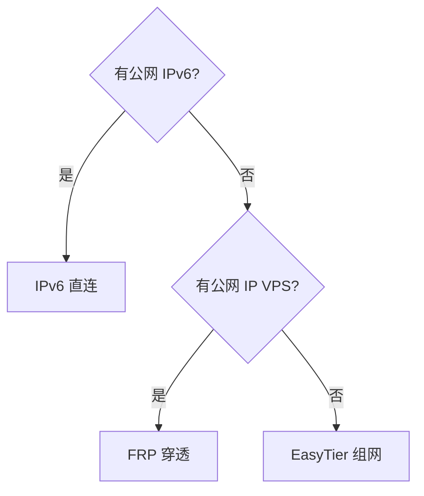

# 公网访问 ClawBench

本文介绍三种在公网访问 ClawBench 的方式：**IPv6**、**FRP 内网穿透** 和 **EasyTier 去中心化组网**。

> **English Summary**: This guide covers three ways to access ClawBench from the public internet:
> 1. **IPv6 Direct Connection** — If your ISP provides public IPv6, connect directly with no relay. Fastest and simplest.
> 2. **FRP Tunnel** — If you have a VPS with a public IP, use FRP to tunnel ClawBench's port through it.
> 3. **EasyTier Decentralized Networking** — No VPS required. Install EasyTier on both server and phone, join the same network, and connect via virtual IP. Best for users without IPv6 or VPS.




---

## 方式一：IPv6 公网直连

目前国内大部分家用宽带都已支持 IPv6，这是最简单、最稳定的公网访问方式——无需第三方中转，直连速度快、延迟低。

### 1. 确认 IPv6 支持

在服务端执行：

```bash
ip -6 addr show
```

如果出现 `inet6` 开头的地址，说明服务器已获得 IPv6 地址。例如：

```
2: eth0: <...> mtu 1500 state UP qlen 1000
    inet6 240e:390:1234:5678::123/64 scope global
    inet6 fe80::abcd:ef01:2345:6789/64 scope link
```

重点关注 `scope global` 的地址，那是公网 IPv6 地址。

### 2. 配置路由器

大多数家用路由器默认已开启 IPv6，但不同品牌配置入口不同：

| 品牌 | 典型设置路径 | 推荐模式 |
|------|-------------|---------|
| **TP-Link / 水星 / 迅捷** | 高级设置 → IPv6 → 开启 | `PPPoEv6` 或 `自动获取地址（SLAAC）` |
| **小米 / Redmi** | 常用设置 → 上网设置 → IPv6 开关 | `Native（原生）` 或 `DHCPv6` |
| **华为 / 荣耀路由** | 更多功能 → 网络设置 → IPv6 | `自动配置（SLAAC + DHCPv6）` |
| **华硕（ASUS）** | 高级设置 → IPv6 | `Native（PPPoE 拨号）` 或 `Passthrough` |
| **OpenWrt** | 网络 → 接口 → WAN → IPv6 设置 | `DHCPv6 Client` + 申请前缀 |
| **iKuai（爱快）** | 网络设置 → IPv6 → WAN 口 | `自动获取`或 `PPPoE`，LAN 口开启`RA 通告` |

**关键要点：**
- 确保路由器的 **IPv6 防火墙**（或称为 SPI 防火墙、IPv6 入站过滤）放行 ClawBench 端口（默认 `20000`）
- 如果光猫是路由模式，光猫也需要开启 IPv6 并放行端口
- 推荐将服务器设为 **固定 IPv6 地址**（DHCPv6 静态分配或在设备上手动配置）

### 3. 启动 ClawBench

```bash
clawbench
```

默认监听 `0.0.0.0:20000`，IPv6 也会自动生效。

如需修改端口：

```bash
clawbench -p 20080
```

### 4. 访问

从外网手机或电脑访问：

```
http://[240e:390:1234:5678::123]:20000
```

> ⚠️ IPv6 地址需要用 `[]` 包裹。

如果记不住地址，可使用 **DDNS**（动态域名解析，如 `dynv6.com`、`ddns-go`）将 IPv6 地址绑定到域名：

```
http://your-clawbench.dynv6.net:20000
```

> **注意**：部分手机热点或 4G/5G 网络可能未分配 IPv6 地址，此时无法通过 IPv6 访问。建议作为备选或双栈方案。

---

## 方式二：FRP 内网穿透

如果您的网络没有公网 IPv6（例如仅 CGNAT 大内网），FRP 是最成熟的方案。您需要一台**有公网 IP 的服务器**（VPS）或使用**免费 FRP 服务商**做中转。

### 架构说明

```
手机 → FRP 公网服务器 (vps:7000) → ClawBench (内网, FRP 客户端进程内运行) → ClawBench
```

### ClawBench 中的 FRP 配置

ClawBench 已内置 FRP 客户端（作为 Go 库在进程内运行，**无需单独安装 frpc 客户端**），所有配置均在 Web 设置面板中完成。

#### 步骤一：打开 FRP 设置

在 ClawBench Web 界面中，进入 **设置 → FRP 隧道**。

#### 步骤二：填写 FRP 连接信息

| 设置项 | 说明 |
|--------|------|
| **启用 FRP 隧道** | 打开开关启用 FRP 穿透 |
| **FRP 服务器地址** | 你的 FRP 公网服务器 IP 或域名，例如 `120.26.168.245` |
| **FRP 服务器端口** | FRP 服务端控制端口，默认 `7000` |
| **FRP 认证 Token** | 与服务端配置一致的认证密钥 |
| **自动分配端口** | 开关（见下方说明） |

#### 步骤三：关于自动分配端口

- **开启「自动分配端口」**（推荐）：frps 从 `allowPorts` 范围内自动分配远程端口，无需手动指定。保存后等待几秒，页面会显示分配到的实际远程端口。
- **关闭「自动分配端口」**：出现两个额外字段：
  - **远程端口**：ClawBench HTTP 服务的公网映射端口
  - **SSH 远程端口**：SSH 通道的公网映射端口（可选，用于终端功能）

#### 步骤四：保存并查看状态

点击 **保存** 后，ClawBench 会自动启动 FRP 隧道连接。状态指示点显示：

| 颜色 | 含义 |
|------|------|
| 🟡 黄色 | 正在连接... |
| 🟢 绿色 | 隧道已建立，可以访问 |
| 🔴 红色 | 连接失败（检查地址、端口、Token） |

### 访问方式

隧道建立后，在手机上通过 FRP 公网服务器的地址和映射端口访问：

```
http://你的FRP服务器IP:映射端口
```

如果 **自动分配端口** 开启，映射端口会在 FRP 设置页面自动显示，无需记忆。

### 免费 FRP 服务推荐

以下服务商提供免费 FRP 节点，适合体验或轻量使用：

| 服务商 | 官网 | 特点 |
|-------|------|------|
| **NATEE** | [https://www.natee.net](https://www.natee.net) | 国内访问快，免费提供 2 条隧道，注册即用 |
| **OpenFRP** | [https://www.openfrp.net](https://www.openfrp.net) | 社区运营免费节点，多线路可选，需 Token 认证 |
| **Starry Frp** | [https://starryfrp.com](https://starryfrp.com) | 公益项目，国内多节点，需实名注册 |
| **SAKURA FRP** | [https://www.natfrp.com](https://www.natfrp.com) | 老牌免费穿透服务，有免费流量额度，教程丰富 |
| **GoFrp** | [https://gofrp.org](https://gofrp.org) | 开源社区版，自建节点可参考 |

> 使用免费服务时请注意：免费节点的带宽和流量有限，仅适合轻量使用；重要数据建议加密传输或自建 VPS FRP 服务。

### 获取免费 FRP 的 ServerAddr / ServerPort / Token

以 **NATEE** 为例（其他服务商操作类似）：

1. 注册并登录 [NATEE](https://www.natee.net)
2. 在控制台创建一条 TCP 隧道，选择离你最近的节点
3. 查看隧道详情，你会得到：
   - **服务器地址**（ServerAddr，如 `cn-bj.natee.net`）
   - **服务器端口**（ServerPort，如 `7000`，**注意这是控制端口，不是隧道映射端口**）
   - **认证 Token**（如 `xxxx-xxxx-xxxx`）
4. 将这些填入 ClawBench 的 FRP 设置面板
5. 开启 **自动分配端口**，保存后稍等片刻，页面将自动显示分配到的远程端口

> 💡 免费 FRP 服务商通常会自动分配远程端口，因此在 ClawBench 中**开启「自动分配端口」**是最省心的选择。

---

## 方式三：EasyTier 去中心化组网

EasyTier 是一款简单、安全、去中心化的内网穿透与异地组网方案，使用 Rust 语言和 Tokio 框架实现。与 FRP 需要公网服务器中转不同，EasyTier 通过 P2P 打洞实现节点直连，无需公网 IP 即可组网。

### 特点

- **去中心化**：无需中心服务器，节点平等独立，可互相转发
- **无需公网 IP**：支持社区提供的免费公共节点辅助打洞，打洞成功后 P2P 直连
- **WireGuard 加密**：所有通信流量自动加密，保障安全
- **NAT 穿透**：支持 UDP/TCP 多协议打洞，应对复杂网络环境
- **子网代理**：可将可访问的网段暴露给虚拟网络，其他节点通过该节点访问局域网
- **智能路由**：多路径支持，自动切换健康链路，高丢包时自动降级
- **跨平台**：支持 Linux、macOS、Windows、Android
- **IPv6 支持**：支持 IPv6 组网

### 架构说明

```
Android 手机 (EasyTier App, 虚拟IP 10.10.10.2) ←→ 公共节点 (辅助打洞) ←→ ClawBench 服务器 (EasyTier 节点, 虚拟IP 10.10.10.1)
                                  ↑ P2P 打洞成功后直连，无需中转
```

### 步骤一：安装 EasyTier

前往 [EasyTier 官网](https://easytier.cn/guide/download.html) 或 [GitHub Releases](https://github.com/EasyTier/EasyTier/releases) 下载对应平台的命令行程序（CLI）。

**Linux（x86_64）**：

```bash
wget https://github.com/EasyTier/EasyTier/releases/latest/download/easytier-linux-x86_64.zip
unzip easytier-linux-x86_64.zip
chmod +x easytier-core easytier-cli
```

**Windows**：下载 `easytier-windows-x86_64.zip`，解压后获得 `easytier-core.exe` 和 `easytier-cli.exe`。

**macOS**：下载 `easytier-darwin-aarch64.zip`，解压后赋予执行权限。

> EasyTier 也提供 GUI 图形界面程序，适合不熟悉命令行的用户。

### 步骤二：在 ClawBench 服务器上启动 EasyTier

在运行 ClawBench 的服务器上，以管理员/root 权限执行：

```bash
easytier-core --network-name my-clawbench --network-secret my-secret-password --ipv4 10.10.10.1 -p tcp://public.easytier.top:11010
```

参数说明：

| 参数 | 说明 |
|------|------|
| `--network-name` | 虚拟网络名称，所有节点必须相同才能互相发现和通信 |
| `--network-secret` | 网络密码，用于身份认证和通信加密，所有节点必须相同 |
| `--ipv4` | 本节点的虚拟 IPv4 地址，每个节点必须不同（如 10.10.10.1、10.10.10.2 等） |
| `-p tcp://public.easytier.top:11010` | 公共节点地址，辅助 NAT 打洞和节点发现（官方免费提供） |

> `-p` 可指定多个公共节点以提高连接稳定性，也可以用自建节点地址替代。

如需开机自启，可创建 systemd 服务（Linux）：

```bash
# 创建服务文件
cat > /etc/systemd/system/easytier.service << 'EOF'
[Unit]
Description=EasyTier Service
After=network.target

[Service]
Type=simple
ExecStart=/usr/local/bin/easytier-core --network-name my-clawbench --network-secret my-secret-password --ipv4 10.10.10.1 -p tcp://public.easytier.top:11010
Restart=on-failure
RestartSec=5

[Install]
WantedBy=multi-user.target
EOF

# 启用并启动
systemctl daemon-reload
systemctl enable easytier --now
```

### 步骤三：在 Android 手机上启动 EasyTier

1. 从 [EasyTier 官网下载页](https://easytier.cn/guide/download.html) 或 [GitHub Releases](https://github.com/EasyTier/EasyTier/releases) 下载 Android APK（`app-universal-release.apk`），安装到手机上

2. 打开 EasyTier App，填写组网信息：

| 设置项 | 填写内容 |
|--------|----------|
| **虚拟 IPv4 地址** | `10.10.10.2`（每个节点不同，如手机用 10.10.10.2） |
| **网络名称** | 与服务端一致，如 `my-clawbench` |
| **网络密码** | 与服务端一致，如 `my-secret-password` |
| **公共服务器** | 选择默认的官方公共节点 `tcp://public.easytier.top:11010` |

3. 点击 **运行网络**，等待连接成功

> **注意**：`--network-name` 和 `--network-secret` 必须与服务端完全一致；虚拟 IPv4 地址不能与服务端重复。

> 如果手机同时使用 VPN（如 Clash），请在 EasyTier App 中开启 **无 TUN 模式**，并将 Socks5 端口设置为非冲突端口（如 `15555`），然后在 VPN 中将虚拟网段（`10.0.0.0/8`）路由到 EasyTier 的 Socks5 代理。

### 步骤四：验证组网状态

启动后，可使用 `easytier-cli` 查看组网状态：

```bash
easytier-cli peer list    # 查看已连接的对等节点
easytier-cli route list   # 查看虚拟网络路由
easytier-cli node list    # 查看节点信息
```

### 步骤五：访问 ClawBench

组网成功后，通过 ClawBench 服务器的虚拟 IP 地址访问：

```
http://10.10.10.1:20000
```

无需记忆地址，虚拟 IP 是固定的（只要配置不变）。

### 子网代理（可选）

如果你的 ClawBench 服务器在局域网中，想让远程设备也能访问局域网其他服务，可在启动 EasyTier 时添加子网代理：

```bash
easytier-core --network-name my-clawbench --network-secret my-secret-password \
  --ipv4 10.10.10.1 -p tcp://public.easytier.top:11010 \
  -n 192.168.1.0/24
```

`-n` 参数指定要代理的局域网网段，其他节点即可通过虚拟网络访问该局域网中的设备（如 NAS、打印机等）。

### 配置文件方式（推荐长期使用）

命令行参数适合调试，长期使用建议配置文件方式。先用命令行方式启动，然后导出配置文件：

```bash
easytier-cli node config > config.toml
```

后续使用配置文件启动：

```bash
easytier-core -c config.toml
```

---

## 总结

| 方式 | 优点 | 缺点 | 推荐场景 |
|------|------|------|---------|
| **IPv6 直连** | 无中转、低延迟、零成本 | 需要 IPv6 网络环境、需配置防火墙 | 家庭宽带支持 IPv6 时首选 |
| **FRP 穿透** | 不依赖 IPv6、稳定可靠 | 需一台 VPS 或依赖免费服务、流量经中转 | NAT 内网、无公网 IPv6 的环境 |
| **EasyTier 组网** | 无需公网 IP、P2P 直连低延迟、去中心化、加密安全 | 依赖公共节点辅助打洞、严格对称型 NAT 可能无法直连 | 多设备异地互联、无需 VPS 的场景 |

三种方式可同时部署互为备份，根据实际网络环境灵活切换。
