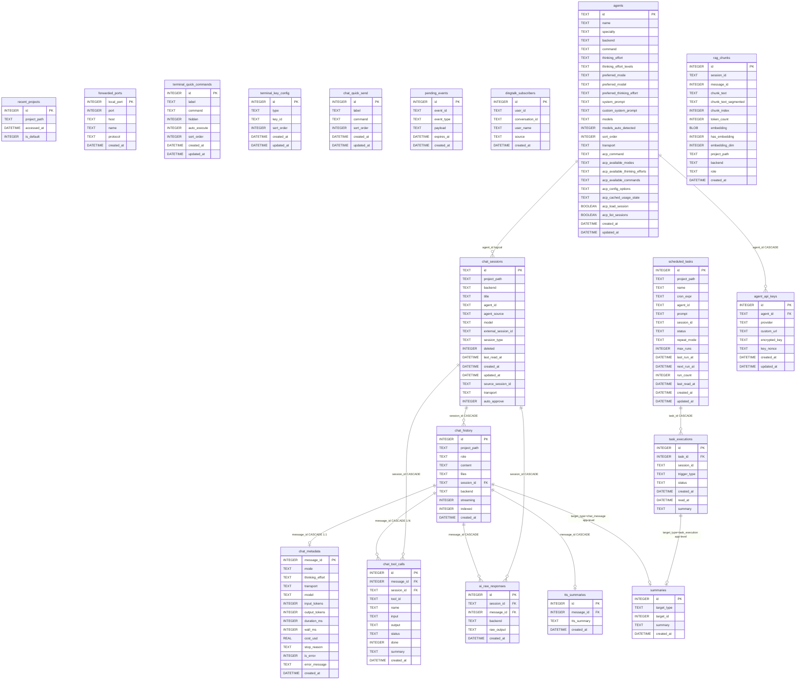

# ClawBench 数据库

主库：`{DataDir}/ClawBench.db`（SQLite，WAL 模式，foreign_keys=ON）
RAG：同一数据库文件，独立连接池

## 表定义

### chat_sessions（聊天会话）

| 列名 | 类型 | 约束 | 默认值 | 说明 |
|---|---|---|---|---|
| id | TEXT | PRIMARY KEY | — | 会话 UUID |
| project_path | TEXT | NOT NULL | — | 项目根路径 |
| backend | TEXT | NOT NULL | — | AI 后端名称 |
| title | TEXT | NOT NULL | — | 会话显示标题 |
| agent_id | TEXT | | `''` | 关联的 Agent |
| agent_source | TEXT | | `'default'` | Agent 来源 |
| model | TEXT | | `''` | LLM 模型 |
| external_session_id | TEXT | | `''` | 外部 CLI 会话 ID |
| session_type | TEXT | NOT NULL | `'chat'` | chat / task |
| deleted | INTEGER | NOT NULL | `0` | 软删除标记 |
| last_read_at | DATETIME | | — | 最后阅读时间 |
| created_at | DATETIME | | CURRENT_TIMESTAMP | 创建时间 |
| updated_at | DATETIME | | CURRENT_TIMESTAMP | 更新时间 |
| source_session_id | TEXT | | `NULL` | 续接的源会话 |
| transport | TEXT | | `''` | 传输方式：cli / acp |
| auto_approve | INTEGER | NOT NULL | `0` | 自动批准模式 |

UNIQUE：`(project_path, backend, id)`

### chat_history（聊天消息）

| 列名 | 类型 | 约束 | 默认值 | 说明 |
|---|---|---|---|---|
| id | INTEGER | PRIMARY KEY AUTOINCREMENT | — | 消息 ID |
| project_path | TEXT | NOT NULL | — | 项目根路径 |
| role | TEXT | NOT NULL, CHECK(role IN ('user','assistant')) | — | 消息角色 |
| content | TEXT | NOT NULL | — | 消息内容 |
| files | TEXT | | — | 附件 JSON |
| session_id | TEXT | | — | FK → chat_sessions.id (CASCADE) |
| backend | TEXT | NOT NULL | `'claude'` | AI 后端名称 |
| streaming | INTEGER | NOT NULL | `0` | 1=正在流式输出 |
| indexed | INTEGER | NOT NULL | `0` | RAG 已索引标记 |
| created_at | DATETIME | | CURRENT_TIMESTAMP | 创建时间 |

### chat_metadata（消息元数据）

| 列名 | 类型 | 约束 | 默认值 | 说明 |
|---|---|---|---|---|
| message_id | INTEGER | PRIMARY KEY, FK → chat_history.id (CASCADE) | — | 与 chat_history 1:1 |
| mode | TEXT | | `''` | 模式：chat / plan / code |
| thinking_effort | TEXT | | `''` | 思考力度等级 |
| transport | TEXT | | `''` | 传输方式：cli / acp |
| model | TEXT | | `''` | 使用的模型 |
| input_tokens | INTEGER | | `0` | 输入 token 数 |
| output_tokens | INTEGER | | `0` | 输出 token 数 |
| duration_ms | INTEGER | | `0` | 处理耗时（毫秒） |
| wall_ms | INTEGER | | `0` | 墙钟耗时（毫秒） |
| cost_usd | REAL | | `0` | 费用（美元） |
| stop_reason | TEXT | | `''` | 停止原因 |
| is_error | INTEGER | | `0` | 是否出错 |
| error_message | TEXT | | `''` | 错误信息 |
| created_at | DATETIME | | CURRENT_TIMESTAMP | 创建时间 |

### chat_tool_calls（工具调用）

| 列名 | 类型 | 约束 | 默认值 | 说明 |
|---|---|---|---|---|
| id | INTEGER | PRIMARY KEY AUTOINCREMENT | — | |
| message_id | INTEGER | NOT NULL, FK → chat_history.id (CASCADE) | — | 所属消息 |
| session_id | TEXT | NOT NULL | — | FK → chat_sessions.id (CASCADE) |
| tool_id | TEXT | NOT NULL | — | 工具调用 ID |
| name | TEXT | NOT NULL | — | 工具名称 |
| input | TEXT | NOT NULL | `'{}'` | 输入 JSON |
| output | TEXT | NOT NULL | `''` | 输出文本 |
| status | TEXT | NOT NULL | `''` | 调用状态 |
| done | INTEGER | NOT NULL | `0` | 完成标记 |
| summary | TEXT | NOT NULL | `''` | 工具结果摘要 |
| created_at | DATETIME | | CURRENT_TIMESTAMP | 创建时间 |

UNIQUE：`(tool_id, message_id)`

### ai_raw_responses（原始响应）

| 列名 | 类型 | 约束 | 默认值 | 说明 |
|---|---|---|---|---|
| id | INTEGER | PRIMARY KEY AUTOINCREMENT | — | |
| session_id | TEXT | NOT NULL | — | FK → chat_sessions.id (CASCADE) |
| message_id | INTEGER | NOT NULL, FK → chat_history.id (CASCADE) | — | 所属消息 |
| backend | TEXT | NOT NULL | `''` | 后端名称 |
| raw_output | TEXT | NOT NULL | — | 原始 CLI 输出 |
| created_at | DATETIME | | CURRENT_TIMESTAMP | 创建时间 |

### summaries（摘要）

| 列名 | 类型 | 约束 | 默认值 | 说明 |
|---|---|---|---|---|
| id | INTEGER | PRIMARY KEY AUTOINCREMENT | — | |
| target_type | TEXT | NOT NULL | — | 目标类型：chat_message / task_execution |
| target_id | INTEGER | NOT NULL | — | 多态外键（应用层） |
| summary | TEXT | NOT NULL | — | 摘要文本 |
| created_at | DATETIME | | CURRENT_TIMESTAMP | 创建时间 |

UNIQUE：`(target_type, target_id)`

### tts_summaries（TTS 摘要）

| 列名 | 类型 | 约束 | 默认值 | 说明 |
|---|---|---|---|---|
| id | INTEGER | PRIMARY KEY AUTOINCREMENT | — | |
| message_id | INTEGER | NOT NULL | — | FK → chat_history.id (CASCADE) |
| tts_summary | TEXT | NOT NULL | — | 适合语音播报的摘要 |
| created_at | DATETIME | | CURRENT_TIMESTAMP | 创建时间 |

UNIQUE：`(message_id)`

### scheduled_tasks（定时任务）

| 列名 | 类型 | 约束 | 默认值 | 说明 |
|---|---|---|---|---|
| id | INTEGER | PRIMARY KEY AUTOINCREMENT | — | |
| project_path | TEXT | NOT NULL | — | 项目根路径 |
| name | TEXT | NOT NULL | — | 任务名称 |
| cron_expr | TEXT | NOT NULL | — | Cron 调度表达式 |
| agent_id | TEXT | NOT NULL | — | FK → agents.id（逻辑关联，无 DB 外键） |
| prompt | TEXT | NOT NULL | — | 提示词模板 |
| session_id | TEXT | | `''` | 关联会话 |
| status | TEXT | | `'active'` | 状态：active / paused / deleted |
| repeat_mode | TEXT | | `'unlimited'` | 重复模式：unlimited / fixed |
| max_runs | INTEGER | | `0` | 最大执行次数，0=不限 |
| last_run_at | DATETIME | | — | 上次执行时间 |
| next_run_at | DATETIME | | — | 下次调度时间 |
| run_count | INTEGER | | `0` | 累计执行次数 |
| last_read_at | DATETIME | | — | 最后阅读时间 |
| created_at | DATETIME | | CURRENT_TIMESTAMP | 创建时间 |
| updated_at | DATETIME | | CURRENT_TIMESTAMP | 更新时间 |

### task_executions（任务执行记录）

| 列名 | 类型 | 约束 | 默认值 | 说明 |
|---|---|---|---|---|
| id | INTEGER | PRIMARY KEY AUTOINCREMENT | — | |
| task_id | INTEGER | NOT NULL, FK → scheduled_tasks.id (CASCADE) | — | 所属任务 |
| session_id | TEXT | NOT NULL | — | 执行会话 |
| trigger_type | TEXT | NOT NULL | `'auto'` | 触发方式：auto / manual |
| status | TEXT | NOT NULL | `'running'` | 状态：running / completed / failed |
| created_at | DATETIME | | CURRENT_TIMESTAMP | 创建时间 |
| read_at | DATETIME | | — | 阅读时间 |
| summary | TEXT | | — | 执行摘要 |

### agents（AI 代理）

| 列名 | 类型 | 约束 | 默认值 | 说明 |
|---|---|---|---|---|
| id | TEXT | PRIMARY KEY | — | Agent 标识符 |
| name | TEXT | NOT NULL | — | 显示名称 |
| icon | TEXT | NOT NULL | `''` | 图标名称 |
| specialty | TEXT | NOT NULL | `''` | 专长描述 |
| backend | TEXT | NOT NULL | — | AI 后端 |
| command | TEXT | NOT NULL | `''` | CLI 命令 |
| thinking_effort | TEXT | NOT NULL | `''` | 默认思考力度 |
| thinking_effort_levels | TEXT | NOT NULL | `'[]'` | 可选力度等级 JSON |
| preferred_mode | TEXT | NOT NULL | `''` | 首选模式 |
| preferred_model | TEXT | NOT NULL | `''` | 首选模型 |
| preferred_thinking_effort | TEXT | NOT NULL | `''` | 首选思考力度 |
| system_prompt | TEXT | NOT NULL | `''` | 系统提示词 |
| custom_system_prompt | TEXT | NOT NULL | `''` | 用户自定义提示词 |
| models | TEXT | NOT NULL | `'[]'` | 可用模型列表 JSON |
| models_auto_detected | INTEGER | NOT NULL | `0` | 自动检测模型标记 |
| sort_order | INTEGER | NOT NULL | `0` | 排序顺序 |
| transport | TEXT | NOT NULL | `'cli'` | 传输方式：cli / acp |
| acp_command | TEXT | NOT NULL | `''` | ACP 命令 |
| acp_available_modes | TEXT | NOT NULL | `'[]'` | ACP 可用模式 JSON |
| acp_available_thinking_efforts | TEXT | NOT NULL | `'[]'` | ACP 可选力度 JSON |
| acp_available_commands | TEXT | NOT NULL | `'[]'` | ACP 可用命令 JSON |
| acp_config_options | TEXT | NOT NULL | `''` | ACP 配置选项 |
| acp_cached_usage_state | TEXT | NOT NULL | `''` | 缓存的使用状态 |
| acp_load_session | BOOLEAN | NOT NULL | `false` | 支持加载会话 |
| acp_list_sessions | BOOLEAN | NOT NULL | `false` | 支持列出会话 |
| created_at | DATETIME | | CURRENT_TIMESTAMP | 创建时间 |
| updated_at | DATETIME | | CURRENT_TIMESTAMP | 更新时间 |

### agent_api_keys（Agent API 密钥）

| 列名 | 类型 | 约束 | 默认值 | 说明 |
|---|---|---|---|---|
| id | INTEGER | PRIMARY KEY AUTOINCREMENT | — | |
| agent_id | TEXT | NOT NULL, FK → agents.id (CASCADE) | — | 所属 Agent |
| provider | TEXT | NOT NULL | — | API 供应商 |
| custom_url | TEXT | NOT NULL | `''` | 自定义 API URL |
| encrypted_key | TEXT | NOT NULL | — | 加密后的 API Key |
| key_nonce | TEXT | NOT NULL | — | 加密 nonce |
| created_at | DATETIME | | CURRENT_TIMESTAMP | 创建时间 |
| updated_at | DATETIME | | CURRENT_TIMESTAMP | 更新时间 |

### recent_projects（最近项目）

| 列名 | 类型 | 约束 | 默认值 | 说明 |
|---|---|---|---|---|
| id | INTEGER | PRIMARY KEY AUTOINCREMENT | — | |
| project_path | TEXT | UNIQUE NOT NULL | — | 项目根路径 |
| accessed_at | DATETIME | | CURRENT_TIMESTAMP | 最后访问时间 |
| is_default | INTEGER | NOT NULL | `0` | 是否为默认项目 |

### forwarded_ports（端口转发）

| 列名 | 类型 | 约束 | 默认值 | 说明 |
|---|---|---|---|---|
| local_port | INTEGER | PRIMARY KEY | — | 本地端口 |
| port | INTEGER | NOT NULL | — | 远程端口 |
| host | TEXT | NOT NULL | `''` | 远程主机 |
| name | TEXT | NOT NULL | `''` | 端口名称 |
| protocol | TEXT | NOT NULL | `'http'` | 协议 |
| created_at | DATETIME | | CURRENT_TIMESTAMP | 创建时间 |

### terminal_quick_commands（终端快捷命令）

| 列名 | 类型 | 约束 | 默认值 | 说明 |
|---|---|---|---|---|
| id | INTEGER | PRIMARY KEY AUTOINCREMENT | — | |
| label | TEXT | NOT NULL | — | 显示标签 |
| command | TEXT | NOT NULL | — | Shell 命令 |
| hidden | INTEGER | NOT NULL | `0` | 是否隐藏 |
| auto_execute | INTEGER | NOT NULL | `0` | 连接时自动执行 |
| sort_order | INTEGER | NOT NULL | `0` | 排序顺序 |
| created_at | DATETIME | | CURRENT_TIMESTAMP | 创建时间 |
| updated_at | DATETIME | | CURRENT_TIMESTAMP | 更新时间 |

### terminal_key_config（终端按键配置）

| 列名 | 类型 | 约束 | 默认值 | 说明 |
|---|---|---|---|---|
| id | INTEGER | PRIMARY KEY AUTOINCREMENT | — | |
| type | TEXT | NOT NULL | — | 按键类型 |
| key_id | TEXT | NOT NULL | — | 按键标识符 |
| sort_order | INTEGER | NOT NULL | `0` | 排序顺序 |
| created_at | DATETIME | | CURRENT_TIMESTAMP | 创建时间 |
| updated_at | DATETIME | | CURRENT_TIMESTAMP | 更新时间 |

UNIQUE：`(type, key_id)`

### chat_quick_send（聊天快捷发送）

| 列名 | 类型 | 约束 | 默认值 | 说明 |
|---|---|---|---|---|
| id | INTEGER | PRIMARY KEY AUTOINCREMENT | — | |
| label | TEXT | NOT NULL | — | 显示标签 |
| command | TEXT | NOT NULL | — | 快捷命令 |
| sort_order | INTEGER | NOT NULL | `0` | 排序顺序 |
| created_at | DATETIME | | CURRENT_TIMESTAMP | 创建时间 |
| updated_at | DATETIME | | CURRENT_TIMESTAMP | 更新时间 |

### pending_events（待推送事件）

| 列名 | 类型 | 约束 | 默认值 | 说明 |
|---|---|---|---|---|
| id | INTEGER | PRIMARY KEY AUTOINCREMENT | — | |
| event_id | TEXT | NOT NULL UNIQUE | — | 事件 UUID |
| event_type | TEXT | NOT NULL | — | 事件类型 |
| payload | TEXT | NOT NULL | — | 事件载荷 JSON |
| expires_at | DATETIME | NOT NULL | — | 过期时间 |
| created_at | DATETIME | | CURRENT_TIMESTAMP | 创建时间 |

### dingtalk_subscribers（钉钉订阅者）

| 列名 | 类型 | 约束 | 默认值 | 说明 |
|---|---|---|---|---|
| id | INTEGER | PRIMARY KEY AUTOINCREMENT | — | |
| user_id | TEXT | NOT NULL UNIQUE | — | 钉钉用户 ID |
| conversation_id | TEXT | NOT NULL | `''` | 会话 ID |
| user_name | TEXT | NOT NULL | `''` | 用户名 |
| source | TEXT | NOT NULL | `'stream'` | 订阅来源 |
| created_at | DATETIME | | CURRENT_TIMESTAMP | 创建时间 |

### rag_chunks（RAG 分块）

| 列名 | 类型 | 约束 | 默认值 | 说明 |
|---|---|---|---|---|
| id | INTEGER | PRIMARY KEY AUTOINCREMENT | — | |
| session_id | TEXT | NOT NULL | — | FK → chat_sessions.id（应用层） |
| message_id | INTEGER | NOT NULL | — | FK → chat_history.id（应用层） |
| chunk_text | TEXT | NOT NULL | — | 原始分块文本 |
| chunk_text_segmented | TEXT | NOT NULL | — | CJK 分词文本 |
| chunk_index | INTEGER | NOT NULL | `0` | 分块序号 |
| token_count | INTEGER | NOT NULL | — | Token 数量 |
| embedding | BLOB | | — | 嵌入向量 |
| has_embedding | INTEGER | NOT NULL | `0` | 嵌入是否已生成 |
| embedding_dim | INTEGER | NOT NULL | `0` | 嵌入维度 |
| project_path | TEXT | NOT NULL | — | 项目根路径 |
| backend | TEXT | NOT NULL | — | AI 后端 |
| role | TEXT | NOT NULL | — | 消息角色 |
| created_at | DATETIME | NOT NULL | — | 创建时间 |

## 外键级联汇总

| 子表列 | 父表 | ON DELETE | 类型 |
|---|---|---|---|
| chat_history.session_id | chat_sessions.id | CASCADE | 数据库外键 |
| chat_metadata.message_id | chat_history.id | CASCADE | 数据库外键 |
| chat_tool_calls.message_id | chat_history.id | CASCADE | 数据库外键 |
| chat_tool_calls.session_id | chat_sessions.id | CASCADE | 数据库外键 |
| ai_raw_responses.session_id | chat_sessions.id | CASCADE | 数据库外键 |
| ai_raw_responses.message_id | chat_history.id | CASCADE | 数据库外键 |
| tts_summaries.message_id | chat_history.id | CASCADE | 数据库外键 |
| task_executions.task_id | scheduled_tasks.id | CASCADE | 数据库外键 |
| agent_api_keys.agent_id | agents.id | CASCADE | 数据库外键 |
| summaries.target_id（target_type=chat_message） | chat_history.id | — | 应用层 |
| summaries.target_id（target_type=task_execution） | task_executions.id | — | 应用层 |
| chat_sessions.agent_id | agents.id | — | 逻辑关联（无外键） |
| scheduled_tasks.agent_id | agents.id | — | 逻辑关联（无外键） |
| rag_chunks.session_id | chat_sessions.id | — | 应用层（独立连接池） |
| rag_chunks.message_id | chat_history.id | — | 应用层（独立连接池） |

## ER 关系图

