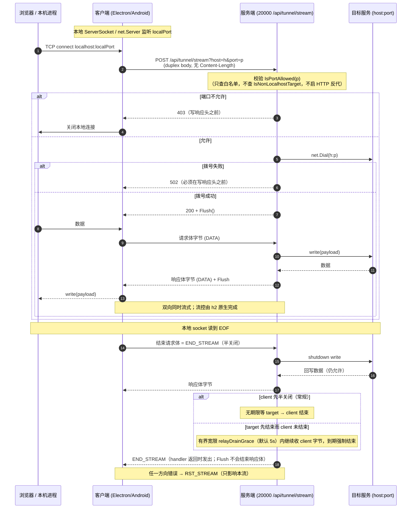
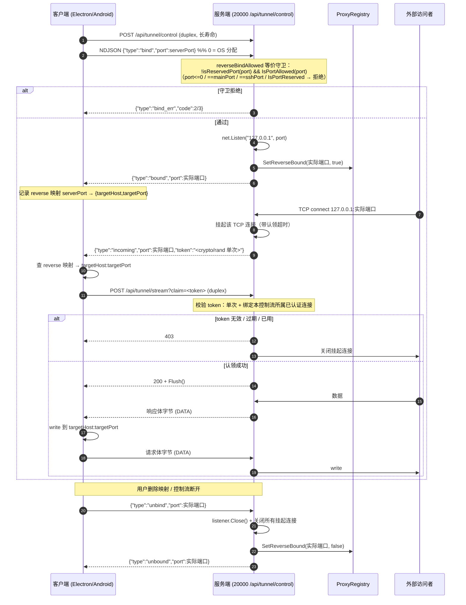

# HTTP/2 流隧道设计文档

- 日期：2026-09-25
- 状态：设计（未实现）
- 分支：`feat/ssh-ws-forward`
- 取代：`docs/plans/2026-09-25-ws-tunnel-design.md`（WebSocket / CBT1 自研帧方案，已随本文件删除；内容见 git 历史）。本文继承其「现状核实」与「客户端改动清单」中仍然有效的部分，并说明为何放弃 CBT1。
- 关联现状：现有 SSH 端口转发（`-L` / `-R`）全链路已完整存在，本方案**新增**一条功能等价（**半关闭为有界近似，见 §4.2.1**）的传输通道，SSH 通道**原样保留**。

---

## 1. 目标与非目标

### 1.1 目标

用**一条 HTTP/2 连接**承载任意多条 TCP 流，使用户在网络与防火墙层面**只需放行 20000 一个端口**。核心机制：**每个被转发的 TCP 连接 = 一个 HTTP 流**，客户端发 `POST`，**请求体承载 client→server 字节、响应体承载 server→client 字节**，双向同时流式（full-duplex）。

具体：

1. 复用 20000 单端口，与现有 HTTP / WS 共用同一 `http.ServeMux`、同一 `http.Server`。**不新增监听端口。**
2. 传输优先级链：**h2-over-TLS → h2c → SSH**。SSH 保留兼容，不删。
3. `-L` 与 `-R` 都支持，**安全守卫**与现有 SSH 转发逐条对齐（见 §3.2 / §5.1）；**半关闭语义在 h2 允许的范围内对齐**——服务端无法在流内半关闭响应，故用一个**有界宽限期**近似 SSH 的 `wg.Wait()`，差异与理由见 §4.2.1（**不是**逐条等价，实测结论）。
4. 落地范围：**服务端 + Electron + Android 三端一次到位**。**浏览器端不需要隧道客户端**（见 §2.3、§9）。
5. 数据模型、DB、HTTP API、OpenAPI、前端 UI **尽量零改动复用**；`PortInfo` 持久化格式**不可变**。

### 1.2 非目标

- **不做 HTTP/3**（有证据的 YAGNI 决策，见 §2.2）。
- **不做浏览器隧道客户端**（`fetch()` 规范层面不支持全双工，见 §2.3）。
- **不重写 `PortInfo`**（Android 持久化结构），不迁移 SharedPreferences。
- **不改 `buildPortUrl`**（其产物 `http(s)://localhost:port` 与传输无关；且本方案**不再需要** WS 方案里的 `buildPortWsUrl`）。
- 不实现流优先级、压缩、多连接池（见 §13）。
- 不触碰 HTTP 反向代理路径（`internal/proxy/reverse_proxy.go`），本方案走裸 TCP 中继，不经过它。
- 不做流量计费 / 审计 / 细粒度 ACL。

---

## 2. 决策记录

### 2.1 为何放弃 WebSocket / CBT1

CBT1 方案（见被取代文档 §3）在一根 WebSocket 上自研了一套二进制多路复用协议：10 字节定长帧头、12 种帧类型、奇偶 streamID 分配、每流信用窗口记账、`FIN` / `RST` / `WINDOW_UPDATE`、`OPEN` / `OPEN_OK` / `OPEN_ERR`。

**放弃的直接原因：这套自研帧几乎全部是 HTTP/2 的原生能力。** 一条 h2 连接上，每个被转发的 TCP 连接天然就是一个 HTTP 流，h2 协议本身提供流多路复用、流控、流生命周期，因此 CBT1 整块自研协议可以删除：

| CBT1 自研 | h2 原生等价物 |
|---|---|
| streamID 分配（奇偶） | h2 stream ID（协议自动分配，客户端发起为奇数） |
| 信用窗口 + `WINDOW_UPDATE` | h2 流控（协议自动，`WINDOW_UPDATE` 由实现层收发） |
| `DATA` 帧 | HTTP body 字节 |
| `FIN` / `RST` | `END_STREAM` / `RST_STREAM` |
| `OPEN` / `OPEN_OK` / `OPEN_ERR` | HTTP 请求 + `200` / `502` 状态码 |
| 帧编解码 + 窗口记账代码 | **全部删除** |

**次要原因（一票否决级）：现有 5 个 `coder/websocket` 端点根本无法跑在 h2 上。** 该库硬依赖 `http.Hijacker`（`/go/pkg/mod/github.com/coder/websocket@v1.8.14/accept.go:128-133`），而 Go h2 明确「no plan for hijacking HTTP/2 connections」（`net/http/h2_bundle.go:4717`）；强制 h2 握手会报 `http2: invalid Upgrade request header: ["websocket"]`（实测）。这意味着即使保留 WS 方案，也必须保证连接回退到 h1，隧道无法与 HTTP 多路复用共享同一连接——反而比 h2 方案更复杂。

**结果：零新增依赖。** h2c 可用 stdlib 的 `http.Protocols.SetUnencryptedHTTP2`（Go 1.24+，`net/http/http.go:30-56`，`net/http/server.go:3068` doc 明确「can serve both HTTP/1 and unencrypted HTTP/2 on the same address and port」），**无需新增依赖**（`golang.org/x/net v0.57.0` 已在 `go.mod:88` indirect；`http2/h2c` 位于 `/go/pkg/mod/golang.org/x/net@v0.57.0/http2/h2c/`）。客户端侧 Electron 用 `node:http2`（内建）、Android 用 OkHttp（既有依赖），**三端零新增包**。

### 2.2 为何不做 HTTP/3

用户已拍板：**不做**。证据链如下（任一条单独都足以否决）：

1. **三端客户端全不支持 h3**：Electron/Node 无内建 QUIC；Android 需引入 Cronet（体积与 ABI 复杂度）；OkHttp 4.12 无 h3。
2. **强制 TLS 1.3 + ALPN `h3`**：h3 只在加密下工作，无法走明文。
3. **20000 默认明文**：`cmd/server/main.go:1288-1305` 用 `model.ResolveTLSCerts(cfg.TLS.CertDir)` 扫证书，无证书则 `scheme="http"`；`:1473-1482` 据此选择 `ServeTLS` 或 `Serve`。默认 `cfg.TLS.CertDir = DefaultTLSCertDir()` = `<DataDir>/config/tls`（`internal/model/defaults.go:106-107`、`internal/model/tls.go:36-41`），`internal/model/tls.go:46-76` 只扫已有文件（`fullchain.pem`+`privkey.pem` / `cert.pem`+`key.pem` / `combined.pem`）。绝大多数部署没有证书。
4. **全仓无自签 X.509 生成器**：`x509.CreateCertificate` 零命中。唯一的密钥生成是 `internal/ssh/server.go:829-874` 的 SSH host key（ECDSA P-256，`pem.Block{Type:"EC PRIVATE KEY"}`），**不是证书**。要做 h3 就得先造一个证书签发链路，收益与成本严重倒挂。
5. **依赖不在 `go.sum`**：h3 需补 qpack/gojay 等依赖。
6. **`Alt-Svc` 全仓零使用**（`grep` 无命中），说明当前架构没有任何 h3 投放机制。
7. Android 走 h3 需 Cronet/native 库，显著增大 APK。

### 2.3 传输优先级链与「记住上次成功传输」

**首次连接严格按顺序探测：h2-over-TLS → h2c → SSH。**

- h2-over-TLS：若 20000 开了 TLS，`ServeTLS` 会自动配 ALPN `h2`（`net/http/server.go:3481-3499`）。**含义：只要实例开了 TLS，20000 今天就在跑 h2**，多路复用传输层已就绪，不需新端口。
- h2c：明文部署下走 prior-knowledge（不做 Upgrade 协商）。
- SSH：前两者都失败时回退到既有 20001 通道。

**明文部署下首次连接会白付一次 TLS 失败**（很快：握手即被拒，不是超时）。因此客户端**记住上次成功的传输方式，重连时优先复用**；仅首次连接严格按上述顺序探测。

**浏览器端既不需要也做不到**：`fetch()` 的 Fetch 规范 `RequestDuplex` enum **只有 `"half"`**，原文「'half' is the only valid value and it is for initiating a half-duplex fetch (i.e., the user agent sends the entire request before processing the response). 'full' is reserved for future use」；Node 24 实测 `duplex:full` 被拒，`duplex:half` 时即使服务端先写响应，响应头也被憋到请求体 close 之后（实测 2043ms 仍未 settle）。浏览器支持面：`duplex` 与 `ReadableStream` 请求体**只有 Chromium 支持**（Firefox/Safari 均 `false`）。`WebTransport`（HTTP/3）需 HTTPS + 显式端口，默认明文 20000 不可用。**结论：浏览器端零改动。**

---

## 3. 现状核实

> 本章继承被取代文档的「现状核实」与「客户端改动清单」中仍然有效的部分（文件:行号锚点、复用/需改判定），并补充本次 h2 相关的硬事实。

### 3.1 单端口事实

HTTP 与 WebSocket 共用 20000：

- `cmd/server/main.go:1304` 预绑定主监听（先探测端口冲突再打印 banner）；
- `cmd/server/main.go:1277` 构造单个 `http.Server`（`srv := &http.Server{Handler: mux}`）；
- `cmd/server/main.go:1479` `srv.Serve(mainLn)`。

现有 WS 端点按**路径**区分，全部经 `github.com/coder/websocket v1.8.14` 的 `websocket.Accept` 升级。这些端点（均已在 `internal/api/openapi.yaml` 中以 `get` + `responses."101"` 收录）：

| 端点 | openapi.yaml 行 |
|---|---|
| `/api/ai/events/ws` | 1619 |
| `/api/file/watch/ws` | 2331 |
| `/api/tts/audio/ws` | 3128 |
| `/api/stt/transcribe/ws` | 3158 |
| `/api/terminal/ws` | 3169 |

**这 5 个端点无法跑在 h2 上**（见 §2.1），它们之所以没坏，是因为 Go h2 服务端**默认不广告** `SETTINGS_ENABLE_CONNECT_PROTOCOL`（`net/http/h2_bundle.go:3483-3495`，注释明说为避开不支持 extended CONNECT 的服务端），浏览器因此回退 h1 另开连接。**开启 h2c 时必须保留 `SetHTTP1(true)`，否则现有 WS 端点全挂。**

### 3.2 现有 SSH 转发的可复用资产

**方向与模型**（`internal/model/proxy.go:9-32`）：`DirectionForward = "forward"` / `DirectionReverse = "reverse"`；`ForwardedPort{Port, LocalPort, Host, Name, Protocol, Direction, Active, Enabled}`。注释明确 `Port`/`LocalPort`/`Host` 语义**随 direction 翻转**：

- `forward`：`Port` = 服务端目标端口，`LocalPort` = 客户端监听口，`Host` = 服务端目标主机。
- `reverse`：`Port` = 客户端暴露口，`LocalPort` = 服务端绑定口，`Host` = 客户端目标主机。

**DB**：`internal/service/database.go:628` `direction TEXT NOT NULL DEFAULT 'forward'`；`:1289-1291` ALTER TABLE 迁移；读写 `internal/service/proxy.go:1167`（SELECT）/ `:1238`（INSERT OR REPLACE）。

**注册表**（`internal/service/proxy.go`）：

| 符号 | 行 | 作用 |
|---|---|---|
| `var ProxyService *ProxyRegistry` | 103 | 全局单例，**无注入点** |
| `SetReservedPorts(...)` | 173 | 预留端口（mainPort / sshPort） |
| `IsPortReserved(port)` | 184 | 预留判定 |
| `RegisterPort(port, host, name, protocol, direction)` | 213 | 注册（内部 `NormalizeDirection`） |
| `SetReverseBound(serverPort, bound)` | 504 | 驱动 reverse 的 `Active` |
| `ListPorts()` | 520 | 列表（含 reverse） |
| `IsPortAllowed(port)` | 539 | 白名单（`allowed_ports`） |
| `allocateServerPort` | 55 | 跳过 reserved 并探测 OS |
| `exposedPort(p)` | 162 | 暴露口计算 |
| `isPortInRange` | 1125 | 支持 `"1024-65535"` / `"3000,5173"` / 混合；空串 = 全放行 |
| `IsNonLocalhostTarget` | 1270 | **仅**用于 HTTP 反代改写 Host |

**SSH 侧安全守卫（必须在新实现里保留等价语义）**：

- `internal/ssh/server.go:589` `reverseBindAllowed(port)` = `!isReservedPort(port) && portReg.IsPortAllowed(port)`；
- `internal/ssh/server.go:616-624` `isReservedPort` = `port<=0 || port==mainPort || port==sshPort || portReg.IsPortReserved(port)`；
- 正向路径（`handleDirectTCPIP`，`:710-782`）**只**查 `IsPortAllowed(targetPort)`（`:738`），注释明确「transport layer 中继不需要 URL 改写元数据」，即**不查** `IsNonLocalhostTarget`、不启 HTTP 反代。

**注册表创建门控**（`cmd/server/main.go:1064-1088`）：`ProxyRegistry` **只在** `cfg.PortForward.Enabled` 时创建（注释明说「没有 SSH 隧道它没有独立用途」）；`:1074` `SetReservedPorts(port, sshPort)`；随后赋给 `service.ProxyService`。热重载路径 `reserveSSHPorts`（`:1739-1747`）由 `hotReloadSSH`（`:1749-1812`）调用。**不改这个门控，隧道 handler 永远拿到 nil 只能全拒——这是服务端最关键的生命周期改动（见 §6）。**

现有 nil 守卫先例：`internal/handler/ssh_info.go:117`（`if service.ProxyService != nil`）。

**HTTP API**（`internal/handler/proxy_api.go`，OpenAPI `internal/api/openapi.yaml:3889-3936`）：

| 方法/路径 | 行 | 请求体/参数 |
|---|---|---|
| POST `/api/proxy/ports` | 37-61 | `{port, host, name, protocol, direction}` |
| PUT `/api/proxy/ports` | 63-87 | 加 `localPort` |
| DELETE `/api/proxy/ports` | 89-103 | query `port`（= localPort） |
| PUT `/api/proxy/ports/enabled` | 107-127 | `{localPort, enabled}` |

### 3.3 客户端可复用资产

**前端**（`web/src/composables/usePortForward.ts`）：`registerPort`(:307) / `updatePort`(:333) / `unregisterPort`(:343) / `syncToNative`(:410) / `addNativeForward`(:278) / `removeNativeForward`(:291) **全部已按 direction 分派**到 `native.addReverseForwardedPort` vs `native.addForwardedPort`。桥契约 `web/src/utils/clawbenchNative.ts:95-96`（`addReverseForwardedPort?` / `removeReverseForwardedPort?` 是**可选**的，旧宿主降级为 `continue`）。`effectivePorts`(:148) 与 `refreshLocalReachability`(:256) **刻意跳过 reverse**（reverse 无本地监听）。

**Electron**（`desktop/src/main/tunnel.ts`，876 行 / **34 个 `it`**——注意 `grep -o "it("` 的 63 个里 29 个是 `emit(` 的子串）：

| 符号 | 行 | 判定 |
|---|---|---|
| `state.forwarded: Map<number,{targetPort,host,direction}>`（键 = 对端监听口） | 27 | 复用 |
| `forwardServers: Map<number,net.Server>` | 58 | 复用 |
| `reverseForwards: Map<number,{targetPort,host,serverPort}>` | 69 | 复用 |
| 连接监视器 `startMonitor/stopMonitor/syncMonitor/monitorTick` | 84-122 | 复用 |
| `closeForwardServer/closeAllForwardServers` | 125-135 | 复用 |
| `unforwardReverse` | 144 | **需改**（`transport.unbind`） |
| `isTunnelConnected/getTunnelError/getTunnelErrorType/getForwardedPorts` | 158-163 | 复用 |
| `classifyError` | 165 | **需改**（加 h2 / `ERR_HTTP2_*` / `ECONNREFUSED` 映射） |
| `openClient`（ssh2 生命周期；`:237-257` 的 `'tcp connection'` 是 ssh2 专有） | 181-304 | **需改**（→ `transport.connect()`） |
| `disconnectTunnel` | 311 | **需改**（`client.end()` → `transport.close()`） |
| `pendingBinds` | 339 | 复用 |
| `listenForward`（**唯一**真正调 `forwardOut` 的是 :350 一行） | 341-383 | **需改**（:350 → `transport.openStream(host,port)`，其余 `net.createServer`/错误处理/单飞全保留） |
| `pendingReverseBinds` | 396 | 复用 |
| `listenReverse`（用 `forwardIn`） | 398-425 | **需改**（→ `transport.bind()`） |
| `rebuildAllForwards` | 434 | 复用 |
| `addForwardedPort` | 445 | 复用 |
| `addReverseForwardedPort` | 462 | 复用 |
| `removeForwardedPort` | 472 | 复用 |
| `removeReverseForwardedPort` | 488 | 复用 |
| `testPortReachable` | 492 | 复用 |
| `fetchSshInfo` | 510-531 | SSH 专有保留 |
| `DEFAULT_SSH_USER` / `SshInfo` | 501 | SSH 专有保留 |
| `ensureTunnel` | 541 | **需改**（按传输分派） |
| `reconnectTunnel` | 564 | 复用 |

IPC 在 `desktop/src/main/bridge.ts:84-93`，preload 在 `desktop/src/preload/index.ts:70-87`。桌面读 cookie 的现成实现：`desktop/src/main/clientLog.ts:88-96 getSessionCookie()`（按 `clawbench_session` / `*_clawbench_session` 后缀匹配，纯字符串拼接不依赖 HTTP 库）；服务端 `internal/middleware/auth.go:70` 用 `r.Cookie(model.ScopedCookieName(model.SessionCookie))`，`internal/model/config.go:386-391` 的 `ScopedCookieName` 对 20000 返回裸名、非 20000 返回 `cb<port>_clawbench_session`，与后缀匹配完全一致。h2 请求头里作为普通 `cookie` header 传。

**Android**（`android/app/src/main/java/com/clawbench/app/BackgroundService.java`）：

| 符号 | 行 | 备注 |
|---|---|---|
| `PortInfo{targetPort,host,reverse}` | 141-168 | **会被序列化进 SharedPreferences** |
| `forwardedPorts` / `reversePorts` | 171 / 178 | 内存态 |
| `totalPortCount` / `hasNoPorts` | 181 / 186 | |
| `networkExecutor = Executors.newSingleThreadExecutor()` | 194 | **29 处调用**；隧道流 I/O 不能占用它 |
| `saveForwardedPorts`（格式 `"localPort:targetPort:host"`）/ `restoreForwardedPorts` | 1070 / 1151 | |
| `saveReversePorts` / `restoreReversePorts` | 1092 / 1113 | |
| `KEY_REVERSE_FORWARDED_PORTS` | 97 | |
| `ensureConnection`（:1455-1483 重放 -L；:1489-1513 重放 -R） | 1377-1517 | |
| `addPortForward`（:1601 `setPortForwardingL`） | 1536 | |
| `removePortForward` | 1741 | |
| `addReversePortForward`（:1823 `setPortForwardingR`） | 1784 | |
| `removeReversePortForward`（:1862 `delPortForwardingR`） | 1852 | |
| `disconnectInternal`（:2015-2024 循环 `delPortForwardingL/R`） | 2011 | |
| 连接监视器（:1250 判 `sshSession.isConnected()`） | 1231-1322 | |
| `testLocalPort` / `notifyPortForwardResult` | 1661 / 1681 | |
| `onStartCommand` Intent 分支（ADD/REMOVE[_REVERSE]_PORT、DISCONNECT） | 864-930 | |
| 静态 helper | 2403-2461 | |
| `getForwardedPortsSnapshot` / `getReversePortsSnapshot` | 2474 / 2464 | |
| `initTrustAllSSL` | 2482 | |
| `getTrustAllSSLContext` | 328 | |
| `connectNativeWs`（既有**独立** OkHttp WS 客户端，**每次新建 OkHttpClient**） | 2626-2693 | |
| `NativeEventListener` | 2776 | |
| ping loop | 2217-2275 | |
| `maybeReleaseWifiLock`（判据 `!sshActive && !nativeWsActive`，:2389 `sshActive = sshSession != null && sshSession.isConnected()`） | 2388 | |
| 息屏 suspend（`ACTION_SCREEN_OFF` → `disconnectInternal` + `maybeReleaseWifiLock`；`ACTION_SCREEN_ON` → 重新 `ensureConnection`） | 806-830 | |
| `sshScreenSuspended` | 790 / 816 | |

**全文件无任何 `ServerSocket`**（仅一处注释 :1658）。`android/app/build.gradle:139-154` 依赖块含 `okhttp:4.12.0`、`jsch 0.2.16`、`robolectric 4.11.1`、`mockito-core 5.8.0`、`mockwebserver 4.12.0`；**无 Cronet、无 ABI split**（`grep splits|abiFilters|ndk` 无结果，universal APK）。

**其他**：`web/src/utils/portForwardUtils.ts` 的 `buildPortUrl`(:59-66) 只产 `http(s)://localhost:port`（仅 3 处 `window.open` 调用）；`tunnelStatusFromPorts`(:47-52) 是纯函数、与传输无关、**零改动**。

### 3.4 h2 服务端硬事实（本次核实）

| 事实 | 证据 |
|---|---|
| **stdlib h2 服务端原生全双工，无需 `EnableFullDuplex`** | `net/http/h2_bundle.go:6856` 的 `http2responseWriter.EnableFullDuplex()` 实现即 `// We always support full duplex responses, so this is a no-op. return nil`。实测三种变体（stdlib h2-TLS / h2c / x-net h2）全通过：handler 先写+Flush 再读 body 再写，客户端 `io.Pipe` 延迟 500ms 写 body → FULL-DUPLEX OK |
| **HTTP/1.1 反例**：不调 `EnableFullDuplex` 时服务端 `read n=0 err=http: invalid Read on closed Body` | `net/http/server.go:1392` 的 `!w.fullDuplex` 分支（body 被吞） |
| **`http.Server.Protocols` 一旦非 nil 就完全取代默认值** | `net/http/server.go:3506-3527` 的 `protocols()` 只在 `s.Protocols == nil` 时补 HTTP1。只调 `SetUnencryptedHTTP2(true)` 会**同时关掉 HTTP/1.1 与 h2-over-TLS**：实测 h1 客户端 `ECONNRESET`、`curl: (56) Recv failure: Connection reset by peer`。**必须同时 `SetHTTP1(true)`；TLS 部署还要 `SetHTTP2(true)`。** 三协议共存已实测通过 |
| `ServeTLS` 自动配 ALPN `h2` | `net/http/server.go:3481-3499`。**含义：只要实例开了 TLS，20000 今天就在跑 h2** |
| h2c 可用 stdlib | `http.Protocols.SetUnencryptedHTTP2`（Go 1.24+，`net/http/http.go:30-56`，`server.go:3068`） |
| 20000 **默认明文** | `cmd/server/main.go:1288-1305` 扫证书；`:1473-1482` 选 `ServeTLS`/`Serve` |
| **全仓无自签 X.509 生成器** | `x509.CreateCertificate` 零命中；唯一密钥生成是 `internal/ssh/server.go:829-874` 的 SSH host key（非证书）。h2c 不需要证书，主路径不阻塞 |
| h2 默认 `MaxConcurrentStreams = 250` | `net/http/h2_bundle.go:4042 http2defaultMaxStreams = 250`；单流接收窗口默认 1 MiB（`:1129`）。可经 `http.Server.HTTP2.MaxConcurrentStreams` 提升（`net/http/http.go:232-240`） |
| 当前 `http.Server` **没有任何超时** | `cmd/server/main.go:1277` `srv := &http.Server{Handler: mux}`。长寿命流不会被 `ReadTimeout`/`WriteTimeout` 打断（**这是好事，要保持**） |
| 现有 5 个 WS 端点无法跑 h2 | 见 §2.1 |
| **`Flush()` 不结束响应体；`END_STREAM` 只在 handler 返回时发出** | `net/http/h2_bundle.go:6704` / `:6731` / `:6970` 的 `endStream` 都以 `rws.handlerDone` 为条件；`:6362 handlerDone()` / `:7034` 由 `runHandler` 的 defer 调用。实测：`Flush()` 后 500ms 响应体仍开放，`handler` 返回时才收 EOF。**推论：服务端无法在流内半关闭响应**（§4.2.1） |
| **handler 返回即摧毁请求体** | `net/http/h2_bundle.go:5375 closeStream(..., http2errHandlerComplete)`。实测：handler 返回后客户端再写 → `io: read/write on closed pipe`，服务端侧 reader 得到 `stream error: stream ID 1; NO_ERROR`。**推论：响应 EOF 与请求体寿命绑定**（§4.2.1） |
| `Alt-Svc` 全仓零使用 | `grep` 无命中 |

### 3.5 h2 客户端硬事实（本次核实）

**Electron / `node:http2`**：

- **全双工已实测通过**（Node 20.19.2 与本机下载的 Electron 44.4.3 实际运行时 Node 24.21.0 都验证）：`ClientHttp2Stream` 是真正的 `Duplex`，`write()` 与 `'data'` 可并行；实测「先收响应头 → 再写请求体 → 收响应」通过。真实隧道原型（Go h2c 服务端 + Node 客户端）也已跑通。
- **h2c prior-knowledge 可用**：`http2.connect('http://127.0.0.1:20000')` 直接走明文 h2，**无需 `createConnection`、无需任何 npm 包**。对照实验：h2c 指向纯 h1 服务端 → `ERR_HTTP2_ERROR`（即不做 Upgrade 协商，只有 prior knowledge）。`https://` + 自签 + `rejectUnauthorized:false` 也 OK，ALPN 协商为 `h2`。
- **背压**：写侧 `write()` 返回值 + `'drain'`（实测 2 MiB 传输中 `write()` 返回 false 128 次、`'drain'` 触发 128 次）；读侧 `stream.pause()/resume()` 可用。**`session.socket.pause()` 会抛 `ERR_HTTP2_NO_SOCKET_MANIPULATION`**（Node 20/24 一致），不要用。
- 坑：`http2.ClientHttp2Stream` **不是运行时导出**（只是 TS 类型），判 Duplex 要用 `node:stream` 的 `Duplex`。`stream.end()` 后再 `write()` → 异步 emit `ERR_STREAM_WRITE_AFTER_END`。

**Android / OkHttp 4.12.0**：

- **双向流式已实测通过**，但**必须先让 `RequestBody.isDuplex()` 返回 `true`**：字节码 `CallServerInterceptor.intercept` 在 `isDuplex` 分支走 `createRequestBody(req, true)` 且**不调 `finishRequest()`**，所以 `writeTo` 立即返回后 `intercept` 能继续走到 `readResponseHeaders`。实测 chunk1-5 与响应交错成功；**默认 `isDuplex()=false` 时 `onResponse` 被推迟到 `writeTo` 返回之后**（实测 2010ms vs 2009ms）。
- **h2c 可用**：`Protocol.H2_PRIOR_KNOWLEDGE`（`OkHttpClient.Builder.protocols(listOf(...))`），字节码 `RealConnection` 有 `startHttp2(I)` 直连分支与 `"H2_PRIOR_KNOWLEDGE cannot be used with HTTPS"` 常量；实测 `proto=h2_prior_knowledge`。
- **h2-over-TLS + 自签可用**：实测 `proto=h2`，ALPN 正常。现有 `initTrustAllSSL()`(`BackgroundService.java:2482`) + `getTrustAllSSLContext()`(:328) 可直接复用（`connectNativeWs` :2669-2675 已在用这套 + `hostnameVerifier((h,s)->true)`）。自定义 `SSLSocketFactory` **不影响** ALPN（`AndroidPlatform`/`Android10Platform` 的 `configureTlsExtensions` 与信任链无关），minSdk 24 两套都能命中。**唯一未在真机验证的是 Android 上的 ALPN 行为**（本机是 JVM 的 `sun.security.ssl.SSLSocketFactoryImpl`）——见 §14；但 h2c 是默认形态不涉及 ALPN，不阻塞主路径。
- **Dispatcher 并发上限（决定性）**：默认 `maxRequests=64`、`maxRequestsPerHost=5`；`AsyncCall.getHost()` 只按 host 名（不看 path/port），同 host 的 call 共享同一个 `AtomicInteger`。实测 20 个 async 流式请求**只有 5 个进 running，15 个永久 queued**（70 个时 `maxConcurrent=5 queued=65`）。`setMaxRequestsPerHost(100)` 可解除，70 个时撞 `maxRequests=64`（所以 async 路径要同时调两个）。**但 `Call.execute()` 完全绕过**：字节码 `Dispatcher.executed$okhttp` 只 `runningSyncCalls.add(call)`，**无任何计数检查**。实测 20 线程 `execute()` → `maxConcurrentSync=20`；200 条流 329ms 全开、`distinctConns=2`。**结论：每个隧道流 = 一个专用线程上的阻塞 `execute()`，不要用 `enqueue()`/`Callback`。**
- **背压**：写侧 h2 窗口阻塞（实测服务端不读 body 时客户端写到恰好 1 MiB 停住，`FramingSink.emitFrame` 在 `writeBytesTotal >= writeBytesMaximum` 时 `waitForIo`）；读侧不调 `source().read()` 就不发 `WINDOW_UPDATE`（实测停读 8s 后服务端写停在 ~17 MiB，恢复 drain 后 262ms 收完）。**无需额外 API。**
- **两个必须设的坑**：**`readTimeout(0)` + `writeTimeout(0)`**。默认 10s 会让空闲流超时（实测 idle 10076ms 失败），而 `Http2Stream$StreamTimeout.newTimeoutException` 会 `closeLater(ErrorCode.CANCEL)` **RST 整个流**——隧道对端 TCP 静默时必被误杀。实测 `readTimeout=0`+`writeTimeout=0` 下 idle 16s 仍存活。注意 timeout 是**每 stream 独立**的（`Http2Stream` 构造函数 `new Http2Stream$StreamTimeout` ×2），但可在 client 级设 0 即可。
- **半关闭与取消**：`RequestBody.writeTo` 里 `sink.close()` 发 `END_STREAM` **不关整条流**（实测半关闭后响应方向仍能继续读到 DONE）；`Call.cancel()` → `stream.closeLater(ErrorCode.CANCEL)` = **`RST_STREAM` 只影响本流**（实测 c2 在 c1.cancel() 后存活）。
- **连接复用（-R 变通的关键）**：同一 `OkHttpClient`、同一 host:port → 21 条流（1 控制 + 20 数据）**全部复用 1 条 TCP 连接**（`distinctConnections=1`）；不同 `?host=&port=` 查询参数不影响复用（OkHttp 按 scheme+host+port 复用）；**但不同 `OkHttpClient` 实例不共享连接池**（2 client × 10 流 → `distinctConnections=3`）。**结论：控制流与数据流必须共用同一个 `OkHttpClient` 实例。**
- **-R 变通在 OkHttp 上实测可行**：控制流 `readTimeout=0`+`writeTimeout=0` 下 idle 16s 存活（用 `execute()` 占一个专用线程）；服务端在一条流上推 **25 个 unsolicited server→client 帧**且客户端同时在写（`CTRL:1..5`）；1 控制 + 20 数据 = 1 连接；因为都用 `execute()` 故完全不受 `maxRequestsPerHost` 阻塞。
- 服务端 `MAX_CONCURRENT_STREAMS=250`（`h2_bundle.go:4042`）是单连接流上限，用户开大量页面时需注意（超出需排队或多连接）。

### 3.6 必须绕开的硬坑

| 坑 | 事实 | 对策 |
|---|---|---|
| `Protocols` 非 nil 覆盖默认 | 只设 `SetUnencryptedHTTP2(true)` 会关掉 h1 与 h2-over-TLS | 同时 `SetHTTP1(true)`；TLS 加 `SetHTTP2(true)`（§6） |
| h1 半双工 | 不调 `EnableFullDuplex` 时 body 被吞（`net/http/server.go:1392`） | 若保留 h1 兜底，handler 显式调 `http.NewResponseController(w).EnableFullDuplex()`（h2 下是 no-op，无害） |
| 现有 WS 端点 | `coder/websocket` 硬依赖 `http.Hijacker`，h2 无 hijack | 必须保留 `SetHTTP1(true)`；隧道走裸 HTTP 流 |
| `ProxyRegistry` 门控 | 只在 `cfg.PortForward.Enabled` 时创建（`cmd/server/main.go:1064`） | 放宽创建条件（§6） |
| OpenAPI 漂移 | `openapi_drift_test.go:27-87` 对**任何** `/api/` 前缀注册路由做反向检查 | 新端点必须写进 `openapi.yaml` + 计数 +1（§6） |
| OkHttp 默认 10s 超时 | `Http2Stream$StreamTimeout` 超时会 `closeLater(CANCEL)` RST 整流 | 必须 `readTimeout(0)`+`writeTimeout(0)`（§8） |
| OkHttp `enqueue()` 排队 | `maxRequestsPerHost=5` 会让第 6 条流永久 queued | 每个流用专用线程的 `execute()`（§8） |
| 多 OkHttpClient | 不同实例不共享连接池 | 控制流与数据流共用一个实例（§8） |
| MockWebServer 半双工 | `Http2SocketHandler.onStream` 先读完 body 再写响应 | 全双工集成测试必须起真实 Go 服务端（§10） |
| 前端 SSH 门控 | `usePortForward.ts:492` 的 `if (!info?.enabled) return` 会让服务器未开 SSH 时跳过整个健康检查 | 放宽为「SSH 或 h2 任一可用」（§9） |
| Android 息屏 | :806-830 息屏主动断 SSH 省电 | h2 隧道**不**继承该 suspend（§8） |
| Android 线程 | `networkExecutor` 单线程 | 隧道 I/O 必须另起专用线程池（§8） |

### 3.7 -R 的既有资产（**已完整存在，不要重新设计数据模型**）

- **模型**：`internal/model/proxy.go:9-32`（见 §3.2）。
- **DB**：`internal/service/database.go:628` / `:1289-1291`；读写 `internal/service/proxy.go:1167` / `:1238`。
- **HTTP API**：`internal/handler/proxy_api.go:37-127`；OpenAPI `internal/api/openapi.yaml:3889-3936`。
- **前端**：已按 direction 分派到 `native.addReverseForwardedPort` vs `native.addForwardedPort`（`usePortForward.ts:278-288` / `:291-296` / `:410-462`）；`effectivePorts`(:148) 与 `refreshLocalReachability`(:256) 刻意跳过 reverse。
- **Electron 反向**：`reverseForwards`(:69)、`'tcp connection'` 处理器(:237-257)、`listenReverse`(:398-425)、`addReverseForwardedPort`(:462)、`removeReverseForwardedPort`(:488)、`disconnectTunnel` 的 `unforwardAllReverse`(:318)、`'close'` 里 `reverseForwards.clear()`(:280)、`getForwardedPorts`(:161-163 返回 `direction`)。IPC `native:add-reverse-forwarded-port`(`bridge.ts:91`)/`native:remove-reverse-forwarded-port`(:92)、preload(:84-85)。
- **Android 反向**：`reversePorts`(:178)、`PortInfo.reverse`(:145)、`isNonLocalhost()` 对 reverse 返回 false(:161-164)、`addReversePortForward`(:1784)/`removeReversePortForward`(:1852)、`saveReversePorts`(:1092)/`restoreReversePorts`(:1113)、重放(:1489-1513)、Intent `ADD_REVERSE_PORT`/`REMOVE_REVERSE_PORT`(:891-904)、静态 helper(:2436/2456)、`getReversePortsSnapshot`(:2464)、`MainActivity.java` 桥 `addReverseForwardedPort`(:2769-2784)/`removeReverseForwardedPort`(:2789-2792)、`getForwardedPorts` 序列化带 `"direction":"reverse"`(:2863)。
- **反向测试**：`internal/ssh/server_test.go` 的 `TestSSHReverseForward_*`(:1430-1711)；`desktop/src/main/tunnel.test.ts` 的 `describe('tunnel: reverse port forwarding (ssh -R)')`(:643-785)；`android/.../BackgroundServiceReversePortTest.java`（19 个）。

---

## 4. h2 流隧道协议

### 4.1 核心映射

**一条 HTTP/2 连接上，每个被转发的 TCP 连接 = 一个 HTTP 流。**

- 客户端发 `POST <base>/api/tunnel/stream?host=<h>&port=
`；
- **请求体承载 client→server 字节、响应体承载 server→client 字节**，双向同时流式；
- 无 `Content-Length`（流式），请求体 duplex（OkHttp `RequestBody.isDuplex()=true`；Node `Duplex` body）。

CBT1 → h2 能力映射见 §2.1 表格。

### 4.2 `-L`（正向）流程

1. 客户端本地 `ServerSocket` / `net.Server` 监听 `localPort`。
2. 每个 accepted TCP 连接 → `POST <base>/api/tunnel/stream?host=<h>&port=
`，`Content-Type: application/octet-stream`，无 `Content-Length`，请求体 duplex。
3. 服务端：
   - 校验 `IsPortAllowed(p)`（**与 SSH 语义一致：只查白名单，不查 `IsNonLocalhostTarget`、不启 HTTP 反向代理**，对齐 `internal/ssh/server.go:738`）；
   - `net.Dial(host:p)`；
   - 成功则 `WriteHeader(200)` + `Flush()`，然后两条泵：`r.Body`→conn、conn→`w`（每次写后 `Flush`）；
   - **dial 失败必须在写响应头之前返回 `502`**。
4. 关闭语义：本地 socket 读到 EOF → 结束请求体（`END_STREAM`，即半关闭），对端仍可回写；任一方向错误 → 取消该 h2 流（`RST_STREAM`，只影响本流）。服务端侧的**双向结束策略**见 §4.2.1。

#### 4.2.1 半关闭与「与 SSH 等价」的边界（实测结论，**不是逐条等价**）

**SSH 的行为**：`internal/ssh/server.go:685` 的 `relayBidir` 用 `wg.Wait()` **等两个方向都结束**。target 先 `CloseWrite()`（发 FIN）但继续读时，SSH channel 的写侧被 `CloseWrite()`，`channel → backend` 的 copy 继续运行，因此下游客户端在 target FIN 之后写入的字节**仍会到达 target**（无限等待）。

**h2 的硬约束（实测，Go 1.26.2 stdlib）**：

1. **服务端无法在流内半关闭响应。** `END_STREAM` 只在 handler 返回时发出（`net/http/h2_bundle.go:6704` / `:6731` / `:6970` 都以 `rws.handlerDone` 为条件）。**`Flush()` 不会结束响应体**——实测：`Flush()` 后 500ms 响应体仍开放，直到 handler 返回才收 EOF。因此「先 Flush 让客户端收到 FIN，再继续等另一个方向」在本实现下**做不到**。
2. **handler 返回即摧毁请求体。** 同一步 `closeStream(..., http2errHandlerComplete)`（`h2_bundle.go:5375`）会结束流，实测此时客户端再写得到 `io: read/write on closed pipe`。

也就是说 h2 上**响应 EOF 与请求体寿命是绑定的**：要么 handler 不返回（响应不结束、客户端干等），要么返回（请求体立刻死亡）。这与 SSH 的两条独立单向通道不同。

**采用的策略（`internal/tunnel/relay.go` 的 `RelayDuplex`）**：

- 两条 pump 并发。
- **client → target 先结束**（客户端半关闭）：对 target `HalfCloseWrite`，然后**无期限**等 target → client 收完。这是常规请求/响应形态，与 `relayBidir` 的 `wg.Wait()` 完全一致。
- **target → client 先结束**（target 半关闭或完全关闭）：响应侧已被 `copyToClient` 逐块 Flush；随后给 client → target 一个**有界宽限期**（`relayDrainGrace`，默认 **5s**，可经 `tunnel.SetRelayDrainGraceForTest` 覆盖以便测试）。宽限期内客户端后续字节照常送达 target；宽限期用尽则 handler 返回（= 发 `END_STREAM`）。
- 宽限期用尽即强制结束，保证 T3 发现的死锁场景（短连接后端、`-R` 访客挂断）**有界结束**，不会永久挂起。

**差异（如实写明）**：

| 场景 | SSH | h2（本实现） |
|---|---|---|
| client 先半关闭，target 继续回写 | 等到 target 结束 | **等价**（同样无期限等待） |
| target 先半关闭，client 继续写 | **无限**接收，直到 client 结束 | 只在 **5s 宽限期内**接收；超出则丢弃（客户端写会失败） |
| target 完全关闭且 client body 不结束 | **永久挂起**（`wg.Wait()` 无超时；这正是 T3 要避免的） | **宽限期后结束** |

因此「语义与 SSH 逐条对齐」对**安全守卫**成立，对**半关闭**只是**有界近似**：SSH 是无限等待，h2 是 5s 有限等待。这是 stdlib h2 无法在流内半关闭响应的直接后果，不是实现取舍可以消除的。

**代价（实测）**：当 target 先结束而客户端**保持请求体打开**（close-delimited 响应，如 `Connection: close` 或对端已挂断但本地 socket 未关）时，响应 EOF 被推迟一个宽限期。实测 handler 级：grace=200ms → EOF 250ms；grace=1s → 1.05s；grace=5s → 5.05s。即**每一条这种流付一次宽限期**。

**替代方案与为何不选**：

- **无界等待（照抄 SSH）**：会重新引入 T3 的死锁——短连接后端场景 handler 永不返回、响应永不终止。**否决**。
- **立即返回（T3 现状）**：客户端在 target FIN 后的写入被丢弃（独立验证者实测：SSH 收到 17 字节、h2 收到 0 字节）。**否决**。
- **改小默认宽限期**：可减少代价，但缩短「target FIN 后仍能送达」的窗口。当前取 5s，与 `tunnelDialTimeout`（10s）同量级，远大于同机/同网往返，足够覆盖 FIN 与客户端尾字节的交错。
- **改为「有进展就续期」的空闲超时**（每次 client → target 有字节就重置计时器）：更接近 SSH 的「让在途数据跑完」，但客户端持续慢速滴流时仍不有界，且实现与测试都更复杂。**当前不采用**，作为已知改进方向记录。
- **改用其它传输形态**（如 h2 上的 CONNECT / WebSocket / 自研帧）以取得真正的流内半关闭：超出本方案范围（§1.2、§2.1），且现有 5 个 WS 端点已证明与 h2 多路复用不兼容。**记录为已知限制**。

### 4.3 `-R`（反向）流程

1. 客户端建一条**长寿命控制流** `POST <base>/api/tunnel/control`（同样 duplex）。
2. 客户端经控制流发 NDJSON `{"type":"bind","port":<serverPort>}`。
3. 服务端用与 SSH `reverseBindAllowed` **等价**的守卫（`IsPortReserved` + `IsPortAllowed` + 不等于 `mainPort`/`sshPort`，对齐 `internal/ssh/server.go:589`/`:616-624`）→ `net.Listen("127.0.0.1", port)`（`port=0` 时由 OS 分配）→ 调 `ProxyRegistry.SetReverseBound(实际端口, true)` 驱动 `Active` → 回 `{"type":"bound","port":<实际端口>}`；失败回 `{"type":"bind_err","port":<port>,"code":...,"msg":...}`。
4. 服务端 accept 到连接 → **挂起该 TCP 连接**（带超时，未认领则关闭）→ 控制流发 `{"type":"incoming","port":<serverPort>,"token":"<不可猜的单次凭证>"}`。
5. 客户端收到后查本地 reverse 映射得到目标 `host:port`，发 `POST <base>/api/tunnel/stream?claim=<token>`；服务端凭 token 匹配到挂起的连接，交给这条流双向中继。**token 必须用 `crypto/rand` 生成、单次使用、绑定到该控制流所属的已认证连接**（防他人窃取）。
6. `{"type":"unbind","port":...}` 或控制流断开 → 释放 listener + `SetReverseBound(port, false)` + 关闭所有挂起连接。

#### 4.3.1 该变通的必要性（必须写清楚）

**h2 无法服务端发起流。** Server Push 的推流在客户端是 `half-closed(local)`，`writable=false`，写即 `ERR_STREAM_WRITE_AFTER_END`（RFC 9113 §8.4）；扩展 CONNECT 只能客户端发起。因此 `-R` 里「服务端 accept 到外部连接后要建立一条通往客户端的流」这件事，h2 本身做不到，**必须让客户端发起数据流来「认领」**：服务端先把连接挂起并推送一个 `incoming` + 单次 token，客户端再用该 token 发起 `claim` 流。

### 4.4 `-R` 控制流消息定义（NDJSON）

**唯一还需要自定义消息的地方是 `-R` 的控制面**，而它频率极低 → **用 NDJSON（换行分隔 JSON）走一条控制流即可，不要二进制协议。**

| 消息 | 方向 | 字段 | 语义 |
|---|---|---|---|
| `bind` | C → S | `port`（0 = OS 分配） | 请求服务端监听该端口 |
| `bound` | S → C | `port`（实际端口） | 绑定成功 |
| `bind_err` | S → C | `port`, `code`, `msg` | 绑定失败 |
| `incoming` | S → C | `port`（服务端监听口）, `token` | 有外部连接，附单次认领凭证 |
| `unbind` | C → S | `port` | 释放该绑定 |
| `unbound` | S → C | `port` | 释放完成 |
| `ping` | C → S | — | 保活探测 |
| `pong` | S → C | — | 保活应答 |

### 4.5 claim token 安全要求

- 用 `crypto/rand` 生成（**不可猜**）。
- **单次使用**：认领后立即失效，重复 claim 拒绝。
- **绑定到该控制流所属的已认证连接**：token 只能被创建它的那条已认证连接使用，防他人窃取/重放。
- 挂起连接带超时：未在超时内被认领则关闭，避免 token 泄漏窗口无限延长。

### 4.6 错误码与 HTTP 状态码映射

| 场景 | HTTP 状态码 | 说明 |
|---|---|---|
| 鉴权失败 | `401` | 由 `middleware.Auth` 在进入 handler 前拦下 |
| 参数非法（缺 `host`/`port`、`claim` 与 `host/port` 同时缺） | `400` | |
| 端口不允许（白名单拒绝） | `403` | 对应 SSH 的 `IsPortAllowed` 拒绝 |
| 端口被保留 / 已占用（`-R` bind） | `409` | 对应 `isReservedPort` / 监听失败 |
| 服务端 `net.Dial` 失败 | `502` | **必须在写响应头之前** |
| `claim` token 无效 / 过期 / 已使用 | `403` | |
| `ProxyService == nil`（未启用任何转发） | `503` | nil 守卫（先例 `ssh_info.go:117`） |
| 内部错误 | `500` | |

控制流上的 `bind_err.code` 取值与上表对齐（`2`=不允许 / `3`=保留或占用 / `4`=`net.Listen` 失败 / `6`=内部错误）。

### 4.7 超时与保活策略

- **不设**「无数据即断」的 idle 超时——隧道可能长时间空闲（用户挂着页面）；服务端 `http.Server` 无 `ReadTimeout`/`WriteTimeout`（`cmd/server/main.go:1277`）**保持不动**，长寿命流不会被服务端打断。
- 控制流用 NDJSON `ping`/`pong` 保活（客户端周期发 `ping`，服务端回 `pong`）。
- 数据流无应用层保活：h2 自带连接级 PING 与流生命周期。
- 挂起连接有独立认领超时（§4.5），与 idle 无关。

---

## 5. 时序图

### 5.1 `-L` 时序图

**与 SSH 语义对齐点**：只查 `IsPortAllowed`（对齐 `handleDirectTCPIP` 在 `internal/ssh/server.go:738` 的行为）；不查 `IsPortRegistered`、不启 HTTP 反代、不改写 URL/Host。

**半关闭不对齐点（实测，见 §4.2.1）**：SSH 的 `relayBidir` 对 target 先半关闭的场景**无限**等待客户端；h2 只能给一个**有界宽限期**（默认 5s），因为 stdlib h2 服务端无法在流内半关闭响应（`Flush()` 不结束响应体，`END_STREAM` 只在 handler 返回时发出）。代价是 target 先结束且客户端保持请求体打开时，响应 EOF 推迟一个宽限期。

### 5.2 `-R` 时序图

**与 SSH 语义对齐点**：守卫必须逐条等价，尤其是 `port<=0`（除 `port==0` 表示 OS 分配外，其余 `<=0` 拒绝）、`==mainPort`、`==sshPort`、`IsPortReserved`。`SetReverseBound` 的调用位置决定前端 `Active` 徽标（对齐 `internal/service/proxy.go:504`）。

> **`port=0` 语义说明**：`bind(0)` 表示「由 OS 分配」。守卫中的 `port<=0` 针对**显式请求的非法端口**，需在实现里区分「请求 0（合法，交给 OS）」与「请求负/其他非法值」；`isReservedPort` 在 SSH 里是 `port<=0 || ...`，映射到本方案时应对 `port==0` 走「OS 分配」分支，其余 `port<=0` 拒绝。

---

## 6. 服务端改动清单

| 文件 | 行号 | 状态 | 说明 |
|---|---|---|---|
| `internal/tunnel/`（新包） | — | **新增** | `-R` 控制流 NDJSON 编解码、claim token 生成/校验、端口守卫封装；纯逻辑，便于表驱动单测。**注意：不再有帧编解码与窗口记账**（h2 原生） |
| `internal/handler/tunnel_stream.go` | — | **新增** | `-L` handler：`IsPortAllowed` → `net.Dial` → `200`+`Flush` → 双泵；dial 失败在写头前 `502`。显式 `http.NewResponseController(w).EnableFullDuplex()`（**仅 h1 需要，h2 下是 no-op**） |
| `internal/handler/tunnel_control.go` | — | **新增** | `-R` 控制流 handler：NDJSON 读写、`bind`/`unbind`、挂起连接表、`incoming` 推送、`claim` 匹配 |
| `internal/handler/handler.go` | :272 `RegisterRoutes`；`register`(:278) / `registerPublic`(:286)；SSH 段 :463-476（`:474`/`:475`） | **需改** | 在 `:475` 之后加 `register("/api/tunnel/stream", TunnelStream)`、`register("/api/tunnel/control", TunnelControl)`（注意 `RegisterRoutes` 是路由唯一来源；`Route` 结构 :237-240，`routeTable` :247） |
| `cmd/server/main.go` | :1277 | **需改** | 配 `srv.Protocols`：`SetHTTP1(true)` + `SetUnencryptedHTTP2(true)`；TLS 部署再加 `SetHTTP2(true)`。**三协议必须共存**（`Protocols` 非 nil 会覆盖默认值，只设 h2c 会让 h1 与 h2-over-TLS 全挂——见 §3.4） |
| `cmd/server/main.go` | :1064-1088 | **需改** | **放宽 `ProxyRegistry` 创建门控**：不再只依赖 `cfg.PortForward.Enabled`，改为「SSH 或 h2 任一启用」都创建，使隧道 handler 不会拿到 nil 全拒 |
| `cmd/server/main.go` | :1739-1747 / :1749-1812 | **需改** | `reserveSSHPorts` / `hotReloadSSH` 需覆盖「仅 h2 隧道启用」的情况，保证 reserved 端口（mainPort / sshPort）仍被登记 |
| `internal/api/openapi.yaml` | 新条目 | **需改** | 新增 `/api/tunnel/stream`、`/api/tunnel/control`：`post` + duplex 说明（对齐 :1619/:2331 的既有 WS 收录写法）。`operationId` 必须全局唯一（`internal/api/render_test.go:296`） |
| `docs/spec/api/README.md` | :7（「150 个路径 / 189 个操作」）、:26（WS/不可建模端点表） | **需改** | 计数 **+2**（两条新路径 → 152 路径 / 191 操作）；把新端点加入不可建模端点表 |
| `docs/spec/README.md` | :64（「150 路径 / 189 操作」） | **需改** | 计数 **+2**（→ 152 / 191） |
| `internal/model/port_forward.go` | 全文 | **需改** | 新增 `transport` 字段（见 §11） |
| `internal/model/defaults.go` | :306-314 | **需改** | `transport` 默认值 |
| `internal/handler/settings.go` | :103-105 / :223 / :332-335 / :620-622 / :776-779 / :964 / :1567-1577 | **需改** | 把 `port_forward.transport` 接入 hotReload / 填充 / Patchable / 校验 / apply 五处 |

**明确不做**：**不**复用 `internal/handler/ssh_info.go` 的 `SetSSHServer` 全局注入。隧道 handler 是**无状态**的，只依赖 `service.ProxyService`，且**必须 nil 守卫**（未启用任何转发时 `ProxyService == nil`；先例 `ssh_info.go:117`）。

**特别提醒（h1 兜底）**：若保留 HTTP/1.1 作为隧道兜底，handler **必须**显式调 `http.NewResponseController(w).EnableFullDuplex()`——不调时服务端 `read n=0 err=http: invalid Read on closed Body`（`net/http/server.go:1392`）。h2 下该调用是 no-op，无害。

---

## 7. Electron 改动清单（`desktop/src/main/`）

核心思路：把 SSH 传输**抽成 `transport` 接口**，新增 `h2Transport.ts` 实现 h2 流隧道；`tunnel.ts` 中与传输无关的状态与逻辑**一行不改**。

### 7.1 transport 接口

| 方法 | 语义 |
|---|---|
| `connect()` | 建立底层连接（按优先级 h2-over-TLS → h2c → SSH） |
| `openStream(host, port)` | `-L`：拨号一条流，返回双向流句柄 |
| `bind(port)` | `-R`：请求对端监听，返回实际端口 |
| `unbind(port)` | `-R`：释放监听 |
| `close()` | 断开传输 |
| `isConnected()` | 连接态 |

### 7.2 逐符号判定

| 文件 | 行号 | 状态 | 说明 |
|---|---|---|---|
| `desktop/src/main/h2Transport.ts` | — | **新增** | `node:http2` 实现；`http2.connect`（h2c prior-knowledge）/ `https:` + `rejectUnauthorized:false`（自签 h2）；`write()`+`'drain'` 背压、`stream.pause()/resume()` |
| `desktop/src/main/tunnel.ts` `openClient` | 181-304 | **需改** | ssh2 生命周期 → `transport.connect()`；`:237-257` 的 `'tcp connection'` 是 ssh2 专有 |
| `desktop/src/main/tunnel.ts` `listenForward` | 341-383（`forwardOut` 在 350） | **需改** | **唯一真正调 `forwardOut` 的是 :350 一行** → `transport.openStream(host,port)`；其余 `net.createServer`/错误处理/单飞全保留 |
| `desktop/src/main/tunnel.ts` `listenReverse` | 398-425 | **需改** | `forwardIn` → `transport.bind()` |
| `desktop/src/main/tunnel.ts` `unforwardReverse` | 144 | **需改** | → `transport.unbind()` |
| `desktop/src/main/tunnel.ts` `disconnectTunnel` | 311 | **需改** | `client.end()` → `transport.close()` |
| `desktop/src/main/tunnel.ts` `classifyError` | 165 | **需改** | 加 h2 / `ERR_HTTP2_*` / `ECONNREFUSED` 映射 |
| `desktop/src/main/tunnel.ts` `ensureTunnel` | 541 | **需改** | 按传输分派 |
| `desktop/src/main/tunnel.ts` `state.forwarded` / `forwardServers` / `reverseForwards` | 27 / 58 / 69 | **复用** | 不改 |
| `desktop/src/main/tunnel.ts` 连接监视器 | 84-122 | **复用** | 不改 |
| `desktop/src/main/tunnel.ts` `pendingBinds` / `pendingReverseBinds` | 339 / 396 | **复用** | 不改 |
| `desktop/src/main/tunnel.ts` `rebuildAllForwards` / `addForwardedPort` / `addReverseForwardedPort` / `removeForwardedPort` / `removeReverseForwardedPort` | 434 / 445 / 462 / 472 / 488 | **复用** | 不改 |
| `desktop/src/main/tunnel.ts` `testPortReachable` / `reconnectTunnel` / `isTunnelConnected` 等 getter | 492 / 564 / 158-163 | **复用** | 不改 |
| `desktop/src/main/tunnel.ts` `fetchSshInfo` / `DEFAULT_SSH_USER` / `SshInfo` | 510-531 / 501 | **SSH 专有保留** | 不改 |
| `desktop/src/main/bridge.ts` | :11-12（import）/ :84-93（IPC） | **需改**（仅当暴露传输选择给前端） | 见 §9 |
| `desktop/src/preload/index.ts` | :70-87 | **需改**（仅当暴露传输选择） | 见 §9 |
| `web/src/utils/clawbenchNative.ts` | :62-72 | **需改**（仅当暴露传输选择） | 见 §9 |

鉴权复用 `desktop/src/main/clientLog.ts:88-96 getSessionCookie()`，作为普通 `cookie` header 传给 `http2.connect`。

### 7.3 约束与前置

- **零新增 npm 依赖**（比 WS 方案少一个 `ws`）。因此 `desktop/electron-builder.yml:16-19` 的 `files`、`desktop/scripts/stage-payload.mjs:77-85` 的 `REQUIRED`、`.github/workflows/release.yml:918-919` / `:1326-1327`、`desktop/scripts/stage-payload.test.ts:58-60` 夹具**全部不需要改**。
- **现有 34 个用例在保留 SSH 为默认传输时继续全绿**（已实测：`npx vitest run src/main/tunnel.test.ts` → 34 passed）。注入方式是 `vi.mock('ssh2', () => ({ Client: FakeClient }))`(:218) + `FakeClient` 用 `vi.hoisted` 定义(:119-216)；`vi.mock('node:http')`/`node:https`(:256/:257) 只 mock 了 `get`。
- 新增 h2 测试用 `vi.mock('./h2Transport')`（首选）或 `vi.mock('node:http2')`（已实测可行，`node:http2` 在 jsdom 下可 import）。
- **`desktop/node_modules` 当前缺失**（只有 `.vite/`），必须先 `cd desktop && npm ci`（不带 lock 的 `npm install` 会因 npm arborist bug 失败），否则 `Failed to resolve import "electron-store"`。
- 坑：`http2.ClientHttp2Stream` **不是运行时导出**（只是 TS 类型），判 Duplex 要用 `node:stream` 的 `Duplex`；`stream.end()` 后再 `write()` 会异步 emit `ERR_STREAM_WRITE_AFTER_END`；**不要用 `session.socket.pause()`**（抛 `ERR_HTTP2_NO_SOCKET_MANIPULATION`）。

---

## 8. Android 改动清单（`BackgroundService.java`）

| 项 | 行号 | 状态 | 说明 |
|---|---|---|---|
| 本地 `ServerSocket` 监听循环 | — | **新增** | 每个 `localPort` 一个 accept 循环（**全文件目前无 `ServerSocket`**，仅注释 :1658） |
| accepted → h2 流桥接 + 背压 | — | **新增** | 每流一个专用线程 + 阻塞 `execute()` |
| `setPortForwardingL`（`addPortForward` 内） | 1601 | **替换** | 改走 h2 `-L` stream |
| `setPortForwardingR`（`addReversePortForward` 内） | 1823 | **替换** | 改走 h2 `-R` control |
| `delPortForwardingR`（`removeReversePortForward` 内） | 1862 | **替换** | 改走 `unbind` |
| `delPortForwardingL`（`removePortForward` 内） | 1741 区域 | **替换** | 关闭本地 `ServerSocket` |
| `PortInfo` | 141-168 | **保持不变** | 仍可序列化；listener / 流引用另开 `Map` 存放（**不落盘**） |
| `networkExecutor` | 194 | **复用但不够** | 单线程；隧道流 I/O 必须**另起专用线程池**，不能占用它（否则会与 `ensureConnection` 等任务互相饿死） |
| `-R` 的 `isNonLocalhost()` | 161-164 | **保持** | reverse 无本地监听，现状返回 false |
| 息屏 suspend | 806-830 | **需改** | 按传输区分：h2 隧道**不应**被 suspend（`sshScreenSuspended` 逻辑只对 SSH 生效） |
| `maybeReleaseWifiLock` 判据 | 2388-2389 | **需改** | 由 `!sshActive && !nativeWsActive` 扩展为再 `&& !h2TunnelActive`，否则 h2 隧道在跑时 WifiLock 会被误放 |
| h2 隧道客户端 | — | **新增** | 用**单个共享** `OkHttpClient` 实例（控制流与数据流共用，保证连接复用）；复用 `initTrustAllSSL()`(:2482) + `getTrustAllSSLContext()`(:328) |

### 8.1 Android 必须遵守的四条

1. **`RequestBody.isDuplex()` 必须返回 `true`**：默认 `false` 时 `onResponse` 被推迟到 `writeTo` 返回之后（实测 2010ms vs 2009ms），无法全双工。
2. **每个流用阻塞 `execute()`，不要用 `enqueue()`/`Callback`**：默认 `maxRequestsPerHost=5` 会让第 6 条流永久 queued（实测 20 个 async 只有 5 个 running，15 个 queued）；`execute()` 完全绕过 Dispatcher 计数（字节码 `Dispatcher.executed$okhttp` 无计数检查；实测 20 线程 → `maxConcurrentSync=20`，200 条流 329ms 全开）。每个流需一个专用线程。
3. **`readTimeout(0)` + `writeTimeout(0)`**：默认 10s 会让空闲流超时（实测 idle 10076ms 失败），`Http2Stream$StreamTimeout.newTimeoutException` 会 `closeLater(ErrorCode.CANCEL)` **RST 整个流**——隧道对端 TCP 静默时必被误杀。实测双 0 下 idle 16s 仍存活。可在 client 级设 0（timeout 虽每 stream 独立，但 client 级 0 即覆盖）。
4. **控制流与数据流共用同一个 `OkHttpClient` 实例**：不同实例不共享连接池（实测 2 client × 10 流 → `distinctConnections=3`）；同实例 1 控制 + 20 数据 → `distinctConnections=1`。

### 8.2 Android 其他要点

- **h2c**：`Protocol.H2_PRIOR_KNOWLEDGE`（`OkHttpClient.Builder.protocols(listOf(...))`；`"H2_PRIOR_KNOWLEDGE cannot be used with HTTPS"`）。**h2-over-TLS**：既有 trust-all 链路可直接复用（实测 `proto=h2`）。
- **半关闭与取消**：`RequestBody.writeTo` 里 `sink.close()` 发 `END_STREAM` **不关整条流**（半关闭后响应方向仍能继续读到 DONE）；`Call.cancel()` = `RST_STREAM` **只影响本流**（实测 c2 在 c1.cancel() 后存活）。
- **背压无需额外 API**：写侧 h2 窗口阻塞（实测服务端不读 body 时客户端写到恰好 1 MiB 停住）；读侧不调 `source().read()` 就不发 `WINDOW_UPDATE`（实测停读 8s 服务端写停在 ~17 MiB，恢复 drain 后 262ms 收完）。
- **`PortInfo` 持久化格式不可变**：`saveForwardedPorts`(:1070) 的 `"localPort:targetPort:host"` 与 `PortInfo` 字段（:141-168）**保持原样**，listener / 流引用另开 `Map`（不落盘）。

---

## 9. 前端改动清单（`web/src/`）

**浏览器端零隧道客户端**（§2.3）。web 端仅需放宽门控 + 可选暴露传输方式。

| 项 | 行号 | 状态 | 说明 |
|---|---|---|---|
| `tunnelStatus` / `tunnelError*` / `connectingPorts` / `localReachable` / `syncToNative` / `openPort*` / `reconnectPort` / `ensurePortRegistered` | `usePortForward.ts`（:57-72 / :278-462 / :617-834） | **复用** | 不改 |
| `checkTunnelHealth` 的 `info?.enabled` 门控 | 492 | **需改** | **必须放宽为「SSH 或 h2 任一可用」**，否则服务器未开 SSH 时整个健康检查被跳过 |
| `loadSSHInfo` | 471 | **需改** | 同上放宽（同时获取 h2 可用性） |
| 传输方式暴露给面板 | — | **新增** | 面板展示当前传输（可选） |
| 桥契约三处同步 | `clawbenchNative.ts:62-72` / `bridge.ts:11-12,84-93` / `preload/index.ts:70-87` | **需改**（仅当暴露传输选择） | 三处必须同步 |
| `portForwardUtils.ts` `tunnelStatusFromPorts` | 47-52 | **零改动** | 纯函数、与传输无关 |
| `portForwardUtils.ts` `buildPortUrl` | 59-66 | **零改动** | 只产 `http(s)://localhost:port`；**本方案不再需要 WS 方案里的 `buildPortWsUrl`（该需求随 CBT1 一并取消）** |
| i18n | `zh.ts:1556-1605` / `en.ts:1556+`（`sshTunnel` 在 `zh.ts:1566`） | **新增** | transport 文案 |
| `usePortForward.test.ts` mock | 70-88 | **需改** | 该文件自复制了一份 `portForwardUtils` mock，新增函数要同步 |

其他面板锚点：`ProxyPanelContent.vue` 隧道状态 banner :19-44、SSH 手动指南 :55-106、`usePortForward()` 解构 :335、`tunnelErrorDetail` computed :373-384、方向下拉 :220-227、`handleSave` :420-437。

---

## 10. 测试策略

### 10.1 Go

**`internal/tunnel/` 单元测试**（纯逻辑，表驱动）：

- NDJSON 控制消息编解码：正常、**畸形行**（截断、非 JSON、未知 `type`）。
- claim token：`crypto/rand` 生成、**单次使用**（重复 claim 拒绝）、**绑定到所属已认证连接**（他连接 claim 拒绝）、过期拒绝。
- 端口守卫封装：与 `reverseBindAllowed` / `isReservedPort` **逐条等价**（`port<=0`（除 0）、`==mainPort`、`==sshPort`、`IsPortReserved`、`IsPortAllowed`）。

**`internal/handler/tunnel_stream_test.go` / `tunnel_control_test.go`**：仿 `internal/handler/file_watch_test.go:29-42`（`httptest.NewServer(mux)` + `mux.HandleFunc(..., middleware.Auth(handler))`）与 `:47-69`（Cookie 头；:65 `model.ScopedCookieName("clawbench_project")`）。鉴权工具 `internal/handler/testutil_test.go`（`withAuthCookie`:409、`setupTestEnv`:39 会把 `model.SessionToken` 置空）。二进制 body 模板参考 `internal/handler/stt_test.go:187-231`。

| 用例 | 对应 SSH 测试 |
|---|---|
| 白名单拒绝（403） | `TestSSHPortForward_DisallowedPortRejectedByTunnel`（`internal/ssh/server_test.go:275`） |
| 允许但未注册端口可拨 | `TestSSHPortForward_AllowedButUnregisteredPortWorks`(:242) |
| 已注册端口 | `TestSSHPortForward_RegisteredPortWorks`(:291) |
| echo 往返（**全双工**：先写后读交错） | — |
| 64 KiB 大块传输 | `TestSSHPortForward_LargeDataTransfer`(:386) |
| 多流并发 | `TestSSHPortForward_MultiplePorts`(:322) |
| dial 失败 → 502（**写头之前**） | — |
| `ProxyService == nil` → 503 | — |
| 未鉴权 401 | — |
| **target 先 `CloseWrite()` 但继续读 → client 后续写入仍到达 target** | 无（SSH 由 `relayBidir` 的 `wg.Wait()` 天然覆盖） |
| **client 先半关闭 → 无期限等响应，不付宽限期** | `relayBidir` 的常规路径 |
| **target 完全关闭 + client body 保持打开 → handler 有界结束（宽限期 + 余量）** | 无（SSH 此处会永久挂起，见 §4.2.1） |
| **宽限期到期后请求 pump 被释放（无 goroutine 泄漏）** | — |
| **64 KiB + 半关闭组合（请求 64 KiB 后半关闭，target 回 64 KiB）** | `TestSSHPortForward_LargeDataTransfer`(:386) |

**`-R` 用例**：

| 用例 | 对应 SSH 测试 |
|---|---|
| bind 保留端口拒绝（mainPort / sshPort） | `TestSSHReverseForward_RejectsMainPort`(:1493) / `..._RejectsReservedSSHPort`(:1481) |
| allowed range 拒绝 | `TestSSHReverseForward_RejectsDisallowedPort`(:1524) |
| 重复绑定拒绝 | `TestSSHReverseForward_DuplicatePortSecondClientRejected`(:1629) |
| unbind 释放端口 | `TestSSHReverseForward_CancelReleasesPort`(:1536) |
| 控制流断开释放端口 | `TestSSHReverseForward_ConnCloseReleasesPort`(:1554) |
| `SetReverseBound` 的 Active 生命周期 | `TestSSHReverseForward_RegistryActiveLifecycle`(:1580) |
| incoming → claim 往返；token 单次/绑定校验 | — |

SSH 测试可照抄的脚手架：`internal/ssh/server_test.go`（1711 行 / 69 个 Test）的 `testServerHelper`:30-53、`testSSHClient`:56-72、`startEchoServer`:75-109、`newTestRegistry`:111-116。

**注意**：`internal/proxy/reverse_proxy_test.go`（583 行）**零 WS 升级测试**；但本方案走裸 TCP 中继**不经过** `internal/proxy/reverse_proxy.go`，故不补（若将来改动必须补）。

### 10.2 Electron

- 新增平行的 **`tunnel.h2.test.ts`**，注入 fake transport（`vi.mock('./h2Transport')` 首选；`vi.mock('node:http2')` 亦可，已实测）。
- 现有 **`tunnel.test.ts` 的 34 个用例**在保留 SSH 为默认传输时**必须继续全绿**（已实测 34 passed）。
- 前置：`cd desktop && npm ci`（`desktop/node_modules` 当前缺失）。
- **零新增 npm 依赖**（无需 `ws`）。

### 10.3 Android

- 抽 `TunnelStream` 接口，用 fake 覆盖隧道客户端（**不要**沿用 `BackgroundServiceFloatingTest.java:663-674` 的 `mock(okhttp3.WebSocket.class)` + 反射模式——h2 隧道不是 WebSocket）。
- **MockWebServer 是半双工的**：字节码 `Http2SocketHandler.onStream` 先 `readRequest`（消费完整个 body）再 `writeResponse`；实测全双工用例**直接 hang 到 timeout（EXIT=124）**。`MockWebServer` 支持 h2c（`server.setProtocols(Arrays.asList(Protocol.H2_PRIOR_KNOWLEDGE))` 实测通过）但**不能测全双工**。**所以全双工集成测试必须起真实 Go 服务端**；单元测试则用 fake `TunnelStream` 覆盖。
- **单测基线已实测**：`JAVA_HOME=/usr/lib/jvm/java-17-openjdk-amd64 ANDROID_HOME=/opt/android-sdk ./gradlew :app:testDebugUnitTest` → **804 tests / 0 failures / 0 errors**（46 个 xml）。隧道子集 144 tests / 0 failures。
- mock `com.jcraft.jsch.Session` 的只有 2 个文件：`BackgroundServicePortHostTest`(27) 的 `testAddPortForward_alreadyInSet_sessionAlive_reachable_returnsEarly`(:337)、`_notReachable_reRegisters`(:367)、`testRemovePortForward_withSession_removesAndSaves`(:403)、`testDisconnectInternal_iteratesOverKeySet`(:428)、`testAddPortForward_nonLocalhostHost_routesThroughReverseProxy`、`_localhostHost_routesDirectly`；`BackgroundServiceReversePortTest`(19) 的 `testAddReversePortForward_callsSetPortForwardingR`(:229)、`_nonLocalhostTargetNotRerouted`(:243)、`_jschFailureRemovesAndReports`(:251)、`_alreadyRegisteredTreatedAsSuccess`(:268)、`testRemoveReversePortForward_callsDelPortForwardingR`(:298)、`testDisconnectInternal_deletesReverseForwards`(:323)。
- **保留 SSH 为默认传输 → 804 全通过；若替换 `addPortForward` 内部 → 上述 verify 用例约 10+ 个会失败**。修法：抽 `TunnelTransport` 接口注入 fake，或改为断言 `ServerSocket` 在监听。纯持久化/解析用例（`testSaveForwardedPorts_*`/`testRestoreForwardedPorts_*`/`BackgroundServicePortParsingTest` 19 个/`BackgroundServiceStalePortsTest` 11 个）不受影响。

### 10.4 前端

- 扩 `usePortForward.test.ts`；注意 **:70-88** 自复制了一份 `portForwardUtils` mock，新增函数要同步。
- 覆盖放宽后的 `checkTunnelHealth` 门控（SSH 关、h2 开时应继续检查）。

---

## 11. 兼容与配置

### 11.1 配置项

新增 `port_forward.transport: ssh | h2 | both`。

- 默认值需保兼容：建议 **`both`**（对已启用 SSH 的用户行为不变，同时提供 h2），或保守取 **`ssh`**（完全等价旧行为，用户显式切换）。
- 涉及文件：
  - `internal/model/port_forward.go`（结构体字段；现有字段 `Enabled` / `Port` / `HostKey` / `AllowedPorts`）
  - `internal/model/defaults.go:306-314`（默认值）
  - `internal/handler/settings.go`：`:332-335 configPortForward`、`:776-779` 填充、`:620-622 PatchableConfigPaths`、`:103-105 hotReloadFields`、`:1567-1577 applyConfigPatch`、`:964 validatePatchValues`
- **SSH 服务器代码与 20001 监听原样保留**（`internal/ssh/` 不动；`cmd/server/main.go` 的 `ssh.NewServer` 分支保留）。

### 11.2 迁移

- **无 DB 迁移、无 SharedPreferences 迁移**：`ForwardedPort` / `PortInfo` 结构不变，`transport` 只是新增的**服务器侧配置**，不进入已持久化的端口行。
- 现有 `forward` / `reverse` 行在 `h2` 模式下直接由 h2 流承载，前端 UI 无需感知差异。

### 11.3 健康检查放宽

前端 `loadSSHInfo`(:471) / `checkTunnelHealth`(:492) 的 `info?.enabled` 门控必须放宽为「SSH 或 h2 任一可用」；传输可用性由新增桥方法（或复用 `/api/ssh/info` 扩展字段）上报。

---

## 12. 已知风险

| # | 风险 | 说明 | 缓解 |
|---|---|---|---|
| 1 | **`Protocols` 非 nil 覆盖默认值 → 现有 WS 端点全挂** | 只调 `SetUnencryptedHTTP2(true)` 会同时关掉 HTTP/1.1 与 h2-over-TLS（实测 h1 `ECONNRESET`、`curl: (56)`）；5 个 `coder/websocket` 端点硬依赖 `http.Hijacker`，h2 无 hijack | 同时 `SetHTTP1(true)`；TLS 加 `SetHTTP2(true)`；**必须有回归测试覆盖 WS 端点仍可用** |
| 2 | **OkHttp 默认 10s 超时 RST 流** | `Http2Stream$StreamTimeout` 超时 `closeLater(CANCEL)`，隧道对端 TCP 静默时必被误杀（实测 idle 10076ms 失败） | 必须 `readTimeout(0)`+`writeTimeout(0)`（实测双 0 idle 16s 存活） |
| 3 | **`execute()` 线程模型与线程数** | 每流一个专用线程；大量并发流会吃线程数 | 线程池上限 + 超限拒绝（或按需多连接）；服务端 250 流上限亦限制规模 |
| 4 | **250 流上限** | `MAX_CONCURRENT_STREAMS=250`（`h2_bundle.go:4042`）单连接上限；用户开大量页面时超出需排队或多连接 | 可经 `http.Server.HTTP2.MaxConcurrentStreams` 提升；客户端可多连接 |
| 5 | **claim token 安全** | token 若可猜/可重放/跨连接使用，他人可窃取 `-R` 连接 | `crypto/rand` + 单次 + 绑定所属已认证连接 + 挂起超时 |
| 6 | **Android ALPN 未在真机验证** | 本机验证用 JVM `sun.security.ssl.SSLSocketFactoryImpl`，非 Android 真机 | h2c 是默认形态不涉及 ALPN，不阻塞主路径；见 §14 |
| 7 | **`ProxyRegistry` 门控** | 只在 `cfg.PortForward.Enabled` 时创建；不改则 handler 永远 nil 全拒 | 放宽创建条件 + 热重载覆盖「仅 h2」 |
| 8 | **前端 SSH 门控残留** | `info?.enabled` 会跳过健康检查 | 放宽为「SSH 或 h2 任一可用」 |
| 9 | **`openapi_drift_test.go` 强制同步 spec** | 新 `/api/` 路由不写 spec 必挂 CI | 新增两条目 + 计数 +2 + 文档计数同步 |
| 10 | **Android `PortInfo` 被持久化** | 改结构需迁移 | **不改**结构（§8.2、§13.4） |
| 11 | **MockWebServer 半双工掩盖全双工 bug** | `Http2SocketHandler.onStream` 先读完 body 再写响应，全双工用例直接 hang | 全双工集成必须起真实 Go 服务端；单测用 fake `TunnelStream` |
| 12 | **反代 WS 升级透传无测试** | `reverse_proxy_test.go` 零升级用例 | 本方案不经过它；**将来改动必须补测** |
| 13 | **半关闭与 SSH 不完全等价** | stdlib h2 服务端无法在流内半关闭响应（`Flush()` 不结束响应体，`END_STREAM` 只在 handler 返回时发出，实测），故 target 先结束时只能给**有界宽限期**而非 SSH 的无限等待；且 target 先结束 + client body 不关时响应 EOF 推迟一个宽限期（实测 grace=5s → 5.05s） | 有界宽限（默认 5s，`tunnel.RelayDrainGrace`）；差异与代价见 §4.2.1；彻底等价需换传输形态，列为已知限制 |

---

## 13. YAGNI / 明确不做

1. **不做 HTTP/3**：证据见 §2.2。
2. **不做浏览器隧道客户端**：`fetch()` 规范层面只有 `duplex:"half"`，浏览器既不需要也做不到（§2.3）。
3. **不做流优先级**：单用户工作台场景，无 QoS 需求。
4. **不重写 `PortInfo`**（Android 持久化结构）：改结构需迁移，风险大于收益；listener/流引用另开 `Map`。
5. **不改 `buildPortUrl`**：其产物 `http(s)://localhost:port` 与传输无关；**也不再新增 `buildPortWsUrl`**（该需求随 CBT1 取消）。
6. **不做压缩**：载荷多为本地回环流量，压缩收益低、CPU 与延迟代价高。
7. **不做多连接池**：单条 h2 连接已通过多路复用承载全部流（服务端 250 流上限）；池化会引入跨连接协调与故障域扩大。
8. **不补 HTTP 反代 WS 升级透传测试**：本方案走**裸 TCP 中继**、**不经过**它；**若将来改动该路径必须补测**。
9. **不复用 `SetSSHServer` 全局注入**：隧道 handler 无状态。
10. **不删除 SSH 传输**：SSH 保留兼容（优先级链末端兜底）。

---

## 14. 未验证项清单（诚实标注）

| # | 未验证项 | 影响 | 说明 |
|---|---|---|---|
| 1 | **Android 真机 ALPN 行为** | 仅影响 h2-over-TLS 路径 | 本机验证是 JVM `sun.security.ssl.SSLSocketFactoryImpl`，非 Android 真机 TLS 栈。h2c 是默认形态不涉及 ALPN，**不阻塞主路径** |
| 2 | **`goproxy.cn` 在 CI 的可达性** | 影响依赖拉取 | 本机 `GOPROXY=https://goproxy.cn,direct`，`proxy.golang.org` 不可达（实测）；CI 环境是否可达未验证。本方案零新增依赖，故不引入新模块，但 `go mod` 校验仍可能受网络影响 |
| 3 | **Go h2 `MaxConcurrentStreams` 在真实负载下的表现** | 影响大并发隧道 | 250 是默认值；真实负载下是否需要提升 / 多连接未压测 |
| 4 | **h2c 在真实防火墙/NAT 下的穿透** | 影响部署 | prior-knowledge h2c 在中间设备（尤其会改写 HTTP 的代理）下的行为未验证 |
| 5 | **`-R` 挂起连接在高并发下的积压** | 影响 `-R` 吞吐 | 认领超时、挂起连接表容量未压测 |
| 6 | **Electron 44 打包后 `node:http2` 的实际可用性** | 影响桌面发布 | 开发态实测通过（Electron 44.4.3 运行时 Node 24.21.0）；asar 打包后未复验 |
| 7 | **`Protocols` 三协议共存与现有 5 个 WS 端点的联合回归** | 影响所有 WS 功能 | 三协议共存已实测通过；与真实 WS 端点的联合回归测试**尚未编写**（§12 风险 1 的缓解） |

---

## 15. 参考锚点速查

- 单端口：`cmd/server/main.go:1277` / `:1304` / `:1479`
- 模型：`internal/model/proxy.go:9-32`
- 注册表：`internal/service/proxy.go:103,173,184,213,504,520,539,1125,1270`
- SSH 守卫：`internal/ssh/server.go:589,616-624,710-782,738`
- 注册表门控：`cmd/server/main.go:1064-1088,1739-1747,1749-1812`
- h2 服务端事实：`net/http/h2_bundle.go:4042,4717,3483-3495,6856`；`net/http/server.go:1392,3481-3499,3506-3527`；`net/http/http.go:30-56,232-240`
- HTTP API：`internal/handler/proxy_api.go:37-127`；OpenAPI `internal/api/openapi.yaml:3889-3936`
- 漂移测试：`internal/handler/openapi_drift_test.go:27-87`；`internal/api/spec.go:377-404`
- WS 测试范式：`internal/handler/file_watch_test.go:29-69`
- Electron：`desktop/src/main/tunnel.ts:27,58,69,144,165,181,237,311,339,341,350,396,398,434,445,462,472,488,492,501,510,541,564`
- 桥：`desktop/src/main/bridge.ts:11-12,84-93`；`desktop/src/preload/index.ts:70-87`；`web/src/utils/clawbenchNative.ts:62-72,95-96`
- Cookie：`desktop/src/main/clientLog.ts:88-96`；`internal/middleware/auth.go:70`；`internal/model/config.go:386-391`
- Android：`BackgroundService.java:97,141-168,171,178,181,186,194,328,790,806-830,864-930,1070,1092,1113,1151,1231-1322,1377-1517,1536,1601,1661,1681,1741,1784,1823,1852,1862,2011,2217-2275,2388-2389,2403-2461,2464,2474,2482,2626-2693,2776`；`MainActivity.java:2769-2792,2863`
- 前端：`web/src/composables/usePortForward.ts:57-72,148,256,278-462,471,492,617-834`；`web/src/utils/portForwardUtils.ts:47-52,59-66`；`web/src/components/proxy/ProxyPanelContent.vue:19-44,55-106,220-227,335,373-384,420-437`
- SSH 测试：`internal/ssh/server_test.go:30-116,242,275,291,322,386,1430-1711`
