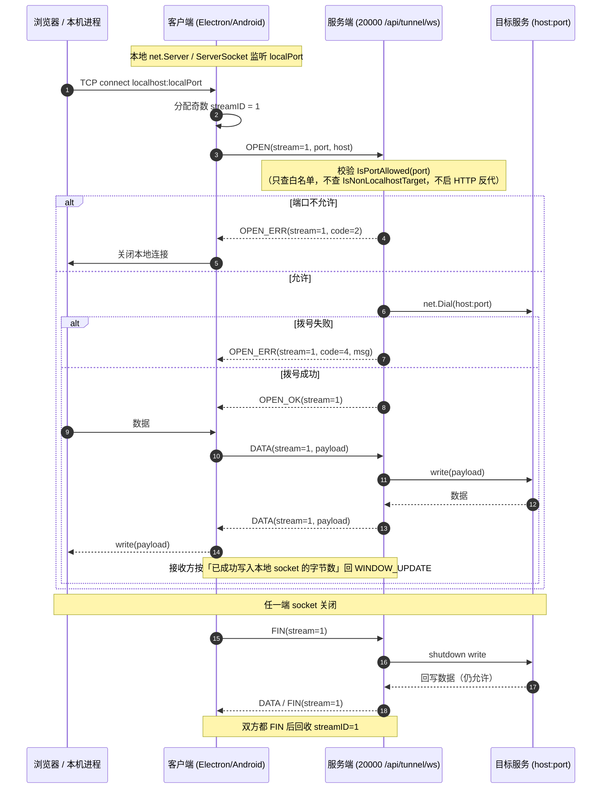
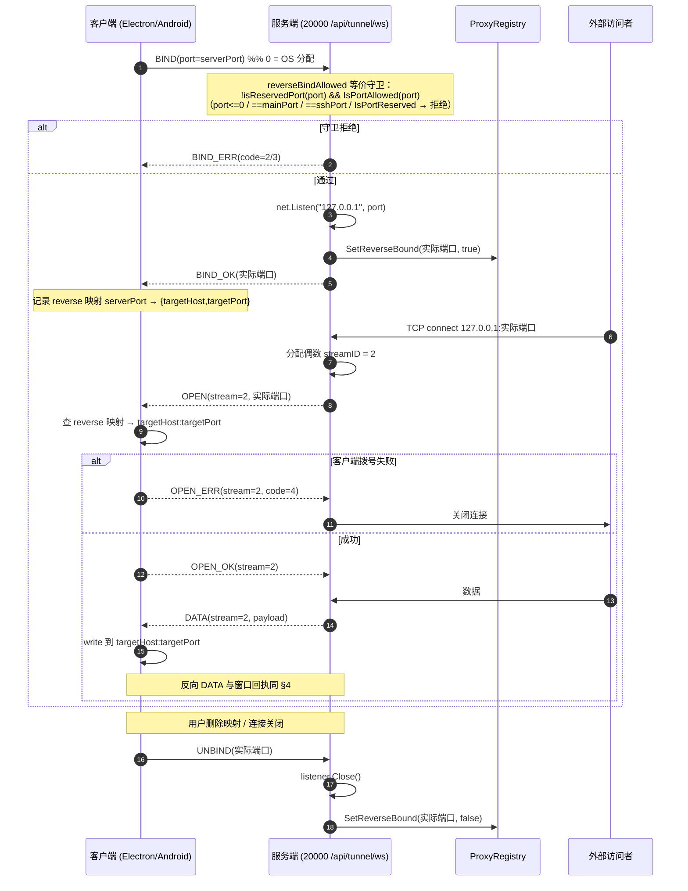

# WebSocket 隧道（CBT1）设计文档

- 日期：2026-09-25
- 状态：设计（未实现）
- 分支：`feat/ssh-ws-forward`
- 关联现状：现有 SSH 端口转发（`-L` / `-R`）全链路已完整存在，本方案**新增**一条等价传输通道，SSH 通道原样保留。

---

## 1. 目标与非目标

### 1.1 目标

用**一条** WebSocket 长连接 + 自定义二进制多路复用协议承载任意 TCP 流，替代 SSH 隧道，使用户在网络与防火墙层面**只需放行 20000 一个端口**。

具体：

1. 新增隧道端点 `ws(s)://<host>:20000/api/tunnel/ws`，与现有 HTTP / WS 共用同一 `http.ServeMux`、同一 `http.Server`、同一 20000 端口。
2. 在**同一**连接上复用多路 TCP 流，支持 `-L`（本地监听 → 服务端拨号）与 `-R`（服务端监听 → 客户端拨号）两个方向，语义与现有 SSH 转发**逐条对齐**（尤其是安全守卫）。
3. 数据模型、DB、HTTP API、OpenAPI、前端 UI、Electron、Android、三端测试**尽量零改动复用**；传输实现可替换。
4. SSH 隧道（独立 20001 监听）保留兼容，可通过配置在 `ssh` / `ws` / `both` 之间选择。

### 1.2 非目标

- 不重写 `ForwardedPort` / `PortInfo` 数据模型，不迁移已有 DB 行、不迁移 SharedPreferences。
- 不改 `buildPortUrl`（其产物 `http(s)://localhost:port` 与传输无关）。
- 不实现流优先级、压缩、多连接池（见 §11）。
- 不触碰 HTTP 反向代理路径（`internal/proxy/reverse_proxy.go`），本方案走裸 TCP 中继，不经过它。
- 不做流量计费 / 审计 / 细粒度 ACL。

---

## 2. 背景与现状（已核实）

### 2.1 单端口事实

HTTP 与 WebSocket 共用 20000：

- `cmd/server/main.go:1304` 预绑定主监听（先探测端口冲突再打印 banner）；
- `cmd/server/main.go:1270` 构造单个 `http.Server`；
- `cmd/server/main.go:1479` `srv.Serve(mainLn)`。

WS 端点按**路径**区分，全部经 `github.com/coder/websocket v1.8.14` 的 `websocket.Accept` 升级。现有 WS 端点（均已在 `internal/api/openapi.yaml` 中以 `get` + `responses."101"` 收录）：

| 端点 | openapi.yaml 行 |
|---|---|
| `/api/ai/events/ws` | 1619 |
| `/api/file/watch/ws` | 2331 |
| `/api/tts/audio/ws` | 3128 |
| `/api/stt/transcribe/ws` | 3158 |
| `/api/terminal/ws` | 3169 |

### 2.2 现有 SSH 转发的可复用资产

**方向与模型**（`internal/model/proxy.go:9-32`）：`DirectionForward = "forward"` / `DirectionReverse = "reverse"`；`ForwardedPort{Port, LocalPort, Host, Name, Protocol, Direction, Active, Enabled}`。注释明确 `Port`/`LocalPort`/`Host` 语义**随 direction 翻转**：

- `forward`：`Port` = 服务端目标端口，`LocalPort` = 客户端监听口，`Host` = 服务端目标主机。
- `reverse`：`Port` = 客户端暴露口，`LocalPort` = 服务端绑定口，`Host` = 客户端目标主机。

**DB**：`internal/service/database.go:628` `direction TEXT NOT NULL DEFAULT 'forward'`；`:1289-1291` ALTER TABLE 迁移。

**注册表**（`internal/service/proxy.go`）：

| 符号 | 行 | 作用 |
|---|---|---|
| `var ProxyService *ProxyRegistry` | 103 | 全局单例 |
| `SetReservedPorts(...)` | 173 | 预留端口（mainPort / sshPort） |
| `IsPortReserved(port)` | 184 | 预留判定 |
| `RegisterPort(port, host, name, protocol, direction)` | 213 | 注册（内部 `NormalizeDirection`） |
| `SetReverseBound(serverPort, bound)` | 504 | 驱动 reverse 的 `Active` |
| `ListPorts()` | 520 | 列表（含 reverse） |
| `IsPortAllowed(port)` | 539 | 白名单（`allowed_ports`） |
| `allocateServerPort` | 55 | 跳过 reserved 并探测 OS |
| `exposedPort(p)` | 162 | 暴露口计算 |
| `isPortInRange` | 1125 | 支持 `"1024-65535"` / `"3000,5173"` / 混合；空串 = 全放行 |
| `IsNonLocalhostTarget` | 1270 | **仅**用于 HTTP 反代改写 Host |

**SSH 侧安全守卫（必须在新实现里保留等价语义）**：

- `internal/ssh/server.go:589` `reverseBindAllowed(port)` = `!isReservedPort(port) && portReg.IsPortAllowed(port)`；
- `internal/ssh/server.go:620` `isReservedPort` = `port<=0 || port==mainPort || port==sshPort || portReg.IsPortReserved(port)`；
- 正向路径（`handleDirectTCPIP`，`:710`）**只**查 `IsPortAllowed(targetPort)`（`:738`），注释明确「transport layer 中继不需要 URL 改写元数据」，即**不查** `IsPortRegistered`、不启 HTTP 反代。

**注册表创建门控**（`cmd/server/main.go:1064-1088`）：`ProxyRegistry` **只在** `cfg.PortForward.Enabled` 时创建（注释明说「没有 SSH 隧道它没有独立用途」）；`:1074` `SetReservedPorts(port, sshPort)`；`:1075` 赋给 `service.ProxyService`。热重载路径 `reserveSSHPorts`（`:1739`）由 `hotReloadSSH`（`:1750`）调用。

**HTTP API**（`internal/handler/proxy_api.go`，OpenAPI `internal/api/openapi.yaml:3889-3936`）：

| 方法/路径 | 行 | 请求体/参数 |
|---|---|---|
| POST `/api/proxy/ports` | 37-61 | `{port, host, name, protocol, direction}` |
| PUT `/api/proxy/ports` | 63-87 | 加 `localPort` |
| DELETE `/api/proxy/ports` | 89-103 | query `port`（= localPort） |
| PUT `/api/proxy/ports/enabled` | 107-127 | `{localPort, enabled}` |

### 2.3 客户端可复用资产

**前端**（`web/src/composables/usePortForward.ts`）：`registerPort`(:307) / `updatePort`(:333) / `unregisterPort`(:343) / `syncToNative`(:410) / `addNativeForward`(:278) / `removeNativeForward`(:291) **全部已按 direction 分派**到 `native.addReverseForwardedPort` vs `native.addForwardedPort`。桥契约 `web/src/utils/clawbenchNative.ts:95-96`。`effectivePorts`(:148) 与 `refreshLocalReachability`(:256) **刻意跳过 reverse**（reverse 无本地监听）。

**Electron**（`desktop/src/main/tunnel.ts`）：

| 符号 | 行 |
|---|---|
| `state.forwarded: Map<number,{targetPort,host,direction}>`（键 = 对端监听口） | 27 |
| `forwardServers: Map<number,net.Server>` | 58 |
| `reverseForwards: Map<number,{targetPort,host,serverPort}>` | 69 |
| 连接监视器 | 84-122 |
| `unforwardReverse` | 144 |
| `classifyError` | 165 |
| `openClient`（ssh2 生命周期） | 181-304 |
| `'tcp connection'` 处理器 | 237-257 |
| `disconnectTunnel` | 311 |
| `pendingBinds` | 339 |
| `listenForward`（**唯一**真正调 `forwardOut` 的是 :350 一行） | 341-383 |
| `pendingReverseBinds` | 396 |
| `listenReverse`（用 `forwardIn`） | 398-425 |
| `rebuildAllForwards` | 434 |
| `addForwardedPort` | 445 |
| `addReverseForwardedPort` | 462 |
| `removeForwardedPort` | 472 |
| `testPortReachable` | 492 |
| `fetchSshInfo` | 510 |
| `ensureTunnel` | 541 |
| `reconnectTunnel` | 564 |

IPC 在 `desktop/src/main/bridge.ts:84-93`，preload 在 `desktop/src/preload/index.ts:70-87`。桌面读 cookie 的现成实现：`desktop/src/main/clientLog.ts:88-96 getSessionCookie()`。

**Android**（`android/app/src/main/java/com/clawbench/app/BackgroundService.java`）：

| 符号 | 行 | 备注 |
|---|---|---|
| `PortInfo{targetPort,host,reverse}` | 141-168 | **会被序列化进 SharedPreferences** |
| `forwardedPorts` / `reversePorts` | 171 / 178 | 内存态 |
| `saveForwardedPorts` / `restoreForwardedPorts` | 1070 / 1151 | |
| `saveReversePorts` / `restoreReversePorts` | 1092 / 1113 | |
| `ensureConnection`（:1455-1483 重放 -L；:1489-1513 重放 -R） | 1377-1517 | |
| `addPortForward`（:1601 `setPortForwardingL`） | 1536 | |
| `removePortForward` | 1741 | |
| `addReversePortForward`（:1823 `setPortForwardingR`） | 1784 | |
| `removeReversePortForward`（:1862 `delPortForwardingR`） | 1852 | |
| `disconnectInternal` | 2011 | |
| 连接监视器（:1250 判 `sshSession.isConnected()`） | 1231-1322 | |
| `networkExecutor = Executors.newSingleThreadExecutor()` | 194 | 29 处调用 |
| `testLocalPort` / `notifyPortForwardResult` | 1661 / 1681 | |
| `onStartCommand` Intent 分支（ADD/REMOVE[_REVERSE]_PORT、DISCONNECT） | 864-930 | |
| 静态 helper | 2403-2461 | |
| `getForwardedPortsSnapshot` / `getReversePortsSnapshot` | 2474 / 2464 | |
| `initTrustAllSSL` | 2482 | |
| `connectNativeWs`（既有**独立** OkHttp WS 客户端） | 2626-2693 | 读 `CookieManager` 的 `clawbench_session` / `cb<port>_clawbench_session`（:2520-2536），带 Cookie 头（:2567-2570） |
| `NativeEventListener` | 2776 | |
| ping loop | 2217-2275 | |

**全文件没有任何 `ServerSocket`**（仅一处注释）。息屏会主动断 SSH（约 :806-830）以省电。

**其他**：`web/src/utils/portForwardUtils.ts` 的 `buildPortUrl`(:59-66) 只产 `http(s)://localhost:port`（仅 3 处 `window.open` 调用）；`tunnelStatusFromPorts`(:47-52) 是纯函数、与传输无关、**零改动**。

### 2.4 必须绕开的硬坑

| 坑 | 事实 | 对策 |
|---|---|---|
| WS 读上限 | `coder/websocket v1.8.14` 默认单条消息读上限 **32768**（`read.go:107`），超限以 **1009** 关闭 | 显式 `SetReadLimit`，且与单帧上限严格一致 |
| 写并发 | `conn.Write` 本身并发安全，但仓库惯例另加 `sync.Mutex` | 沿用：全局 `writeMu` |
| Ping 并发 | `conn.Ping` 必须与 Reader 并发调用 | 保活 ticker 独立 goroutine |
| OpenAPI 漂移 | `openapi_drift_test.go:27-87` 对**任何** `/api/` 前缀注册路由做反向检查 | 新端点必须写进 `openapi.yaml`（`get` + `responses."101"`） |
| 前端 SSH 门控 | `usePortForward.ts:492` 的 `if (!info?.enabled) return` 会让服务器未开 SSH 时跳过整个健康检查 | 放宽为「SSH 或 WS 任一可用」 |
| Android 息屏 | 约 :806-830 息屏主动断 SSH 省电 | WS 隧道**不**继承该 suspend |
| Android 线程 | `networkExecutor` 单线程 | 多路复用 I/O 必须另起线程 |

---

## 3. 协议 CBT1（ClawBench Tunnel v1）

### 3.1 端点与握手

- 端点：`ws(s)://<host>:20000/api/tunnel/ws`
- 鉴权：经现有 `middleware.Auth`（cookie）。客户端复用 `desktop/src/main/clientLog.ts:88-96 getSessionCookie()`（Android 复用 `connectNativeWs` 的 Cookie 读取逻辑）。
- 子协议：请求头 `Sec-WebSocket-Protocol: clawbench-tunnel.v1`；服务端在 `websocket.Accept` 的 `Subprotocols` 中确认。
- **仅二进制帧**。收到文本帧视为协议违规 → `RST(0)` / `GOAWAY`。
- 未鉴权 → 升级前 `401`（`middleware.Auth` 拦下）。

### 3.2 帧格式

定长 **10 字节**头（网络序 = 大端）：

```
 0        1        2        3        4        5        6        7        8        9
+--------+--------+--------+--------+--------+--------+--------+--------+--------+--------+
| ver(1) | type(1)|        streamID(4, BE)        |         length(4, BE)              |
+--------+--------+--------+--------+--------+--------+--------+--------+--------+--------+
|                              payload (length 字节)                                       |
+------------------------------------------------------------------------------------------+
```

- `ver`：恒为 `1`；其他值 → `GOAWAY(1)`。
- `type`：见下表。
- `streamID`：流标识，见 §3.3；`0` 为**连接级**（`GOAWAY`、`WINDOW_UPDATE` 不适用流时等）。
- `length`：payload 字节数；**上限 16 KiB**（`16 * 1024 = 16384`）。
- payload 具体布局随 `type` 而定。

### 3.3 流 ID 分配

| 发起方 | 奇偶 | 说明 |
|---|---|---|
| 客户端 | **奇数**（1, 3, 5, …） | 客户端主动发 `OPEN`（`-L` 的每个入站 TCP 连接） |
| 服务端 | **偶数**（2, 4, 6, …） | 服务端主动发 `OPEN`（`-R` 的每个入站 TCP 连接） |
| 连接级 | `0` | `GOAWAY` 等 |

分配后流 ID **单调递增、不复用**（避免陈旧 DATA 误投）。ID 空间 31 位有效（最高位保留，故 `length` 与 `streamID` 均按无符号 32 位读、实际取低 31 位）。

### 3.4 帧类型表

| 名称 | 值 | 方向 | payload 布局 | 语义 |
|---|---|---|---|---|
| `OPEN` | `0x01` | 发起方 → 对端 | `port(2 BE) + hostLen(1) + host(hostLen)` | 请求建立一条到 `host:port` 的流 |
| `OPEN_OK` | `0x02` | 对端 → 发起方 | 空 | 拨号成功，流进入双向 DATA |
| `OPEN_ERR` | `0x03` | 对端 → 发起方 | `code(1) + msgLen(2 BE) + msg` | 拨号失败，流终止 |
| `DATA` | `0x04` | 双向 | 任意 ≤16 KiB | 流载荷 |
| `FIN` | `0x05` | 双向 | 空 | 该方向**不再有数据**；对端仍可回写（半关闭） |
| `RST` | `0x06` | 双向 | `code(1) + msgLen(2 BE) + msg` | 异常终止；立即释放流与窗口 |
| `WINDOW_UPDATE` | `0x07` | 双向 | `delta(4 BE)` | 增加对端在该流上的发送信用 |
| `BIND` | `0x08` | 客户端 → 服务端 | `port(2 BE)` | `-R`：请求服务端监听该端口（`0` = 由 OS 分配） |
| `BIND_OK` | `0x09` | 服务端 → 客户端 | `port(2 BE)` = 实际绑定口 | 绑定成功 |
| `BIND_ERR` | `0x0A` | 服务端 → 客户端 | `code(1) + msgLen(2 BE) + msg` | 绑定失败 |
| `UNBIND` | `0x0B` | 客户端 → 服务端 | `port(2 BE)` | 释放该绑定 |
| `GOAWAY` | `0x0C` | 双向 | `code(1) + msgLen(2 BE) + msg` | 连接级关闭：不再接受新流，已有流可收尾 |

`code` 建议取值（`OPEN_ERR` / `BIND_ERR` / `RST` / `GOAWAY` 共用）：

| code | 含义 |
|---|---|
| `0` | 正常 / 无错误 |
| `1` | 协议错误（版本、类型、畸形帧） |
| `2` | 端口不允许（白名单拒绝） |
| `3` | 端口被保留 / 已被占用 |
| `4` | 连接失败（`net.Dial` / `net.Listen` 出错） |
| `5` | 流/连接数超限 |
| `6` | 内部错误 |

### 3.5 流控（每流信用窗口）

- 每流**初始信用窗口 256 KiB**（`262144`）。
- 发送方每发一个 `DATA` 扣减信用 `len(payload)`；**窗口耗尽即停写该流**（其他流不受影响）。
- 接收方**按「已成功写入本地 socket 的字节数」**回 `WINDOW_UPDATE(delta)`——**不是**「已从 WS 收到」。
- 因此单流缓冲上界 = 窗口大小（256 KiB）；且**全局读循环永不阻塞**（收到 `DATA` 只入该流缓冲并异步写），保证**无跨流队头阻塞**。

窗口记账伪代码（说明用，非实现）：

```
# 发送侧
on DATA(frame):
    assert len(frame.payload) <= credit[stream]      # 否则为协议错误
    credit[stream] -= len(frame.payload)
    if credit[stream] == 0: pause_reading_local_socket(stream)

on WINDOW_UPDATE(stream, delta):
    credit[stream] += delta
    if was_paused: resume_reading_local_socket(stream)

# 接收侧（关键：以「写盘成功」为准）
on DATA(stream, payload):
    append(stream.recvBuf, payload)                  # 不阻塞读循环
    spawn: n = write(localSocket, stream.recvBuf)    # 异步
           send WINDOW_UPDATE(stream, n)             # 只报已成功写出的字节
```

### 3.6 并发模型

- **全局单读循环**：按 `streamID` 分发到对应流状态机。
- **每流一个写协程**：从该流发送队列取帧。
- 所有 `conn.Write` 经**一把 `writeMu`** 串行化（沿用仓库惯例），并加 **5s 写超时**。
- 连接级帧（`GOAWAY`、连接级 `WINDOW_UPDATE`）与流帧共用同一把锁。

### 3.7 上限

| 项 | 值 |
|---|---|
| 单帧 payload | 16 KiB |
| 每连接最多流数 | 64 |
| WS 读上限 | `SetReadLimit(16*1024 + 10)`（帧头 + 最大 payload，**必须与单帧上限一致**） |
| 每流窗口 | 256 KiB |

超限行为：流数超 64 → `OPEN_ERR(5)` / `BIND_ERR(5)`；单帧超 16 KiB → 协议错误 → `GOAWAY(1)`（**注意**：若 `SetReadLimit` 小于实际帧，库会以 **1009** 直接断连，而非走我们的 `GOAWAY`，故两者必须一致）。

### 3.8 保活

- 用 **WS 原生 ping/pong**：服务端 ticker **30s** 调 `conn.Ping`（必须与 Reader 并发）。
- **不设**「无数据即断」的 idle 超时——隧道可能长时间空闲（用户挂着页面）。

### 3.9 半关闭

- `FIN`：该方向不再有数据，**对端仍可回写**（对应 TCP `shutdown(SHUT_WR)`）。
- 双方都发过 `FIN` → 回收流。
- `RST`：异常终止，立即释放流与窗口，不再等待对端。

---

## 4. `-L` 流程（本地监听 → 服务端拨号）

客户端本地监听 `localPort`，每个 accepted TCP 连接分配**奇数** `streamID`，发 `OPEN(port, host)`；服务端校验 `IsPortAllowed(port)` 后 `net.Dial`，成功回 `OPEN_OK`、失败回 `OPEN_ERR`；随后双向 `DATA`。



**与 SSH 语义对齐点**：只查 `IsPortAllowed`（对齐 `handleDirectTCPIP` 在 `internal/ssh/server.go:738` 的行为）；不查 `IsPortRegistered`、不启 HTTP 反代、不改写 URL/Host。

---

## 5. `-R` 流程（服务端监听 → 客户端拨号）

客户端发 `BIND(serverPort)`；服务端用与 SSH `reverseBindAllowed` **等价**的守卫（`IsPortReserved` + `IsPortAllowed` + 不等于 `mainPort` / `sshPort`）→ `net.Listen("127.0.0.1", port)`（`port=0` 时由 OS 分配）→ 回 `BIND_OK(实际端口)`；同时调 `ProxyRegistry.SetReverseBound(实际端口, true)` 驱动 `Active`；失败回 `BIND_ERR`。服务端 accept 到连接 → 分配**偶数** `streamID` 发 `OPEN(该 bind 的端口)` → 客户端查本地 reverse 映射得到目标 `host:port` 并拨号 → `OPEN_OK` / `OPEN_ERR` → 双向 DATA。`UNBIND` 或连接关闭 → 释放 listener + `SetReverseBound(port, false)`。



**与 SSH 语义对齐点**：守卫必须逐条等价，尤其是 `port<=0`（除 `port==0` 表示 OS 分配外，其余 `<=0` 拒绝）、`==mainPort`、`==sshPort`、`IsPortReserved`。`SetReverseBound` 的调用位置决定前端 `Active` 徽标（对齐 `internal/service/proxy.go:504`）。

> **`port=0` 语义说明**：`BIND(0)` 表示「由 OS 分配」。守卫中的 `port<=0` 针对**显式请求的非法端口**，需在实现里区分「请求 0（合法，交给 OS）」与「请求负/其他非法值」；`isReservedPort` 在 SSH 里是 `port<=0 || ...`，映射到 CBT1 时应对 `port==0` 走「OS 分配」分支，其余 `port<=0` 拒绝。

---

## 6. 服务端改动清单

| 文件 | 行号 | 状态 | 说明 |
|---|---|---|---|
| `internal/tunnel/`（新包） | — | **新增** | 帧定义、编解码、流状态机、窗口记账；纯逻辑，便于表驱动单测 |
| `internal/handler/tunnel_ws.go` | — | **新增** | `TunnelWS(w, r)`：`websocket.Accept`（确认子协议）→ `SetReadLimit` → 单读循环 + 每流写协程 |
| `internal/handler/handler.go` | SSH 段后（457-475 附近） | **需改** | 加 `register("/api/tunnel/ws", TunnelWS)`（注意 `RegisterRoutes` 是路由唯一来源） |
| `cmd/server/main.go` | 1064-1088 | **需改** | 放宽 `ProxyRegistry` 创建条件，使隧道不依赖 `PortForward.Enabled` |
| `cmd/server/main.go` | 1739-1812 | **需改** | `reserveSSHPorts` / `hotReloadSSH` 需覆盖「仅 WS 隧道启用」的情况，保证 reserved 端口仍被登记 |
| `internal/api/openapi.yaml` | 新条目 | **需改** | 新增 `/api/tunnel/ws`：`get` + `responses."101"`（对齐 1619/1635 的既有写法） |
| `docs/spec/api/README.md` | 7 | **需改** | 「150 个路径 / 189 个操作」→ **151 / 190** |
| `docs/spec/README.md` | 64 | **需改** | 同上计数 +1；WS 端点表加入新端点 |
| `internal/model/port_forward.go` | 全文 | **需改** | 新增 `transport` 字段（见 §9） |
| `internal/model/defaults.go` | 306-314 | **需改** | `transport` 默认值 |
| `internal/handler/settings.go` | 103-105 / 223 / 332-335 / 620-622 / 776-779 / 964 / 1567-1577 | **需改** | 把 `port_forward.transport` 接入 hotReload / 填充 / Patchable / 校验 / apply 五处 |

**明确不做**：**不**复用 `internal/handler/ssh_info.go` 的 `SetSSHServer` 全局注入。隧道 handler 是**无状态**的，只依赖 `service.ProxyService`，且**必须 nil 守卫**（未启用任何转发时 `ProxyService == nil`）。

---

## 7. 客户端改动清单

### 7.1 Electron（`desktop/src/main/`）

核心思路：把 SSH 传输**抽成 `transport` 接口**，新增 `wsTransport.ts` 实现 CBT1；`tunnel.ts` 中与传输无关的状态与逻辑**一行不改**。

`transport` 接口：

| 方法 | 语义 |
|---|---|
| `connect()` | 建立底层连接（SSH 握手 / WS 升级） |
| `openStream(host, port)` | `-L`：拨号一条流，返回双向流句柄 |
| `bind(port)` | `-R`：请求对端监听，返回实际端口 |
| `unbind(port)` | `-R`：释放监听 |
| `close()` | 断开传输 |
| `isConnected()` | 连接态 |

| 文件 | 行号 | 状态 | 说明 |
|---|---|---|---|
| `desktop/src/main/wsTransport.ts` | — | **新增** | CBT1 实现；显式依赖 `ws` 包（见 §8.1） |
| `desktop/src/main/tunnel.ts` `openClient` | 181-304 | **需改** | 按传输分派 |
| `desktop/src/main/tunnel.ts` `listenForward` | 341-383（`forwardOut` 在 350） | **需改** | 唯一真正调 `forwardOut` 的一行改走 `transport.openStream` |
| `desktop/src/main/tunnel.ts` `listenReverse` | 398-425 | **需改** | 改走 `transport.bind` |
| `desktop/src/main/tunnel.ts` `unforwardReverse` | 144 | **需改** | 改走 `transport.unbind` |
| `desktop/src/main/tunnel.ts` `disconnectTunnel` | 311 | **需改** | 改走 `transport.close` |
| `desktop/src/main/tunnel.ts` `classifyError` | 165 | **需改** | 增加 CBT1 错误码映射 |
| `desktop/src/main/tunnel.ts` `ensureTunnel` | 541 | **需改** | 按传输分派 |
| `desktop/src/main/tunnel.ts` `state.forwarded` | 27 | **复用** | 不改 |
| `desktop/src/main/tunnel.ts` `reverseForwards` | 69 | **复用** | 不改 |
| `desktop/src/main/tunnel.ts` `forwardServers` | 58 | **复用** | 不改 |
| `desktop/src/main/tunnel.ts` `pendingBinds` / `pendingReverseBinds` | 339 / 396 | **复用** | 不改 |
| `desktop/src/main/tunnel.ts` 连接监视器 | 84-122 | **复用** | 不改 |
| `desktop/src/main/tunnel.ts` `testPortReachable` | 492 | **复用** | 不改 |
| `desktop/src/main/tunnel.ts` `rebuildAllForwards` | 434 | **复用** | 不改 |
| `desktop/src/main/tunnel.ts` `addForwardedPort` / `addReverseForwardedPort` / `removeForwardedPort` | 445 / 462 / 472 | **复用** | 不改 |
| `desktop/src/main/tunnel.ts` `reconnectTunnel` | 564 | **复用** | 不改 |
| `desktop/src/main/bridge.ts` | 84-93 | **需改** | 新增传输选择/查询的 IPC |
| `desktop/src/preload/index.ts` | 70-87 | **需改** | 暴露新增 IPC |
| `web/src/utils/clawbenchNative.ts` | 90-96 附近 | **需改** | 桥契约加可选方法（三处同步） |

鉴权复用 `desktop/src/main/clientLog.ts:88-96 getSessionCookie()`。

### 7.2 Android（`BackgroundService.java`）

| 项 | 行号 | 状态 | 说明 |
|---|---|---|---|
| 本地 `ServerSocket` 监听循环 | — | **新增** | 每个 `localPort` 一个 accept 循环 |
| accepted → WS 流桥接 + 背压 | — | **新增** | 见 §7.2.1 |
| `setPortForwardingL`（`addPortForward` 内） | 1601 | **替换** | 改走 WS `OPEN` |
| `setPortForwardingR`（`addReversePortForward` 内） | 1823 | **替换** | 改走 WS `BIND` |
| `delPortForwardingR`（`removeReversePortForward` 内） | 1862 | **替换** | 改走 WS `UNBIND` |
| `delPortForwardingL`（`removePortForward` 内） | 1741 区域 | **替换** | 关闭本地 `ServerSocket` |
| `PortInfo` | 141-168 | **保持不变** | 仍可序列化；listener / 流引用另开 `Map` 存放（不落盘） |
| `networkExecutor` | 194 | **复用但不够** | 单线程；多路复用 I/O 必须**另起线程** |
| `-R` 的 `isNonLocalhost()` | — | **保持** | reverse 无本地监听，现状返回 false |
| 息屏 suspend | 806-830 | **需改** | 按传输区分：WS 隧道**不应**被 suspend |
| 隧道 WS 客户端 | — | **新增** | 用**独立** `OkHttpClient` 实例，与既有 `connectNativeWs` 隔离故障 |

#### 7.2.1 Android 背压要点（必须遵守）

- `okhttp3.WebSocket.send(okio.ByteString)` 返回 **boolean，必须检查**；返回 false 表示发送失败/关闭中。
- `RealWebSocket` 内部队列上限 **16 MiB**，超限即 `close(1001)`；**无 drain 事件**，只能**轮询 `queueSize()`** 做背压。
- `send()` **必须在独立线程**做，**不能**在 `onMessage` 回调里做阻塞 I/O（否则读循环被堵，与 §3.5 的「读循环永不阻塞」相悖）。

---

## 8. 前端改动清单（`web/src/`）

| 项 | 行号 | 状态 | 说明 |
|---|---|---|---|
| `tunnelStatus` / `tunnelError*` / `connectingPorts` / `localReachable` / `syncToNative` / `openPort*` / `reconnectPort` | 见 `usePortForward.ts` | **复用** | 不改 |
| `loadSSHInfo` | 471 | **需改** | 放宽为「SSH 或 WS 任一可用」 |
| `checkTunnelHealth` 的 `info?.enabled` 门控 | 492 | **需改** | 同上放宽，否则服务器未开 SSH 时整个健康检查被跳过 |
| `transport` 暴露给面板 | — | **新增** | 面板展示当前传输 |
| `portForwardUtils.ts` `buildPortWsUrl` | — | **新增** | 只**新增**，不改 `buildPortUrl`(:59-66) |
| `tunnelStatusFromPorts` | 47-52 | **零改动** | 纯函数、与传输无关 |
| i18n | — | **新增** | transport 文案 |
| `usePortForward.test.ts` mock | 70-88 | **需改** | 该文件自复制了一份 `portForwardUtils` mock，新增函数要同步 |

---

## 9. 兼容与配置

### 9.1 配置项

新增 `port_forward.transport: ssh | ws | both`。

- 默认值需保兼容：建议 **`both`**（对已启用 SSH 的用户行为不变，同时提供 WS），或保守取 **`ssh`**（完全等价旧行为，用户显式切换）。
- 涉及文件：
  - `internal/model/port_forward.go`（结构体字段）
  - `internal/model/defaults.go:306-314`（默认值）
  - `internal/handler/settings.go`：`:332-335 configPortForward`、`:776-779` 填充、`:620-622 PatchableConfigPaths`、`:103-105 hotReloadFields`、`:1567-1577 applyConfigPatch`、`:964 validatePatchValues`
- SSH 服务器代码与 **20001 监听原样保留**。

### 9.2 迁移

- 无 DB 迁移、无 SharedPreferences 迁移：`ForwardedPort` / `PortInfo` 结构不变，`transport` 只是新增的**服务器侧配置**，不进入已持久化的端口行。
- 现有 `forward` / `reverse` 行在 `ws` 模式下直接由 CBT1 承载，前端 UI 无需感知差异。

### 9.3 健康检查放宽

前端 `loadSSHInfo`(:471) / `checkTunnelHealth`(:492) 的 `info?.enabled` 门控必须放宽为「SSH 或 WS 任一可用」；`transport` 由新增桥方法上报。

---

## 10. 测试策略

### 10.1 Go

**`internal/tunnel/` 单元测试**（表驱动）：

- 帧编解码：正常帧、**畸形帧**（`length` 与实际不符、截断头）、**超大帧**（>16 KiB）、**未知类型**、`ver != 1`。
- 流状态机：`OPEN`→`OPEN_OK`→`DATA`→`FIN`→回收；`RST` 立即释放；重复 `streamID` 拒绝。
- 窗口记账：**窗口耗尽即停写**、`WINDOW_UPDATE` 恢复、以「写盘成功字节数」为准（构造部分写场景验证 delta）。

**`internal/handler/tunnel_ws_test.go`**：仿 `internal/handler/file_watch_test.go:29-69` 的 `httptest.NewServer` + `websocket.Dial` + Cookie 头模式。

| 用例 | 对应 SSH 测试 |
|---|---|
| 白名单拒绝 | — |
| 允许但未注册端口可拨 | — |
| echo 往返 | — |
| 64 KiB 大块传输 | `TestSSHPortForward_LargeDataTransfer`（`internal/ssh/server_test.go:386`） |
| 多流并发 | — |
| `ProxyService == nil` | — |
| 未鉴权 401 | — |
| 握手状态码 | — |

**`-R` 用例**：

| 用例 | 对应 SSH 测试 |
|---|---|
| BIND 保留端口拒绝（mainPort / sshPort） | `TestSSHReverseForward_RejectsMainPort`(:1493) / `..._RejectsReservedSSHPort`(:1481) |
| allowed range 拒绝 | `TestSSHReverseForward_RejectsDisallowedPort`(:1524) |
| 重复绑定拒绝 | `TestSSHReverseForward_DuplicatePortSecondClientRejected`(:1629) |
| UNBIND 释放端口 | `TestSSHReverseForward_CancelReleasesPort`(:1536) |
| `SetReverseBound` 的 Active 生命周期 | `TestSSHReverseForward_RegistryActiveLifecycle`(:1580) |

### 10.2 Electron

- 新增平行的 **`tunnel.ws.test.ts`**，注入 fake WS transport。
- 现有 **`tunnel.test.ts` 的 63 个用例**在保留 SSH 为默认传输时**必须继续全绿**。
- 依赖说明：`desktop/node_modules` 当前缺失，需先 `cd desktop && npm ci`；本机 node 为 **v20**（无全局 `WebSocket`），Electron 44 运行时是 Node 24（有）——**单测不能依赖全局 `WebSocket`**，故显式依赖 **`ws` 包**（纯 JS、无 native 构建、随 asar 打包，**必须提交 `package-lock.json`**）。

### 10.3 Android

- 仿 `BackgroundServiceFloatingTest.java:663-674` 的**反射式 mock** 风格（`mock(okhttp3.WebSocket.class)` + 反射调 `onMessage`），用 `okio.ByteString` 造帧。
- 现有 **804 个 `@Test`** 中 mock JSch `Session` 的那批，在保留 SSH 传输时保持通过。

### 10.4 前端

- 扩 `usePortForward.test.ts`；注意 **:70-88** 自复制了一份 `portForwardUtils` mock，新增函数要同步。

---

## 11. 明确不做的事（YAGNI）

1. **不做流优先级**：单用户工作台场景，流数上限 64，无 QoS 需求。
2. **不做压缩**：载荷多为本地回环流量，压缩收益低、CPU 与延迟代价高；`permessage-deflate` 还会与二进制帧大小核算纠缠。
3. **不做多连接池**：单条 WS 连接已通过多路复用承载全部流；池化会引入跨连接流 ID 协调与故障域扩大。
4. **不重写 `PortInfo`**（Android 持久化结构）：改结构需迁移，风险大于收益；listener/流引用另开 `Map`。
5. **不改 `buildPortUrl`**：其产物 `http(s)://localhost:port` 与传输无关，仅新增 `buildPortWsUrl`。
6. **不补 HTTP 反代 WS 升级透传测试**：`internal/proxy/reverse_proxy.go` 的 WS 升级透传无任何测试（`internal/proxy/reverse_proxy_test.go` 583 行零升级用例），但本方案走**裸 TCP 中继**、**不经过**它，故不在本次补；**若将来改动该路径必须补测**。
7. **不复用 `SetSSHServer` 全局注入**：隧道 handler 无状态。

---

## 12. 已知风险

| # | 风险 | 说明 | 缓解 |
|---|---|---|---|
| 1 | 单帧上限与 `SetReadLimit` 不一致 | 若 `SetReadLimit` < 实际帧，大块传输以 **1009** 断连，且不走我们的 `GOAWAY` | 二者严格取 `16*1024 + 10`；单测覆盖超大帧 |
| 2 | 窗口记账错误 | 若把「已接收」当「已写盘」，内存无限膨胀 | 严格以**写入 socket 成功**的字节数为准回 `WINDOW_UPDATE`；单测构造部分写 |
| 3 | `-R` 保留端口守卫丢失 | 服务端端口可被客户端任意绑定（**安全回归**） | 守卫与 `reverseBindAllowed` / `isReservedPort` **逐条等价**；单测覆盖 mainPort / sshPort / allowed range |
| 4 | Android `PortInfo` 被持久化 | 改结构需迁移 | **不改**结构（见 §11.4） |
| 5 | 反代 WS 升级透传无测试 | `reverse_proxy_test.go` 零升级用例 | 本方案不经过它；**将来改动必须补测** |
| 6 | `openapi_drift_test.go` 强制同步 spec | 新 `/api/` 路由不写 spec 必挂 CI | 新增 `/api/tunnel/ws` 条目 + 计数 +1 |
| 7 | Android 背压 | `send()` 返回 boolean 需检查；16 MiB 队列超限即 `close(1001)`；无 drain 事件 | 轮询 `queueSize()`；`send()` 独立线程 |
| 8 | 前端 SSH 门控残留 | `info?.enabled` 会跳过健康检查 | 放宽为「SSH 或 WS 任一可用」 |

---

## 13. 参考锚点速查

- 单端口：`cmd/server/main.go:1270` / `:1304` / `:1479`
- 模型：`internal/model/proxy.go:9-32`
- 注册表：`internal/service/proxy.go:103,173,184,213,504,520,539`
- SSH 守卫：`internal/ssh/server.go:589,620,710,738`
- 注册表门控：`cmd/server/main.go:1064-1088,1739,1750`
- HTTP API：`internal/handler/proxy_api.go:37-127`；OpenAPI `internal/api/openapi.yaml:3889-3936`
- 漂移测试：`internal/handler/openapi_drift_test.go:27-87`
- WS 测试范式：`internal/handler/file_watch_test.go:29-69`
- Electron：`desktop/src/main/tunnel.ts:27,58,69,144,165,181,237,311,339,341,396,398,434,445,462,472,492,510,541,564`
- 桥：`desktop/src/main/bridge.ts:84-93`；`desktop/src/preload/index.ts:70-87`；`web/src/utils/clawbenchNative.ts:90-96`
- Cookie：`desktop/src/main/clientLog.ts:88-96`
- Android：`BackgroundService.java:141-168,171,178,194,806-830,1070,1092,1113,1151,1231-1322,1377-1517,1536,1601,1661,1681,1741,1784,1823,1852,1862,2011,2217-2275,2403-2461,2464,2474,2482,2520-2536,2567-2570,2626-2693,2776`
- 前端：`web/src/composables/usePortForward.ts:148,256,278,291,307,333,343,410,471,492`；`web/src/utils/portForwardUtils.ts:47-52,59-66`
