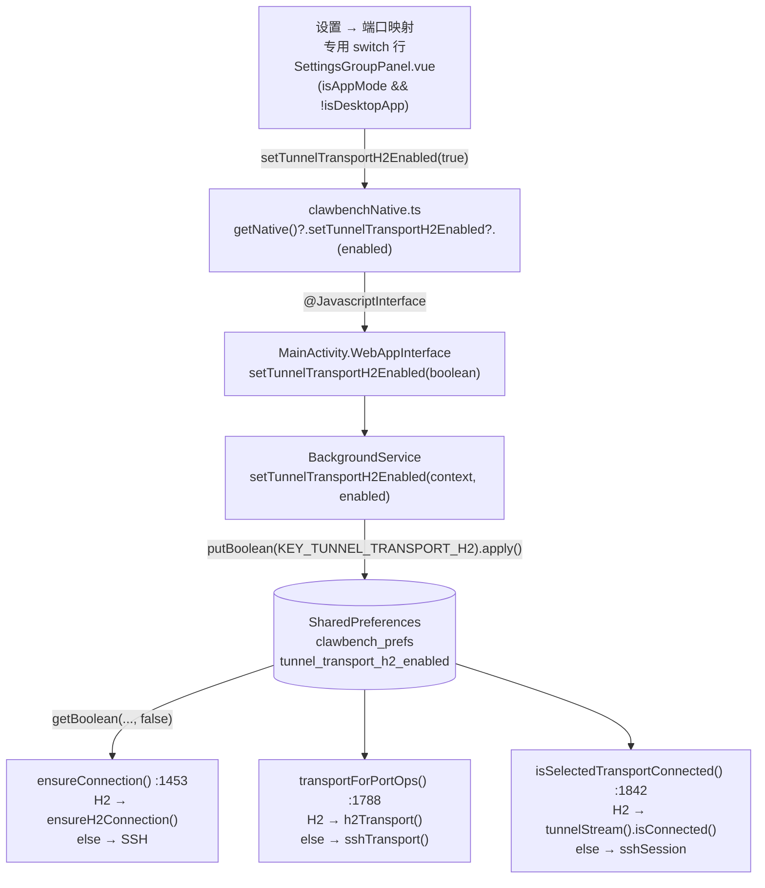
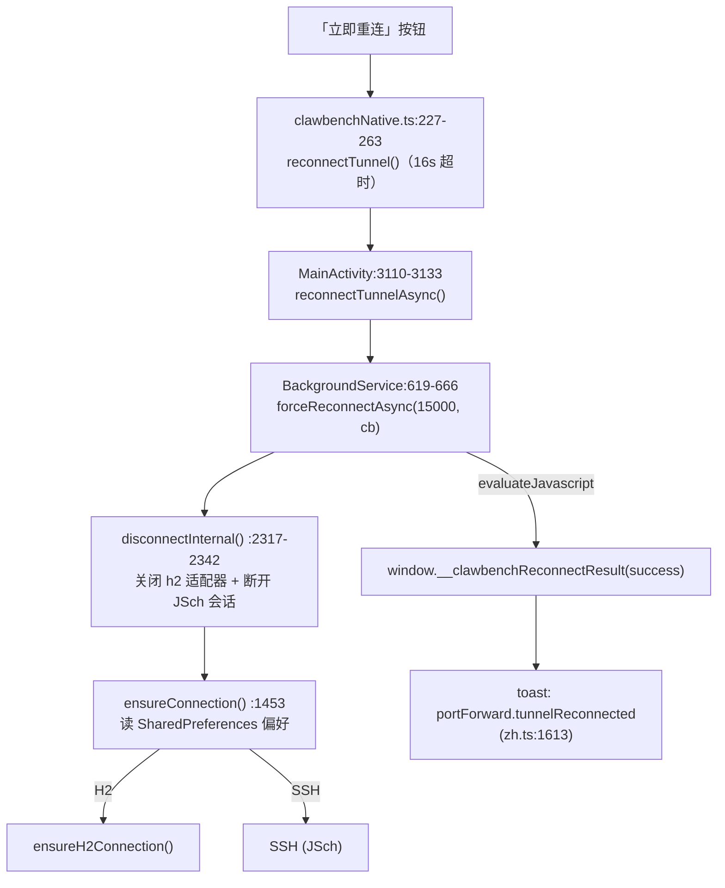

# Android h2 隧道本地开关 设计文档

- 日期：2026-09-28
- 分支：`feat/ssh-ws-forward`
- 范围：**仅 Android 端新增 h2 本地开关**，附带 Electron bridge clamp、前端推送移除、展示 bug 修复与文档同步。**服务端零改动**。

> **行号约定**：本文所有 `文件:行号` 均以本 worktree（`feat/ssh-ws-forward`，HEAD `4c12d3b8`）当前磁盘内容为准。codegraph 索引相对当前分支**已陈旧**（索引构建于 h2 隧道 T 系列改造之前），凡与本文冲突者以本文实测行号为准。改造落地后行号会再次漂移，实施时请以符号名重新定位，不要直接照搬数字。

---

## 1. 目标与非目标

### 1.1 目标

| # | 目标 | 验收点 |
|---|---|---|
| G1 | Android 端 h2 隧道由**本地功能开关**控制，默认关（=SSH） | 开关关闭时行为与改造前完全一致；打开后 `ensureConnection()` 走 h2 |
| G2 | 开关的真相源是 **Android SharedPreferences**，可持久化、冷启动/`START_STICKY` 重启后仍生效 | 打开开关 → 杀进程重启 → 仍走 h2 |
| G3 | 删除 Android 侧 `BOTH` 枚举值（布尔开关无法表达 both） | `PortForwardTransportKind` 只剩 `SSH`/`H2` |
| G4 | Electron 在 **bridge 层写死 `ssh`**（clamp），内部 `TransportPreference` 三值能力保留 | `bridge.test.ts` 对 `h2`/`both` 断言**不**调用 `setTransportPreference` |
| G5 | 移除前端向原生推送 `port_forward.transport` 的链路 | `syncTunnelTransportToNative` 及其调用点消失 |
| G6 | 修复 Android「当前传输」展示永远回退到偏好的 bug | Android 边界把 `tls`/`h2c` 映射为 `h2`，与桌面 `'ssh'|'h2'` 对齐 |

### 1.2 非目标（明确不做）

- ❌ **不改服务端 `port_forward.transport` 默认值**（保持 `both`）。理由见 §2.2，这是本设计最重要的边界。
- ❌ **不给 Electron 启用 h2**。Electron 本次被 clamp 到 `ssh`；`tunnel.ts` 的 h2 代码与测试**保持不动**（`tunnel.h2.test.ts` 必须全绿）。
- ❌ **不做 web 端隧道客户端**。web 模式仍无原生隧道，`activeTransport` 恒为 `''`。
- ❌ **不给 Android 加 `BOTH`**，也不做「h2 优先失败回退 SSH」的 Android 版本。
- ❌ **不动 `android-e2e/`**（另一 agent 负责）。

---

## 2. 决策记录

以下 6 条均已拍板，不再讨论替代方案。每条附理由与证据。

### D1 服务端 `port_forward.transport` 默认保持 `both`，本次零改动

见 §2.2 完整论证。

### D2 Electron 写死 `ssh`（bridge 层 clamp）

`desktop/src/main/bridge.ts:94-96` 的 handler 目前接受三值并原样透传。改为**只对 `'ssh'` 调用** `setTransportPreference`，忽略 `h2`/`both`。

- **理由**：Electron 的 h2 通道尚未在生产验证；用户已决定桌面端本次不启用。clamp 放在 **bridge（IPC 边界）**而非 `tunnel.ts`，既完成了产品约束，又**不动测试驱动的代码路径**。
- **证据**：`desktop/src/main/tunnel.h2.test.ts` 直接 import 并调用 `setTransportPreference`（`:287`、`:359`、`:403`、`:626`、`:633`、`:642`）来驱动 h2 测试。若改 `tunnel.ts`，整个桌面 h2 套件会失败。
- **防旧缓存**：clamp 在 bridge 层还能挡住「旧缓存前端仍推送 `both`」——即使渲染层推了 `both`，主进程也只认 `ssh`。

### D3 Electron 内部 `TransportPreference` 保留 `'ssh'|'h2'|'both'`

`desktop/src/main/transport.ts:35` 的 `TransportPreference` 类型与 `both → ['h2','ssh']` 的「h2 优先、失败回退 SSH」候选顺序逻辑**保留在代码里**，并被 `tunnel.h2.test.ts` 持续覆盖。

- **理由**：桌面 h2 是已完成且已验证的能力，未来可能重新启用。本次只是**产品层关闭**，不是**删除能力**。删了会同时废掉一整套测试与回退逻辑，收益为零。

### D4 Android 通过**本地功能开关**开启 h2，默认关；真相源是 SharedPreferences

见 §4.A 设计。核心是**删除进程级静态字段**，改为「使用时直读偏好」。

### D5 删除 Android 侧 `BOTH`

布尔开关只有「开=h2 / 关=ssh」两态，无法表达 both。

- **删点**：`android/app/src/main/java/com/clawbench/app/tunnel/PortForwardTransportKind.java:18`（`BOTH("both")`）及其 javadoc `:7-10`；`BackgroundService.java:1459-1468` 的 both 回退分支。
- **残留行为**：`fromWire("both")` 之后会落到 `SSH`（`fromWire` 未知值回退 SSH，`:38-45`）——**无害**，因为不再有任何代码发送 `"both"`。
- **不对称（须注明）**：桌面端**保留** `'both'`，Android 没有。两端 `TransportPreference` 集合因此不一致，这是刻意的。

### D6 修复 Android `getActiveTunnelTransport()` 展示 bug

- **现状**：`BackgroundService.getActiveTunnelTransport()`（`:1821-1831`）返回 `kind.wireName()`，即 `"tls"|"h2c"`。但前端白名单 `usePortForward.ts:63` 的 `TRANSPORTS = ['ssh','h2','both']` **不含** `tls`/`h2c`，`read()`（`:551`）判 `TRANSPORTS.includes(value)` 为 false → 回退到偏好。结果：**Android 上 `h2c` 永远显示不出来**，「当前传输」永远显示偏好值。
- **修法**：在 **Android 边界**把 `tls|h2c → h2` 映射，让 Android 与桌面都返回 `'ssh'|'h2'`，前端白名单即可命中。
- **证据**：`BackgroundServiceTransportTest.java:700-705` 现断言 `"h2c"`，需同步改为 `"h2"`。

### D7 移除前端推送 `syncTunnelTransportToNative`

见 §4.F。

### 2.2 为什么服务端零改动（完整论证）

**结论**：把默认值从 `both` 改成 `ssh` 会引入一个真实回归，因此**不动**。

**门控公式**（`cmd/server/proxy_registry_gate.go:43-47`）：

```go
h2Available := cfg.PortForward.Transport != model.TransportSSH
return cfg.PortForward.Enabled || h2Available
```

**关键细节**：`ApplyDefaults` 对 `port_forward.enabled` 缺席时**强制为 true**（`internal/model/defaults.go:308-310`，处理 bool 零值陷阱）：

```go
if !presence["port_forward.enabled"] {
    cfg.PortForward.Enabled = true
}
```

因此只有**显式写 `enabled: false`** 才会让 `Enabled` 为 false。

**若默认值改成 `ssh`**，则出现如下退化路径：

1. 用户配置 `port_forward.enabled: false` 且**不写** `transport`（这是「只想跑 h2、不要 SSH」目标人群的**默认落点**——他们自然会去关 `port_forward.enabled`）。
2. 缺席的 `transport` 收敛为默认值 `ssh` → `Enabled == false` 且 `Transport == SSH` → `shouldCreateProxyRegistry` 返回 **false**。
3. 注册表为 `nil` → `/api/tunnel/stream` 与 `/api/tunnel/control` 被 nil 守卫恒拒 **503**（`internal/handler/tunnel_stream.go:59-62`、`internal/handler/tunnel_control.go:386-389`，均返回 `PortForwardUnavailable`）。
4. **Android 本地开关即使打开也没用**——h2 端点在服务端侧就是 503。

**而且有一条专门的回归守卫**（`cmd/server/proxy_registry_gate_test.go:94-111`）：

```go
require.Equal(t, model.TransportBoth, model.DefaultPortForwardTransport,
    "the default transport must be 'both' — 'ssh' would disable the registry for installs that never set it")
```

这条测试的**意图就是阻止改默认值**。保持 `both` 即可完全绕开该问题，同时**不影响** `android-e2e/server-config/config.no-h2.yaml` 那个 503 控制组（该文件显式写 `enabled: false` + `transport: ssh`，`:44-45`，是唯一 registry 为 nil 的组合，与默认值无关）。

> **核心推论（写入 §10 作为后续可清理项）**：既然 Electron 写死 `ssh`、Android 用本地开关，**两个原生客户端都不再消费服务端的 `port_forward.transport`**。它只剩两个用途：
> 1. **registry 门控**（`cmd/server/proxy_registry_gate.go:43-47`）；
> 2. **web 端健康检查门控**（`web/src/composables/usePortForward.ts:515-523` 的 `tunnelTransportAllowsH2()`，读服务端配置，**仍要认 `'both'`**）。
>
> 这个「配置项对原生客户端已失效」的状态应在后续版本清理，**不是本次范围**。

---

## 3. 现状核实（传输链路逐层锚点）

### 3.1 服务端：定义与下发

| 事实 | 证据 |
|---|---|
| 传输枚举定义 `ssh`/`h2`/`both`，默认 `both` | `internal/model/defaults.go` 的 `DefaultPortForwardTransport`；`ApplyDefaults` 缺失/非法时收敛到它 |
| registry 门控公式 | `cmd/server/proxy_registry_gate.go:43-47` |
| 默认值回归守卫（禁止改 `ssh`） | `cmd/server/proxy_registry_gate_test.go:94-111` |
| `transport` 随 `/api/config` 下发 | `internal/api/openapi.yaml:386-390` |
| `/api/tunnel/stream` nil 守卫 → 503 | `internal/handler/tunnel_stream.go:59-62` |
| `/api/tunnel/control` nil 守卫 → 503 | `internal/handler/tunnel_control.go:386-389` |
| `enabled` 缺席强制 true（bool 零值陷阱） | `internal/model/defaults.go:308-310` |
| 唯一 503 组合 = `enabled:false && transport:ssh` | `android-e2e/server-config/config.no-h2.yaml:44-45` |

### 3.2 前端：推送

| 事实 | 证据 |
|---|---|
| `syncTunnelTransportToNative()` 定义 | `web/src/composables/useSettingsConfig.ts:813-820` |
| 唯一调用点（`loadConfig` 尾部） | `web/src/composables/useSettingsConfig.ts:853` |
| 该函数在 `web/src` **只有这两处出现** | 全仓 grep 确认无其他消费者 |
| 桥方法声明 `setTunnelTransport?` | `web/src/utils/clawbenchNative.ts:84` |
| 展示读取（首选/回退） | `usePortForward.ts:558`（`getActiveTunnelTransport`）/ `:559`（`getTunnelTransport`） |
| 白名单 `TRANSPORTS` | `usePortForward.ts:63` |
| `read()` 白名单判定 | `usePortForward.ts:551` |
| web 健康门控 `tunnelTransportAllowsH2()` | `usePortForward.ts:515-523` |

### 3.3 Electron：接收与使用

| 事实 | 证据 |
|---|---|
| IPC handler 接收三值并透传 | `desktop/src/main/bridge.ts:94-96` |
| 传输类型定义（三值） | `desktop/src/main/transport.ts:35` |
| `tunnel.h2.test.ts` 直接调 `setTransportPreference` 驱动 h2 测试 | `desktop/src/main/tunnel.h2.test.ts:287, :359, :403, :626, :633, :642` |
| preload 暴露 `setTunnelTransport`/`getTunnelTransport` | `desktop/src/preload/index.ts:86, :88` |
| bridge 契约测试 `it.each(['ssh','h2','both'])` | `desktop/src/main/bridge.test.ts:100-115` |
| `notification.test.ts` **只守 `NAV_CHANNELS`**，不守 tunnel transport channel | `desktop/src/main/notification.test.ts:62-78` |

### 3.4 Android：接收与使用

| 事实 | 证据 |
|---|---|
| 进程级静态偏好（**不持久化**） | `BackgroundService.java:212` `private static volatile PortForwardTransportKind transportPreference = ...SSH;` |
| 使用点 1：`ensureConnection()` 读偏好 | `BackgroundService.java:1453-1470`（`PortForwardTransportKind preference = transportPreference;`） |
| 使用点 2：`transportForPortOps()` | `BackgroundService.java:1788-1797`（`:1796` 判 `== H2`） |
| 使用点 3：`isSelectedTransportConnected()` | `BackgroundService.java:1842-1850`（`:1843` 判 `== H2`） |
| 桥 setter `setTransportPreference(String)` | `BackgroundService.java:1803-1807` |
| 桥 getter `getTransportPreference()` | `BackgroundService.java:1810-1812` |
| `getActiveTunnelTransport()` 返回 `"tls"|"h2c"` | `BackgroundService.java:1821-1831` |
| both 回退分支 | `BackgroundService.java:1459-1468` |
| `PortForwardTransportKind`（**实际在 `tunnel/` 子包**） | `android/app/src/main/java/com/clawbench/app/tunnel/PortForwardTransportKind.java`（`BOTH` 在 `:18`，javadoc `:7-10`，`fromWire` `:38-45`） |
| `forceReconnectAsync`（先 disconnect 再 ensure） | `BackgroundService.java:619-666`（`disconnectInternal()` + `ensureConnection()`） |
| `disconnectInternal`（同时清 h2 适配器与 JSch） | `BackgroundService.java:2317-2342` |
| `restoreAndReconnect`（`START_STICKY` 恢复，触发 `ensureConnection`） | `BackgroundService.java:1264-1292` |
| 桥 `reconnectTunnelAsync()` 回调 `window.__clawbenchReconnectResult` | `MainActivity.java:3110-3133` |
| 桥 `setTunnelTransport(String)` → 静态 setter | `MainActivity.java:2719-2722` |
| 桥 `getTunnelTransport()` | `MainActivity.java:2726-2728` |
| 桥 `getActiveTunnelTransport()` | `MainActivity.java:2738-2740` |
| 「takes effect on reconnect」语义注释 | `MainActivity.java:2710-2716` |

> **注**：任务描述把枚举路径写作 `app/PortForwardTransportKind.java:18`；实测实际路径是 `app/tunnel/PortForwardTransportKind.java`。本文以实测为准。

### 3.5 SharedPreferences 先例（照抄对象）

| 事实 | 证据 |
|---|---|
| `PREFS_NAME = "clawbench_prefs"` | `BackgroundService.java:99` |
| `KEY_*` 常量区 | `BackgroundService.java:100-110` |
| `isFloatingWindowEnabled(Context)` 先例 | `BackgroundService.java:412-415` |
| `setFloatingWindowEnabled(Context, boolean)` 先例（`apply()` + 运行中同步） | `BackgroundService.java:423-433` |
| 真偏好模式测试先例（Robolectric） | `BackgroundServiceFloatingTest.java:60`（buildService）、`:64`（清偏好）、`:97-101`（默认值）、`:103-112`（持久化） |
| 桥 + 持久化 + `@JavascriptInterface` 注解断言先例 | `MainActivityOverlayPermissionTest.java:108-127` |

---

## 4. 设计

### A. Android 侧：SharedPreferences 单一真相源（推荐方案 (a)）

**现状**：`BackgroundService.java:212` 的 `private static volatile PortForwardTransportKind transportPreference = SSH;` 是**进程级静态、不持久化**。

**改为**：

1. **删除** `transportPreference` 静态字段。
2. 三个使用点改为**直接读 SharedPreferences 布尔偏好**（三者都是实例方法，可直接 `getSharedPreferences(...)`）：
   - `ensureConnection()`（`:1453`）
   - `transportForPortOps()`（`:1788`）
   - `isSelectedTransportConnected()`（`:1842`）
3. 新增键 `KEY_TUNNEL_TRANSPORT_H2 = "tunnel_transport_h2_enabled"`，放在 `:100-110` 的 `KEY_*` 区。照抄 `isFloatingWindowEnabled`/`setFloatingWindowEnabled` 先例（`:412-415` / `:423-433`）：

```java
// BackgroundService.java（签名片段，非完整实现）
public static boolean isTunnelTransportH2Enabled(Context context) {
    return context.getSharedPreferences(PREFS_NAME, Context.MODE_PRIVATE)
            .getBoolean(KEY_TUNNEL_TRANSPORT_H2, false);   // 默认 false = SSH
}
public static void setTunnelTransportH2Enabled(Context context, boolean enabled) { ... }
```

4. 桥 setter 从 `setTransportPreference(String)` 改为 `setTunnelTransportH2Enabled(boolean)`（`MainActivity.java:2719-2722`）。
5. **删 `BOTH`**：`PortForwardTransportKind.java:18` 删 `BOTH("both")` + javadoc `:7-10`；`BackgroundService.java:1459-1468` 删 both 回退分支。
6. **修 `tls/h2c` 展示 bug**：`getActiveTunnelTransport()`（`:1821-1831`）在 Android 边界把 `tls|h2c` 映射为 `h2`。

**冷启动为何无需任何显式恢复点**：`ensureConnection` 是在 `networkExecutor` 上、由 `restoreAndReconnect`（`:1264-1292`）触发的，**晚于** `onCreate`（`:789-905`）。因此「使用时读偏好」天然正确——冷启动、`START_STICKY` 重启都一样。

**这是选方案 (a) 而非「静态字段 + 本地标志优先」的关键理由**：后者会引入**第二个真相源**与额外的时序约束（静态值 vs 偏好谁先谁后），收益为零。

**不对称说明**：桌面端保留 `'both'`，Android 无 `BOTH`，两端集合不一致（见 D5）。

### B. 前端 UI：面板专用行（不做数据驱动字段）

**落点**：设置 → 端口映射 = `settingsFieldMap.ts:521-537` 的 `portForward` panel，由 `SettingsGroupPanel.vue` 渲染。

**做法**：**照抄 FRP `auto_port` 的注入先例**（`SettingsGroupPanel.vue:70-88`），为 `panelId === 'portForward'` 直接渲染一个专用 switch 行。**不要**做成 `commonFields` 条目。

**理由**——专用行一次性规避三处破坏：

1. 不碰 `commonFields.length === 1`（`settingsFieldMap.test.ts:422` 的硬断言不破）；
2. 不碰 `isPanelOnlyCategory('portForward')`（`settingsFieldMap.test.ts:289` 不破）；
3. 不需要给 `usePanelSnapshot` 加 `source: 'native'` 第三种来源，也不需要改造它的保存路由。

**为什么不复用现有 `source`**（两个都是陷阱）：

| 若用 | 会怎样 | 证据 |
|---|---|---|
| `source: 'local'` | `handleSave` 路由到 `setLocalConfig` → **写进 localStorage**，违背「真相源是 SharedPreferences」 | `usePanelSnapshot.ts:213-217`（`else` 分支 `setLocalConfig`）、`:222` |
| `source: 'server'` | PATCH 到服务端，`validatePatchFields` 对未知 key 拒绝 → **整个保存 400**（连 `port_forward.enabled`/`port` 都存不了） | `internal/handler/settings.go:959-961`（`field '%s' is not allowed`） |

**平台门控**：在组件内用 `isAppMode && !isDesktopApp`（照 `SettingsCategory.vue:205-210` 的 `isAndroidApp` 定义）。**不能用 `appOnly`**——其语义是「Android + Electron」（`SettingsCategory.vue:219` 判 `!isAppMode`），而 Electron 也报 `isAppMode === true`，会让开关显示在桌面上。注意 `SettingsGroupPanel.vue:412-439` 的 `renderList` **目前完全没有平台过滤**，专用行方案在组件内自行门控即可。

**异步初值**：用 ref + `onMounted` 调 `getNative()?.getTunnelTransportH2Enabled?.()`（照 `SettingsCategory.vue:145-153` 的 `nativeAppVersion` 先例）。`SettingsItem` 是同步受控组件，**不改它**。加载完成前用 `v-if` 隐藏开关，避免闪一个「假关」。

**旧宿主降级**：新 getter/setter 必须是**可选方法**（`?`），缺失时**隐藏开关**。**不要复用**老的 `setTunnelTransport`——它写的是不持久化的静态，会造成「看起来能开、实际不生效」。

### C. 生效时机与 UX

`ensureConnection()` **直接读偏好、不检查 `activeTransport`**（`:1453`），所以 SSH→H2 只调 `ensureConnection` 会**留下残留的 JSch 会话**。

**正确做法**：切换后走 **`forceReconnectAsync`**（`:619-666`，先 `disconnectInternal()` 再 `ensureConnection()`；`disconnectInternal` `:2317-2342` 同时清 h2 适配器与 JSch 会话）。

桥已有 `reconnectTunnelAsync()`（`MainActivity.java:3110-3133`），回调 `window.__clawbenchReconnectResult`；前端 `clawbenchNative.ts:227-263` 的 `reconnectTunnel()` 封装了 **16s 超时**。

**UI 反馈**：

- 开关行下方显示「下次重连生效」提示 + 一个「立即重连」按钮；
- 成功后复用现有 toast `portForward.tunnelReconnected`（zh `web/src/i18n/locales/zh.ts:1613` = `'SSH 隧道已重连'`；en `en.ts:1610`）。
- **不要复用** `settings.panel.needsRestartHint`（那是「服务器重启」语义）。

### D. Electron：bridge 层 clamp

`desktop/src/main/bridge.ts:94-96` 的 `ipcMain.handle('native:set-tunnel-transport', ...)` 改为**只对 `'ssh'` 调用** `setTransportPreference`（忽略 `h2`/`both`）：

```ts
// 签名片段（非完整实现）
ipcMain.handle('native:set-tunnel-transport', (_e, pref: unknown) => {
  if (pref === 'ssh') setTransportPreference('ssh')   // clamp：h2/both 一律忽略
})
```

**不要改 `desktop/src/main/tunnel.ts`**——因为 `desktop/src/main/tunnel.h2.test.ts` **直接调用 `setTransportPreference`** 来驱动 h2 测试（`:287, :359, :403, :626, :633, :642`），动 `tunnel.ts` 会让整个桌面 h2 套件失败。

preload（`index.ts:86-90`）保留。

### E. 前端桥契约（最终）

| 方法 | 处置 | 说明 |
|---|---|---|
| `setTunnelTransport?(pref)`（`clawbenchNative.ts:84`） | **删除** | 推送移除；唯一消费者 `useSettingsConfig.ts:818` 随之删 |
| `getTunnelTransport?()`（`:86`） | **保留** | 展示用（`usePortForward.ts:559` 回退） |
| `getActiveTunnelTransport?()`（`:92`） | **保留** | 展示用（`usePortForward.ts:558` 首选） |
| `getTunnelTransportH2Enabled?()` | **新增（可选 `?`）** | Android 本地开关初值 |
| `setTunnelTransportH2Enabled?(enabled)` | **新增（可选 `?`）** | 写 SharedPreferences |

> 删除 `setTunnelTransport?` 后，`clawbenchNative.ts` 的 `ClawBenchNative` 接口不再声明该方法；旧宿主上残留的原生方法只是不再被调用，无副作用。

### F. 移除前端推送

删 `web/src/composables/useSettingsConfig.ts:813-820` 的 `syncTunnelTransportToNative` 与 `:853` 的调用点。该函数在全 `web/src` **只有这两处出现**（无其他消费者）。

展示链路读的是两个 **getter**，不依赖推送——移除后展示仍正确：

- Electron 停在 `desktop/src/main/tunnel.ts:69` 的初值 `'ssh'`；
- Android 默认关也是 `'ssh'`。

反而更诚实：不再有一个「服务端配置值」被伪装成原生实际状态。

---

## 5. 数据流图

### 5.1 开关 → 桥 → SharedPreferences → 使用点



### 5.2 重连路径（切换后立即生效）



---

## 6. 改动清单

> 图例：♻️ = 复用先例 / ✏️ = 需改 / ➕ = 新增 / ❌ = 需删

### 6.1 Android

| 文件:行号 | 动作 | 说明 |
|---|---|---|
| `BackgroundService.java:212` | ❌ | 删 `transportPreference` 静态字段 |
| `BackgroundService.java:100-110` | ➕ | 加 `KEY_TUNNEL_TRANSPORT_H2 = "tunnel_transport_h2_enabled"` |
| `BackgroundService.java:412-415 / :423-433` | ♻️ | 照抄 `isFloatingWindowEnabled`/`setFloatingWindowEnabled` 先例 |
| `BackgroundService.java:1453-1470` | ✏️ | `ensureConnection()` 改读偏好；删 both 回退分支（`:1459-1468`） |
| `BackgroundService.java:1788-1797` | ✏️ | `transportForPortOps()` 改读偏好 |
| `BackgroundService.java:1842-1850` | ✏️ | `isSelectedTransportConnected()` 改读偏好 |
| `BackgroundService.java:1803-1812` | ❌/➕ | 删 `setTransportPreference`/`getTransportPreference`；加布尔 getter/setter |
| `BackgroundService.java:1821-1831` | ✏️ | `getActiveTunnelTransport()` 映射 `tls\|h2c → h2` |
| `app/tunnel/PortForwardTransportKind.java:18` | ❌ | 删 `BOTH("both")`；javadoc `:7-10` 同步 |
| `MainActivity.java:2719-2722` | ✏️ | 桥 setter 改 `setTunnelTransportH2Enabled(boolean)` + `@JavascriptInterface` |
| `MainActivity.java:2726-2728` | ✏️ | `getTunnelTransport()` 改为从偏好派生 `"ssh"`/`"h2"`（或保留但不再受静态影响） |
| `MainActivity.java:2738-2740` | ✏️ | `getActiveTunnelTransport()` 经 `BackgroundService` 已映射，桥无需改逻辑 |
| `MainActivity.java:2710-2716` | ✏️ | 注释更新（不再是「服务端下发」语义） |

### 6.2 前端

| 文件:行号 | 动作 | 说明 |
|---|---|---|
| `web/src/composables/useSettingsConfig.ts:813-820` | ❌ | 删 `syncTunnelTransportToNative` |
| `web/src/composables/useSettingsConfig.ts:853` | ❌ | 删调用点 |
| `web/src/utils/clawbenchNative.ts:84` | ❌ | 删 `setTunnelTransport?` 声明 |
| `web/src/utils/clawbenchNative.ts:86, :92` | ♻️ | 保留两个 getter |
| `web/src/utils/clawbenchNative.ts`（新） | ➕ | `getTunnelTransportH2Enabled?` / `setTunnelTransportH2Enabled?`（可选 `?`） |
| `web/src/components/settings/SettingsGroupPanel.vue:70-88` | ♻️ | 照抄 FRP `auto_port` 注入先例 |
| `web/src/components/settings/SettingsGroupPanel.vue`（新） | ➕ | `panelId === 'portForward'` 专用 switch 行 + 提示 + 「立即重连」按钮；组件内 `isAppMode && !isDesktopApp` 门控；`onMounted` 异步初值；`v-if` 缺失降级 |
| `web/src/components/settings/settingsFieldMap.ts:521-537` | ♻️ | `portForward` panel **不改** `commonFields`（专用行方案） |
| `web/src/composables/usePortForward.ts:515-523, :63, :551, :558-559` | ♻️ | web 健康门控与展示**保持不动**（仍读服务端 `transport`） |

### 6.3 Electron

| 文件:行号 | 动作 | 说明 |
|---|---|---|
| `desktop/src/main/bridge.ts:94-96` | ✏️ | clamp：只对 `'ssh'` 调 `setTransportPreference` |
| `desktop/src/main/transport.ts:35` | ♻️ | `TransportPreference` 三值**保留** |
| `desktop/src/main/tunnel.ts` | 🚫 | **不动**（`tunnel.h2.test.ts` 依赖其 `setTransportPreference`） |
| `desktop/src/preload/index.ts:86-90` | ♻️ | 保留 |
| `desktop/src/main/tunnel.h2.test.ts` | ♻️ | 不受影响，保持全绿 |

### 6.4 文档同步（无 drift 测试守护，需人工改）

| 文件:行号 | 动作 | 说明 |
|---|---|---|
| `internal/api/openapi.yaml:386-390` | ✏️ | 「客户端（Electron / Android）读该值后下发到原生隧道层」**已失真**，改为「仅 registry 门控与 web 健康门控消费」 |
| `docs/spec/infra/ssh-tunnel.md:101-140` | ✏️ | transport 语义与客户端行为表（Electron clamp ssh、Android 本地开关） |
| `docs/spec/README.md:47` | ✏️ | 索引摘要 |
| `docs/spec/infra/proxy.md:44` | ✏️ | transport 描述 |

---

## 7. 测试策略

### 7.1 Android（基线实测 1032 tests / 0 failures）

`BackgroundServiceTransportTest.java` 用 `Unsafe.allocateInstance` + Mockito spy：

- `setUp:152` 有 `setField("transportPreference", SSH)`；
- `:200` 有 `doReturn(mockPrefs).when(service).getSharedPreferences(...)`；
- `tearDown:212` 复位静态。

**改造要点**：

- 把 `setField("transportPreference", H2)` 替换为对 `mockPrefs` 的 stub：
  ```java
  when(mockPrefs.getBoolean(eq("tunnel_transport_h2_enabled"), anyBoolean())).thenReturn(true);
  ```
- 默认 mock `getBoolean` 返回 false = SSH，**天然满足 SSH 用例**。
- ⚠️ `setField` 对静态字段走 `field.set(null, ...)`（`:800-811`）。**删字段后所有 `setField("transportPreference", ...)` 会抛 `NoSuchFieldException`**，必须全部替换。

**会失败/需改的用例（逐条）**：

| # | 用例:行号 | 处置 |
|---|---|---|
| 1 | `defaultPreferenceIsSsh :222` | 改写：断言 `isTunnelTransportH2Enabled(context) == false` |
| 2 | `setTransportPreference_parsesTheWireValue :229` | 删/改写（`setTransportPreference` 不再存在） |
| 3 | `setTransportPreference_unknownValueFallsBackToSsh :237` | 删（语义消失） |
| 4 | `addPortForward_underH2_... :246` | 改 `setField` 为 stub |
| 5 | `:273` | 改 `setField` 为 stub |
| 6 | `:288` | 改 `setField` 为 stub |
| 7 | `:302` | 改 `setField` 为 stub |
| 8 | `:318` | 改 `setField` 为 stub |
| 9 | `:332` | 改 `setField` 为 stub |
| 10 | `:345` | 改 `setField` 为 stub |
| 11 | `:363` | 改 `setField` 为 stub |
| 13 | `:403` | 改 `setField` 为 stub |
| 14 | `:424` | 改 `setField` 为 stub |
| 15 | `:436` | 改 `setField` 为 stub |
| 17 | `:463` | 改 `setField` 为 stub |
| 18 | `:482` | 改 `setField` 为 stub |
| 19 | `ensureConnection_both_fallsBackToSshWhenH2Fails :498` | **整条删除**（BOTH 删除后不再有 both 路径） |
| 20 | `:521` | 改 `setField` 为 stub |
| 21 | `setTransportPreference_whileConnected_DoesNotTearDownTheLiveTransport :550` | **改写，价值高**：新 setter 只写偏好、不碰 `activeTransport`；断言切换后 live transport 不变，重连后才换 |
| 22 | `:576` | 改 `setField` 为 stub |
| 34 | `:728` | 改 `setField` 为 stub |
| — | `:700-705` `getActiveTunnelTransport_reportsTheH2WireKind` | 断言 `"h2c"` → 改 `"h2"` |

**`MainActivityTunnelBridgeTest.java`**：

| 用例:行号 | 处置 |
|---|---|
| `setTunnelTransport_methodExists :156` | 改 `setTunnelTransportH2Enabled(boolean)` |
| `_appliesThePreference :164` | 改写为写偏好断言 |
| `_unknownValueKeepsTheDefault :177` | 删除（布尔无 unknown） |
| `_acceptsNullWithoutThrowing :190` | 删除（布尔无 null） |
| `getTunnelTransport_reportsThePreference :202` | 改写（不再设 `"both"`） |
| `invoke()` 助手 `:338-349` | 签名分支从 `String.class` 改 `boolean.class` |

**新增测试照抄**：

- `BackgroundServiceFloatingTest.java`（Robolectric 真偏好模式：`:60` `buildService`、`:64` 清偏好、`:97-101` 默认值、`:103-112` 持久化）；
- `MainActivityOverlayPermissionTest.java:108-127`（桥 + 持久化 + `@JavascriptInterface` 注解断言）。

### 7.2 前端

- `web/src/utils/__tests__/clawbenchNative.test.ts`：
  - **删** `:88-95`、`:97-104`、`:106-108`、`:110-120`（`setTunnelTransport` 四条）；
  - **保留** `:122-133`（`getTunnelTransport`）、`:135-145`（`getActiveTunnelTransport`）；
  - **新增** 新 getter/setter 的 sync/async/缺失降级用例（照搬 `:110-133` 形态）。
- `web/src/composables/__tests__/useSettingsConfig.test.ts`：`:1409-1500` 整块 `describe('useSettingsConfig: tunnel transport sync')` **删除**（其中 `:1428-1437` 会硬失败，其余变空断言）。
- `web/src/composables/__tests__/usePortForward.test.ts`：`:501-604` 中依赖 `'both'` 的断言（`:525`/`:533`）需复核；`:349-497`（web 健康门控，仍读服务端 transport）**保留不动**。
- `settingsFieldMap.test.ts:422`（`commonFields.length === 1`）、`:289`（`isPanelOnlyCategory('portForward')`）：**专用行方案不破**（这是选它的理由之一）。

### 7.3 Electron

- `desktop/src/main/bridge.test.ts:100-115` 的 `it.each(['ssh','h2','both'])` → 改为：只对 `'ssh'` 断言调用 `setTransportPreference`；对 `h2`/`both` 断言**不调用**。
- `desktop/src/main/tunnel.h2.test.ts` **不受影响**（直接驱动 `tunnel.ts`，保持全绿）。
- 注：`desktop/src/main/notification.test.ts:62-78` 只守 `NAV_CHANNELS`，**不守** tunnel transport channel，所以不触发 preload 契约测试。

### 7.4 「切换需重连才生效」如何验证

1. **单元层**：`#21`（`BackgroundServiceTransportTest.java:550`）改写后断言——写偏好后 `activeTransport` / live transport **不变**（未即时切换），调用 `forceReconnectAsync` 后才换。
2. **集成层**：Android 真机/模拟器打开开关 → 点「立即重连」→ 观察 `getActiveTunnelTransport()` 从 `'ssh'` 变 `'h2'`；开关打开后**不**重连时仍显示 `'ssh'`。
3. **前端层**：新增的专用行测试断言——开关 `v-if` 在初值未到前隐藏；`onMounted` 后按 getter 值渲染；缺失 getter（旧宿主）时隐藏。

---

## 8. 生效时机与 UX

| 场景 | 行为 |
|---|---|
| 打开/关闭开关 | **只写 SharedPreferences**，不即时切换传输（`activeTransport` 与 live transport 不变） |
| 提示 | 开关行下方「下次重连生效」提示 |
| 立即生效 | 点「立即重连」→ `reconnectTunnel()`（16s 超时）→ `forceReconnectAsync` → `disconnectInternal()` + `ensureConnection()` |
| 成功反馈 | toast `portForward.tunnelReconnected`（`zh.ts:1613`） |
| 冷启动 / `START_STICKY` 重启 | 无需显式恢复点：`ensureConnection` 由 `restoreAndReconnect`（`:1264-1292`）在 `onCreate` 之后触发，使用时直读偏好即正确 |
| 旧宿主（无新 getter/setter） | 隐藏开关；不复用不持久化的老 `setTunnelTransport` |

---

## 9. 已知风险

| # | 风险 | 说明 / 缓解 |
|---|---|---|
| R1 | **冷启动时序** | `ensureConnection` 必须晚于 `onCreate` 才能读到偏好。实测由 `networkExecutor` + `restoreAndReconnect` 保证（`:1264-1292`）；若未来把 `ensureConnection` 提前到 `onCreate` 内同步调用，需重新评估 |
| R2 | **平台过滤不能用 `appOnly`** | `appOnly` = Android **+** Electron（`SettingsCategory.vue:219`），Electron 也报 `isAppMode === true`。必须用 `isAppMode && !isDesktopApp` |
| R3 | **异步初值闪烁** | `SettingsItem` 同步受控，初值异步到达；未到前用 `v-if` 隐藏，避免闪「假关」 |
| R4 | **`tls/h2c` 契约不一致** | Android 原生层返回 `tls`/`h2c`，前端白名单只有 `ssh/h2/both`。本次在 Android 边界映射为 `h2`；桌面本就直接返回 `ssh/h2`，两端对齐。若未来 Android 想暴露 `tls` vs `h2c` 的区分，需同步扩前端白名单 |
| R5 | **切换不即时生效** | 设计如此（与桌面一致的「takes effect on reconnect」语义，`MainActivity.java:2710-2716`）。UX 必须给出提示 + 重连按钮，否则用户以为没生效 |
| R6 | **旧宿主降级** | 新 getter/setter 为可选 `?`；缺失时隐藏开关。**不可**回退到老的 `setTunnelTransport`（写不持久化静态 → 假生效） |
| R7 | **Electron clamp 防旧缓存前端推 `both`** | clamp 在 bridge 层，即使旧缓存前端仍推 `both`，主进程也只认 `ssh` |
| R8 | **`setField` 静态字段助手会抛异常** | `BackgroundServiceTransportTest.java:800-811` 对静态字段走 `field.set(null, ...)`；删 `transportPreference` 后所有相关 `setField` 调用抛 `NoSuchFieldException`，必须全部替换（§7.1 逐条列出） |

---

## 10. YAGNI / 明确不做

- ❌ 不改服务端默认值（§2.2）。
- ❌ 不做 `source: 'native'` 第三种 panel 来源（专用行规避）。
- ❌ 不给 `SettingsItem` 加异步受控能力（组件内 ref 足够）。
- ❌ 不删 Electron 的 h2 能力与测试（只产品层 clamp）。
- ❌ 不做 Android 的 `BOTH` / h2 失败回退 SSH。
- ❌ 不扩前端 `TRANSPORTS` 白名单（在 Android 边界归一化即可）。

### 后续可清理项（本次不做）

**服务端 `port_forward.transport` 仍保留三值、默认 `both`，但两个原生客户端都不再消费它。**

- Electron：bridge clamp 到 `ssh`（D2）；
- Android：本地 SharedPreferences 开关（D4）。

它只剩两个用途：

1. **registry 门控** —— `cmd/server/proxy_registry_gate.go:43-47`；
2. **web 端健康检查门控** —— `web/src/composables/usePortForward.ts:515-523` 的 `tunnelTransportAllowsH2()`（读服务端配置，**仍要认 `'both'`**）。

因此 `/api/config` 的 `port_forward.transport` 对原生客户端已成为**事实上的死配置**。后续版本可考虑：把「客户端传输提示」与「服务端 registry 门控」拆成两个独立配置项，或直接移除对客户端无意义的 `h2`/`both` 下发。**本次不动**，因为动它就会触碰 §2.2 的默认值陷阱。

---

## 11. 未验证项（诚实标注）

| # | 未验证 | 说明 |
|---|---|---|
| U1 | **Android 真机 h2 隧道** | 本次设计未在 Android 真机/模拟器上端到端验证 h2 流隧道；`ensureH2Connection` 的真实网络行为依赖既有 h2 测试与 `android-e2e` |
| U2 | **`android-e2e` 端到端** | 由**另一 agent** 负责，本文不覆盖、不修改 `android-e2e/` |
| U3 | **前端专用行在真实 Android WebView 的渲染** | 仅从组件结构与既有平台门控先例推导，未实机截图验证 |
| U4 | **旧宿主（无新桥方法）的实测降级** | 从可选 `?` 语义推导，未构造真实旧 APK 验证 |
| U5 | **冷启动偏好读取时序** | 从 `onCreate` → `restoreAndReconnect` → `ensureConnection` 的调用链推导（`:789-905` / `:1264-1292` / `:1453`），未插桩实测时序 |
