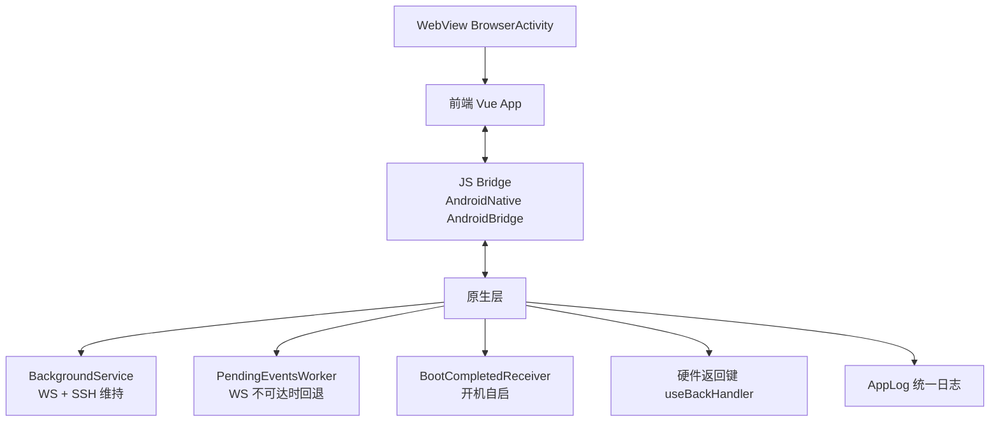
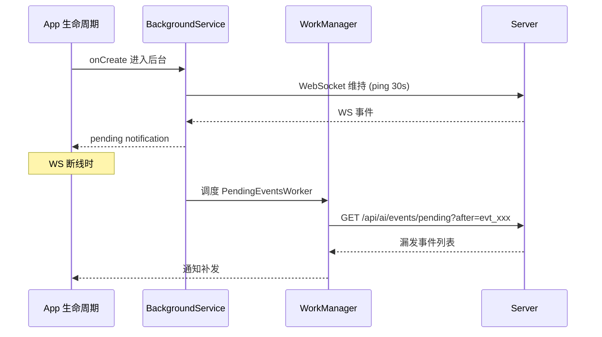
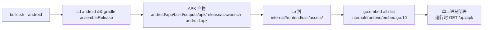

# Android 集成

Android 集成让 ClawBench 在手机上像一个原生 App 一样运行——WebView 承载前端界面，原生层提供后台服务、SSH 端口转发、JS Bridge 和统一日志通道。App 进入后台时通过 BackgroundService 维持 WebSocket 连接和 SSH 隧道活跃，必要时回退到 WorkManager 拉取错过的事件。

## 流程图

### Android App 架构

### 后台策略

### APK 嵌入流程

## 功能与设计要点

### 端点与日志通道（关键）

| 端点 | 方法 | 用途 | 代码位置 |
|------|------|------|----------|
| `/api/apk` | GET | APK 下载（从 `go:embed` 读取，路径 `assets/clawbench-android.apk`） | `internal/handler/handler.go:309` |
| `/api/client-log` | POST | Web 端统一日志（200 条/请求上限，源为 `js`） | `internal/handler/handler.go:303` |
| `/api/android-log` | POST | Android 端日志（legacy alias，写入 `android.log`） | `internal/handler/android_log.go:61-83` |
| `/api/ssh/info` | GET | SSH 隧道状态轮询（无需鉴权） | `internal/handler/handler.go:322-329` |
| `/api/ai/events/pending` | GET | 离线期间漏发事件 | `internal/handler/handler.go:354` |

> 主日志端点是 `/api/client-log`（web 模式 + Android 模式共用）；`/api/android-log` 仅作 legacy 兼容。

### 功能清单

- **WebView 容器**：Android WebView 承载前端 Vue App，通过 `AndroidNative` JS Bridge 暴露原生能力。Web 和原生之间通过 Bridge 双向通信
- **统一日志 AppLog**：所有 Android Java/Kotlin 代码**必须**使用 `AppLog.d/i/w/e()` 替代原始 `android.util.Log`（仅 `AppLog.java` 自身和测试代码允许裸 `android.util.Log`）。`AppLog` 同时写入 logcat + POST `/api/client-log` 持久化到 `.clawbench/logs/{js,android}.log`
- **BackgroundService（后台服务）**：管理 SSH 端口转发和原生 WebSocket 事件通道，App 在后台时仍能接收通知
  - 关键 API：`setNativePushEnabled(boolean)`（总开关）、`getTrustAllSSLContext()`（给 PendingEventsWorker 共享 TLS）、`postEventNotificationFromWorker(ctx, eventType, data)`（跨进程触发通知）
- **PendingEventsWorker**：WS 不可达时由 WorkManager 周期调度，通过 HTTP `GET /api/ai/events/pending?after=...` 拉取漏发事件，作为离线通知回退
- **BootCompletedReceiver**：设备开机后恢复 BackgroundService + 调度 PendingEventsWorker
- **OemUtils**：厂商 ROM 适配（自启动白名单 / 后台保活 / 电池优化白名单）
- **SharedCacheUtils**：跨进程共享缓存
- **ClawBenchApp**：Application 类，初始化全局状态
- **BrowserActivity**：浏览器跳转（外部链接）
- **SSH 端口转发**：原生层建立 SSH 连接并维持端口转发，前端通过 `usePortForward` composable 控制
- **硬件返回键代理**：Android `onBackPressed` 委托给 JS 层 `clawbench-back-press` 事件，JS 注册了处理器则拦截（不注册则退出 App）。处理器按显式优先级排序（overlay 级 1000 > page 级 100）
- **自动登录**：Android 通过 `AndroidNative.getPassword()` Bridge 获取密码自动登录，配合 `setSSHPassword(savedPwd)` 设置 SSH 密码
- **APK 单二进制部署**：`build.sh --android` → Gradle assembleRelease → APK 复制到 `internal/frontend/dist/assets/clawbench-android.apk`（`build.sh:96-99`）→ Go `//go:embed all:dist` 打包进二进制（`internal/frontend/embed.go:10`）→ 运行时 `GET /api/apk` 端点读取

### JS Bridge 关键方法（`AndroidNative`）

通过 `@JavascriptInterface` 暴露：

| 方法 | 用途 |
|------|------|
| `dismissSplash()` | 关闭启动 splash |
| `connectToServer(url)` | 切换连接地址 |
| `showServerDialog()` | 显示服务器选择对话框 |
| `startLogCapture()` / `stopLogCapture()` | 启停日志捕获 |
| `getAppVersion()` | 返回 App 版本号 |
| `setNativePushEnabled(boolean)` | 控制后台策略总开关 |
| `getPassword()` / `setSSHPassword(pwd)` | 自动登录 & SSH 密码 |
| `log(level, tag, msg)` | 三参数统一日志（level=d/i/w/e） |
| `isNativeApp()` | 检测是否在原生环境（与 `window.top` 双保险） |
| `getPendingNavigation()` | 获取挂起导航（启动恢复） |
| `downloadBlob(name, base64)` | 保存 Blob 到本地 |

### Java 端关键模块

| 类 | 角色 |
|----|------|
| `MainActivity` | WebView 容器 + `@JavascriptInterface` 全部 Bridge 方法注册 |
| `BrowserActivity` | 浏览器跳转（外部链接） |
| `BackgroundService` | 后台保活 + SSH 隧道 + WS 心跳 + 调度 PendingEventsWorker |
| `PendingEventsWorker` | WorkManager fallback，HTTP 拉 `/api/ai/events/pending` |
| `BootCompletedReceiver` | 开机自启恢复 |
| `AppLog` | `d/i/w/e()` 统一日志（logcat + `/api/client-log`） |
| `OemUtils` | 厂商 ROM 适配 |
| `SharedCacheUtils` | 跨进程缓存 |
| `ClawBenchApp` | Application 初始化 |

### 设计要点

- **后台服务是端口转发的前提**：没有 BackgroundService，Android 杀进程后 SSH 端口转发断开，已转发的端口全部不可达。后台服务保持 SSH 心跳，维持隧道活跃
- **WS 优先 + Worker 回退**：常驻 WS 链路是主路径（实时通知），PendingEventsWorker 是 WS 不可达时的兜底（轮询拉取）。两条路径相互独立，BackgroundService 监控 WS 健康度触发 Worker
- **AppLog 双写 + Anti-Recursion**：`AppLog` 写入 logcat 同时 POST 到 `/api/client-log` 实现集中持久化。`AppLog.java` 自身禁止调用裸 `android.util.Log`（防止递归）；通过 `OemUtils` + `SharedCacheUtils` 共享状态避免多进程冲突
- **单二进制包含 APK**：`//go:embed all:dist` 把 APK 嵌入 Go 二进制，无需外部 APK 文件即可部署。`internal/frontend/embed.go::GetFS()` 优先读磁盘 `public/`（热替换），否则从 embed 读取
- **日志端点统一化**：`/api/client-log` 同时被 web (`web/src/utils/appLog.ts`) 和 Android (`AppLog.java`) 使用。Web 端日志通过 `appLog.d/i/w/e()` 三参数调用 Bridge 转发；Android 端可直接 POST。源字段区分 `js` / `android`

## 关键代码引用

| 文件 | 关键符号 |
|------|----------|
| `build.sh:96-99` | APK 复制到 `internal/frontend/dist/assets/` |
| `internal/frontend/embed.go:10` | `//go:embed all:dist` |
| `internal/handler/handler.go:305,311,331` | `/api/client-log`、`/api/apk`、`/api/ssh/info` |
| `internal/handler/android_log.go:61-83` | `ServeClientLog`（200 条/请求上限） |
| `android/app/src/main/java/com/clawbench/app/` | 全部 Java 模块（9 个关键类） |
| `web/src/composables/useBackHandler.ts` | 返回键注册表管理 |
