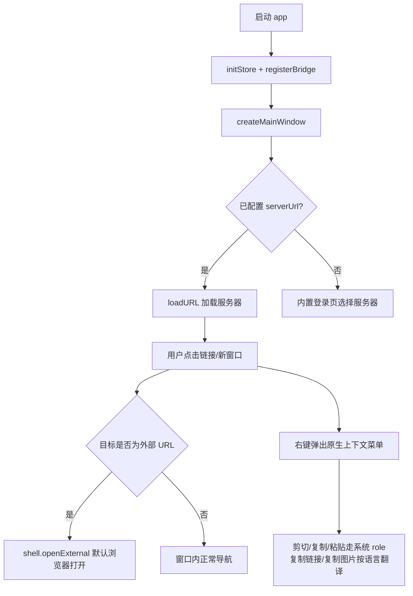
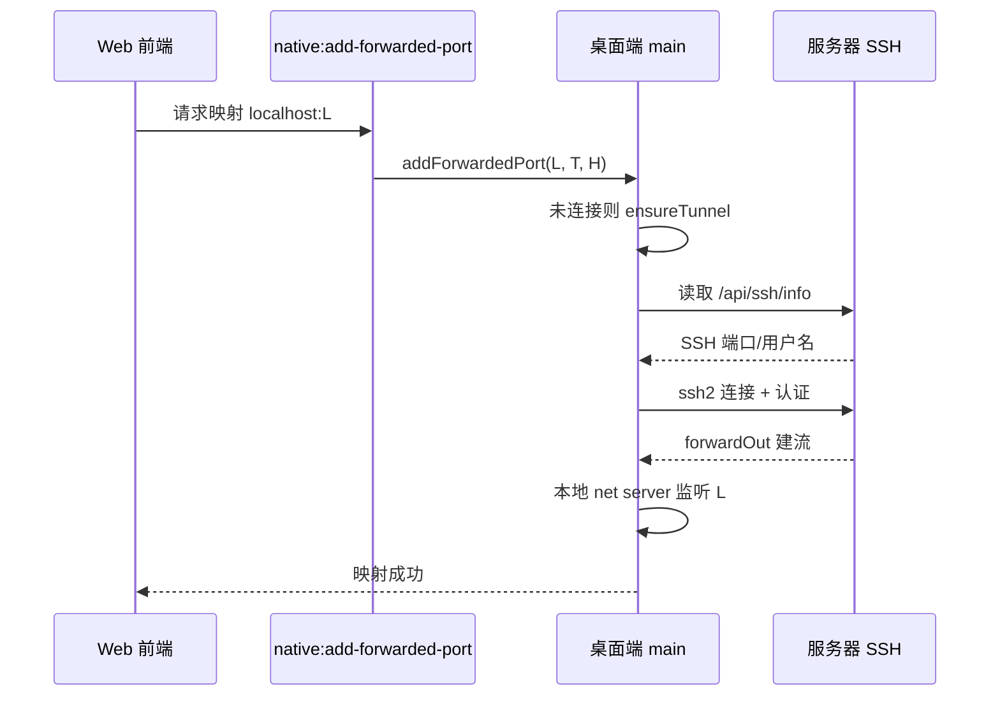

# 桌面端客户端

ClawBench 桌面端是基于 Electron 的跨平台客户端，让用户在 PC 上获得接近原生 App 的体验：独立的桌面窗口、原生右键菜单、系统级通知、SSH 端口映射、文件保存对话框，以及把外部链接交给默认浏览器打开的行为。它与 Web 前端共用同一套 Vue App，桌面端只负责提供 Web 环境之外的桌面能力，因此面向用户的功能几乎全部来自服务器端与 Web UI。

## 流程图

### 窗口与链接处理

外部链接判断以服务器 Origin 为边界：`file:` 协议视为应用内资源不拦截，`mailto:` 和非 http(s) 协议交给系统处理，同 Origin 的 http(s) 链接在窗口内导航，跨 Origin 的才交给默认浏览器。

### 端口映射建立

## 功能与设计要点

### 功能清单

- **桌面窗口**：主窗口默认 1280×800，连接配置的服务器地址；首次启动或服务器不可达时展示内置登录页供选择服务器，避免出现空白窗口
- **原生上下文菜单**：Electron 原生右键菜单覆盖可编辑输入框（剪切/复制/粘贴）、文本选择（复制）、链接（复制链接）、图片（复制图片）。剪切/复制/粘贴使用 Electron role 由操作系统自动本地化，仅复制链接/复制图片两个自定义项按当前应用语言提供文案（中文或英文）
- **外部链接默认浏览器打开**：跨 Origin 的 http(s) 链接、`mailto:` 和其他协议一律交给系统默认浏览器打开，不在应用窗口内跳转；`file:` 协议和同服务器链接保持窗口内导航
- **JS Bridge**：通过 IPC 暴露原生能力——服务器列表与凭据管理（保存/切换/删除）、SSH 端口映射（增删/重连/状态查询）、文件下载（保存对话框 + 下载后定位）、分享（复制到剪贴板/打开目录）、系统通知、主题设置、日志捕获、屏幕常亮
- **SSH 端口映射**：桌面端内置 ssh2 客户端，读取服务器公开的 `/api/ssh/info` 获取 SSH 端口与用户名，用系统密钥链（safeStorage 加密）中的密码建立连接，实现 localhost 端口到服务器端口的本地映射
- **系统通知**：AI 完成、任务执行等事件通过原生系统通知展示；点击通知可在窗口内导航到对应会话或任务，冷启动时挂起导航等待页面加载完成后再派发
- **桌面端升级检查**：启动时查询 npm registry 获取最新桌面端版本，发现新版本后通知用户；国内时区自动切换 npm 镜像源，下载时校验完整性
- **会话缓存强刷**：Ctrl+F5（macOS 为 Cmd+Shift+R）清空会话缓存与存储数据后硬刷新窗口，用于解决渲染异常或旧缓存问题
- **麦克风权限**：仅授予 `media` 权限请求，使语音输入（getUserMedia）在桌面壳内可用，其余权限请求默认拒绝

### 设计要点

- **桌面端是壳而非重实现**：桌面端只提供 Web 环境之外的桌面能力（窗口、菜单、通知、隧道、保存对话框），业务逻辑全部复用服务器 + Web 前端。同一套 Vue App 在浏览器、PWA、Android、桌面端共享，桌面端不维护自己的功能副本
- **外部链接以服务器 Origin 为边界**：链接是否交给默认浏览器取决于目标 Origin 是否等于已配置服务器 Origin，而不是简单地按协议判断。这样 AI 生成的 localhost 端口 URL 与同服务器资源仍可在窗口内使用，而第三方链接不会劫持应用窗口
- **菜单文案本地化交给操作系统**：剪切/复制/粘贴等标准操作使用 Electron role，由 OS 按系统语言自动提供文案；仅复制链接/复制图片这类无 role 默认值的自定义项才由应用按语言翻译。避免在非中文系统上显示硬编码中文
- **SSH 隧道复用前端同一协议**：桌面端通过公开的 `/api/ssh/info` 端点发现 SSH 连接参数，与 Android 原生层走同一条发现路径。密码用 safeStorage 加密存储，无加密能力时明文回退并告警
- **升级走独立通道**：桌面端从 npm registry 检查自身平台包（linux/mac/win）的最新版本，与服务器自升级、Android APK 检测构成三个独立的升级通道，互不影响
