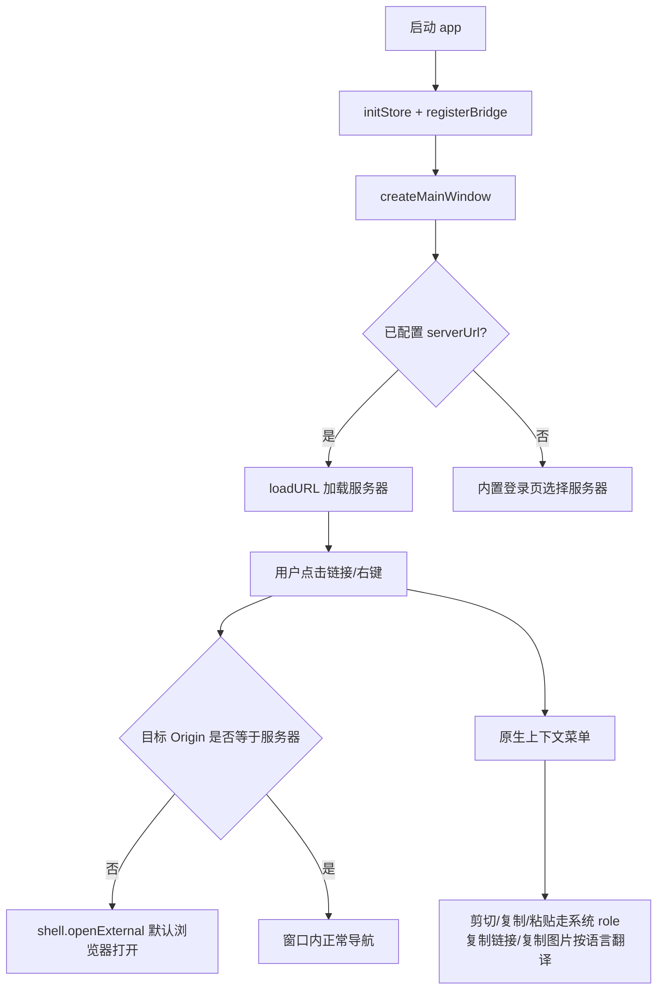
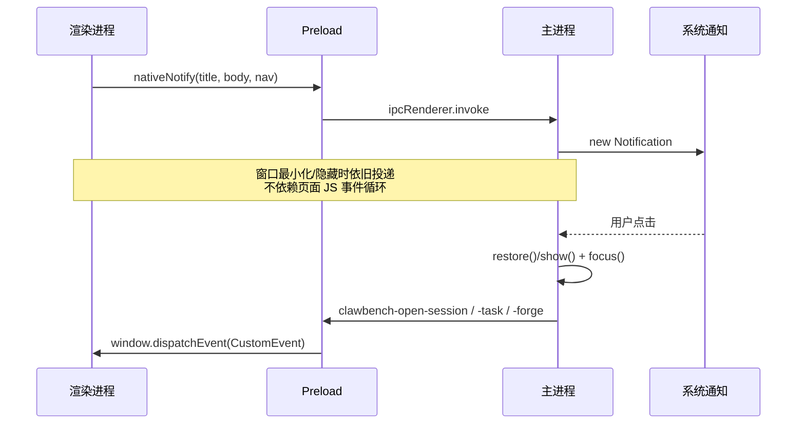
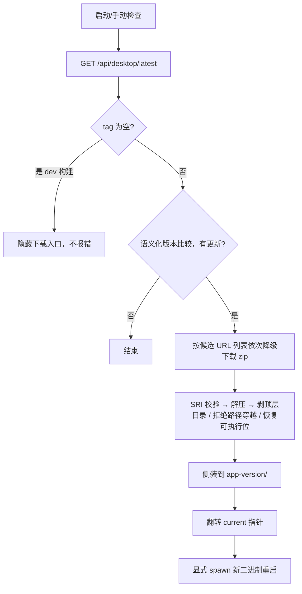
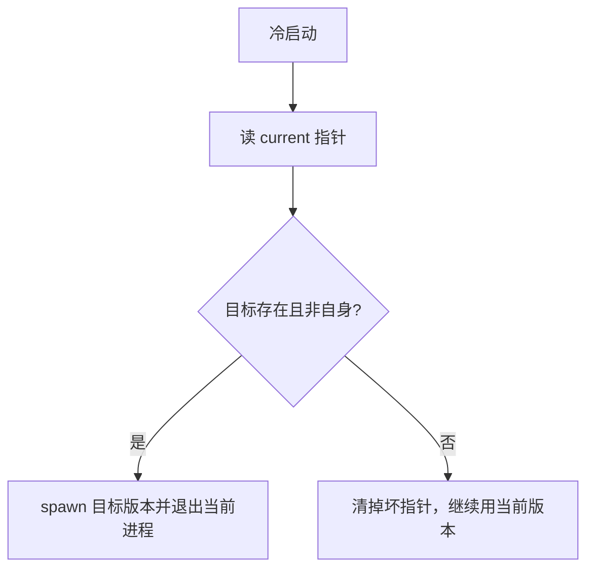

# 桌面端客户端

ClawBench 桌面端是基于 Electron 的跨平台客户端（Windows / macOS / Linux），让用户在 PC 上获得接近原生 App 的体验：独立的桌面窗口、原生右键菜单、系统级通知、SSH 端口映射、文件保存对话框，以及把外部链接交给默认浏览器打开的行为。它与 Web 前端共用同一套 Vue App，桌面端只负责提供 Web 环境之外的桌面能力，因此面向用户的功能几乎全部来自服务器端与 Web UI。

桌面端曾在 2026-09-02 被整体移除，理由是"Web 已够用"。恢复它的直接动因是 **Web Push 在桌面端不可靠**：浏览器要求 secure context，且会节流/冻结后台标签的事件循环，页面内的 `Notification` 在标签被冻结时根本不会触发。一个常驻的桌面壳才能保证"窗口最小化时仍能弹系统通知"，而这正是 AI 长任务场景的核心诉求。

## 流程图

### 窗口、链接与原生能力

```mermaid
flowchart TD
    A[启动 app] --> B[initStore + registerBridge]
    B --> C[createMainWindow]
    C --> D{已配置 serverUrl?}
    D -->|是| E[loadURL 加载服务器]
    D -->|否| F[内置登录页选择服务器]
    E --> G[用户点击链接/右键]
    G --> H{目标 Origin 是否等于服务器}
    H -->|否| I[shell.openExternal 默认浏览器打开]
    H -->|是| J[窗口内正常导航]
    G --> K[原生上下文菜单]
    K --> L[剪切/复制/粘贴走系统 role<br/>复制链接/复制图片按语言翻译]
```

外部链接判断以服务器 Origin 为边界，且用**白名单**而非黑名单：只有 `http`/`https`/`mailto`/`tel` 会被处理，其余（`file:`、`javascript:`、`data:`、自定义协议，以及无法解析的 URL）一律 `block`——绝不交给 OS 协议处理器或窗口。白名单内的 URL 再按 Origin 分流：等于服务器 Origin 的在窗口内导航，否则交给默认浏览器。这样 AI 生成的 localhost 端口 URL 与同服务器资源仍可在窗口内使用，而第三方链接不会劫持应用窗口。

### 最小化时的通知投递

```mermaid
sequenceDiagram
    participant 前端 as 渲染进程
    participant Preload
    participant 主进程
    participant OS as 系统通知
    前端->>Preload: nativeNotify(title, body, nav)
    Preload->>主进程: ipcRenderer.invoke
    主进程->>OS: new Notification
    Note over 前端,主进程: 窗口最小化/隐藏时依旧投递<br/>不依赖页面 JS 事件循环
    OS-->>主进程: 用户点击
    主进程->>主进程: restore()/show() + focus()
    主进程->>Preload: clawbench-open-session / -task / -forge
    Preload->>前端: window.dispatchEvent(CustomEvent)
```

通知必须走主进程而非页面内 `new Notification()`——浏览器与 WebView 会节流或冻结后台标签的事件循环，最小化时页面里的通知代码根本没有机会执行。因此桌面壳在前端侧被识别为**独立环境**（`isDesktopApp`，由 preload 注入）：Android 为省电写的"隐藏即断开 WS"策略**不能**套用到桌面壳，否则通知的事件源（WebSocket）在最小化瞬间就断了，通知逻辑再正确也无事可做。

## 功能与设计要点

### 功能清单

- **桌面窗口**：主窗口默认 1280×800，连接配置的服务器地址；首次启动或服务器不可达时展示内置登录页供选择服务器，避免出现空白窗口
- **原生上下文菜单**：Electron 原生右键菜单覆盖可编辑输入框（剪切/复制/粘贴）、文本选择（复制）、链接（复制链接）、图片（复制图片）。剪切/复制/粘贴使用 Electron role 由操作系统自动本地化，仅复制链接/复制图片两个自定义项按当前应用语言提供文案
- **外部链接默认浏览器打开**：白名单协议（`http`/`https`/`mailto`/`tel`）中，指向服务器 Origin 之外的链接交给系统默认浏览器打开；同服务器 Origin 的链接在窗口内导航；白名单之外的协议一律阻止
- **JS Bridge**：通过 IPC（`native:*`）暴露原生能力——服务器列表与凭据管理、SSH 端口映射、文件下载（保存对话框 + 下载后定位）、分享、系统通知、主题、语言、日志捕获、屏幕常亮。与 Android WebView 共用同一套前端接口（`web/src/utils/clawbenchNative.ts`）
- **SSH 端口映射**：桌面端内置 ssh2 客户端，读取服务器公开的 `/api/ssh/info` 获取 SSH 端口与用户名，用 safeStorage 加密存储的密码建立连接，把 localhost 端口映射到服务器端口
- **系统通知**：AI 完成、任务执行、仓库事件通过原生系统通知展示；点击通知恢复窗口并导航到对应会话/任务/仓库详情。冷启动时通知先于页面加载到达，导航载荷暂存，等渲染进程显式握手后再派发
- **应用自升级**：见下方"自升级"与"分发"两节
- **会话缓存强刷**：`Ctrl+Shift+R`（macOS 为 `Cmd+Shift+R`）清空会话缓存与存储数据后硬刷新窗口；`F12` / `Ctrl+Shift+I`（macOS 为 `Cmd+Option+I`）开关开发者工具。这些键经 `before-input-event` 在窗口自己的事件路径上认领，其余按键（尤其 `F5`）原样交给页面——终端与文件管理器都在用 `F5`，而 OS 级 `globalShortcut` 会让页面再也收不到它。应用菜单被置为 null，因此开发者工具入口必须由这里提供
- **麦克风权限**：仅授予 `media` 权限请求，使语音输入（getUserMedia）在桌面壳内可用，其余权限请求默认拒绝

### 自升级：侧装 + 指针

```mermaid
flowchart TD
    A[启动/手动检查] --> B[GET /api/desktop/latest]
    B --> C{tag 为空?}
    C -->|是 dev 构建| D[隐藏下载入口，不报错]
    C -->|否| E{语义化版本比较，有更新?}
    E -->|否| F[结束]
    E -->|是| G[按候选 URL 列表依次降级下载 zip]
    G --> H[SRI 校验 → 解压 → 剥顶层目录 / 拒绝路径穿越 / 恢复可执行位]
    H --> I[侧装到 app-version/]
    I --> J[翻转 current 指针]
    J --> K[显式 spawn 新二进制重启]
```

冷启动时的指针解析（与上图是两条独立路径）：

```mermaid
flowchart TD
    A[冷启动] --> B[读 current 指针]
    B --> C{目标存在且非自身?}
    C -->|是| D[spawn 目标版本并退出当前进程]
    C -->|否| E[清掉坏指针，继续用当前版本]
```

运行中的进程无法覆盖自身（Windows 上尤其如此），因此**采用"侧装 + 指针"而非原地替换**：新版本解压到独立目录 `~/.clawbench-desktop/app-<version>/`，再改写 `~/.clawbench-desktop/current` 指针；**应用自己**在启动最前面（任何窗口创建之前）解析该指针决定运行哪个版本。指针缺失、目标目录不存在或指向自身都清掉指针、继续用当前版本启动——失败可回滚、旧版本保留，且被删坏或写坏的升级永远不会让应用打不开。读指针的职责必须在应用内：原先承担这件事的 npm 启动器已随 npm 渠道一起移除，若沿用"只有启动器读指针"的设计，双击 Release 解压出的旧 exe 冷启动时会静默退回旧版。

重启**必须显式 spawn 新二进制**：`app.relaunch()` 重启的是当前进程，即旧版本。版本比较用语义化而非 `current !== latest` 字符串不等——后者会把降级也报成"有更新"。安装全程需显式确认，不静默重启打断用户。

### 分发以 GitHub Release 为唯一渠道

`/api/desktop/latest` **不查询任何外部服务**（不查 npm、不查 GitHub API），直接返回服务端自身版本 + Release 资产地址。桌面端与服务端同版本发布，服务端即权威。

改为 Release 优先的直接原因是体积：Electron 44 的运行时让桌面端 tarball 达到 ~120MiB，超过 npm 的 100MiB 文档上限，而裁剪 locale/LICENSES 只能省约 4.7MiB（实测），瘦身不可行。原先 npm registry 是**唯一**渠道，一旦超限不发 npm，自升级与官网下载入口会双双静默失效。

桌面端因此**不再发布到 npm**（`publish-npm-desktop` 与 `npm/desktop-main/` 一并移除）；服务端的 `publish-npm` 只发 CLI `@xulongzhe/clawbench`，与桌面端无关。

每个平台返回**候选 URL 列表**：国内镜像优先、直连 github.com 始终兜底，客户端与前端都按序取首个可用项——一个镜像失效不致命。`tag` 为空表示当前是 dev/未打标签构建（无对应 Release），此时 `downloads` 为空、前端隐藏下载入口——这是正常状态，不是错误。

### 设计要点

- **桌面端是壳而非重实现**：桌面端只提供 Web 环境之外的桌面能力（窗口、菜单、通知、隧道、保存对话框），业务逻辑全部复用服务器 + Web 前端。同一套 Vue App 在浏览器、PWA、Android、桌面端共享，桌面端不维护自己的功能副本
- **桌面壳不是"手机 App 模式"**：桌面端与 Android 都通过原生桥被前端识别为"原生环境"，但两者的省电策略截然相反——Android 窗口退到后台会被系统挂起，因此隐藏时主动断开 WebSocket；桌面窗口只是最小化、进程仍在运行，断开 WS 等于自断通知来源。因此前端必须区分 `isDesktopApp`，门控写成 `isAppMode && !isDesktopApp`。这个区分要从 preload 一路贯通到消费点（preload → `useAppMode` → 各分支），任何一层漏掉都会让最小化后的推送静默失效
- **`isDesktopApp` 还要参与 `isPC` 判定**：Electron 的 preload 上报 `isNativeApp()=true`，而 `isPC` 原先只看 `isAppMode`，于是整个桌面端被判定为移动端——文件快捷预览弹 BottomSheet 而非桌面浮卡，文件管理器点选语义、终端 PC 工具栏、输入框滑动提示等一并走移动分支。Electron 是有物理键盘鼠标的桌面窗口，必须直接判为 PC；Android/iOS/iPadOS 与 Android 原生 App 仍按移动端处理
- **菜单文案本地化交给操作系统**：剪切/复制/粘贴等标准操作使用 Electron role，由 OS 按系统语言自动提供文案；仅复制链接/复制图片这类无 role 默认值的自定义项才由应用按语言翻译，避免在非中文系统上显示硬编码中文
- **通知点击的渲染进程就绪要握手，不能靠加载状态猜**：页面 `did-finish-load` 远早于 App 注册监听器（初始化要先 await 项目加载与会话引导），若以 `webContents.isLoading()` 判断可接收，这个窗口内的点击会被发进无监听器的页面而永久丢失。改为渲染进程显式 `rendererReady()` 握手，未就绪则暂存待取
- **端口映射是 desired 状态，不是快照**：本地 listener 的存在与否必须由一份"期望映射"集合推导，重连后据此重建全部 listener。曾经 `disconnectTunnel()` 直接清空映射表且不重建，于是点刷新（触发重连）后端口必然不可达——而绿点来自服务端对目标端口的探测，与本地 listener 无关，映射已死仍显绿。同时 `ensureTunnel` 需要单飞守卫：并发调用会互相拆台，先到者挂在被废弃的连接上永不 settle
- **端口映射还必须有保活与自动重连，否则断一次就永久失效**：Android 端早有 JSch 保活（30s 间隔 / 3 次容忍）与 15s 轮询重连（5/10/30/60/120s 退避），桌面壳此前两者皆无——SSH 一旦断开只清状态，没有任何恢复路径，只有用户手点刷新才试一次。服务器日志显示该桌面端的连接恰好每次 ~12.5s 断开，同期其他客户端能活过 30s，说明不是服务端必然掐断而是这条链路没有保活。桌面端补齐同样的 keepalive + 监控重连（重连成功后由 ready 分支自动重建全部转发），`disconnectTunnel()` 与"最后一个转发被移除"才停掉监控
- **转发管道两端都必须挂 error 处理器**：`socket.pipe(stream).pipe(socket)` 不转发错误，任一端出错（SSH 通道在传输中被拆掉最常见）都会变成主进程未捕获异常，Electron 默认弹模态错误框把应用卡住。除了管道两端互相 destroy，主进程还注册 `uncaughtException` / `unhandledRejection` 兜底（模块作用域注册，覆盖启动期异常）——桌面壳是长生命周期窗口，不该因单条连接出错而整体崩掉
- **应用级快捷键必须走 `before-input-event` 而非 `globalShortcut`**：`globalShortcut` 是 OS 级捕获，按键不会到达渲染进程——把 `F5` 挂上去会让终端再也收不到它（TUI 靠 `ESC[15~` 翻页），文件管理器的刷新也失效。改为在窗口自己的事件路径上只认领需要的组合键（强制刷新 `Ctrl+Shift+R`、开发者工具 `F12` / `Ctrl+Shift+I`），其余一律放行。应用菜单被置为 null 后 Electron 自带的开发者工具快捷键也一并没了，因此这两个入口必须由这里提供
- **Windows 通知需要显式应用身份**：`APP_USER_MODEL_ID` 必须与 `electron-builder.yml` 的 `appId` 一致——该 yml 不随包分发、运行时读不到，漂移会让 Windows toast 静默消失
- **升级走独立通道**：桌面端自升级、服务端自升级、Android APK 检测是三个独立通道，互不影响
