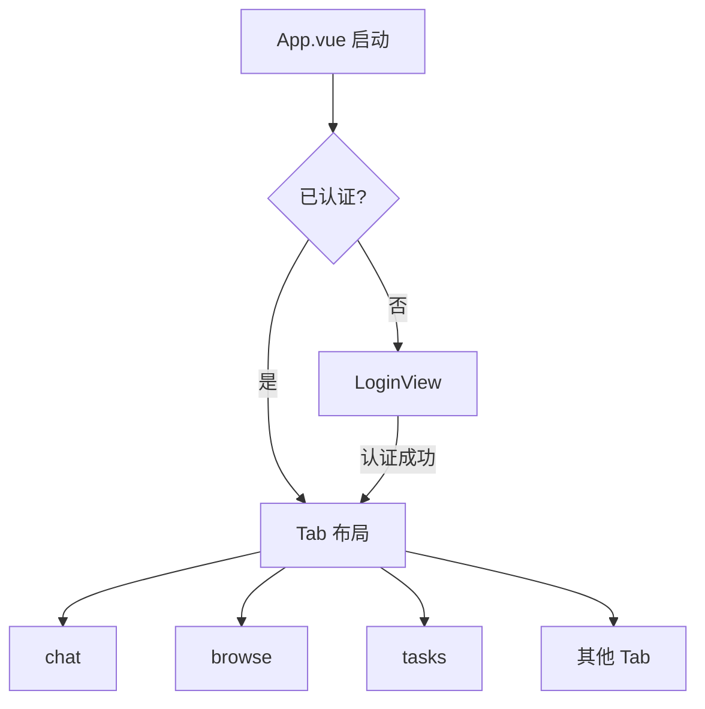
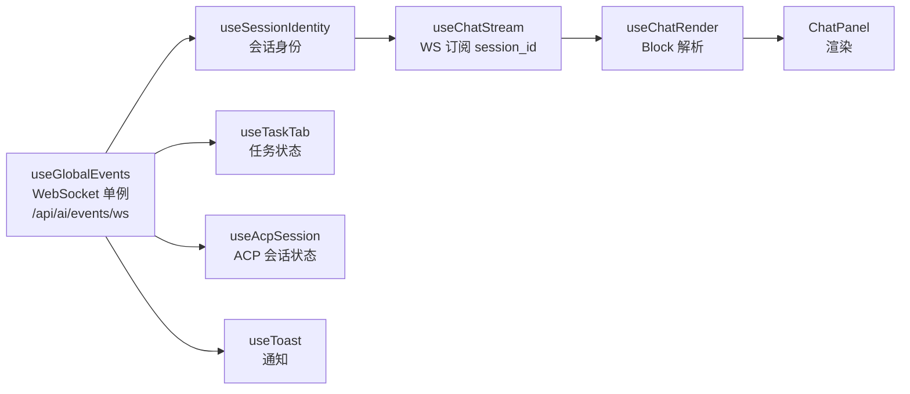

# 前端架构

ClawBench 前端是一个无路由的 Vue 3 单页应用——没有 Vue Router，通过底部 Tab 栏和抽屉式布局组织界面。全局状态集中在单个 `reactive()` store 中，业务逻辑封装为 composable，模块级单例模式贯穿整个架构。这种"少抽象、多组合"的风格让代码路径扁平，但要求开发者理解模块级状态的生命周期。

## 流程图

### 应用启动与布局结构

### 数据流与 Composable 组合

## 功能与设计要点

### 功能清单

- **Tab 式单页布局**：底部 Tab 栏切换主功能区（chat、browse、tasks 等），溢出 Tab 放入弹出菜单。`TabPanel` 使用 `v-show` 保持状态持久——切换 Tab 不销毁组件，回到之前的 Tab 状态还在
- **抽屉式导航**：Session 抽屉（会话列表，含"定时"标识的续接会话）、ACP Session 抽屉（ACP 模式/权限管理）、TOC 抽屉（文件目录）、搜索抽屉等。从侧面滑入，不占常驻空间——移动端屏幕有限，抽屉比常驻面板更节省空间
- **模块级 Composable 单例**：多个 composable 使用模块级 `ref`，所有消费者共享同一份状态（如 `useToast`、`useSessionIdentity`、`useGlobalEvents`）。跨组件状态协调无需 provide/inject
- **WebSocket 单通道**：所有实时推送走 `/api/ai/events/ws`。聊天内容（`content/thinking/tool_use` 等 `ChatStreamData` 子事件）由 `StreamHub.EmitToSession` 推送；系统事件（`session_update/task_update/summary_update`）通过 `ws.Manager` 广播。断线 ≤10s 自动缓冲重放（≤50 条），>120s 清理订阅（`internal/ws/manager.go`）。客户端通过 `subscribe`/`unsubscribe`/`cancel`/`permission_respond`/`ack`/`pong` 六种消息与后端交互

  旁注：还存在几条独立小通道用于专门场景——`GET /api/file/watch`（SSE）、`GET /api/dir/search`（SSE）、`GET /api/tts/audio/ws`（WebSocket）——与聊天流无关
- **ACP 会话管理**：`useAcpSession` 管理 ACP 模式切换、思考深度、斜杠命令、权限审批和计划进度。`AcpSessionDrawer` 展示 ACP 特有的会话状态，`PlanPanel` 显示计划步骤和进度
- **标注管道**：聊天消息依次经过 Worktree 标注 → 文件路径标注（双候选路径解析）→ localhost URL 标注 → commit hash 标注，全部基于 DOM 遍历而非正则替换。文件路径标注优先基于当前文件所在目录解析，解析失败时回退到项目根目录，验证阶段自动替换为主候选存在的路径。localhost URL 标注（`useLocalhostAnnotation`）检测聊天中的 `localhost:PORT` 和 `127.0.0.1:PORT` URL，追加可点击图标按钮，点击后触发端口转发 + 打开 WebView 流程。让聊天中的技术信息可直接交互
- **SPA 热切换项目**：切换项目不需要 `window.location.reload()`，而是原地重置 store + Vue `:key` 重建组件树（0.15s 渐隐过渡）。无页面闪烁
- **会话设置**：`ChatPanelContent` 组合 `useAcpSession` 提供模型、思考深度、工作模式和传输方式设置。设置通过 PATCH 端点即时持久化，页面重载后自动恢复
- **Settings 三层导航**：`SettingsIndex` 提供一级入口，`SettingsCategory` 组织分类页，批量保存的 `SettingsGroupPanel` 使用独立三级页面。三级页面通过 `subPagePanelMap` 和冒号分隔 route ID 数据驱动渲染；仅含一个面板且没有平铺项的分类直接在二级页面展示
- **Agent 选择组件**：`AgentIcon` 统一渲染 Agent SVG 图标，`AgentSelectorDrawer` 提供移动端 Agent 选择入口，避免业务组件重复实现图标和抽屉行为
- **基础能力 composable**：`useConnectivityTest` 负责连通性测试，`useUpgrade` 对接自升级状态，`useShareIn` 接收系统分享，`useMseAudio` 播放流式音频，`useToolbarOverflow` 处理窄屏工具栏折叠，`usePortForward` 管理端口转发与 localhost URL 打开（Android 走原生 `openInSandbox`，Web 走浏览器新标签）
- **摘要切换**：`SummaryToggle` 组件在聊天消息中提供按钮模式切换摘要/原文，在任务执行详情中提供标签页模式——两种场景共享同一摘要数据源
- **首次访问欢迎面板**：`WelcomeOverlay` 组件在用户首次访问时显示，展示后端检测状态与安装入口。不是 5 步分步向导——Agent 创建通过自动发现或 `AgentInstallDialog` 完成
- **Android 硬件返回键**：全局 `useBackHandler` 注册表管理返回导航，Android `onBackPressed` 委托给 JS 层——注册了返回处理器则拦截（不退出 App），未注册则传递给原生处理。处理器按显式优先级排序（overlay 级 1000 > page 级 100），同一优先级内最近注册的优先，确保覆盖层返回不被页面级处理器截获
- **Sticky Scroll**：`useStickyScroll` 为多级标题提供粘性定位，支持范围过期和点击遮挡处理。长文档浏览时保持上下文可见
- **系统资源监控**：`useSystemResources` composable 周期轮询 `GET /api/system/resources` 获取 CPU、内存、磁盘、网络和负载指标，引用计数共享轮询定时器；`SystemResourcesPanel` 组件在 AppHeader 的 Gauge 图标弹出菜单中展示实时资源状态。页面可见时自动轮询，隐藏时暂停；WS 断线时隐藏资源数据，改为展示连接状态指示器。详见 [系统资源监控](../infra/system-resources.md)
- **消息聚类抽屉**：`useMessageClusters` composable 封装消息聚类计算 API（含 WS 进度监听），`MessageClustersDrawer` 展示聚类结果和进度条，聚类中的消息变体可直接一键添加为快捷发送
- **键盘交互**：`DialogOverlay` 支持 Esc 关闭和 Enter 确认；`BottomSheet` 支持 Esc 关闭（焦点在输入框时跳过，避免干扰 IME/原生输入行为）。覆盖层自动聚焦以立即接收键盘事件
- **Ctrl+Delete 快捷归档**：聊天 Tab 活跃时 `Ctrl+Delete`（Mac 上 `Cmd+Delete`）触发当前会话归档，桌面用户快速整理对话列表
- **紧凑上下文按钮**：ACP 会话上下文使用率 ≥ 75% 且 Agent 支持 `/compact` 命令时，会话信息栏显示"Compact context"按钮。点击即发送 `/compact` 命令让 Agent 压缩上下文，缓解长对话中的上下文溢出。颜色阈值：≥95% 红、≥90% 橙、≥75% 黄、<75% 绿
- **边缘滑动返回**：`useEdgeSwipeBack` composable 在文档右边缘检测左滑手势，触发全局返回导航。同时消费边缘触摸事件，防止 Android 系统的边缘滑动退出手势干扰 App 内导航
- **文件与 Agent 图标**：`fileIcon.ts` 根据文件扩展名映射图标，`materialIcons.ts` 提供 Material Icons 常量集合，`agentIcons.ts` 为每个 AI Agent 提供 SVG 图标。`ProviderIcon` 组件渲染 LLM 供应商 Logo（替换了原有的 CPU 图标位置）。统一图标的视觉一致性，单色图标通过 CSS 类随主题切换
- **会话搜索抽屉**：`useSessionSearch` composable 封装 RAG 会话聚合搜索 API，`SessionSearchDrawer` 提供搜索结果列表 + 钻取详情两种视图，详情页将偏移转换为 DOM 高亮标记
- **聊天渲染管线**：`useChatRender` 是聊天 Block 渲染的核心 composable，管理 `blockTasks`、`blockAskQuestions`、`blockRagResults` 三类结构化 Block 的解析和渲染状态。流式期间仅做纯 Markdown 渲染（跳过 KaTeX、路径标注、Mermaid 等增强）；流式结束后启动完整管线（结构化检测 → 标签剥离 → 增强 Markdown）。历史消息首次加载使用 `deferEnhancements` 快速路径（跳过 KaTeX/路径标注以即时显示），通过 `requestIdleCallback` 分批升级缓存（每批 5 Block）。Mermaid 渲染延迟到流式结束后执行（流式期间块内容不完整）
- **统一 Markdown 渲染器**：`useMarkdownRenderer` 为所有 Markdown 渲染场景（聊天、文件预览等）提供统一管线：`marked.parse` → KaTeX 字符级渲染（`renderToString`，避免与 Vue `v-html` 冲突）→ DOMPurify → 图片路径修正 → 表格包装 → 代码块/表格标注头 → 文件路径/commit hash/localhost URL/worktree 路径标注。`skipEnhancements=true` 用于流式期间。返回 `RenderResult { html, detectedPaths[], detectedSHAs[] }` 供异步验证

### appLog 统一日志（强制规范）

> 所有前端代码**必须**使用 `appLog.d/i/w/e()` 替代原始 `console.*`（仅 `*.test.ts` 文件内允许裸 `console.*`）。

- **入口**：`web/src/utils/appLog.ts`
- **Web 模式端点**：`POST /api/client-log`（`LOG_ENDPOINT`，200 条/请求上限，2s flush）
- **Android Bridge**：`AndroidNative.log(level, tag, msg)` 三参数签名 + `isNativeApp()` + `window !== window.top` 双保险
- **日志级别映射**：DEBUG → D、INFO → I、WARN → W、ERROR → E
- **标签约定**：PascalCase 模块名（'ChatStream' / 'PortForward' / 'Store' 等）
- **失败保护**：`fetch` 失败或非原生环境时静默降级，不影响业务代码

### 设计要点

- **模块级单例是双刃剑**：所有消费者共享状态，跨组件协调零成本；但需要理解模块级状态的生命周期（应用级而非组件级），项目切换时需要显式重置——这是有意为之的架构选择，不是反模式
- **无 Vue Router 是移动优先的决策**：Tab 式布局不需要 URL 路由，返回导航由 `useBackHandler` 管理。省去了路由配置的复杂度，但也意味着无法通过 URL 深链接到特定页面
- **标注管道顺序有讲究**：Worktree 标注先于文件路径标注，已标注的元素不再被后续标注匹配——避免 Worktree 路径被文件路径标注二次匹配。文件路径标注采用双候选解析，验证阶段自动替换不存在的候选
- **reactive store 而非 Pinia**：单个 reactive store + action 函数，不用 Pinia/Vuex。状态形状扁平，action 直接修改——对于这种规模的应用，Pinia 的模块化开销不值得
- **会话设置即时持久化**：模式/思考深度/模型/传输方式的变更通过 PATCH `/api/ai/session/update` 即时写入数据库，无需发送聊天消息。解决了页面重载后设置丢失的问题
- **单调序列号防竞态**：并发目录加载时使用单调计数器，保证旧结果不会覆盖新状态。这是异步 UI 的经典问题，单调计数器是最简单的解决方案
- **返回处理器使用显式优先级**：`useBackHandler` 的处理器按优先级排序（overlay > page），而非依赖注册顺序——注册顺序受组件挂载时机影响，不确定且难以调试。显式优先级让覆盖层返回始终优先于页面级返回
- **FileHeader 三层弹性布局**：`FileHeader`（`web/src/components/file/FileHeader.vue`）使用三层 flex 区域约束工具栏宽度：
  1. **文件名区**：`flex: 0 1 auto; min-width: 80px; overflow: hidden`——可收缩但不会消失
  2. **工具栏区**：`flex: 1 1 0; min-width: 0; overflow: hidden`——ResizeObserver 配合 `useToolbarOverflow` 将溢出按钮移入 “More” 下拉，`inlineCount: 1` 仅保留下拉按钮常驻
  3. **覆盖层导航区**：`flex-shrink: 0`——固定宽度不收缩，关闭按钮始终可见
  工具栏不设固定宽度，而是由 flex:1 自适应——剩余空间全归工具栏，空间不足时按钮逐个折叠进下拉菜单
- **HeaderMarquee 手动滚动**：标题栏文字溢出时支持手动拖拽和滚轮水平滚动（而非自动跑马灯），ResizeObserver 动态检测溢出状态。自动跑马灯干扰注意力且不便于按需阅读，手动滚动让用户自主控制阅读时机
- **Session 信息栏精简**：移除思考深度和传输协议（CLI/ACP）显示，将后端图标和 Agent 名称合并为单个 Tag，空间留给紧凑上下文按钮。减少信息噪音，突出与操作相关的状态
