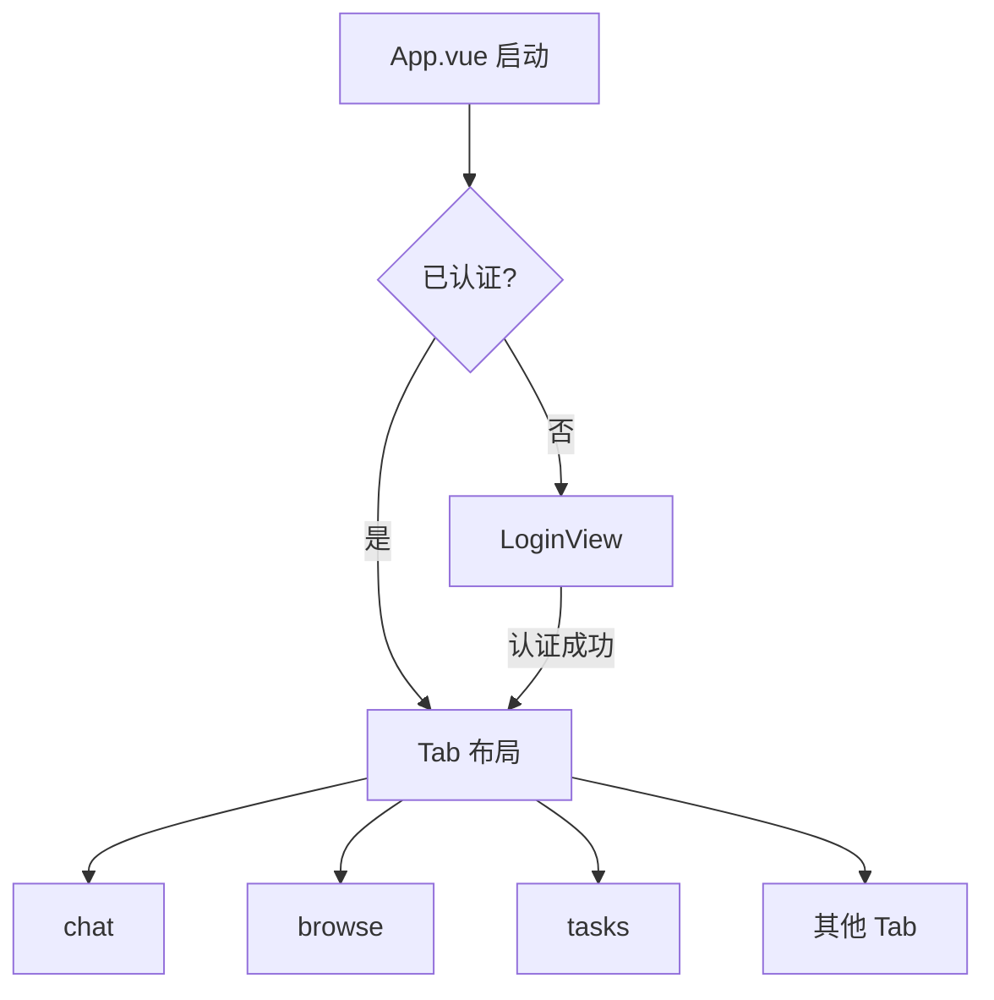
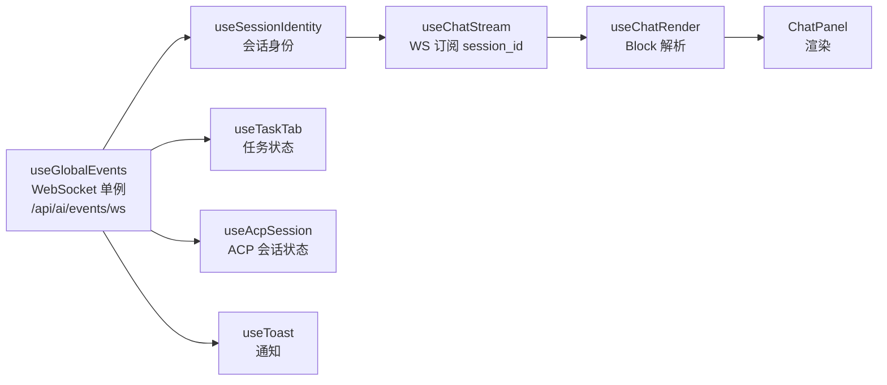

# 前端架构

ClawBench 前端是一个无路由的 Vue 3 单页应用——没有 Vue Router，通过底部 Tab 栏和抽屉式布局组织界面。全局状态集中在单个 `reactive()` store 中，业务逻辑封装为 composable，模块级单例模式贯穿整个架构。这种"少抽象、多组合"的风格让代码路径扁平，但要求开发者理解模块级状态的生命周期。

## 流程图

### 应用启动与布局结构

### 数据流与 Composable 组合

## 功能与设计要点

### 功能清单

- **Tab 式单页布局**：底部 Tab 栏切换主功能区（chat、browse、tasks 等），溢出 Tab 放入弹出菜单。`TabPanel` 使用 `v-show` 保持状态持久——切换 Tab 不销毁组件，回到之前的 Tab 状态还在
- **抽屉式导航**：Session 抽屉（会话列表）、ACP Session 抽屉（ACP 模式/权限管理）、TOC 抽屉（文件目录）、搜索抽屉等。从侧面滑入，不占常驻空间——移动端屏幕有限，抽屉比常驻面板更节省空间
- **会话列表是单一扁平列表**：项目面板内的会话不再分成「置顶 / 最近」两个分组（无分组头、无折叠、无分组计数），置顶会话仍排在最前（服务端 `pinned DESC` 排序不变），只在行的右上角加一个三角标记。跨项目面板按项目分组的结构保留不变。分组把同一份数据渲染成两个 `TransitionGroup` 与一套索引偏移计算，键盘导航还得补偿分组偏移——而用户要的只是"置顶的在上面"，一个标记就能表达
- **模块级 Composable 单例**：多个 composable 使用模块级 `ref`，所有消费者共享同一份状态（如 `useToast`、`useSessionIdentity`、`useGlobalEvents`）。跨组件状态协调无需 provide/inject
- **WebSocket 单通道**：所有实时推送走 `/api/ai/events/ws`。聊天内容（`content/thinking/tool_use` 等 `ChatStreamData` 子事件）由 `StreamHub.EmitToSession` 推送；系统事件（`session_update/task_update/summary_update`）通过 `ws.Manager` 广播。断线 ≤10s 自动缓冲重放（≤50 条），>120s 清理订阅（`internal/ws/manager.go`）。客户端通过 `subscribe`/`unsubscribe`/`cancel`/`permission_respond`/`ack`/`pong` 六种消息与后端交互

  旁注：还存在几条独立小通道用于专门场景——`GET /api/file/watch`（SSE）、`GET /api/dir/search`（SSE）、`GET /api/tts/audio/ws`（WebSocket）——与聊天流无关
- **ACP 会话管理**：`useAcpSession` 管理 ACP 模式切换、思考深度、斜杠命令、权限审批和计划进度。`AcpSessionDrawer` 展示 ACP 特有的会话状态，`PlanPanel` 显示计划步骤和进度。计划进度**不持久化**——只缓存在 ACP 连接对象上（无 plan 表，`context_state` 只含 mode/thinkingEffort/usage），因此会话回溯（rewind）销毁连接后无从还原：`rewindSession` 成功后显式 `clearPlanState()`，`onSessionEvent` 收到 `status="rewound"` 且属于当前会话时同样清空（覆盖未发起回溯的其他客户端）；清空早于 `loadHistory`，使 reload 自带的 planState 仍能生效
- **标注管道**：聊天消息依次经过 Worktree 标注 → 文件路径标注（双候选路径解析）→ localhost URL 标注 → commit hash 标注，全部基于 DOM 遍历而非正则替换。文件路径标注优先基于当前文件所在目录解析，解析失败时回退到项目根目录，验证阶段自动替换为主候选存在的路径。localhost URL 标注（`useLocalhostAnnotation`）检测聊天中的 `localhost:PORT` 和 `127.0.0.1:PORT` URL，追加可点击图标按钮，点击后触发端口映射 + 打开 WebView 流程。让聊天中的技术信息可直接交互
- **SPA 热切换项目**：切换项目不需要 `window.location.reload()`，而是原地重置 store + Vue `:key` 重建组件树（0.15s 渐隐过渡）。无页面闪烁
- **会话设置**：`ChatPanelContent` 组合 `useAcpSession` 提供模型、思考深度、工作模式和传输方式设置。设置通过 PATCH 端点即时持久化，页面重载后自动恢复
- **会话身份管理**：`useSessionIdentity` composable 管理当前会话的所有身份状态（ID、标题、后端、Agent、模型、模式、思考力度、传输方式、自动审批、可用命令、上下文用量等），使用 per-session 用量状态缓存（Map + version ref 实现响应式），`runningSessions` 全局集合 + `reconcileRunningSessions` 对账
- **Settings 三层导航**：`SettingsIndex` 提供一级入口，`SettingsCategory` 组织分类页，批量保存的 `SettingsGroupPanel` 使用独立三级页面。三级页面通过 `subPagePanelMap` 和冒号分隔 route ID 数据驱动渲染；仅含一个面板且没有平铺项的分类直接在二级页面展示
- **Agent 选择组件**：`AgentIcon` 统一渲染 Agent SVG 图标，`AgentSelectorDrawer` 提供移动端 Agent 选择入口，避免业务组件重复实现图标和抽屉行为
- **基础能力 composable**：`useConnectivityTest` 负责连通性测试，`useUpgrade` 对接自升级状态（含 `UpgradePromptOverlay` 启动提示），`useShareIn` 接收系统分享，`useMseAudio` 播放流式音频，`useToolbarOverflow` 处理窄屏工具栏折叠，`usePortForward` 管理端口映射与 localhost URL 打开（Android 走原生 `openInSandbox`，Web 走浏览器新标签），`useDialog` 替代原生 `window.confirm()` 提供移动端友好的确认对话框（`DialogOverlay.vue` + `BottomSheet.vue`，支持 Esc/Enter 键盘操作），`useSelectState` 为 ACP 模式/思考深度等单选状态提供统一管理（含 `syncAndFallback()` SSE/REST 状态同步），`useFileUpload` 统一文件上传管理——支持单文件上传（带进度条和预览）、多文件上传（带数量限制和大小检查）、目录上传（保持目录结构）、拖放文件夹上传（webkitGetAsEntry 递归遍历）、目录树下载（File System Access API 逐文件写入）、粘贴上传、自动附加到聊天，`useAsyncComponent` 为 `defineAsyncComponent` 提供有界自动重试（3 次，800ms 间隔）和错误回退组件（含手动重试按钮），解决 SSH 隧道环境下动态 import 瞬时失败导致面板永久空白的问题
- **摘要切换**：`SummaryToggle` 组件在聊天消息中提供按钮模式切换摘要/原文，在任务执行详情中提供标签页模式——两种场景共享同一摘要数据源。摘要加载时使用 `view=summary` 参数请求历史，仅返回摘要文本和 SummaryCards（不含完整消息内容），前端按需懒加载原始内容
- **首次访问欢迎面板**：`WelcomeOverlay` 组件在用户首次访问时显示，展示后端检测状态与安装入口。不是 5 步分步向导——Agent 创建通过自动发现或 `AgentInstallDialog` 完成
- **统一返回状态机**：`useNavigationStateMachine` + `useNavigationCoordinator` 收敛全局返回导航——两级分层栈（界面内文件历史 `useFileNavStack` + 跨界面 jump origin `useNavigationContext`）由状态机按确定性优先级裁决（顶层弹层 > 行内编辑 > Browse 瞬态层 > 界面内历史 > 跨界面来源 > 父目录）。`canHandleBack` 零副作用同步探测（满足 Android `onBackPressed` 事件同步消费），`navigateBack` 异步执行；`reason='close'` 严格限定为关闭动作。移动端文件查看内容区底部悬浮胶囊、桌面双栏顶栏导航簇、右缘滑动手势与 Android 物理返回键全部汇入同一状态机。详见[统一返回与跨界面导航](unified-back-navigation.md)
- **Sticky Scroll**：`useCodeStickyScroll` 为 CodeMirror 代码浏览器提供 VS Code 风格的 sticky scroll，将外层作用域定义行钉顶显示（最多 5 行），点击可平滑滚动到定义位置。基于后端 tree-sitter 符号数据，解决长文件中上下文迷失的问题
- **系统资源监控**：`useSystemResources` composable 周期轮询 `GET /api/system/resources` 获取 CPU、内存、磁盘、网络和负载指标，引用计数共享轮询定时器；`SystemResourcesPanel` 组件在 AppHeader 的 Gauge 图标弹出菜单中展示实时资源状态。页面可见时自动轮询，隐藏时暂停；WS 断线时隐藏资源数据，改为展示连接状态指示器（disconnected/reconnecting）。详见 [系统资源监控](../infra/system-resources.md)
- **消息聚类抽屉**：`useMessageClusters` composable 封装消息聚类计算 API（含 WS 进度监听），`MessageClustersDrawer` 展示聚类结果和进度条，聚类中的消息变体可直接一键添加为快捷发送
- **键盘交互**：`DialogOverlay` 支持 Esc 关闭和 Enter 确认；`BottomSheet` 支持 Esc 关闭（焦点在输入框时跳过，避免干扰 IME/原生输入行为）。覆盖层自动聚焦以立即接收键盘事件
- **Ctrl+Delete 快捷归档**：聊天 Tab 活跃时 `Ctrl+Delete`（Mac 上 `Cmd+Delete`）触发当前会话归档，桌面用户快速整理对话列表
- **紧凑上下文按钮**：ACP 会话上下文使用率 ≥ 75% 且 Agent 支持 `/compact` 命令时，会话信息栏显示"Compact context"按钮。点击即发送 `/compact` 命令让 Agent 压缩上下文，缓解长对话中的上下文溢出。颜色阈值：≥95% 红、≥90% 橙、≥75% 黄、<75% 绿
- **边缘滑动返回**：`useEdgeSwipeBack` composable 在文档右边缘检测左滑手势，以 `edge-swipe` reason 派发 `clawbench-back-press` 事件汇入统一返回状态机。同时消费边缘触摸事件，防止 Android 系统的边缘滑动退出手势干扰 App 内导航。Android App 模式下跳过 dispatch（原生 `onBackPressed` 已派发，重复派发会在一次滑动上双重触发）
- **文件与 Agent/Provider 图标**：`fileIcon.ts` 根据文件扩展名映射图标，`materialIcons.ts` 提供 Material Icons 常量集合，`agentIcons.ts` 为每个 AI Agent 提供 SVG 图标（来自 `@lobehub/icons-static-svg`，支持 `monoCssClass` 主题适配）。`ProviderIcon` 组件渲染 LLM 供应商 Logo（替换了原有的 CPU 图标位置）。统一图标的视觉一致性，单色图标通过 CSS 类随主题切换
- **会话搜索抽屉**：`useSessionSearch` composable 封装 RAG 会话聚合搜索 API，`SessionSearchDrawer` 提供搜索结果列表 + 钻取详情两种视图，详情页将偏移转换为 DOM 高亮标记
- **聊天渲染管线**：`useChatRender` 是聊天 Block 渲染的核心 composable，管理 `blockTasks`、`blockAskQuestions` 两类结构化 Block 的解析和渲染状态。流式期间仅做纯 Markdown 渲染（跳过 KaTeX、路径标注、Mermaid 等增强）；流式结束后启动完整管线（结构化检测 → 标签剥离 → 增强 Markdown）。历史加载（非流式）消息直接走完整渲染管线（含静态 Block 缓存），不做 deferred 两阶段渲染——避免首帧后再升级导致 scrollHeight 变化引发滚动跳动。Mermaid 渲染延迟到流式结束后执行（流式期间块内容不完整）
- **thinking 惰性加载**：`useThinkingContent` composable 封装 thinking Block 的按需加载逻辑。流结束后 thinking Block 只显示缩略信息（`think_id`），用户点击展开时通过 `GET /api/ai/chat/thinking` 加载完整文本。缓存按 `think_id` 存储，会话切换时自动清空
- **交互式提问卡**：`AskUserQuestion` 工具调用由前端专用渲染器渲染成可交互选项卡（每个问题一张卡、单选/多选选项、可选补充文本栏、"推荐"与"提交"按钮）。提交把所选标签（含补充文本）作为一条普通用户消息发回，复用既有的排队/重提交链路而非引入新消息类型；单选模式允许再次点击取消选中并同步重算提交按钮的可用态——误触后可回到未作答，避免把错误标签拼进发送内容
- **Read 工具行范围展示**：Read 工具调用结果中包含行范围（`startLine-endLine`）时，前端将路径展示为 `path:start-end` 格式，帮助用户快速定位 AI 关注的代码区域
- **统一 Markdown 渲染器**：`useMarkdownRenderer` 为所有 Markdown 渲染场景（聊天、文件预览等）提供统一管线：数学块提取（保护 LaTeX 的 `_`/`*` 不被 marked 误解析为强调）→ `marked.parse` → KaTeX 字符级渲染（`renderToString`，避免与 Vue `v-html` 冲突）→ 代码块还原 → DOMPurify → 图片路径修正 → 视频链接转换（内联播放器）→ 表格包装 → 代码块/表格标注头 → 文件路径/commit hash/localhost URL/worktree 路径标注。`skipEnhancements=true` 用于流式期间（跳过路径标注、媒体转换等，不影响 KaTeX）；`skipKatex=true` 用于流式期间公式可能不完整时单独跳过 KaTeX。返回 `RenderResult { html, detectedPaths[], detectedSHAs[] }` 供异步验证
- **统一内联媒体 figure**：`mediaBlockFactory.ts` 把所有内联媒体（位图 ``、AI 裸内联 `<svg>`、mermaid）提升为带 1px 细边框的块级 figure（`.image-block-wrapper`），操作条改为悬浮于媒体右上角的半透明图标胶囊（常驻半透明、hover 加深），三类媒体形态一致。聊天、文件预览、分享、HTML 导出全部收敛到同一工厂与 `media-block.css` 单点样式；提升时迁移 `data-source-line` 以保住行号锚定位，段落拆分按 before/after 保序（同段多图不倒序），`<a>` 内媒体不提升（避免 v-html 重解析拆空链接）
- **代码编辑器**：CodeMirrorViewer 统一代码浏览与编辑，通过 `editable` prop 切换模式。`codeEditorLang` 工具支持 30+ 语言扩展（高频语言静态导入，低频语言懒加载），含 Markdown 代码围栏嵌套语法高亮。编辑模式使用 `shallowRef` 管理 EditorView 防止 Vue reactive proxy 破坏 undo/redo。编辑模式下为 11 种语言启用语言感知的自动补全（`buildCompletionExtension`，基于 CodeMirror `autocompletion()`）
- **终端选择模式**：`useTerminalGestures` 实现三模式手势系统（浏览/手势/选择），选择模式下触摸坐标映射到 xterm 单元格进行文本选取，浮动复制栏提供一键复制。`terminalBlurUtils` 处理 Android WebView 键盘焦点稳定性
- **TOC 停靠栏**：`TocDock` 标题栏提供切换按钮（PanelLeft/PanelRight 图标），在左侧/右侧停靠间切换（`useTocDockPreference` 持久化到 localStorage，FileViewer 通过 `data-toc-side` + flex order 反转布局，分隔条/拖拽数学随侧反转）。导出 HTML 的 TOC 从浮动 FAB + translateX 抽屉改为右侧内联常驻侧栏，可收起到窄 rail，点击条目滚动不关闭
- **App 命名主题系统**：VSCode 风格的命名主题体系，36 个自包含配色方案（亮色 16 个：GitHub Light、One Light、Ayu Light、Light Modern、Light Plus、Quiet Light、Vitesse Light、Bluloco Light、Material Lighter、Alabaster、Everforest Light、High Contrast Light、Nord Light、Catppuccin Latte、Solarized Light、Gruvbox Light；暗色 20 个：Solarized Dark/Deep、Monokai、Material Darker、Dark Plus、Bluloco Dark、Nord、Everforest Dark、One Dark Pro、Dracula、Rose Pine、Gruvbox Dark、GitHub Dark、Catppuccin Mocha、Vitesse Dark、Tokyo Night、Kanagawa、Ayu Dark、Night Owl、High Contrast Dark）。每个主题独立定义全部 CSS 变量（约 40 个，无继承关系），通过 `<html data-theme="<id>">` 生效，`data-theme-base="light|dark"` 供 CSS 选择器便捷引用。`themeMeta.ts` 提供 `isDarkTheme()`/`resolveThemeId()`/状态栏颜色等工具函数，主题列表按背景亮度从浅到深排列便于选择器展示。AppHeader 提供调色板快捷主题选择器（带实时配色预览和 Sun/Moon 明暗标识，下拉面板采用与项目选择器一致的 `PopupMenu` app-surface 变体），底部固定"更多外观选项"入口——经 `useSettingsNavigation` 的模块级 pending 分类状态深链到 Settings → 外观（SettingsPage 在 mount/激活/已在设置页三处消费），Settings → 外观页也可选择完整主题网格。`auto` 模式跟随系统 `prefers-color-scheme` 解析为默认明暗主题（GitHub Light/Dark），并**实时跟随**：`themeMeta.onSystemColorSchemeChange` 同时监听 `matchMedia('change')`（含 Safari < 14 的 `addListener` 双兼容）与 `visibilitychange`/`pageshow`——iOS 主屏 PWA 从后台恢复不重载页面，`change` 事件不可靠，必须靠后者补一次求值。回调 `useSettingsConfig.syncThemeFromSystem` 仅在存储值为 `auto` 时重算，并以当前 `data-theme` 为幂等判据（恢复类事件可能空触发，且早于 App 挂载）。**启动时只应用不落盘**：`applyStoredTheme()` 把解析后的具体主题写入 DOM，但绝不回写存储——否则 `auto` 会被覆盖成 `github-light`/`github-dark`，此后永久固定在具体主题上（issue #458）。主题选择持久化到 localStorage，刷新后恢复
- **自定义壁纸背景**：`themeBackground.ts` 的 `applyWallpaper` 依据服务端解析出的 `appearance.active_file` 启用壁纸背景与半透明透出（`active_file` 由 `wallpaper.ResolveActive` 按 mode/enabled/选中项统一裁决，客户端不重复实现优先级）。**`active_file` 是唯一权威**——空字符串表示"当前无壁纸"（全局禁用/未选中/尚未缓存）。壁纸以 `.wallpaper-layer` `` 单层渲染（不用 CSS background-image，避免 Android WebView 反复解码原图），配合 `.wallpaper-scrim` 遮罩；`html.wallpaper-active` 门控全部半透明规则，header/Tab 面板/侧边栏/Dock/TOC dock/页面根/卡片/CodeMirror 用 `color-mix(var(--panel-alpha))` 半透透出底层（页面根变 transparent 防双层 scrim），编辑器与终端保持不透明保证可读。`panel_opacity` 滑块下限 0.5（前端 clamp 与后端校验同限）——低于此值文字几乎不可读。
- **两种独立壁纸来源**（`appearance.wallpaper_mode` = `local` | `bing`，同一时刻只有一个生效；`appearance.wallpaper_enabled` 是全局开关，关闭后隐藏壁纸但保留图库与选中项）：
  - **本地图库**（`appearance.local`）：可一次上传多张（单请求 ≤10 张、图库 ≤50 张），可选、可删、可全局禁用。图存 `<DataDir>/theme/local/`，文件名 `local-<nano>-<hex>.<ext>`（服务端生成，客户端不可控）。端点：`POST /api/theme/local/upload`（multipart `files` 多值，逐张尽力而为，部分失败返回 `{items,errors}`；首次上传自动选中并切到 local）、`DELETE /api/theme/local/item?name=`（删除选中项时优先回选前一张）、`POST /api/theme/local/select`、`POST /api/theme/wallpaper`（切 mode/开关）。缩略图走 `GET /api/file/theme-wallpaper?name=`。
  - **Bing 每日壁纸**（`appearance.bing`）：后端 `internal/service/bing_wallpaper.go` 的 worker 每日抓取一次并缓存到 `<DataDir>/theme/bing/bing-<yyyymmdd>.jpg`（只保留最近 3 张），所有客户端共用、离线可用。抓取区域 `bing.mkt` 跟随界面语言（`zh*`→`zh-CN`，其余→`en-US`，前端在开启/同步/打开面板时纠正持久化）。抓取失败**保留上次成功的缓存图**并记录 `bing.last_error`（设置面板提示），绝不清空壁纸。端点：`POST /api/theme/bing/sync`（异步 202，前端轮询）、`GET /api/theme/bing/status`。署名（`bing.copyright`）**仅在设置面板内显示**；仓库与二进制**不内置任何 Bing 图片**（运行时抓取，便于公开分发）。
- **出厂默认**：全新安装（`config.yaml` 不存在且 `<DataDir>/ClawBench.db` 不存在，经 `model.IsFreshInstall` 判定并快照到 `model.FirstRun`）**背景图开关为关闭**（`wallpaper_enabled=false`），但来源已预选为 Bing（`wallpaper_mode=bing` + `bing.enabled=true`），因此用户打开开关即直接显示 Bing 每日图，无需再选来源；主题为 Gruvbox Dark（`/api/config` 返回 `first_run`，前端仅在无本地主题存储时应用；`index.html` 内联脚本对"首次访问"先乐观使用 gruvbox-dark 避免首屏闪烁，`clawbench-fresh-theme-guess` 标记使 JS 在服务端非全新时回退）。已有安装不受影响。
  - **这些默认值必须在启动时落盘**（`handler.PersistFreshInstallAppearance`）：全新安装标记依赖 DB 文件是否存在，而 DB 在 `ApplyDefaults` 之后才由 `InitDB` 创建，若不落盘，则"首启后在首次配置写入前重启"会把安装误判为已存在并永久丢弃 Bing 来源预选（worker 也随之停抓）。落盘时临时清空内存中的自动生成密码，避免把明文写进 0644 的 config.yaml。
  - **首图自动出现**：Bing 首图由 worker 后台抓取（`bing.enabled` 出厂即 true，与背景图开关无关），初始 `/api/config` 的 `active_file` 为空；`App.vue` 用 `isBingFirstImagePending` 判定该状态并有限次轮询（20 次 × 5s），使用户打开背景图开关后无需手动刷新即可显示。
  - **`wallpaper_mode` 与 `bing.enabled` 必须同步**：`bing.enabled` 没有独立 UI（用户只选"本地图库 / Bing 每日"），因此 `POST /api/theme/wallpaper` 切到 `bing` 时同步置 `Bing.Enabled=true` 并立即触发一次抓取，切到 `local` 时置 false。否则会出现"模式选了 Bing 但抓取开关是关的"死状态——worker 静默 return、同步按钮毫无反应且不报错，而 UI 无法修复它。存量坏配置（`mode=bing` + `enabled=false`）在 `ApplyDefaults` 中自愈并由 `PersistStartupAppearance` 落盘（用 `model.HealedBingFetch` 记录"需要写盘"，因为修复发生在内存、会抹掉判断依据）。
  - **缩略图走 `/api/file/thumb`**：设置面板的预览 tile 只有 72px 宽，若用 `GET /api/file/theme-wallpaper` 会原样下载整张图——Bing 4K 时是 2.4MB（实测 467× 浪费）。服务端在 `appearance.local.items[].abs_path` 与 `appearance.bing.abs_path` 下发绝对路径（经 `wallpaper.FilePath` 校验，不可解析时为空），前端 `galleryImageUrl(name, absPath)` 优先请求 `/api/file/thumb?path=…&w=144`。**SVG 必须回退**到原图端点（`/api/file/thumb` 只支持 png/jpg/gif，且原图端点对 SVG 有沙箱 CSP）。
  - **图库网格用 `minmax(var(--wallpaper-thumb-w), 1fr)`**：共享宽度作下限（tile 不会小于 Bing 预览），`1fr` 吸收余宽使每行铺到右边缘。曾用固定轨道 `repeat(auto-fill, 72px)`，在面板宽度非 tile+gap 整数倍时右侧留 8–48px 空隙。
  - **切换来源不得阻塞 UI**：切到 Bing 时 `onSelectMode` 只做 PATCH + reload 就释放 `busy`，图片下载交给 `followBingFetch()` 后台跟进（`followingBing` 防重入、`unmounted` 防卸载后写状态）。曾经 `await pollBingUntilSettled()`（预算 15s）把整个面板灰掉，且当天已有图时服务端会跳过抓取、轮询必然空转到超时——故现在先判 `last_success_date === today` 直接返回。
- **写入口**：壁纸只有图库一条存储路径——`POST /api/theme/local/upload`（multipart，字段 `files`）入库、`POST /api/theme/local/select`（`{name}`）设为当前、`DELETE /api/theme/local/item?name=` 删除，`POST /api/theme/wallpaper`（`{mode,enabled}`）切来源/总开关。settings PATCH 白名单只含 `appearance.panel_opacity` / `wallpaper_mode` / `wallpaper_enabled` / `bing.enabled` / `bing.mkt`，文件名类字段（`local.selected`/`local.items`/`bing.file`）一律不进 PATCH（仅专用端点写，文件与名字一并落盘）。**PATCH 对新字段做严格类型校验**：类型不符直接 400，否则 `mergePatchIntoRaw` 会把 `wallpaper_enabled: {}` 之类写进 config.yaml，导致下次启动 `yaml.Unmarshal` 失败而无法启动。图片处理/校验管线集中在 `internal/wallpaper`（handler 与 service worker 共用，避免 service→handler 依赖）；上传解码受 `galleryDecodeSem`（2 并发）限制，避免多个大图同时解码耗尽内存；启动时 `ReconcileLocalGallery` 回收图库中已不被 config 引用的孤儿文件。设置入口：设置 → 外观分类顶部 `WallpaperSetting.vue`；文件页图片菜单「设置为主题背景」读取源文件字节后走图库上传+选中（`setWallpaperFromPath`）——详见设计计划 `docs/plans/2026-09-06-custom-wallpaper.md`
- **自定义字体（代码/界面双通道）**：`--font-ui`/`--font-mono` CSS 变量在 `variables.css` `:root` 定义（顺带修复全库 `var(--font-mono)` 引用从未定义的问题），全站约 100 处硬编码字体栈改用 var() 引用。`fontConfig.ts` 提供开源字体候选表/字体栈构建/localStorage 读写/`applyFontConfig`。选择"默认"以外的字体时插入栈首位、设备未安装自动回退默认栈——纯系统字体栈切换，零体积零打包。主字体缺字时（如英文代码字体不含中文）可用备选字体通道补齐。`index.html` 首帧同步注入字体变量防 FOUC；xterm/CodeMirror/Mermaid 三个不吃 CSS 的 JS 渲染器单独接线。Markdown HTML 导出把所选字体变量携带到导出文档 :root
- **外观设置深链**：Header 主题下拉底部固定"更多外观选项"按钮点击深链到 Settings → 外观分类——`useSettingsNavigation` 维护 module-level pending 分类状态（跨组件协调），SettingsPage 在组件 mount、被激活（v-show 切回）和已在设置页时三处消费该状态并滚动定位到外观分类。解决主题下拉只提供色板、字体/界面缩放等其余外观项无入口的问题
- **终端主题切换**：`terminalThemes` 提供 157 个 xterm-theme 主题选择（懒加载），`auto` 模式跟随 App 深色/浅色主题自动切换（Catppuccin Mocha/Latte 为默认值）。主题选择持久化到 localStorage。入口包括终端工具栏主题按钮（带实时配色预览）和 Settings → 终端面板下拉
- **终端帮助抽屉**：`TerminalHelpDrawer` 展示手势操作、快捷键和符号输入的完整说明，按分类组织（手势、快捷键、修饰键、符号），触摸设备仅显示手势相关条目
- **语音输入**：`useVoiceInput` 实现麦克风录音→ASR 识别→文字填入输入框的状态机（idle → recording → transcribing → done），支持流式（WebSocket 增量识别）和非流式（POST 完整识别）双模式
- **快捷键提示系统**：`shortcutTips.ts` 提供数据驱动的快捷键提示配置，按上下文分组（common/chat/browse/view/terminal/history/settings/proxy/tasks）。`ShortcutTipTicker` 在 PC AppHeader 中间区域轮播提示，点击可查看完整快捷键列表。新增的快捷键包括：Chat 的 Ctrl+Up/Down 跳转消息、Ctrl+U 跳转未读、Ctrl+K 打开会话列表、Ctrl+Delete 归档会话；Browse 的 Ctrl+C/X/V 剪贴板操作、Delete/Shift+Delete 删除、Ctrl+N/Ctrl+Shift+N 新建文件/文件夹、F2 重命名、Alt+Up/Backspace 上级目录、Ctrl+R/F5 刷新、Ctrl+Shift+H 显示隐藏文件、Ctrl+Shift+M/Ctrl+A 多选、Ctrl+1/Ctrl+2 列表/网格切换
- **LocalLinkGuard 全局链接拦截**：`initLocalLinkGuard` 在 document 冒泡阶段拦截本地/相对/file:// 链接，作为站点级处理器（如 useDoubleClickCopy）的最后兜底。已 defaultPrevented 的事件、修饰键点击、下载链接、`/api/` 端点和外部链接均不拦截——防止 DOMPurify 放行的 `file://` 链接被浏览器错误导航
- **文本选择感知**：`useTextSelectionActive` 检测用户正在选择文本（非空 Selection），浮动 UI（如返回/前进导航、聊天滚动按钮）在选择期间自动隐藏，避免干扰拖拽选择和长按选择
- **消息排队与 needs_start 重提交**：`chatQueueSend` 封装共享的"排队→needs_start 重提交"编排逻辑——AI 忙碌时消息入队，后端因会话已停止而出队时，消息自动重提交为新聊天而非静默丢失。正常输入路径和 AskUserQuestion 卡片路径共用此逻辑
- **历史加载 DB 权威重建**：`useChatSession` 加载历史（`db_load`）采用 `rebuildFromDb`「DB 权威重建」语义——只保留与数据库行精确对应的 transient 消息（live streaming 占位按 id/queue_id 匹配、pending 按 queued+queueId、_remote 按 id），其余全部丢弃。每次加载历史（含刷新按钮）都收敛到与重启 APP 完全一致的结果，从根源消除消息重复，不再依赖启发式合并
- **文件刷新与差异高亮**：`useFileRefresh` 统一三种刷新触发（手动刷新、fsnotify 自动刷新、聊天驱动刷新），保存滚动位置并高亮变更。Markdown 使用块级差异标记（无闪烁动画），代码文件使用行级差异 + 两阶段闪烁（红色删除→蓝色新增）。编辑中文件被外部修改时弹窗确认，防止静默覆盖
- **Diff 前后导航**：`useDiffNavigation` 为 Git 提交详情中的文件列表提供 prev/next 顺序导航，用户无需返回文件列表即可逐个浏览文件差异
- **统一搜索控件与面板**：`SearchBar` 控件统一全系统查找交互——VS Code 风格，三个选项图标（大小写 Aa / 全词 ab / 正则 .*）内联在输入框内，配合上一个/下一个/匹配计数/关闭按钮，编辑模式下附加替换行。`codeMirrorSearchPanel.ts` 用自定义 ViewPlugin 渲染 CodeMirror 搜索面板（内建 `@codemirror/search` 面板的扁平 flex DOM 在窄面板下会把选项组/替换组拆行，自定义实现保证整组换行）。Markdown 预览复用 `MarkdownSearchBar`（底部全宽内嵌搜索条，交互与 CodeMirror 面板一致，不再弹 SearchDrawer 底部弹框）。`searchUtils` 提供纯搜索工具函数：文本高亮（DOM mark）、语法感知标记、原始内容搜索、基于 rune 的位置匹配（RAG 搜索）和 Markdown 图片布局稳定性检测（搜索跳转修正）。`markdownScroll` 提供 Markdown 渲染预览与源码编辑间的标题锚定滚动同步
- **流式渲染帧调度**：`StreamFrameScheduler` 将多个流式回调（渲染、滚动、Block 刷新）批量调度到同一 `requestAnimationFrame` 帧，替代多个独立的 `setTimeout`——消除 Chrome "[Violation] 'setTimeout' handler took Nms" 长任务警告，减少帧间重叠
- **前台恢复自包含重连**：App 从后台恢复时，WS 重连分支自包含地执行 `reset → connect`，不依赖后台分支中可能被 Android `pauseTimers()` 冻结的 `setTimeout` 定时器——消除旧方案中 reset 定时器被冻结导致重连状态不一致的竞态
- **Excalidraw 画布编辑器**：`.excalidraw` 文件类型（`isExcalidraw`）直接在应用内打开画布编辑，无需切换外部工具。实现上使用 iframe 内嵌独立构建（`web/vendor-build/excalidraw`，React 应用，与 Vue 不共享 bundle），通过 postMessage 通信：宿主向 iframe 发送 `load`（初始内容 + 语言 + 主题）、`theme`/`lang` 更新，iframe 向宿主回传 `ready`/`changed`/`save`/`exit`。主题与语言分开发送，避免 Excalidraw 初始化时重置语言。脏检查复用统一的 `useCodeEditorSave` 保存流程——保存写回原文件，退出时未保存修改触发确认，与代码编辑器行为一致
- **会话重置**：AI 错误/警告横幅上的"重置会话"按钮（`POST /api/ai/session/reset`）解决 ACP 会话卡死问题（如工具已批准但从未执行的悬挂状态，后续 prompt 毫秒级空响应）。重置语义是**刻意保留外部会话 ID 映射**——只回收卡死的 agent 进程，下一次 prompt 通过 ResumeSession 重新附着到同一 agent 会话，对话上下文和聊天历史都完整保留。前端重置后自动重发最后一条用户消息，会话无感恢复
- **完成弹窗**：`useCompletionPopover` + `CompletionPopover` 在会话/任务完成且聊天界面不在前台时弹出 Android 通知风格卡片。后端 `session_update`/`task_update` 的 completed 事件携带摘要、`last_user_message`（最近一条用户消息纯文本，渲染为引用式样块——左侧 accent 竖线 + 淡色底，点击展开完整内容）、`projectName`/`projectPath`（跨项目时）和 `agent_id`（渲染 agent 后端图标）。多个完成事件经模块级单例队列排队依次展示，卡片内置快捷输入框追问、标记已读按钮和跳转按钮（跳转会话/任务详情）。发送追问或点标记已读调用 `/api/ai/chat/read` 清空该会话未读（支持 `project_path` 参数，外部项目弹窗也能通过归属校验），成功后弹出确认气泡；点击空白处关闭弹窗（`dismissOnBackdrop` 提供展示不足 1 秒的防误触保护）。取代了旧的会话结束 Toast 气泡。详见[完成通知弹窗](../features/completion-popup.md)
- **滚动保持机制**：滚动位置只在"当前会话内往上翻旧内容"时保留——同会话中途加载旧消息用数组替换锚定不跳屏，流式新内容不打断阅读；会话/项目切换永远滚到底部（Tab 切换靠 v-show 保留 DOM 原生 scrollTop）。统一的滚动状态机（`scrollState.ts`）判定接近底部阈值（200px）与 pendingFollow 跟随挂起；发送消息后滚动停止则无条件拉回底部
- **按项目恢复上次会话**：`useRecentSession` 按项目根路径在 localStorage 记录最近打开的会话，`useChatSession` 进入项目时恢复，会话失效自动回退默认逻辑
- **未读自动清除**：`useAppForeground` 的前台转换监听器 + 会话完成路径（`onSessionEvent`/`onStreamEnd`）对当前会话调用 `markSessionRead`——未读徽标只为"用户没在看"的会话保留，回到会话即清除
- **输入草稿与会话快照**：`useChatContext` 提供 `snapshotAttachments`/`restoreAttachments`——切换会话时把未发送的输入文本（按会话草稿缓存）、已选附件和引用提问快照保存，切回时恢复；消息发送或附件清理后丢弃对应快照，避免脏数据残留
- **统一引用输入框**：`useQuoteQuestion` 提供全站共享的引用 composer——Markdown/代码划取、文件 header 引用按钮、Issue/PR 详情引用按钮三条入口共用同一个输入框。composer 的 context 接受 `url` 与 `filePath` 二选一（分别走 `addUrlAttachment` / `addAttachedFile`，各自去重），因此"引用远端 Issue/PR"与"引用本地文件"不必各写一套。点图标不切 Tab、点「加入对话」才切（导航经 `onAdd` 回调注入，composable 不碰导航）
- **Forge 面板**：`ForgePanelContent` 是 forge 集成的 Dock 面板，内部四个页签——**动态**（`ForgeOverviewList`，跨分类聚合未读/已读/全部条目，默认落点）、议题、合并、流水线；含仓库绑定空状态卡、筛选 chip、服务端搜索、无限滚动列表、错误卡片按 auth/rate-limit/network 分类，`ForgeDetail`/`ForgePipelineDetail` 展示详情并复用共享 Markdown 管线，PR 详情可折叠展开该变更的流水线。页签图标与空状态图标都取自 `forgeTabs` 注册表（新增 `tabIcon()`），不另写一份，因此空状态与 tab 标签不会漂移。`useForgeBinding` 是模块级单例（平台/host 决定 Dock 图标），`useForgeUnread` 单例维护未读数（收到 `forge_event` 后 200ms 防抖重拉，服务端权威；用单调 `refreshSeq` + `markAllInFlight` 防止"标记已读的响应先于旧的重拉响应到达"把徽标写回旧值）。详见 [Forge 集成](../features/forge-integration.md)
- **会话标签 UI**：`SessionTagDialog`（长按会话菜单/会话行标签行进入的多选对话框，可就地新建、删除、选择项目/全局作用域，胶囊即选中控件）、`SessionTagFilterBar`（会话列表顶部 chip 行，标题 + 可换行 + 高度封顶后纵向滚动，单选取消式过滤，无在用标签时整条隐藏）、`tagColor.ts`（标签名 FNV-1a 哈希 → 固定色板取色，同名同色且无存储；色板按主题模式校准明度以保证小字对比度，并提供 `readableTextOn()` 在运行时为实心底上的前景色选近黑/白中对比度更高者）。见[会话标签](../features/session-tags.md)
- **Git 历史视图共享逻辑**：`useGitHistoryView` 收敛停靠页（`GitHistoryContent`）与抽屉（`GitHistoryDrawer`）两个宿主的全部历史/文件列表逻辑——两处原本各写一份且已漂移（工作区变更页切回变空的 bug 只修在一条路径上就会再犯）。宿主差异以注入保留：`mode()`/`filePath()` 读各自 props、`useAbortSignal` 匹配各自 `gitFetch` 形态、`onProjectHistoryLoaded` 让停靠页记录 git 状态快照，停靠页保留"翻页后仅提示"的守卫，抽屉无分页故每次打开都重载。两个组件的 script 体量因此从 537/452 行（非空行）降到 209/111 行
- **Android 输入恢复**：`useSelectAllDeleteRecovery` 处理 Android WebView 输入法把"用空串替换选区"实现为空插入（`beforeinput` + `data=""`）后 `InputConnection` 失效、后续按键静默丢失的问题——触发条件不是某个弹窗特有，而是**任何非折叠选区被一次性删除**，因此 `DialogOverlay`（重命名等）与 `ChatInputBar` 共用同一套接线。检测放在 `beforeinput`、重建延后到 `input`（在 `beforeinput` 里动选区会取消待执行的删除，已在真实 Chromium 用 CDP 验证），重建后补回焦点、光标位置与行内高度
- **Dock 页签单一注册表**：`dockTabs.ts` 是 Dock 页签的**唯一**定义处（id / 顺序 / 标题 key / 是否主区），派生 `DOCK_TAB_IDS`、`WIDE_SCREEN_PRIMARY_TABS`、`DOCK_TAB_BY_ID`、`isDockTabId()` 与 `DockTabId` 类型；图标层单独放在 `dockTabMeta.ts`。这个文件刻意**零依赖**（不 import Vue / lucide）——`useWideScreenLayout` 依赖它，而 24 个测试文件对 `lucide-vue-next` 做了窄 mock，一旦在加载期引入图标就会让它们集体炸掉。历史上"渲染集合"与"切换白名单"是两份手写清单且分处不同文件，新增页签时只改一处会让按钮可见但点击静默无效（切 tab 的守卫直接早返回）——现在两者都从注册表派生，守卫失败改为记录日志而非静默
- **计数角标统一**：公共 `.count-badge` 类（`css/components.css`）持有数字角标的形状与几何（胶囊圆角、居中、tabular-nums、nowrap、flex-shrink:0，默认 16px 与 `--md` 18px 两档），各使用处只保留真正属于自身的颜色与字重。此前全前端 17 处各写各的，同样两种尺寸下散出 5 种圆角，并排摆放时观感不一致。**关键约束**：组件 `<style scoped>` 编译为 `.foo[data-v-x]`（优先级 0,2,0）高于全局单类（0,1,0），因此各处必须**删掉**被公共类接管的声明——只加 class 而不删声明等于没生效
- **宽屏聊天区切换**：宽屏布局下（`useWideScreenLayout` 管理），Dock 底部固定一个聊天区显示/隐藏切换按钮。隐藏时聊天面板从 SplitView 移除、左侧面板占满全宽，焦点转移到左侧面板，聊天快捷键同步停用；显示时恢复分栏。专注模式（coding focus）与聊天模式一键切换
- **Dock 数据统计页签**：宽屏 Dock 注册 `stats` 页签（懒加载 `StatsTabHost.vue`），下分三个子页——**用量统计**（`UsageStatsPanel.vue`，调用 `GET /api/usage/stats` 按项目 + 时间窗 + model/backend/agent 维度聚合 `chat_metadata` 用量行）、**代码存量**（`ClocStatsPanel.vue`，`GET /api/git/cloc` 当前工作区语言盘点）、**代码增量**（`GitCodeStatsPanel.vue`，`GET /api/git/stats` 时间窗提交变更统计）。三个子面板常挂载、由 `active` prop 驱动可见性与首次取数，切换保留滚动位置；子面板懒加载使 echarts bundle 仅在首次打开统计页时到达。`useUsageStats` / `useGitCodeStats` 单例 composable 管理请求状态（300ms 防抖 + AbortController + 项目切换时重置），`statsChart.ts` / `gitStatsChart.ts` 构建 ECharts option，`UsageChart.vue` 统一封装渲染。窄容器（<460px）总览区纵向堆叠、chip 换行、窄屏（<1024）隐藏图表数值轴刻度。详见[智能体用量统计](../features/usage-stats.md)与 [Git 管理](../features/git-management.md)
- **统一刷新按钮**：`RefreshButton` 组件统一全系统刷新交互——加载中旋转动画、成功确认勾选动画、最短旋转时长兜底防闪烁。聊天、文件、任务、Git 等场景共用同一控件，避免各面板刷新交互不一致。配套 `.refresh-spin` 工具类和 600ms 最短旋转时长保证视觉连贯
- **Markdown 代码链接预览（useCodeLinkPreview）**：`useCodeLinkPreview` 管理代码链接浮层卡片与抽屉的状态机（idle/loading/ready/error）及交互模式（transient/pinned/sheet）。通过 DOM 事件委托捕获 Markdown 容器中的点击事件，并通过请求序号与 AbortController 控制并发；`CodeLinkPreview.vue` 统一呈现浮层卡片与移动端 `BottomSheet`，支持代码语法高亮、行号粘性吸顶、范围行高亮与鼠标拖拽

### appLog 统一日志（强制规范）

> 所有前端代码**必须**使用 `appLog.d/i/w/e()` 替代原始 `console.*`（仅 `*.test.ts` 文件内允许裸 `console.*`）。

- **入口**：`web/src/utils/appLog.ts`
- **上报端点**：`POST /api/client-log`（`LOG_ENDPOINT`，200 条/请求上限，2s flush），服务端汇入统一 `{data-dir}/logs/client.log`（行内 `[js]` 标记）
- **「调试日志捕获」开启后的通道选择**：网页模式 = `console` + HTTP 双份；**App 模式 = 仅 HTTP 单份**（跳过 `console` 与 native 桥，避免 logcat 的 `WebView:LOG` 重复与对象被字符串化成 `[object Object]`）；关闭时仅本地可见，不发服务器
- **Android Bridge**：`AndroidNative.log(level, tag, msg)` 三参数签名 + `isNativeApp()` + `window !== window.top` 双保险
- **日志级别映射**：DEBUG → D、INFO → I、WARN → W、ERROR → E
- **标签约定**：PascalCase 模块名（'ChatStream' / 'PortForward' / 'Store' 等）
- **失败保护**：`fetch` 失败或非原生环境时静默降级，不影响业务代码

### 设计要点

- **模块级单例是双刃剑**：所有消费者共享状态，跨组件协调零成本；但需要理解模块级状态的生命周期（应用级而非组件级），项目切换时需要显式重置——这是有意为之的架构选择，不是反模式
- **无 Vue Router 是移动端适配优先的决策**：Tab 式布局不需要 URL 路由，返回导航由统一返回状态机管理。省去了路由配置的复杂度，但也意味着无法通过 URL 深链接到特定页面
- **标注管道顺序有讲究**：Worktree 标注先于文件路径标注，已标注的元素不再被后续标注匹配——避免 Worktree 路径被文件路径标注二次匹配。文件路径标注采用双候选解析，验证阶段自动替换不存在的候选
- **reactive store 而非 Pinia**：单个 reactive store + action 函数，不用 Pinia/Vuex。状态形状扁平，action 直接修改——对于这种规模的应用，Pinia 的模块化开销不值得
- **会话设置即时持久化**：模式/思考深度/模型/传输方式的变更通过 PATCH `/api/ai/session/update` 即时写入数据库，无需发送聊天消息。解决了页面重载后设置丢失的问题
- **单调序列号防竞态**：并发目录加载时使用单调计数器，保证旧结果不会覆盖新状态。这是异步 UI 的经典问题，单调计数器是最简单的解决方案
- **返回判定与执行解耦**：`useBackHandler` 仍作为各 feature 页面级返回的注册表（settings/git-history/tasks 等 drill-down 页面注册），但统一返回状态机在此之上做整体裁决——判定（`canHandleBack`）是同步纯谓词，导航（`navigateBack`）异步执行。Android 原生必须在同一 tick 内读到 `__clawbenchBackHandled`，在 async 回调里写会晚于原生读取导致 App 误退出。浮层（overlay 级 1000）高于页面级（100），同一优先级内最近注册优先
- **FileHeader 三层弹性布局**：`FileHeader`（`web/src/components/file/FileHeader.vue`）使用三层 flex 区域约束工具栏宽度：
  1. **文件名区**：`flex: 0 1 auto; min-width: 80px; overflow: hidden`——可收缩但不会消失
  2. **工具栏区**：`flex: 1 1 0; min-width: 0; overflow: hidden`——ResizeObserver 配合 `useToolbarOverflow` 将溢出按钮移入 “More” 下拉，`inlineCount: 1` 仅保留下拉按钮常驻
  3. **覆盖层导航区**：`flex-shrink: 0`——固定宽度不收缩，关闭按钮始终可见
  工具栏不设固定宽度，而是由 flex:1 自适应——剩余空间全归工具栏，空间不足时按钮逐个折叠进下拉菜单
- **HeaderMarquee 手动滚动**：标题栏文字溢出时支持手动拖拽和滚轮水平滚动（而非自动跑马灯），ResizeObserver 动态检测溢出状态。自动跑马灯干扰注意力且不便于按需阅读，手动滚动让用户自主控制阅读时机
- **主题自包含而非继承**：每个命名主题独立定义全部约 40 个 CSS 变量，不依赖基础主题继承——避免调整一个主题时意外影响其他主题，也让主题选择器能直接展示各主题的真实预览色。`data-theme-base` 辅助属性保留明暗分类，供需要按明暗区分的选择器使用（如 hljs 代码高亮主题）
- **主题在 CSS 加载前解析**：`index.html` 内联脚本在 CSS 加载前读取 localStorage 并设置 `data-theme`，防止首屏闪白（FOUC）。旧版 `light`/`dark` 值自动迁移到命名主题 ID，已移除的强调色设置键自动清理——迁移逻辑保证升级用户无感知
- **主题是纯前端本地设置**：主题选择只存 localStorage，不进入服务端配置——同一服务器多设备访问可以各自选择偏好，互不干扰
- **Session 信息栏精简**：移除思考深度和传输协议（CLI/ACP）显示，将后端图标和 Agent 名称合并为单个 Tag，空间留给紧凑上下文按钮。减少信息噪音，突出与操作相关的状态
- **代码切片预览的资源防护与优雅降级**：`sliceCodeForPreview` 在前端切片环节强制实施三重保护（最大 200 行、最大 512 KiB、单行 128 KiB 硬截断），杜绝长行或大文件打爆 DOM 渲染性能；内置 8 MiB 权重上限与 20 项容量的 LRU 缓存，30s TTL 自动淘汰，并在大文件（> 2 MiB）场景跳过缓存，兼顾再次点击时的响应速度与低内存占用
- **共享视觉必须提全局，且"基规则"也要提**：组件 `<style scoped>` 只作用于声明它的组件，所以任何被多个组件复用的 class（行布局、空状态、列表 chrome）都必须放进全局 `css/components.css` 并从 scoped 块**删除副本**，保证单一来源。这个坑重复出现过多次，最隐蔽的一种是：修饰规则（`.forge-row.unread`、`.count-badge--md`）早已全局，只有**基规则**留在 scoped 里——于是拆出的独立组件渲染出的元素"能显示但没有任何几何"（`display:block`、零内边距、零边框、标题不省略），而单测只断言文本内容故全部通过。因此需要清单式守卫测试（断言这些类必须全局声明、不得出现在 scoped 块）；它的局限也要清楚——只保护清单里列出的类名，漏列即永远不查，新增共享类必须同步登记
