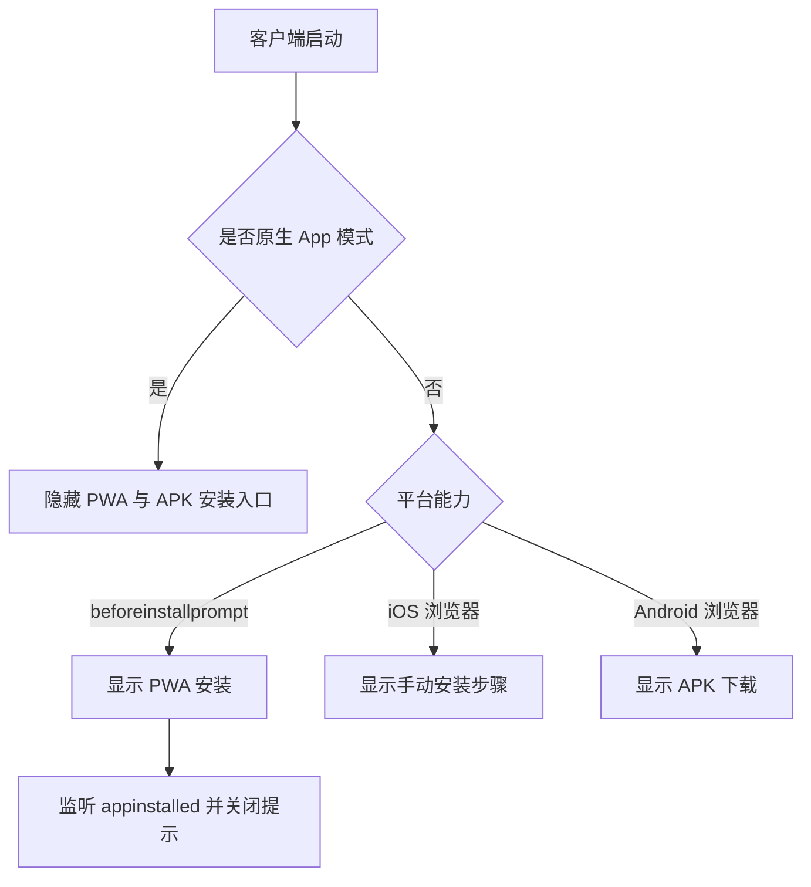

# 客户端安装与 App 模式

ClawBench 可以作为普通网页、PWA 或 Android 原生 WebView 使用。安装入口根据平台能力动态选择：支持安装提示的浏览器走 PWA，iOS 展示手动“添加到主屏幕”步骤，Android 浏览器还可下载内嵌 APK；原生 App 内不重复展示安装入口。

## 流程图

### 平台安装决策

App 模式由原生 Bridge 与窗口环境共同判断，避免仅靠 User-Agent 误判。安装状态由浏览器事件和 display-mode 查询共同确认。

## 功能与设计要点

### 功能清单

- **PWA 安装**：捕获浏览器 `beforeinstallprompt`，由用户操作触发系统安装界面；安装完成后隐藏重复提示
- **iOS 安装指导**：Safari 不提供标准安装事件，因此通过 `IosInstallDrawer` 展示系统分享菜单中的手动步骤
- **APK 下载**：Android 浏览器可以从 `/api/apk` 下载嵌入服务端二进制的安装包，不依赖外部下载站
- **App 模式识别**：原生 Android、PWA standalone 和普通浏览器采用不同 UI，避免在已安装环境继续提示安装

### 设计要点

- **能力检测优先于平台猜测**：优先使用标准事件和 display-mode，User-Agent 只用于 iOS 等缺少标准能力的场景
- **原生环境不展示 Web 安装入口**：同一界面运行在 WebView 时应表现为已安装应用
- **APK 与前端同版本发布**：APK 通过构建流程嵌入 Go 二进制，下载入口与当前服务版本保持一致
- **安装必须由用户手势触发**：浏览器安全模型不允许后台自动拉起安装提示
- **服务端按"磁盘优先、内嵌兜底"提供前端，因此产物目录名必须不可能撞车**：进程 CWD 下存在构建输出目录时直接读它（改前端后无需重启即可生效），否则回退到二进制内嵌的前端（单文件分发）。这条策略把"目录名"变成了正确性的一部分——产物目录名一旦与系统上无关的同名目录撞车（macOS 自带 `~/Public` 且文件系统大小写不敏感），服务端会误判为"有磁盘前端"而去读一个空目录，结果所有页面 404、Android WebView 拿到错误页后永不关闭启动页（issue #461，与 #449 同源）。因此目录名必须带前导点且唯一到不可能撞车，并有测试拒绝一批常见通用名；改名同时让老安装遗留的旧目录自动失效，无需用户清理
