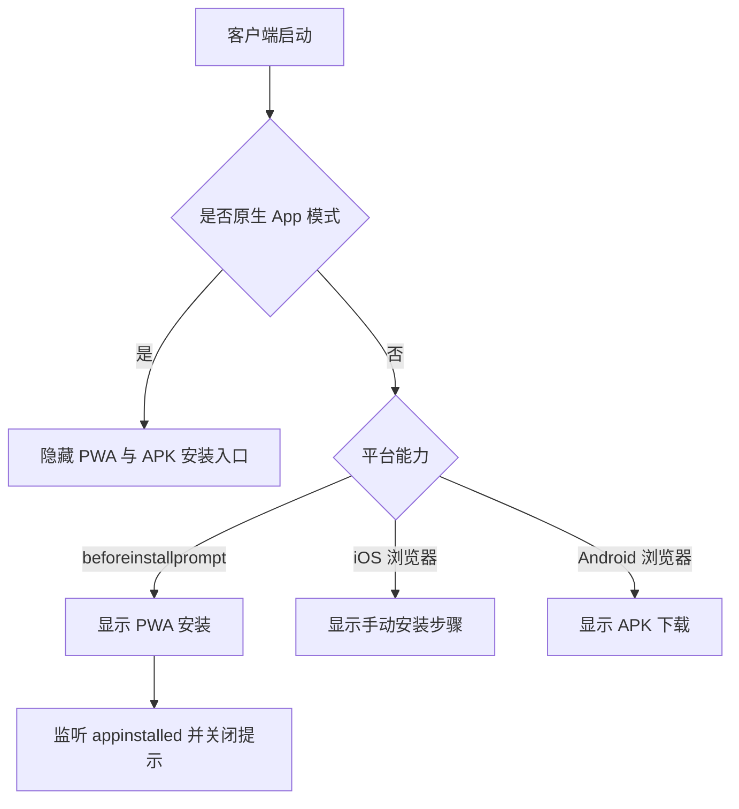
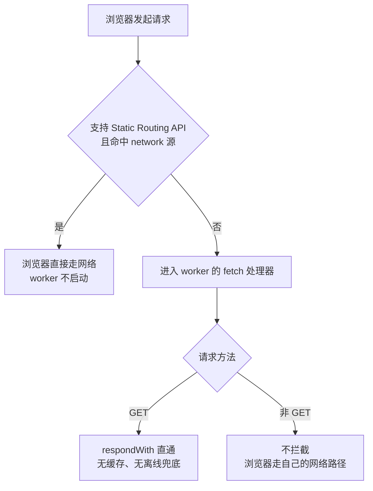

# 客户端安装与 App 模式

ClawBench 可以作为普通网页、PWA 或 Android 原生 WebView 使用。安装入口根据平台能力动态选择：支持安装提示的浏览器走 PWA，iOS 展示手动“添加到主屏幕”步骤，Android 浏览器还可下载内嵌 APK；原生 App 内不重复展示安装入口。

## 流程图

### 平台安装决策

```mermaid
flowchart TD
    A[客户端启动] --> B{是否原生 App 模式}
    B -->|是| C[隐藏 PWA 与 APK 安装入口]
    B -->|否| D{平台能力}
    D -->|beforeinstallprompt| E[显示 PWA 安装]
    D -->|iOS 浏览器| F[显示手动安装步骤]
    D -->|Android 浏览器| G[显示 APK 下载]
    E --> H[监听 appinstalled 并关闭提示]
```

App 模式由原生 Bridge 与窗口环境共同判断，避免仅靠 User-Agent 误判。安装状态由浏览器事件和 display-mode 查询共同确认。

### Service Worker 的请求处理

```mermaid
flowchart TD
    A[浏览器发起请求] --> B{支持 Static Routing API<br/>且命中 network 源}
    B -->|是| C[浏览器直接走网络<br/>worker 不启动]
    B -->|否| D[进入 worker 的 fetch 处理器]
    D --> E{请求方法}
    E -->|GET| F[respondWith 直通<br/>无缓存、无离线兜底]
    E -->|非 GET| G[不拦截<br/>浏览器走自己的网络路径]
```

只有 GET 会被 worker 重新发起（`respondWith(fetch(...))`）；非 GET 必须完全放行，否则带请求体的上传会在 WebKit 上丢失 body。Static Routing API 只覆盖 Chromium，Safari 永远走下方这条 fallback 路径——这正是守卫必须存在的原因。

## 功能与设计要点

### 功能清单

- **PWA 安装**：捕获浏览器 `beforeinstallprompt`，由用户操作触发系统安装界面；安装完成后隐藏重复提示
- **iOS 安装指导**：Safari 不提供标准安装事件，因此通过 `IosInstallDrawer` 展示系统分享菜单中的手动步骤
- **APK 下载**：Android 浏览器可以从 `/api/apk` 下载嵌入服务端二进制的安装包，不依赖外部下载站
- **App 模式识别**：原生 Android、PWA standalone 和普通浏览器采用不同 UI，避免在已安装环境继续提示安装
- **零缓存 Service Worker**：PWA 安装要求页面注册一个 Service Worker，但历史上"会缓存的 SW"造成过严重事故——旧 worker 对所有非 API 请求做 network-first 缓存并拦截 `/api/*` 返回 503，重建后 `index.html` 指向已删除的 chunk、cookie 丢失后全站 403。重新启用的 worker 以「结构上无法劫持」为前提：不写入任何 Cache Storage，请求处理器只对 GET 做透明直通、非 GET 完全不拦截（理由见设计要点），activate 时清空历史缓存；安装提示因此恢复，而 worker 不可能返回过期内容

### 设计要点

- **能力检测优先于平台猜测**：优先使用标准事件和 display-mode，User-Agent 只用于 iOS 等缺少标准能力的场景
- **原生环境不展示 Web 安装入口**：同一界面运行在 WebView 时应表现为已安装应用
- **桌面端下载入口用 HOST 轴 + 移动 OS 常量判定，且必须排除 iPadOS**：`useDesktopDownload` 只在「宿主是普通浏览器（`isWebApp`）且不在移动/触屏 OS（`!isMobileOSUA`）」时才提供桌面端下载。**iPadOS 13+ 是这里唯一的陷阱**——它走桌面模式会发 macOS UA（`Macintosh`）且不带 iPhone/iPad 标记，若只用「非 app 模式 + 非 Android UA + 非 iOS UA」判定，iPad 会被判成桌面端、拿到装不上的 `darwin-x64` 安装包。`isMobileOSUA`（Android || iOS || iPadOS）由 `usePlatformDetect` 导出，`detectPlatformKey` 也用它做首行兜底返回 `''`
- **APK 与前端同版本发布**：APK 通过构建流程嵌入 Go 二进制，下载入口与当前服务版本保持一致
- **安装必须由用户手势触发**：浏览器安全模型不允许后台自动拉起安装提示
- **Service Worker 的"不做事"比"做对事"更可靠**：浏览器只在检测到 fetch 处理器时才提示安装，而处理器一旦允许返回缓存，就会把"应用版本"与"缓存内容"解耦——在 ClawBench 这种服务端随时可重建前端的部署形态下，任何缓存策略都会变成 404/403 的来源。因此 worker 只保留安装资格所需的最小形态：用 Static Routing API 把 `/`、`/api/*`、`/share/*`、`/sw.js` 等声明为 network 源（浏览器直接走网络、根本不启动 worker），无该 API 的浏览器跳过（否则 install 抛异常导致永不激活），fetch 处理器保持非空、且只直通 GET。注册侧有五道门（有 API / 安全上下文 / 顶层窗口 / 非原生 App / `HEAD /sw.js` 返回 JS），并带 `updateViaCache:'none'` 保证 worker 自身的修复能下发。manifest 也必须放在构建输出目录而非 Vite 项目根——否则 Vite 会把 `<link rel="manifest">` 重写成带 hash 的 URL，而已安装应用的 manifest URL 是它的身份、必须稳定
- **fetch 处理器必须放行非 GET 请求**：`respondWith(fetch(request))` 对带请求体的请求并非"原样转发"——WebKit 在重新发起 multipart/form-data POST 时会丢弃请求体（WebKit bug 319396），服务端收到的 `Content-Length` 为 0，`ParseMultipartForm` 立即失败并返回 400，表现为 iOS Safari 上所有聊天附件上传全部失败。因此非 GET 必须直接放行、不调 `respondWith`，让浏览器走自己的网络路径以保留 body。**Static Routing API 兜不住这个场景**：它的注册分支是 Chromium 专属，而受影响的是 Safari——没有该 API 的浏览器永远落到这个 fallback handler，所以"把 `/api/*` 声明为 network 源"对 Safari 上传毫无帮助，守卫必须在 `respondWith` 之前生效
- **服务端按"磁盘优先、内嵌兜底"提供前端，因此产物目录名必须不可能撞车**：进程 CWD 下存在构建输出目录时直接读它（改前端后无需重启即可生效），否则回退到二进制内嵌的前端（单文件分发）。这条策略把"目录名"变成了正确性的一部分——产物目录名一旦与系统上无关的同名目录撞车（macOS 自带 `~/Public` 且文件系统大小写不敏感），服务端会误判为"有磁盘前端"而去读一个空目录，结果所有页面 404、Android WebView 拿到错误页后永不关闭启动页（issue #461，与 #449 同源）。因此目录名必须带前导点且唯一到不可能撞车，并有测试拒绝一批常见通用名；改名同时让老安装遗留的旧目录自动失效，无需用户清理
