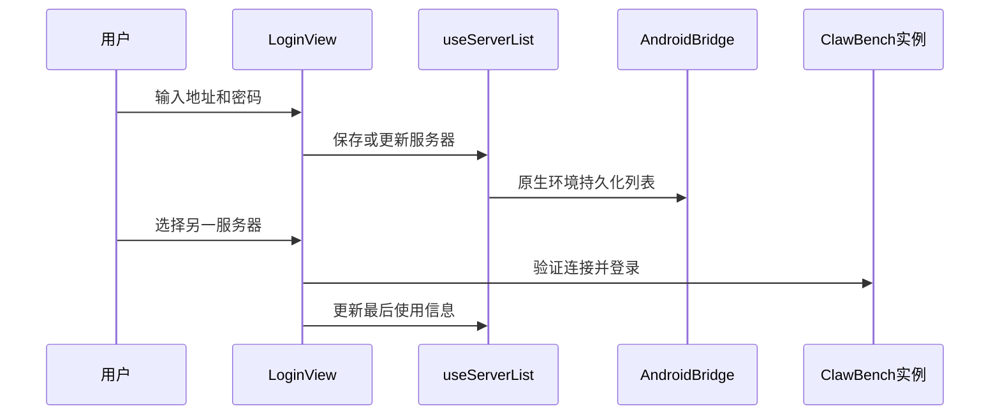

# 多服务器管理

多服务器管理让同一个浏览器或 Android 客户端保存多个 ClawBench 实例，并在登录页或应用头部快速切换。它面向同时使用本机、家庭服务器和远程工作机的用户，避免反复输入地址与密码。

## 流程图

### 保存并切换服务器

Web 环境使用浏览器存储，Android 环境通过 `AndroidNative` Bridge 使用原生持久化。应用头部只展示当前服务器以外的条目，切换时复用已保存凭据。

## 功能与设计要点

### 功能清单

- **服务器列表**：保存服务器 URL、显示名称和凭据，支持新增、更新与删除。多个部署实例可以在一个客户端内统一管理
- **登录页选择**：登录前即可切换目标服务器，并自动填充已保存信息。连接失败时服务器条目仍保留，便于网络恢复后重试
- **应用内切换**：登录后从 AppHeader 快速跳转到其他服务器，不必退出到手工输入页面
- **原生持久化**：Android 使用 Bridge 保存列表和密码，使 WebView 数据清理或进程切换后服务器配置仍可恢复
- **密码按服务端分别存储**：桌面端把每个服务端的密码加密保存在各自的 entry 内，Android 亦按 URL 取密码。此前两端都只有一个全局密码槽，认证路径只读它，于是注册多个服务端时**只有最近连接的那个能登录**——其余服务端要么认证失败、要么被复用错误密码。旧全局槽在迁移时只归属当时的活动服务端，不向其他服务端分发
- **认证失败有明确提示**：登录失败区分「认证失败 / 网络不通 / 该服务端没存过密码」三种，前两者弹 toast，不再静默退回登录页让用户不明所以

### 设计要点

- **客户端拥有服务器列表**：列表不依赖当前服务端，否则目标服务器不可达时无法切换到其他实例
- **URL 作为稳定标识**：保存同一 URL 会更新已有条目而不是创建重复记录
- **连接失败不删除配置**：网络不可达不等于服务器配置无效，删除必须由用户明确触发
- **Web 与 Android 共用 composable**：业务层只操作统一列表接口，存储差异封装在环境适配层
- **凭据仅用于用户选择的目标**：切换服务器时不向其他实例广播或同步保存的密码
- **凭据的作用域就是条目本身**：密码与它所属的服务器条目同生命周期——删除条目即删除凭据，切换服务端时也重写该条目的密码（即使为空，以免切到免密服务端后隧道复用上一个服务端的密码）。密文只在主进程内解密后回传登录页预填，不出主进程
