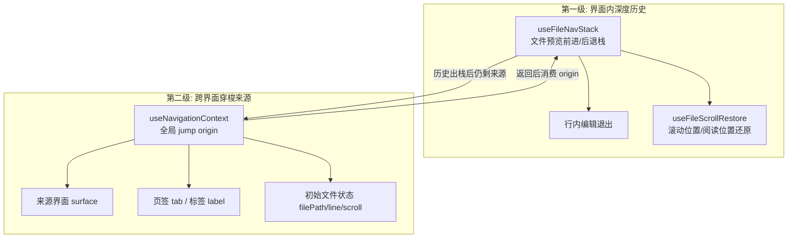
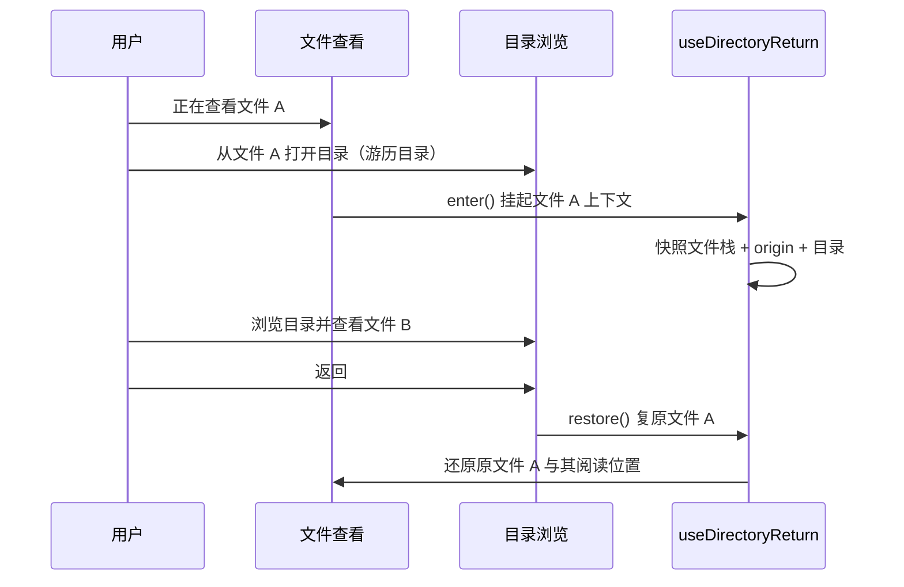
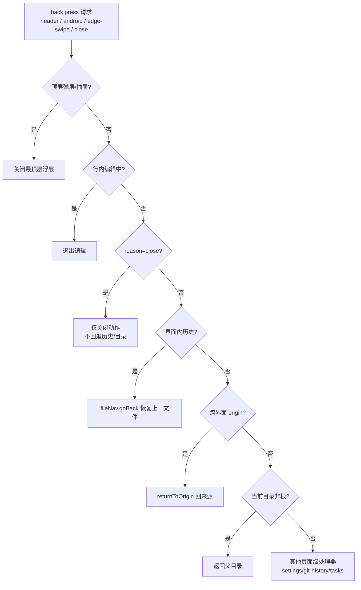

# 统一返回与跨界面导航

ClawBench 是无路由的 Vue 3 单页应用——没有 Vue Router，返回导航由前端自建的状态机统一裁决。系统将「界面内的文件深度历史」「跨界面的跳转来源」「目录游历事务」组织为两级分层栈，由一个同步状态机按确定性优先级阶梯调度；顶栏后退、移动端底部悬浮胶囊、右缘滑动手势与 Android 物理返回键全部汇入同一个状态机。这套体系解决的是无路由 SPA 的核心难题：从对话/任务点开文件后，返回为什么能精准回到触发上下文而不是误退目录顶层或丢失来源。

## 流程图

### 两级分层栈

### 目录游历事务

### 返回状态机裁决

图后关键信息：`canHandleBack` 是零副作用的同步探测——Android 原生 `onBackPressed` 通过 `evaluateJavascript` 同步读取 `window.__clawbenchBackHandled`，因此「判定能否处理」必须与「执行导航」解耦，判定在事件同一 tick 内完成，导航异步执行。`reason='close'` 有独立语义守卫：关闭按钮触发时不降级为历史/目录返回，避免"关闭弹层变成跳回上一文件"。

## 功能与设计要点

### 功能清单

- **界面内文件历史栈**：`useFileNavStack` 维护文件预览的前进/后退栈（上限 20 条），支持行内编辑退出、Markdown rendered/raw 视图模式与行范围记录。返回出栈时携带上一文件的视图状态，浏览器式的分支语义——回退后再打开新文件会截断当前分支
- **滚动/阅读位置精准还原**：`useFileScrollRestore` 拥有文件查看器全部滚动状态存取的裁决权——跨文件/重开恢复用按路径缓存的像素 scrollTop（`fileScrollCache` 模块级共享，跨 FileViewer 卸载存活），rendered↔raw 与编辑切换用**单一 sourceLine 锚**（rendered 块带 `data-source-line`，CodeMirror 有真实行号，单行即共享坐标）。锚阶梯收敛为 3 级（sourceLine → 像素 → 比例），块内偏移用 `sourceOffset` 吸收——多套坐标锚（heading/block/sourceLine）叠加会在接缝处互相打架。两个守卫防丢位置：隐藏容器（display:none 重置 scrollTop）读到的偏移一律不写入；内容异步渲染导致目标超出当前最大滚动时延后到内容真正能承载为止；行号不可达时正确回退到像素/比例而非把用户丢回顶部
- **跨界面跳转来源追踪**：`useNavigationContext` 模块级单例追踪 jump origin——记录来源界面（surface：chat/task/file/browse/history）、应激活页签（tab）、标签与初始文件状态。`start`/`replace`/`consume`/`clear` 管理生命周期，快照/恢复支撑项目热切换时保留未消费的返回目标
- **目录游历事务**：`useDirectoryReturn` 在「文件查看 → 游历目录 → 查看新文件」场景下挂起原文件上下文（文件栈 + origin + 所在目录全部快照），离开目录时精准复原。模块级单例存储保证同一时刻只有一次可挂起的文件访问——被挂起的状态是全局的，per-call 栈会让两个调用者对"谁被挂起"产生分歧
- **统一返回状态机**：`useNavigationStateMachine` 以注入的 hooks 接口实现裁决——判定（纯谓词）与执行分离。返回步骤优先级阶梯：顶层弹层/抽屉 > 行内编辑 > Browse 瞬态层（搜索/多选）> 界面内历史 > 跨界面来源 > 关闭覆盖层 > 父目录 > 其他页面级处理器。`reason='close'` 时严格限定为关闭动作，命中 origin/overlay 之外直接返回
- **导航调度出仓**：`useNavigationCoordinator` 收敛全局文件打开唯一入口 `openFileInViewer()`，统一 Markdown 渲染模式判定、目录跳转协调与来源记录；`switchTab` 内嵌 origin 结算（用户未用返回键即手动到达来源界面时清掉过期返回目标）。App.vue 只负责接线不再承载导航逻辑。跨项目热切换时 origin 快照按项目路径入 Map，切回时恢复
- **多端自适应返回入口**：
  - **桌面双栏**：文件顶栏左上角常驻 26px 导航簇（ArrowLeft/ArrowRight），对话中跳转文件后返回平滑归还右栏对话焦点，左栏恢复目录
  - **移动触控**：文件查看内容区底部居中半透明悬浮胶囊导航（休息态半透明、hover/焦点全透明），顺应单手握持大拇指热区；历史流用 ArrowLeft/ArrowRight，下钻场景保留 ChevronLeft
  - **手势与物理键**：右缘左滑边缘手势（web 模式）与 Android 物理/预测返回键全部汇入状态机；Android App 模式下边缘手势跳过 dispatch 防重复（原生 onBackPressed 已派发）
- **双击退出保护**：无可处理状态时返回 false——第一按提示"再按一次退出"，2 秒窗口内第二按放行原生退出；这是 Android 误退出的最后防线
- **弹层优先级倒挂修复**：抽屉/弹窗返回优先级高于文件内导航，边缘滑动与 Android 返回先收起最顶层浮层，再退文件栈——旧实现里浮层返回会被页面级处理器截获

### 设计要点

- **判定与执行解耦是 Android 兼容的前提**：原生侧必须在同一 tick 内读到「此按是否被消费」，`canHandleBack` 因此是同步纯谓词，`navigateBack` 才异步执行。若在 async 回调里写 `__clawbenchBackHandled`，微任务晚于原生读取，App 就会误退出
- **两级分层栈而非单一返回栈**：界面内文件历史与跨界面来源性质不同——前者属于当前这次文件访问，出栈应优先；后者属于"用户从哪来"，历史耗尽才轮到。分层让「文件内链接跳转」与「从对话跳文件」两种返回语义天然区分，不会互相污染
- **来源只记录必要信息**：非 file 来源的 origin 会剥离文件恢复数据（normalize）——把旧文件的 scrollTop 挂在 chat/task 来源上会导致 returnToOrigin 错开一个全局缓存的无关文件
- **手动到达即结算 origin**：用户不用返回键、直接手动切回来源界面，说明返回目标已过期——`shouldSettleOrigin` 判定并清掉。唯一例外是挂起的目录游历事务：它把整次文件访问停泊在 `view` 页签，切到文件 Tab 不代表回到被挂起的文件
- **目录游历与返回去重**：`browse` 返回优先级高于 origin——解开「文件 A → 目录 → 文件 C」时必须先退回目录再退回 origin 文件，跳过目录会让用户失去中间上下文
- **跨项目导航状态保留**：项目热切换会重建整个组件树，但导航快照按项目路径持久化，切回项目后返回目标依然有效
