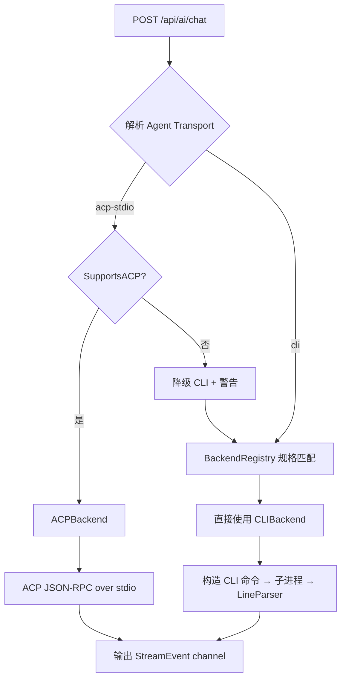
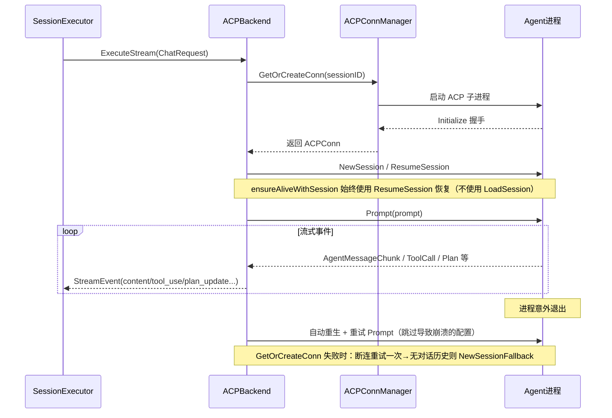
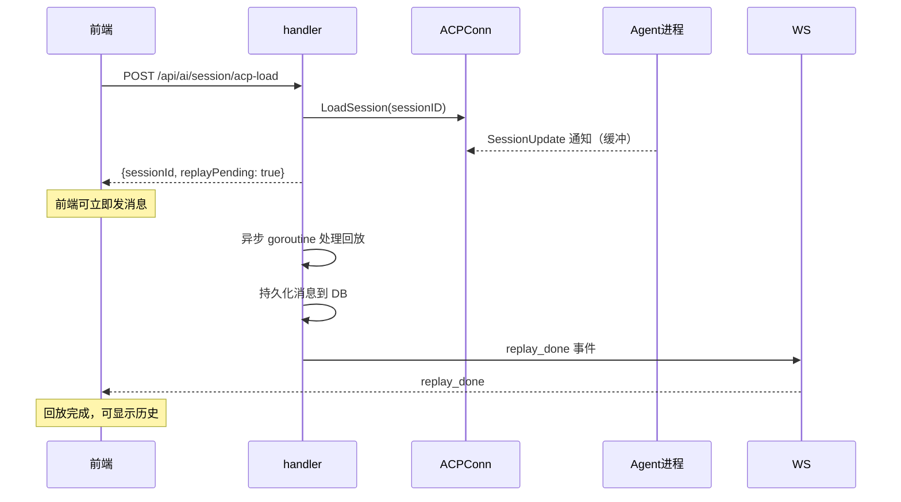

# AI 后端抽象

ClawBench 支持多种 AI 工具，每种工具的调用方式、输出格式各不相同。AI 后端抽象层将这种差异封装为统一的 `AIBackend` 接口——handler 只需调用 `ExecuteStream()`，不关心背后是 Claude 还是 Kimi。系统支持两种传输模式：CLI shell-out（传统模式，通过 stdout 流式解析）和 ACP stdio（Agent Client Protocol，通过 JSON-RPC 双向通信，提供模式切换、斜杠命令和权限管理等结构化能力）。13 个后端在 `BackendRegistry` 中声明规格（CLI 命令、模型发现策略、ACP 命令），factory 根据后端类型创建对应的 `AIBackend` 实例。传输选择在 factory 层根据 Agent 的 `Transport` 字段决定，调用方完全透明。

## 流程图

### 后端选择与传输分流

### ACP 连接与执行流程

### LoadSession 异步回放流程

## 功能与设计要点

### 功能清单

- **统一流式接口**：所有 AI 后端实现 `AIBackend` 接口，对外暴露统一的 `ExecuteStream()` 方法，返回 `<-chan StreamEvent`。调用方无需关心底层差异
- **双传输模式**：CLI shell-out（传统模式，通过 stdout 解析）和 ACP stdio（JSON-RPC 双向通信，提供模式切换、斜杠命令、权限审批等结构化能力）。Agent 的 `Transport` 字段决定使用哪种传输，可按会话切换
- **多后端支持**：支持 13 种 AI 后端（Claude、Codebuddy、OpenCode、Codex、Qoder、VeCLI、DeepSeek/CodeWhale、Kimi、Copilot、MiMo-Code、Pi、Antigravity、Grok Build），每个后端在 `BackendRegistry` 中声明规格（CLI 命令、模型发现策略、ACP 命令），factory 根据后端类型创建对应的 `AIBackend` 实例
- **ACP 会话恢复重试与回退**：`GetOrCreateConn` 失败时，若错误为 `isACPPeerDisconnected`（Agent 进程被 kill、连接丢失、或 `context.DeadlineExceeded` 被判定为对端断连），自动重试一次——新的 spawn + ResumeSession 通常能恢复会话。若重试仍失败且会话尚无对话历史（`HasConversationHistory` 检查 DB 中是否存在任何消息，包括仅用户消息），`NewSessionFallback` 清除旧会话映射强制创建新会话，避免用户因瞬时断连而无法使用。已有对话历史的会话不回退到新会话，因为重建会话会丢失 Agent 的对话记忆——此时向用户暴露错误，由用户重试，保留原始会话映射
- **ACP 连接管理**：每个 ClawBench 会话独占一个 ACP 连接（通过 `ACPConnManager` 单例的 `conns map[string]*ACPConn` 维护，键为 `clawbenchSID`）。连接空闲 5 分钟后由定时清理任务（idle sweep）回收，活跃会话不会被回收。idle sweep 使用 `lastActivityNano`（取 `lastUsed` 与 `lastSessionUpdate` 的较大值）判断连接是否空闲——`lastUsed` 在每次 Prompt 调用时更新，`lastSessionUpdate` 通过无锁原子操作在 SessionUpdate 通知回调中记录，确保异步工作流（如 `/deep-research`）持续发送 SessionUpdate 事件时连接保持活跃，且不会因在 notification 处理链上获取锁而导致死锁。idle sweep 至少保留 3 个存活连接（`minAliveConns`），超过时按 `lastActivity` 从最久未活动开始驱逐（LRU），避免频繁杀光连接导致后续请求全部冷启动；对并发 map 访问有 nil guard 保护，防止并发删除导致 panic。连接断开后可重新创建并重试，失效的配置值会被跳过。服务优雅停止时（SIGTERM），`GracefulStopAll` 先取消本地 prompt 让 ACP 后端发出 done 事件完成当前流，再等待进程自然退出（走 `cmdWaitOnce` 避免并发 Wait 死锁），超时 SIGKILL 兜底；`stopSweep` 关闭为 `sync.Once` 幂等，防止重复回收
- **ACP 斜杠命令跳过前缀注入**：ACP 协议规定斜杠命令（如 `/compact`、`/reload-plugins`）通过 Prompt 以纯文本发送，Agent 通过检测文本开头的 `/` 来识别命令。`IsACPSlashCommand()` 检测斜杠命令（匹配 `/<letter>[<alphanumeric/hyphen>]` 模式），斜杠命令跳过系统提示注入和文件路径前缀注入，确保命令文本以 `/` 开头到达 Agent
- **流式事件累加（AccumulateBlock）**：StreamEvent 经 `AccumulateBlock()` 合并为 `[]ContentBlock` 列表。text/thinking 事件合并到最近的同类型 Block（跨 tool_use 边界回溯），tool_use 按 ID 增量更新。ACP 子 Agent 回放检测：当子 Agent 在工具调用后重发已完成段落的前缀文本时，累加器识别并替换原始 Block、删除中间重复 Block，避免同一段落被碎片化展示
- **连续 thinking Block 合并**：`MergeConsecutiveThinkingBlocks` 后处理步骤将相邻的 thinking Block（包括跨 tool_use 边界的）合并为连续内容。ACP Agent 交替输出 `AgentThoughtChunk` 和 `ToolCall` 事件，导致大量碎片化的 thinking 片段——合并后前端展示连贯的思考过程
- **ACP context_state 持久化**：ACP 会话的 mode、thinking effort、usage 状态持久化到 `chat_sessions.context_state` 列（JSON 格式）。服务重启后加载会话时即可恢复状态显示，无需等待 ACP 重连推送。部分更新通过原子合并操作写入，避免并发读-写-合并竞态。详见 [会话生命周期](session-lifecycle.md)
- **流式事件标准化**：各后端不同的输出格式经 LineParser（CLI）或 ACP 事件翻译层（ACP）统一为标准 StreamEvent 类型。ACP 额外提供 mode_update、config_update、thinking_effort_update、plan_update、model_list_update、commands_update 等能力事件
- **AskQuestion 标签转换**：`ConvertAskQuestionBlocks()` 检测文本 Block 中的 `<ask-question>` XML 标签（AI Agent 偶尔在文本中输出结构化交互请求），将其解析并转换为标准 `tool_use` Block（name=`AskUserQuestion`）。支持 XML 和 JSON 两种格式，容忍非标准闭合标签和未闭合标签。保证前端交互 UI（确认/选择）能统一处理所有形式的交互请求
- **无效工具调用清理**：`RemoveRejectedToolBlocks()` 剔除被 CLI 拒绝的工具调用（Status="error" 且输出含 "not found in agent cli"），这些是 AI 幻觉产生的不存在工具名（如 `/commit` 斜杠命令或 `AskUserQuestion` 未转为 tool_use 时）。同时删除引用该工具名的警告 Block，避免前端展示无意义的错误提示
- **thinking_done 信号**：累加器将 `thinking_done` 事件标记到最近一个 thinking Block 的 `Done` 字段，前端据此在完整响应结束前即可停止思考过程的旋转动画，而非等到整个流结束
- **thinking 惰性加载（lazy-load）**：聊天流式输出完成后，`Finalize` 将 thinking 文本从消息内容中拆分到独立的 `chat_thinking` 表，前端只收到缩略的 thinking Block（含 `think_id`，不含完整文本）。用户展开 thinking Block 时，前端通过 `GET /api/ai/chat/thinking` 按需加载完整文本（`useThinkingContent` composable）。流式过程中 thinking Block 不缩减，保持完整展示；流结束后立即折叠——避免长 thinking 文本占用大量 DOM 空间，用户只在需要时才加载全文
- **工具调用时长追踪**：`SessionExecutor` 在工具调用的 `ToolCallUpdate` 事件中记录每个工具的开始时间，流结束时写入 `DurationMs` 字段并持久化到 `chat_tool_calls.duration_ms` 列。前端在工具详情抽屉中展示各工具调用耗时，帮助用户理解 AI 执行步骤的时间分布
- **ACP 连接状态提取**：`acp_state_extract.go` 从 ACP 协议响应（NewSession/ResumeSession）提取 mode、thinking effort、model、config option 状态。ACP v2 Agent 通过 `ConfigOptions` 的 category 字段暴露模式（`mode`）和思考深度（`thought_level`），旧版通过独立的 `Modes` 字段暴露——两条路径同时支持，保证新旧 Agent 兼容
- **ACP 崩溃诊断**：Agent 进程意外退出时，`crashDiagnostics` 收集退出码、stderr 尾部（~2KB）、进程存活时间、信号名（SIGKILL/SIGSEGV 等）、父进程 PID、内存占用和 FD 数。数据在 `Wait()` 前从 `/proc/<pid>/status` 和 `/proc/<pid>/fd` 采集（进程 reap 后 `/proc` 数据消失）。诊断结果以紧凑字符串形式记录到日志，帮助定位崩溃根因（如 OOM Kill、SIGSEGV、SIGPIPE）
- **ACP 权限审批**：ACP 后端请求用户审批工具调用时，系统推送 `permission_pending` 事件，前端展示审批界面，用户批准/拒绝后通过 WS `permission_respond` 消息回传（HTTP `/api/ai/permission/respond` 作为备选通道）
- **ACP LoadSession 异步回放**：ACP LoadSession 立即返回 `replayPending: true`，前端无需等待历史回放即可发送新消息——Agent 已从加载的会话获得完整上下文。回放在后台 goroutine 中异步执行，持久化消息到 DB 后通过 `replay_done` WS 事件通知前端。LoadSession 能力来源是 `BackendSpec.ACPLoadSession` 而非 ACP Initialize 响应（Initialize 报告的 LoadSession 可能不可靠，以 BackendSpec 为准）。CodeBuddy 经集成测试验证真实支持 `session/load`（RPC 成功且能恢复上下文），其 `BackendSpec.ACPLoadSession=true`
- **工具名称归一化**：不同后端对同一操作使用不同的工具名称（如 `read_file` vs `Read`），归一化层统一映射，保证前端显示和 RAG 索引的一致性
- **孤儿进程清理**：服务启动时扫描系统中的 AI 子进程孤儿（通过环境变量标记），检查父进程存活后安全清理。防止服务崩溃后遗留的进程占用资源
- **CLI 无进度看门狗**：`CLIBackend.NoProgressTimeout`（默认 30min，负值禁用）监控 CLI 子进程的 stdout 输出，超时无输出则终止进程。防止 CLI 挂起（如被 spawn 的子进程持有 stdout 管道、进程无响应）导致会话永远无法完成
- **ACP 无进度看门狗**：`ACPConn.stallTimeout`（默认 30min，负值禁用）监控 ACP Prompt 的进度，将 `SessionUpdate` 事件或进行中的工具调用视为进度。超时无进度则取消 Prompt 并关闭连接。区分"Agent 在忙"（有工具调用在执行）和"Agent 卡死"（完全无响应），只有后者触发看门狗。看门狗触发时使用 `killAndMarkDead()` 而非 `close()`，保留 `acpSID` 使后续 Prompt 可通过 LoadSession/ResumeSession 恢复会话——避免因看门狗导致会话失忆（amnesia）
- **CLI 进程组管理**：`cmd.Cancel` 终止整个进程组（而非仅主进程），防止 spawn 的子进程持有 stdout/stderr 管道导致 `cmd.Wait` 阻塞。进程退出后 2s 内强制关闭 stdout 管道的读取端，避免子进程持有管道导致 scanner 永远阻塞
- **ACP Stdout 过滤器（acpStdoutFilter）**：所有 ACP 连接的 stdout 经过过滤器处理，修复三类 JSON-RPC 协议违规：
  1. **String-Number ID 不匹配**：CodeWhale 等后端在响应中返回 `"id":"1"`（字符串），而请求发送的是 `"id":1`（数字）。ACP SDK 严格匹配 ID，`"1" != 1` 会导致响应被静默丢弃。过滤器检测并转换回数字形式
  2. **非 JSON 行**：某些后端在 ACP stdio 模式下向 stdout 输出终端转义序列，过滤器跳过不以 `{` 开头的行
  3. **SessionModelState 提取**：Kimi ACP 通过 `NewSessionResponse.models` 字段返回可用模型列表，但 ACP Go SDK v0.13.5 的 `json.Unmarshal` 不包含此字段，导致模型信息被静默丢弃。过滤器在原始 JSON 中拦截并缓存 `models` 字段，作为 `extractACPModelList` 的后备数据源
  - **进程退出防挂起**：过滤器在后台处理过滤和重发行，当 Agent 进程被 kill 但 OS 尚未关闭 stdout 管道时，过滤器的 `Close()` 调用立即解除阻塞的读取操作，防止进程等待挂起
- **CodeWhale ACP 字段重映射**：CodeWhale 在 ACP 模式下使用简写字段名（如 `path` 代替 `file_path`、`search` 代替 `old_string`）。重映射表将其映射为前端渲染器的标准字段名，工具名前缀表将 CodeWhale 工具名（如 `read_file`）映射为 UI 友好的显示前缀（如 `Read`）
- **BackendSpec.AltCmd 回退检测**：`AltCmd` 字段提供备用 CLI 命令名——当主命令在 PATH 中未找到时，检查 `AltCmd` 是否存在。当前仅 CodeWhale 使用：`DefaultCmd: "codewhale", AltCmd: "deepseek"`，兼容旧版二进制名
- **Pi 仅支持 CLI 模式**：Pi 当前不注册 ACP 配置。请求 `acp-stdio` 传输时会自动降级为 CLI 模式
- **Antigravity ACP 桥接**：Antigravity 后端通过 `agy-acp` ACP 桥接适配器接入，仅支持 `acp-stdio` 传输模式，没有 CLI 命令。这是外部 Agent 的集成模式——桥接适配器将非 ACP 原生的 Agent 包装为 ACP 协议兼容的子进程
- **Grok Build 双传输模式**：Grok Build 后端同时支持 ACP（`grok agent stdio`）和 CLI（`grok -p ... --output-format streaming-json`）两种传输。ACP 为首选传输，CLI 作为流式 JSON 回退。`GrokStreamParser` 解析 CLI 的 JSON Lines 输出（text/thought/end/error 事件类型），从 end 事件捕获 session ID 和 token 用量
- **OPENCODE_PERMISSION 注入**：OpenCode 的 ACP 连接自动注入 `OPENCODE_PERMISSION` 环境变量，将默认需人工审批的三个权限（文件读取、文件写入、命令执行）转为自动通过——防止 OpenCode 子 Agent 在无人值守的定时任务场景中因权限审批而挂起
- **ACP ListSessions 磁盘扫描回退**：对于不支持 ACP `session/list` RPC 的后端（如 CodeBuddy），系统回退到磁盘扫描枚举会话。每个后端在 `init()` 时注册自己的磁盘扫描函数（`ListSessionsFromDiskFn`），`ACPConnManager` 的 `ListSessions` 方法优先尝试 RPC，失败时回退到磁盘扫描
- **Codex 项目级会话发现**：Codex 的 ACP `session/list` 第一页会与磁盘扫描结果合并（`CODEX_HOME/sessions` 下的 `rollout-*.jsonl`，上限 10k 文件 / 200 结果，只读 session_meta 头），按 `sessionId` 去重、`updatedAt` 排序。ACP 列表失败时纯磁盘扫描兜底，恢复抽屉隐藏无标题会话——让 Codex 历史会话跨项目可靠恢复
- **ACP EnsureAlive**：仅确保 ACP 连接存活，不创建或恢复会话。用于 `ListSessions` 等不需要会话上下文的场景
- **ACP 用户取消保护存活连接**：用户取消（context cancel）时，如果 ACP 进程仍然存活，不调用 `markDeadIfCurrent`——避免不必要的 kill+respawn+ResumeSession 周期。只有当进程已死亡时才标记连接为 dead。此外，`handlePromptCancel` 保护 stale-conn：旧的 cancel 回调不会 clobber 已重生的连接。旧 cancel 的 `connRef` 通过 `isSameConn` 比较拒绝
- **ACP ensureAliveWithSession 使用 ResumeSession**：`ensureAliveWithSession` 始终使用 `ResumeSession` 恢复会话，不使用 `LoadSession`（LoadSession 回放完整历史，慢且可能超时）。`loadTargetSID` 仅由显式的 `/api/ai/session/acp-load` 端点设置
- **CodeBuddy MCP 配置注入**：CodeBuddy ACP 连接 spawn 时读取 `~/.codebuddy/.mcp.json` 并通过 `--mcp-config` 参数注入，使 MCP 工具（websearch、tavily 等）在 ACP 模式下可用
- **CodeBuddy Plugin Skills 竞态修复**：CodeBuddy 的 PluginManager 在 NewSession 后 ~3s 才加载完成，然后发送包含插件技能的 `AvailableCommandsUpdate`。首个 `AvailableCommandsUpdate` 仅包含内置命令，插件命令缺失。三阶段修复：spawn 时预扫描 `~/.codebuddy/.codebuddy/skills/` 缓存目录提取插件命令、合并到 ACP client 缓存和 registry（`MergeCommandsFromScan`）；`SessionUpdate` 到达时 `mergeAndSyncCommands` 将 ACP 命令与预扫描命令合并（ACP 优先）；`ScheduleCommandsReEmit` 在 `codebuddyPluginLoadDelay`（~3s）后重发 `commands_update` 事件，确保前端看到完整命令列表
- **CodeBuddy Skills 扫描**：CodeBuddy TUI 模式会自动扫描 `~/.codebuddy/skills/` 并把技能暴露为斜杠命令（`/skill-name`）+ 系统提示词，但 ACP 模式不提供此能力。`ScanCodeBuddySkills()` 扫描该目录下的 `SKILL.md`，用 `yaml.v3` 解析 frontmatter（name + description，支持多行 YAML 折叠/字面量标量），通过 `SkillsToCommands()` 转成 `AvailableCommandInfo` 合入命令列表——技能因此出现在 `/` 斜杠菜单中；同时预构建技能系统提示词摘要（name+description 表格，转义管道/反斜杠防止破坏表格）注入每次 Prompt 的 SystemPrompt，缓存到 ACPConn 避免重复扫描。让本地技能在 Web 会话中与 TUI 模式一致可用
- **ACP `_meta` 扩展元信息解析**：ACP 协议保留每个请求/响应/通知上的 `_meta` 字段供 Agent 放私有扩展，各 Agent 形态不同——CodeBuddy 用 OpenAI 风格 usage（prompt/completion token、`prompt_cache_*`、credit）外加 `codebuddy.ai/*` 命名空间（usageByCategory、requestId、traceId、modelId），Claude/Codex 在 `PromptResponse._meta.quota` 报每模型 token_count（cachedInput/cachedWrite/input/output/reasoningOutput/total），OpenCode 无 `_meta` 扩展、用量走标准 usage_update 通知。解析按 agent 分发（per-agent adapter，未知后端回退到通用递归扫描），归一化为 canonical 的 token/cost/trace 结构——缓存读/写、thought、cache 分类、credit、request/trace/message ID、请求/响应模型、finish reason 等。归一化结果合并进 usage 状态并持久化到 `chat_metadata` 扩展列，让前端能统一展示各 Agent 的 Token 分项、成本与追踪标识，无需理解每种 Agent 的私有格式
- **raw_output 累积缓冲**：ACP 通知的原始 JSON 不再作为 `raw_output` StreamEvent 通过 channel 发送——改为直接累积到 `ACPConn.rawOutputBuf`，Prompt 返回后一次性刷出。之前每条通知产生 2-3 个 channel 事件，channel 满（buffer=512）时内容事件被丢弃（约 27K drops/day）。移出后 channel 压力减半
- **reapplyConfigAfterResume**：ResumeSession 后重新应用 mode/model/thinkingEffort 配置，确保恢复后的会话与用户期望的设置一致。被 agent 拒绝过的配置项（如 `Unknown config option: thinkingEffort`）会被记录为 unsupported，重连后跳过不再重发——避免每次 resume 都触发一次注定失败的 `set_config_option` RPC
- **共享规则模板（commonRulesTemplate）**：所有 Agent 的系统提示词前注入 `commonRulesTemplate`，包含用户交互格式规范（XML `ask-question` 标签）和媒体生成规则。模板用 `«»` 占位反引号，运行时替换。另有 `mediaRulesTemplate` 仅在用户消息携带文件附件时注入

### 设计要点

- **双传输分流在 factory 层**：`NewBackendForAgentWithTransport` 根据 Agent 的 `Transport` 字段（"cli" / "acp-stdio"）决定创建 ACPBackend 还是 CLIBackend。ACP 不可用时降级到 CLI 并记录警告——用户选择 ACP 是有意的，降级是容错而非静默回退
- **ACP 一对一连接而非连接池**：`ACPConnManager` 是单例，管理每个 ClawBench 会话独占一个 ACP 连接。AI Agent 的会话状态是私有的，无法在连接间共享。`ACPConn` 内部可能复用 goroutine，但对外是一对一映射
- **CLIBackend 是通用骨架**：所有 shell-out 后端共享 `CLIBackend` 的进程管理、stdout 管道、上下文取消逻辑，差异仅在于 CLI 参数构建和输出解析策略——新增后端只需提供这两个策略
- **后端规格集中声明**：所有后端的规格（CLI 命令、模型发现策略、ACP 命令）在 `BackendRegistry` 中集中声明，factory 通过后端类型字符串匹配创建实例。新增后端需要同时添加规格条目和 factory 分支
- **ACP 状态缓存与重发**：每个连接缓存当前的 mode、thinking effort、config、commands、plan 状态和 `replayPending` 标志。新连接或重连时自动重发，保证前端在任何时刻都能恢复完整的 UI 状态。`replayPending` 标识 LoadSession 异步回放是否仍在进行
- **ACP 全局函数变量打破循环依赖**：`internal/ai` 包通过全局函数变量（`getExternalSessionID`、`getSessionAutoApprove`、`onPermissionStateChange`）与 `internal/service` 和 `internal/ws` 包通信——Go 不允许循环依赖，函数变量是在编译期解耦、运行期桥接的折中方案
- **ACP AgentID/BackendID 无锁访问**：`AgentID()` 和 `BackendID()` 不再获取 `c.mu` 锁——`c.agent` 在 `newACPConn` 中设置后永不修改，无锁读取是安全的。这是修复 ResumeSession 死锁的关键：`ensureAliveWithSession` 持有 `c.mu` 调用 ResumeSession，SDK 的 notification 处理链会回调 `AgentID()`，如果 `AgentID` 也获取 `c.mu` 就会死锁
- **ACP 工具调用防抖**：`ToolCallUpdate` 事件以 50ms 窗口批量发送，将推送给前端的 WS 事件率降低约 95% 而不丢失信息——AI 工具调用的流式更新频率极高，逐条推送会淹没前端。终端事件（完成/失败）立即发送，不等待防抖窗口
- **ExitPlanMode 正常结束流**：CLI 后端检测到 ExitPlanMode 事件时结束当前流。ExitPlanMode 是 Agent 有意结束计划模式的信号，不应尝试续接或重试
- **Agent 存储以 DB 为主**：Agent 配置存储在数据库（`agents` 表），YAML 用于手动定义的特殊 Agent。自动发现只更新基础设施字段（`acp_command`、`transport`），用户自定义的 `name`、`command` 不被覆盖。ACP 相关字段（`transport`、`acp_command`、可用模式、思考深度、命令等）持久化在 `agents` 表中，重启后无需重新发现
- **ListSessions 使用磁盘回退而非降级**：磁盘扫描不是降级，而是补充——ACP 协议的 `session/list` 是可选能力，后端可以不实现，磁盘扫描保证功能完整性
- **CodeBuddy MCP 配置注入是 workaround**：CodeBuddy ACP 不原生支持 MCP 配置传递，通过 `--mcp-config` 命令行参数注入是临时方案
- **CodeBuddy Plugin Skills 竞态是 ACP 协议的时序问题**：ACP NewSession 时 Agent 尚未完成初始化，后续的 `AvailableCommandsUpdate` 才包含完整命令——这不是 CodeBuddy 的 bug，而是 ACP 单次握手模型与异步初始化的固有矛盾。预扫描 + 延迟重发是在协议约束下的务实补偿
