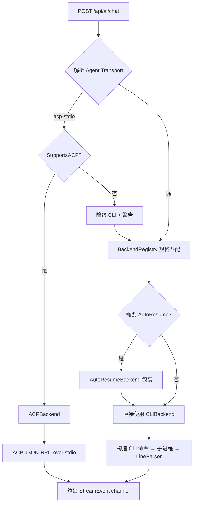
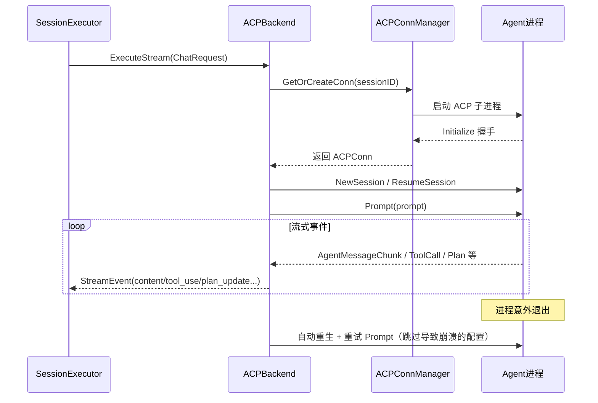
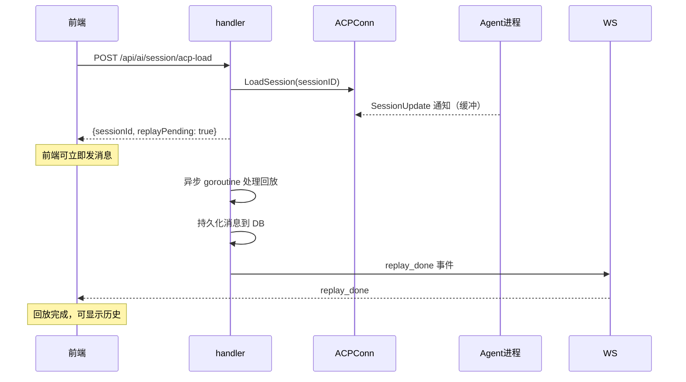
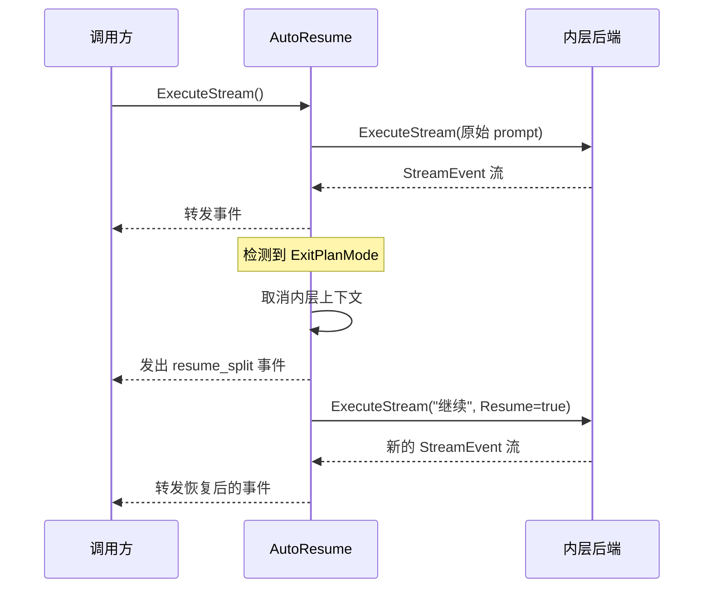

# AI 后端抽象

ClawBench 支持多种 AI 工具，每种工具的调用方式、输出格式各不相同。AI 后端抽象层将这种差异封装为统一的 `AIBackend` 接口——handler 只需调用 `ExecuteStream()`，不关心背后是 Claude 还是 Kimi。系统支持两种传输模式：CLI shell-out（传统模式，通过 stdout 流式解析）和 ACP stdio（Agent Client Protocol，通过 JSON-RPC 双向通信，提供模式切换、斜杠命令和权限管理等结构化能力）。12 个后端在 `BackendRegistry` 中声明规格（CLI 命令、模型发现策略、ACP 命令），factory 根据后端类型创建对应的 `AIBackend` 实例。传输选择在 factory 层根据 Agent 的 `Transport` 字段决定，调用方完全透明。

## 流程图

### 后端选择与传输分流

### ACP 连接与执行流程

### LoadSession 异步回放流程

### AutoResume 流程（仅 CLI 模式）

AutoResume 只用于 CLI 模式后端。ACP 后端使用会话级取消而非进程终止来处理卡死，不需要 AutoResume 的"杀进程→恢复"模式。某些 CLI 后端（Claude、Codebuddy、Qoder 等）在计划审批时触发 ExitPlanMode——AutoResumeBackend 自动处理：检测到后取消当前执行，自动恢复并继续，对调用方透明。

## 功能与设计要点

### 功能清单

- **统一流式接口**：所有 AI 后端实现 `AIBackend` 接口，对外暴露统一的 `ExecuteStream()` 方法，返回 `<-chan StreamEvent`。调用方无需关心底层差异
- **双传输模式**：CLI shell-out（传统模式，通过 stdout 解析）和 ACP stdio（JSON-RPC 双向通信，提供模式切换、斜杠命令、权限审批等结构化能力）。Agent 的 `Transport` 字段决定使用哪种传输，可按会话切换
- **多后端支持**：支持 12 种 AI 后端（Claude、Codebuddy、OpenCode、Codex、Qoder、VeCLI、DeepSeek/CodeWhale、Cline、Kimi、Copilot、MiMo-Code、Pi），每个后端在 `BackendRegistry` 中声明规格（CLI 命令、模型发现策略、ACP 命令），factory 根据后端类型创建对应的 `AIBackend` 实例
- **ACP 连接管理**：每个 ClawBench 会话独占一个 ACP 连接（通过 `ACPConnManager` 单例的 `conns map[string]*ACPConn` 维护，键为 `clawbenchSID`）。连接空闲 5 分钟后由定时清理任务回收，活跃会话不会被回收；连接断开后可重新创建并重试，失效的配置值会被跳过
- **自动恢复（AutoResume）**：仅 CLI 模式。对 ExitPlanMode 场景自动执行"取消→恢复继续"流程，避免用户手动干预
- **流式事件标准化**：各后端不同的输出格式经 LineParser（CLI）或 ACP 事件翻译层（ACP）统一为标准 StreamEvent 类型。ACP 额外提供 mode_update、config_update、thinking_effort_update、plan_update、model_list_update、commands_update 等能力事件
- **ACP 权限审批**：ACP 后端请求用户审批工具调用时，系统推送 `permission_pending` 事件，前端展示审批界面，用户批准/拒绝后通过 `/api/ai/permission/respond` 回传
- **ACP LoadSession 异步回放**：ACP LoadSession 立即返回 `replayPending: true`，前端无需等待历史回放即可发送新消息——Agent 已从加载的会话获得完整上下文。回放在后台 goroutine 中异步执行，持久化消息到 DB 后通过 `replay_done` WS 事件通知前端。LoadSession 能力来源是 `BackendSpec.ACPLoadSession` 而非 ACP Initialize 响应——某些 Agent（如 CodeBuddy）在 Initialize 中报告 `LoadSession=true` 但实际不支持
- **工具名称归一化**：不同后端对同一操作使用不同的工具名称（如 `read_file` vs `Read`），归一化层统一映射，保证前端显示和 RAG 索引的一致性
- **孤儿进程清理**：服务启动时扫描系统中的 AI 子进程孤儿（通过环境变量标记），检查父进程存活后安全清理。防止服务崩溃后遗留的进程占用资源
- **ACP Stdout 过滤器（acpStdoutFilter）**：所有 ACP 连接的 stdout 经过过滤器处理，修复两类 JSON-RPC 协议违规：
  1. **String-Number ID 不匹配**：CodeWhale 等后端在响应中返回 `"id":"1"`（字符串），而请求发送的是 `"id":1`（数字）。ACP SDK 严格匹配 ID，`"1" != 1` 会导致响应被静默丢弃。过滤器检测并转换回数字形式
  2. **非 JSON 行**：某些后端在 ACP stdio 模式下向 stdout 输出终端转义序列，过滤器跳过不以 `{` 开头的行
  - **io.Pipe 防挂起**：过滤器用 `io.Pipe` 在后台 goroutine 中读取、过滤、重发行。当 Agent 进程被 kill 但 OS 尚未关闭 stdout 管道时，`Close()` 调用立即解除阻塞的 `Read()`，防止 `cmd.Wait()` 挂起
- **CodeWhale ACP 字段重映射**：CodeWhale 在 ACP 模式下使用简写字段名（如 `path` 代替 `file_path`、`search` 代替 `old_string`）。重映射表将其映射为前端渲染器的标准字段名，工具名前缀表将 CodeWhale 工具名（如 `read_file`）映射为 UI 友好的显示前缀（如 `Read`）
- **BackendSpec.AltCmd 回退检测**：`AltCmd` 字段提供备用 CLI 命令名——当主命令在 PATH 中未找到时，检查 `AltCmd` 是否存在。当前仅 CodeWhale 使用：`DefaultCmd: "codewhale", AltCmd: "deepseek"`，兼容旧版二进制名
- **Pi 仅支持 CLI 模式**：Pi 当前不注册 ACP 配置。请求 `acp-stdio` 传输时会自动降级为 CLI 模式
- **共享规则模板（commonRulesTemplate）**：所有 Agent 的系统提示词前注入 `commonRulesTemplate`，包含用户交互格式规范（XML `ask-question` 标签）和媒体生成规则。模板用 `«»` 占位反引号，运行时替换。另有 `mediaRulesTemplate` 仅在用户消息携带文件附件时注入

### 设计要点

- **双传输分流在 factory 层**：`NewBackendForAgentWithTransport` 根据 Agent 的 `Transport` 字段（"cli" / "acp-stdio"）决定创建 ACPBackend 还是 CLIBackend。ACP 不可用时降级到 CLI 并记录警告——用户选择 ACP 是有意的，降级是容错而非静默回退
- **ACP 连接管理实现注意**：实现文件名为 `acp_pool.go`，但导出类型名是 `ACPConnManager`（单例，非"连接池"）。文档统一以 `ACPConnManager` 称呼。`ACPConn` 内部可能复用 goroutine，但对外是一对一映射
- **ACP 一对一而非连接池**：`ACPConnManager` 是单例，管理每个 ClawBench 会话独占一个 ACP 连接。AI Agent 的会话状态是私有的，无法在连接间共享
- **CLIBackend 是通用骨架**：所有 shell-out 后端共享 `CLIBackend` 的进程管理、stdout 管道、上下文取消逻辑，差异仅在于 CLI 参数构建和输出解析策略——新增后端只需提供这两个策略
- **后端规格集中声明**：所有后端的规格（CLI 命令、模型发现策略、ACP 命令）在 `BackendRegistry` 中集中声明，factory 通过后端类型字符串匹配创建实例。新增后端需要同时添加规格条目和 factory 分支
- **AutoResumeBackend 是透明包装器**：仅包装 CLI 后端。ACP 后端不使用 AutoResume——ACP 用会话级取消替代进程终止，两种取消策略不兼容
- **ACP 状态缓存与重发**：每个连接缓存当前的 mode、thinking effort、config、commands、plan 状态和 `replayPending` 标志。新连接或重连时自动重发，保证前端在任何时刻都能恢复完整的 UI 状态。`replayPending` 标识 LoadSession 异步回放是否仍在进行
- **ACP 工具调用防抖**：`ToolCallUpdate` 事件以 50ms 窗口批量发送，将推送给前端的 WS 事件率降低约 95% 而不丢失信息——AI 工具调用的流式更新频率极高，逐条推送会淹没前端
- **Agent 存储以 DB 为主**：Agent 配置存储在数据库（`agents` 表），YAML 用于手动定义的特殊 Agent。自动发现只更新基础设施字段（`acp_command`、`transport`），用户自定义的 `name`、`command` 不被覆盖。ACP 相关字段（`transport`、`acp_command`、可用模式、思考深度、命令等）持久化在 `agents` 表中，重启后无需重新发现
