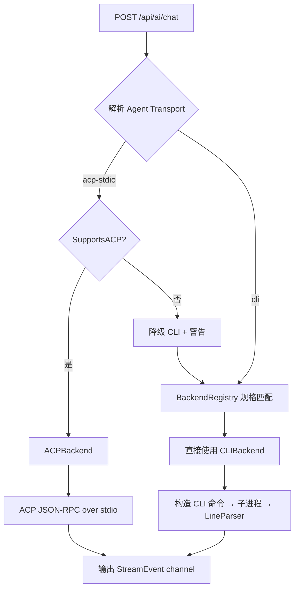
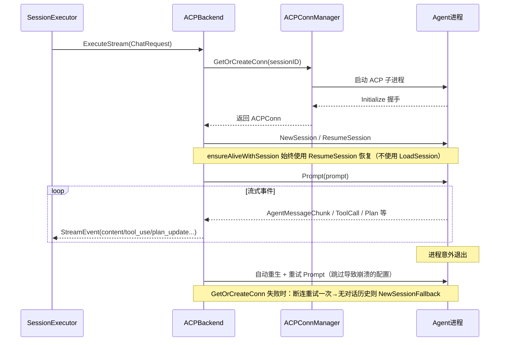
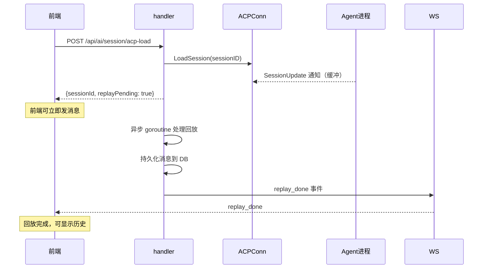

# AI 后端抽象

ClawBench 支持多种 AI 工具，每种工具的调用方式、输出格式各不相同。AI 后端抽象层将这种差异封装为统一的 `AIBackend` 接口——handler 只需调用 `ExecuteStream()`，不关心背后是 Claude 还是 Kimi。系统支持两种传输模式：CLI shell-out（传统模式，通过 stdout 流式解析）和 ACP stdio（Agent Client Protocol，通过 JSON-RPC 双向通信，提供模式切换、斜杠命令和权限管理等结构化能力）。15 个后端在 `BackendRegistry` 中声明规格（CLI 命令、ACP 命令），factory 根据后端类型创建对应的 `AIBackend` 实例；**模型发现不再属于后端规格**，而是各后端注册一个独立的 `ModelSource`（见[配置与自动发现](../infra/config-and-discovery.md)）。传输选择在 factory 层根据 Agent 的 `Transport` 字段决定，调用方完全透明。

## 流程图

### 后端选择与传输分流

```mermaid
flowchart TD
    A[POST /api/ai/chat] --> B{解析 Agent Transport}
    B -->|acp-stdio| C{SupportsACP?}
    C -->|是| D[ACPBackend]
    C -->|否| E[降级 CLI + 警告]
    B -->|cli| F[BackendRegistry 规格匹配]

    D --> G[ACP JSON-RPC over stdio]
    E --> F
    F --> J[直接使用 CLIBackend]
    J --> K[构造 CLI 命令 → 子进程 → LineParser]
    G --> L[输出 StreamEvent channel]
    K --> L
```

### ACP 连接与执行流程

```mermaid
sequenceDiagram
    participant SessionExecutor
    participant ACPBackend
    participant ACPConnManager
    participant Agent进程

    SessionExecutor->>ACPBackend: ExecuteStream(ChatRequest)
    ACPBackend->>ACPConnManager: GetOrCreateConn(sessionID)
    ACPConnManager->>Agent进程: 启动 ACP 子进程
    Agent进程-->>ACPConnManager: Initialize 握手
    ACPConnManager-->>ACPBackend: 返回 ACPConn
    ACPBackend->>Agent进程: NewSession / ResumeSession
    Note over ACPBackend,Agent进程: ensureAliveWithSession 始终使用 ResumeSession 恢复（不使用 LoadSession）
    ACPBackend->>Agent进程: Prompt(prompt)
    loop 流式事件
        Agent进程-->>ACPBackend: AgentMessageChunk / ToolCall / Plan 等
        ACPBackend-->>SessionExecutor: StreamEvent(content/tool_use/plan_update...)
    end
    Note over Agent进程: 进程意外退出
    ACPBackend->>Agent进程: 自动重生 + 重试 Prompt（跳过导致崩溃的配置）
    Note over ACPBackend,Agent进程: GetOrCreateConn 失败时：断连重试一次→无对话历史则 NewSessionFallback
```

### LoadSession 异步回放流程

```mermaid
sequenceDiagram
    participant 前端
    participant handler
    participant ACPConn
    participant Agent进程
    participant WS

    前端->>handler: POST /api/ai/session/acp-load
    handler->>ACPConn: LoadSession(sessionID)
    Agent进程-->>ACPConn: SessionUpdate 通知（缓冲）
    handler-->>前端: {sessionId, replayPending: true}
    Note over 前端: 前端可立即发消息
    handler->>handler: 异步 goroutine 处理回放
    handler->>handler: 持久化消息到 DB
    handler->>WS: replay_done 事件
    WS-->>前端: replay_done
    Note over 前端: 回放完成，可显示历史
```

## 功能与设计要点

### 功能清单

- **统一流式接口**：所有 AI 后端实现 `AIBackend` 接口，对外暴露统一的 `ExecuteStream()` 方法，返回 `<-chan StreamEvent`。调用方无需关心底层差异
- **双传输模式**：CLI shell-out（传统模式，通过 stdout 解析）和 ACP stdio（JSON-RPC 双向通信，提供模式切换、斜杠命令、权限审批等结构化能力）。Agent 的 `Transport` 字段决定使用哪种传输，可按会话切换
- **多后端支持**：支持 15 种 AI 后端（Claude、Codebuddy、OpenCode、Codex、Qoder、VeCLI、DeepSeek/CodeWhale、DeepSeek Harness、Kimi、Copilot、MiMo-Code、Pi、Antigravity、Grok Build、ZCode），每个后端在 `BackendRegistry` 中声明规格（CLI 命令、ACP 命令），factory 根据后端类型创建对应的 `AIBackend` 实例
- **ACP 会话恢复重试与回退**：`GetOrCreateConn` 失败时，若错误为 `isACPPeerDisconnected`（Agent 进程被 kill、连接丢失、或 `context.DeadlineExceeded` 被判定为对端断连），自动重试一次——新的 spawn + ResumeSession 通常能恢复会话。若重试仍失败且会话尚无对话历史（`HasConversationHistory` 检查 DB 中是否存在任何消息，包括仅用户消息），`NewSessionFallback` 清除旧会话映射强制创建新会话，避免用户因瞬时断连而无法使用。已有对话历史的会话不回退到新会话，因为重建会话会丢失 Agent 的对话记忆——此时向用户暴露错误，由用户重试，保留原始会话映射
- **ACP 连接管理**：每个 ClawBench 会话独占一个 ACP 连接（通过 `ACPConnManager` 单例的 `conns map[string]*ACPConn` 维护，键为 `clawbenchSID`）。连接空闲 5 分钟后由定时清理任务（idle sweep）回收，活跃会话不会被回收。idle sweep 使用 `lastActivityNano`（取 `lastUsed` 与 `lastSessionUpdate` 的较大值）判断连接是否空闲——`lastUsed` 在每次 Prompt 调用时更新，`lastSessionUpdate` 通过无锁原子操作在 SessionUpdate 通知回调中记录，确保异步工作流（如 `/deep-research`）持续发送 SessionUpdate 事件时连接保持活跃，且不会因在 notification 处理链上获取锁而导致死锁。idle sweep 至少保留 3 个存活连接（`minAliveConns`），超过时按 `lastActivity` 从最久未活动开始驱逐（LRU），避免频繁杀光连接导致后续请求全部冷启动；对并发 map 访问有 nil guard 保护，防止并发删除导致 panic。连接断开后可重新创建并重试，失效的配置值会被跳过。服务优雅停止时（SIGTERM），`GracefulStopAll` 先取消本地 prompt 让 ACP 后端发出 done 事件完成当前流，再等待进程自然退出（走 `cmdWaitOnce` 避免并发 Wait 死锁），超时 SIGKILL 兜底；`stopSweep` 关闭为 `sync.Once` 幂等，防止重复回收
- **ACP 斜杠命令跳过前缀注入**：ACP 协议规定斜杠命令（如 `/compact`、`/reload-plugins`）通过 Prompt 以纯文本发送，Agent 通过检测文本开头的 `/` 来识别命令。`IsACPSlashCommand()` 检测斜杠命令（匹配 `/<letter>[<alphanumeric/hyphen>]` 模式），斜杠命令跳过系统提示注入和文件路径前缀注入，确保命令文本以 `/` 开头到达 Agent
- **压缩后系统提示重注入（compacted 标记）**：上下文压缩会把对话改写成摘要，注入的系统提示（工具规则、用户交互契约、媒体规则）可能已不在上下文中，而周期重注入（`chat.system_prompt_interval`）默认是 0（从不）。因此识别「该会话刚压缩过」并让下一轮必定重注入一次：`internal/ai/compact_detect.go` 只认 Agent 自身发出的精确信号——CodeBuddy 的 `_meta["codebuddy.ai/isCompactInternal"]` / `codebuddy.ai/compactType`（ACP）与 `providerData.isCompactInternal` / `system+status=compacting`（CLI）、Claude 的 `system+subtype=compact_boundary`（CLI）与 adapter 文本 `Compacting completed.`（ACP）、Grok 的 `compact_completed` / `auto_compact_completed`，以及用户主动发送的 `/compact`。被取消或达上限的压缩（`compact-cancelled` / `compact-limit-reached`）**不**算压缩，因为 Agent 会还原原始历史。信号以内部 `compact_detected` 事件（不转发给客户端）落到 `chat_sessions.compacted`，由 `BuildChatRequest` 读后清零——保证只影响下一轮一次；`/compact` 那一轮本身不消费该标记（它是命令而非模型调用，压缩发生在它之后）。判定只看精确信号、不做用量骤降等启发式推断：误判会让该会话此后永久多注入，漏判只是维持原状
- **流式事件累加（AccumulateBlock）**：StreamEvent 经 `AccumulateBlock()` 合并为 `[]ContentBlock` 列表。text/thinking 事件合并到最近的同类型 Block（跨 tool_use 边界回溯），tool_use 按 ID 增量更新。ACP 子 Agent 回放检测：当子 Agent 在工具调用后重发已完成段落的前缀文本时，累加器识别并替换原始 Block、删除中间重复 Block，避免同一段落被碎片化展示
- **重放过滤按整轮 requestId 集合判定**：CodeBuddy 复用 ACP 会话时会重放上一轮尾部的 `agent_message_chunk`，需要过滤掉，否则新回复开头会粘着上一条的结论。过滤的关键在于**一轮并非只有一个 requestId**——每次 model generation / message group 都会换新的 `conversationRequestId`（实测 13.8% 的轮次含 ≥2 个）。若把重放 chunk 的 requestId 与单个基线值比较，而基线存的是本轮第一个 id、重放携带的是最后一个 id，就恒不相等、被判为"非重放"而放行。因此基线改为**上一轮出现过的 id 集合**，本轮另行累计 id 并在成功轮结束时提升为基线（取消轮不提升，避免污染下一轮）。只认精确 id 集合、不做文本相似度启发式——误判会永久丢弃真实内容
- **连续 thinking Block 合并**：`MergeConsecutiveThinkingBlocks` 后处理步骤将相邻的 thinking Block（包括跨 tool_use 边界的）合并为连续内容。ACP Agent 交替输出 `AgentThoughtChunk` 和 `ToolCall` 事件，导致大量碎片化的 thinking 片段——合并后前端展示连贯的思考过程
- **子智能体内容归属（parent linkage）**：多个 ACP Agent 在 `_meta` 上给**子智能体**产出的内容打父工具调用标记——CodeBuddy 用扁平键 `codebuddy.ai/parentToolCallId`（父自身内容不带该键），Claude/Qoder 用嵌套 `_meta.claudeCode.parentToolUseId`。`extractParentToolCallID(backendID, meta)` 按后端归一化提取该 id，写入 `StreamEvent`/`ToolCall` 的 `ParentToolCallID` 字段（content/thinking chunk 与 tool_call/tool_call_update 均回填，debouncer 路径合并时保留）。归属为**精确键判定**而非窗口推断——真实会话实测子 thinking/text/工具全部带键且指向同一父 Agent call。该 id 向后贯穿累加（子 thinking 不并入父、`MergeConsecutiveThinkingBlocks` 不跨父合并）、`ContentBlock`（含 MarshalJSON 的 slim/interactive 内联结构）、WS payload（`parent_tool_call_id`），最终由前端按父分块渲染。详见[聊天流程](chat-flow.md)的子智能体分组
- **Codex 子智能体工具解析**：Codex（`codex-acp`）把多智能体协作上报为一组无普通工具名的控制工具调用——子智能体生命周期（Start/Interact/Interrupt/Complete subagent，`kind=other`，`_meta.codex.subagent` 带 activity/path/threadId）映射为规范名 `Agent`（前端 Bot 图标 + 子智能体分类 + threadId 关联），协作等待（`wait`，`_meta.codex.collaboration`）保留原名不当作 Skill。缺少 `_meta` 消歧时这些 `kind=other` 会落入通用的 kind→canonical 回退被误标为 `Skill`（生产实测一轮出现 9 个伪 Skill 胶囊），因此 Codex 需要专门分支
- **CodeBuddy Task* → plan_update 桥接**：CodeBuddy 不发 ACP 的 `session/update.plan` 通知——它的任务清单由 TaskCreate/TaskUpdate/TaskList 工具维护，因此前端「执行计划」面板对 CodeBuddy 会话一直空白。桥接层读取这些工具终态结果中 `_meta["codebuddy.ai/rawResponse"]` 携带的**操作后完整任务快照**（`todos[].content` 为标题、status 为 pending/in_progress/completed），映射为 `plan_update` StreamEvent（全量快照替换语义，与真实 ACP plan 通知一致），并把 PlanState 缓存在连接上，使刷新/重连/REST 加载会话后计划面板仍能重建

- **ACP context_state 持久化**：ACP 会话的 mode、thinking effort、usage 状态持久化到 `chat_sessions.context_state` 列（JSON 格式）。服务重启后加载会话时即可恢复状态显示，无需等待 ACP 重连推送。部分更新通过原子合并操作写入，避免并发读-写-合并竞态。详见 [会话生命周期](session-lifecycle.md)
- **流式事件标准化**：各后端不同的输出格式经 LineParser（CLI）或 ACP 事件翻译层（ACP）统一为标准 StreamEvent 类型。ACP 额外提供 mode_update、config_update、thinking_effort_update、plan_update、model_list_update、commands_update 等能力事件。`model_list_update` 与 REST 通道下发的是**同一份已解析列表**——ACP 只给出原始模型清单，后端经 `EnrichModelList` 附加 CLI 基线与合并结果（CLI 模型 + ACP 模型按 id 合并），三条通道（WS 事件、`GET /api/agents`、`GET /api/ai/chat`）形状一致，避免"新建会话只看到 ACP 模型、看不到 CLI 模型"这类因消费方各自补全而出现的差异
- **AskQuestion 标签转换**：`ConvertAskQuestionBlocks()` 检测文本 Block 中的 `<clawbench-ask-question>` 标签（AI Agent 偶尔在文本中输出结构化交互请求），标签内为原生 Markdown，将其解析并转换为标准 `tool_use` Block（name=`AskUserQuestion`）。只认标准闭合标签；未闭合或载荷不可解析时保留可见文字。保证前端交互 UI（确认/选择）能统一处理所有形式的交互请求
- **无效工具调用清理**：`RemoveRejectedToolBlocks()` 剔除被 CLI 拒绝的工具调用（Status="error" 且输出含 "not found in agent cli"），这些是 AI 幻觉产生的不存在工具名（如 `/commit` 斜杠命令或 `AskUserQuestion` 未转为 tool_use 时）。同时删除引用该工具名的警告 Block，避免前端展示无意义的错误提示
- **thinking_done 信号**：累加器将 `thinking_done` 事件标记到最近一个 thinking Block 的 `Done` 字段，前端据此在完整响应结束前即可停止思考过程的旋转动画，而非等到整个流结束
- **thinking 惰性加载（lazy-load）**：聊天流式输出完成后，`Finalize` 将 thinking 文本从消息内容中拆分到独立的 `chat_thinking` 表，前端只收到缩略的 thinking Block（含 `think_id`，不含完整文本）。用户展开 thinking Block 时，前端通过 `GET /api/ai/chat/thinking` 按需加载完整文本（`useThinkingContent` composable）。流式过程中 thinking Block 不缩减，保持完整展示；流结束后立即折叠——避免长 thinking 文本占用大量 DOM 空间，用户只在需要时才加载全文
- **工具调用时长追踪**：`SessionExecutor` 在工具调用的 `ToolCallUpdate` 事件中记录每个工具的开始时间，流结束时写入 `DurationMs` 字段并持久化到 `chat_tool_calls.duration_ms` 列。前端在工具详情抽屉中展示各工具调用耗时，帮助用户理解 AI 执行步骤的时间分布
- **ACP 连接状态提取**：`acp_state_extract.go` 从 ACP 协议响应（NewSession/ResumeSession）提取 mode、thinking effort、model、config option 状态。ACP v2 Agent 通过 `ConfigOptions` 的 category 字段暴露模式（`mode`）和思考深度（`thought_level`），旧版通过独立的 `Modes` 字段暴露——两条路径同时支持，保证新旧 Agent 兼容
- **ACP 崩溃诊断**：Agent 进程意外退出时，`crashDiagnostics` 收集退出码、stderr 尾部（~2KB）、进程存活时间、信号名（SIGKILL/SIGSEGV 等）、父进程 PID、内存占用和 FD 数。数据在 `Wait()` 前从 `/proc/<pid>/status` 和 `/proc/<pid>/fd` 采集（进程 reap 后 `/proc` 数据消失）。诊断结果以紧凑字符串形式记录到日志，帮助定位崩溃根因（如 OOM Kill、SIGSEGV、SIGPIPE）
- **ACP 权限审批**：ACP 后端请求用户审批工具调用时，系统推送 `permission_pending` 事件，前端展示审批界面，用户批准/拒绝后通过 WS `permission_respond` 消息回传（HTTP `/api/ai/permission/respond` 作为备选通道）
- **ACP LoadSession 异步回放**：ACP LoadSession 立即返回 `replayPending: true`，前端无需等待历史回放即可发送新消息——Agent 已从加载的会话获得完整上下文。回放在后台 goroutine 中异步执行，持久化消息到 DB 后通过 `replay_done` WS 事件通知前端。LoadSession 能力来源是 `BackendSpec.ACPLoadSession` 而非 ACP Initialize 响应（Initialize 报告的 LoadSession 可能不可靠，以 BackendSpec 为准）。CodeBuddy 经集成测试验证真实支持 `session/load`（RPC 成功且能恢复上下文），其 `BackendSpec.ACPLoadSession=true`
- **工具名称归一化**：不同后端对同一操作使用不同的工具名称（如 `read_file` vs `Read`），归一化层统一映射，保证前端显示和 RAG 索引的一致性
- **孤儿进程清理**：服务启动时扫描系统中的 AI 子进程孤儿（通过环境变量标记），检查父进程存活后安全清理。防止服务崩溃后遗留的进程占用资源
- **CLI 无进度看门狗**：`CLIBackend.NoProgressTimeout`（默认 30min，负值禁用）监控 CLI 子进程的 stdout 输出，超时无输出则终止进程。防止 CLI 挂起（如被 spawn 的子进程持有 stdout 管道、进程无响应）导致会话永远无法完成
- **ACP 无进度看门狗**：`ACPConn.stallTimeout`（默认 30min，负值禁用）监控 ACP Prompt 的进度，将 `SessionUpdate` 事件或进行中的工具调用视为进度。超时无进度则取消 Prompt 并关闭连接。区分"Agent 在忙"（有工具调用在执行）和"Agent 卡死"（完全无响应），只有后者触发看门狗。看门狗触发时使用 `killAndMarkDead()` 而非 `close()`，保留 `acpSID` 使后续 Prompt 可通过 LoadSession/ResumeSession 恢复会话——避免因看门狗导致会话失忆（amnesia）
- **CLI 进程组管理**：`cmd.Cancel` 终止整个进程组（而非仅主进程），防止 spawn 的子进程持有 stdout/stderr 管道导致 `cmd.Wait` 阻塞。进程退出后 2s 内强制关闭 stdout 管道的读取端，避免子进程持有管道导致 scanner 永远阻塞
- **ACP Stdout 过滤器（acpStdoutFilter）**：所有 ACP 连接的 stdout 经过过滤器处理，修复三类 JSON-RPC 协议违规：
  1. **String-Number ID 不匹配**：CodeWhale 等后端在响应中返回 `"id":"1"`（字符串），而请求发送的是 `"id":1`（数字）。ACP SDK 严格匹配 ID，`"1" != 1` 会导致响应被静默丢弃。过滤器检测并转换回数字形式
  2. **非 JSON 行**：某些后端在 ACP stdio 模式下向 stdout 输出终端转义序列，过滤器跳过不以 `{` 开头的行
  3. **SessionModelState 提取**：Kimi ACP 通过 `NewSessionResponse.models` 字段返回可用模型列表，但 ACP Go SDK v0.13.5 的 `json.Unmarshal` 不包含此字段，导致模型信息被静默丢弃。过滤器在原始 JSON 中拦截并缓存 `models` 字段，作为 `extractACPModelList` 的后备数据源
  - **进程退出防挂起**：过滤器在后台处理过滤和重发行，当 Agent 进程被 kill 但 OS 尚未关闭 stdout 管道时，过滤器的 `Close()` 调用立即解除阻塞的读取操作，防止进程等待挂起
- **CodeWhale ACP 字段重映射**：CodeWhale 在 ACP 模式下使用简写字段名（如 `path` 代替 `file_path`、`search` 代替 `old_string`）。重映射表将其映射为前端渲染器的标准字段名，工具名前缀表将 CodeWhale 工具名（如 `read_file`）映射为 UI 友好的显示前缀（如 `Read`）
- **BackendSpec.AltCmd 回退检测**：`AltCmd` 字段提供备用 CLI 命令名——当主命令在 PATH 中未找到时，检查 `AltCmd` 是否存在。当前仅 CodeWhale 使用：`DefaultCmd: "codewhale", AltCmd: "deepseek"`，兼容旧版二进制名
- **Pi 双传输模式**：Pi 支持 CLI（`pi -p --mode json`）与 ACP（经上游 `pi-acp` 桥接适配器，`npx -y pi-acp@latest`）两种传输。历史上 Pi 曾因所用适配器（`@touchtechclub/pi-acp` fork）停更而移除 ACP；改用仍在维护的上游 `svkozak/pi-acp` 后重新接入，全量 ACP 集成测试通过。ACP 侧的 `ACPLoadSession=true`（pi-acp 实现 `session/load`），但它**不实现**非标准的 `session/resume`，故崩溃恢复走 `-32601` 运行时回退到 `session/load`。注意：新增 ACP 后，存量 Pi agent 在下次 refresh 时会自动从 CLI 切到 ACP（`refresh.go` 的 spec 同步机制），这是该机制的固有行为
- **Antigravity ACP 桥接**：Antigravity 后端通过 `agy-acp` ACP 桥接适配器接入，仅支持 `acp-stdio` 传输模式，没有 CLI 命令。这是外部 Agent 的集成模式——桥接适配器将非 ACP 原生的 Agent 包装为 ACP 协议兼容的子进程
- **ZCode ACP 桥接**：ZCode（智谱 GLM 编码代理）后端通过 `zcode-acp-server` ACP 桥接适配器接入，仅支持 `acp-stdio` 传输模式，没有 CLI 命令（`AcpCommand: npx -y zcode-acp-server`）。桥接自行解析 zcode CLI（`ZCODE_BIN` → PATH → 桌面应用 bundle）并启动真实 headless 引擎（`zcode app-server --stdio`），凭据留在 `~/.zcode/v2/config.json`；经标准 ACP sessionConfig 上报 modes（plan/build/edit/yolo/auto）、模型（GLM-5.3）与思考档位（low/high/max）
- **Grok Build 双传输模式**：Grok Build 后端同时支持 ACP（`grok agent stdio`）和 CLI（`grok -p ... --output-format streaming-json`）两种传输。ACP 为首选传输，CLI 作为流式 JSON 回退。`GrokStreamParser` 解析 CLI 的 JSON Lines 输出（text/thought/end/error 事件类型），从 end 事件捕获 session ID 和 token 用量
- **OPENCODE_PERMISSION 注入**：OpenCode 的 ACP 连接自动注入 `OPENCODE_PERMISSION` 环境变量，将默认需人工审批的三个权限（文件读取、文件写入、命令执行）转为自动通过——防止 OpenCode 子 Agent 在无人值守的任务场景中因权限审批而挂起
- **ACP ListSessions 磁盘扫描回退**：对于不支持 ACP `session/list` RPC 的后端（如 CodeBuddy），系统回退到磁盘扫描枚举会话。每个后端在 `init()` 时注册自己的磁盘扫描函数（`ListSessionsFromDiskFn`），`ACPConnManager` 的 `ListSessions` 方法优先尝试 RPC，失败时回退到磁盘扫描
- **Codex 项目级会话发现**：Codex 的 ACP `session/list` 第一页会与磁盘扫描结果合并（`CODEX_HOME/sessions` 下的 `rollout-*.jsonl`，上限 10k 文件 / 200 结果，只读 session_meta 头），按 `sessionId` 去重、`updatedAt` 排序。ACP 列表失败时纯磁盘扫描兜底，恢复抽屉隐藏无标题会话——让 Codex 历史会话跨项目可靠恢复
- **ACP EnsureAlive**：仅确保 ACP 连接存活，不创建或恢复会话。用于 `ListSessions` 等不需要会话上下文的场景
- **ACP 用户取消保护存活连接**：用户取消（context cancel）时，如果 ACP 进程仍然存活，不调用 `markDeadIfCurrent`——避免不必要的 kill+respawn+ResumeSession 周期。只有当进程已死亡时才标记连接为 dead。此外，`handlePromptCancel` 保护 stale-conn：旧的 cancel 回调不会 clobber 已重生的连接。旧 cancel 的 `connRef` 通过 `isSameConn` 比较拒绝
- **ACP ensureAliveWithSession 使用 ResumeSession**：`ensureAliveWithSession` 始终使用 `ResumeSession` 恢复会话，不使用 `LoadSession`（LoadSession 回放完整历史，慢且可能超时）。`loadTargetSID` 仅由显式的 `/api/ai/session/acp-load` 端点设置
- **CodeBuddy MCP 配置注入**：CodeBuddy ACP 连接 spawn 时读取 `~/.codebuddy/.mcp.json` 并通过 `--mcp-config` 参数注入，使 MCP 工具（websearch、tavily 等）在 ACP 模式下可用
- **CodeBuddy Plugin Skills 竞态修复**：CodeBuddy 的 PluginManager 在 NewSession 后 ~3s 才加载完成，然后发送包含插件技能的 `AvailableCommandsUpdate`。首个 `AvailableCommandsUpdate` 仅包含内置命令，插件命令缺失。三阶段修复：spawn 时预扫描 `~/.codebuddy/.codebuddy/skills/` 缓存目录提取插件命令、合并到 ACP client 缓存和 registry（`MergeCommandsFromScan`）；`SessionUpdate` 到达时 `mergeAndSyncCommands` 将 ACP 命令与预扫描命令合并（ACP 优先）；`ScheduleCommandsReEmit` 在 `codebuddyPluginLoadDelay`（~3s）后重发 `commands_update` 事件，确保前端看到完整命令列表
- **跨智能体 Skill 发现（`internal/skill`）**：后端无关的 Skill 扫描/聚合框架。Skill = 含 `SKILL.md`（YAML frontmatter 的 name + description）的目录，是 CodeBuddy / Claude Code / Qoder / Codex 等共用的约定。每个后端在 `model.BackendSpec.NativeSkillsDirs`（字符串**列表**，相对 `$HOME`）声明自己的原生目录；`AutoLoadsNativeSkills` 表示该后端**自己会加载**这些目录——此时 ClawBench 不再重复注入，但其技能仍参与去重遮蔽同名低优先来源。**该标志设错方向危险**：把不真正加载的后端设成 true，会让它一个技能都拿不到（反方向只是重复注入）。取值必须对着真实 CLI 验证（grep 其二进制/包里的 `SKILL.md`、`available_skills`），并确认 ClawBench 所用的传输方式（CLI/ACP）共享该代码路径——ACP 桥接器（codex-acp/pi-acp）会 spawn 真实 CLI，故两者一致。已核实的取值：claude/codex/copilot/opencode/mimo/qoder/dsh/deepseek(CodeWhale)/pi = true；**codebuddy = false**（TUI 会读 `~/.codebuddy/skills`，但 ACP 进程不读，故必须由 ClawBench 注入，设成 true 会让它丢失全部技能）。`internal/ai/backends/native_skills_test.go` 用**双向**表（`skillAwareBackends`）钉住这些取值：漏登记或方向翻转都会失败。来源分四类，数值即优先级：**本智能体原生(0) > 用户目录(1) > git 仓库(2) > 其他智能体原生(3)**（用户目录可有多个；同优先级下按**目录路径**稳定决胜，不随列表顺序或 agent 顺序变化）。
  - **`.agents/skills` 是跨工具共享目录**（`npx skills` 的安装位置，被 Codex/Copilot/OpenCode/MiMo/Qoder/dsh 读取，**claude 与 pi 不读**）。它**无条件扫描**（`SharedSkillsDir`），所以即使全部已装智能体都不读它也能被发现；`Source.Shared` 显式标记它（**归属随观察者变化但「通用」不变**，故不能由前端按路径猜），API 的 `shared` 字段让 UI 标为「通用」而非某个智能体名；对不读它的智能体（如 claude）其技能会作为「其他智能体原生」被注入，对读它的智能体则因 own 判定而被跳过，两边都不会重复。
  - **每个原生目录只扫一次**：`Source.Key()` 对原生来源按**目录**（而非 agent）取键，多 agent 声明同一目录时只扫一次、UI 只列一次，`Source.AgentID` 记录全部声明者（逗号分隔，供显示）。own 判定改为**路径包含**（`isUnderAny`）：声明目录是一棵树，技能可能在其下多层（或声明路径即技能本身）。
  - **`name` 必须等于目录名**（规范要求，NFKC 后比较，容忍前导 `/`）。不一致时：记 WARN、标记 `Skill.NameMismatch`，**仍注入**（注入表带显式 Path，可读）但**不进斜杠命令菜单**——智能体按目录解析技能，用 frontmatter 名做菜单项是点不动的死项。扫描根自身豁免该检查（单技能仓库布局时根目录名是 slug/临时目录名）。`Registry.InjectedFor(agentID)` 按 canonical name（小写、去前导 `/`）分组取最小 `SourceKind`；胜出者若是「本智能体原生且该后端会自加载」则跳过。系统提示词注入统一在 `service.AppendSkillsSection`，由**两个** `ai.ChatRequest.SystemPrompt` 生产者调用：`service/chat_request.go`（直发/队列/push）与 `service/scheduler.go`（定时任务直接构造请求，绕过前者）——漏掉任一处，该路径就会看不到任何 Skill。注入表带 **Path 列**，因为被注入的 Skill 可能不在该智能体的目录里，模型需要路径才能读取。斜杠命令菜单只注册**该智能体自己的原生 Skill**（外部 Skill 它无法执行），且仅当 `AutoLoadsNativeSkills == false`。
  - **配置**（`config.yaml` 的 `skills` 段）：`enabled`（总开关，默认 true）、`dirs`（用户自定义目录**列表**，空则回退 `<DataDir>/skills-user`；旧版单值键 `dir` 在 `ApplyDefaults` 里迁移进 `dirs` 并清空，避免升级丢配置）、`refresh_hours`（定时 git 拉取，0 = 仅启动拉取，默认 6）、`repos`（git 源列表，`slug` 由 `model.SkillSlug` 派生）。四个叶子均可热更新：PATCH 后 `Invalidate()` + 重扫。
  - **Git 源**（`internal/skill/git.go` + `worker.go`）：clone/pull 到 `{DataDir}/skills/<slug>`，`exec.Command("git")` + `--depth 1` + 2 分钟超时 + `GIT_TERMINAL_PROMPT=0`；clone 先落到临时目录再 `os.Rename` 原子入位（旧目录先改名 `.old`，新目录就位成功才删，失败则改回）；**pull 失败保留上次成功检出**（失败时绝不 `reset`），错误记入 `LastError`。Token 仅用于 http(s)，用 `url.URL` 构造（禁止字符串拼接），**绝不写 `.git/config`**，取自 `repo.Token` 或回退 `ForgeToken(host)`；ssh 远程交给本机 SSH agent。worker 仿 Bing 单例：启动扫一次 + 拉一次，定时 ticker，`TriggerGitSync` 供手动刷新（并发时加入在飞的那次而非再起一次）。
  - **扫描是递归的（有界）**：`ScanDir` 按「含 `SKILL.md` 即技能」定义，递归到 `maxScanDepth`（6）层，跳过 `.git`/`node_modules`/`vendor`/`dist` 等目录及所有点目录，且**不进入技能目录内部**（其子目录是技能自己的 scripts/references）。**扫描根自身也按技能测试**（仓库根即单个技能是 `npx skills add owner/repo` 的合法形态），但仍继续下探——根同时充当容器，不能因此藏住下方的技能。这条递归是必须的：生态约定按分类分组（`skills/<分类>/<名>/SKILL.md`，如 `mattpocock/skills`、`vercel-labs/skills`），**深度 1 的扫描在这些真实仓库上一个都找不到，且不报错**（表现为「已发现 0 个技能」）。
  - **HTTP**：`GET /api/skills`（来源清单 + 同步状态，token 只报 `has_token`）、`POST /api/skills/refresh`（单仓库失败按 slug 返回，不 5xx）。
  - **生效门控**：Skill 表折进 `req.SystemPrompt` 后，`--system-prompt` 类 CLI 每轮都带；文本前缀类 CLI（`InjectSystemPrompt`）与 ACP（`buildPromptBlocks`）沿用 `ShouldInjectSystemPrompt()`（首轮 / 每 N 轮 / 压缩后）并跳过斜杠命令。代价是该表在 `--system-prompt` 后端进命令行参数，需注意 Windows ~32KB argv 上限。
- **ACP `_meta` 扩展元信息解析**：ACP 协议保留每个请求/响应/通知上的 `_meta` 字段供 Agent 放私有扩展，各 Agent 形态不同——CodeBuddy 用 OpenAI 风格 usage（prompt/completion token、`prompt_cache_*`、credit）外加 `codebuddy.ai/*` 命名空间（usageByCategory、requestId、traceId、modelId），Claude/Codex 在 `PromptResponse._meta.quota` 报每模型 token_count（cachedInput/cachedWrite/input/output/reasoningOutput/total），OpenCode 无 `_meta` 扩展、用量走标准 usage_update 通知。解析按 agent 分发（per-agent adapter，未知后端回退到通用递归扫描），归一化为 canonical 的 token/cost/trace 结构——缓存读/写、thought、cache 分类、credit、request/trace/message ID、请求/响应模型、finish reason 等。归一化结果合并进 usage 状态并持久化到 `chat_metadata` 扩展列，让前端能统一展示各 Agent 的 Token 分项、成本与追踪标识，无需理解每种 Agent 的私有格式
- **reapplyConfigAfterResume**：ResumeSession 后重新应用 mode/model/thinkingEffort 配置，确保恢复后的会话与用户期望的设置一致。被 agent 拒绝过的配置项（如 `Unknown config option: thinkingEffort`）会被记录为 unsupported，重连后跳过不再重发——避免每次 resume 都触发一次注定失败的 `set_config_option` RPC
- **共享规则模板（commonRulesTemplate）**：所有 Agent 的系统提示词前注入 `commonRulesTemplate`，包含用户交互格式规范（`clawbench-ask-question` 标签，标签内为原生 Markdown）和媒体生成规则。模板用 `«»` 占位反引号，运行时替换；**标签名必须写成真尖括号**，早期误用 `«»` 包裹导致渲染成反引号、模型照抄后无法解析。另有 `mediaRulesTemplate` 仅在用户消息携带文件附件时注入

### 设计要点

- **双传输分流在 factory 层**：`NewBackendForAgentWithTransport` 根据 Agent 的 `Transport` 字段（"cli" / "acp-stdio"）决定创建 ACPBackend 还是 CLIBackend。ACP 不可用时降级到 CLI 并记录警告——用户选择 ACP 是有意的，降级是容错而非静默回退
- **ACP 一对一连接而非连接池**：`ACPConnManager` 是单例，管理每个 ClawBench 会话独占一个 ACP 连接。AI Agent 的会话状态是私有的，无法在连接间共享。`ACPConn` 内部可能复用 goroutine，但对外是一对一映射
- **CLIBackend 是通用骨架**：所有 shell-out 后端共享 `CLIBackend` 的进程管理、stdout 管道、上下文取消逻辑，差异仅在于 CLI 参数构建和输出解析策略——新增后端只需提供这两个策略
- **后端规格集中声明**：所有后端的规格（CLI 命令、ACP 命令）在 `BackendRegistry` 中集中声明，factory 通过后端类型字符串匹配创建实例。新增后端需要同时添加规格条目和 factory 分支。模型发现是**独立注册表**而非规格字段——发现方式（静态目录 / CLI 探测 / 插件）与后端执行方式正交，混在一个结构里会让"只加模型目录"这类改动也不得不触碰 factory
- **ACP 状态缓存与重发**：每个连接缓存当前的 mode、thinking effort、config、commands、plan 状态和 `replayPending` 标志。新连接或重连时自动重发，保证前端在任何时刻都能恢复完整的 UI 状态。`replayPending` 标识 LoadSession 异步回放是否仍在进行
- **ACP 全局函数变量打破循环依赖**：`internal/ai` 包通过全局函数变量（`getExternalSessionID`、`getSessionAutoApprove`、`onPermissionStateChange`）与 `internal/service` 和 `internal/ws` 包通信——Go 不允许循环依赖，函数变量是在编译期解耦、运行期桥接的折中方案
- **ACP AgentID/BackendID 无锁访问**：`AgentID()` 和 `BackendID()` 不再获取 `c.mu` 锁——`c.agent` 在 `newACPConn` 中设置后永不修改，无锁读取是安全的。这是修复 ResumeSession 死锁的关键：`ensureAliveWithSession` 持有 `c.mu` 调用 ResumeSession，SDK 的 notification 处理链会回调 `AgentID()`，如果 `AgentID` 也获取 `c.mu` 就会死锁
- **ACP 工具调用防抖**：`ToolCallUpdate` 事件以 50ms 窗口批量发送，将推送给前端的 WS 事件率降低约 95% 而不丢失信息——AI 工具调用的流式更新频率极高，逐条推送会淹没前端。终端事件（完成/失败）立即发送，不等待防抖窗口
- **ExitPlanMode 正常结束流**：CLI 后端检测到 ExitPlanMode 事件时结束当前流。ExitPlanMode 是 Agent 有意结束计划模式的信号，不应尝试续接或重试
- **Agent 存储以 DB 为主**：Agent 配置存储在数据库（`agents` 表），YAML 用于手动定义的特殊 Agent。自动发现只更新基础设施字段（`acp_command`、`transport`），用户自定义的 `name`、`command` 不被覆盖。ACP 相关字段（`transport`、`acp_command`、可用模式、思考深度、命令等）持久化在 `agents` 表中，重启后无需重新发现
- **ListSessions 使用磁盘回退而非降级**：磁盘扫描不是降级，而是补充——ACP 协议的 `session/list` 是可选能力，后端可以不实现，磁盘扫描保证功能完整性
- **CodeBuddy MCP 配置注入是 workaround**：CodeBuddy ACP 不原生支持 MCP 配置传递，通过 `--mcp-config` 命令行参数注入是临时方案
- **CodeBuddy Plugin Skills 竞态是 ACP 协议的时序问题**：ACP NewSession 时 Agent 尚未完成初始化，后续的 `AvailableCommandsUpdate` 才包含完整命令——这不是 CodeBuddy 的 bug，而是 ACP 单次握手模型与异步初始化的固有矛盾。预扫描 + 延迟重发是在协议约束下的务实补偿
