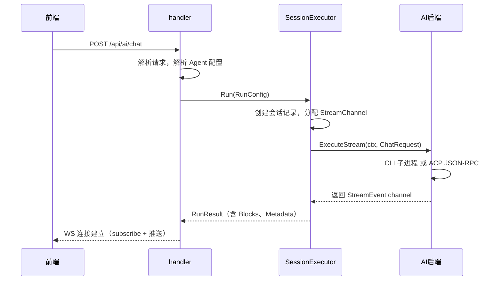
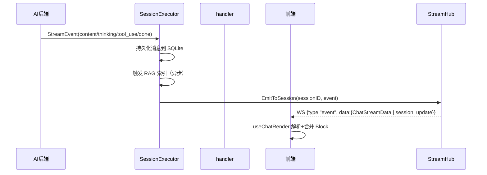
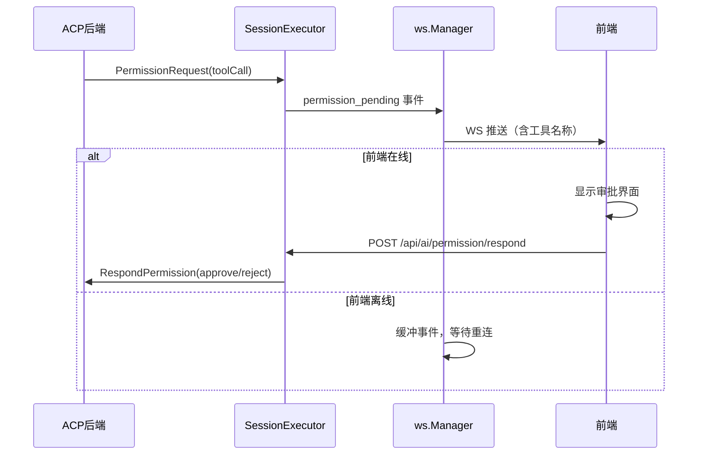

# 聊天流程

聊天是 ClawBench 的核心业务——用户发送一条消息，系统启动对应的 AI 后端执行，流式输出结果到前端，同时持久化到 SQLite 并建立 RAG 索引。会话完成后自动生成摘要，定时任务的执行结果可以续接为交互式对话。ACP 后端还支持模式切换、计划审批和权限管理，让 AI 从纯文本输出扩展为结构化的交互体验。这条链路贯穿了 handler、SessionExecutor、AI 后端、WebSocket 和前端五个层，是理解整个系统的入口。

## 流程图

### 请求链路：从用户发消息到 AI 开始执行

用户点击发送后，请求进入 handler，由 handler 解析出目标 Agent 和后端类型（CLI 或 ACP）；SessionExecutor 负责创建会话、管理运行时状态，然后将执行委托给 AI 后端。SessionExecutor 统一处理交互式聊天和定时任务执行两种模式，差异化行为（i18n 错误、取消原因）通过 RunConfig 控制；事件推送统一走 WebSocket StreamHub。

### WebSocket 推送链路：流式事件到前端渲染

AI 后端产出的事件经 WebSocket StreamHub 推送给已订阅该 session 的客户端（多客户端扇出）；同时触发 SessionExecutor 的增量持久化和 RAG 索引。会话完成后自动生成摘要——固定提取最后回答文本（`ExtractLastAnswerFromBlocks`，无需 AI 调用）。摘要结果通过 WebSocket `summary_update` 事件实时推送到前端。

### ACP 权限审批流程

ACP 后端的工具调用可能需要用户审批（如执行 shell 命令、写入文件）。系统通过 WebSocket 推送 `permission_pending` 事件，前端离线时缓冲事件等待重连。用户批准或拒绝后，前端调用 `/api/ai/permission/respond` 回传结果，系统将响应转发给 ACP 连接。未决的审批请求不会被会话切换/回合结束取消——权限保留到用户响应或 agent 连接死亡时自动清理，避免"审批永远失效"。

## 功能与设计要点

### 功能清单

- **消息发送与流式回复**：用户输入 prompt 后，系统选择对应的 AI Agent 执行并实时流式返回结果。这是系统的核心价值——让用户在移动端也能获得与桌面 CLI 等同的 AI 交互体验
- **多 Agent 选择**：用户可以切换不同的 AI 后端（Claude、Codebuddy、Kimi 等），每个 Agent 有独立的系统提示词、模型和思考深度配置。不同后端各有擅长，用户按需选择
- **消息持久化与历史回看**：所有聊天消息存入 SQLite，支持分页加载、搜索、归档。用户可以随时回看历史对话，归档的对话仍可被 RAG 检索，通过会话搜索恢复
- **排队机制**：同一会话的消息排队执行，前一条未完成时后续消息入队等待。防止并发冲突，保证消息顺序。排队消息在入队瞬间以 `queued=1` 写入 `chat_history`（含队列 ID），执行由 drain loop 统一从数据库按序出队（出队即翻 `queued=0` 成为普通会话记录）。drain 循环内置熔断：出队连续失败超过重试窗口（5×100ms≈500ms）时放弃队列、清理残留排队消息并广播 `queue_cancel`，再发送错误事件让会话离开 loading 态——避免数据库持续故障时会话永远卡在"加载中"且队列静默死亡。后端因会话已停止而出队消息时（`needs_start`），前端自动将消息重提交为新聊天而非静默丢失——`chatQueueSend` 封装了"排队→needs_start 重提交"的共享编排逻辑
- **文件上传与引用**：用户可以上传文件作为消息附件，AI 可以读取这些文件。附件支持行范围（`startLine/endLine`），prompt 前缀中文件路径附带行号信息（如 `path:10-20`），帮助 AI 聚焦于文件特定区域。降低了在移动端传递上下文的成本
- **引用提问**：选中聊天或文件中的文本片段，以引用形式发送新问题。减少上下文描述的开销，尤其适合代码审查场景
- **快捷发送**：预设常用 prompt 通过输入栏行尾图标一键加入输入框（点击注入后可直接编辑再发送），避免重复输入。移动端打字成本高，这个功能显著降低了常用操作的交互开销
- **聊天自动摘要**：会话完成后自动为助手消息生成摘要，通过 WebSocket 实时推送（含 SummaryCards 结构化卡片元数据）。`summarizeMessage` 统一调度入口固定提取最后回答文本（`ExtractLastAnswerFromBlocks`，无需 AI 调用）。前端 `SummaryToggle` 组件提供按钮模式（聊天中切换）和标签页模式（任务执行详情中切换）。用户快速浏览 AI 回复的核心内容，不必逐行阅读长输出
- **推荐回复**：会话完成后自动生成一条下一步建议（`chat_recommendation` WS 事件），前端在输入框上方展示推荐横幅，用户可一键采纳或忽略。推荐由 LLM 基于 stable/rolling 分离的 payload 生成，支持 prompt caching。详见 [推荐回复](../features/chat-recommendation.md)
- **续接对话**：定时任务的执行结果可以续接为新的交互式聊天会话，继承原始会话的消息、摘要和 `external_session_id`。用户看到定时任务结果后想继续追问，无需从头描述上下文
- **消息详情弹窗**：点击助手消息可查看元数据弹窗，展示消息的后端原生会话 ID（`external_session_id` 注入 response metadata）、时间、token 等上下文信息，帮助用户理解消息来源与消耗。弹窗字段与上下文面板对齐——从 `chat_metadata` 读取缓存的 _meta 扩展信息（缓存命中/额度/追踪标识等）
- **ACP 模式切换**：ACP 后端支持多种工作模式（如 code、ask、architect），用户可在聊天中切换，切换即时生效并持久化。不同模式适合不同任务，用户按需选择
- **ACP 权限审批**：ACP 后端请求工具调用审批时，系统推送通知提醒用户，避免因未审批而阻塞执行
- **ACP 计划模式**：ACP 后端在执行前展示计划（步骤列表），用户可以跟踪进度。让用户理解 AI 将要做什么，而非只能看到结果
- **thinking 惰性加载**：流结束后 thinking Block 被拆分到独立的 `chat_thinking` 表，前端只显示缩略 Block。用户展开时才通过 `GET /api/ai/chat/thinking` 按需加载全文——减少长思考过程对聊天视图的视觉占用
- **工具调用耗时展示**：每个工具调用的执行时长追踪并持久化到 `chat_tool_calls.duration_ms`，前端在工具详情抽屉中展示耗时。用户可以理解 AI 各步骤的时间分布，判断"哪个工具最慢"
- **@chatsearch / @task 命令注入**：用户消息以 `@chatsearch ` 或 `@task ` 开头时，后端 `processAtCommand()`（`internal/handler/at_command.go`）检测并替换为模板指令——`@chatsearch` 注入 `rag search` CLI 用法（模板含 `{{CLAWBENCH_BIN}}`、`{{PROJECT_PATH}}`、`{{SESSION_ID}}` 等占位符），`@task` 注入 `task` CLI 用法。前端 `extractAtCommand()`（`web/src/utils/contentBlocks.ts`）检测相同前缀，将命令部分渲染为紫色徽章（``），`ChatInputBar.vue` 提供自动补全
- **用户消息索引导航**：聊天消息列表支持 Ctrl+Up/Down 在用户消息间快速跳转，跳转时自动跨分页加载并高亮目标消息。用户消息索引按钮在输入栏左侧，点击后弹出索引面板，列出所有用户消息的摘要和时间戳，方便在长对话中定位
- **浮动滚动按钮**：消息列表根据滚动方向显示上/下浮动按钮，自动隐藏，帮助快速导航长对话。按钮在用户停止滚动后短暂停留再消失，避免频繁闪烁
- **触摸拖拽防抖**：用户触摸消息列表时暂停自动滚动，防止用户阅读历史消息时被 AI 新输出推走。滚动跟随由统一状态机（`scrollState.ts`）判定——用户滚动（含惯性 fling）期间 `force` 不再无条件钉底，改为挂起跟随（pendingFollow），待滚动停止后恢复；滚动停止检测替代固定时间窗口，避免触屏惯性滚动把视图拉回/弹回
- **滚动保持机制**：滚动位置只在"当前会话内往上翻旧内容"时保留——同会话中途加载旧消息用数组替换锚定（不跳屏），流式新内容到达时不打断阅读位置；会话之间切换、项目切换永远滚到底部（Tab 切换靠 v-show 保留 DOM，浏览器原生保留 scrollTop，零代码）。发送消息后停止滚动则无条件拉回底部。首屏打开与冷启动一致，避免"切回会话落在错误位置"的困惑
- **按项目恢复上次会话**：每个项目独立记住最近打开的会话（localStorage，key 含项目根路径），进入项目时自动恢复上次会话，失效（会话被删除/归档）时自动回退默认逻辑（新建或打开最近会话）。多项目并行工作时，切换项目不必手动找回上次看到哪
- **输入草稿与会话快照**：切换会话时，未发送的输入文本（按会话草稿缓存）、已选附件和引用提问会被快照保存（`useChatContext` 的 `snapshotAttachments`/`restoreAttachments`），切回时自动恢复；消息发送或附件清理后丢弃对应快照，避免发送后残留脏数据
- **"全部加载"提示**：加载完所有历史消息后短暂显示"全部加载"提示，让用户明确知道已无更多历史内容，避免反复上拉触发加载
- **输入栏功能按钮**：聊天输入栏集成多个功能按钮——消息索引、ACP 同步、会话搜索、创建会话（点 `+` 总是打开 Agent 选择器，由用户明确选择后端而非一键创建）、归档（带确认对话框）、自动语音、上下文用量弹窗。按钮按使用频率排列，避免输入栏过于拥挤
- **推荐回复横幅**：AI 回复完成后在输入栏上方展示推荐横幅，可展开/折叠。横幅不遮挡输入区域，折叠后仅显示一行摘要
- **快捷发送菜单**：空输入时点击发送按钮弹出快捷菜单，选择预设 prompt 一键发送。与已有快捷发送功能互补，提供更轻量的入口
- **ACP 斜杠命令自动补全**：ACP 后端的斜杠命令在输入栏自动补全，用户输入 `/` 时弹出匹配的命令列表，减少记忆负担
- **上下文用量弹窗**：显示 token 使用详情（输入/输出/缓存），帮助用户了解当前会话的上下文消耗情况，决定是否需要压缩或新建会话。流式过程中扩展字段（缓存读/缓存命中/信用额度/分类用量）采用"有值覆盖"而非"全量快照"语义——CodeBuddy 一轮内推送多个 usage_update 通知、各带一部分扩展字段，有值覆盖保证收到部分通知时面板不闪回最简视图
- **ACP _meta 扩展元信息展示**：ACP Agent 通过 `_meta` 字段携带异构的 token/成本/追踪信息（CodeBuddy 的 OpenAI 风格 usage + cache split + credit、Claude/Codex 的 `_meta.quota` 分项、OpenCode 走标准 usage_update），后端按 agent 适配器解析并归一化，持久化到 `chat_metadata` 扩展列（缓存读/写 token、thought token、cache 分类、credit、request/trace ID、模型名、stop reason 等）。前端上下文面板、Token 明细与消息详情弹窗集中展示——缓存命中行与缓存读同值但标签区分，另展示缓存命中率（hit/(hit+miss)）。让用户理解每次 AI 回复的真实模型、用量分项与成本，而不只是一个大致的 token 数
- **Compact 按钮**：上下文使用率 ≥ 75% 时显示 Compact 按钮，一键发送 `/compact` 命令压缩上下文。降低用户手动管理上下文的认知负担
- **模式长按切换自动审批**：长按模式芯片切换自动审批，无需每次工具调用都手动确认。适合信任 AI 操作的进阶用户
- **会话重置**：AI 错误/警告横幅上的"重置会话"按钮（`POST /api/ai/session/reset`）解决 ACP 会话卡死——当一轮交互以"工具已批准但从未执行"的悬挂状态结束时，后续 prompt 会毫秒级空响应。重置**刻意保留外部会话 ID 映射**，只回收卡死的 agent 进程，下一次 prompt 通过 ResumeSession 重新附着同一 agent 会话，对话上下文与聊天历史完整保留；前端确认后自动重发最后一条用户消息
- **完成弹窗**：会话或定时任务完成时，若聊天界面不在前台（用户在看其他 Tab 或当前会话不是目标会话），顶部弹出 Android 通知风格的完成卡片——展示摘要全文、项目名/路径、最近一条用户消息和 agent 后端图标，内置快捷输入框可直接追问，标记已读按钮和跳转按钮（跳转会话/任务执行详情）。发送追问或点标记已读会清空该会话的未读徽标（`POST /api/ai/chat/read`，支持 `project_path` 参数使外部项目弹窗也能通过归属校验）；点击空白处关闭弹窗（展示不足 1 秒时防误触忽略）；发送成功弹出确认气泡。用户消息以引用式样块展示（左侧 accent 竖线 + 淡色底），点击可展开完整内容。多个完成事件排队依次展示，取代了旧的会话结束 Toast 气泡。详见[完成通知弹窗](../features/completion-popup.md)。用户专注其他工作区时也能感知 AI 已完成并直接跟进，无需时刻盯着聊天窗口
- **未读自动清除**：当前会话执行结束（completed/cancelled）自动标记已读，切回前台时也自动标记当前会话已读——未读徽标只为"用户没在看"的会话保留（后台完成时跳过 mark-read，把未读留给悬浮窗/Live Updates 展示），用户回到该会话后徽标立即消失，无需手动操作
- **错误码透传与展示**：AI 后端返回的错误携带结构化错误码（`error_code`/`http_status`/`error_source`），从 StreamEvent 透传到前端 warning/error 卡片——错误码后缀（`[code xxx]`/`[HTTP xxx]`）+ 来源 chip（agent/clawbench/network）标注错误出处。ACP 后端把上游错误归类为 refusal 时（如钉住过期模型），系统识别 `stopReason=refusal` 发出 ReasonRefused 警告事件而非误判为"无内容返回"，refused 加入可重置会话的原因集合。用户能一眼判断"是 Agent 的问题还是平台/网络的问题"，而不是面对一条笼统的失败提示
- **Mermaid SVG 灯箱导航**：Mermaid 渲染后的 SVG 图表加入图片灯箱导航序列，与 `` 按文档顺序排列，支持 prev/next 切换浏览所有视觉媒体

### 设计要点

- **排队消息持久化到 DB**：排队消息在入队时即写入 `chat_history`（`queued=1` 标记 + 队列 ID），由 drain loop 原子出队（写锁事务下翻转 `queued=0` 为普通会话记录）。相比纯内存队列，排队状态有数据库权威记录——历史加载、取消队列（按 `queue_id` 删除）、前端乐观 pending 气泡都以 `queued` 状态为准对齐，drain 循环与前端不会出现"消息已发但队列不知情"的分歧
- **归档保留 RAG 可搜索性**：归档的会话和消息标记 `archived=1` 而非物理删除，RAG 索引仍可检索到，用户可通过会话搜索恢复归档的会话——历史知识不应因用户整理而丢失
- **单 WS 通道统一推送**：聊天内容（`content/thinking/tool_use` 等 `ChatStreamData` 子事件）和系统事件（`session_update`/`task_update`/`summary_update`/`permission_pending`）共用 `/api/ai/events/ws`，由 `StreamHub`（`internal/ws/stream_hub.go`）做会话级扇出。同一 session 可被多客户端同时订阅；客户端通过 `subscribe` 消息加入，`unsubscribe` 退出
- **前端 Block 合并**：连续的 text/thinking 事件在 `AccumulateBlock` 中向后搜索同类型块进行合并，tool_use 作为自然边界——减少 DOM 更新频率，提升渲染性能。ACP 子代理完整重放产生的重复文本块通过前缀匹配去重，避免子代理回放时在 UI 中出现重复内容
- **自动摘要固定提取结论**：`summarizeMessage` 统一调度入口从消息 Block 中直接提取最后回答文本（`ExtractLastAnswerFromBlocks`，同步、无 AI 调用），聊天与定时任务行为一致。摘要结果存入统一的 `summaries` 表（含 `summary_cards` 列），通过 WS `summary_update` 事件推送（含 SummaryCards 结构化卡片元数据）——摘要生成与聊天流解耦，不影响流式体验
- **SessionExecutor 统一执行引擎**：交互式聊天和定时任务执行共用 `SessionExecutor`，差异化行为通过 `RunConfig.Mode` 控制（ModeInteractive / ModeScheduled）。消除了 handler 和 scheduler 中的重复执行逻辑
- **分叉上下文仅截断工具输出**：`buildForkContext` 从原始消息读取（`GetMessagesBySessionIDRaw`——不走会剥离已摘要 assistant 回复 content blocks 的路径），仅截断工具调用的输出（`truncateRunes` 截断到 500 runes），避免工具输出过长撑爆分叉会话的上下文窗口。分叉标题由源会话标题 + emoji 前缀派生
- **触摸防抖避免阅读干扰**：用户在阅读历史消息时，自动滚动应暂停，等用户停止触摸后恢复。这是移动端场景的关键体验——AI 持续输出时用户常需要回看上方内容，自动滚动会打断阅读。防抖机制通过检测触摸事件暂停自动滚动，在触摸结束后延迟恢复，平衡了"实时追踪新输出"和"自由回看历史"两个需求
