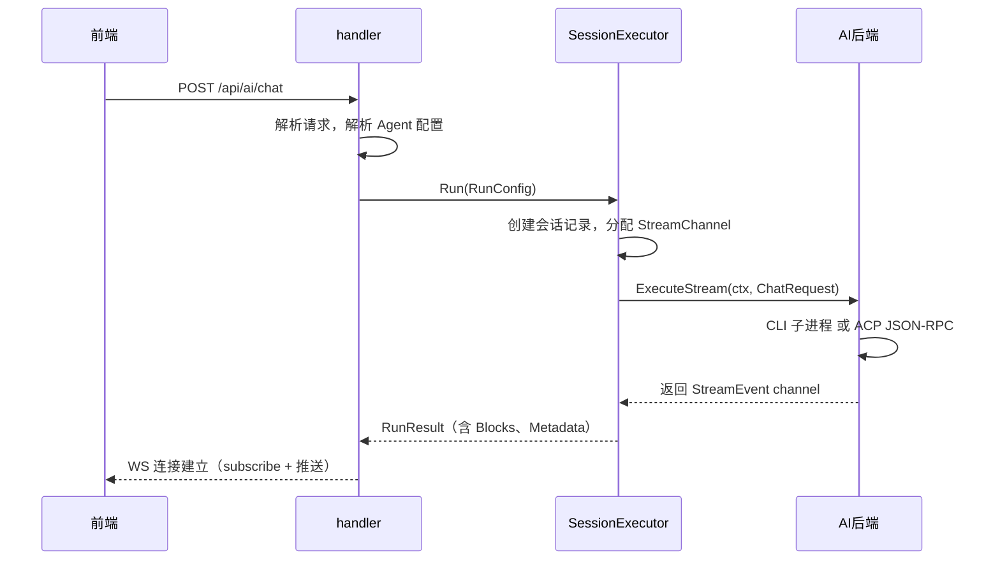
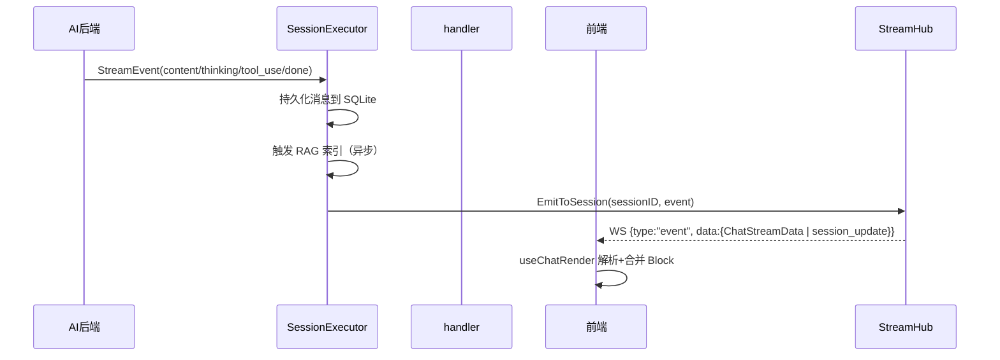
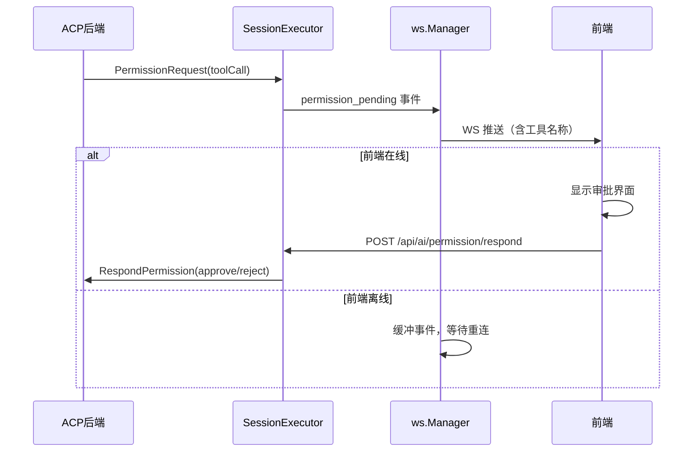

# 聊天流程

聊天是 ClawBench 的核心业务——用户发送一条消息，系统启动对应的 AI 后端执行，流式输出结果到前端，同时持久化到 SQLite 并建立 RAG 索引。会话完成后自动生成摘要，定时任务的执行结果可以续接为交互式对话。ACP 后端还支持模式切换、计划审批和权限管理，让 AI 从纯文本输出扩展为结构化的交互体验。这条链路贯穿了 handler、SessionExecutor、AI 后端、WebSocket 和前端五个层，是理解整个系统的入口。

## 流程图

### 请求链路：从用户发消息到 AI 开始执行

用户点击发送后，请求进入 handler，由 handler 解析出目标 Agent 和后端类型（CLI 或 ACP）；SessionExecutor 负责创建会话、管理运行时状态，然后将执行委托给 AI 后端。SessionExecutor 统一处理交互式聊天和定时任务执行两种模式，差异化行为（i18n 错误、取消原因）通过 RunConfig 控制；事件推送统一走 WebSocket StreamHub。

### WebSocket 推送链路：流式事件到前端渲染

AI 后端产出的事件经 WebSocket StreamHub 推送给已订阅该 session 的客户端（多客户端扇出）；同时触发 SessionExecutor 的增量持久化和 RAG 索引。会话完成后自动生成摘要——固定提取最后回答文本（`ExtractLastAnswerFromBlocks`，无需 AI 调用）。摘要结果通过 WebSocket `summary_update` 事件实时推送到前端。

### ACP 权限审批流程

ACP 后端的工具调用可能需要用户审批（如执行 shell 命令、写入文件）。系统通过 WebSocket 推送 `permission_pending` 事件，前端离线时缓冲事件等待重连。用户批准或拒绝后，前端调用 `/api/ai/permission/respond` 回传结果，系统将响应转发给 ACP 连接。

## 功能与设计要点

### 功能清单

- **消息发送与流式回复**：用户输入 prompt 后，系统选择对应的 AI Agent 执行并实时流式返回结果。这是系统的核心价值——让用户在移动端也能获得与桌面 CLI 等同的 AI 交互体验
- **多 Agent 选择**：用户可以切换不同的 AI 后端（Claude、Codebuddy、Kimi 等），每个 Agent 有独立的系统提示词、模型和思考深度配置。不同后端各有擅长，用户按需选择
- **消息持久化与历史回看**：所有聊天消息存入 SQLite，支持分页加载、搜索、归档。用户可以随时回看历史对话，归档的对话仍可被 RAG 检索，通过会话搜索恢复
- **排队机制**：同一会话的消息排队执行，前一条未完成时后续消息入队等待。防止并发冲突，保证消息顺序
- **文件上传与引用**：用户可以上传文件作为消息附件，AI 可以读取这些文件。附件支持行范围（`startLine/endLine`），prompt 前缀中文件路径附带行号信息（如 `path:10-20`），帮助 AI 聚焦于文件特定区域。降低了在移动端传递上下文的成本
- **引用提问**：选中聊天或文件中的文本片段，以引用形式发送新问题。减少上下文描述的开销，尤其适合代码审查场景
- **快捷发送**：预设常用 prompt 一键发送，避免重复输入。移动端打字成本高，这个功能显著降低了常用操作的交互开销
- **聊天自动摘要**：会话完成后自动为助手消息生成摘要，通过 WebSocket 实时推送（含 SummaryCards 结构化卡片元数据）。`summarizeTarget` 统一调度入口固定提取最后回答文本（`ExtractLastAnswerFromBlocks`，无需 AI 调用）。前端 `SummaryToggle` 组件提供按钮模式（聊天中切换）和标签页模式（任务执行详情中切换）。用户快速浏览 AI 回复的核心内容，不必逐行阅读长输出
- **续接对话**：定时任务的执行结果可以续接为新的交互式聊天会话，继承原始会话的消息、摘要和 `external_session_id`。用户看到定时任务结果后想继续追问，无需从头描述上下文
- **ACP 模式切换**：ACP 后端支持多种工作模式（如 code、ask、architect），用户可在聊天中切换，切换即时生效并持久化。不同模式适合不同任务，用户按需选择
- **ACP 权限审批**：ACP 后端请求工具调用审批时，系统推送通知提醒用户，避免因未审批而阻塞执行
- **ACP 计划模式**：ACP 后端在执行前展示计划（步骤列表），用户可以跟踪进度。让用户理解 AI 将要做什么，而非只能看到结果
- **thinking 惰性加载**：流结束后 thinking Block 被拆分到独立的 `chat_thinking` 表，前端只显示缩略 Block。用户展开时才通过 `GET /api/ai/chat/thinking` 按需加载全文——减少长思考过程对聊天视图的视觉占用
- **工具调用耗时展示**：每个工具调用的执行时长追踪并持久化到 `chat_tool_calls.duration_ms`，前端在工具详情抽屉中展示耗时。用户可以理解 AI 各步骤的时间分布，判断"哪个工具最慢"
- **@chatsearch / @task 命令注入**：用户消息以 `@chatsearch ` 或 `@task ` 开头时，后端 `processAtCommand()`（`internal/handler/at_command.go`）检测并替换为模板指令——`@chatsearch` 注入 `rag search` CLI 用法（模板含 `{{CLAWBENCH_BIN}}`、`{{PROJECT_PATH}}`、`{{SESSION_ID}}` 等占位符），`@task` 注入 `task` CLI 用法。前端 `extractAtCommand()`（`web/src/utils/contentBlocks.ts`）检测相同前缀，将命令部分渲染为紫色徽章（``），`ChatInputBar.vue` 提供自动补全

### 设计要点

- **消息排队在内存中**：排队消息存储在内存中，重启丢失——这是有意为之的权衡，排队消息本质是待执行的瞬时指令，不需要跨重启持久化
- **归档保留 RAG 可搜索性**：归档的会话和消息标记 `archived=1` 而非物理删除，RAG 索引仍可检索到，用户可通过会话搜索恢复归档的会话——历史知识不应因用户整理而丢失
- **单 WS 通道统一推送**：聊天内容（`content/thinking/tool_use` 等 `ChatStreamData` 子事件）和系统事件（`session_update`/`task_update`/`summary_update`/`permission_pending`）共用 `/api/ai/events/ws`，由 `StreamHub`（`internal/ws/stream_hub.go`）做会话级扇出。同一 session 可被多客户端同时订阅；客户端通过 `subscribe` 消息加入，`unsubscribe` 退出
- **前端 Block 合并**：连续的 text/thinking 事件在 `AccumulateBlock` 中向后搜索同类型块进行合并，tool_use 作为自然边界——减少 DOM 更新频率，提升渲染性能。ACP 子代理完整重放产生的重复文本块通过前缀匹配去重，避免子代理回放时在 UI 中出现重复内容
- **自动摘要固定提取结论**：`summarizeTarget` 统一调度入口从消息 Block 中直接提取最后回答文本（`ExtractLastAnswerFromBlocks`，同步、无 AI 调用），聊天与定时任务行为一致。摘要结果存入统一的 `summaries` 表（含 `summary_cards` 列），通过 WS `summary_update` 事件推送（含 SummaryCards 结构化卡片元数据）——摘要生成与聊天流解耦，不影响流式体验
- **SessionExecutor 统一执行引擎**：交互式聊天和定时任务执行共用 `SessionExecutor`，差异化行为通过 `RunConfig.Mode` 控制（ModeInteractive / ModeScheduled）。消除了 handler 和 scheduler 中的重复执行逻辑
- **分叉上下文仅截断工具输出**：`buildForkContext` 不再对每条消息设置全局长度限制（`maxPerMsg`/`maxTotal` 已移除），改为仅截断工具调用的输出（`truncateRunes` 截断到 500 runes），避免工具输出过长撑爆分叉会话的上下文窗口。分叉标题简化为源会话标题 + emoji 前缀，不再从消息内容提取
