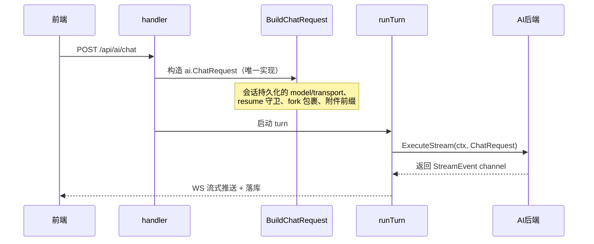
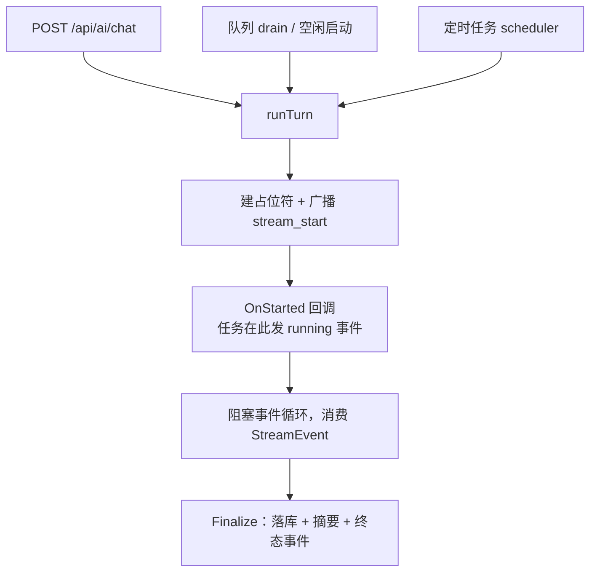
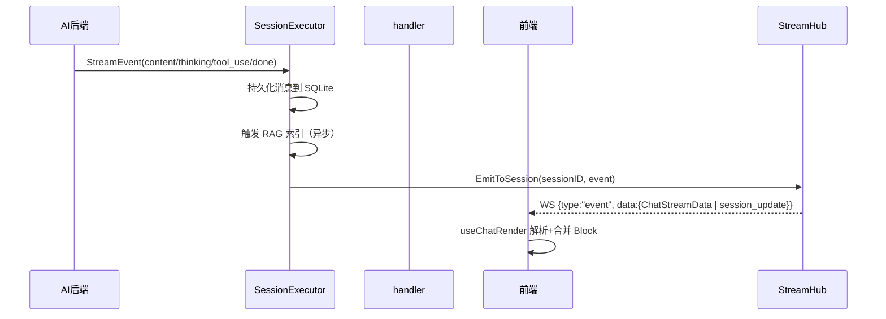
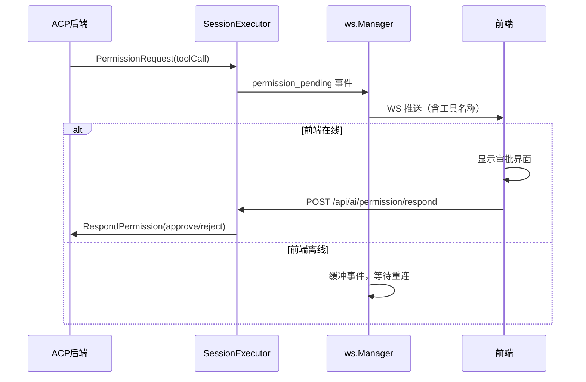
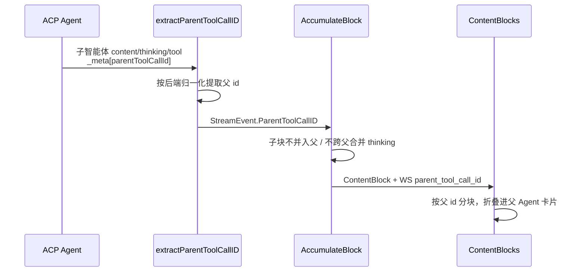

# 聊天流程

聊天是 ClawBench 的核心业务——用户发送一条消息，系统启动对应的 AI 后端执行，流式输出结果到前端，同时持久化到 SQLite 并建立 RAG 索引。会话完成后自动生成摘要，任务的执行结果可以续接为交互式对话。ACP 后端还支持模式切换、计划审批和权限管理，让 AI 从纯文本输出扩展为结构化的交互体验。这条链路贯穿了 handler、SessionExecutor、AI 后端、WebSocket 和前端五个层，是理解整个系统的入口。

## 流程图

### 请求链路：从用户发消息到 AI 开始执行

```mermaid
sequenceDiagram
    participant 前端
    participant handler
    participant BuildChatRequest
    participant runTurn
    participant AI后端

    前端->>handler: POST /api/ai/chat
    handler->>BuildChatRequest: 构造 ai.ChatRequest（唯一实现）
    Note over BuildChatRequest: 会话持久化的 model/transport、<br/>resume 守卫、fork 包裹、附件前缀
    handler->>runTurn: 启动 turn
    runTurn->>AI后端: ExecuteStream(ctx, ChatRequest)
    AI后端-->>runTurn: 返回 StreamEvent channel
    runTurn-->>前端: WS 流式推送 + 落库
```

用户点击发送后，请求进入 handler，由 handler 解析出目标 Agent 和后端类型（CLI 或 ACP）；`runTurn` 负责编排单个 AI 回合，内部的 `SessionExecutor` 持有会话运行时状态并把执行委托给 AI 后端。**"用户消息 → ai.ChatRequest"只有一份实现**：直发路径（HTTP handler）与排队路径（队列 drain、钉钉/飞书）曾各写一份并漂移成 5 处不一致——resume 守卫、会话持久化的 model 与 transport、fork 上下文格式、非 block 内容解包——导致同一条消息在"直接发送"与"排队发送"下行为不同（排队路径会把 CLI 从未见过的会话 ID 传下去造成上下文失忆）。现在两者共用同一实现，并有一条对比测试锁住两条路径对同一会话的构造结果一致。

### 唯一 turn 实现：三入口共用

```mermaid
flowchart TD
    A[POST /api/ai/chat] --> D[runTurn]
    B[队列 drain / 空闲启动] --> D
    C[定时任务 scheduler] --> D
    D --> E[建占位符 + 广播 stream_start]
    E --> F[OnStarted 回调<br/>任务在此发 running 事件]
    F --> G[阻塞事件循环，消费 StreamEvent]
    G --> H[Finalize：落库 + 摘要 + 终态事件]
```

三条入口此前各有一份执行实现且已互相漂移（入队自愈只存在于 queue 路径，导致前端普通发送的消息可能永久滞留队列）。现在共用同一实现，差异以显式参数保留：错误文案本地化由调用方提供、Finalize 时是否 drain 事件通道按调用方保留原行为、取消/失败/崩溃分支由 scheduler 自己持有。`OnStarted` 回调是为了让任务在"executor 已建好、占位符存在、`stream_start` 已广播、但事件循环尚未开始"这个确切时刻发出 running 事件——此前 running 事件在阻塞调用返回后才发，实际顺序成了 started → 整个任务跑完 → running → completed，钉钉/飞书推送与 Android 离线事件都按此顺序回放，等于 running 通知完全失效。

### WebSocket 推送链路：流式事件到前端渲染

```mermaid
sequenceDiagram
    participant AI后端
    participant SessionExecutor
    participant handler
    participant 前端

    AI后端->>SessionExecutor: StreamEvent(content/thinking/tool_use/done)
    SessionExecutor->>SessionExecutor: 持久化消息到 SQLite
    SessionExecutor->>SessionExecutor: 触发 RAG 索引（异步）
    SessionExecutor->>StreamHub: EmitToSession(sessionID, event)
    StreamHub-->>前端: WS {type:"event", data:{ChatStreamData | session_update}}
    前端->>前端: useChatRender 解析+合并 Block
```

AI 后端产出的事件经 WebSocket StreamHub 推送给已订阅该 session 的客户端（多客户端扇出）；同时触发 SessionExecutor 的增量持久化和 RAG 索引。会话完成后自动生成摘要——固定提取最后回答文本（`ExtractLastAnswerFromBlocks`，无需 AI 调用）。摘要结果通过 WebSocket `summary_update` 事件实时推送到前端。

### ACP 权限审批流程

```mermaid
sequenceDiagram
    participant ACP后端
    participant SessionExecutor
    participant ws.Manager
    participant 前端

    ACP后端->>SessionExecutor: PermissionRequest(toolCall)
    SessionExecutor->>ws.Manager: permission_pending 事件
    ws.Manager->>前端: WS 推送（含工具名称）
    alt 前端在线
        前端->>前端: 显示审批界面
        前端->>SessionExecutor: POST /api/ai/permission/respond
        SessionExecutor->>ACP后端: RespondPermission(approve/reject)
    else 前端离线
        ws.Manager->>ws.Manager: 缓冲事件，等待重连
    end
```

ACP 后端的工具调用可能需要用户审批（如执行 shell 命令、写入文件）。系统通过 WebSocket 推送 `permission_pending` 事件，前端离线时缓冲事件等待重连。用户批准或拒绝后，前端调用 `/api/ai/permission/respond` 回传结果，系统将响应转发给 ACP 连接。未决的审批请求不会被会话切换/回合结束取消——权限保留到用户响应或 agent 连接死亡时自动清理，避免"审批永远失效"。

### 子智能体内容分组链路

```mermaid
sequenceDiagram
    participant Agent as ACP Agent
    participant 后端 as extractParentToolCallID
    participant 累加 as AccumulateBlock
    participant 前端 as ContentBlocks

    Agent->>后端: 子智能体 content/thinking/tool<br/>_meta[parentToolCallId]
    后端->>后端: 按后端归一化提取父 id
    后端->>累加: StreamEvent.ParentToolCallID
    累加->>累加: 子块不并入父 / 不跨父合并 thinking
    累加->>前端: ContentBlock + WS parent_tool_call_id
    前端->>前端: 按父 id 分块，折叠进父 Agent 卡片
```

父 Agent 卡片就是那条发起子智能体的工具调用（前端渲染为 Agent 胶囊）。子智能体产出的 thinking/text/tool 全部收进同一张卡片，折叠时只显示步数摘要、展开才挂载并递归复用主渲染组件——这样一条"派发多个子智能体并行探索"的长轨迹不会淹没主对话。归属靠 Agent 在 `_meta` 上打的父工具调用 id 精确判定，不靠时间窗口推断。

## 功能与设计要点

### 功能清单

- **消息发送与流式回复**：用户输入 prompt 后，系统选择对应的 AI Agent 执行并实时流式返回结果。这是系统的核心价值——让用户在移动端也能获得与桌面 CLI 等同的 AI 交互体验
- **多 Agent 选择**：用户可以切换不同的 AI 后端（Claude、Codebuddy、Kimi 等），每个 Agent 有独立的系统提示词、模型和思考深度配置。不同后端各有擅长，用户按需选择
- **消息持久化与历史回看**：所有聊天消息存入 SQLite，支持分页加载、搜索、归档。用户可以随时回看历史对话，归档的对话仍可被 RAG 检索，通过会话搜索恢复
- **排队机制**：同一会话的消息排队执行，前一条未完成时后续消息入队等待。防止并发冲突，保证消息顺序。**排队消息有独立表 `queued_messages`**：入队只写该表（不落 `chat_history`），直到 drain loop 出队时才在同一事务内 `DELETE` 队列行 + `INSERT` 历史行（"出队才落库"）。这样历史行的 DB id 顺序恒等于对话顺序，前端不再需要维护"回复锚定"（`parentQueueId` 动态解父链、`anchorRepliesToQuestions` 等）——锚定机制整体删除，排队消息改由独立面板渲染、不进对话数组。**面板收起态也要能看出排的是什么**：头部拆成「标题 + 计数徽章 + 下一条预览」三段，预览取队列头部（下一条将出队的消息）、跟随队列变化自动前进；纯附件条目回退为附件名。此前收起态只有「排队中 · N」一行字，不展开就不知道排了什么。drain 循环内置熔断：出队连续失败超过重试窗口（5×100ms≈500ms）时放弃队列、清理残留排队消息并广播 `queue_cancel`，再发送错误事件让会话离开 loading 态——避免数据库持续故障时会话永远卡在"加载中"且队列静默死亡。后端因会话已停止而出队消息时（`needs_start`），前端自动将消息重提交为新聊天而非静默丢失——`chatQueueSend` 封装了"排队→needs_start 重提交"的共享编排逻辑。**每条排队消息答完即推送通知**：drain 循环在"上一轮干净完成且后面还有排队工作"时触发 `DrainConfig.OnTurnAnswered`，N 条消息恰好 N 条通知（N-1 条中途 + 1 条终态），不再等整队列排空才推最后一条
- **文件上传与引用**：用户可以上传文件作为消息附件，AI 可以读取这些文件。附件支持行范围（`startLine/endLine`），prompt 前缀中文件路径附带行号信息（如 `path:10-20`），帮助 AI 聚焦于文件特定区域。降低了在移动端传递上下文的成本
- **URL 附件（外部链接）**：附件条目除本地文件外还可表示**外部地址**（`kind=url`，如引用的 GitHub issue/PR）——chip 显示 `owner/repo#123` 人类可读标签。此类条目**不参与文件系统校验**（不 `os.Stat`、不落 `Files`，否则会 404），但地址本身必须以 `[Referenced external link: <url>]` 单行前缀注入 prompt——跳过前缀注入会让 AI 完全不知道被引用的条目是什么，而把标签当作 `[User uploaded ...]` 本地路径注入则会让 AI 去找一个不存在的文件。安全性上仅接受 http/https，拒绝 `javascript:`/`data:` 等会被持久化并重新渲染为 `href` 的协议；为防伪造附件标签（其他代码会**任意位置**扫描 `[Current file` / `[User uploaded`），URL 校验还拒绝空白与方括号——真实 URL 必须百分号编码这些字符。这让"引用远端资源问 AI"与"引用本地文件"走同一条附件通道，而不必为 URL 单开一种消息形态
- **附件 prompt 注入必须走共享分类器**：共有**三个** prompt 构建点——`POST /api/ai/chat`（`handler.AIChat`）、队列 drain（`handler.buildChatRequestFromQueue`）、队列端点空闲时启动的独立执行引擎（`service.LaunchSessionExecution` → `executeStreamRunShared`）。三者分属 `handler` 与 `service` 两个包且**不能互相 import**（handler 已 import service），所以分类与注入收敛在 `internal/model/attachment_prompt.go`：`ClassifyAttachments` / `ApplyAttachmentPrefixes` / `FileEntryLabel` / `HasAttachmentEntries`。**新增附件类型或新增 prompt 构建路径时必须复用这些函数**，不要再写第二份循环——历史上正是因为三处各写一份，URL 附件在其中两处被静默丢弃（一处 `continue` 跳过、一处当成假本地文件、一处连 `Files` 都没传）。`service.LaunchConfig.Files` 必须随每次执行传递（含 drain 循环逐条替换为 `msg.Files`，否则上一轮的附件会串到下一轮）。新增前缀必须同步登记到 `clientInjectedStripRules`（引用 `model.ReferencedLinkPrefix` 以免漂移），否则会被误当作人类输入参与会话标题推导
- **引用提问**：选中聊天或文件中的文本片段，以引用形式发送新问题。减少上下文描述的开销，尤其适合代码审查场景。**附件写入延后到提交**：FileHeader 与 forge 详情页的「引用对话」入口打开对话框时只记录待引用内容（在栏内渲染只读 chip 预览），直到用户点击提交才把附件真正放进聊天上下文——因为输入框的 chip 正是从模块级单例 `useChatContext().attachedFiles` 渲染的，若在打开瞬间就写入，则用户取消对话框后附件会残留在主输入框且无法消除。发送路径必须在 `sendMessage` 之前提交附件，否则输入组件在首个 `await` 前同步抓取的 `attachedFiles` 会漏掉它
- **引用统一为结构化附件（`kind=quote`）**：引用不再是"烘焙进消息文本的围栏块"，而是与本地文件、外部链接并列的**结构化附件条目**（`FileEntry{Kind:"quote", ID, Text, Note, Language, Source}`），复用既有 files 通道与无 schema 的 `chat_history.files` blob，无需迁移。五个入口——聊天划词、消息「引用」按钮、文件浏览器、议题/PR 详情、CI 流水线详情——统一为**同一张引用卡片**（输入 chip 与已发送气泡共用 `QuoteCard.vue`），点「+」只生成一张卡片，不再把原文注入输入框文本。引用内容与批注以**带序号的信封**注入 prompt（`[Quote i/n] <label>` + 可选 `[Note] <批注>` + 围栏代码块），`text` 为空（引用整个文件/议题）时**不渲染围栏**——否则会把"引用该文件"误表示为"内容是空的"。引用分支必须置于 `excludePaths` 之前（引用的 `Path` 是标签，可能与已附加文件同路径而被误排除），且新前缀必须登记进 `clientInjectedStripRules`。**附件不注入内容**（只注入 label/URL），所以不补这条 prompt 分支会让引用内容从 AI 视野静默消失。发送路径新增 `materializeQuotes` 单一转换点，直发与 enqueue 两条路径都携带引用卡片——enqueue 分支原先依赖引用已烘焙进 `inputText`，取消烘焙后会在会话繁忙时静默丢引用。批注发送后仍可改：`PATCH /api/ai/chat/quote` 按稳定 `quoteId` 定位（非数组下标，条目增删后会错位），会话内限定 + 拒绝 assistant 行 + 归档守卫。已知接受项：RAG 不索引纯引用消息；改批注不做跨端 WS 广播
- **快捷发送**：预设常用 prompt 通过输入栏行尾图标一键加入输入框（点击注入后可直接编辑再发送），避免重复输入。移动端打字成本高，这个功能显著降低了常用操作的交互开销
- **聊天自动摘要**：会话完成后自动为助手消息生成摘要，通过 WebSocket 实时推送（含 SummaryCards 结构化卡片元数据）。`summarizeMessage` 统一调度入口固定提取最后回答文本（`ExtractLastAnswerFromBlocks`，无需 AI 调用）。前端 `SummaryToggle` 组件提供按钮模式（聊天中切换）和标签页模式（任务执行详情中切换）。**消息展示模式**（`messageDisplayMode` 设置，默认 mixed）决定有摘要消息的默认呈现：混合模式下最近一条 AI 回复展示原文、其余展示摘要，摘要/原文模式则全局统一；单条消息仍可独立切换，切换逻辑用归一化后的模式加位置判断。摘要视图复用原回复的 warning/error 横幅。用户快速浏览 AI 回复的核心内容，不必逐行阅读长输出
- **推荐回复**：会话完成后自动生成一条下一步建议（`chat_recommendation` WS 事件），前端在输入框上方展示推荐横幅，用户可一键采纳或忽略。推荐由 LLM 基于 stable/rolling 分离的 payload 生成，支持 prompt caching。详见 [推荐回复](../features/chat-recommendation.md)
- **续接对话**：任务的执行结果可以续接为新的交互式聊天会话，继承原始会话的消息、摘要和 `external_session_id`。用户看到任务结果后想继续追问，无需从头描述上下文
- **异常终止自动续接**：会话因**进程崩溃（无终止事件）、本轮零产出、或后端报错**（backend_exit / parse_error / request_failed / refused / agent_no_run）而意外中断时，系统自动发一条本地化的「继续」并接着跑；聊天与任务两条路径都生效。**手动终止永不续接**——user / interrupt / cancel / disconnect / restart / panic / timeout / agent_init_timeout 以及建后端/起流的确定性早期失败都不触发，取消判定优先于一切。**部分产出不抑制续接**：长 agentic 任务跑到一半被杀时模型已产出大量叙述与工具调用，旧逻辑"有可读文本就不续接"会把未完成的工作误判为已完成，正是本功能要消除的手动操作。自动消息以真实用户气泡落库并广播（`AddChatMessage` + `user_message`），每次唯一 queueID——复用会让前端按 queueId 去重吞掉第 2/3 次续接。开关 `chat.auto_continue_enabled` 默认关，`chat.auto_continue_max_retries` 默认 3（`-1` 不限，服务端硬上限 50）
- **消息详情弹窗**：点击助手消息可查看元数据弹窗，展示消息的后端原生会话 ID（`external_session_id` 注入 response metadata）、时间、token 等上下文信息，帮助用户理解消息来源与消耗。弹窗字段与上下文面板对齐——从 `chat_metadata` 读取缓存的 _meta 扩展信息（缓存命中/额度/追踪标识等）
- **ACP 模式切换**：ACP 后端支持多种工作模式（如 code、ask、architect），用户可在聊天中切换，切换即时生效并持久化。不同模式适合不同任务，用户按需选择
- **ACP 权限审批**：ACP 后端请求工具调用审批时，系统推送通知提醒用户，避免因未审批而阻塞执行
- **ask-question 解析容错契约**：`<clawbench-ask-question>` 载荷的解析收敛到单一实现——Go 侧 `internal/askquestion`，前端 `web/src/utils/askQuestion.ts`（互为镜像，由 `internal/askquestion/testdata/parity_corpus.json` 双向固化）。此前有五份独立实现且判据不一致，最严重的后果是**静默丢内容**：检测用宽松正则、解析用严格 DOMParser，两者分歧时调用方仍无条件剥离标签，于是问题既不成卡也不留文本，直接从对话里消失。现在的契约是：**检测即解析**（`isValidAskContent` 定义为「能解析出至少一个 item」）；**不可解析时剥离标签、把标签内文字交给 Markdown 渲染**（`Match.Parsed=false` 时 `Match.Fallback` 承载去壳后的正文），因此失败只会退化成正常排版的文字，既不丢内容也不露出原始标记。**标签内部是原生 Markdown**：一标签一问题，`**加粗**` 独立成行作标题，其余非列表行是问题正文，`- 选项` 为单选、`- [ ] 选项` 为多选，选项可用 ` — `/` – ` 接描述（模板现在**要求**每个选项都带描述——只有标题的选项很少足以支撑知情选择；多选示例也从逗号内联文本改为 Markdown 列表项，问题组与补充文字用空行分隔成独立段落）。**只接受这一种载荷**：旧的 XML 子元素格式（`<item>`/`<option>`/`<label>` 等）与标签内 JSON 均已不再解析，会退化成可见文字。**解析对模型实际写法高度容错**：列表符号接受 `-`/`*`/`+`/`－`、`1.`/`1)`/`1、`/`一、`，允许破折号后无空格（`-甲`）与全角空格缩进；复选框接受 `[ ]`/`[x]`/`［ ］`/`【 】`；标题接受 `**粗**`/`__粗__`/`# ~ ######`；所有放宽都配反向守卫（`-5`、`---`、`1.5`、`**粗**` 不会被误判成列表），误判即回落到 Markdown 渲染。同时：一个文本块内的**所有**标签都转换（实测 27% 的文本块含 2 个以上，旧实现只转最后一个、其余泄漏为原始 XML），并**合并为一张卡**；区间定界只认标准闭合标签 `</clawbench-ask-question>`，且不会把载荷自身文字里对该标签的提及误判为兄弟标签（围栏代码块、缩进示例、行内提及、引用块都已覆盖）。标记为列表项却解析不出选项时**整体判为解析失败**而非丢弃该项——否则该项会同时从卡片和可见文字里消失。旧标签名 `<ask-question>`（改名前的调用）**不再转卡片**，而是降级为可读 Markdown：标题变加粗行、正文变段落、每个 `<option>` 变列表项（`label — description`），而仅供解析器使用的 `<multi-select>` 字段被丢弃。此前它是静默损坏的：外层标签被剥离后内层文本交给 Markdown 渲染，DOMPurify 删掉未知 XML 元素却保留其文本节点，于是 `false` 这类字段值裸露给用户、且 label 与 description 因失去分隔符而粘连。实测生产库 431 个旧格式载荷中，旧行为在 68.5% 泄露 `false`/`true`、在 62.0% 丢失分隔符；降级渲染后 100% 可读且无字段泄露。TTS/推荐提示词同走该解析器，不可解析时只剥离标签、不朗读原始标记。可选补充见下方「交互式提问卡」——每个问题一张卡，选项可单选或多选，带可选的自由文本补充栏（多行 `textarea`：随内容自适应长高，6 行封顶后框内滚动；Enter 换行、提交仍走按钮）、"推荐"按钮（反向询问 AI 建议选哪个）和"提交"按钮。用户提交后，所选标签（加补充文本）作为一条普通用户消息发回，AI 继续对话。单选模式下再次点击已选中的选项即取消选中，误触可撤销而不被迫改选其他项；提交按钮在未作答时保持禁用，作答后启用。把"AI 提问—用户选择"从纯文本往返变成结构化交互，显著降低移动端打字成本。**用户已填的答案由独立的模块级存储承载**：卡片正文是 `v-html` 注入的 HTML 字符串，任何渲染字符串变化（前后台切换触发的强制重载、列表重挂载、合并卡分支翻转、`block.input` 异步回填、抽屉重赋值）都会整体替换子树，DOM 里的输入随之丢失——因此补充信息、选项勾选、已提交状态三项都写入按卡片身份（`data-ask-key`）索引的模块级存储，在挂载与更新时回填。存储必须是模块级而非组件级（组件级 Map 会随子树重建被回收），提交后不删条目（删了重载会恢复成未答），发送失败必须回滚持久化的已提交标志（否则失败的发送永久卡在已提交、无法重试）
- **消息元信息区在气泡外**：耗时/时间/操作按钮等元信息渲染为气泡的**兄弟节点**而非子节点，落在面板底色上——此前它在气泡内部，会被背景、圆角与 `overflow:hidden` 包裹。用户消息同样有元信息区（友好相对时间 + 复制 + 查看详情），助手独有操作（摘要切换/朗读/分叉/回溯）不进入用户行；排队中的消息不显示元信息。行级内缩只作用于气泡本身，元信息行右边缘与助手消息对齐
- **ACP 计划模式**：ACP 后端在执行前展示计划（步骤列表），用户可以跟踪进度。让用户理解 AI 将要做什么，而非只能看到结果
- **子智能体内容分组**：当 ACP Agent 派生子智能体（如 CodeBuddy 的 Task/Agent 工具、Claude/Codex 的子线程）时，子智能体产出的 thinking/text/工具调用不再平铺进主对话，而是收进发起它的那条父 Agent 卡片内——折叠态只显示「N 步」摘要胶囊，展开才递归渲染完整子轨迹。父卡片与普通工具胶囊交互一致（步数 + chevron 内联），展开后底部带"收起"footer（长轨迹滚到底可直接收起），收起时锚定视口避免长内容骤减导致跳动；子 thinking 走惰性加载。归属由后端从 `_meta` 提取的父工具调用 id 精确判定（CodeBuddy 扁平键 / Claude·Qoder 嵌套键），前端按父 id 分块；孤儿或嵌套子块回退扁平渲染不丢内容。让"派发多个子智能体并行探索"这类长轨迹保持可读，用户按需下钻
- **thinking 惰性加载**：流结束后 thinking Block 被拆分到独立的 `chat_thinking` 表，前端只显示缩略 Block。用户展开时才通过 `GET /api/ai/chat/thinking` 按需加载全文——减少长思考过程对聊天视图的视觉占用
- **已完成思考块的自动加载按「实际可见」判定，而不是固定位置窗口**：为免请求风暴，自动加载一度只覆盖"最后 N 块"——但长流式消息里已完成的思考块分布在整条消息中，不只末尾，落在窗口外的块**永远加载不到**（展开只看到三个点）。可见性才是正确判据：只在块**实际渲染为展开**时自动加载（流式期间被强制展开的，或用户展开的），折叠块仍保留点击才加载。自动加载还必须把点击路径设置的"展开中"标记视为已处理并跳过，否则点击与自动加载两个请求并发，在失败块上第二个会消费掉重试的新响应、用户看到的是缓存的失败态
- **进行中的思考块也要留下痕迹，且缓存的部分前缀必须在定稿后刷新**：思考正文只增量落在 `chat_thinking`，`chat_history.content` 行里若只在**完成时**才写标记，进行中的块就没有任何痕迹——用户切走再切回时前端从 DB 重建，会丢掉这段前缀（实测某会话丢了 1 万多字），且顶部会残留一个无内容的"输出中"空块。因此进行中的块也要写标记（`in_progress`），前端据此采纳并合并懒加载前缀与 live 增量。**另一面是缓存失效**：流式中自动懒加载抓到的只是**临时快照**（后端此刻只有前缀），若把它当终值永久缓存，思考块就会"卡住不动"、不再更新（判据是同一块的 `fetch` 次数——定稿后应再拉一次）。凡是"提前抓取的快照"都必须回答"什么时候更新为终值"
- **同一思考块的两条渲染路径必须取同一个源文本**：思考块既走模板路径（每次渲染时算 HTML），也走节流批量路径（每约 300ms 刷一次）。两条路径若各自取"前缀 + live 增量"的不同组合，就会算出不同文本——表现为思考块每几秒闪一下（像被清空重载，但闪完并没有多出内容），随后又自行恢复。这是**渲染一致性问题而非内容问题**（后端孤儿块为 0 即可排除数据侧）。修法是抽出共享的 `thinkingRenderSource` 作为唯一来源。行为测试抓不到它——批量路径跑在 rAF 调度器里、jsdom 到不了，故须加**源码守卫**钉住调用点，产物判据是"不再有绕过共享函数的 `renderMarkdownHtml(x.text)` 调用"
- **回合结束时必须收口未完成的思考块（前后端各一侧，不能分叉）**：思考块的转圈由"块未 done 且消息仍在 streaming"驱动。`done` 来自后端的 `thinking_done` 事件，而它**只在状态转换时发射**（thinking → content，或 thinking → tool_use）——**回合以推理结尾时永远不会发**，末块便一直转圈。后端在自己的侧已收口（落库前统一标记所有 thinking 完成），前端对应物一度漏掉：回合结束的清理只处理了 `tool_use`，于是 DB 行是对的、只有前端 live 块永远显示"输出中"。用户看到的就是反复报的「顶部一个卡住的深度思考块」，且这些块是前端 live 新建的（无 think_id），**所有以 think_id 为键的懒加载路径都不认它**——这也是它屡次被误判为加载问题的原因。修法是让回合结束的清理同时覆盖 thinking，与后端收口对称
- **工具调用耗时展示**：每个工具调用的执行时长追踪并持久化到 `chat_tool_calls.duration_ms`，前端在工具详情抽屉中展示耗时。用户可以理解 AI 各步骤的时间分布，判断"哪个工具最慢"
- **统一斜杠命令注入**：用户消息以 `/cb-` 内置命令开头时，后端 `processClawbenchCommand()`（`internal/handler/clawbench_command.go`）检测并注入指令模板，指示 AI 用 Bash 调用本地 HTTP API。**接口说明不手写**：端点清单由 `internal/api` 从嵌入的 OpenAPI 规格（`internal/api/openapi.yaml`）按 operationId 渲染注入（`/cb-chatsearch` → `conversationProjectsList`/`ragSearch`/`ragMessage`/`ragSession`/`ragSessionSearch`；`/cb-task` → `tasksList`/`tasksCreate`/`taskGet`/`taskUpdate`/`taskDelete`/`taskExecutions`/`agentsList`/`forgeBindingGet`；`/cb-usage` → `conversationProjectsList`/`usageStats`），规格与路由表之间有双向漂移守卫（`internal/handler/openapi_drift_test.go`）。**项目列表端点排在首位**：`GET /api/conversation-projects` 让 AI 在用户点名"另一个项目"时解析到确切路径（按目录名或完整路径匹配，重名时反问而非猜），再把该路径写进项目 Cookie 执行搜索——因此搜索与用量接口本身无需为"指定项目"做任何改动。它列出所有有对话历史的项目（`chat_sessions ∪ chat_metadata` 去重、按最近活动倒序），**含目录已删除的项目**（`exists=false`）以便历史仍可检索，这与 `/api/recent-projects` 主动剔除失效目录的行为相反。模板仅保留无法从规格推导的行为规则（如创建任务后输出 `<scheduled-task id="..." />`）。占位符为 `{{BASE_URL}}`（AI 是子进程，需绝对 URL，按 `ResolveTLSActive()` 决定 http/https）、`{{PROJECT_COOKIE}}`（经 `ScopedCookieName()`，非默认端口带 `cb<port>_` 前缀）、`{{PROJECT_PATH}}`、`{{SESSION_ID}}`、`{{NOW}}`（仅 `/cb-usage`，AI 无可靠时钟）。**命令分派已收敛**：主路径（`chat.go`）对任意内置命令走同一条「前置校验 → 渲染 → 前置到 prompt」路径，命令各自的校验放在 `clawbenchCommandPrecheck()`，新增命令无需再加 if 分支。ClawBench 内置命令统一以 `cb-` 命名空间区分于智能体的 ACP 斜杠命令：`IsClawbenchCommand()` 识别 `/cb-*`，chat handler 据此将其排除出 ACP 斜杠命令路径（`IsACPSlashCommand`），避免被原样转发给智能体。前端徽章判定镜像该列表（`web/src/utils/contentBlocks.ts` 的 `CLAWBENCH_COMMAND_RE`，显式列名而非 `cb-` 通配，以免误判同前缀的智能体命令）。
- **用户消息索引导航**：聊天消息列表支持 Ctrl+Up/Down 在用户消息间快速跳转，跳转时自动跨分页加载并高亮目标消息。用户消息索引按钮在输入栏左侧，点击后弹出索引面板，列出所有用户消息的摘要和时间戳，方便在长对话中定位
- **浮动滚动按钮**：消息列表根据滚动方向显示上/下浮动按钮，自动隐藏，帮助快速导航长对话。按钮在用户停止滚动后短暂停留再消失，避免频繁闪烁
- **触摸拖拽防抖**：用户触摸消息列表时暂停自动滚动，防止用户阅读历史消息时被 AI 新输出推走。滚动跟随由统一状态机（`scrollState.ts`）判定，**判据是纯距离采样**：只有"用户离底部超过阈值"才算离开（`isUserAwayFromBottom`），且只在真实手势窗口内重采样（touch/wheel/mouse），内容驱动的滚动事件不再触碰闩锁。此前是方向驱动（任何 1px 上移即判"用户往上翻"），而流式期间浏览器的滚动锚定/`scrollTop` 钳制会自然产生 1px 漂移，于是在用户明明贴着底部时闩锁锁上、此后所有跟随都被拒（日志实证 1414 次闩锁中 271 次发生在已在底部时）。每个输入标志自带结束信号（touch→touchend/touchcancel，mouse→document 的 mouseup，wheel→衰减窗口），不再有"只设不释放"的标记；发送时的 force pin 在同一 tick 内执行或拒绝，不再排入永不到来的 `pendingFollow`
- **滚动保持机制**：滚动位置只在"当前会话内往上翻旧内容"时保留——同会话中途加载旧消息用数组替换锚定（不跳屏），流式新内容到达时不打断阅读位置；会话之间切换、项目切换永远滚到底部（Tab 切换靠 v-show 保留 DOM，浏览器原生保留 scrollTop，零代码）。发送消息后停止滚动则无条件拉回底部。首屏打开与冷启动一致，避免"切回会话落在错误位置"的困惑
- **按项目恢复上次会话**：每个项目独立记住最近打开的会话（localStorage，key 含项目根路径），进入项目时自动恢复上次会话，失效（会话被删除/归档）时自动回退默认逻辑（新建或打开最近会话）。多项目并行工作时，切换项目不必手动找回上次看到哪
- **输入草稿与会话快照**：切换会话时，未发送的输入文本（按会话草稿缓存）、已选附件和引用提问会被快照保存（`useChatContext` 的 `snapshotAttachments`/`restoreAttachments`），切回时自动恢复；消息发送或附件清理后丢弃对应快照，避免发送后残留脏数据
- **"全部加载"提示**：加载完所有历史消息后短暂显示"全部加载"提示，让用户明确知道已无更多历史内容，避免反复上拉触发加载
- **输入栏功能按钮**：聊天输入栏集成多个功能按钮——消息索引、ACP 同步、会话搜索、创建会话（点 `+` 总是打开 Agent 选择器，由用户明确选择后端而非一键创建）、归档（带确认对话框）、自动语音、上下文用量弹窗。按钮按使用频率排列，避免输入栏过于拥挤
- **推荐回复横幅**：AI 回复完成后在输入栏上方展示推荐横幅，可展开/折叠。横幅不遮挡输入区域，折叠后仅显示一行摘要
- **快捷发送菜单**：空输入时点击发送按钮弹出快捷菜单，选择预设 prompt 一键发送。与已有快捷发送功能互补，提供更轻量的入口
- **ACP 斜杠命令自动补全**：ACP 后端的斜杠命令在输入栏自动补全，用户输入 `/` 时弹出匹配的命令列表，减少记忆负担
- **上下文用量弹窗**：显示 token 使用详情（输入/输出/缓存），帮助用户了解当前会话的上下文消耗情况，决定是否需要压缩或新建会话。流式过程中 ACP usage 采用「最新完整快照」语义——CodeBuddy 一轮内推送多个 usage_update 通知、各带一部分扩展字段，带 token 计数的完整快照整体替换、纯 cost 裸通知永不覆盖，保证面板收到部分通知时不闪回最简视图、token 行始终内部自洽（累计型 counter 不被逐字段拼接），使下游用量统计 SUM 聚合有意义
- **ACP _meta 扩展元信息展示**：ACP Agent 通过 `_meta` 字段携带异构的 token/成本/追踪信息（CodeBuddy 的 OpenAI 风格 usage + cache split + credit、Claude/Codex 的 `_meta.quota` 分项、OpenCode 走标准 usage_update），后端按 agent 适配器解析并归一化，持久化到 `chat_metadata` 扩展列（缓存读/写 token、thought token、cache 分类、credit、request/trace ID、模型名、stop reason 等）。前端上下文面板、Token 明细与消息详情弹窗集中展示——缓存命中行与缓存读同值但标签区分，另展示缓存命中率（hit/(hit+miss)）。让用户理解每次 AI 回复的真实模型、用量分项与成本，而不只是一个大致的 token 数。这些逐条用量行同时是[数据统计面板](../features/usage-stats.md)的数据源——按项目对 `chat_metadata` 做维度聚合
- **消息回溯（Rewind）**：助手消息行内按钮（`POST /api/ai/session/rewind`）把会话历史**原址截断**到锚点 assistant 消息——事务删除其后全部 `chat_history` 及子表行（raw/tool_calls/thinking/summaries/recommendations），并清理对应 RAG 索引分块（RAG purge 在写锁释放后进行，避免自死锁）；`chat_metadata` 用量台账**刻意保留**——被回溯的轮次真实消耗过 token/成本，删掉会少计用量，而重发会生成新 message id 故不会双计；随后取消运行中的流、清空外部会话映射并回收 agent 连接，重启为全新 AI 会话——下次发送靠 fork-context 注入把保留的历史喂给新会话。被删除的最近一条用户消息文本回传给前端预填输入框，用户可重新编辑这条问题再发。锚点须为非流式 assistant 消息且有后续消息（无可回溯内容时返回错误、前端禁用最后一条按钮）。与「会话重置」不同：重置保留历史只回收卡死进程，Rewind 物理删除历史——解决"AI 从某处走偏，想删掉其后垃圾重来但保留此前上下文"的需求。**回溯后执行计划面板必须清空**：计划进度只缓存在 ACP 连接对象上，回溯销毁连接后已无从还原，若不显式清空，前端会一直显示上一轮的计划步骤
- **Compact 按钮**：上下文使用率 ≥ 75% 时显示 Compact 按钮，一键发送 `/compact` 命令压缩上下文。降低用户手动管理上下文的认知负担
- **模式长按切换自动审批**：长按模式芯片切换自动审批，无需每次工具调用都手动确认。适合信任 AI 操作的进阶用户
- **会话重置**：AI 错误/警告横幅上的"重置会话"按钮（`POST /api/ai/session/reset`）解决 ACP 会话卡死——当一轮交互以"工具已批准但从未执行"的悬挂状态结束时，后续 prompt 会毫秒级空响应。重置**刻意保留外部会话 ID 映射**，只回收卡死的 agent 进程，下一次 prompt 通过 ResumeSession 重新附着同一 agent 会话，对话上下文与聊天历史完整保留；前端确认后自动重发最后一条用户消息
- **应用内完成通知**：会话/任务/仓库事件发生时，若聊天界面不在前台（用户在看其他 Tab 或当前会话不是目标会话），滑入一张**纯通知**卡片——头部区（agent 图标 + 主类别徽章 + 事件类型纯文字标题 + 关闭）+ 正文区（标题段 + 最多 4 行纯文本摘要）；跨项目时整卡换色并在底部显示「外部」徽章 + 加粗项目名 + 路径。只有两个操作：点击整卡跳转（会话/任务执行详情/议题与合并页签）并顺带标记已读（会话 `POST /api/ai/chat/read`、任务 `PUT /api/tasks/{id}`、forge `POST /api/forge/read`，均 fire-and-forget），以及关闭按钮。5 秒自动关闭（鼠标悬停暂停倒计时）；定位层 `pointer-events: none` 不拦截页面点击，也不支持点空白处关闭。事件覆盖与系统通知完全对齐（会话 completed/cancelled/permission_pending、任务 running/completed/failed/cancelled、forge 六种）。桌面端右下角滑入、移动端顶部滑下。多个事件排队依次展示，队列上限 3 条、同仓库 forge 事件合并为「N 条新变化」。取代了早期的可展开预览卡片与会话结束 Toast 气泡。详见[应用内完成通知](../features/completion-popup.md)
- **未读自动清除**：当前会话执行结束（completed/cancelled）自动标记已读，切回前台时也自动标记当前会话已读——未读徽标只为"用户没在看"的会话保留（后台完成时跳过 mark-read，把未读留给悬浮窗/Live Updates 展示），用户回到该会话后徽标立即消失，无需手动操作。前台恢复走 `useAppForeground` 的 `onAppResume` 信号（Android 由 `onResume` 注入的 `window.__clawbenchAppResume` 驱动，其余平台由 Page Visibility API 驱动），它**不依赖状态跳变**——WebView 冻结时 `onPause` 的 JS 调用会丢，状态不跳变就永远不重同步。恢复同时触发一次权威 `loadHistory`（force=true），并在 5s 内跳过随之而来的轻量 WS 重连重同步（避免同一次恢复发两次并发请求）
- **错误码透传与展示**：AI 后端返回的错误携带结构化错误码（`error_code`/`http_status`/`error_source`），从 StreamEvent 透传到前端 warning/error 卡片——错误码后缀（`[code xxx]`/`[HTTP xxx]`）+ 来源 chip（agent/clawbench/network）标注错误出处。ACP 后端把上游错误归类为 refusal 时（如钉住过期模型），系统识别 `stopReason=refusal` 发出 ReasonRefused 警告事件而非误判为"无内容返回"，refused 加入可重置会话的原因集合。用户能一眼判断"是 Agent 的问题还是平台/网络的问题"，而不是面对一条笼统的失败提示。**错误码之外的 Agent 自述原因（`error_detail`）同样透出**：CodeBuddy 把所有未归类的内部失败都报成占位码 `-32603`（JSON-RPC Internal error，`classifyErrorAsRequestError` 的兜底分支），真实原因藏在 `PromptResponse._meta["codebuddy.ai/errorMessage"]` 的 JSON 串里（形如 `{"code":-32603,"message":"Internal error","data":{"details":"Bad substitution: o.gaps.join"}}`）。后端在 refusal 分支提取 `data.details`（缺失时回退 `message`，但跳过 "Internal error" 这类占位文本；非 JSON 的裸字符串直接采用），rune 截断后经 `StreamEvent.ErrorDetail` → `ContentBlock`/`SummaryWarning.ErrorDetail` → WS `error_detail` 一路透传，前端渲染为「AI 请求被拒绝: Bad substitution: o.gaps.join [code -32603]」。没有这一步，用户看到的只是一个不解释任何东西的 -32603
- **Mermaid SVG 灯箱导航**：Mermaid 渲染后的 SVG 图表加入图片灯箱导航序列，与 `` 按文档顺序排列，支持 prev/next 切换浏览所有视觉媒体
- **媒体路径解析（含项目外绝对路径）**：渲染 Markdown 里的图片/音频/视频时，`resolveMediaSrc` 按 src 形态分流——远程 URL / `//` / `data:` / 已由本站端点服务的 URL 原样放行；**绝对路径**是真实文件路径（AI 写 ``），项目内保留稳定的项目相对 URL，项目外则改写为 `/api/fs/raw/?target=<绝对路径>`（缩略图走 `/api/fs/thumb?target=<绝对路径>`）。曾经**所有**以 `/` 开头的 src 都被当成"外部 URL"原样放行，于是浏览器把它当站点根路径请求而 404——外部图片根本不显示。图片与音视频共用这一个解析器，文件预览管线（`createFixLocalImagePaths`）同样处理。项目外图片**不注入 `data-attach-src`**：附加流程只认项目相对路径，挂上会给出一个解析不了的拖拽/附加入口

### 设计要点

- **排队消息持久化到独立表**：排队消息在入队时写入 `queued_messages`（不落 `chat_history`），由 drain loop 原子出队——写锁事务下 `DELETE` 队列行 + `INSERT` 历史行。相比"入队即写 `chat_history`（`queued=1` 标记）"的旧形态，独立表让历史行的 DB id 顺序恒等于对话顺序，前端不再需要回复锚定机制（`parentQueueId` 解父链、`anchorRepliesToQuestions` 等已整体删除，前端净减数百行）。取消/回溯是对队列行的真 `DELETE`；注入被拒时 `RequeueMaterialized` 在同一事务内原子回插。drain 循环与前端不会出现"消息已发但队列不知情"的分歧
- **归档保留 RAG 可搜索性**：归档的会话和消息标记 `archived=1` 而非物理删除，RAG 索引仍可检索到，用户可通过会话搜索恢复归档的会话——历史知识不应因用户整理而丢失
- **单 WS 通道统一推送**：聊天内容（`content/thinking/tool_use` 等 `ChatStreamData` 子事件）和系统事件（`session_update`/`task_update`/`summary_update`/`permission_pending`）共用 `/api/ai/events/ws`，由 `StreamHub`（`internal/ws/stream_hub.go`）做会话级扇出。同一 session 可被多客户端同时订阅；客户端通过 `subscribe` 消息加入，`unsubscribe` 退出
- **前端 Block 合并**：连续的 text/thinking 事件在 `AccumulateBlock` 中向后搜索同类型块进行合并，tool_use 作为自然边界——减少 DOM 更新频率，提升渲染性能。ACP 子代理完整重放产生的重复文本块通过前缀匹配去重，避免子代理回放时在 UI 中出现重复内容。父工具调用 id 是合并的硬边界：子 thinking 不并入父、连续 thinking 合并不跨父——否则子智能体的思考会被缝进父的思考块，分组信息丢失。**向后扫描遇到外来 parent 的块要"跳过"而不是"放弃"**：并发子智能体 A/B 的 delta 会交错到达，若 A 的下一个 delta 撞到 B 的块就另起一块，一段连续推理会被切成 N 段、每段之间夹着 B 的工具调用（全库实测 16 万次拆分，按 parent 归并后 thinking 块减少约 82%）。前后端是同源镜像（Go `accumulate.go` / TS `chatStreamUtils.ts`），必须同改
- **DB 快照与 live 增量合并必须保序**：流式期间重开/恢复会话时，`rebuildFromDb` 会把 DB 快照与 live 占位符交给 `mergeOrderedBlocks` 合并。**以 live 顺序为骨架**（live 块永不搬动），DB 独有块按 DB 序号锚点 `splice` 插入、无处可锚的追加末尾——不能"按类型分组塞进第一格"或"整体前插到头部"，那会让文本成堆、工具跑到会话上方，失去真实的"说话→调工具→说话"穿插顺序。此外还有一类"DB 是 live 超集"的形状（后台期间跑完，DB 含 live 没有的尾部）必须让 DB 胜出，否则权威内容被静默丢弃、回复截断；以及"已总结行 blocks 被摘成空"的形状，需清空 live 交给"空内容 + 有摘要"的既有契约接管
- **子智能体归属用精确键而非窗口推断**：Agent 在 `_meta` 上主动标记父工具调用 id，是协议层给的可信归属信号；若靠"某段内容出现在某工具调用之后"推断，长回合中并行子智能体的内容会互相错配。因此后端只在标记存在时分组，缺失时回退扁平渲染——宁可少分组，不可错分组
- **提问卡按"可撤销的选择"设计**：结构化提问把 AI 的澄清意图变成可点选的选项，降低移动端打字成本；单选模式下允许再次点击取消选中，是因为误触后若只能改选其他项，会把错误的标签拼进发送内容——允许回到未作答态并同步禁用提交按钮，是"宁可让用户重新选，也不发出错误答案"的取舍。用户提交的选择以一条普通用户消息发回，不引入新的消息类型，复用既有的排队/持久化/摘要链路
- **自动摘要固定提取结论**：`summarizeMessage` 统一调度入口从消息 Block 中直接提取最后回答文本（`ExtractLastAnswerFromBlocks`，同步、无 AI 调用），聊天与任务行为一致。摘要结果存入统一的 `summaries` 表（含 `summary_cards` 列），通过 WS `summary_update` 事件推送（含 SummaryCards 结构化卡片元数据）——摘要生成与聊天流解耦，不影响流式体验
- **入口是 `runTurn`，`SessionExecutor` 是它内部的执行体**：两者不是竞争关系，而是分层——`runTurn` 是三条入口（HTTP 直发 / 队列 drain / 定时任务）共用的**编排入口**，负责建占位符、广播 `stream_start`、触发 `OnStarted` 与 Finalize；`SessionExecutor` 由 `runTurn` 用 `NewSessionExecutor(ctx, RunConfig)` 构造，持有该回合的运行时状态（块累加、工具调用与 thinking 的批量落库、steer 分裂、增量持久化），由 `runTurn` 调用 `RunWithChannel` 驱动、`Finalize` 收尾。差异化行为仍通过 `RunConfig.Mode` 控制（ModeInteractive / ModeScheduled）。因此看到"共用 `SessionExecutor`"时不要把它当成入口——三条入口共用的是 `runTurn`，`SessionExecutor` 是每个回合一个实例的内部执行体
- **分叉上下文按优先级挑选，而非尾部窗口**：`buildForkContext` 从原始消息读取（`GetMessagesBySessionIDRaw`——不走会剥离已摘要 assistant 回复 content blocks 的路径），在字符预算内**先选用户消息、再让助手消息填充剩余额度**：用户消息从最新往回逐条保留，放不下时截断而非丢弃（一条残缺的指令仍然约束模型，缺失的则不然），且每条按剩余份额均分上限，避免单条超长消息吃掉预算、把所有更早的指令挤出；助手条目随后填充剩余空间，放不下时直接跳过（它们的正文是工具载荷，截取片段很少有用）。实测用户消息平均约 51 字符而助手条目平均约 12 KB，因此"保留全部用户消息"几乎不占预算。角色比较必须大小写不敏感——Web 路径使用大写显示角色，直接比对小写常量会把该路径上所有条目都判成助手，正好把这条优先级反转
- **取消耗时被度量**：从点击取消到终态事件到达的间隔由模块级时间戳记录（而非 composable 内的 ref）——终态可能由两条独立路径抵达（聊天流的 terminal 事件与 `session_update` 兜底），点击发生在前者而后者可能赢得竞态，共享时间戳保证无论哪条先到都只上报一次。会话执行的 Finalize 阶段同样分阶段计时，仅慢路径输出
- **触摸防抖避免阅读干扰**：用户在阅读历史消息时，自动滚动应暂停，等用户停止触摸后恢复。这是移动端场景的关键体验——AI 持续输出时用户常需要回看上方内容，自动滚动会打断阅读。防抖机制通过检测触摸事件暂停自动滚动，在触摸结束后延迟恢复，平衡了"实时追踪新输出"和"自由回看历史"两个需求
- **自动续接的判定与消息构造只有一份实现**：`internal/service/auto_continue.go` 同时持有分类器（`classifyTurnAbnormality`）与续接消息构造。它存在的原因与 `run_turn.go` 统一三条入口相同——这个决策要在两个**无法共用调用方**的地方做：交互式 drain 循环（`handler/chat.go` 与 `session_command.go` 最终都进 `RunDrainLoop`）和 scheduler 的 `executeTask`。三份"是否异常、是否该重试"的副本必然会像当年三份 turn 实现那样漂移，因此两个调用方只各自提供 turn runner。**取消原因排在最前且无条件优先**：用户按了停止、或"打断并重发"改写了回合方向，绝不能被自动续接覆盖，这是本功能最硬的约束。分类器把"干净结束"与"不可重试的失败"折叠成同一个返回值（空），因为对重试循环而言它们是同一个决策。循环守卫有四条——会话仍在运行、用户无排队消息、每用户轮次独立预算、hook panic 兜底
