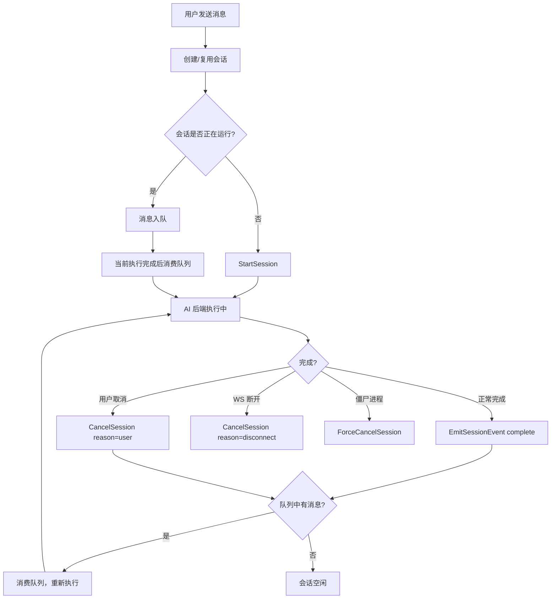
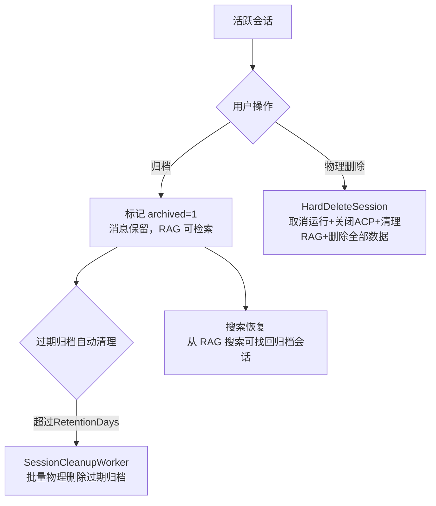
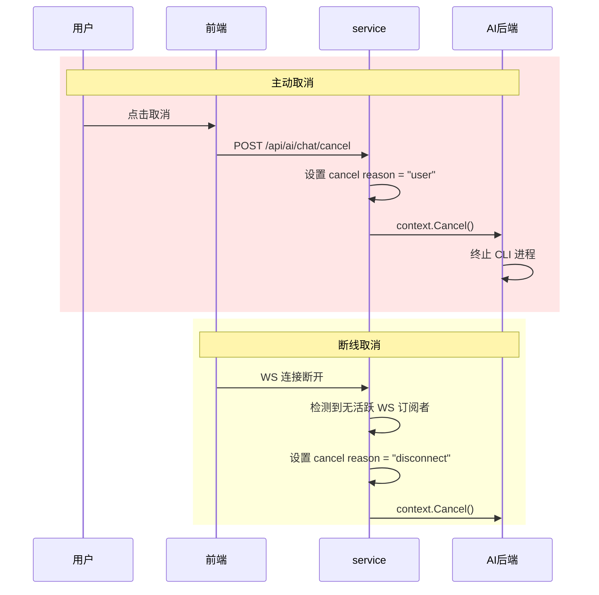

# 会话生命周期

聊天会话从用户发送第一条消息开始创建，经历执行、排队、取消、完成等状态，最终被归档（软删除）或物理删除（Destroy）。定时任务的执行结果可以续接为新的交互式会话，继承原始对话上下文。理解会话的生命周期是理解系统运行时行为的关键——大多数用户交互都围绕"当前会话"展开，而 service 层的会话管理是整个系统的运行时核心。

## 流程图

### 会话主生命周期

### 会话归档与物理删除

### 会话取消场景

## 功能与设计要点

### 功能清单

- **会话创建与复用**：用户发消息时，系统自动创建新会话或复用已有会话（同一 Agent）。每个会话绑定一个 Agent，保证对话上下文的一致性
- **消息排队**：同一会话内，前一条消息未执行完时后续消息自动入队，执行完成后依次消费。避免并发冲突，保证 AI 能看到完整的对话历史
- **主动取消**：用户可以随时取消正在执行的会话，系统区分"主动取消"和"连接断开"两种原因——主动取消不触发重连，断线取消可能触发重连尝试
- **僵尸进程清理**：`ForceCancelSession` 直接 kill CLI 子进程，用于处理卡死的执行。这是最后的兜底手段，保证系统不会因异常进程而资源泄漏
- **会话归档**：归档会话仅标记 `archived=1`，消息仍然保留在数据库中供 RAG 检索。用户可通过会话搜索恢复归档的会话，整理对话列表时不会丢失历史知识
<<<<<<< HEAD
=======
- **会话物理删除（Destroy）**：`HardDeleteSession` 事务性地删除会话及所有关联数据（消息、工具调用、原始响应、摘要、任务执行记录），同时清理该会话的 RAG 索引条目（FTS + 向量）。对正在运行的会话先取消执行并关闭 ACP 连接，再执行删除。不可逆，适用于确信不再需要的历史会话
- **过期归档自动清理**：`SessionCleanupWorker` 后台定时清理超过保留期限（`ArchiveRetentionDays`）的归档会话，批量执行物理删除（含 RAG 索引清理）。保留天数可配置，0 表示永久保留；清理功能可通过 `ArchiveRetentionEnabled` 开关控制。启动 5 分钟后首次执行，之后每 24 小时一次
- **ACP context_state 持久化**：ACP 会话的模式（mode）、思考深度（thinking effort）和上下文使用率（usage）持久化到 `chat_sessions.context_state` 列。服务重启后，前端加载会话时即可恢复这些状态显示，无需等待 ACP 重连。部分更新通过原子合并操作写入，避免并发读-写-合并竞态
>>>>>>> ai/docs/spec-update-20260801
- **会话身份持久化**：用户在会话中选择的模型、思考深度、工作模式和传输方式会被即时持久化（通过 PATCH `/api/ai/session/update`），页面重载后自动恢复——避免每次都需要重新配置
- **续接对话**：定时任务的执行结果可以续接为新的聊天会话，继承源会话的消息、摘要和 `external_session_id`。用户看到定时任务结果后想继续追问，无需重新描述上下文。已续接的会话显示"定时"标识，已归档的续接会话会自动恢复
- **会话分叉**：用户可以从历史用户消息创建独立会话，复制该消息之前的上下文并保留原会话。长对话中的替代方案探索不会污染现有分支，详细流程见[会话导航与分叉](../features/session-navigation.md)

### 设计要点

- **取消原因区分"用户"与"断线"**：系统为每个 Session 记录取消原因。用户主动取消意味着"我不想再继续了"，断线意味着"网络问题，可能需要恢复"——两种场景的处理策略完全不同
- **运行时 Session 是内存态**：活跃 Session 和 Stream 通道存储在内存中，重启后清空。运行时状态（是否在执行、Stream 通道）是瞬时的，不需要持久化。但 ACP context_state 等会话级持久状态现在存入数据库，重启后可恢复
- **会话设置即时持久化**：模式、思考深度、模型、传输方式、自动审批等设置通过 PATCH 端点即时写入数据库，无需发送聊天消息即可生效。模式/思考深度的变更还会异步转发给 ACP Agent
- **归档与物理删除语义不同**：归档是软删除（`archived=1`），数据保留、RAG 可检索、可恢复；物理删除（Destroy）是不可逆的事务性删除，从数据库彻底移除。两种操作对应不同的用户意图——归档是"暂时不看了但以后可能需要"，物理删除是"彻底清理"
- **过期清理是后台自动化**：`SessionCleanupWorker` 按配置周期自动清理过期归档，用户无需手动管理。配置变更通过 `ReconfigureSessionCleanup` 热生效（停止旧 worker、启动新 worker），无需重启服务
- **强制终止是最后手段**：在常规取消失败或进程卡死时，直接终止 CLI 进程（跳过优雅退出），避免产生孤儿进程
- **ExitPlanMode 结束当前流**：CLI 后端在检测到 ExitPlanMode 事件时结束当前流，由服务层管理后续会话状态
- **续接对话是去重的**：同一个执行记录只能续接一次，已有续接会话时直接返回（已归档的自动恢复）——防止重复创建导致数据冗余
- **分叉与续接语义不同**：续接连接任务执行结果并复用其来源关系；分叉从聊天历史的指定位置复制上下文，两者都创建独立可执行会话但来源边界不同
