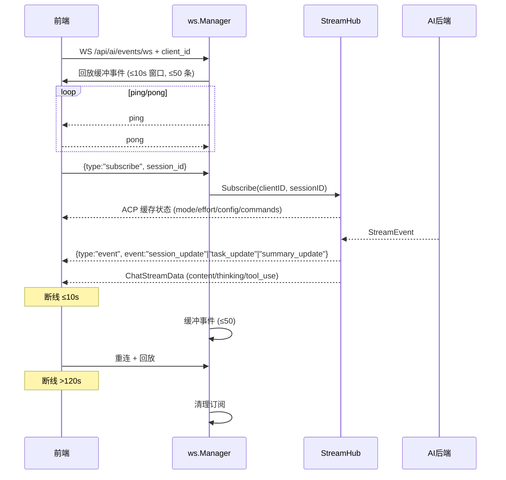
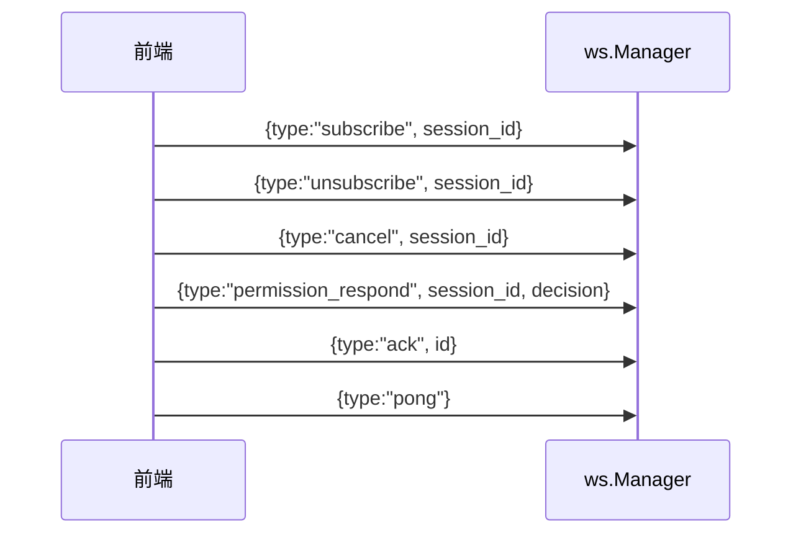

# 流式传输体系

ClawBench 使用**单一 WebSocket**（`/api/ai/events/ws`）实现所有实时数据推送。聊天流（`content`/`thinking`/`tool_use`）和系统事件（`session_update`/`task_update`/`summary_update`）共用此通道，由 `StreamHub` 做会话级扇出。后端还有几条独立的小 SSE/WS 通道用于文件监听、目录搜索和 TTS 流式音频——这些与聊天流无关。

> **历史说明**：早期版本曾用 SSE（`/api/ai/chat/stream`）做聊天流、`/api/events` 做系统事件，现已全部合并到统一 WebSocket。文档不再保留 SSE 聊天流相关描述。

## 流程图

### 主通道：WebSocket 统一推送

### 客户端侧消息类型

## 功能与设计要点

### 功能清单

- **WebSocket 单通道**：所有实时推送走 `GET /api/ai/events/ws`，无独立聊天流 SSE
  - 聊天内容事件：`ChatStreamData` 携带 `event_type`（`content`/`thinking`/`tool_use` 等子事件），通过 `StreamHub.EmitToSession` 推送
  - 系统事件信封：`{type:"event", event:"session_update"|"task_update"|"summary_update"}`，`summary_update` 事件携带 `SummaryCards` 结构化卡片元数据
  - 信号事件：`replay_done`（LoadSession 异步回放完成，空 payload）、`thinking_done`、`done`（均为空 payload）
  - 客户端消息：支持 `subscribe`/`unsubscribe`/`cancel`/`permission_respond`/`ack`/`pong` 六种客户端消息
- **断线缓冲与重放**：WebSocket 客户端断开 ≤10s 重连时，`ws.Manager` 自动回放缓冲事件；`disconnectedBufferWindow = 10s`、`maxBufferedEvents = 50`
- **订阅超时清理**：客户端超过 120s 无活动即清理订阅，避免僵尸连接
- **重连时 ACP 状态重发**：`StreamHub` 在客户端重新订阅时，重新推送该会话缓存的 ACP 状态（mode/effort/config/commands），使断线后状态保持一致
- **前端重连状态同步**：WS 重连后前端主动检查当前会话是否仍在运行（通过 `loadSessionsOnce` 刷新状态）。若会话在断线期间完成，清理卡住的流式状态并重新加载历史。页面可见性恢复时若仍在流式中，断开并重连以重新同步状态。`session_update` 事件到达时若流式状态不一致（如 `completed` 但 `loading` 仍为 true），强制清理并重载历史——防止因 WS 事件丢失导致界面卡死
- **subscribeOnly 模式**：前端在回放等待中的会话使用 `subscribeOnly` 模式连接 WS 流——仅接收事件，不触发流式 assistant 消息创建。适用于 LoadSession 异步回放尚未完成的场景
- **HTTP cancel 兜底**：`StreamHub` 还提供 `POST /api/ai/cancel` HTTP 端点作为 cancel 备选通道——WS 不可达时仍能取消（来自 `handler.go`，由 `SessionExecutor` 监听）

### 旁注：独立小通道（与聊天无关）

> 主通道之外，还有几条独立的小 SSE/WS 通道用于专门场景，与聊天流无关联。

| 端点 | 通道 | 用途 | 代码位置 |
|------|------|------|----------|
| `GET /api/file/watch` | SSE | 文件系统 fsnotify 变更流 | `internal/handler/file_watch.go` |
| `GET /api/dir/search` | SSE | 目录 fuzzy 搜索进度 | `internal/handler/dir_search.go` |
| `GET /api/tts/audio/ws` | WebSocket | TTS 流式音频分片 | `internal/handler/tts_audio_ws.go` |
| `GET /api/stt/transcribe/ws` | WebSocket | STT 流式语音识别 | `internal/handler/stt.go` |

### 设计要点

- **WS 单通道统一推送**：聊天流和系统事件共用 `/api/ai/events/ws`，由 `StreamHub` 做会话级扇出（多客户端订阅同一 session）；避免双通道带来的状态同步问题
- **断线缓冲只是减震**：缓冲窗口（10s / 50 条）有限，**不是持久化方案**。重连超时（>120s）后客户端通过 REST API 重新加载会话完整状态
- **客户端 ack 用 `permission_respond`**：WS 客户端消息支持 `permission_respond`（替代旧 HTTP `/api/ai/permission`），ACP 权限待审场景下前端用此消息回传决策
- **HTTP cancel 兜底**：WS 不可达时（弱网），HTTP cancel 端点仍可工作——`SessionExecutor` 同时监听 WS cancel 消息和 HTTP cancel 调用
- **WS 写入失败立即断连**：`writeMessage` 统一所有 WS 写入路径（广播 + ping），写入失败（对端消失、缓冲满、超时）立即 `CloseNow`，触发客户端 `onclose` 立即重连。之前 ping 写入失败时 goroutine 静默退出，导致半死连接只能靠客户端心跳缓慢检测
