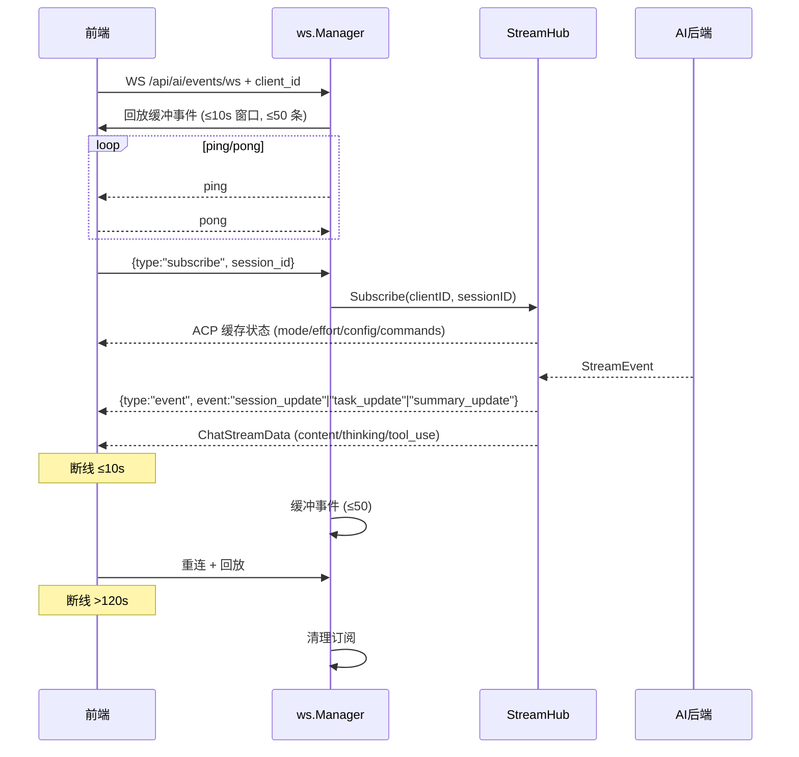
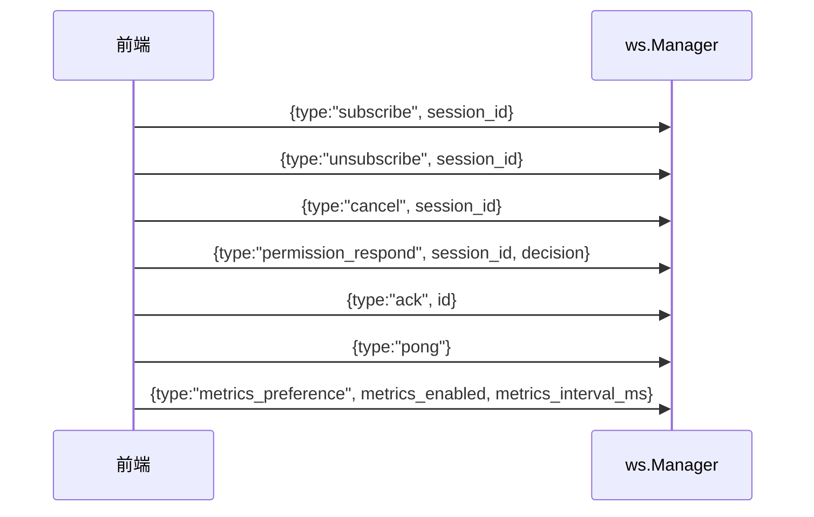
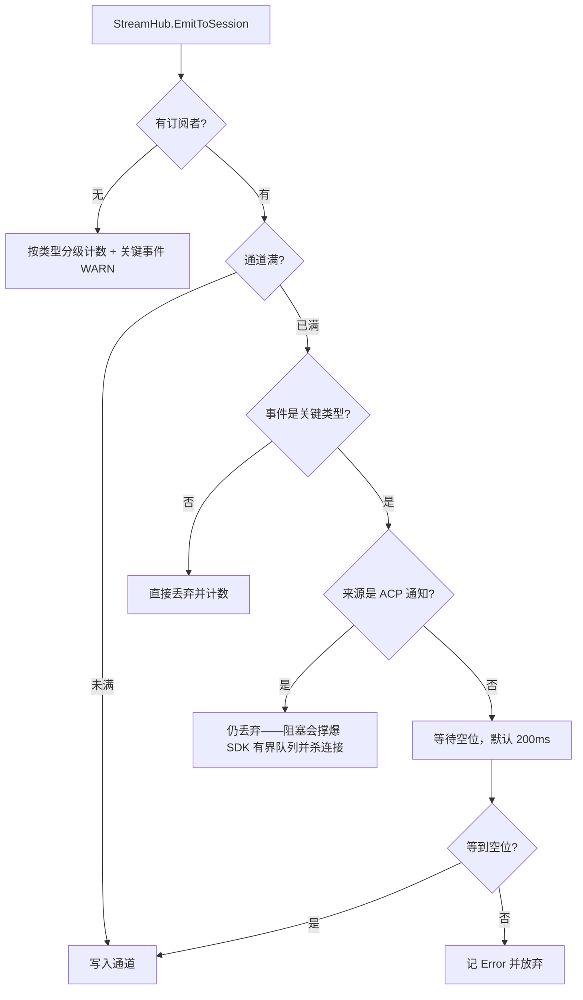
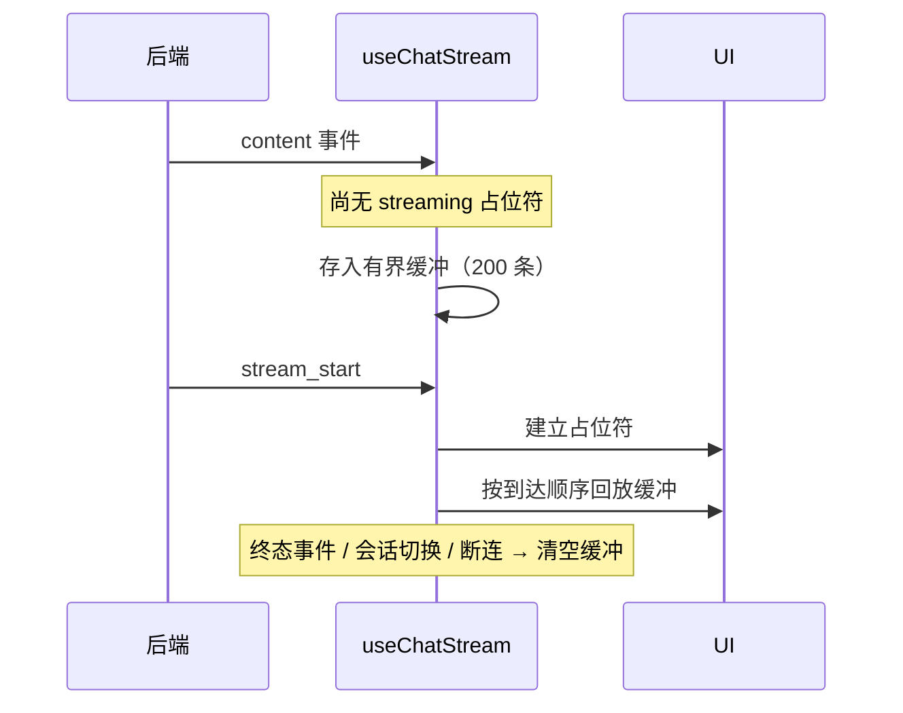

# 流式传输体系

ClawBench 使用**单一 WebSocket**（`/api/ai/events/ws`）实现所有实时数据推送。聊天流（`content`/`thinking`/`tool_use`）和系统事件（`session_update`/`task_update`/`summary_update`）共用此通道，由 `StreamHub` 做会话级扇出。后端还有几条独立的小 SSE/WS 通道用于文件监听、目录搜索和 TTS 流式音频——这些与聊天流无关。

> **历史说明**：早期版本曾用 SSE（`/api/ai/chat/stream`）做聊天流、`/api/events` 做系统事件，现已全部合并到统一 WebSocket。文档不再保留 SSE 聊天流相关描述。

## 流程图

### 主通道：WebSocket 统一推送

### 客户端侧消息类型

### 投递分级：关键事件等待，高频增量丢弃

关键事件（`done`/`cancelled`/`error`/`stream_start`/`content_reset`）与高频增量（`content`/`thinking`/`tool_use`）被区别对待：丢一条 thinking 用户无感，丢一条 `done` 会让 UI 永久停在 loading。但 ACP 来源必须例外——ACP 通知由 SDK 单条共享 goroutine 处理，其队列有界且溢出会直接关掉连接，因此在该来源上禁止阻塞，否则"丢一个增量"会升级成"连接死亡"。

### 前端缓冲回放：占位符未到时先攒着

## 功能与设计要点

### 功能清单

- **WebSocket 单通道**：所有实时推送走 `GET /api/ai/events/ws`，无独立聊天流 SSE
  - 聊天内容事件：`ChatStreamData` 携带 `event_type`（`content`/`thinking`/`tool_use` 等子事件），通过 `StreamHub.EmitToSession` 推送
  - 系统事件信封：`{type:"event", event:"session_update"|"task_update"|"summary_update"}`，`summary_update` 事件携带 `SummaryCards` 结构化卡片元数据
  - 信号事件：`replay_done`（LoadSession 异步回放完成，空 payload）、`thinking_done`、`done`（均为空 payload）
  - 遥测事件：`system_resources`（系统资源指标，由 `MetricsPusher` 按订阅需求推送）。**不进回放缓冲**——1Hz 遥测会在一分钟内冲爆 50 条缓冲并挤掉聊天/任务事件，因此走独立的非缓冲投递路径，且队列满时丢弃而非断连
  - 客户端消息：支持 `subscribe`/`unsubscribe`/`cancel`/`permission_respond`/`ack`/`pong`/`metrics_preference` 七种客户端消息。`metrics_preference` 声明是否订阅系统资源推送及速率（前台 1000ms / 后台 5000ms / 关闭），服务端仅在存在订阅者时采样，按最快请求速率推送；新连接会清空该偏好，客户端每次重连后重新声明
- **断线缓冲与重放**：WebSocket 客户端断开 ≤10s 重连时，`ws.Manager` 自动回放缓冲事件；`disconnectedBufferWindow = 10s`、`maxBufferedEvents = 50`。后端重放时给缓冲事件打 `Replayed` 标记（`replayed: true`），前端据此进入 `isReplayingEvents` 状态——补发的历史终态事件（如断线期间已完成的 `session_update`/`task_update`）不再被当作 live 事件处理，避免刷新后误弹历史完成通知/完成弹窗
- **订阅超时清理**：客户端超过 120s 无活动即清理订阅，避免僵尸连接
- **投递可观测**：`EmitToSession` 对无订阅者的会话不再静默丢弃——按原因（`no_subscribers` / `no_manager`）原子计数并通过 `GET /api/ws/delivery-stats` 暴露；日志按事件类型分级（关键事件 WARN、高频增量 DEBUG）且**每个 (原因, 类型) 只记一次**，量级交给计数、事实交给日志。此前"UI 卡在缺少终态事件"与"后端根本没发"在日志上完全无法区分
- **关键事件可靠投递**：通道满时按事件类型分流（见上图）——关键事件等待空位（默认 200ms，超时记 Error），高频增量保持非阻塞丢弃。ACP 来源是明确的例外
- **前端缓冲回放**：内容类事件在 `streaming` 占位符尚未建立时不再被丢弃，改为有界缓冲（200 条），`stream_start` 到达后按到达顺序回放。此前 `stream_start` 延迟或丢失会让用户看到空回复，尽管后端已产出内容。缓冲满时丢弃最旧一条（新事件才是用户即将看到的，且无界缓冲会在 `stream_start` 永不出现时泄漏）；终态事件到达、会话切换与断连都清空缓冲——否则一个迟到的 `stream_start`（重连回放、后端重试）会把上一轮的陈旧内容回放进新建的占位符，产生永远收不到终态事件的僵尸气泡
- **重连时 ACP 状态重发**：`StreamHub` 在客户端重新订阅时，重新推送该会话缓存的 ACP 状态（mode/effort/config/commands），使断线后状态保持一致
- **前端重连状态同步**：WS 重连是唯一的前端完整状态同步触发点——App 从后台恢复或前台切换时不再单独重载历史，统一由重连分支负责 `reset → connect → 检查会话状态`。重连后前端主动检查当前会话是否仍在运行（通过 `loadSessionsOnce` 刷新状态）：若会话在断线期间完成，清理卡住的流式状态并重新加载历史；空闲时也重载当前会话历史以补齐断线期间遗漏的消息。重连采用自包含的前景分支，不依赖后台分支中可能被 Android `pauseTimers()` 冻结的 `setTimeout`——消除旧方案中 reset 定时器被冻结导致重连状态不一致的竞态。`session_update` 事件到达时若流式状态不一致（如 `completed` 但 `loading` 仍为 true），强制清理并重载历史——防止因 WS 事件丢失导致界面卡死
- **subscribeOnly 模式**：前端在回放等待中的会话使用 `subscribeOnly` 模式连接 WS 流——仅接收事件，不触发流式 assistant 消息创建。适用于 LoadSession 异步回放尚未完成的场景
- **HTTP cancel 兜底**：`StreamHub` 还提供 `POST /api/ai/cancel` HTTP 端点作为 cancel 备选通道——WS 不可达时仍能取消（来自 `handler.go`，由 `SessionExecutor` 监听）

### 旁注：独立小通道（与聊天无关）

> 主通道之外，还有几条独立的小 SSE/WS 通道用于专门场景，与聊天流无关联。

| 端点 | 通道 | 用途 | 代码位置 |
|------|------|------|----------|
| `GET /api/file/watch/ws` | WebSocket | 文件系统 fsnotify 变更流 | `internal/handler/file_watch.go` |
| `GET /api/dir/search` | SSE | 目录 fuzzy 搜索进度 | `internal/handler/dir_search.go` |
| `GET /api/tts/audio/ws` | WebSocket | TTS 流式音频分片 | `internal/handler/tts_audio_ws.go` |
| `GET /api/stt/transcribe/ws` | WebSocket | STT 流式语音识别 | `internal/handler/stt.go` |

> 文件监听走 WebSocket 而非 SSE 是刻意的：明文 HTTP 部署下浏览器对每个源限制 6 条 HTTP/1.1 连接，常驻 `EventSource` 会永久占用其中一条并拖慢并发 REST；WebSocket 升级成 101 后即移出连接池。查询参数 `dir`/`file` 设置初始监听目标（升级前校验，穿越返回 403），此后客户端用 `{"type":"watch"}` 消息重新指定目标——不再有独立的 update 端点。服务端每 30s 发 `{"type":"ping"}`，客户端回 `pong`。

### 设计要点

- **WS 单通道统一推送**：聊天流和系统事件共用 `/api/ai/events/ws`，由 `StreamHub` 做会话级扇出（多客户端订阅同一 session）；避免双通道带来的状态同步问题
- **流式入库批量合并**：高频流事件（tool-call、context-state、thinking）不逐事件写库，而是合并进 500ms flush 周期的批量写——tool-call 只在 flush 时重扫最新块状态、context-state 原子合并、thinking 以固定 ID 覆盖写全文；content 行无变化时跳过整行 UPDATE，Finalize 前补一次 flush 防止流末尾排队数据丢失。落库吞吐与写放大被大幅压缩
- **WS 侧另做 50ms 合流（与入库 flush 是两个独立窗口）**：`SessionExecutor.forwardEvent` 把连续的 `content`/`thinking` delta 交给 `streamCoalescer` 合并后再推送。合并条件是 **type 且 `parent_tool_call_id` 都相同**——后者是正确性要求而非优化：前端用 `findBlockByTypeBackward(blocks, type, parent)` 定位块，跨 parent 合并会把子智能体的文本算到父块上。非 delta 事件是**顺序屏障**，先 flush 缓冲再发出，保证工具卡片不会越过它之前的正文。窗口 50ms（`wsCoalesceInterval`，与 `ai/acp_debounce.go` 的 tool 去抖一致）**刻意远小于** 500ms 的入库窗口：入库窗口管的是写放大（行陈旧无害，前端从 WS 渲染），这个窗口管的是帧数与 token 上屏延迟，且必须低于前端自身 300ms 的渲染节流才不会多渲染一帧。单帧上限 32KB（`maxCoalescedBytes`），防止长突发合并成 MB 级帧。`RunWithChannel` 退出时经 `defer` 强制 flush 一次——终端 `done` 由 handler/scheduler 在本函数返回**之后**发出，漏掉这次 flush 会让残留 delta 落在 `done` 之后，而前端此时已退出流式态、会直接丢弃。实测 33KB 回复从 3062 帧降到约 1/9
- **断线缓冲只是减震**：缓冲窗口（10s / 50 条）有限，**不是持久化方案**。重连超时（>120s）后客户端通过 REST API 重新加载会话完整状态
- **客户端 ack 用 `permission_respond`**：WS 客户端消息支持 `permission_respond`（替代旧 HTTP `/api/ai/permission`），ACP 权限待审场景下前端用此消息回传决策
- **HTTP cancel 兜底**：WS 不可达时（弱网），HTTP cancel 端点仍可工作——`SessionExecutor` 同时监听 WS cancel 消息和 HTTP cancel 调用
- **WS 写入失败立即断连**：`writeMessage` 统一所有 WS 写入路径（广播 + ping），写入失败（对端消失、缓冲满、超时）立即 `CloseNow`，触发客户端 `onclose` 立即重连。之前 ping 写入失败时 goroutine 静默退出，导致半死连接只能靠客户端心跳缓慢检测
- **可靠投递以事件语义分级，而非一刀切**：把"不丢"施加到所有事件上会让通道满时把生产者（AI 后端）拖住；施加到所有来源上更会让 ACP 通知阻塞进而杀死连接。因此判据有两层——事件是否承载状态机终态（决定是否值得等），以及发送方是否承受得起等待（决定是否允许等）。缺任一层都会引入更严重的故障
