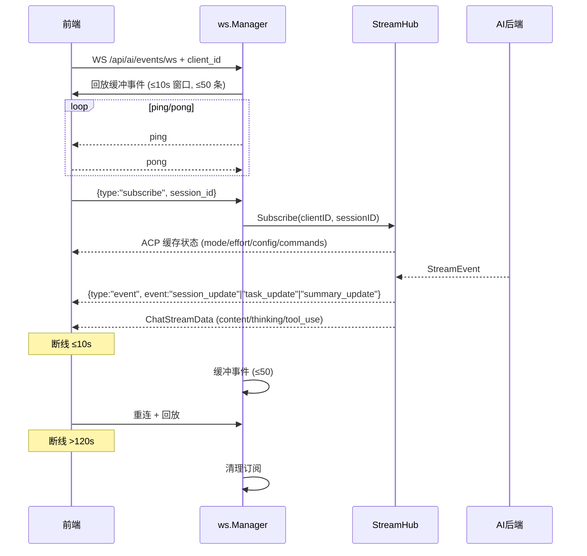
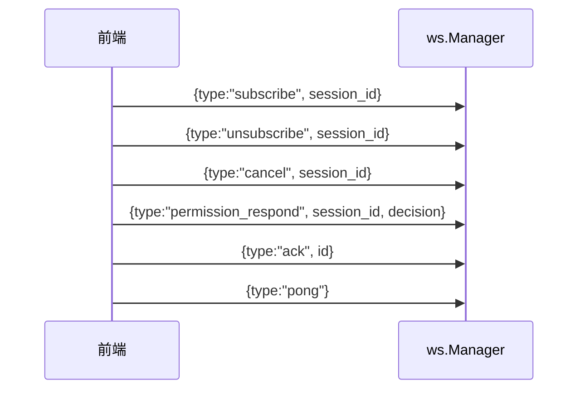

# 流式传输体系

ClawBench 使用**单一 WebSocket**（`/api/ai/events/ws`）实现所有实时数据推送。聊天流（`content`/`thinking`/`tool_use`）和系统事件（`session_update`/`task_update`/`summary_update`）共用此通道，由 `StreamHub` 做会话级扇出。后端还有几条独立的小 SSE/WS 通道用于文件监听、目录搜索和 TTS 流式音频——这些与聊天流无关。

> **历史说明**：早期版本曾用 SSE（`/api/ai/chat/stream`）做聊天流、`/api/events` 做系统事件，现已全部合并到统一 WebSocket。文档不再保留 SSE 聊天流相关描述。

## 流程图

### 主通道：WebSocket 统一推送

### 客户端侧消息类型

## 功能与设计要点

### 功能清单

- **WebSocket 单通道**：所有实时推送走 `GET /api/ai/events/ws`（`internal/handler/handler.go`），无独立聊天流 SSE
  - 聊天内容事件：`ChatStreamData` 携带 `event_type`（`content`/`thinking`/`tool_use` 等子事件），通过 `StreamHub.EmitToSession` 推送（`internal/ws/stream_hub.go:120`）
  - 系统事件信封：`{type:"event", event:"session_update"|"task_update"|"summary_update"}`（`internal/ws/protocol.go:13`）
  - 信号事件：`replay_done`（LoadSession 异步回放完成，空 payload）、`thinking_done`、`done`（均为空 payload）
  - 客户端消息：支持 `subscribe`/`unsubscribe`/`cancel`/`permission_respond`/`ack`/`pong` 六种客户端消息（`protocol.go:19`）
- **断线缓冲与重放**：WebSocket 客户端断开 ≤10s 重连时，`ws.Manager` 自动回放缓冲事件；`disconnectedBufferWindow = 10s`、`maxBufferedEvents = 50`（`internal/ws/manager.go:42,46`）
- **订阅超时清理**：客户端超过 `staleTimeout = 120s` 无活动（`manager.go:50`）即清理订阅，避免僵尸连接
- **重连时 ACP 状态重发**：`StreamHub` 在客户端重新订阅时，重新推送该会话缓存的 ACP 状态（mode/effort/config/commands），使断线后状态保持一致
- **HTTP cancel 兜底**：`StreamHub` 还提供 `POST /api/ai/cancel` HTTP 端点作为 cancel 备选通道——WS 不可达时仍能取消（来自 `handler.go`，由 `SessionExecutor` 监听）

### 旁注：独立小通道（与聊天无关）

> 主通道之外，还有几条独立的小 SSE/WS 通道用于专门场景，与聊天流无关联。

| 端点 | 通道 | 用途 | 代码位置 |
|------|------|------|----------|
| `GET /api/file/watch` | SSE | 文件系统 fsnotify 变更流 | `internal/handler/file_watch.go:35` |
| `GET /api/dir/search` | SSE | 目录 fuzzy 搜索进度 | `internal/handler/dir_search.go:120` |
| `GET /api/tts/audio/ws` | WebSocket | TTS 流式音频分片 | `internal/handler/tts_audio_ws.go:36` |

### 设计要点

- **WS 单通道统一推送**：聊天流和系统事件共用 `/api/ai/events/ws`，由 `StreamHub` 做会话级扇出（多客户端订阅同一 session）；避免双通道带来的状态同步问题
- **断线缓冲只是减震**：缓冲窗口（10s / 50 条）有限，**不是持久化方案**。重连超时（>120s）后通过 `fullStateSync` REST 端点恢复完整状态
- **客户端 ack 用 `permission_respond`**：WS 客户端消息支持 `permission_respond`（替代旧 HTTP `/api/ai/permission`），ACP 权限待审场景下前端用此消息回传决策
- **HTTP cancel 兜底**：WS 不可达时（弱网），HTTP cancel 端点仍可工作——`SessionExecutor` 同时监听 WS cancel 消息和 HTTP cancel 调用

## 关键代码引用

| 文件 | 关键符号/常量 |
|------|---------------|
| `internal/ws/stream_hub.go:120` | `func EmitToSession(sessionID string, event ai.StreamEvent)` |
| `internal/ws/manager.go:42,46,50` | `disconnectedBufferWindow=10s` / `maxBufferedEvents=50` / `staleTimeout=120s` |
| `internal/ws/protocol.go:10-15,18-25` | 服务端信封 `ServerMessage` + 客户端消息 `ClientMessage` |
| `internal/handler/handler.go` | WS 端点注册（`/api/ai/events/ws`、`/api/ai/cancel`） |
| `internal/handler/file_watch.go:35` | `/api/file/watch` SSE |
| `internal/handler/dir_search.go:120` | `/api/dir/search` SSE |
| `internal/handler/tts_audio_ws.go:36` | `/api/tts/audio/ws` WS |
