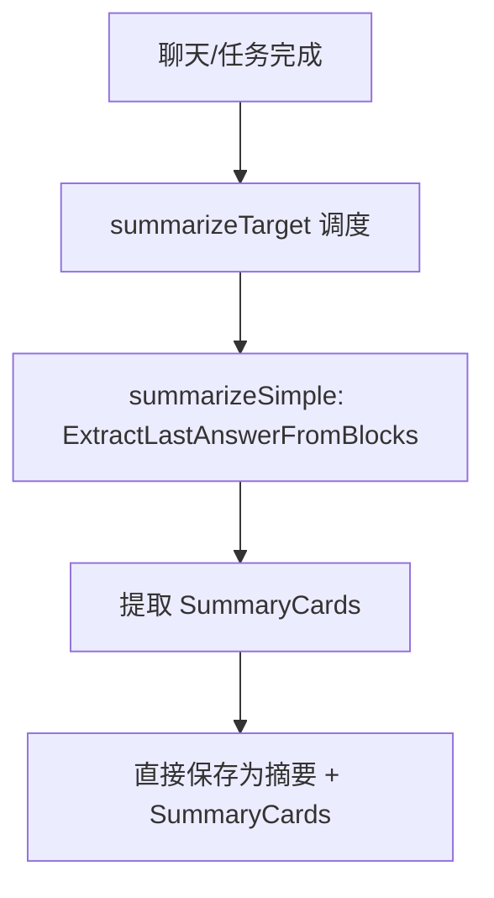
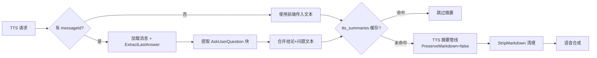

# 摘要管线

ClawBench 的摘要系统将 AI 助手的长回复压缩为简短摘要，服务于两种不同场景：TTS 语音播放（需要纯文本、无格式、口语化）和阅读摘要（保留 Markdown 格式和代码片段）。阅读摘要固定提取 AI 结论，语音摘要后端可配置（提取结论或 LLM 二次压缩），两条管线互不影响。理解摘要系统是理解聊天完成后的后续处理链和 TTS 语音合成的关键。摘要结果携带结构化卡片元数据（SummaryCards），包含工具卡片、定时任务 ID 和 ask-question 卡片，前端据此渲染摘要视图。

## 流程图

### 摘要管线主流程

### TTS 摘要流程

## 功能与设计要点

### 功能清单

- **聊天自动摘要**：聊天会话正常完成时自动生成摘要（取消/断线的会话不触发）。`summarizeTarget` 统一调度入口固定采用「提取结论」策略（`summarizeSimple`），直接提取最后回答（`ExtractLastAnswerFromBlocks`），不做 AI 压缩。完成后通过 `summary_update` WS 事件推送前端（含 SummaryCards）
- **任务执行摘要**：定时任务执行完成后生成摘要，与聊天摘要共享 `summarizeTarget` 调度入口和存储模型，续接对话时无需类型转换
- **SummaryCards 结构化卡片**：摘要结果携带结构化卡片元数据（`SummaryCards`），持久化到 `summaries.summary_cards` 列。包含三类卡片：工具卡片（`SummaryTool`，记录工具名称和输入摘要）、定时任务 ID（关联执行记录）、ask-question 卡片（`AskQuestionCard`，含标题和选项）。前端据此在摘要视图中渲染工具调用摘要和交互选项，无需加载完整消息内容
- **TTS 语音摘要**：TTS 请求触发时按需生成语音专用摘要。提取 AI 结论和 AskUserQuestion 内容，合并为可朗读文本。结果缓存到独立的 `tts_summaries` 表。语音摘要后端可配置：`simple`（提取结论）或 `api`（LLM 二次压缩）
- **多 pass 压缩**：AI（语音）摘要结果超过 4KB 时自动触发二次摘要，最多两轮。防止超长中间结果传递给下游（尤其是 TTS）
- **Block 提取算法**：`ExtractLastAnswerFromBlocks` 跳过中间推理，提取最后一个 tool_use 之后的文本作为 AI 结论。无后续文本时回退到最长的文本块——AI Agent 的对话模式通常在工具调用后给出最终综合回答
- **Markdown 清理**：TTS 模式的 `StripMarkdown` 多阶段清理：代码块移除、行内代码按长度保留或删除（短变量名保留，长代码片段移除）、粗体/标题/列表/表格/脚注剥离、AskUserQuestion 块转为自然语言朗读格式
- **热重载**：语音摘要配置（`summarize.tts_backend`）通过 PATCH 端点即时生效，TTS 摘要器原子重建，进行中的调用继续使用旧实例

### 设计要点

- **双管线分离**：TTS 摘要（纯文本、激进压缩）和阅读摘要（提取结论、保留 Markdown 和代码）互不干扰。阅读摘要固定提取结论、不做 AI 压缩，故不暴露后端配置；TTS 摘要后端可配置，支持 `simple` 提取结论或 `api` LLM 压缩。TTS 摘要器故障不影响阅读摘要，反之亦然
- **summarizeTarget 统一调度**：聊天和定时任务共享 `summarizeTarget` 调度入口，均固定提取结论，不区分模式。之前定时任务绕过 `chatSummaryMode` 直接走 AI 路径，导致短任务输出被存为空摘要——统一后所有场景行为一致
- **短文本处理**：阅读摘要对短文本直接保存提取的结论（前端展示原文），不触发 AI 调用
- **AskUserQuestion 保留**：阅读摘要中 AskUserQuestion 与权限审批工具调用以卡片（SummaryCards）形式呈现；TTS 清理时专门解析结构化问题块，转为自然语言（"问题：...选项：A, B, C"），确保 TTS 能朗读权限审批的问题和选项
