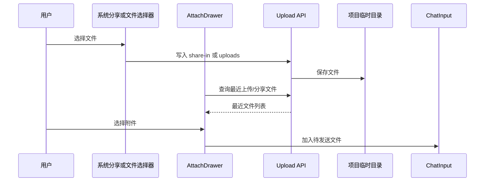

# 附件与系统分享

附件系统让用户把本地文件、项目文件和系统分享内容加入聊天。移动端文件选择容易被系统 Activity 打断，因此流程同时保存上传状态和最近记录，使用户返回应用后仍能找到刚选择的内容。

## 流程图

### 从系统文件到聊天附件

普通上传和系统 Share In 使用不同来源目录，但在附件抽屉中汇合。发送消息时只引用已落盘文件，避免把大型二进制内容直接塞入聊天请求。

## 功能与设计要点

### 功能清单

- **多文件附件**：从文件选择器上传一个或多个文件，显示文件类型、图片缩略图和上传进度。支持行范围选择（`startLine/endLine`），让 AI 聚焦于文件特定区域。移动端用户可以把截图、日志或文档直接交给 Agent
- **系统 Share In**：从其他 App 分享文件到 ClawBench，服务端保存在项目 `.clawbench/share-in` 目录，回到聊天后可从最近分享列表选择。支持删除最近分享文件（`DELETE /api/share-in/recent`），服务端确认后才从列表移除
- **上传历史**：`/api/upload/recent` 返回最近上传文件，文件选择器关闭或页面状态变化后仍可恢复刚才的操作。支持删除最近上传文件（`DELETE /api/upload/recent`），服务端确认后才从列表移除
- **来源合并**：上传历史和 Share In 最近项在统一附件体验中展示，同时保留来源以便排障和清理
- **任意文件类型**：上传不做扩展名白名单限制，实际可读性由文件预览和 AI 后端能力决定

### 设计要点

- **先落盘再发送引用**：聊天请求保持轻量，后端也能统一执行路径校验和大小限制
- **最近列表以目录为边界**：普通上传与系统分享分目录保存，避免来源混淆并便于生命周期管理
- **抽屉状态跨系统选择器保持**：启动原生文件选择器时不应把附件流程误判为用户关闭抽屉
- **缩略图按需生成**：只为需要预览的图片生成缩略图，不复制所有附件内容
- **项目隔离**：最近文件查询绑定当前项目，避免把一个项目的附件错误带入另一个项目
