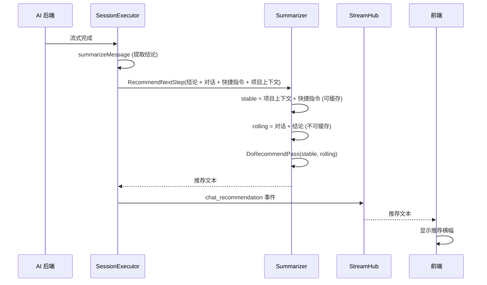
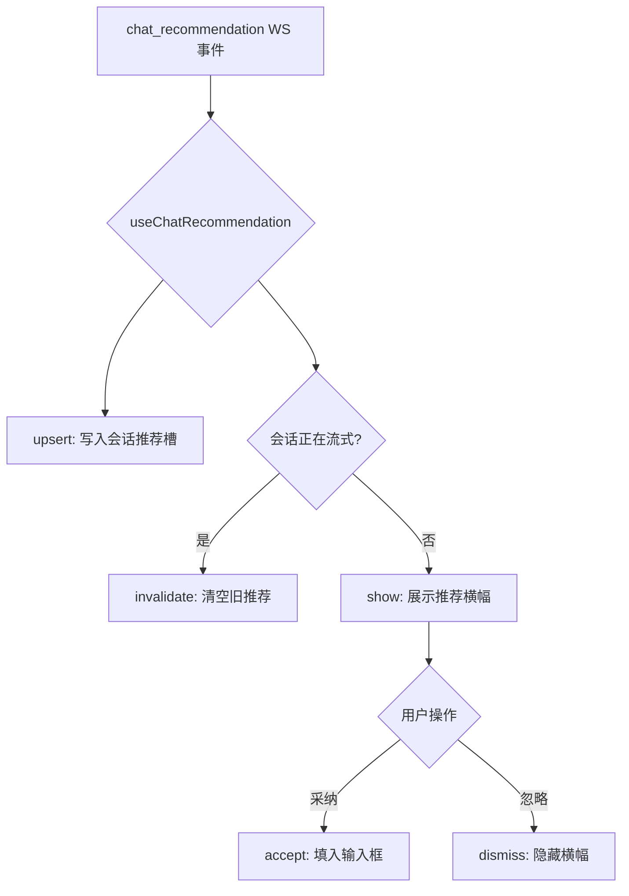

# 推荐回复

推荐回复在 AI 助手回复完成后，自动生成一条简洁的下一步建议，帮助用户快速继续对话。推荐结果以 `chat_recommendation` WebSocket 事件实时推送，前端在聊天输入框上方展示推荐横幅，用户可一键采纳或忽略。推荐基于最近对话上下文、AI 结论和项目规则，由 LLM 生成，支持 prompt caching 减少重复计算。

## 流程图

### 推荐生成流程

会话完成后，`summarizeMessage` 在提取结论的同时触发推荐生成。推荐 payload 分为可缓存前缀（项目上下文 + 快捷指令）和滚动尾部（对话 + 结论），支持 Anthropic cache_control 和 OpenAI 风格的自动前缀缓存，避免每轮重复处理稳定内容。

### 推荐消费流程

前端 `useChatRecommendation` composable 管理推荐状态：每个会话一个推荐槽，新消息开始流式时自动清空旧推荐，避免过时推荐。用户离线时推荐通过 WebSocket 重连推送，或通过 `GET /api/chat/recommendation` 拉取。

## 功能清单

- **推荐回复**：AI 助手回复完成后，自动生成一条简洁的下一步建议（如追问、执行命令、探索方向），用户可一键采纳填入输入框。减少用户思考"接下来问什么"的认知负担
- **快捷指令感知**：推荐生成时参考用户的快捷指令列表，如果某条快捷指令符合下一步，推荐保留原始指令文本，用户可直接使用
- **项目上下文感知**：推荐生成时参考项目规则文件（如 AGENTS.md），推荐内容贴合项目约定
- **离线恢复**：推荐结果持久化到 `chat_recommendations` 表，用户离线期间产生的推荐可在重新打开会话时通过 `GET /api/chat/recommendation` 拉取
- **会话隔离**：推荐状态按会话隔离，不会出现一个会话的推荐泄漏到另一个会话

## 设计要点

- **stable/rolling 分离**：推荐 payload 分为可缓存前缀（项目上下文 + 快捷指令，跨轮次稳定）和滚动尾部（对话 + 结论，每轮变化），LLM 提供商的 prompt caching 机制可复用前缀，避免重复处理
- **AISummaryConfig 共享**：推荐和语音摘要共享 `ai_summary` 配置（模型、API 端点），避免重复配置。用户只需配置一次 LLM 端点，两种功能自动可用
- **generation 守卫**：前端使用 generation 计数器防止异步拉取竞态——会话被 invalidate（新消息开始流式）时 generation 递增，正在进行的 fetch 返回后检查 generation 是否匹配，不匹配则丢弃结果
- **推荐异步生成**：推荐在 goroutine 中异步执行，不阻塞 `Finalize()` 与终端 `done` 事件——推荐的 LLM 调用（最长 60s）若内联执行会让回复完成后的 UI 更新和完成提示延迟数秒。前端以 `chat_recommendation` 事件到达为准展示，无需等待
