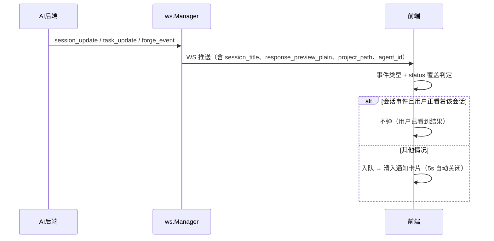
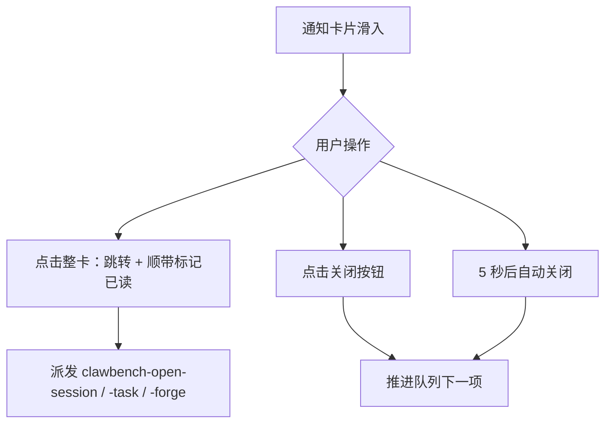

# 应用内完成通知

应用内完成通知（Completion Notification）解决"AI 干活的时候用户不在聊天界面"的问题：会话、任务或仓库事件发生时，如果聊天界面不在前台，滑入一张纯通知卡片，让用户在不离开当前工作区的情况下感知事件并一键跳转。

它取代了早期的"完成预览弹窗"——那张卡片可点击展开成近全屏、内置快捷回复输入框和标记已读按钮、点空白处关闭、永不自动消失，本质是一个迷你聊天界面。现在它被降级为**纯通知**：标题 + 单行摘要 + 跳转 + 关闭，5 秒自动消失，交互完全对标系统通知。

## 流程图

### 事件触发与展示

### 卡片交互

## 功能与设计要点

### 功能清单

- **事件覆盖与系统通知完全对齐**：会话（completed/cancelled/permission_pending）、任务（running/completed/failed/cancelled）、仓库（opened/closed/merged/reopened/commented/pipeline_done）。同一事件无论页面聚焦与否都有提醒，只是形式不同
- **纯通知形态**：卡片分**头部区**与**正文区**两段。头部 = agent 图标 + **主类别徽章** + **事件类型标题** + 关闭按钮；正文 = 标题段 + 最多 4 行纯文本摘要。阅读顺序是"谁发的 → 哪个子系统 → 发生了什么 → 关闭"。两者形态刻意不同：**主类别是徽章**（中性灰描边小标签，回答"哪个子系统"属于分类），**事件类型是纯文字标题**（无边框/底色/内边距，只有语义色，`--font-size-lg`(14px) 半粗，回答"发生了什么"）。层级因此分明：分类是次要信息用徽章，结果才是头部主文字。标题段回答"是谁"（会话名 / 任务名 / `owner/repo`）。正文与标题段的字号/行高对齐聊天正文（`--font-size-md` + `--line-height-snug`，与 `.chat-message` 同一套刻度），通知读起来和对话里的文字一样大。事件类型标题按语义配色：绿=成功、红=失败、黄=中断、蓝=进行中或中性（forge 六类统一用蓝——关闭一个议题不等于失败，语义配色在那里会误导）。它是头部唯一的彩色信息，因此成了最抢眼的一眼可见项。没有 Markdown 渲染、没有展开预览——正文与系统通知用同一份纯文本，同一事件不会因为页面是否聚焦而读起来不同
- **跨项目显著视觉区分**：事件属于其他项目时，卡片**整卡换色**（边框与底色偏向 accent）——只靠底部一条区隔带的话，卡片主体看起来仍像本项目的通知。卡片底部另有一条铺满整宽的区隔带：`外部` 徽章 + **加粗的项目名** + 弱化的完整路径（尾部省略，完整值在 title）。本项目不显示。forge 面板与未读角标都是项目作用域的，这行是点击前的关键判断依据
- **两个操作**：点击整卡跳转，点击关闭按钮消失
- **跳转顺带标记已读**：会话走 `/api/ai/chat/read`、任务走 `PUT /api/tasks/{id}`（`action: read` + `executionId`）、仓库议题/合并请求走 `/api/forge/read`（`itemKey`）。已读是 fire-and-forget，失败不阻塞跳转
- **5 秒自动关闭（悬停暂停）**：用户不点击即自行消失，错过的内容靠未读角标找回（角标不受任何通知开关影响）。**鼠标悬停在卡片上（或键盘焦点在卡片内）时暂停倒计时**，移开后只补走剩余的那部分——不重新计满 5 秒。用户移开鼠标不该白送一轮完整时长，也不该因为正在读内容就被强行收走
- **桌面端窄卡片**：桌面端宽度上限 420px（移动端 480px）——这是通知不是面板，过宽时一行能塞下整段摘要、读起来像在看正文
- **非模态**：定位层 `pointer-events: none`，不拦截页面任何点击；也**不再**支持点空白处关闭
- **位置分平台**：桌面端右下角滑入（对齐系统通知的常规位置），移动端顶部滑下不变
- **队列上限 3 + 同仓库合并**：一次 forge 轮询可能派发整批事件，逐条排队会把队列堵死几分钟。同 `groupKey` 的排队项合并为「N 条新变化」（替换 chip 文案，标题仍显示仓库），队列超过 3 条丢弃最旧的排队项（正在展示的卡片不受影响）
- **可关闭**：`inAppNotification` 本地设置（默认开启，设置 → 推送通知 → 应用内通知）门控整个通知。关闭后不再弹新卡片；已在展示的卡片保留至自动关闭。关闭卡片不影响提示音与系统/IM 推送
- **跨项目跳转**：forge 面板与未读角标都是项目作用域的，事件携带 `event.project_path`，点击时若目标项目不是当前项目先切换再开页签

### 与系统通知的差异

| 维度 | 应用内通知 | 系统通知（浏览器/桌面） |
|---|---|---|
| 焦点条件 | 用户没在看该会话就弹 | 页面失焦才弹 |
| 事件覆盖 | 完全相同 | 完全相同 |
| 存活依赖 | 需页面存活 | Electron 主进程路径不依赖页面 JS |
| 自动关闭 | 固定 5 秒 | 由操作系统决定 |
| 合并 | 同仓库合并 + 上限 3 | 无（系统通知各自独立） |

**焦点条件是刻意不对齐的**：如果卡片也要求页面失焦才弹，两个渠道的场景就完全重合，卡片失去存在意义。

### 设计要点

- **不弹的边界是"用户正看着结果"**：聊天界面在前台且正是目标会话时不弹。判断同时考虑 PC 宽屏聊天面板常驻的情况，避免宽屏下误判
- **通知是 WS 事件的投影而非独立通道**：不建立新连接，直接消费 `session_update` / `task_update` / `forge_event`。事件携带的 `response_preview_plain`、`session_title`、`project_path`、`agent_id` 由后端终态处理时一次性装配
- **合并只作用于队列**：正在展示的卡片不会在用户眼前突然变样——同 `groupKey` 的新事件在 active 命中时作为独立排队项，只有排队中的条目才合并
- **已读走独立端点**：标记已读不需要也不应该重发消息。跨项目会话通过 `project_path` 参数显式声明归属，后端只接受与会话自身项目精确匹配的请求
- **流水线事件只跳转不标记**：`forge_event` 载荷里流水线的 `number` 恒为 0（真实 run id 在 `pipeline/run:<id>` 里，未下发），构造不出条目键，因此不做条目级已读
- **重放事件永不通知**：`fetchPendingEvents()` 拉取的和 WS 重连缓冲回放的（`replayed: true`）都是补历史，用户并未亲眼看到事件发生
