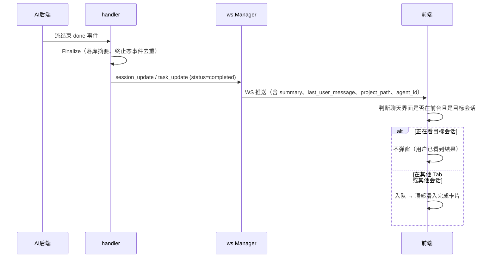
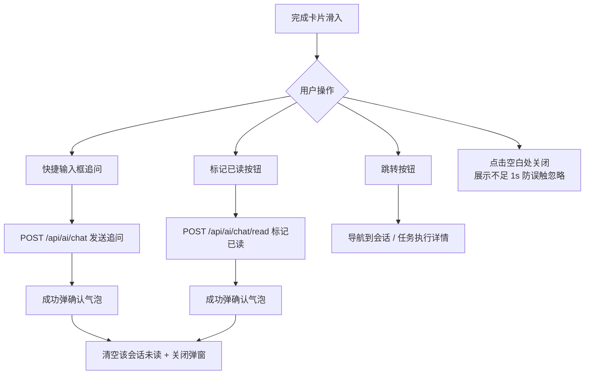

# 完成通知弹窗

完成通知弹窗（Completion Popover）解决"AI 干活的时候用户不在聊天界面"的问题：会话或任务执行完成时，如果聊天界面不在前台，顶部滑入一张 Android 通知风格的卡片，让用户在不离开当前工作区的情况下就能感知完成状态、浏览结果摘要、直接追问或跳转。它取代了旧的会话结束 Toast 气泡——Toast 一闪而过、无法交互，而弹窗卡片可以承载摘要全文和快捷输入框。

## 流程图

### 完成事件的触发与弹窗展示

### 弹窗内的交互

## 功能与设计要点

### 功能清单

- **后台完成感知**：会话或任务完成时，若聊天界面不在前台（在看其他 Tab、其他会话，或 PC 宽屏下聊天面板常驻但目标会话不同），顶部滑入 Android 通知风格卡片。这是核心价值——用户专注其他工作区时也能感知 AI 已完成并直接跟进，无需时刻盯着聊天窗口
- **摘要全文展示**：卡片展示会话标题、项目名/路径、最近一条用户消息和 agent 后端图标，正文渲染摘要全文（轻量 Markdown 渲染，跳过路径注解与 KaTeX，保持轻快）。用户不用进会话就能判断结果好坏
- **快捷输入框追问**：卡片内置快捷输入框，可直接向该会话发送追问（`POST /api/ai/chat`）。发送后清空该会话未读并关闭弹窗——把"看完结果 → 继续追问"压缩在弹窗内完成
- **标记已读**：卡片右上角标记已读按钮（`POST /api/ai/chat/read`，独立端点），只清空该会话未读、不发送消息，点击后关闭弹窗。适合"看到结果但无需追问"的场景
- **成功确认气泡**：发送追问或标记已读成功后弹出确认气泡（Toast），失败时弹窗保持打开、输入状态复位，用户可重试——成功/失败都有明确反馈，不会出现"点了没反应"的困惑
- **外部项目区隔**：跨项目完成的会话在卡片底部显示项目名/路径 Footer 区隔带（带"外部"徽章），与当前项目内容清晰分层。发送追问和标记已读都携带 `project_path` 参数，使外部项目弹窗也能通过后端归属校验
- **排队依次展示**：多个完成事件进入模块级单例队列，依次展示不扎堆。前一个手动关闭后才显示下一个，避免多任务同时完成时卡片堆叠
- **跳转按钮**：点击跳转按钮导航到对应会话（普通聊天）或任务执行详情（任务），通过自定义事件携带 session id + project path 触发导航
- **用户消息引用块**：最近一条用户消息渲染为引用式样块——无圆角、左侧 accent 竖线描边、淡色底、行首图标，宽度随内容自适应，单行省略；点击可展开/收起完整内容，切换会话时复位折叠态。与助手摘要区分层次，让用户快速回忆起"这个任务在说什么"

### 设计要点

- **不弹窗的边界是"用户正看着结果"**：聊天界面在前台且正是目标会话时不弹——用户已看到完成结果，再弹是打扰。判断同时考虑 PC 宽屏聊天面板常驻的情况，避免宽屏下误判
- **弹窗是 WS 事件的投影而非独立通道**：不建立新连接，直接消费 `session_update` / `task_update` 的 completed 事件。事件携带的 `response_preview`、`last_user_message`、`project_path`、`agent_id` 等字段由后端终态处理时一次性装配，前端只做展示
- **未读清空走独立端点**：`/api/ai/chat/read` 与发送接口分离——标记已读不需要也不应该重发消息，独立端点保证"只清未读、不动会话状态"。支持 `project_path` 参数精确通过跨项目归属校验
- **防误触是短窗口而非固定规则**：卡片滑入瞬间用户手指可能还留在屏幕上，空白处点击被误触概率高。展示不足 1 秒时忽略空白处点击，保护窗口对每个新展示项重新计时；按钮/发送等明确操作路径不受限制——"容错"只作用于模糊意图的点击，不牺牲明确的交互
- **失败不丢交互**：发送追问失败时弹窗保持打开并复位输入状态，用户可重试；标记已读失败不阻塞发送流程（消息已发出）。跨项目会话通过 `project_path` 参数显式声明归属，后端只接受与会话自身项目精确匹配的请求，不能用于绕过访问控制
