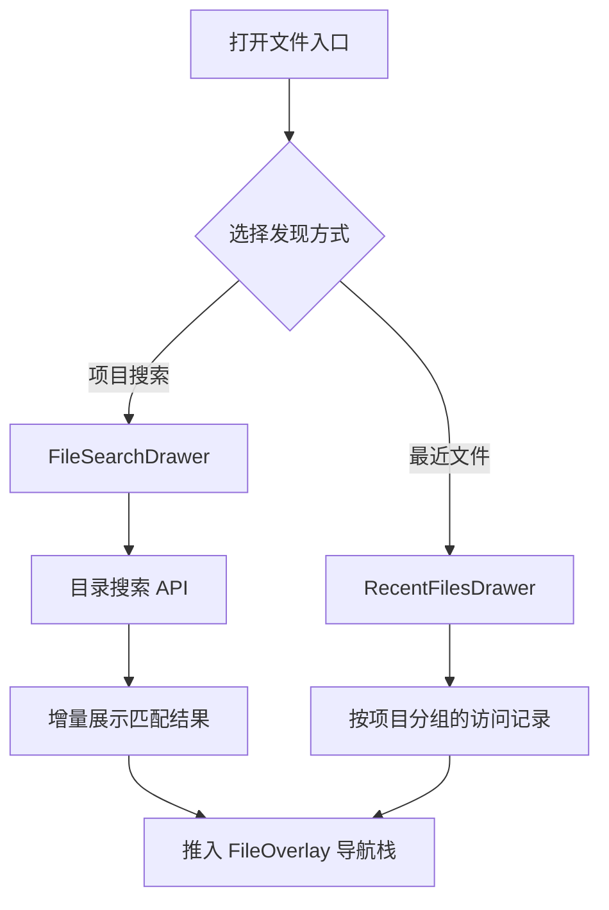

# 文件发现

文件发现补足传统目录浏览：用户可以按名称搜索整个项目，也可以从最近访问记录直接回到常用文件。它面向目录层级深、项目规模大和移动端输入不便的场景。

## 流程图

### 搜索与最近文件打开流程

搜索结果和最近文件最终都进入同一个文件覆盖层导航栈，因此预览、返回和关闭行为与普通目录点击一致。最近文件记录关注用户实际打开过的内容，不等同于文件修改时间。

## 功能与设计要点

### 功能清单

- **全项目文件搜索**：从独立抽屉按名称搜索目录树，默认非递归（仅当前目录），可切换为递归搜索全项目。增量展示结果。用户无需逐层展开目录即可定位文件
- **最近文件**：记录近期打开的文件，并按项目组织。跨项目工作时可以快速恢复上一处阅读位置
- **统一打开行为**：搜索和最近记录都通过 `useFileNavStack` 打开覆盖层，支持文件内链接继续入栈和返回上一个文件
- **失效项处理**：文件已删除或移动时不会阻塞整个列表，刷新后可清除不可用记录

### 设计要点

- **发现入口与目录状态解耦**：搜索文件不会改变底层目录浏览位置，关闭覆盖层后仍回到原目录
- **搜索使用专用通道**：大目录搜索允许持续返回进度，避免长请求阻塞 UI
- **最近记录按用户行为产生**：只有真正打开文件才计入最近列表，搜索曝光不算访问
- **复用文件预览栈**：所有入口共享相同导航模型，避免搜索结果形成第二套文件查看器
