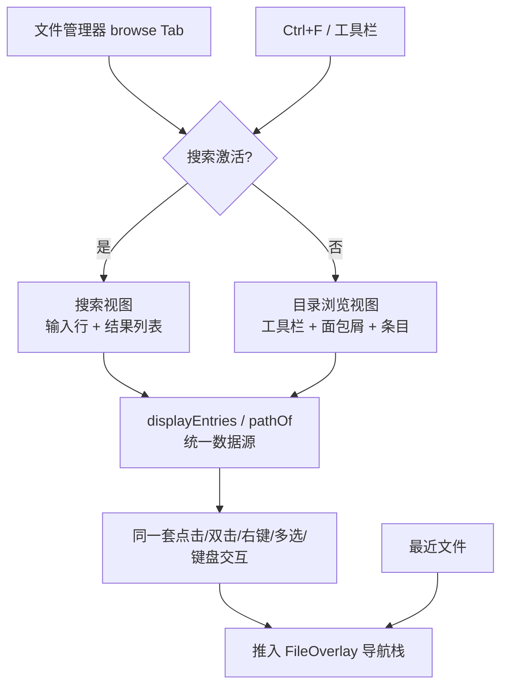

# 文件发现

文件发现补足传统目录浏览：用户可以按名称搜索整个项目，也可以从最近访问记录直接回到常用文件。它面向目录层级深、项目规模大和移动端输入不便的场景。搜索已**融合进文件管理器主界面**——不再是独立的 BottomSheet 弹框，而是在 `browse` Tab 内整体切换出一个搜索视图，结果复用目录条目的全部交互。

## 流程图

### 搜索融合进文件管理器的视图切换

搜索结果与目录条目共用同一套渲染与交互处理函数，因此双击打开、右键菜单、多选、键盘导航的行为完全一致；搜索态下"基于当前目录"的操作（空区右键新建、拖拽/粘贴到当前目录）被禁用，因为它们没有明确的落点目录。

## 功能与设计要点

### 功能清单

- **内嵌文件搜索**：`browse` Tab 内整体切换出搜索视图，搜索栏常驻——空查询显示目录列表，输入即过滤为结果。支持按文件名搜索、精确匹配（exact）、递归搜索（recursive）和范围切换（当前目录/全局），结果实时流式展示。搜索与多选**解耦**：清空搜索不退出多选，多选时也能继续搜索
- **结果展示所在目录**：全局或递归搜索时，每条结果在文件名下方显示其所在目录（根目录项不显示），帮助用户在多个同名文件间区分目标；普通当前目录非递归搜索不显示（命中位置已显然）
- **全局搜索蕴含递归**：`scope=global` 时强制递归（`effectiveRecursive = global || recursive`）——非递归的项目根搜索只能命中顶层，失去"全局"的意义。用户显式递归偏好保留，退出全局后恢复；全局时递归按钮置灰但显示为 active
- **结果高亮与定位**：文件名逐字符转义后以 `<mark>` 高亮匹配（防 XSS）；结果保留"定位所在目录"按钮，一键退出搜索并导航到文件所在目录
- **PC Shift 范围选**：以最后一次普通点击为锚点，Shift+click 从锚点重建范围（锚点前已有选择保留）；跨目录/跨查询后锚点失效时回退重设锚点并选中该项，而非静默清空选择
- **最近文件**：记录近期打开的文件，并按项目组织。`view` Tab 无文件打开时显示最近文件列表作为空状态，跨项目工作时可以快速恢复上一处阅读位置
- **统一打开行为**：搜索和最近记录都通过 `useFileNavStack` 打开覆盖层，自动切换到 `view` Tab，支持文件内链接继续入栈和返回上一个文件
- **失效项处理**：文件已删除或移动时不会阻塞整个列表，刷新后可清除不可用记录

### 设计要点

- **搜索与目录浏览共用一套数据源**：`displayEntries` 计算属性在"当前目录条目"与"搜索结果"间分叉，`pathOf(entry)` 统一取路径（浏览态 `joinPath(currentDir, name)`、搜索态结果的项目相对路径）。渲染与交互因此零复制——搜索结果天然拥有目录条目的双击、右键、多选能力，避免维护第二套交互逻辑
- **搜索态保留而非销毁**：点搜索结果中的文件只打开预览、保持搜索（跨 `browse`↔`view` Tab 切换保留，因 v-show 挂载不销毁）；点目录结果则退出搜索并导航。用户可连续点击多个结果对比
- **搜索融合进主界面而非独立弹框**：弹框无法复用文件管理器的条目交互，且打开/关闭的上下文切换成本高。融合后搜索成为一种"视图状态"，与多选等状态正交组合
- **发现入口与目录状态解耦**：搜索文件不会改变底层目录浏览位置，打开文件自动切换到 `view` Tab
- **搜索使用专用通道**：大目录搜索允许持续返回进度，避免长请求阻塞 UI
- **最近记录按用户行为产生**：只有真正打开文件才计入最近列表，搜索曝光不算访问
- **复用文件预览栈**：所有入口共享相同导航模型，避免搜索结果形成第二套文件查看器
