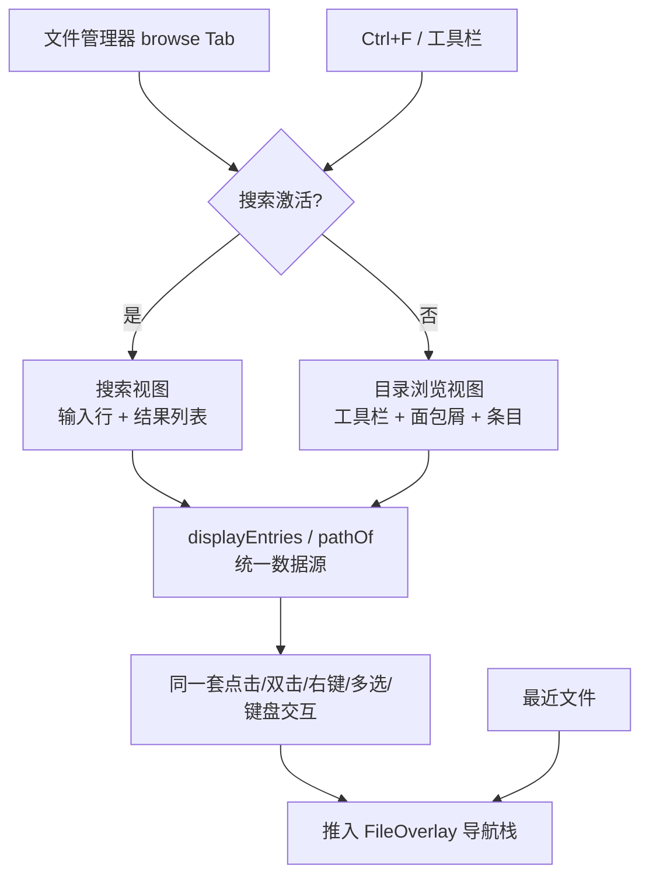

# 文件发现

文件发现补足传统目录浏览：用户可以按名称搜索整个项目，也可以按**内容**搜索（grep），还可以从最近访问记录直接回到常用文件。它面向目录层级深、项目规模大和移动端输入不便的场景。**按文件名搜索已融合进文件管理器主界面**——不再是独立的 BottomSheet 弹框，而是在 `browse` Tab 内整体切换出一个搜索视图，结果复用目录条目的全部交互；**按内容搜索**则是独立的响应式对话框（桌面居中宽面板 / 移动端底部抽屉），因为它要打开文件并跳到行，与"过滤当前列表"是两种不同任务。

## 流程图

### 搜索融合进文件管理器的视图切换

搜索结果与目录条目共用同一套渲染与交互处理函数，因此双击打开、右键菜单、多选、键盘导航的行为完全一致；搜索态下"基于当前目录"的操作（空区右键新建、拖拽/粘贴到当前目录）被禁用，因为它们没有明确的落点目录。

### 内容搜索（独立对话框）

```mermaid
flowchart TD
    A[Ctrl+Shift+F / 工具栏 SearchCode] --> B[ContentSearchDialog]
    B --> C[useFileContentSearch<br/>SSE /api/file/content-search]
    C --> D{事件}
    D -->|result| E[按文件分组<br/>matches: line + text + rune ranges]
    D -->|done| F[files / matches / searched / truncated]
    D -->|error| G[正则非法等 → 就地报错]
    E --> H[折叠分组的匹配行<br/>mark 高亮]
    H --> I[点击某行 → open-file-overlay<br/>打开文件并跳到该行]
```

与文件名搜索的关键差异：结果单位是「文件 + 多行匹配」，且点击的落点是**文件内的行**，因此它必须打开文件覆盖层而不是过滤列表。

## 功能与设计要点

### 功能清单

- **内嵌文件搜索**：`browse` Tab 内整体切换出搜索视图，搜索栏常驻——空查询显示目录列表，输入即过滤为结果。支持按文件名搜索、精确匹配（exact）、递归搜索（recursive）和范围切换（当前目录/全局），结果实时流式展示。搜索与多选**解耦**：清空搜索不退出多选，多选时也能继续搜索
- **按内容搜索（grep）**：独立的响应式对话框（`ContentSearchDialog`），对标 VS Code 的「在文件中搜索」。支持**递归 / 正则 / 全词匹配 / 大小写敏感**四个选项，以及**文件包含 / 排除 glob**（gitignore 语法，如 `*.ts`、`!dist/**`）与**范围切换**（当前目录 / 整个项目）。结果按文件分组、可折叠，显示「N 个文件 / M 处匹配」；点击任意匹配行打开文件并跳到该行
- **入口**：文件管理器工具栏的 `SearchCode` 按钮，或 `Ctrl+Shift+F`。工具栏按钮在可折叠列表中**排位靠前**（紧随新建/上传之后）——`useToolbarOverflow` 保留列表前缀、折叠尾部，排在最后会让它在正常宽度下第一个消失进「更多」菜单，读起来像功能不存在
- **打开即最大化**：对话框以 `maximized` 打开（`BottomSheet` 的新 prop，对应 `ModalDialog` 的 `fullHeight`），铺满可用高度而非按内容自适应。搜索结果是一个持续增删的长列表，自适应高度会让面板每次出结果都伸缩跳动
- **绑定文件管理器 tab**：对话框内部 `useTabDrawer('browse')`，切走 tab 即隐藏、切回即恢复（查询与结果保留）。`BottomSheet` 会 teleport 到 `<body>`，不绑定就会浮在其他面板上；`autoRestore` 保持默认 true，因为搜索是进行中的任务而非一次性弹层
- **跳转复用既有流程**：点击命中行走共享的 `openFilePath(path, lineStart, undefined, 'browse')`，而不是自己派发 `open-file-overlay`。后者只压栈 + 切 tab，**不会加载文件**（没有任何 watcher 监听 `fileNav.currentFilePath` 去取内容），裸派发会打开一个空查看器；`openFilePath` 才包含存在性校验（失败弹「文件不存在」）、项目外路径处理、`store.selectFile` 取内容，以及带行目标的 overlay 事件，由导航协调器转成滚动 + 高亮
- **内容搜索为异步流式**：SSE 边扫边出结果（`result` 事件按文件聚合，`done` 收尾），大仓库搜索期间持续有反馈，不阻塞 UI；输入 300ms 防抖，切换选项立即重查
- **结果展示所在目录**：全局或递归搜索时，每条结果在文件名下方显示其所在目录（根目录项不显示），帮助用户在多个同名文件间区分目标；普通当前目录非递归搜索不显示（命中位置已显然）
- **全局搜索蕴含递归**：`scope=global` 时强制递归（`effectiveRecursive = global || recursive`）——非递归的项目根搜索只能命中顶层，失去"全局"的意义。用户显式递归偏好保留，退出全局后恢复；全局时递归按钮置灰但显示为 active。内容搜索同理
- **结果高亮与定位**：文件名逐字符转义后以 `<mark>` 高亮匹配（防 XSS）；结果保留"定位所在目录"按钮，一键退出搜索并导航到文件所在目录。内容搜索的命中行按后端返回的 **rune 偏移**区间高亮（合并重叠区间后再包 `<mark>`，避免嵌套标签）
- **忽略条目同样灰显**：搜索结果与目录列表一样携带「git 不会跟踪」标记，渲染时淡化文字与图标并说明原因——搜索往往是用户主动找某个被忽略的文件（本地配置、构建产物），因此结果照常返回、照常可打开，只做视觉区分，不静默过滤掉
- **PC Shift 范围选**：以最后一次普通点击为锚点，Shift+click 从锚点重建范围（锚点前已有选择保留）；跨目录/跨查询后锚点失效时回退重设锚点并选中该项，而非静默清空选择
- **最近文件**：记录近期打开的文件，并按项目组织。`view` Tab 无文件打开时显示最近文件列表作为空状态，跨项目工作时可以快速恢复上一处阅读位置
- **统一打开行为**：搜索和最近记录都通过 `useFileNavStack` 打开覆盖层，自动切换到 `view` Tab，支持文件内链接继续入栈和返回上一个文件
- **失效项处理**：文件已删除或移动时不会阻塞整个列表，刷新后可清除不可用记录

### 设计要点

- **搜索与目录浏览共用一套数据源**：`displayEntries` 计算属性在"当前目录条目"与"搜索结果"间分叉，`pathOf(entry)` 统一取路径（浏览态 `joinPath(currentDir, name)`、搜索态结果的项目相对路径）。渲染与交互因此零复制——搜索结果天然拥有目录条目的双击、右键、多选能力，也天然共享同一套「git 忽略」灰显与提示，避免维护第二套交互逻辑
- **搜索态保留而非销毁**：点搜索结果中的文件只打开预览、保持搜索（跨 `browse`↔`view` Tab 切换保留，因 v-show 挂载不销毁）；点目录结果则退出搜索并导航。用户可连续点击多个结果对比
- **搜索融合进主界面而非独立弹框**：弹框无法复用文件管理器的条目交互，且打开/关闭的上下文切换成本高。融合后搜索成为一种"视图状态"，与多选等状态正交组合
- **内容搜索反过来必须独立**：它的结果不是"条目"而是"文件内的行"，落点是打开文件并跳行，无法复用列表条目的交互；且需要容纳输入 + 六个选项 + 分组结果，塞进常驻栏会把浏览工具栏挤没。因此两者形态不同是刻意的，不是重复建设
- **内容搜索的二进制与规模防护**：按扩展名先跳过媒体/压缩包/可执行文件，再对无扩展名文件嗅探 NUL 字节；单文件超过 5 MiB 跳过；单文件命中行数上限 200（超出标记 `truncated` 并给出总数，提示打开文件查看全部）；超长行（压缩后的 bundle）在首个命中处开窗截断到 400 字符，避免整行塞进 DOM
- **目录剪枝与忽略规则复用**：内容搜索与文件名搜索共用同一套剪枝（`shouldSkipSearchDir` → `ignoredSearchDirs`）与 gitignore 判定，两个搜索对"哪些子树值得进"的答案一致；`dist` 这类目录即使被显式 include 也不会被复活，因为根本不会下降进去
- **剪枝表是共享的单一来源**：`ignoredSearchDirs`（`internal/handler/dir_search.go`）同时服务两个递归搜索，因此新增条目**同时**惠及文件名搜索与内容搜索。按目录名（非路径）匹配，故子项目里嵌套的副本（如 `backend/.venv`）同样被剪。已覆盖版本控制（`.git`/`.svn`/`.hg`）、依赖缓存（`node_modules`/`vendor`/`bower_components`）、Python（`.venv`/`venv`/`__pycache__`/`.pytest_cache`/`.mypy_cache`/`.ruff_cache`/`.tox`）、JS 工具链（`.next`/`.nuxt`/`.svelte-kit`/`.turbo`/`.parcel-cache`）、构建产物（`dist`/`target`/`.gradle`/`Pods`/`.dart_tool`）与 ClawBench 自身运行数据（`.clawbench`/`.clawbench-web`/`.clawbench-ci`——数据目录里是会话导出与日志，纯文本且体量大，搜它等于搜助手自己的历史）。**`build` 刻意不在表内**：`build` 目录本身必须被走进，才能让 Android 的 `build/outputs`（放 .apk）可达，其余部分由 `isStrictlyBelowBuild` 剪掉
- **剪枝表漏项的性能代价是数量级的**：依赖缓存而非用户源码主导遍历成本。实测本仓库一次全量内容搜索 31,637 文件 / 20.6s，补上上表后降到 4,747 文件 / 2.5s（约 8 倍）；单是 `.venv`（37k 文件 / 6GB）就占原耗时的 55%
- **`rg` 快在同一件事上**：ripgrep 默认跳过隐藏目录与 gitignore 内容，同口径（`--hidden --no-ignore`）下扫 140,409 文件 / 2.2GB 需 2.4s。**无可用 Go 库**（Rust 实现，`github.com/BurntSushi/ripgrep` 只是源码镜像），若采用只能作为外部二进制调用；且其功能面（`-i`/`-S`/`-w`/`-e`/`-g`/`--json`/`-m`/`--max-filesize`）与本实现一一对应，属可选优化而非必需
- **发现入口与目录状态解耦**：搜索文件不会改变底层目录浏览位置，打开文件自动切换到 `view` Tab
- **搜索使用专用通道**：大目录搜索允许持续返回进度，避免长请求阻塞 UI
- **最近记录按用户行为产生**：只有真正打开文件才计入最近列表，搜索曝光不算访问
- **复用文件预览栈**：所有入口共享相同导航模型，避免搜索结果形成第二套文件查看器

