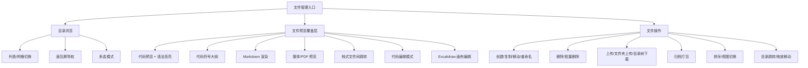
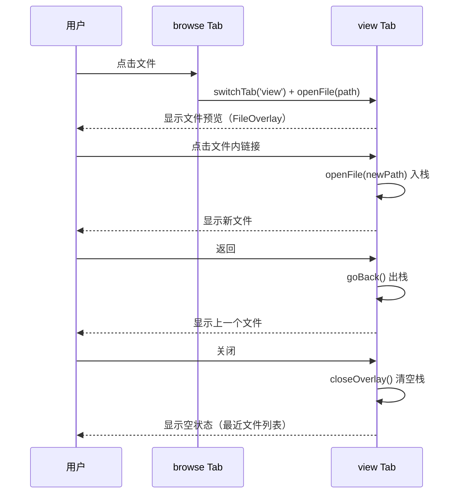
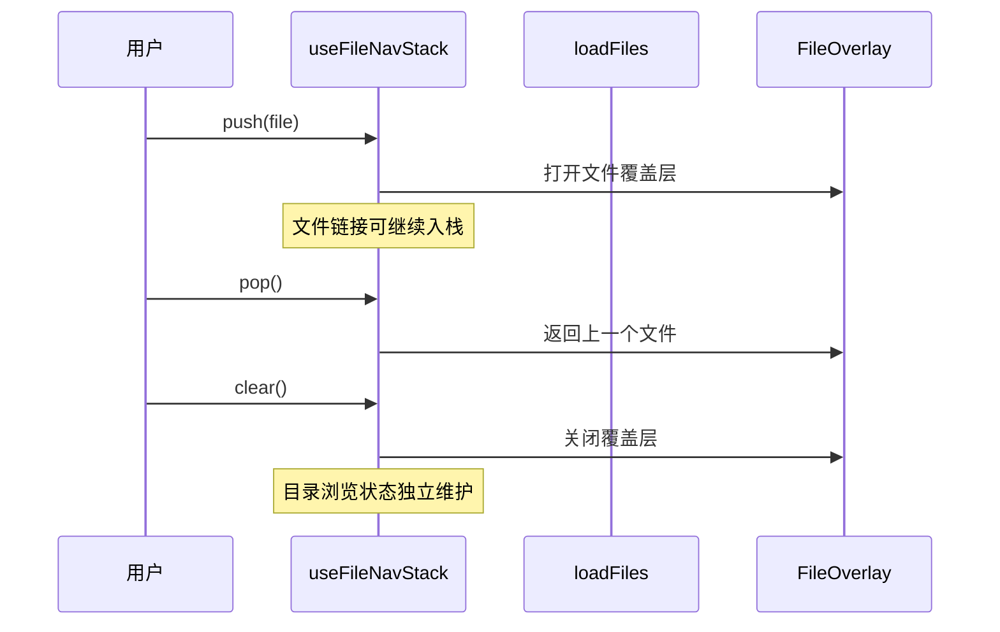
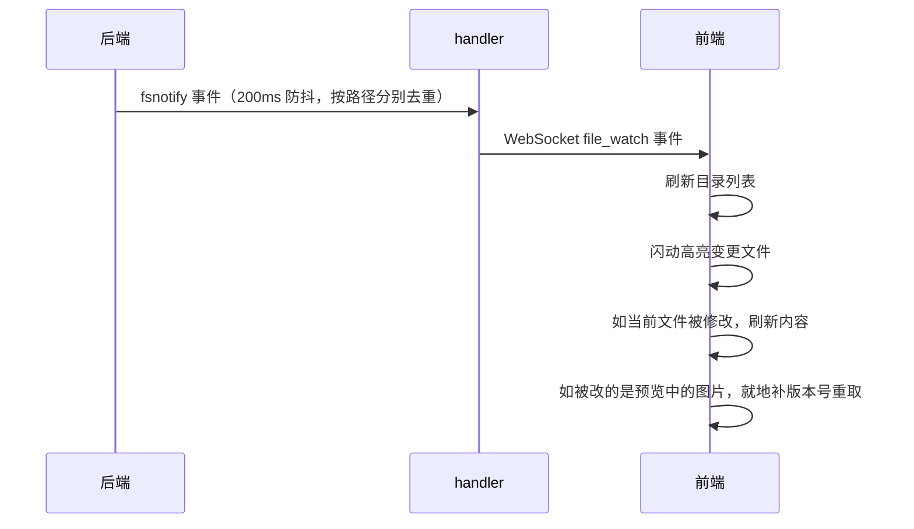

# 文件管理

文件管理让用户在 Web 界面中浏览、查看、编辑、上传项目文件——这是代码工作站的基座能力。目录浏览（`browse` Tab）和文件查看（`view` Tab）各自独立：目录浏览专注文件列表操作，文件查看以覆盖层形式展示文件内容，支持栈式导航在文件间跳转。目录浏览也采用栈式导航，支持多级目录的 push/pop/truncate 操作。文件路径标注支持双候选路径解析，优先基于当前文件目录解析，解析失败时自动回退到项目根目录。文件跳转返回时精准还原阅读位置——同一文件复用像素 scrollTop，rendered↔raw/编辑切换用行锚点。从目录浏览到代码预览，从文件上传到符号提取，覆盖了日常开发中"看代码、传文件、下归档"的核心场景。

## 流程图

### 文件操作链路

### 文件覆盖层导航

### 目录导航栈

### 文件变更监听

## 功能与设计要点

### 功能清单

- **目录浏览**：列表和网格两种视图，面包屑导航（分隔符为 `/`），支持多选操作。目录导航采用栈式模型，支持 push/pop/truncate 操作，加载失败时自动回滚到上一个状态。移动端文件浏览最基本的能力。多选时顶部工具栏**原地替换**为多选工具栏（复用相同按钮样式与高度，面包屑始终可见），替代了原先贴底的独立操作栏；PC 端支持 Shift+click 范围选
- **目录跳转**：在文件管理器工具栏中点击定位按钮，弹出路径输入对话框，输入后直接跳转到目标目录。支持 Enter 确认和 Esc 关闭
- **文件预览覆盖层**：点击文件时切换到 `view` Tab，以覆盖层形式预览文件内容。覆盖层支持栈式导航——文件中的链接可以继续打开新文件（入栈），返回时出栈回到上一个文件，关闭覆盖层清空栈后显示空状态（最近文件列表或"打开文件管理器"按钮）
- **文件查看与编辑**：代码文件使用 CodeMirror 渲染，支持浏览/编辑双模式切换。浏览模式提供语法高亮、行号、VS Code 风格 sticky scroll（作用域定义行钉顶）和代码符号大纲；编辑模式提供 undo/redo、脏状态追踪、退出确认和语言感知的自动补全（11 种语言，基于 CodeMirror 内置补全源）。Markdown 支持渲染预览与源码编辑的标题锚定滚动同步；图片、PDF、音频（内联播放器）、视频（内联播放器）和 Office 文档使用专用预览器；OpenAPI 文件以 Swagger UI 渲染，支持"Try it out"在线测试（CORS 代理转发 API 请求绕过浏览器限制）。无法安全预览的类型回退到下载或文本模式
- **文件内查找（VS Code 风格搜索条）**：`Ctrl+F`/`Cmd+F` 在代码查看与 Markdown 预览中打开内嵌搜索条——三个选项图标（大小写 Aa / 全词 ab / 正则 .*）内联在输入框内，支持上一个/下一个跳转、匹配计数，编辑模式下附带替换行。CodeMirror 用自定义 ViewPlugin 渲染面板（内建 `@codemirror/search` 面板的扁平 DOM 在窄面板下会把选项组/替换组拆行，自定义实现保证整组换行），Markdown 预览复用 `MarkdownSearchBar`（底部全宽内嵌条，不再弹 SearchDrawer 底部弹框）
- **TOC 停靠栏**：Markdown 渲染的目录面板支持左侧/右侧停靠切换（标题栏 PanelLeft/PanelRight 图标，偏好持久化到 localStorage）；导出 HTML 时 TOC 改为右侧内联常驻侧栏，可收起到窄 rail，点击条目滚动不关闭
- **Markdown 渲染与导出**：Markdown 渲染预览与源码编辑共享标题锚定滚动同步；渲染视图工具栏提供「导出 HTML」——不再克隆屏幕上 DOM，而是从源 markdown 经 `useMarkdownRenderPipeline` 共享渲染管线重建（与 MarkdownPreview 同一份 render + 路径标注 + 图片重写逻辑），产物为自包含单文件：mermaid 已渲染、图片 base64 内嵌、KaTeX 字体按文档实际用到的 family 转 data URI、固定右侧 TOC rail、携带用户代码/界面字体选择、灯箱缩放/平移交互。预览与导出共用管线避免样式漂移，`file://` 打开观感与 App 内一致
- **文件分享链接**：FileHeader 提供「分享链接」入口，为任意文件生成不可猜测的随机 token 公开链接（`file_shares` 表映射 token → 绝对路径 + 创建时快照的可读根）。任何人免登录即可只读查看（`/share/{token}` 独立 SPA，类型分派渲染：Markdown 带 TOC、代码、图片/PDF/音视频/Office、OpenAPI）并下载原文件。**分享不限文件大小、不限类型**：`/download` 与 `/local` 流式返回无上限，媒体类（图片/PDF/音视频/Office）经 `/local` 流式加载故大文件仍可在线预览；仅需把内容内联进 JSON 的 `/file` 与 `/content` 端点受 10MB 内联上限约束，超限时返回 `200 + tooLarge:true`（仅元数据、`content` 为空）由分享页降级为下载入口，而非拒绝链接。管理端点（POST/GET/DELETE `/api/share`）走鉴权，公开数据端点 `/api/share/{token}/file|content|local|download` 无鉴权——token 即唯一凭证，无记录一律 404 零暴露；读取范围以创建时快照的根为边界（文件在所选项目内则根为项目根，保留跨目录引用媒体；否则 fail closed 到文件所在目录）。重新生成旋转 token 使旧链接立即失效；删除/批量删除/重命名/移动文件自动清理关联分享；「已分享文件」抽屉列出所有分享（打开文件/新标签页/复制链接/一键清空）
- **分享页内文件跳转**：分享的 Markdown 里的**相对链接**（`[指南](./docs/guide.md)`）可点击，在原页面内切换到被引用文件（顶部「返回」+ 浏览器后退均可回到原文档）。实现刻意不复用应用内的路径标注链路——那套以项目根解析、经鉴权端点打开，匿名读者两样都没有；改由 `web/src/share/shareLinks.ts` 只对 `<a href>` 相对链接解析出绝对目标并标注 `data-share-path`，`href` 同时改写为 `/share/{token}?path=…` 深链（无 JS 也能用：新标签/中键/复制链接），`MarkdownPreview` 在分享模式优先拦截点击改为原地切换。范围有意收窄：**仅 Markdown 相对链接**（不含行内 code / 正文裸路径，那些依赖鉴权 batch-exists 且易误报）、**不支持目录**（token 端点无目录列举能力，目录链接按 404 报「不可用」）。目标文件经新增的 `{token}/content?path=` 读取（与 `/file` 同 JSON 形状，故所有预览分支复用），边界与 `/local?path=` 完全一致；`/download` 同样支持 `?path=`，故切换后下载的是当前文件。被引用文件缺失/越界/是目录时页面就地报错并保留「返回」，不会把读者困在死链上
- **按 .gitignore 灰显条目**：目录列表与网格中，git 不会跟踪的条目（命中 `.gitignore`、`.git/info/exclude`、全局排除文件，或位于被排除目录之下）仅**淡化文字与图标**，行本身仍可正常打开/重命名/删除，悬停说明原因。它只是视觉提示而非过滤器——用户想看的往往正是那些被忽略的构建产物或本地配置。非 Git 仓库不出现该标记，行为与之前完全一致
- **Excalidraw 画布**：`.excalidraw`（或短别名 `.xdraw`）文件直接以画布编辑模式打开（无只读浏览态），通过 iframe 内嵌独立 Excalidraw 构建实现绘制与编辑。保存写回原文件，退出时检测未保存修改并确认；语言和主题跟随应用（自动发送到 iframe），与代码编辑器共享同一套脏检查保存流程。两个扩展名共用一个来源（`internal/model/file.go` 的 `excalidrawExts`），供 `IsTextFile`（决定是否可读）与 `DetectSubtype`（路由到画布编辑器）共用，避免两处漂移
- **代码符号提取**：通过 tree-sitter（纯 Go，无 CGO）从源代码文件提取 17 种符号（class、function、method、variable 等），支持 200+ 编程语言。用户快速了解文件的结构和 API
- **Sticky Scroll**：代码浏览模式下，将当前视口外层作用域的定义行（函数/类）钉顶显示，最多 5 行。点击钉顶行可平滑滚动到定义位置。基于后端 tree-sitter 符号数据，解决长文件中上下文迷失的问题
- **文件操作**：创建、复制、移动、重命名、删除、批量删除。所有路径操作都经过 symlink 感知的穿越防护，确保不会访问项目根目录之外的文件——安全是文件操作的底线
- **文件上传**：支持多文件上传，带进度跟踪。大小和数量由配置限制（`upload.max_size_mb`、`upload.max_files`）
- **文件夹上传**：支持拖放文件夹上传，保持嵌套目录结构（包括空目录），使用 webkitGetAsEntry 递归遍历。也支持通过文件夹选择器上传
- **目录树下载**：使用 File System Access API（FileSystemDirectoryHandle）将整个目录下载到本地，保持完整目录结构。后端提供 `ServeListTree` 端点递归列出文件
- **拖放移动**：文件管理器内拖放文件/目录到目标目录，实现文件移动
- **面包屑拖拽到聊天**：宽屏模式下，面包屑的每个段（含 Home 图标）可拖拽到聊天区域附加目录路径作为上下文——与文件管理器的拖拽附件使用相同的管道，Home 图标拖拽路径为 `/`
- **粘贴上传**：Ctrl+V 粘贴剪贴板图片上传到当前目录
- **缩略图生成**：图片文件自动生成缩略图，用于列表和网格视图的预览。避免加载全尺寸图片消耗带宽
- **内嵌文件搜索**：目录浏览 Tab 内整体切换出搜索视图（不再是独立弹框），支持按文件名搜索、精确匹配（exact）、递归搜索（recursive）和范围切换（当前目录/全局）。搜索结果实时流式展示、文件名高亮匹配，键盘上下导航、Enter 打开文件，并复用目录条目的双击/右键/多选交互。详见[文件发现](file-discovery.md)
- **按内容搜索（grep）**：工具栏 `SearchCode` 按钮 / `Ctrl+Shift+F` 打开独立的「在文件中搜索」对话框，对标 VS Code——支持递归 / 正则 / 全词匹配 / 大小写敏感、文件包含/排除 glob（gitignore 语法）与范围切换（当前目录/整个项目），SSE 流式返回、结果按文件分组可折叠、点击匹配行打开文件并跳到该行。与常驻的文件名搜索是两种不同任务（过滤当前列表 vs. 搜索文件内容并跳行），故形态不同。详见[文件发现](file-discovery.md)
- **排序**：按名称/时间/类型/大小排序，支持升序/降序
- **网格视图**：列表/网格切换，网格视图以缩略图展示
- **工具栏溢出**：响应式工具栏，窄屏时折叠到 More 菜单
- **引用到对话**：FileHeader 的引用按钮（气泡图标）打开与 Issue/PR 详情、Markdown 划取共用的引用输入框，把当前文件作为附件带上，用户在框内输入指令后一并发送。按钮本身不表示"已附加"状态（去掉了旧的开关语义与 active 高亮），已附加文件改在聊天输入框的 chip 上移除——一个按钮只做一件事，状态不再由按钮承担
- **文件类型图标**：根据文件扩展名显示对应的图标（代码文件、图片、音频、压缩包等），帮助用户在列表/网格视图中快速识别文件类型
- **归档打包**：选择文件/目录打包为 zip/tar 下载。移动端不方便 `tar czf`，一键打包是刚需
- **文件变更监听**：后端通过 fsnotify 监听文件变更，WebSocket 推送给前端，前端自动刷新目录和文件内容。用户不用手动刷新就能看到 AI 编辑的代码变化。**监听范围不只当前打开的文件**：前端把当前屏幕上渲染的本地图片（Markdown 预览、聊天消息、文件管理器缩略图）也登记给后端，这些图片被后台重写时同样推送 `file_change`，预览里的图就地刷新。打开的文件与登记的图片都通过其**父目录**监听而非直接监听文件——原子保存是「写临时文件 + rename」，会替换 inode，直接监听文件会静默失效
- **预览图片实时刷新**：Markdown 源码没变、只有被引用的图片在后台被重写时，`v-html` 渲染出来的 `` 不会被 Vue 重新渲染，浏览器也继续用已缓存的字节。因此变更到达时直接改写页面上所有该图片元素的 `src` / `data-full-src`（补 `?t=` 版本号）绕过 Vue——这是唯一能触达 `v-html` 表面的机制；同时维护按路径的版本表，Vue 绑定的图片 URL（图片查看器、媒体预览卡、缩略图）在重渲染时读取版本号，不会退回旧 URL。前端通过 MutationObserver 扫描 DOM 自动获知「当前屏幕上有哪些图片」，无需各组件手动登记
- **刷新跳过加载遮罩**：文件管理器的刷新操作（删除、重命名、文件监听变更、tab 切换等）不显示全屏加载遮罩，内容平滑替换；仅首次打开时显示加载遮罩，给用户视觉反馈
- **文件刷新与差异高亮**：`useFileRefresh` 统一三种刷新触发（手动刷新按钮、fsnotify 自动刷新、聊天驱动刷新），保存滚动位置并高亮变更。Markdown 渲染模式使用块级差异标记（无闪烁动画），代码文件使用行级差异 + 两阶段闪烁（红色删除→蓝色新增）。编辑中文件被外部修改时弹窗确认，防止静默覆盖用户未保存的编辑。并发刷新自动去重和合并
- **文件路径标注**：聊天中和代码预览中出现的文件路径自动标注为可点击链接，点击打开文件查看器。支持双候选路径解析：优先基于当前文件所在目录（baseDir）解析相对路径，解析失败时自动回退到项目根目录解析——解决相对路径在不同上下文中可能指向不同文件的问题。**项目外路径（文件与目录）同样可标注和打开**：外部文件走 `/api/fs/file?target=<绝对路径>`，外部目录走文件管理器的项目外浏览（见下条）
- **失效路径必须可见，不能静默消失**（issue #501）：`/api/file/batch-exists` 是刚性 stat 判定，不存在与通配符都返回 `none`。旧行为是「撤销一切可点痕迹」——`` 被解包成裸文本、`<a>`/`<code>` 去掉标注类却**保留 href**，于是死链看起来、点起来都和活链一样，只有点击后才 toast「文件不存在」。现在验证为 `none` 且无可用 fallback 时，元素**保留标注类与文本**（仍是一个 chip，只是变灰），加上 `chat-file-path-inert` + `data-path-type="none"` + 说明性 `title`，`<a>` 额外移除 `href`（存入 `data-inert-href` 仅作诊断）并置 `aria-disabled`。`data-file-path` 有意保留，使列表重挂载后的 `reverifyAnnotations` 能重新标注；`data-path-type="none"` 是各点击处理器（只认 `file`/`dir`）放行它的依据——`FileOverlay`、`TableRowModal` 等直接匹配 `.chat-file-path` 的宿主必须显式排除它。**通配符模式**（`src/*.go`、`**/*.ts`）在标注阶段就被识别（与后端 `containsGlobChars` 同形），同样标记为 inert 并提示「这是通配符模式，不是文件路径」，而不是渲染成一个点不动的普通链接
- **inert 的视觉声明必须压过活 chip 规则**（issue #501 回归）：inert 元素**故意保留** `data-file-path` 且留在原祖先内，因此会同时命中活 chip 的祖先作用域规则——`.chat-message.assistant .chat-file-path` / `.chat-message.user .chat-file-path`（均 0,3,0）、`.markdown-body .chat-file-path` / `.table-row-value .chat-file-path`（0,2,0）、`.chat-file-path[data-file-path] { cursor: pointer }`（0,2,0），以及 hover 时 `.chat-message.assistant a:hover { text-decoration: underline }`（0,3,1）。裸 `.chat-file-path-inert` 是 (0,1,0)，**背景、光标、下划线三项全部输掉**——失效路径因此仍带活 chip 底色、鼠标仍是手型、hover 还多出一条实线下划线，与「看起来和活链一样」的原症状同形。故这三项声明一律带 `!important`（`color` 早已如此）。守护见 `web/src/assets/__tests__/annotationButtons.css.test.ts`：它不是 grep `!important`，而是**解析真实级联**（收集所有可命中 inert 元素的规则、算特异性、按 `!important` → 特异性 → 顺序选出胜者），新增竞争规则时会失败而非静默放行
- **失效路径可点击 → 按文件名在项目内搜索**（issue #501 后续）：路径标注只校验**两个**候选（相对当前文件目录、相对项目根，见 `resolveFilePathDual`），两者都不中即标 `none`——但文件通常仍在项目里，只是 AI 猜错了目录前缀。故验证失效的 chip 变成搜索入口：点击 → `deriveSearchQuery` 取 **basename**（后端 `exact` 比的是目录项 `Name()` 而非全路径，故必须传 basename，前缀错也能命中）→ `InertPathPicker` 用 `useFileSearch`（`scope='global'` + `exact=true` + `immediate`，即全项目递归精确搜索）→ 候选列表 → 点选后经 `openFilePath` 打开。**行号先转存**：`verifyFilePaths` 原本直接删除 `data-line-*`，现改为转存到 `data-inert-line-*`（live 名字是「可解析行目标」的契约，不能留），点选候选时带上，落在原意图行。**两种 inert 形态语义不同**：通配符模式（`markInertLink` 在加标注类**之前**触发）产出裸 `<a class="chat-file-path-inert">`，**无 `data-file-path`**，保持纯提示（`cursor: help` + `aria-disabled`）；验证失效保留 `data-file-path`，改 `cursor: pointer` 并**移除 `aria-disabled`**（可交互元素标 disabled 会把可操作控件从辅助技术里藏起来）。`data-file-path` 的有无正是判别依据，也是 CSS 拆分 `cursor` 的选择器（`.chat-file-path-inert[data-file-path]`，0,2,0 压过基规则 0,1,0）。**点击拦截是单一 document 捕获层**（`web/src/utils/inertPathClick.ts`）：12 个宿主里 10 个用 `:not([data-path-type="none"])` 排除 inert，但 `ToolDetailDrawer` / `FileDiffsDrawer` 匹配裸 `.chat-file-path` 会对不存在的文件 emit `file-open`；逐点加守卫会重演 dragClickGuard「只覆盖 4/50」的教训。捕获层 + `stopPropagation` 一并压制它们。**两个顺序/边界约束**：①必须装在 `dragClickGuard` **之后**（该守卫用 `preventDefault` 而非 `stopImmediatePropagation` 抑制拖拽误点，同节点监听器仍会跑，故本层靠 `e.defaultPrevented` 区分拖拽与真点击）——由 `inertPathClickWiring.test.ts` 源码守卫钉住；②分享页（`isShareMode()`）必须短路，匿名只读不能触发需鉴权的 `/api/dir/search`。**面板不做 tab 绑定**：chip 可能出现在 chat/task/forge 任一面，`useTabDrawer(tabId)` 在窄屏按 `currentTab === tabId` 门控会静默吞掉面板，故直接绑共享 `open` 标志，改由 App.vue 在切 tab 时 `closeInertPathPicker()` 充当等效的 tab 作用域（BottomSheet teleport 到 body，否则会浮在新面板上）
- **本地图片加载失败要有兜底提示**（issue #501）：`rewriteImageUrls` / `createFixLocalImagePaths` 生成 `/api/fs/raw|thumb` URL 时**不做存在性预检**（图片不在 `verifyFilePaths` 的 `[data-file-path]` 扫描范围内），文件不存在时后端 404、浏览器只画一个无提示的裂图。`localMediaFallback.ts` 用一个 document 级**捕获阶段** `error` 监听（资源错误不冒泡）把失败的内容图片（`img.lightbox-img`）换成带文件名与「图片加载失败」的占位块，并隐藏该 figure 的浮动工具栏（否则 view 按钮会打开一个空灯箱）。原 `` 只隐藏不删除，并挂一次性 `load` 监听：文件稍后被创建时 `useMediaWatch` 补 `?t=` 触发重取，占位自动撤销。文件管理器自身的缩略图**不带** `lightbox-img`，它们有自己的 `@error` 回退到类型图标，两套兜底不重叠
- **项目外目录浏览**：文件管理器可以浏览项目根之外的目录（`currentDir` 为绝对路径）。目录列表按路径形态选端点——绝对路径走 `/api/projects`（对任意绝对目录返回与 `/api/dir` 相同的 DirEntry 结构），相对路径走 `/api/dir`（见 `web/src/utils/dirList.ts`）。配套约束：`joinPath` 对绝对 dir 保留根（否则 `/tmp` + `a` 会变成项目相对的 `tmp/a`）；行级操作（新建/粘贴/上传/复制路径/缩略图）一律把 `currentDir` 原样传递。后端的目录搜索（`/api/dir/search`）、文件监听（`/api/file/watch/ws`）与终端 cwd 同步支持绝对路径——三者原先都走 `model.ValidatePath`，而该函数是 **join** 语义，会把 `/tmp` 静默拼成 `<项目>/tmp`（搜索返回 0 条、监听盯错目录、终端开在项目根）
- **两个根：Home 恒为项目根，外部浏览另给文件系统根**：面包屑的 Home 图标**永远**表示项目根（`navigate('')`），与是否在项目外无关——这给用户一个无论走多深都存在的确定出口。因此外部浏览时额外渲染一个 `HardDrive` 面包屑指向**文件系统根**（POSIX `/`、Windows 盘符根 `C:/`），否则一旦 Home 被改成"项目根"，就没有回到 `/` 的入口了（Back 只会在文件系统内一路向上，最后停在 `/`）。`DirBreadcrumb` 的 `projectScoped` prop 区分两种宿主：文件管理器为 `true`（`''` = 项目根，外部时加根面包屑）；ProjectDialog 为 `false`（无项目概念，`''` 本就是文件系统顶层，Home 覆盖该语义，不加额外面包屑）。「上一级」按钮仍在文件系统内向上走，与 Home 的分工是"逐级向上 vs 一步回项目"
- **到达文件系统根时不能把出口藏起来**：面包屑的可见条件是 `parts.length > 0 || isExternalBrowse`，**不能只看 `parts`**——`splitPath('/')` 不产生任何段，只看 `parts` 会让整条面包屑（含唯一回项目的 Home）在 `/` 处消失，而「上一级」在 `/` 又是空操作（`dirName('/') === '/'`），用户被困在文件系统根。Windows 的 `C:\` 因保留 `C:` 段而从不触发，只有 POSIX `/` 会命中。配套：根面包屑在 `/` 时带 `current` 样式且点击无动作；「上一级」按钮在无父级时 `disabled`（不再提供点了没反应的假 affordance）；Back 的 `canGoBackDir` 与 `goBackDir` 必须共用同一个「有父级」判据——曾因 `canGoBackDir` 只看 `currentDir !== ''`（`/` 满足）而**消费了按键却什么都不做**
- **项目外的视觉区分**：项目外内容在四个面都有橙色标识（橙色是本项目既有的"项目外"约定色，见 `annotation-buttons.css` / `code-viewer.css`），统一走 `ExternalBadge` 组件与 `--color-orange` token（36 个主题均有定义，避免硬编码在浅色主题下对比度不足）。**标签固定为单个短词**（`file.nav.external`：外部 / External）+ 图标，完整含义放 `title`（`file.nav.externalTip`）——chip 是内嵌在密集行里的，早期写成「项目外目录 / 项目外文件」这类短语会把行内正文挤走；文件与目录的区分由图标承担（`FolderOpen` / `FileText`），不需要两套文案。四个面：**文件浏览**（面包屑栏右侧 chip）、**文件预览**（文件名旁）、**目录浏览**（同文件浏览，`currentDir` 为绝对路径即外部）、**目录预览**（标题行）。面包屑栏的 chip 固定在横向滚动区之外，长路径滚动时不会把"你在项目外"的提示一起滚走；面包屑本身的 Home 图标在外部浏览时也转为橙色，与左侧的文件系统根图标区分开（两个相邻的"根"不能长得一样）
- **二进制文件处理**：后端检测并安全处理二进制文件。检测阶段读取前 8KB 查找 null 字节；二进制文本最多返回 64KB，并将非打印字符替换为 `.`；大文本最多返回 512KB，并在 UTF-8 边界截断。默认响应对二进制文件返回 `isBinary: true` 和空内容，前端显示占位符及“Open as text”按钮，用户确认后通过 `?forceText=1` 获取净化文本
- **Markdown 代码链接预览**：Markdown 预览模式下，点击验证通过的代码文件路径或 `path:line` 链接时弹出代码切片预览浮层卡片。支持固定（Pin/Unpin）和头部拖拽；渲染侧有最大 200 行 / 512 KiB 切片保护与超大文件（> 2 MiB）警告，取数侧则按行窗口请求（见下条），大文件不会整体传输；触摸设备点击路径弹出 BottomSheet 抽屉；桌面端支持 Ctrl/Cmd+Click 快捷固定预览。提供 `markdownCodeLinkPreview` 本地设置开关（默认开启），关闭时完全禁用监听并清理 8 MiB LRU 缓存
- **停靠预览窗格**：文件管理器工具栏的预览开关（`ScanEye`）打开后，列表下方出现一个可拖拽高度的停靠窗格，点击列表项即在此处预览，不必离开文件管理器打开文件覆盖层。窗格按内容类型分流——文件走与 Markdown 代码链接预览同一套渲染（代码切片、媒体播放器、Markdown 渲染），**目录则列出其内容**（`useDirPreview` 按需拉取 `/api/dir`，因此可以预览并非当前列表所在目录的路径），列表体与快捷预览卡共用同一实现。目录列表的工具栏带**打开目录**按钮（与文件预览的"打开文件"按钮同款图标，语义一致：打开正在列出的这个目录本身，等价于文件卡里的 reveal-in-tree），两个宿主分别接线——文件管理器导航到该目录并收起窗格（列表已变成主列表，留着就是重复），快捷预览卡则展开其子目录。目录条目里的图片复用文件管理器列表同一套缩略图机制（失败时回退类型图标），**失败记录按完整路径而非裸文件名作键**——窗格是同一个实例在目录间复用，两个目录都可能有 `logo.png`，用裸名会把兄弟目录里本可用的缩略图也一并抑制。窗格与列表之间是可拖拽分隔条，PC 与移动端统一为单行 28px 标题栏 + 横向拖拽调宽。与文件覆盖层的分工是"就地速览 vs. 沉浸编辑"——窗格用来快速扫一眼，需要编辑时再进覆盖层
- **预览按行窗口取数，而非整文件下载后前端切片**：预览只渲染窗口内若干行，因此请求就只取这些行——`GET /api/file` 的 `lineStart`/`lineEnd`（1-based 闭区间）返回该区间并附 `totalLines`。请求窗口在渲染窗口两侧各留一段余量，使"展开更多上下文"是本地重切片而不是再发一次请求；窗口本身也有上限，避免退化成"给我整个文件"。行窗口只对文本生效，二进制与 `forceText` 路径忽略它返回完整净化内容；非法区间（0 / 负数 / 非整数 / 倒序 / 只传结束行）一律 400，**与文件类型无关**——先校验区间再判断类型，否则同一份非法请求会因文件类型不同而得到不同结果
- **键盘快捷键**：Ctrl+C/X/V 剪贴板操作、Delete/Shift+Delete 删除、Ctrl+N/Ctrl+Shift+N 新建文件/文件夹、F2 重命名、Alt+Up/Backspace 上级目录、Ctrl+R/F5 刷新、Ctrl+Shift+H 显示隐藏文件、Ctrl+Shift+M/Ctrl+A 多选、Ctrl+1/Ctrl+2 列表/网格切换
- **新建后自动选中并滚入视口**：新建文件/目录后自动选中新条目并滚动到可见位置——新建的价值在于"立刻对它做下一步操作"（改名、编辑、拖进去），如果新条目在列表末尾或折叠区外，用户还得自己找一遍。**搜索态是例外**：过滤条件可能不匹配新条目，此时不强行选中（否则会出现"选中了一个看不见的项"）

### 设计要点

- **目录与文件查看独立 Tab**：`browse` Tab 专注目录浏览和文件操作，`view` Tab 专注文件内容预览。打开文件自动切换到 `view` Tab，关闭文件后停留在 `view` 显示空状态（最近文件列表 + "打开文件管理器"按钮），不自动跳回 `browse`。两个 Tab 各自独立，目录浏览状态在切换到 `view` 期间保持不变
- **栈式导航支持深度跳转**：文件内的链接（代码中的 import、聊天中标注的路径）可以继续打开新文件，所有打开的文件构成导航栈。这与浏览器的前进/后退类似，但专门为代码阅读优化。返回体系（含跨界面跳转来源追踪、目录游历事务、滚动/阅读位置精准还原）见[统一返回与跨界面导航](../client/unified-back-navigation.md)
- **文件覆盖层使用导航栈**：`useFileNavStack` 管理文件预览栈。点击文件或文件内链接时入栈，返回操作出栈，关闭覆盖层清空栈；目录浏览和面包屑状态由文件管理模块独立维护
- **双候选路径解析**：文件路径标注时，相对路径同时解析出 baseDir 候选和 projectRoot 候选。标注阶段存储两个候选路径，异步验证时如果主候选不存在但备选存在，自动替换——避免因路径解析上下文不同而导致标注失效
- **路径穿越防护是 symlink 感知的**：路径校验先解析 symlink 再判断是否在项目根目录下——简单的字符串比较会被 symlink 绕过
- **分享链接以不可猜测 token 为唯一凭证，但凭证不等于无边界**：token 是分享链接唯一防线，因此刻意保持无状态公开访问（不给公开端点加登录），换取"发给任何人即开即用"的零摩擦；无分享记录时一律 404，功能不被使用时零暴露。关闭/重新生成即旋转 token 使旧链接立即失效，不需要令牌黑名单。**但公开端点不能只靠 token 就交出整台机器**：token 的授权范围在创建时（此时请求仍经鉴权）固化为一个根快照，读取时以该快照为边界比较，而不是复用文件浏览器的"可浏览整机"语义——否则持有任意一条有效链接就能读到任意绝对路径文件。边界取值按"最小可用"取舍：文件在所选项目内时取项目根（保留 `../images/x.png` 这类跨目录媒体引用，否则分享的 Markdown 图片全断），否则回退到文件所在目录；项目根**只来自请求携带的项目 cookie，不做"猜一个项目"的兜底**（兜底链会一路退化到 home 甚至 `/`，等于把漏洞原样放回）。迁移前的旧分享记录根为空，同样 fail closed 到文件所在目录，不会因历史数据重新打开缺口
- **gitignore 判定必须与 git 对齐，而不是近似**：文件管理器灰显与代码存量统计都依赖"git 会不会跟踪这个路径"，而 `.gitignore` 的语义（嵌套文件、否定规则、锚定、目录专属模式、`info/exclude`、全局排除文件）足够微妙，手写匹配器必然漂移。因此复用 go-git 的模式引擎，并额外叠加三条来自 index 的规则：**已跟踪文件永不忽略**（git 必须保证其可达）、**含已跟踪文件的目录永不忽略**、**任一真祖先目录被排除则整条路径忽略**（所以 `!build/keep.txt` 在 `build/` 被排除时无效）。判定结果已按真实 `git check-ignore` 做差分验证（本仓上万目录零差异），覆盖 linked worktree（`.git` 是文件、`info/exclude` 在公共 git dir）、symlink 按 lstat 计、以及全局排除文件在各平台的查找顺序差异
- **导出用共享管线而非 DOM 克隆**：HTML 导出从源 markdown 重跑渲染管线而不是克隆屏幕 DOM——克隆会把交互态样式、懒加载内容一并带入且随预览实现漂移；共享管线保证独立文档与 App 内预览逐像素一致，也避免两套渲染逻辑长期分叉
- **fsnotify 防抖**：文件保存可能触发多个底层事件（写入、属性变更、close），防抖避免前端反复刷新
- **缩略图是按需生成的**：不预生成所有图片的缩略图，而是请求时才生成——节省存储空间，且缩略图可从原图随时重建
- **预览器按能力分流**：`FileViewer` 根据文件类型选择 `OfficePreview`、`OpenApiPreview`、`PdfPreview`、`AudioPreview`（内联播放器）、`VideoPreview`（内联播放器）、`CodeMirrorViewer`（代码浏览+编辑）或 `MarkdownPreview`；所有本地资源统一通过[本地文件服务](../infra/local-file-serving.md)加载
- **HTML 预览靠文档自身 URL 解析相对引用，代价是必须放开 `allow-same-origin`**：HTML 文件经 `/api/fs/raw/` 以真实 URL 载入 iframe（项目内文件为 `/api/fs/raw/<目录>/x.html`），浏览器便以该文档的 URL 为基准解析它的相对引用，从而正确加载同目录的 CSS/JS/图片/字体。此前用 `srcdoc` 内联，`about:srcdoc` 没有自己的 URL、继承父页面的 base，所有相对引用都打到应用根目录而 404。**该方案必须同时给 sandbox 加 `allow-same-origin`**：否则 iframe 是不透明 origin，子资源请求算跨站，`SameSite=Lax` 的会话 Cookie 不下发——文档本身仍能加载（顶层导航算 same-site），但它的资源全部失败。**代价是预览的 HTML 以用户会话运行**（可调任意鉴权接口、读写父页面 DOM），而预览内容不可信（AI 生成或下载而来）。这是主动取舍，`web/src/components/__tests__/fileViewerSandbox.test.ts` 记录该决策及其成本（该测试原先断言相反的行为）。两个配套约束：①网页资源 MIME（`.html/.css/.js/.woff2` 等）**只加在鉴权端点**，公开的 `/api/share/{token}/local/` 有意不继承——在免鉴权端点返回 `text/html` 会让已登录访客同源执行被分享的 HTML（实测可读取鉴权接口并外传）；②**项目外（绝对路径）HTML 回退到 `srcdoc`**，因为其 URL 形如 `/api/fs/raw/?target=/abs/x.html`，浏览器取 base 时会丢掉查询串，相对引用会解析成 `<项目根>/pic.png`——同名文件存在时静默加载错误文件，比 404 更危险
- **符号提取有文件大小限制**：超过 1MB 的文件跳过符号提取，避免大文件拖慢响应。Markdown 文件特殊处理，提取标题层级而非代码符号
- **CodeMirror 浏览/编辑双模式**：同一组件通过 `editable` prop 切换浏览与编辑模式。编辑模式使用特殊引用管理避免 Vue reactive proxy 破坏 CodeMirror 的 undo/redo；未保存时退出触发确认对话框。代码编辑是文件查看的自然延伸——用户看完代码后直接修改，无需切换工具
- **Markdown 标题锚定滚动同步**：在 Markdown 渲染预览与源码编辑之间切换时，通过最近 TOC 标题锚定滚动位置。标题对齐为主策略，百分比比率为降级方案——解决切换视图后丢失阅读位置的问题
- **Markdown 代码预览的单例与事件委托设计**：全屏范围内至多维持一个活动预览实例，避免多浮层重叠消耗 DOM 与内存。在 Markdown body 根节点使用事件代理监听 `mouseout`/`focusin`/`focusout`/`click`，零侵入 marked 渲染产物；仅针对经过验证的 `data-path-type="file"` 目标触发预览。4 象限智能锚定（`placeNearAnchor`）结合 CSS zoom 自适应边界计算，确保任何视口尺寸与缩放比例下弹窗不溢出
- **目录树下载使用 File System Access API**：选择本地目标目录后逐文件写入，无需后端打包，支持任意大小目录
- **文件夹上传使用 webkitGetAsEntry**：递归遍历拖放的目录项，提取所有文件（含相对路径）和空目录，回退到扁平模式
