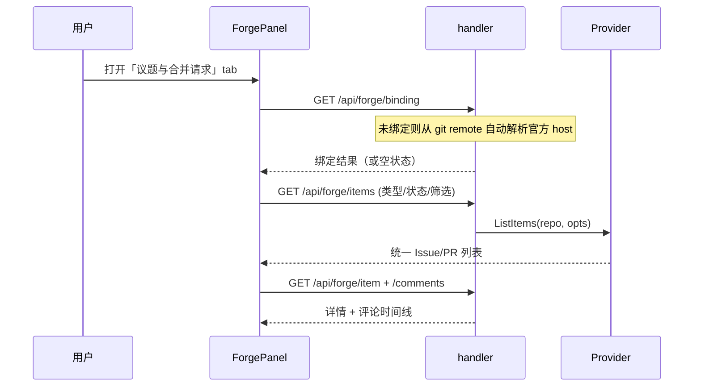
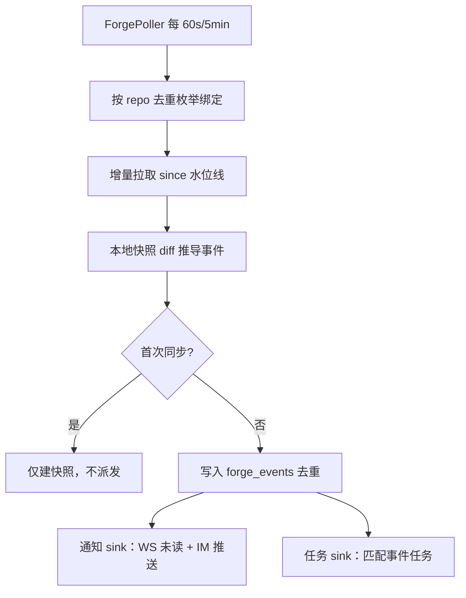
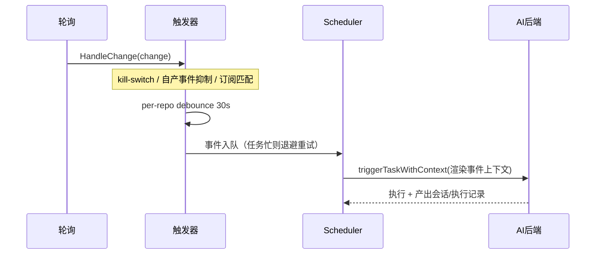

# Forge 集成（GitHub / GitLab）

Forge 集成把远端仓库的 Issue 与 PR/MR 引入 ClawBench：项目内可直接浏览列表与详情（正文 + 评论/时间线），后台持续感知仓库变化并推送通知，还能把仓库事件变成"事件触发 AI 任务"——新 issue、被合并的 MR、新评论都可以自动唤起一个预定义的 AI 任务去分析、总结或跟进。这套能力让 AI 从"我主动问它"扩展到"仓库有事它自己动"。

**读写边界**：ClawBench 自身的 forge API 调用是**只读**的（`Provider` 接口不含任何写方法，后端不评论、不 review、不改状态）。但事件触发的 AI 任务不受此约束——AI 可借助本地 CLI / `gh` / `glab` 等工具操作远端，因此"只读"描述的是 ClawBench 的 API 表面，不是自动任务的权限边界。

## 流程图

### 从绑定仓库到浏览

### 后台感知：轮询 → 事件 → 通知

### 事件触发任务

## 功能与设计要点

### 功能清单

- **仓库绑定**：项目与 forge 仓库一一绑定，绑定关系随项目走。优先从本地 git remote 自动解析（官方 host 自动绑定，自建实例需确认），也支持手动填 URL。绑定是事件任务的作用域来源——事件任务不单独配置仓库，而是跟随所属项目绑定的仓库
- **Issue / PR 浏览**：独立 Dock tab「议题与合并请求」（英文 `Issues & PRs`），类型 chip（Issues / PRs）+ 状态 chip（Open 默认 / Closed / All）+「跟我相关」chip（全部 / 分配给我 / 我提的 / 待我 review，身份从 token 自动获取）。列表按更新时间倒序、滚动分页、服务端搜索；详情原地替换列表并带面包屑返回，展示正文 + 评论/时间线（不含 diff），复用共享 Markdown 渲染管线
- **未读与通知**：tab 带未读徽标。设置里六类事件开关（新开 / 关闭 / 合并 / 重开 / 评论 / CI 完成，默认全开）。未读计数**与通知开关解耦**——它表示"列表里有新变化"，即使某类事件通知被关闭，未读仍计数（否则全关时徽标死掉而 AI 任务照跑，用户零信号）
- **事件触发 AI 任务**：任务表单可选「触发方式：定时 / 事件」。选事件后展开事件类型多选（`issue.opened`、`pr.merged` 等按 kind 分域，merged 仅 PR），prompt 区上方出现**只读事件上下文块**（按事件类型条件渲染适用变量，不适用整行省略），与用户输入拼接为最终 prompt。事件到达即执行，产出会话 + 执行记录，四通道通知，执行记录带来源链接可深链回原始 issue/PR
- **引用到对话**：详情页 header 的引用按钮（消息图标）把 issue/PR 变成聊天内容——复用全站共享的引用输入框，issue/PR 地址作为 **URL 附件**（chip 文案 `owner/repo#123`）进入输入框，用户可再划取文本补充，最终消息为 URL 附件 + 选中文本 fence + 用户输入。当前项目无活跃会话则新建并切到聊天 tab。详情正文也支持双击复制 + 划取引用（与 Markdown 预览同一链路）
- **凭据按 host 隔离（R4）**：token 存储键为 `(platform, host)`，不再是单一全局 token。自建 GitLab 实例各自独立凭据，一个 host 被控不影响其他 host。`GET /api/config` 不回传密钥明文，改为回传 host 存在性标记（write-only 语义，与密码字段一致）；`config.yaml` 权限为 `0600`。自建实例支持「跳过 TLS 校验」开关（默认关，用于自签名证书）
- **事件任务护栏**：全局 kill-switch「暂停所有事件触发」；识别 AI 自身账号产生的写操作事件并**抑制**（防递归）；per-repo 同类型事件 debounce 合并；事件队列（任务忙时入队退避重试而非丢弃）；`pipeline_done` 为保留但不再提供的类型（当前无派发路径）

### 设计要点

- **Provider 抽象隔离平台差异**：`internal/forge/` 定义统一的 `Provider` 接口与模型（`Item`/`Comment`/`Change`），GitHub 走 `google/go-github`，GitLab 用自建轻量 REST v4 client——刻意避开官方 SDK 的重依赖树（protovalidate/protobuf/cel-go/graphql-go/keyring）。平台差异（GitHub 只有 `owner/repo` 两段、GitLab 允许多级 group；GitLab `merged`/`locked` 归一为 closed；GitHub issues 端点混入 PR 需剔除）在 adapter 内消化，上层只见统一模型
- **变化靠本地快照 diff，而非平台事件 API**：GitHub `issues?since` 只表明"变了"而不表明"变成了什么事件"，GitLab events API 粒度只到天。因此以水位线增量拉取 + `forge_items` 快照对比推导事件，把"发生了什么"的判断权握在自己手里。水位线**必须整批（所有页）拉完才推进**，边界用严格 `>` 加 1s 重叠窗口，并对事件做 `dedupe_key` 去重——不依赖时间戳唯一性
- **未读与通知解耦**：两者共用同一事件源但独立于开关。通知是"提醒你"，未读是"有变化"——把两者绑在一起会让关闭某类通知连带让徽标失去意义，而 AI 任务仍在后台触发，用户彻底失去信号
- **防递归靠身份识别而非提示词**：`CLAWBENCH_SCHEDULED=1` 只能阻止 AI 通过 `/cb-task` 再建任务，挡不住 AI 用 `gh`/`glab` 写回 forge 再触发自己。因此触发器解析凭据对应的账号登录名（缓存 10 分钟），抑制 acting actor 等于该账号的事件——比对 item 作者会漏掉"AI 评论别人的 issue"
- **事件不丢优先于事件及时**：运行中再来事件若沿用"直接丢弃"会丢数据。改为持久化事件队列 + 退避重试（任务忙时 10s 退避、最多 30 次），配 per-repo debounce 合并突发——宁可延迟，不可静默丢失
- **绑定是事件作用域的唯一来源**：事件任务不单独配置仓库，其项目绑定的仓库即作用域。这消除了"任务配的仓库"与"项目绑的仓库"两份状态不一致的可能；轮询单元是 repo（`host + owner/repo`）而非绑定行，同一 repo 被两个项目绑定只轮询一次

## 关键机制

### 事件推导

`DeriveChanges` 对比存储快照与最新状态，按状态转移推导事件：无→有 `opened`、open→closed `closed`、出现 merged 标记 `merged`、closed→open `reopened`、评论 id 或 `updated_at` 变化 `commented`。同一轮内多段转移（如 closed → reopened → merged）按终态优先级只派发最有信息量的一个（merged > reopened > closed），并在 payload 保留原始状态序列。

评论检测用 `(last_comment_id, last_comment_updated_at)` 双键——评论被编辑时 id 不变、仅 `updated_at` 变，单 id 会漏。首次全量建快照但**不派发历史事件**（水位线初始化为"现在"）。

### 限流与退避

per-host 令牌桶 + 全局并发上限，避免多 repo 同时打满限额；处理 `429`/`403` 的 `Retry-After` 头并指数退避（抖动 ±20%，上限 5 分钟）。GitHub 认证限额 5000/hr，而状态 60s + 评论 5min + CI 的轮询约 130 调用/hr/repo，仅够约 38 个 repo，且交互请求共用配额——因此评论类独立降频（5min），并使用 ETag / `If-None-Match`（304 不计限额）。token 失效（401）时暂停该 host 轮询并置为可见错误状态，不持续重试。

### URL 附件

`FileEntry` 增加 `kind`（`file` / `url`）与 `url` 字段。URL entry 在后端**跳过本地路径校验**（不 `os.Stat`、不落 `Files`），但校验 URL 安全性（仅 http/https + host，拒绝 `javascript:`/`data:`——该值会被持久化并重新渲染为 `href`）。前端按 `url` 去重、走独立发送通道、以链接样式渲染 chip。

## 数据模型

| 表 | 用途 |
|---|------|
| `project_forges` | 项目 → 仓库绑定（`project_path` 归一化，`source` = auto/manual，含 opt-out 标记） |
| `forge_items` | 每个 issue/PR 的本地快照（状态、merged 标记、评论双键、`comments_baselined` 区分"零评论"与"从未拉取"） |
| `forge_sync_state` | per-repo 水位线（`updated_at`）与同步状态 |
| `forge_events` | 派生事件（`dedupe_key` 唯一、`read_at` 未读标记、repo 索引） |
| `scheduled_tasks` | 增 `trigger_mode`（`cron`/`event`）与 `event_types`（逗号分隔订阅） |
| `task_executions` | 增 `event_url` / `event_summary` 供执行记录溯源 |

## API 端点

全部经 `middleware.Auth`：

- `POST/DELETE /api/forge/credentials` — 按 host 设置/清除 token（write-only）
- `POST /api/forge/verify-token` — 校验 token 是否可访问指定 host
- `GET /api/forge/items` — 列表（类型/状态/搜索/分页/跟我相关）
- `GET /api/forge/item` — 单条详情
- `GET /api/forge/comments` — 评论分页（旧→新）
- `GET/POST/DELETE /api/forge/binding` — 读取（官方 host remote 自动绑定）/ 设置 / 清除绑定
- `GET /api/forge/remotes` — 列出本地 git remote 解析出的 forge 仓库
- `POST /api/forge/test` — 验证已绑定仓库可达
- `GET /api/forge/unread` — 未读事件数
- `POST /api/forge/read` — 标记全部已读（进 tab 时调用）

## 已接受的限制

- **不做 webhook**：当前仅靠轮询感知变化，延迟为轮询间隔量级。webhook 接收（低延迟加速层）已有设计方案（`docs/plans/2026-09-12-forge-webhook.md`）但**尚未实施**
- **只读 API 表面**：ClawBench 不代劳远端写操作（不评论、不 review、不改状态），写操作由事件任务里的 AI 借助外部工具完成
- **`pipeline_done` 保留未启用**：CI 完成事件当前无派发路径，订阅键保留以免已存任务在编辑时被拒，但表单不再提供
- **轮询配额上限**：单实例可轮询的 repo 数受平台限额约束（GitHub 约 38 个），无自适应降频配置
