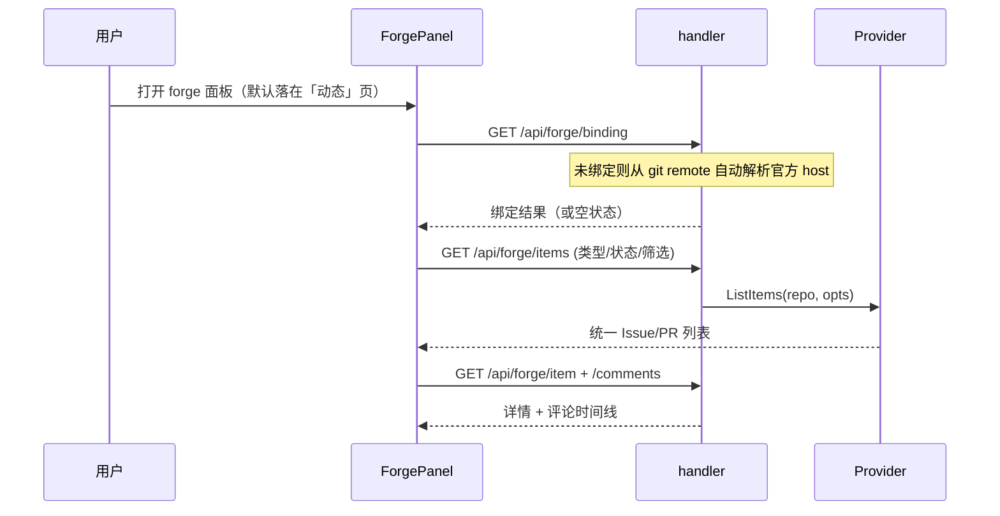
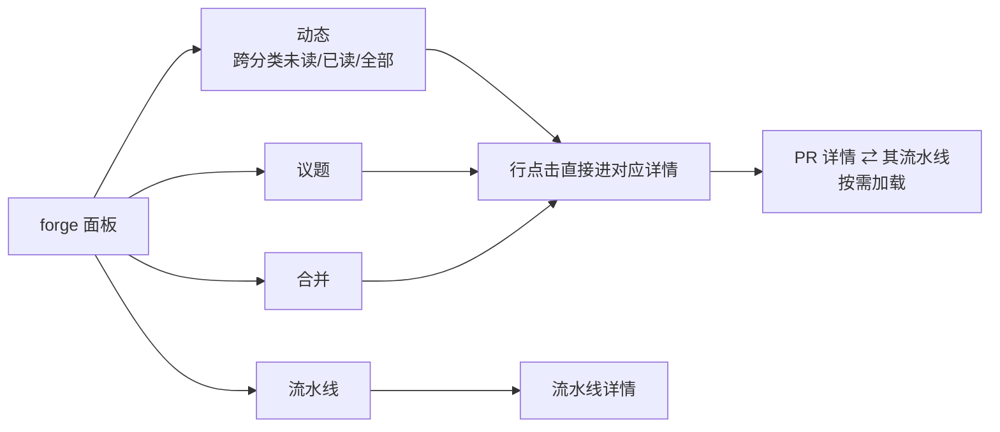
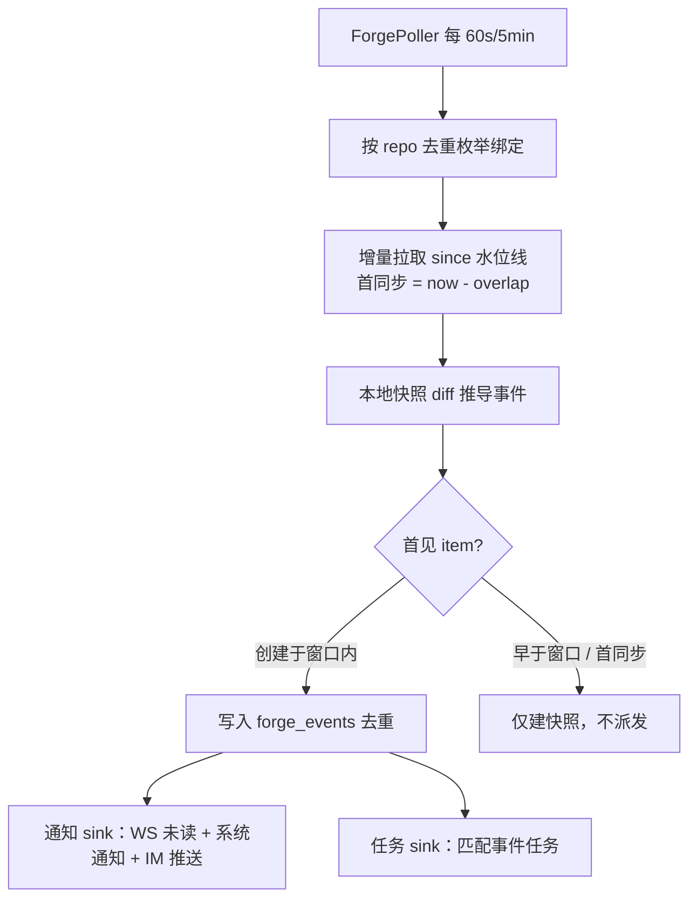
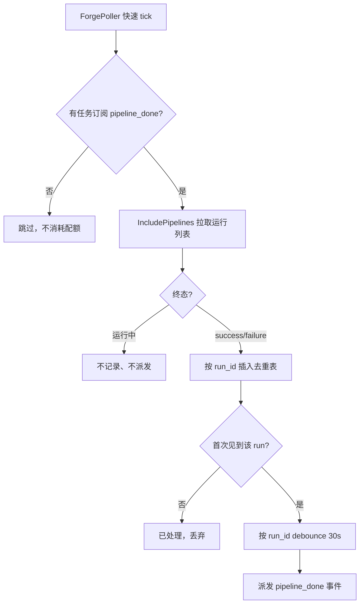
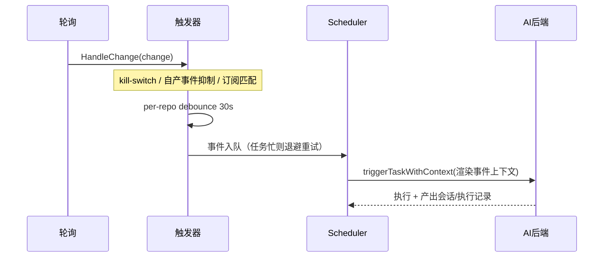

# Forge 集成（GitHub / GitLab）

Forge 集成把远端仓库的 Issue 与 PR/MR 引入 ClawBench：项目内可直接浏览列表与详情（正文 + 评论/时间线），后台持续感知仓库变化并推送通知，还能把仓库事件变成"事件触发 AI 任务"——新 issue、被合并的 MR、新评论都可以自动唤起一个预定义的 AI 任务去分析、总结或跟进。这套能力让 AI 从"我主动问它"扩展到"仓库有事它自己动"。

**读写边界**：ClawBench 自身的 forge API 调用是**只读**的（`Provider` 接口不含任何写方法，后端不评论、不 review、不改状态）。但事件触发的 AI 任务不受此约束——AI 可借助本地 CLI / `gh` / `glab` 等工具操作远端，因此"只读"描述的是 ClawBench 的 API 表面，不是自动任务的权限边界。

## 流程图

### 从绑定仓库到浏览

### 面板内部结构

「动态」是面板的第一个页签也是默认落点——打开面板先看"有什么新东西"，而不是先看某个分类；它本身横跨后面三个分类。它曾经是 Dock 上的独立 tab，但那是 forge 集成的内容，放 Dock 上既是多余入口，也让"角标 → 去哪看"多绕一层，还得靠跨组件深链接缝把点击转发回面板。移入内部后行点击直接调用同一组件里的打开逻辑，净减一层间接和一类竞态。

### 后台感知：轮询 → 事件 → 通知

### CI 完成事件：独立轮询通道

CI 事件是**仓库级**的（一次 run 由 push / tag / 定时触发，不挂在任何 issue/PR 上），因此订阅键是裸键 `pipeline_done` 而非 `pr.pipeline_done`。轮询只在确有任务订阅时才发起，避免无人使用时白耗 API 配额。

### 事件触发任务

## 功能与设计要点

### 功能清单

- **仓库绑定**：项目与 forge 仓库一一绑定，绑定关系随项目走。优先从本地 git remote 自动解析（官方 host 自动绑定，自建实例需确认），也支持手动填 URL。绑定是事件任务的作用域来源——事件任务不单独配置仓库，而是跟随所属项目绑定的仓库。自建实例支持 **http 与 https**：host[:port] 仍是身份键（凭据、快照、水位线、事件、限流桶、未读与去重键全部沿用），协议独立存放，因此同一实例的 http 与 https 是**一个**仓库、状态不分裂；协议按"绑定 → 实例提示 → https"三层解析，空的 scheme 表示"未说明"而非 https（否则会掩盖后续的 http 提示）。内网/自建实例**服务端不再做 host 闸门**，风险提示下沉到绑定弹窗、在提交前显示——自动绑定仍只限官方 host（该路径无用户交互、看不到警告）
- **Issue / PR 浏览**：forge 面板内的类型 chip（Issues / PRs）+ 状态 chip（Open 默认 / Closed / All）+「跟我相关」chip（全部 / 分配给我 / 我提的 / 待我 review，身份从 token 自动获取）。列表按更新时间倒序、滚动分页、服务端搜索；详情原地替换列表并带面包屑返回，展示正文 + 评论/时间线（不含 diff），复用共享 Markdown 渲染管线
- **未读与通知**：tab 带未读徽标，**按条目而非事件计数**——同一 issue 连来三条评论只算一条未读，用户要的是"哪些东西有动静"而不是"发生了几件事"。未读按 `item_key`（`issue/<n>` / `pr/<n>` / `pipeline/run:<id>`）去重统计，标记已读只写现有行的 `read_at`，因此该条目之后再有活动会自然重新变未读。设置里六类事件开关（新开 / 关闭 / 合并 / 重开 / 评论 / CI 完成，默认全开）。未读计数**与通知开关解耦**——即使某类事件通知被关闭，未读仍计数（否则全关时徽标死掉而 AI 任务照跑，用户零信号）。列表行带行级未读标记，可单条标记已读，也可一键「全部标为已读」
- **「动态」页签与筛选**：跨 issue/PR/流水线聚合所有条目，按 `unread` / `read` / `all` 三种视图切换（默认未读），带行级已读标记与「有新评论」这类**事件原因**文案（与订阅用的类别名词刻意分开——前者回答"这里发生了什么"，后者是"任务在听什么"）。没有已读视图时，点开一行只是本地置灰、下次加载该行就彻底消失，用户无法回看自己读过什么。**已读是条目级聚合，筛选必须用 `HAVING`**：条目已读 = 它的全部事件都已读，用事件级条件（`WHERE read_at IS NULL`）会把"有旧已读事件 + 一条新未读事件"的条目漏进已读视图；行上的 `read` 字段与 `unread_count` 来自同一次查询，因此行的样式与选中它的筛选不可能互相矛盾
- **事件触发 AI 任务**：任务表单可选「触发方式：定时 / 事件」。选事件后展开事件类型多选（`issue.opened`、`pr.merged`、`pipeline_done` 等按 kind 分域，merged 仅 PR），prompt 区上方出现**只读事件上下文块**（按事件类型条件渲染适用变量，不适用整行省略），与用户输入拼接为最终 prompt。事件到达即执行，产出会话 + 执行记录，四通道通知，执行记录带来源链接可深链回原始 issue/PR
- **CI 完成事件（`pipeline_done`）**：仓库的流水线运行结束时触发任务——CI 失败自动让 AI 去看日志、CI 成功自动总结变更。只有 success / failure 两个终态派发事件（cancelled / skipped 不打扰），同一 run 只派发一次（按 `run_id` 去重），且首次同步只建基线不补发历史。流水线标题取"每次运行"的标题（GitHub 用 `display_title`，即 commit message / 手动输入的 run 名），而非 workflow 名——否则列表里十条运行全叫 "CI"，用户无法区分
- **CI 运行浏览与 PR 双向关联**：流水线列表默认筛选为**全部**（默认只看失败会让没有失败的 tab 看起来是空的，而它本质是运行历史），带状态 chip（全部 / 失败 / 运行中，默认项排最左）。两个方向的跳转都提供：从**流水线详情**进关联 PR，从 **PR 详情**折叠展开该变更的流水线（回答"这个变更通过 CI 了吗"，这是审查时的主路径，GitHub/GitLab 官方 UI 也把 CI 作为 PR 的子项）。PR 侧的流水线**按需加载**——独立端点而非塞进 PR 详情响应，因为它要额外发请求，而大多数时候用户并不看
- **引用到对话**：详情页 header 的引用按钮（消息图标）把 issue/PR 变成聊天内容——复用全站共享的引用输入框，issue/PR 地址作为 **URL 附件**（chip 文案 `owner/repo#123`）进入输入框，用户可再划取文本补充，最终消息为 URL 附件 + 选中文本 fence + 用户输入。当前项目无活跃会话则新建并切到聊天 tab。详情正文也支持双击复制 + 划取引用（与 Markdown 预览同一链路）
- **凭据按 host 隔离**：token 存储键为 `(platform, host)`，不再是单一全局 token。自建 GitLab 实例各自独立凭据，一个 host 被控不影响其他 host。`GET /api/config` 不回传密钥明文，改为回传 host 存在性标记（write-only 语义，与密码字段一致），另附各 host 的**协议**（非密钥，仅"怎么连"而非"怎么认证"，用于区分只有 http 的实例）；`config.yaml` 权限为 `0600`。自建实例支持「跳过 TLS 校验」开关（默认关，用于自签名证书）。凭据主机字段接受 `http://h` / `https://h` / `h:port` / `h` 等写法，由**同一个归一化器**切分（避免两个归一化器漂移），加载时迁移历史脏键——旧版本把 URL 原样存为 key，导致凭据查不到、删不掉、界面却显示已配置
- **事件任务护栏**：全局 kill-switch「暂停所有事件触发」；识别 AI 自身账号产生的写操作事件并**抑制**（防递归）；per-repo 同类型事件 debounce 合并；事件队列（任务忙时入队退避重试而非丢弃）

### 设计要点

- **Provider 抽象隔离平台差异**：`internal/forge/` 定义统一的 `Provider` 接口与模型（`Item`/`Comment`/`Change`），GitHub 走 `google/go-github`，GitLab 用自建轻量 REST v4 client——刻意避开官方 SDK 的重依赖树（protovalidate/protobuf/cel-go/graphql-go/keyring）。平台差异（GitHub 只有 `owner/repo` 两段、GitLab 允许多级 group；GitLab `merged`/`locked` 归一为 closed；GitHub issues 端点混入 PR 需剔除）在 adapter 内消化，上层只见统一模型
- **变化靠本地快照 diff，而非平台事件 API**：GitHub `issues?since` 只表明"变了"而不表明"变成了什么事件"，GitLab events API 粒度只到天。因此以水位线增量拉取 + `forge_items` 快照对比推导事件，把"发生了什么"的判断权握在自己手里。水位线**必须整批（所有页）拉完才推进**，边界用严格 `>` 加 1s 重叠窗口，并对事件做 `dedupe_key` 去重——不依赖时间戳唯一性
- **水位线按 item 类型分离（issue / PR 各一个游标）**：两个类型来自**时间过滤能力不同**的端点，共用一个游标会被慢的一方拖偏。GitHub 的 issue 列表支持 `since`，而 PR 列表**完全不支持**（go-github 的 `PullRequestListOptions` 没有该字段，API 也不认未知参数），因此 PR 侧只能全量翻页——实测第 1 页（100 条）耗时 41–70s、响应 2.2MB，共 4 页，且客户端超时 30s，于是大部分趟数走不完、游标不前进、下一 tick 从 page 1 重走，配额被反复烧光；偶尔走完时，PR 阶段看到的较新时间戳会把**共享游标**推过 issue 阶段尚未取到的 issue，那些 issue 从此永远落在窗口之外（真实案例：一条 15:13 创建的 issue 被 15:14 的 PR 推没了，`forge_events` 里连行都没有）。分离后 `issue_watermark` 与 `pr_watermark` 互不推进，构造上不可能再发生
- **窗口化的 PR 查询改走 issues 端点**：既然 PR 列表无法表达时间下界，带 `since` 的 PR 查询就改用 `issues` 端点（它同时返回 PR——PR 就是带 `pull_request` 链接的 issue，且该链接携带 `merged_at`）。实测 1.2s / 92KB，对比 PR 列表的 41s / 2.2MB。**不带窗口**的查询仍走 PR 列表，因为只有它返回 `head.ref`（CI 查询所需的 `SourceBranch`）；CI 查询本身走 `GetItem`（单 PR 1–3s），两条路互不影响
- **首次同步的窗口是"现在"，不是"开天辟地"**：快照只用于"这一轮 vs 下一轮"的 diff（面板列表走 provider 实时拉取，从不读快照），所以回填整仓历史买不到任何东西——对大仓更是不可能：GitHub 对超过 1 万条的集合禁用 offset 分页（`page` 参数直接 422），全量拉取会中途失败，水位线因此永不推进，下一 tick 又从 page 1 重走一遍，配额被无限重试烧光。因此 `since` 恒为 `watermark - overlap`，首次同步取 `now - overlap`（一次请求而非上百次）。**每个类型各判各的首次**：旧库升级时 `pr_watermark` 刻意留 NULL（不从旧的共享游标回填），于是 PR 侧从"现在"起算、静默建立基线；若回填，PR 窗口会覆盖整仓历史并一次性派发全部 PR 事件
- **首次见到、但时间早于窗口的老 item 只记快照不派发**：它的历史状态从未被观测，仅凭当前状态推导转移是猜测（2020 年就 closed 的 issue 会被误报成"刚刚关闭"）；判定依据是 `Item.CreatedAt`，窗口本身就是基线，无需新增状态。**`merged` 用同一把尺子**：merge 时刻（`Item.MergedAt`）落在窗口内才算"刚合并"。这条门控是必需的——`forge_items.merged` 在 GitHub 侧从未被填充过（PR 列表端点不报 merge 状态），一旦 merge 状态变得可见，所有"closed 但实际已 merged"的历史 PR 会同时被推导成 `merged` 事件，在真实仓库上就是数百条事件与推送（通知通道没有去抖）。未知 merge 时刻按"新"处理，与 `CreatedAt` 的约定一致（沉默会静默丢事件）。**代价要说准**：首次见到某 PR 时若它**创建**于窗口之前，即使它是在窗口**之内**才被合并的，也一并静默——首次同步只看 `CreatedAt`，不额外查 `MergedAt`。这是"不回放历史"的既有取舍（issue 侧一直如此），不是 `merged` 独有的行为；若首次同步时就要求精确区分"窗口内合并的老 PR"，需要在基线建立时一并判定 `MergedAt`，当前未做
- **未读与通知解耦**：两者共用同一事件源但独立于开关。通知是"提醒你"，未读是"有变化"——把两者绑在一起会让关闭某类通知连带让徽标失去意义，而 AI 任务仍在后台触发，用户彻底失去信号。浏览器系统通知同理：`forge_event` 的 WS 广播**不受任何通知开关门控**（角标靠它保持实时），系统通知则受本地 `browserNotification` 门控——IM 推送受 `forge.notify.*` 服务端开关门控，三个通道各自独立
- **广播 payload 手工构造而非序列化结构体**：`ForgeEventDispatcher.HandleChange` 广播的 `event` 对象是显式 snake_case map（`platform`/`host`/`owner`/`repo`/`item_type`/`number`/`run_id`/`event_type`/`project_path`），不是 `ForgeEvent` 结构体。该结构体没有 json tag，直接序列化会得到 PascalCase（`EventType`）并泄漏内部簿记列（`DedupeKey`/`ItemKey`）；前端按字段名读取通知文案，一次"顺手改成结构体"的简化会静默让所有仓库通知退化成空标题。有测试（`TestForgeDispatcher_PayloadEventKeysAreSnakeCase`）同时断言键名存在与 PascalCase 键不存在
- **通知带 project_path 与条目目标以支持深链**：广播是全局的（`BroadcastEvent` 扇出所有订阅），而 forge 面板与未读角标是项目作用域的。因此事件携带产生它的绑定所属项目（`ForgeRepoRef.ProjectPath`，从 `ProjectForge.ProjectPath` 透传），前端点击时先切项目再开面板。该字段**不是仓库身份的一部分**——`ForgeRepoRef.Key()` 刻意忽略它，否则同一仓库被两个项目绑定时会分裂成两个防抖桶；poller 按 repo 去重时保留的是 `updated_at DESC` 的第一行，故多项目绑同一仓库时归属取最近更新者。**`run_id` 是流水线深链的前提**：流水线的 `number` 恒为 0（CI run 不是 item、没有编号），所以 `(item_type, number)` 无法命名具体某次运行，前端也就既跳不到该 run、也无法标记它已读（已读键是 `pipeline/run:<id>`）。因此广播额外下发 `change.PipelineRunID`；issue/PR 事件该值为 0，前端据此区分。条目身份统一由前端 `forgeTargetItemKey` 构造，与 Go 侧 `forge.ItemKey` 格式对齐（`<type>/<number>` 或 `pipeline/run:<id>`），有测试双向钉住格式
- **防递归靠身份识别而非提示词**：`CLAWBENCH_SCHEDULED=1` 只能阻止 AI 通过 `/cb-task` 再建任务，挡不住 AI 用 `gh`/`glab` 写回 forge 再触发自己。因此触发器解析凭据对应的账号登录名（缓存 10 分钟），抑制 acting actor 等于该账号的事件——比对 item 作者会漏掉"AI 评论别人的 issue"。**流水线事件刻意豁免**：CI 结束不是"用户做的动作"，而是几分钟前某次运行（可能是别人、可能是定时或 push 触发）的结果；抑制"自己"的流水线恰好会砍掉最有价值的场景——AI 推了修复、CI 失败、而负责修复的任务永远不跑。actor 仍随事件下发，任务 prompt 通过 `ACTOR_IS_SELF` 变量自行判断
- **CI 事件用 per-run 去重表而非水位线**：首次见到时仍在运行的 run 不记录，所以"后来完成的更早 run"会被标量水位线永久跳过（run 101 先完成会把水位线推过 100，100 完成时已在水位线之下而静默丢失）。改为每个 run 一行（`PRIMARY KEY (platform,host,owner,repo,run_id)`），天然免疫乱序完成与分页；新鲜度判定直接用 `INSERT ... ON CONFLICT DO NOTHING` 的 `RowsAffected`，避免"先查后写"的窗口
- **事件不丢优先于事件及时**：运行中再来事件若沿用"直接丢弃"会丢数据。改为持久化事件队列 + 退避重试（任务忙时 10s 退避、最多 30 次），配 per-repo debounce 合并突发——宁可延迟，不可静默丢失
- **绑定是事件作用域的唯一来源**：事件任务不单独配置仓库，其项目绑定的仓库即作用域。这消除了"任务配的仓库"与"项目绑的仓库"两份状态不一致的可能；轮询单元是 repo（`host + owner/repo`）而非绑定行，同一 repo 被两个项目绑定只轮询一次
- **协议与主机分离，host 才是身份键**：一个自建实例可能同时可达 http 与 https，若把 scheme 折进 key，同一仓库会分裂成两份凭据、两份快照、两份水位线与两份未读计数。因此 host[:port] 继续承担身份，scheme 单独存放且**空值表示"未说明"而非 https**——把它默认为 https 会让后续由凭据表单学到的 http 提示永远无法生效。ssh/scp 形式的 remote 本身无法推断 API 协议，正是靠凭据表单补齐
- **跨组件深链只在"发起端确实在组件外"时才成立**：把「动态」从 Dock tab 移进面板内部，消掉的不是一行 import，而是一整类竞态——原来点总览的行要绕 App.vue → 模块级 pending ref → 面板 watch 消费，且面板被懒挂载、切 tab 在已处于该 tab 时是 no-op，所以还得同时 watch 两个源才能覆盖"已在总览、点另一条"。当跳转的两端本就在同一个组件里，任何跨组件的转发层都只是引入窗口。**通知点击是这条规则的例外，且是必需的那一侧**：事件来自 WS（App.vue 的全局事件层），发起端天然在面板之外，没有"放进组件内"这个选项。因此复用与设置深链相同的模块级 pending ref 形态，并把上面那三个状态（未挂载 / 已挂载且已激活 / 已挂载但未激活）都覆盖到——`onMounted` + `watch(pendingForgeTarget)` + `watch(active)` 各管一段，缺一段就有一种状态静默丢跳转。跨项目时目标必须**先发布再切项目**（否则新面板挂载时目标已错过），而此刻旧项目的面板仍挂着并会先看到它，所以消费前要用 `target.projectPath` 对齐——这正是把"发起端在组件外"的代价显式化，而不是用一层转发把它藏起来。**同一事件的两个发起端字段名不同，必须统一解析**：渲染层自己的两条路（页内通知 onClick、完成卡片）手工构造 `{ projectPath, target }`，而原生壳（Electron）把整个 `NotificationNav` 经 preload 原样透传为事件 detail，该对象的字段叫 `forgeTarget`。只读其中一个名字会让另一条路静默丢深链——Electron 上曾因此点击只开页签（页内路径却正常，因为测试都手工构造了 `{ target }`，绕过了真实原生形状）。因此两处消费点（实时点击、冷启动回放）统一走 `forgeTargetFromDetail`，并有源码级守卫钉住"不得按单一字段名直读"
- **共享样式必须提全局，否则"能渲染但没布局"**：forge 的行样式（`.forge-row` 及其文本类）曾被修饰规则提全局、基规则留在 `ForgePanelContent` 的 `<style scoped>` 里，于是拆出的独立列表组件渲染出的行完全没有几何（`display:block`、零内边距、零分隔线、标题不省略），而单测只断言文本内容故全部通过。修复方式是把共享 chrome 提到全局 CSS 并从 scoped 块删除副本，保证单一来源；另需一个**清单式守卫测试**——它只保护清单里列出的类名，漏列即永远不查，所以新增共享类必须同步登记

## 关键机制

### 事件推导

`DeriveChanges` 对比存储快照与最新状态，按状态转移推导事件：无→有 `opened`、open→closed `closed`、出现 merged 标记 `merged`、closed→open `reopened`、评论 id 或 `updated_at` 变化 `commented`。同一轮内多段转移（如 closed → reopened → merged）按终态优先级只派发最有信息量的一个（merged > reopened > closed），并在 payload 保留原始状态序列。

评论检测用 `(last_comment_id, last_comment_updated_at)` 双键——评论被编辑时 id 不变、仅 `updated_at` 变，单 id 会漏。首次同步只建快照但**不派发历史事件**（水位线初始化为"现在"，窗口收窄到绑定时刻之后）。

### 限流与退避

per-host 令牌桶 + 全局并发上限，避免多 repo 同时打满限额；处理 `429`/`403` 的 `Retry-After` 头并指数退避（抖动 ±20%，上限 5 分钟）。GitHub 认证限额 5000/hr，而状态 60s + 评论 5min + CI 的轮询约 130 调用/hr/repo，仅够约 38 个 repo，且交互请求共用配额——因此评论类独立降频（5min），并使用 ETag / `If-None-Match`（304 不计限额）。token 失效（401）时暂停该 host 轮询并置为可见错误状态，不持续重试。

### URL 附件

`FileEntry` 增加 `kind`（`file` / `url`）与 `url` 字段。URL entry 在后端**跳过本地路径校验**（不 `os.Stat`、不落 `Files`），但校验 URL 安全性（仅 http/https + host，拒绝 `javascript:`/`data:`——该值会被持久化并重新渲染为 `href`）。前端按 `url` 去重、走独立发送通道、以链接样式渲染 chip。

### CI 运行的去重与新鲜度

`RecordPipelineRun` 是"这个 run 处理过吗"的唯一判据，返回值直接决定是否派发。基线行与已派发行在语义上完全相同（都是"这个 run 不该再触发"），因此不设 `dispatched` 列——任何读者看到该行即可认为已处理。首次同步（表为空）只记录不派发，避免接入瞬间把历史运行全部补发成任务。

## 数据模型

| 表 | 用途 |
|---|------|
| `project_forges` | 项目 → 仓库绑定（`project_path` 归一化，`source` = auto/manual，含 opt-out 标记） |
| `forge_items` | 每个 issue/PR 的本地快照（状态、merged 标记、评论双键、`comments_baselined` 区分"零评论"与"从未拉取"） |
| `forge_sync_state` | per-repo 的**两个**独立水位线（`issue_watermark` / `pr_watermark`）与同步状态；旧库升级时 `watermark` 重命名为 `issue_watermark`，`pr_watermark` 留 NULL（见"按 item 类型分离"） |
| `forge_events` | 派生事件（`dedupe_key` 唯一、`item_key` 供未读按条目去重、`read_at` 已读标记、repo 索引） |
| `forge_pipeline_runs` | 每个已处理 CI run 一行（`PRIMARY KEY (platform,host,owner,repo,run_id)`），去重与基线共用 |
| `scheduled_tasks` | 增 `trigger_mode`（`cron`/`event`）与 `event_types`（逗号分隔订阅） |
| `task_executions` | 增 `event_url` / `event_summary` 供执行记录溯源，`read_at` 逐条已读 |
| `session_tags` / `session_tag_links` | 会话标签定义（`UNIQUE(name, project_path)`）与会话↔标签关联 |

## API 端点

全部经 `middleware.Auth`：

- `POST/DELETE /api/forge/credentials` — 按 host 设置/清除 token（write-only）
- `POST /api/forge/verify-token` — 校验 token 是否可访问指定 host
- `GET /api/forge/items` — 列表（类型/状态/搜索/分页/跟我相关），行带 `unread` 标记
- `GET /api/forge/item` — 单条详情
- `GET /api/forge/comments` — 评论分页（旧→新）
- `GET /api/forge/item-pipelines` — 某条 PR/MR 的 CI 运行（PR 详情折叠区按需加载）
- `GET /api/forge/pipelines` — CI 运行列表（状态筛选/分页）
- `GET /api/forge/pipeline` — 单次 CI 运行详情（GitLab 侧顺带补齐关联 MR）
- `GET/POST/DELETE /api/forge/binding` — 读取（官方 host remote 自动绑定）/ 设置 / 清除绑定
- `GET /api/forge/remotes` — 列出本地 git remote 解析出的 forge 仓库
- `POST /api/forge/test` — 验证已绑定仓库可达
- `GET /api/forge/unread` — 未读**条目**数（项目作用域，未绑定返回 0；廉价计数，供角标高频刷新）
- `GET /api/forge/unread-items` — 未读/已读/全部条目列表（`?filter=`，默认 unread）；行只在总览打开时取，不污染角标路径
- `POST /api/forge/read` — 标记已读；带 `itemKey` 标记单条，不带则整仓库已读

## 已接受的限制

- **不做 webhook**：当前仅靠轮询感知变化，延迟为轮询间隔量级。webhook 接收（低延迟加速层）已有设计方案（`docs/plans/2026-09-12-forge-webhook.md`）但**尚未实施**
- **只读 API 表面**：ClawBench 不代劳远端写操作（不评论、不 review、不改状态），写操作由事件任务里的 AI 借助外部工具完成
- **轮询配额上限**：单实例可轮询的 repo 数受平台限额约束（GitHub 约 38 个），无自适应降频配置。CI 轮询额外占配额，因此只在确有任务订阅 `pipeline_done` 时才发起
- **服务端不做 host 闸门**：自建实例（含内网、回环、IP 地址）一律可绑定，风险提示只在绑定弹窗前端显示。这是刻意的取舍——服务端硬拦截会让内网自建 GitLab 完全无法使用。代价是云部署下元数据端点可被诱导访问；日后若要收紧，应只加回「元数据 + 链路本地」窄拦截，不要恢复整套守卫
- **PR 侧的流水线按需加载**：GitLab 的合并请求流水线端点返回精简结构（无耗时、无触发者、旧实例上也无时间戳），缺失字段直接不渲染，而不是补零或逐条再发请求补全
