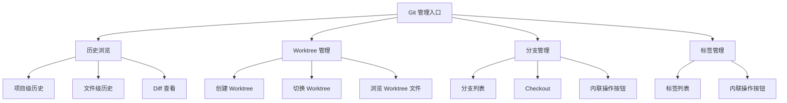
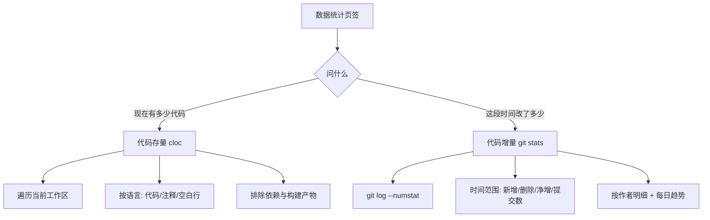
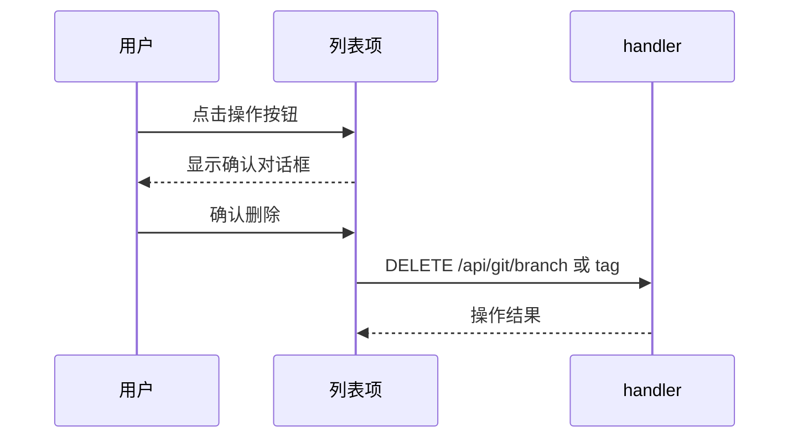

# Git 管理

Git 管理让用户在 Web 界面中浏览代码历史、管理 Worktree、操作分支和标签——不需要命令行，在手机上也能完成日常 Git 操作。Worktree 隔离是核心亮点，让用户在不同分支间并行工作而不互相干扰。除操作类能力外，还包含**代码量统计**（数据统计页签下的代码存量/代码增量两个子页），让用户量化项目规模与变更节奏。

## 流程图

### Git 操作全景

### 代码量统计的两个视角

存量是"工作区当前快照"，增量是"已提交历史的时间窗聚合"——两者数据源与语义都不同，因此各自独立取数、互不依赖。

### 列表项操作交互

## 功能与设计要点

### 功能清单

- **历史浏览**：支持项目级和文件级两种历史视图，ASCII 图形化展示 commit graph，可查看每个 commit 的详细 diff。用户快速了解项目的演进脉络
- **工作区变更页**：展示当前工作区的已暂存/未暂存文件，可切回提交列表。它必须**按需重拉**（`/api/git/working-tree`）而不是纯缓存读——后台刷新会清空文件数据，若视图仍停在工作区变更且只读缓存，渲染出的就是空态（表现为"切回来列表空白，回提交列表再点一次才恢复"）。同时 `inPlace` 刷新只用 `filesRefreshing` 驱动按钮旋转、不清列表；点回 HEAD 提交时先塞缓存快照（无闪烁）再拉最新；重新加载前先快照 drill-down 状态、加载后恢复，工作区变干净（该行消失）则回退到提交列表。文件列表 header 带刷新按钮，历史提交的文件列表不可变，按钮退化为重跑文件加载
- **文件 Diff 抽屉**：`FileDiffsDrawer` 展示提交中所有文件的变更列表，支持 prev/next 顺序导航（`useDiffNavigation`），用户无需返回文件列表即可逐个浏览文件差异。合并提交的文件按分支分组展示
- **Worktree 管理**：创建、切换、浏览 Git Worktree。Worktree 让用户在不同分支上并行工作，切换项目目录即可进入不同工作环境——这是移动端多任务开发的关键能力
- **分支操作**：列出所有分支、Checkout 切换、内联操作按钮删除。移动端不方便输入 `git checkout`，图形化操作降低了交互成本
- **标签管理**：列出所有标签、内联操作按钮删除。与分支管理共享交互模式
- **Commit 导航**：聊天中出现的 commit hash 自动标注为可点击链接，点击跳转到 Git 历史页面查看详情。打通了聊天与代码历史的关联
- **Worktree 路径标注**：聊天中出现的 Worktree 路径自动标注为可点击链接，提供"切换 Worktree"和"浏览文件"两个操作。让用户从对话直接跳转到工作环境
- **代码量统计（存量 + 增量）**：数据统计页签下除用量统计外的两个子页，回答"这个项目有多少代码、谁在改、改了多少"：
  - **代码存量（cloc）**：`GET /api/git/cloc` 用 gocloc 对**当前工作区**做快照式盘点——按语言统计代码/注释/空白行与文件数，附语言占比条形图与全列可排序明细表。它**不要求项目是 Git 仓库**（直接遍历目录树），且与时间范围无关。默认排除构建产物、依赖与 VCS 目录（`node_modules`/`vendor`/`.venv`/`dist`/`.git` 等），否则一个含 Python 虚拟环境或模型目录的项目会把机器上的第三方行数也算进来
  - **代码增量（git stats）**：`GET /api/git/stats?start&end&trend` 读 `git log --numstat`，按时间范围统计新增/删除/净增行数与提交数——总览卡 + 按作者明细表 + 每日趋势折线（可按作者多选过滤）。只统计**已提交**的变更，工作区/暂存区改动不计；合并提交不产生文件行因此不会双计；时间分桶与过滤用 **committer date**（提交被集成的稳定时间戳，author date 可被改写且不代表"何时进入主线"）。非 Git 仓库时明确提示无法统计

### 设计要点

- **内联操作按钮替代滑动删除**：分支和标签列表项的操作按钮内联显示（空间允许时），空间不足时折叠到 More 菜单。删除操作需确认对话框，防止误操作。替代了之前容易误触的滑动手势删除
- **Worktree 标注先于文件路径标注**：Worktree 标注逻辑先于文件路径标注执行，已标注的 Worktree 路径不再被文件路径标注二次匹配——避免 Worktree 路径被错误识别为普通文件路径
- **Commit hash 匹配严格且缓存**：匹配规则精确避免误匹配，且缓存已查询的 hash 信息避免重复请求——聊天中可能出现大量 commit hash，每次都请求后端会严重影响性能
- **参数注入防护**：Git 操作的分支名、commit hash 等参数直接传递给命令而非通过 shell 拼接，从根本上避免命令注入风险
- **存量与增量是两个正交的问题**："工作区现在有多少代码"（cloc，快照、不依赖 git）与"这段时间改了多少代码"（git stats，历史、依赖 git）回答不同问题，因此拆成两个独立子页而非塞进同一张图——用户不会困惑"为什么我改了代码但存量没变"（未提交）或"为什么删除文件后增量还是正的"
- **统计用 committer date 而非 author date**：author date 可被 rebase/cherry-pick 改写，不能反映变更真正进入主线的时间；committer date 是提交记录的稳定时间戳，更符合"这段时间合入了多少"的语义
- **cloc 必须排除依赖与构建产物**：gocloc 默认会遍历整个目录树，若不过滤 `node_modules`/`vendor`/`.venv`/模型目录等，一个中小项目也能扫出几十万行第三方代码，让"项目规模"失真
- **"刷新数据"与"切换视图"是两个正交的状态**：工作区变更页变空的根因是刷新流程清空数据但从不改变当前视图，而该视图又只读缓存——于是数据没了、视图还在、渲染出空态。修法不是给缓存打补丁，而是让视图能按需重拉自己的数据，并让"原地刷新"只驱动进度指示、不动列表内容
- **两个宿主必须共享逻辑而非各写一份**：同一个历史视图同时存在于停靠页与抽屉（窄屏/宽屏），两处各写一份的结果是修复只落在一条路径上（工作区变更页的 bug 就是这样漏的）。收敛到共享 composable 后，宿主差异（读哪个 props、用哪个 fetch 形态、有无分页）以注入保留，而不是靠复制代码承担
