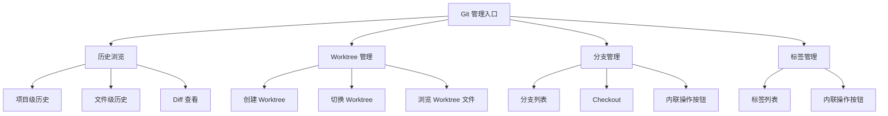
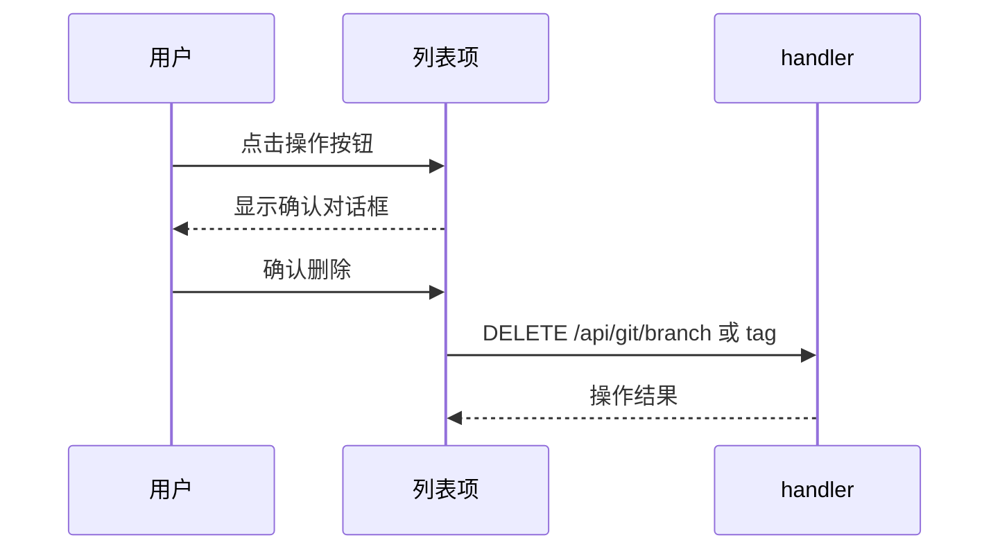

# Git 管理

Git 管理让用户在 Web 界面中浏览代码历史、管理 Worktree、操作分支和标签——不需要命令行，在手机上也能完成日常 Git 操作。Worktree 隔离是核心亮点，让用户在不同分支间并行工作而不互相干扰。

## 流程图

### Git 操作全景

### 列表项操作交互

## 功能与设计要点

### 功能清单

- **历史浏览**：支持项目级和文件级两种历史视图，ASCII 图形化展示 commit graph，可查看每个 commit 的详细 diff。用户快速了解项目的演进脉络
- **Worktree 管理**：创建、切换、浏览 Git Worktree。Worktree 让用户在不同分支上并行工作，切换项目目录即可进入不同工作环境——这是移动端多任务开发的关键能力
- **分支操作**：列出所有分支、Checkout 切换、内联操作按钮删除。移动端不方便输入 `git checkout`，图形化操作降低了交互成本
- **标签管理**：列出所有标签、内联操作按钮删除。与分支管理共享交互模式
- **Commit 导航**：聊天中出现的 commit hash 自动标注为可点击链接，点击跳转到 Git 历史页面查看详情。打通了聊天与代码历史的关联
- **Worktree 路径标注**：聊天中出现的 Worktree 路径自动标注为可点击链接，提供"切换 Worktree"和"浏览文件"两个操作。让用户从对话直接跳转到工作环境

### 设计要点

- **内联操作按钮替代滑动删除**：分支和标签列表项的操作按钮内联显示（空间允许时），空间不足时折叠到 More 菜单。删除操作需确认对话框，防止误操作。替代了之前容易误触的滑动手势删除
- **Worktree 标注先于文件路径标注**：Worktree 标注逻辑先于文件路径标注执行，已标注的 Worktree 路径不再被文件路径标注二次匹配——避免 Worktree 路径被错误识别为普通文件路径
- **Commit hash 匹配严格且缓存**：匹配规则精确避免误匹配，且缓存已查询的 hash 信息避免重复请求——聊天中可能出现大量 commit hash，每次都请求后端会严重影响性能
- **参数注入防护**：Git 操作的分支名、commit hash 等参数直接传递给命令而非通过 shell 拼接，从根本上避免命令注入风险
