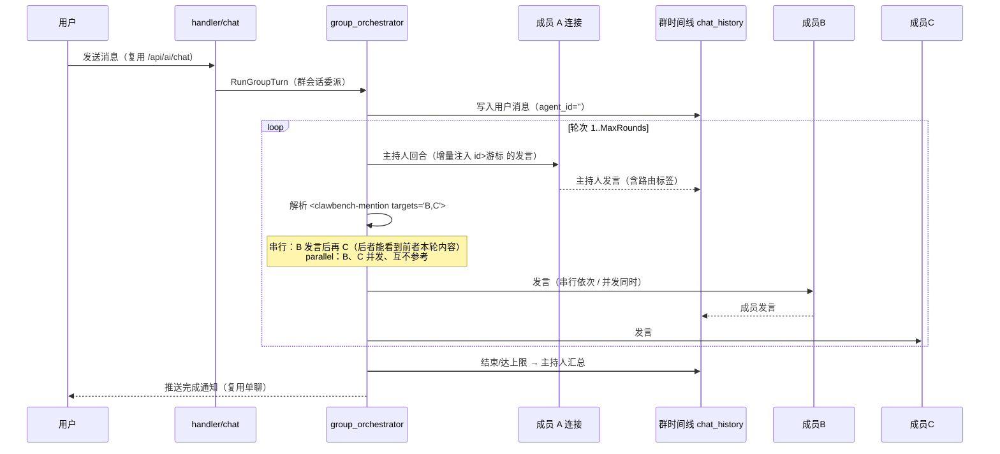
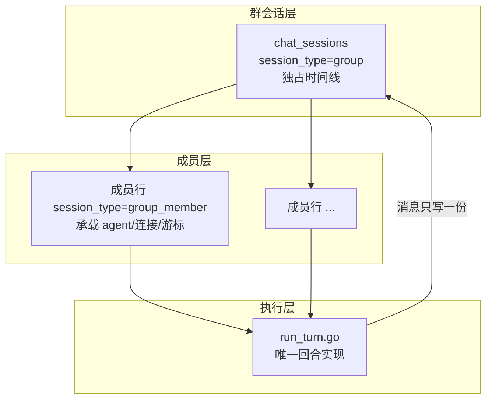

# AI 群聊

群聊让用户把**多个已配置的智能体**（可跨后端，如 CodeBuddy + Claude Code + Codex）拉进同一个会话，就同一话题进行多智能体协作或辩论。单聊一次只能问一个智能体，用户得自己当"传话筒"在多个会话间复制粘贴；群聊把"谁接着谁说、每个人看到什么"交给系统编排，用户只需发一条消息然后旁观（或随时插话）。

群聊有两种形态，**建群时是否指定主持人决定模式，且不可中途切换**：

- **主持人模式（host）**：一个被指定为"主持人"的成员控场——它决定下一个该谁发言、给出什么指令，成员发言后主持人再决策，循环直到主持人发出结束信号或达到最大轮数。像真实团队开会：有议程、有分工、有结论。
- **自由聊天模式（free）**：没有主持人，成员通过 **@ 提及**接力——谁被 @ 谁接着发言，被 @ 的人再把话头传给下一个人，形成一条可以无限延续的讨论链。像微信群里一群人自由接话。

两种模式都**默认串行**发言（后发言者能看到前者本轮内容）。若本轮的路由标签带 `mode="parallel"`（成员可自行使用，自由模式还可由用户侧的**「并发执行」开关**触发），被点名的成员则**并发发言、互不参考**——它们从同一份"群回合起始高水位"快照出发，谁都看不到同轮其他成员的输出。

## 流程图

### 主持人模式：一轮的推进



### 自由模式：@ 接力

```mermaid
flowchart LR
    U[用户消息] --> S{消息里 @ 了谁?}
    S -->|有 @| Q[初始待发言队列 = 被 @ 成员]
    S -->|无 @| Q2[全体活跃成员，按花名册顺序]
    Q --> P[取队首成员发言]
    Q2 --> P
    P --> M{输出里 @ 了谁?}
    M -->|@User| H[停下，交回人类]
    M -->|@其他成员| E[有效新目标排到队尾]
    E --> P
    M -->|无 @| Z[队列自然耗尽，结束]
```

### 群会话的三层结构



## 功能与设计要点

### 功能清单

- **建群**：会话列表头有独立的「建群」按钮（非复用 `+`），打开智能体多选抽屉，勾选成员、可选指定一个主持人，一次请求原子创建群与全部成员（失败整批回滚，不留"只有主持人的半成品群"）。**建群时不输入群名**——后端用主持人名占位（"XX 的群聊"），自由模式用"群聊"，首条消息后由 auto-title 接管
- **成员管理**：群会话顶部横向头像条（主持人排最前、最多 4 个）展示成员，尾部 `+` 打开多选抽屉批量加人；群聊设置面板（`GroupSettingsSheet.vue`，点头像条或 actionbar 的「群聊」按钮打开）里可移除成员。增删成员都会在时间线写一条**居中的系统细条**（"XX 加入了讨论"/"XX 已离场"），让全员知道人员变动。**历史发言保留并标记"已离场"**——删掉某人发言会让后续"B 回应 A"失去上下文
- **最大轮数**：主持人模式默认 10 轮，可在群聊设置面板里改；到上限时强制停并让主持人再产出一份汇总
- **@ 接力（自由模式）**：用户和成员都能用 `@` 指定下一个发言人。成员输出里的 @ 把目标排到队尾，@User（保留名）则把话头交回人类、暂停接力
- **并发执行（自由模式）**：actionbar 有一个「并发」开关（群级持久设置 `parallelDefault`，存 `context_state`）。打开后，**用户 @ 的多个成员合并为一个 parallel 组并发发言**（不 @ 人时全体成员并发）；它只作用于"用户种子"，**不影响智能体之间 @ 出的组**（那些仍按各自标签的 `mode` 走）。主持人模式下用户不参与路由，故开关只在自由模式显示
- **密送（BCC）**：主持人或成员可发一条只有指定目标看得到的消息（`private` 提及），在该目标**下一次发言时**注入一次。用于"暗中给某人递话"这类场景
- **群内附件与引用**：群消息支持文件附件、`@` 文件补全、引用卡片——与单聊逐字一致（附件在注入成员时渲染，气泡仍靠 `files` 字段渲染）
- **人类插话**：群回合运行中发消息走**排队**（复用单聊队列），排队条目的按钮文案为「插话」（= 取消本轮 + 用该消息起新一轮）
- **`/cb-*` 命令在群内生效**：命令模板注入本回合第一个发言者的 prompt（群里由主持人执行一次），结果进时间线供讨论；`/btw` 旁路问答不受影响

### 设计要点

- **成员就是一条隐藏的 `chat_sessions` 行**：成员行（`session_type='group_member'`）天然携带 `agent_id` / `transport` / `model` / `external_session_id` / `auto_approve` / `context_state`——正是"一条持久连接"所需的全部字段。于是 ACP 连接池按 session id 键控、空闲回收、resume/load 恢复、CLI `--resume` 全部**零改动**继承。唯一代价是会话列表要过滤掉成员行（用**白名单** `session_type IN ('chat','group')`，而非黑名单——新增查询漏加条件时白名单默认隐藏、黑名单默认泄漏）
- **消息只存一份，存于群会话**：成员之间只交换**发言文本**，工具调用与深度思考不进他人上下文。所有消息落进群时间线，成员行没有 `chat_history` 记录——从根上消除"两份副本不一致"的问题
- **`run_turn` 的时间线解耦**：执行器里 `SessionID` 身兼两职——连接语义（用成员行 id，如写 `external_session_id`、查连接池）与时间线语义（用群会话 id，如落库、广播、摘要）。因此引入第二个字段 `TimelineSessionID`（缺省等于 `SessionID`，单聊路径行为不变），连接调用点用 `SessionID`、时间线调用点用 `effectiveTimelineSessionID()`。**`UpdateLastRead` 是例外**——它保持成员行 id，否则任一成员回合都会把**群**标记已读、群徽章永不亮
- **增量注入靠"发言游标"而非全量重放**：每个成员在 `context_state` 里存一个 `seen_cursor`（上次发言时群时间线的最大消息 id），下次发言只注入 `id > 游标 且作者≠自己` 的消息。这既保证成员看到讨论进展、又不重放自己说过的话。**游标只在回合成功时推进**——失败时推过去会让那段上下文永久丢失（成员后续答非所问且时间线看不出）
- **路由用结构化标签，解析失败回退轮转**：主持人输出 `<clawbench-mention targets="A,B">指令</clawbench-mention>`，后端解析出本轮发言者（有序）；标签可选带 `mode="parallel"` 表示这批目标并发发言（缺省串行，未知值回退串行）。**检测即解析、不可解析不剥离**（与 `askquestion` 的"绝不丢内容"契约一致），并回退到"下一个未发言成员"轮转；连续失败 2 次自动收尾。标签解析是独立叶子包 `internal/grouprouting`，与前端 `groupRouting.ts` 互为镜像、由 parity 语料双向固化
- **两模式共用同一循环内核**：主持人模式与自由模式的回合脚手架、成员发言+游标推进+密送投递、@User 交回、目标解析全部收敛到共享抽象（`prepareTurn` / `runSpeakerTurn` / `drainSpeakers` / `resolveSpeakerTargets`），差异只在"如何补充下一个发言者"（主持人用有界 `refill`，自由模式用自扩展 `onSpoke`）。避免两套循环逐字重复后各自漂移
- **串行发言可用"最新流式行"定位，并发发言必须按 id 定位**：`UpdateStreamingMessage` 按 `session_id=群 AND streaming=1 ORDER BY id DESC LIMIT 1` 命中行——这只在"一条时间线上只有一路在飞"时成立（单聊、或**串行**群回合）。并发发言时多个成员的流式行共存，落错行就会串台，因此执行器持有自己的占位符 id、改用 `UpdateStreamingMessageByID`（按 `id + session_id` 精确命中）。**并发组的快照必须整组一次性取自"回合起始高水位"**（`runParallelGroup` 在启动任何成员前先 snapshot 全部），否则后启动的成员会看到先启动者的输出，破坏"互不参考"。并发度另有启动上限（`maxParallelLaunches`），分批启动不影响快照不变性
- **单个成员失败不终止整个群**：成员发言失败复用单聊 `failTurn`（可见 warning block、带成员归属），循环继续、主持人可改选；失败残留保留在时间线供用户查看。主持人跑挂则回退轮转继续，再失败才终止群回合。**任何失败都不丢已有发言**（已落库）
- **群成员的连接受 ACP 空闲回收保护**：成员行是隐藏会话，不会被"用户可见 running 会话"查询命中，因此 ACP 空闲 sweep 会误杀正在使用的成员连接。编排器维护"当前群回合正在使用的成员行集合"，sweep 判定回调同时查它——**不动 `GetRunningSessionIDs`**（那是喂会话列表与项目删除判定的，混入隐藏成员行会误触发"项目有会话在跑不能删"）
- **保密优先于保内容**：密送的注入侧是 **fail-closed**（剥离一切畸形/嵌套/未闭合的提及形态），显示侧是 **fail-open**（只认良构、畸形保留原文供用户查看）。摘除顺序是安全核心——`Parse` 必须在剥离一切标签后的文本上计算"标签前背景/指令"，否则密送会经公共指令段或共享背景泄漏给所有成员
- **群聊跳过逐成员摘要推荐**：成员回合的 Finalize 不跑摘要，**只在整轮群回合结束时跑一次**——否则 N 个成员 × 轮数会产生大量 LLM 推荐调用 + 全表摘要扫描

## 数据模型

| 表 / 列 | 用途 |
|---|---|
| `chat_sessions.session_type` | `group`（群会话，独占时间线）/ `group_member`（成员连接绑定行，用户不可见） |
| `chat_sessions.group_id` | 成员行指向所属群（群行自身为空）；索引 `idx_sessions_group` |
| `chat_sessions.context_state` | 群行存 `group_mode`（`host`/`free`）、`host_member_id`、`maxRounds`、`parallelDefault`；成员行存 `seen_cursor` |
| `chat_history.role='system'` | 成员增删的系统事件（`agent_id=''`，居中细条渲染，计入注入游标但不计入未读） |
| `chat_history.agent_id` | **发言人成员行 id**（非 agent id）；前端据此解析发言人头像/名字并判定主持人发言 |
| `group_pending_bcc` | 密送待投递队列，按目标名字键控，成功投递后删除 |

## API 端点

全部经 `middleware.Auth`，且为项目作用域：

- `POST /api/group/create` — 建群（`hostAgentId?` + `memberAgentIds[]`，同一事务创建群与全部成员；`hostAgentId` 缺省即自由模式，须过会话上限门）
- `GET /api/group/members?groupId=` — 列成员（含 `isHost`、`maxRounds`、`mode`、`parallelDefault`）
- `POST /api/group/members` — 批量加成员（整批过成员数上限）
- `DELETE /api/group/members` — 移除成员（拒绝移除主持人）
- `PATCH /api/group/settings` — 群设置（`maxRounds` / `parallelDefault`，两者都可选、至少传一个）
- 群消息发送**复用 `/api/ai/chat`**——`AIChat` 检测到群会话即委派编排器 `RunGroupTurn`，前端不改，不新增 `/api/group/chat` 以避免双入口

## 相关流程

- 单聊的回合编排与排队见[聊天流程](../core/chat-flow.md)与[会话生命周期](../core/session-lifecycle.md)
- 标签解析包的设计与 `askquestion` 同款（叶子包 + parity 语料），见[聊天流程](../core/chat-flow.md)
- 群成员是隐藏会话行，会话类型白名单与项目计数规则见[会话生命周期](../core/session-lifecycle.md)
