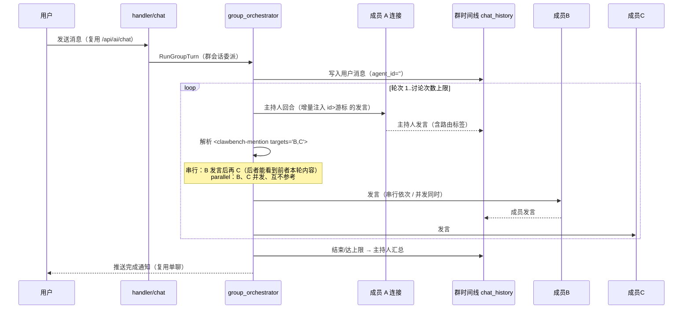
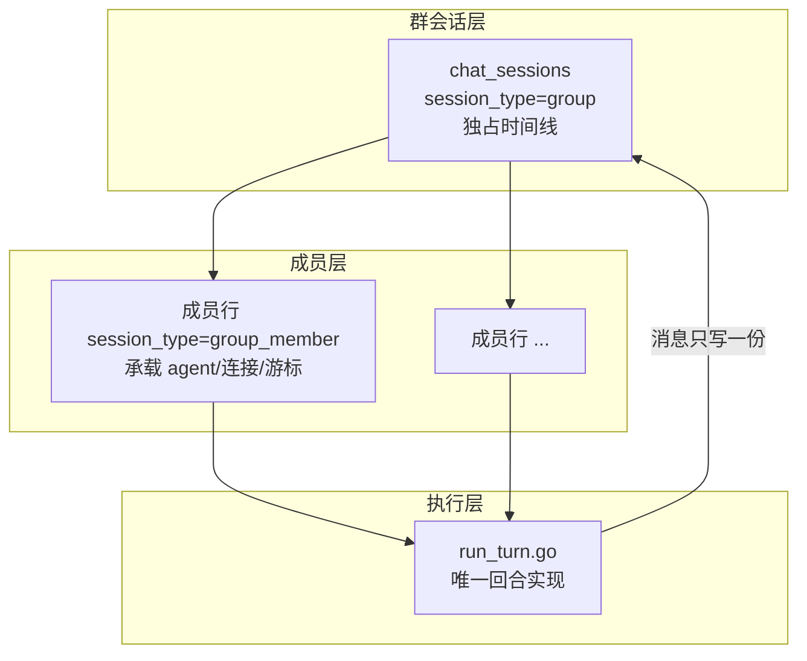

# AI 群聊

群聊让用户把**多个已配置的智能体**（可跨后端，如 CodeBuddy + Claude Code + Codex）拉进同一个会话，就同一话题进行多智能体协作或辩论。单聊一次只能问一个智能体，用户得自己当"传话筒"在多个会话间复制粘贴；群聊把"谁接着谁说、每个人看到什么"交给系统编排，用户只需发一条消息然后旁观（或随时插话）。

群聊有两种形态，**建群时是否指定主持人决定模式，且不可中途切换**：

- **主持人模式（host）**：一个被指定为"主持人"的成员控场——它决定下一个该谁发言、给出什么指令，成员发言后主持人再决策，循环直到主持人发出结束信号或智能体讨论次数达到上限。像真实团队开会：有议程、有分工、有结论。
- **自由聊天模式（free）**：没有主持人，成员通过 **@ 提及**接力——谁被 @ 谁接着发言，被 @ 的人再把话头传给下一个人，形成一条可以延续的讨论链。像微信群里一群人自由接话。

两种模式都**默认串行**发言（后发言者能看到前者本轮内容）。若本轮的路由标签带 `mode="parallel"`（成员可自行使用，自由模式还可由用户侧的**「并发执行」开关**触发），被点名的成员则**并发发言、互不参考**——它们从同一份"群回合起始高水位"快照出发，谁都看不到同轮其他成员的输出。

## 流程图

### 主持人模式：一轮的推进

```mermaid
sequenceDiagram
    participant 用户
    participant handler as handler/chat
    participant 编排器 as group_orchestrator
    participant 成员A as 成员 A 连接
    participant 时间线 as 群时间线 chat_history

    用户->>handler: 发送消息（复用 /api/ai/chat）
    handler->>编排器: RunGroupTurn（群会话委派）
    编排器->>时间线: 写入用户消息（agent_id=''）
    loop 轮次 1..讨论次数上限
        编排器->>成员A: 主持人回合（增量注入 id>游标 的发言）
        成员A-->>时间线: 主持人发言（含路由标签）
        编排器->>编排器: 解析 <clawbench-mention targets="B,C">
        Note over 编排器: 串行：B 发言后再 C（后者能看到前者本轮内容）<br/>parallel：B、C 并发、互不参考
        编排器->>成员B: 发言（串行依次 / 并发同时）
        成员B-->>时间线: 成员发言
        编排器->>成员C: 发言
    end
    编排器->>时间线: 结束/达上限 → 主持人汇总
    编排器-->>用户: 推送完成通知（复用单聊）
```

### 自由模式：@ 接力

```mermaid
flowchart LR
    U[用户消息] --> S{消息里 @ 了谁?}
    S -->|有 @| Q[初始待发言队列 = 被 @ 成员]
    S -->|无 @| Q2[全体活跃成员，按花名册顺序]
    Q --> P[取队首成员发言]
    Q2 --> P
    P --> M{输出里 @ 了谁?}
    M -->|@User| H[停下，交回人类]
    M -->|@其他成员| E[有效新目标排到队尾]
    E --> P
    M -->|无 @| Z[队列自然耗尽，结束]
```

### 群会话的三层结构

```mermaid
flowchart TB
    subgraph 群会话层
        G[chat_sessions<br/>session_type=group<br/>独占时间线]
    end
    subgraph 成员层
        M1[成员行 session_type=group_member<br/>承载 agent/连接/游标]
        M2[成员行 ...]
    end
    subgraph 执行层
        RT[run_turn.go<br/>唯一回合实现]
    end
    G --> M1
    G --> M2
    M1 --> RT
    M2 --> RT
    RT -->|消息只写一份| G
```

## 功能与设计要点

### 功能清单

- **建群**：会话列表头有独立的「建群」按钮（非复用 `+`），打开智能体多选抽屉，勾选成员、可选指定一个主持人，一次请求原子创建群与全部成员（失败整批回滚，不留"只有主持人的半成品群"）。**同一智能体可被加进同一群多次**：选中行的步进器 `− N +` 可把同一智能体加多份，每个实例是一个独立成员。**建群时不输入群名**——后端用主持人名占位（`GroupHostTitle`："XX 的群聊"），自由模式用 `GroupFreeTitle`（"群聊"），**按请求 locale 本地化**（标题会落库并显示在会话列表，故不能硬编码中文），首条消息后由 auto-title 接管
- **空状态按模式区分**：空群的首屏卡片按 `groupMode` 渲染不同文案——头部行（头像堆叠 + 模式 chip：皇冠 / @）+ 一行模式说明 + 3 条 bullet 提示。两种模式的路由方式完全不同（主持人决定 vs 成员互相 @ 接力），一句固定提示只能在一种模式下正确、在另一种下产生误导
- **成员多实例与临时昵称**：同一智能体的多个实例自动获得唯一显示名——**首个实例保留智能体本名**（`Claude`，即入群时带的显示名/智能体名）；**重复实例（第 2 个及以后）从代码内置英文名池 `groupNamePool` 取第一个未占用的名字**（`Alice`/`Bob`/…）；**池耗尽时回退 `本名 序号`**（`Claude 2`、`Claude 3`……，**永不生成 `Claude 1`**）；取名避开群内其它成员名与用户昵称；池名**永不取**与本批次任一实例本名、或群内已有智能体本名相同的名字（**真名预留**——真实智能体名恒被保留、与 order 无关）。这样 AI 之间按名字路由时不会歧义。**已存在的实例不被改名**（历史快照），故跨批次再加实例时，先前那个保持原名、只有新实例取名池名。**主持人**仍按智能体指定，取该智能体的**首个实例**。名池刻意不可配置、无设置 UI
- **成员头像**：`chat_sessions.agent_avatar` 存成员**自身**的头像 SVG 快照（前端 DiceBear 按成员名生成、随机风格、经 `POST /api/group/member-avatars` 落库，以对齐分享/导出——公开分享页无 DiceBear 运行时）。**只有同一智能体在群内被添加多次时才生成**：第 **2 个及以后**的实例各生成一个（按唯一昵称做种子，故彼此可区分）；**第 1 个实例与群内唯一的实例都不生成**——没有需要区分的副本，保留智能体自身头像即可（`speakerFromMember` 在 `agent_avatar` 为空时回退智能体头像）。存量群不回填，只在建群/加成员时生成
- **真实智能体名披露**：`SpeakerIdentity.agentName` 携带底层真实智能体名（成员显示名 ≠ 实时智能体名时非空），前端在消息的「头像 + 昵称」之后以弱化样式 `.msg-speaker-real` 显示，让读者知道发言的智能体是谁
- **成员管理**：群会话顶部横向头像条（主持人排最前、最多 4 个，最左端一个模式徽标——主持人=皇冠、自由=@）展示成员，**点整条头像条**打开群聊设置面板（`GroupSettingsSheet.vue`）；输入框上方的 ActionBar 另有一个仅群聊可见的「群聊设置」按钮打开同一个面板（它驱动头像条暴露的 `open()`，而非另挂一个实例，避免重复拉取花名册与两个面板状态漂移）。面板表头右上角是「添加成员」（打开多选抽屉批量加人，同样支持多实例），面板内可移除成员。增删成员都会在时间线写一条**居中的系统细条**（"XX 加入了讨论"/"XX 已离场"），让全员知道人员变动。**历史发言保留并标记"已离场"**——删掉某人发言会让后续"B 回应 A"失去上下文。**移除后再加同一智能体 = 新建实例**（不复用旧行、无连接恢复），序号继续递增。**系统细条在「写入时」按 `model.Language` 本地化**（`GroupMemberJoined`/`GroupMemberLeft`/`GroupUnknownMention`）：这些行既落库、又以 `[系统] <文案>` 注入每个成员的上下文，所以必须是可读句子而非键名；切换语言不追溯翻译历史（与决策 96b 一致）
- **智能体讨论次数上限**：全局设置（`chat.group_max_speeches`，默认 100，在 设置 → 聊天 → 群聊 里改），含义为「轮到用户发言前，智能体之间最多发言多少次」。**主持人模式与自由模式语义一致，只计成员发言**（主持人的路由 / 汇总回合不计）。达到上限即停止 AI 讨论（不管当前轮到谁发言）、写一条系统消息「成员间讨论次数达到上限」；主持人模式额外再产出一份汇总
- **@ 成员卡（输入侧）**：在群输入框用 `@` 唤起补全菜单，**成员候选排在文件候选之前**（群里 `@` 通常是点名发言）。选中后不插入原始标签，而是在附件条生成一张**成员卡**——卡片显示成员真实头像 + 名字，**卡片本身即公开点名**，卡片上的批注则是**密送**（`private`）。**有密送时才显示锁图标**（无密送不占视觉噪音）。用户自己的公开问题由输入框正文承担（后端以「昵称: 正文」注入成员）
- **用户昵称**：人类用户在群聊里的保留显示名（`chat.user_nickname`，默认 `User`，在 设置 → 聊天 → 群聊 里改），成员用这个名字 `@` 你、注入前缀也用它。**与智能体名双向不可重名**——智能体建/改名/复制时拒绝等于昵称，设置昵称时拒绝与现有智能体同名；字符受限（禁引号/尖括号/逗号/控制字符，≤32 rune），因为它会被写进路由标签的 `targets` 属性。改名时同步迁移待投递的密送，避免孤儿
- **@ 接力（自由模式）**：用户和成员都能用 `@` 指定下一个发言人。成员输出里的 @ 把目标排到队尾，@用户昵称（保留名）则把话头交回人类、暂停接力
- **交回用户必写系统行**：AI 讨论**干净收尾且话权回到用户**时，统一由 `runLoop` 写一条居中系统行「轮到用户发言」（i18n `GroupYourTurn`）。覆盖全部收尾路径——自由模式接力自然耗尽、成员 `@` 用户、主持人结束信号、成员发言次数达上限、以及**成员/主持人发出 AskUserQuestion**。中间排队轮次不写（`GetQueuedCount>0` 时抑制），取消/报错收尾不写。`handUserBack` 只清用户密送账，不再写系统行
- **AskUserQuestion 交回**：成员或主持人的发言里带 AskUserQuestion（转换后的 tool_use，或未转换的 `<clawbench-ask-question>` 文本）即视为向用户提问——立刻停下接力、话权回到用户，即使同一输出还 `@` 了其他成员（提问优先于点名）
- **并发执行（自由模式）**：群聊设置面板里有一个「并发」开关（群级持久设置 `parallelDefault`，存 `context_state`），**只在自由模式显示**（主持人模式下用户不参与路由，与"讨论次数上限"行恰好互为镜像）。打开后，**用户 @ 的多个成员合并为一个 parallel 组并发发言**（不 @ 人时全体成员并发）；它只作用于"用户种子"，**不影响智能体之间 @ 出的组**（那些仍按各自标签的 `mode` 走）
- **密送（BCC）**：主持人或成员可发一条只有指定目标看得到的消息（`private` 提及），在该目标**下一次发言时**注入一次。用于"暗中给某人递话"这类场景
- **群内附件与引用**：群消息支持文件附件、`@` 文件补全、引用卡片——与单聊逐字一致（附件在注入成员时渲染，气泡仍靠 `files` 字段渲染）
- **人类插话**：群回合运行中发消息走**排队**（复用单聊队列）。排队条目的按钮文案为「插话」，语义是**中断本轮并发送**（= 停止当前回合、**保留队列**、该消息作为下一回合运行）——与单聊一致，**不是**「取消」（取消会清空队列）。群聊**不提供**「插入当前回复」：群回合是多轮循环，没有单一在跑回合可注入，且注入端点按会话 id 找 ACP 连接，而群成员各自用**成员行 id** 建连，群 id 下无连接、注入必然失败。实现上群回合按**群会话 id** 注册可中断回合（`RunGroupTurnDrain`），使 `POST /api/ai/queue/interrupt` 能命中；成员回合的 executor 再从**群槽位**读取中断原因，避免被打断的成员发言被盖上「已取消」徽标
- **`/cb-*` 命令在群内生效**：命令模板注入本回合第一个发言者的 prompt（群里由主持人执行一次），结果进时间线供讨论；`/btw` 旁路问答不受影响

### 设计要点

- **成员就是一条隐藏的 `chat_sessions` 行**：成员行（`session_type='group_member'`）天然携带 `agent_id` / `transport` / `model` / `external_session_id` / `auto_approve` / `context_state`——正是"一条持久连接"所需的全部字段。于是 ACP 连接池按 session id 键控、空闲回收、resume/load 恢复、CLI `--resume` 全部**零改动**继承。唯一代价是会话列表要过滤掉成员行（用**白名单** `session_type IN ('chat','group')`，而非黑名单——新增查询漏加条件时白名单默认隐藏、黑名单默认泄漏）
- **消息只存一份，存于群会话**：成员之间只交换**发言文本**，工具调用与深度思考不进他人上下文。所有消息落进群时间线，成员行没有 `chat_history` 记录——从根上消除"两份副本不一致"的问题。**唯一例外是 AskUserQuestion**：成员向用户提出的提问卡会被渲染成可读文本注入给其他成员（见下条），因为"某人在问用户什么"是讨论上下文，而非私有工具细节
- **`run_turn` 的时间线解耦**：执行器里 `SessionID` 身兼两职——连接语义（用成员行 id，如写 `external_session_id`、查连接池）与时间线语义（用群会话 id，如落库、广播、摘要）。因此引入第二个字段 `TimelineSessionID`（缺省等于 `SessionID`，单聊路径行为不变），连接调用点用 `SessionID`、时间线调用点用 `effectiveTimelineSessionID()`。**`UpdateLastRead` 是例外**——它保持成员行 id，否则任一成员回合都会把**群**标记已读、群徽章永不亮
- **增量注入靠"发言游标"而非全量重放**：每个成员在 `context_state` 里存一个 `seen_cursor`（上次发言时群时间线的最大消息 id），下次发言只注入 `id > 游标 且作者≠自己` 的消息。这既保证成员看到讨论进展、又不重放自己说过的话。**游标只在回合成功时推进**——失败时推过去会让那段上下文永久丢失（成员后续答非所问且时间线看不出）
- **路由用结构化标签，解析失败回退轮转**：主持人输出 `<clawbench-mention targets="A,B">指令</clawbench-mention>`，后端解析出本轮发言者（有序）；标签可选带 `mode="parallel"` 表示这批目标并发发言（缺省串行，未知值回退串行）。**检测即解析、不可解析不剥离**（与 `askquestion` 的"绝不丢内容"契约一致），并回退到"下一个未发言成员"轮转；连续失败 2 次自动收尾。标签解析是独立叶子包 `internal/grouprouting`，与前端 `groupRouting.ts` 互为镜像、由 parity 语料双向固化
- **路由标识不对称是有意的：AI 用名字、用户用成员行 id**：`lookupMember` 先按成员行 id 精确匹配、再按显示名匹配。AI（主持人/成员）拿不到成员行 id，只能写**显示名**；用户 @ 提及由前端插入**成员行 id**（精确引用，改名/重名都不会误路由）。因此成员名**必须唯一**——这正是多实例需要唯一昵称（名池名 / `Claude 2`）的原因；用户侧本就按 id 路由，天然支持多实例
- **成员显示名以 `agent_name` 为权威，不回退智能体名**：`speakerFromAgent`（会话自身 agent）仍用实时 `agents.name`，但成员走 `speakerFromMember`，成员名取存储的 `agent_name` 快照。这样改智能体名不会追溯性改写群历史发言在分享/导出里的名字，多实例也各有其名。成员头像同理以 `agent_avatar` 快照为准，`speakerFromMember` 缺失时才回退智能体头像；真实智能体名经 `SpeakerIdentity.agentName` 单独披露（不覆盖昵称）
- **每个成员的 prompt 会声明其"自身显示名"**：成员/主持人/自由成员的 system prompt 都注入「你的群内显示名是「X」」，并附「其他成员」名单（排除自己）。**这是多实例身份不混淆的前提**——否则 AI 会退回 CLI 自身身份（agent 名），多个实例都自称 `Codebuddy`（甚至照名单瞎编数字），真实缺陷即四个同名实例全部报错自己的名字
- **两模式共用同一循环内核**：主持人模式与自由模式的回合脚手架、成员发言+游标推进+密送投递、@用户昵称交回、目标解析全部收敛到共享抽象（`prepareTurn` / `runSpeakerTurn` / `drainSpeakers` / `resolveSpeakerTargets`），差异只在"如何补充下一个发言者"（主持人用有界 `refill`，自由模式用自扩展 `onSpoke`）。避免两套循环逐字重复后各自漂移
- **用户昵称是"保留名"，不能与成员名撞车**：昵称会被写进路由标签的 `targets` 属性并作为注入前缀，若与某个成员同名，`@` 到底指人还是指成员就无法区分。因此昵称与智能体名**双向唯一**（建/改/复制智能体与设置昵称两处都要校验），且昵称受限字符集（禁引号/尖括号/逗号/控制字符）以免破坏标签语法。改名时把 `group_pending_bcc` 里按旧名键控的待投递密送一并迁移，否则已发出的密送会变成永远投不出的孤儿
- **串行发言可用"最新流式行"定位，并发发言必须按 id 定位**：`UpdateStreamingMessage` 按 `session_id=群 AND streaming=1 ORDER BY id DESC LIMIT 1` 命中行——这只在"一条时间线上只有一路在飞"时成立（单聊、或**串行**群回合）。并发发言时多个成员的流式行共存，落错行就会串台，因此执行器持有自己的占位符 id、改用 `UpdateStreamingMessageByID`（按 `id + session_id` 精确命中）。**并发组的快照必须整组一次性取自"回合起始高水位"**（`runParallelGroup` 在启动任何成员前先 snapshot 全部），否则后启动的成员会看到先启动者的输出，破坏"互不参考"。并发度另有启动上限（`maxParallelLaunches`），分批启动不影响快照不变性
- **单个成员失败不终止整个群**：成员发言失败复用单聊 `failTurn`（可见 warning block、带成员归属），循环继续、主持人可改选；失败残留保留在时间线供用户查看。主持人跑挂则回退轮转继续，再失败才终止群回合。**任何失败都不丢已有发言**（已落库）
- **成员能看到彼此的 AskUserQuestion**：某成员（或主持人）向用户发出的提问卡，会以**可读文本 + 方向标注**注入给其他成员——形如 `[A 向用户提问，等待用户回答] 用哪个方案？: A — 快, B — 稳`。两个理由：①"某人在问用户什么"是讨论上下文，成员需要据此判断自己该不该补充、还是等用户拍板；②不加方向标注时，成员会把问题误读成普通讨论内容而抢先回答。渲染复用 `askquestion.PlainText`（TTS 与推荐提示词用的同一个），故措辞不会与朗读版本漂移；**原始 `<clawbench-ask-question>` 标签绝不注入**（同 mention 标签的模仿事故，决策 #67），剥离后由方向标注行补回问题本身。覆盖两种持久化形态——转换后的 `tool_use`/`AskUserQuestion`（正常路径）与仍带原始标签的 text block（转换缺口/不可解析），后者按 askquestion 契约以可读 Markdown 降级。**纯提问消息（无散文）也注入**——此前 `ExtractPlainText` 对其返回空串，整条被跳过，其他成员根本不知道有人提了问
- **群成员的连接受 ACP 空闲回收保护**：成员行是隐藏会话，不会被"用户可见 running 会话"查询命中，因此 ACP 空闲 sweep 会误杀正在使用的成员连接。编排器维护"当前群回合正在使用的成员行集合"，sweep 判定回调同时查它——**不动 `GetRunningSessionIDs`**（那是喂会话列表与项目删除判定的，混入隐藏成员行会误触发"项目有会话在跑不能删"）
- **保密优先于保内容**：密送的注入侧是 **fail-closed**（剥离一切畸形/嵌套/未闭合的提及形态），显示侧是 **fail-open**（只认良构、畸形保留原文供用户查看）。摘除顺序是安全核心——`Parse` 必须在剥离一切标签后的文本上计算"标签前背景/指令"，否则密送会经公共指令段或共享背景泄漏给所有成员
- **群聊跳过逐成员摘要推荐**：成员回合的 Finalize 不跑摘要，**只在整轮群回合结束时跑一次**——否则 N 个成员 × 轮数会产生大量 LLM 推荐调用 + 全表摘要扫描

## 数据模型

| 表 / 列 | 用途 |
|---|---|
| `chat_sessions.session_type` | `group`（群会话，独占时间线）/ `group_member`（成员连接绑定行，用户不可见） |
| `chat_sessions.group_id` | 成员行指向所属群（群行自身为空）；索引 `idx_sessions_group` |
| `chat_sessions.agent_name` | **成员行的显示名（权威）**；由后端生成（首个实例用本名，重复实例取名池名，池尽回退 `本名 序号`）。非成员行留空。成员行的 `title` 留空（会话标题对成员无意义） |
| `chat_sessions.agent_avatar` | **成员行自身的头像 SVG 快照**（前端 DiceBear 按名生成、随机风格）。**仅同一智能体的第 2+ 个实例生成**（用于区分副本）；第 1 个/唯一实例留空，回退智能体头像。非成员行留空 |
| `chat_sessions.context_state` | 群行存 `group_mode`（`host`/`free`）、`host_member_id`、`parallelDefault`；成员行存 `seen_cursor` |
| `chat_history.role='system'` | 成员增删的系统事件（`agent_id=''`，居中细条渲染，计入注入游标但不计入未读） |
| `chat_history.agent_id` | **发言人成员行 id**（非 agent id）；前端据此解析发言人头像/名字并判定主持人发言 |
| `group_pending_bcc` | 密送待投递队列，按目标名字键控，成功投递后删除 |

## API 端点

全部经 `middleware.Auth`，且为项目作用域：

- `POST /api/group/create` — 建群（`hostAgentId?` + `memberAgentIds[]`，同一事务创建群与全部成员；`hostAgentId` 缺省即自由模式，须过会话上限门）
- `GET /api/group/members?groupId=` — 列成员（含 `isHost`、`mode`、`parallelDefault`、`avatar`、`agentName`）
- `POST /api/group/members` — 批量加成员（整批过成员数上限）
- `POST /api/group/member-avatars` — 批量写回成员头像（`{groupId, avatars:[{memberId, avatar}]}`；每个 SVG 过 `avatarSVGLooksSafe` 安全门）
- `DELETE /api/group/members` — 移除成员（拒绝移除主持人）
- `PATCH /api/group/settings` — 群设置（仅 `parallelDefault`）
- 智能体讨论次数上限（`chat.group_max_speeches`）与用户昵称（`chat.user_nickname`）都是**全局配置**（`PATCH /api/config`），不是每群设置
- 群消息发送**复用 `/api/ai/chat`**——`AIChat` 检测到群会话即委派编排器 `RunGroupTurn`，前端不改，不新增 `/api/group/chat` 以避免双入口

## 相关流程

- 单聊的回合编排与排队见[聊天流程](../core/chat-flow.md)与[会话生命周期](../core/session-lifecycle.md)
- 标签解析包的设计与 `askquestion` 同款（叶子包 + parity 语料），见[聊天流程](../core/chat-flow.md)
- 群成员是隐藏会话行，会话类型白名单与项目计数规则见[会话生命周期](../core/session-lifecycle.md)
