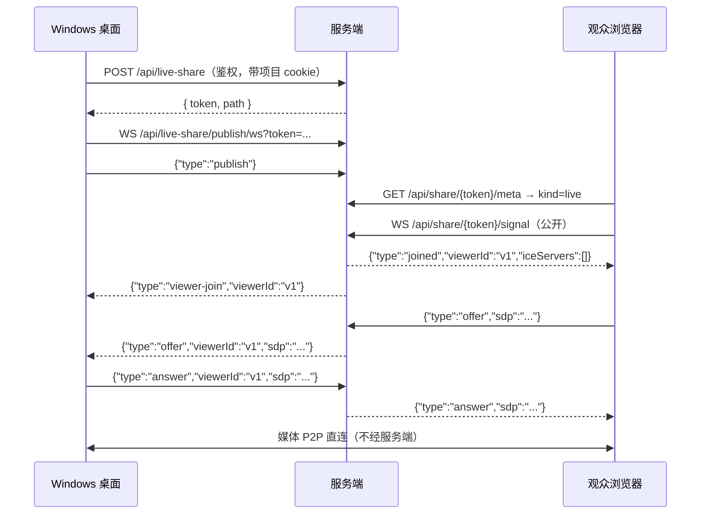

# 屏幕与声音共享（实时）

Windows 桌面客户端和 **Android App** 都可以把**屏幕画面 + 系统声音 + 麦克风**共享出去，生成一个链接；任何拿到链接的人在浏览器里打开就能看画面、听声音，**无需登录**。多个观众之间还能互相说话（经发布端混音）。

macOS / Linux 桌面客户端同样可以发布，只是**没有系统声音**（Electron 的 `audio: 'loopback'` 仅 Windows 可用），画面与麦克风不受影响。

这是「看着 AI 干活」的直播，不是投屏工具：链接的模型与文件/会话分享一致——**token 即凭证**。

## 流程图

### 建立连接


```mermaid
sequenceDiagram
    participant 发布端 as Windows 桌面
    participant 服务端
    participant 观众 as 观众浏览器

    发布端->>服务端: POST /api/live-share（鉴权，带项目 cookie）
    服务端-->>发布端: { token, path }
    发布端->>服务端: WS /api/live-share/publish/ws?token=...
    发布端->>服务端: {"type":"publish"}
    观众->>服务端: GET /api/share/{token}/meta → kind=live
    观众->>服务端: WS /api/share/{token}/signal（公开）
    服务端-->>观众: {"type":"joined","viewerId":"v1","iceServers":[]}
    服务端-->>发布端: {"type":"viewer-join","viewerId":"v1"}
    观众->>服务端: {"type":"offer","sdp":"..."}
    服务端-->>发布端: {"type":"offer","viewerId":"v1","sdp":"..."}
    发布端->>服务端: {"type":"answer","viewerId":"v1","sdp":"..."}
    服务端-->>观众: {"type":"answer","sdp":"..."}
    观众<<->>发布端: 媒体 P2P 直连（不经服务端）
```

**服务端只转发 SDP / ICE，从不解析、从不承载媒体。** 每个观众与发布端之间是独立的 `RTCPeerConnection`，观众发 offer、发布端答 answer。

## 功能与设计要点

### 功能清单

- **纯 P2P WebRTC**：媒体点对点直传。观众上限 **8**，受发布端上行带宽约束（每个观众一条独立编码流）
- **分享链接**：复用现有 `/share/{token}` SPA，`kind: 'live'`。token 32 位 hex，与文件/会话分享同级。**链接按本机全部地址生成**（见下）
- **系统声音**：Windows 上通过 `audio: 'loopback'` 采集。**macOS / Linux 不支持**——这是 Electron 的限制，非实现取舍；非 Windows 平台 UI 不提供该开关
- **画面是选择，不是开关**：创建页把「不共享」和每个屏幕/窗口画成同一种格子（缩略图 + 屏幕/窗口标签），点谁共享谁。宿主还没给出列表时（macOS 未授权屏幕录制、Wayland portal 未询问）多一格「选择共享画面」，点了才去拉列表；纯浏览器没有列表，它的选择器就是源，所以那一格直接是「共享屏幕」。摄像头 / 麦克风 / AI 听记仍是独立的勾，同属「画面与声音」一组
- **麦克风**：与系统声音在 `AudioContext` 里混音后发送。麦克风被拒绝不影响共享（画面仍可发）。**输入设备是一份偏好清单**：机器上有多个输入时全部列出，点一个换一个——一场会议只发布**一个**麦克风，`deviceId` 以 `exact` 约束传给 `getUserMedia`（设备已拔掉时走既有的「无本地声道」降级，不中止会议）。设备**标签**在首次授权前是空的（浏览器指纹防护），此时按序号显示，不隐藏。**会中也能换**（`switchMicDevice`）：先开新设备再释放旧的，成功后同时改写三处持有麦克风的图——混音器（`LiveMixer.setMicStream`）、听记录音（`LiveNoteCapture.addChannel` 替换同名的 `mic` 声道）、以及电平表（分析节点跟着源节点重建），对端连接完全不动，所以观众听不到断点；麦克风关闭时清单隐藏，避免"静音状态下打开一个设备"
- **多人语音**：观众打开自己的麦克风开关即可发言，**其他观众也能听到**（见下）
- **发言授权**：房间级开关默认**关闭**；开启后观众自行开关麦克风；发布端可单人静音与「全部静音」
- **零新增依赖、零新增端口**：服务端只多一个内存房间表，端口仍然只有 TCP 20000

### 为什么多人语音不需要 SFU

发布端本来就和每个观众各有一条连接，也本来就收到所有人的音频。所以为每个观众建一个独立混音即可：

```
dest[A] = 系统声音 + 发布端麦克风 + 观众B的音轨 + 观众C的音轨 + …   ← 排除 A 自己
dest[B] = 系统声音 + 发布端麦克风 + 观众A的音轨 + 观众C的音轨 + …   ← 排除 B 自己
```

- **0 条额外连接、0 服务端媒体工作**
- 8 人只多约 256kbps 上行（视频本身就要 16Mbps，占 1.6%）
- 代价是多一跳：A 说话 → 发布端 → B，局域网下约多 100–200ms

视频 mesh 才需要 SFU（8 人 28 条额外连接、56Mbps 上行）；音频不需要。

**排除自己是一条代码级不变量**：把 `viewerTrack[X]` 连进 `dest[X]` 会让 X 听到自己，并经发布端外放再被麦克风拾取，产生无限回声。

### 观众上行不需要重新协商

观众加入时先占一条 `sendrecv` 音频 m-line（不挂 track），之后开麦/闭麦只用 `replaceTrack`：

```ts
const tx = pc.addTransceiver('audio', { direction: 'sendrecv' })
await tx.sender.replaceTrack(micTrack)   // 说
await tx.sender.replaceTrack(null)       // 停
```

实测（Electron 44 / Chromium）`signalingState` 全程保持 `stable`、SDP 不变。若改成"发言时重新 offer"，会引入 SDP 抖动与连接重建风险。

### 发言授权：一个房间开关 + 一个麦克风开关

文件分享的 token 是**只读**的，泄露顶多被看。**多人语音的 token 是写权限**——拿到链接的任何人都能往房间灌声音，且**所有观众都会听到**。所以授权模型只有两层：

| 层级 | 机制 |
|---|---|
| 房间级 | 发布端显式勾选「允许观众发言」，**默认关闭**。关闭时服务端直接拒绝 `talk-start`（观众端回 `talk-disabled`） |
| 人级 | 房间开启后，观众自己点麦克风开关即可发言/静音；发布端可随时静音某个人或「全部静音」 |

**刻意没有「申请 → 批准」这一层。** 早期设计有逐人审批，后来移除了：房间开关本身就是安全边界（默认关闭，只有发布端能打开），在其之上再加一层逐人确认只是摩擦，没有对应的威胁模型。

观众端只有一个麦克风开关（开 = 上行麦克风，关 = 静音），**不是**按住说话。开关式在这个场景更好：多人语音是「一起聊」而不是「轮流发言」，按住说话在长时间讨论里是纯粹的负担。

### 状态机

每个观众只有一个布尔：麦克风开/关。

```
none --talk-start--> talking        （要求房间开关已开）
talking --talk-end--> none
talking --talk-revoke--> none        （发布端静音这个人）
talking --mute-all--> none           （发布端全部静音）
talking --set-talk-enabled(false)--> none  （房间开关关闭，连带静音所有人）
```

`talk-start` 在房间开关关闭时**拒绝并回 `talk-disabled`**，不静默忽略——静默会让「开关点了没反应」变成不可诊断的问题。`talk-end` 永远允许，这样发布端刚关掉开关时观众仍能正常上报自己已静音。

### 分享链接按「全部本机地址」生成

`window.location.origin` 只知道浏览器恰好用的**那一个**地址。一台机器同时有 Wi-Fi（`192.168.100.104`）、USB 网卡（`192.168.100.142`）和 Docker 网桥（`172.17.0.1`）时，同事可能不在同一网段，拿到的链接打不开。

所以三个分享入口（屏幕共享 / 文件分享 / 会话分享）都改为请求 `GET /api/server/addresses`，由服务端枚举地址：

- **默认只显示一条主链接**，其余折叠在「查看全部 N 个地址」后面——常见场景下满屏 IP 只是噪音
- **主链接优先选浏览器当前用的那个地址**：用户此刻能用它访问，说明它在这个网络里是通的，这是最好的证据。当前地址不在列表里时（localhost / 域名 / 反向代理），仍以浏览器 origin 为主
- **虚拟网卡不隐藏，只标注**：`172.17.0.1` 这类地址仍会列出，但标「虚拟网卡」。静默丢弃会让用户无法解释「为什么这个地址别人打不开」

**唯一被过滤的是 IPv6 隐私地址**。现代系统每个接口会额外分配若干 RFC 4941 临时地址，**每隔几小时轮换**。实测一台双栈笔记本 17 个地址里有 14 个是这种，发给同事时大概率已失效，还会把真正可用的 3 个埋掉。`net.IP` 拿不到 temporary 标志，所以按 **(接口, /64)** 折叠：稳定地址与它的临时兄弟共享 /64，折叠后每个前缀只剩一条。

### 发布端能听到观众

`LiveMixer` 把每个观众的远端音轨连到 `ctx.destination`（扬声器），所以发布端能听到观众说话。**只有远端音轨连扬声器**——发布端自己的系统声音和麦克风绝不监听，否则会听到自己的延迟回声。

### 观众端必须处理的三件事

1. **自动播放策略**：带音轨的 `<video>` 在无用户手势时会被拦截。处理是先 `muted` 播画面，顶部显示「点击开启声音」。**不要**直接报错。
2. **发布端断开**：收到 `publisher-gone` 或 `pc.connectionState === 'failed'` 时显示「共享已结束」。每次 `POST` 都是新 token，所以只能提示重新索要链接。
3. **ICE 失败要说清原因**：纯 P2P 下常见原因是双方不在同一网段、AP 禁了组播（mDNS 候选解析失败）、或开了客户端隔离。提示里要列出这三条，不能只说「连接失败」。

### 已知限制

| 限制 | 说明 |
|---|---|
| 仅同一局域网 | **无 TURN 中继**。跨网段、公网、开客户端隔离的 AP 一律不可用 |
| mDNS 候选 | 观众端是浏览器、通常无媒体权限，Chromium 会把 host candidate 伪装成 `<uuid>.local`。AP 禁组播则解析失败 |
| 系统声音仅 Windows / Android 10+ / 部分浏览器 | Electron 的 `loopback` 只支持 Windows；安卓走 AudioPlaybackCapture，且只能录到允许被录制的声音；浏览器由选择器决定（Chrome 只在共享标签页或整个屏幕时给音频） |
| 8 人上限 | 发布端上行 = N × 码率 |
| 房间是内存态 | 进程重启即失效（语义正确：直播是瞬时的） |

## 控制通道（小会工具）

媒体之外还有一条 **RTCDataChannel**（发布端在每条连接上创建，观众 `ondatachannel` 接收）。它承载的不是画面，而是：

| 消息 | 用途 |
|---|---|
| `laser` | 激光笔位置（2.5s 无更新自动隐藏） |
| `ink` / `ink-undo` / `ink-clear` | 画面标注（自由笔迹） |
| `chat` | 文字聊天（两端各自保留本次会话的消息；后加入的观众看不到之前的聊天） |
| `presence` | 观众窗口是否可见（「离开」标记） |
| `talk` | 说话电平（发布端 → 观众，0..1，只在跨越阈值或明显变化时发） |
| `ctrl-req` / `ctrl-grant` / `ctrl-ev` | 远程控制的申请、授权与指针事件 |

信令通道（WebSocket）另有一条与能力相关的状态帧：发布端发 `set-control-enabled` 声明「我能不能被远程控制」（注入器 + 整屏），服务端转发给每个观众 `control-enabled`，并在 `joined` 里带上当前值。观众端据此灰显按钮，见下文「远程控制」。

**坐标系是 0–1 归一化到画面内容**，不是像素：观众 A 是 16:9 带黑边、观众 B 是全屏裁切，同一个像素坐标在两人屏幕上落在不同位置。换算只在 `liveControl.ts` 的 `contentRectOf` / `toNormalized` / `fromNormalized` 里做，绘制层与标注层都走它。

**发布端是这条通道的中转**：观众发来的帧被打上 `from` 后广播给其他观众，所以观众的激光笔别人也能看见，且不需要服务端参与。

**说话人高亮由发布端测量**：所有麦克风都在它这里汇合（观众只收到混音，自己量不出来）。`LiveMixer` 给每条远端音轨和发布端自己的麦克风各挂一个 `AnalyserNode`，每 200ms 算一次 RMS；只有**跨越「在说话」阈值**或数值变化超过 0.1 才发一帧 `talk`，安静的会场因此零流量。观众端收到后点亮 900ms 的「X 正在说话」，超时自动熄灭——发布端停止发送（静音、切后台）时不能留一个常亮的灯。

**远程控制**注入指针（移动/点击/滚轮）与键盘（命名键 + 任意文本）。

- **不需要安装任何东西**：注入由随应用分发的 `input-helper.exe` 完成（Go 写的，纯 `syscall` 调 `SendInput`，无 CGO、无原生 npm 模块）。Electron 在首次需要时 spawn 它，用 NDJSON 走 stdin/stdout，一次一个回执。
- **键盘分两种**：命名键（Enter/方向键/F1–F12/Delete…）按虚拟键码发；单个可打印字符走 `KEYEVENTF_UNICODE`，所以中文、emoji 都能输入，不依赖键盘布局。
- **只有 Windows 发布端能注入**：`internal/inputinject` 在其它平台是 stub（`Supported()` 恒 false），因为只有 Windows 会发起共享。发布端面板挂载时读一次 `remoteControlSupported()`，不支持时**不显示「允许」按钮**，改成一行说明——让人点了没反应比不给按钮更糟。
- **能力由发布端广播、观众端据此灰显**：观众能不能申请控制，取决于**发布端**（有没有注入器 + 当前画面是不是整屏），观众端自己算不出来。所以发布端用 `set-control-enabled` 把它告诉房间，服务端在 `joined` 里带给后加入的观众、变更时推 `control-enabled`；观众端只按这个标志决定「请求控制」是可用还是灰显（灰显时 title 说明原因）。观众自己的平台不参与判定：浏览器观众照样能驱动 Windows 发布端，浏览器**当发布端**时才因没有注入器而广播不可用。
- **`input-helper.exe` 是打包产物**，不在仓库里：`release.yml` 的每个桌面 job 会跑 `desktop/scripts/build-input-helper.mjs`，`build.sh` 也跑一次（否则本地 `npx electron-builder --dir` 出来的包里没有它，远程控制会静默失效）。
- **Escape 是本地逃生键**：按 Esc 只结束自己的控制，不会转发给对端。
- 限制：仅 Windows 可注入；对端窗口若以管理员权限运行（UIPI），`SendInput` 会被系统拒绝，界面会收到 `ok:false` 而不是假装成功。

## 成员端：浏览器 vs 客户端

同一个分享页在两种宿主里跑，能力不同：

| 能力 | 浏览器 | 桌面客户端 |
|---|---|---|
| 观看画面 / 聊天 / 标注 / 缩放 | ✓ | ✓ |
| 共享自己的屏幕 | 仅 HTTPS | ✓（原生选择器，HTTP 也行） |
| 使用麦克风 | 仅 HTTPS | ✓ |
| 被主持人远程控制 | ✗（浏览器没有输入注入 API） | ✓ |
| 系统声音 | ✗ | ✗（成员端没有第二条音频 m-line） |

客户端入口在共享弹窗里：「加入别人的共享」→ 粘贴链接 → 在独立窗口打开（复用同一 preload，所以分享页能识别出自己跑在客户端里）。

**为什么客户端能绕开 HTTPS**：桌面壳启动时对配置的服务器 origin 加了 Chromium 的 `unsafely-treat-insecure-origin-as-secure`（见 `desktop/src/main/index.ts`），所以 `navigator.mediaDevices` 在该 origin 上存在。切换服务器需要重启才生效——这是进程级开关的固有限制。

**客户端模式下共享屏幕要先选源**：Electron 的 `setDisplayMediaRequestHandler` 拒绝未声明的源，所以分享页会先调 `listCaptureSources()` 弹一个选择器，再 `setPendingCaptureSource()` + `getDisplayMedia()`。

浏览器端在主持人开启「允许成员共享屏幕」时会显示一条提示，说明共享屏幕/系统声音/被控制需要客户端——只在真的用得上时出现，不是每场都弹。

## 成员反向共享屏幕

发布端可以打开「允许成员共享屏幕」，成员（**电脑**浏览器）就能把自己的屏幕共享给**所有人**。

### 链路

```
成员浏览器                发布端（Electron）              其他观众
getDisplayMedia
  └ 屏幕轨 ──P2P──▶ 收到 ──replaceTrack──▶ 转发 ──P2P──▶ 看到
```

- **一次只允许一个人**：第二个人点会收到 `screen-denied / busy`。原因是转发成本：每个共享者都要在发布端复制成 N 路，N 个共享者就是 N×N。
- **共享者收不到自己的画面**（发布端转发时跳过它）——否则自己的屏幕会延迟一拍回放，变成回声。
- **四条 m-line 在加入时就协商好**，开始/停止只 `replaceTrack`，不重新协商：

  | m-line | 方向 | 内容 |
  |---|---|---|
  | 1 | sendrecv | 成员麦克风 ↑ / 混音 ↓ |
  | 2 | sendrecv | 发布端**主画面** ↓ / 成员共享画面 ↑ |
  | 3 | sendonly / recvonly | 发布端**转发**别人的共享画面 ↓ |
  | 4 | sendonly / recvonly | 发布端**摄像头** ↓（画中画小窗） |

  这个顺序是前后端的契约（`useLiveShare.ts` 与 `liveViewer.ts` 必须一致）。中途加 m-line 会强制重新协商，而连接上正跑着会议。

  **主画面 = 屏幕轨 ?? 摄像头轨**：只有摄像头时摄像头走第 2 条，第 4 条不挂轨（否则观众会把同一张脸渲染两遍）；屏幕 + 摄像头同时存在时第 2 条走屏幕、第 4 条走摄像头。摄像头必须用**独立的 `MediaStream`**（`setStreams`），和主画面共用一个流会让观众把摄像头挂到主 `<video>` 上、屏幕消失。

  发布端接受**三或四条** m-line：三条是旧缓存页面，只是没有小窗，主画面照常——拒绝会让整场共享对那个观众失效。

  摄像头开关只切 `track.enabled`（不重协商）；画面本身可以随时开关——开始/停止共享屏幕、开/关摄像头都只是对已协商的 m-line 做 `replaceTrack`，**从不重新协商**。三种状态（有没有画面 / 摄像头开着吗 / 画面是屏幕吗）打包成一帧 `set-picture` → `picture-state` 发给观众：分开发会让观众短暂渲染出一个从未存在过的组合。

### 权限

- 房间级开关「允许成员共享屏幕」，**默认关闭**（和发言一致：token 是读凭证，共享屏幕比开麦交出去的东西更多）。
- 发布端可随时关开关（连带停掉正在共享的人），也可只停某一个人。
- 被拒绝时服务端回 `screen-denied`，成员端**立即释放本地采集**——否则浏览器的「正在共享」指示会一直亮着，实际什么也没发出去。

### HTTPS 是硬门槛

`getDisplayMedia` 只在安全上下文存在：`http://192.168.x.x:20000` 这种页面里 `navigator.mediaDevices` 直接是 undefined。所以：

- 成员端**必须通过 HTTPS 打开分享页**。自签名证书有两条路：设置 → 安全 →「HTTPS 证书」里点「生成自签名证书」（覆盖本机所有 IPv4 + localhost，一键重启），或命令行 `./clawbench --gen-cert`。浏览器点一次「继续访问」之后即生效。
- 证书把**IP 写进 SAN**（浏览器不认 CN）；换网络后 IP 变了要重新生成一次。设置面板会显示当前覆盖的地址。
- 同一限制也作用于**观众麦克风**——HTTP 下「允许观众发言」同样用不了。
- 手机**浏览器**（Chrome Android / Safari iOS）不支持共享屏幕，只能看；安卓**App** 内可以发起共享（见下一节）。
- 开关打开但当前不是安全上下文时，按钮**仍然显示但置灰**并提示需要 HTTPS：直接隐藏会让人以为功能不存在。

## 浏览器发起共享

桌面浏览器（Chrome / Edge / Firefox / Safari 15+）也能当发布端：Dock 的「桌面共享」页签在安全上下文里出现，采集走标准 `getDisplayMedia`。房间、信令、P2P、混音、听记、观众端与客户端完全一致，服务端一行没改。

### 与客户端的三点差异

| 能力 | 桌面客户端 | 浏览器 |
|---|---|---|
| 选择共享源 | 先列出屏幕/窗口（带缩略图），再 `setPendingCaptureSource` 声明 | 无列表：`getDisplayMedia` 自带系统选择器 |
| 中途切换共享源 | 源网格里选一个 | 再调一次 `getDisplayMedia`（等于再弹一次选择器） |
| 系统声音 | 采集屏幕时一律请求 `audio: true` | 同左（Chrome 只在标签页/整个屏幕时提供；没有就是纯视频流）。**没有开关**：系统声音跟着画面走，用户不需要选 |
| 窗口最小化 | `setPublishingActive` 保活，编码不降频 | 无等价物，标签页被隐藏时可能掉帧 |
| 被观众远程控制 | Windows 可注入 | ✗（浏览器没有输入注入能力，按钮显示为不支持） |

### 两个实现分支

- **没有源列表就没有「选源」这一步**：`start()` 只在宿主提供 `setPendingCaptureSource` 时才声明源并先校验；否则直接 `getDisplayMedia`。浏览器每次调用都会弹自己的选择器，所以「切换源」在浏览器端就是再调一次，不渲染源网格（`openSwitch()` 按 `hasNativeCapture` 分叉）。
- **`captureKind` 由 `getSettings().displaySurface` 推导**：`monitor` = 整个屏幕，`window` / `browser` = 窗口或标签页。它只影响远程控制与标注覆盖层：窗口/标签页共享时指针映射到桌面会错位，所以按「非桌面」处理。
- **先采集、再建房间**：`getDisplayMedia` 要求瞬时用户激活，而建房间 + 查地址是两次网络往返，慢网下会把手势窗口耗掉，浏览器随后拒绝一个用户明明发起的请求（Firefox / Safari 最严格）。采集只依赖本地能力（原生声明是 IPC），所以放在最前不损失什么；代价是建房间失败时要显式 `stop()` 释放采集，否则浏览器的「正在共享」指示会一直亮着。

### 门槛

- **必须是安全上下文**：`http://192.168.x.x:20000` 下 `navigator.mediaDevices` 是 undefined，页签直接不出现（与之前一致）。要发起就开 HTTPS（见「HTTPS 是硬门槛」的证书说明）或用 localhost。
- **手机浏览器不支持**：Chrome for Android / Safari iOS 都没有 `getDisplayMedia`，手机端发起仍然只能靠安卓 App。
- **观众开麦同样要安全上下文**：HTTP 打开的分享页能看画面，但发言要 `getUserMedia`。麦克风开关与「共享屏幕」走同一套判定（`canTalk` / `canShareScreen`），不可用时置灰并提示需要 HTTPS——否则按钮点下去只会静默弹回。
- 能力判定集中在 `web/src/utils/screenCaptureSupport.ts`：`getDisplayMedia` 是否存在决定「能不能采」，`isSecureContext` 只用来选提示文案（「需要 HTTPS」而不是「请更新客户端」）。

## 安卓端发起共享

Android App 也能当发布端：Dock 的「桌面共享」页签在安卓上可用，分享出去的是**手机屏幕 + 系统声音 + 麦克风**。房间、信令、P2P、混音、听记、观众端全部复用桌面那套，服务端一行没改。

### 为什么不能直接用 getDisplayMedia

Android WebView 里**没有** `getDisplayMedia`（Chrome for Android 也一直没有）。所以采集必须是原生的 `MediaProjection`，再想办法把画面送回 WebView 变成一条 `MediaStreamTrack`：

```
MediaProjection ─▶ VirtualDisplay ─▶ ImageReader ─▶ 缩放 + JPEG
                                                        │
                                          （原生 tick 通知页面）
                                                        ▼
                            JS 桥取帧 ─▶ 解码 ─▶ VideoTrackGenerator / canvas
                                                        │
                                                        ▼
                                            现有的 RTCPeerConnection
```

- **帧走「原生推、页面拉」**：原生每产出一帧就 `evaluateJavascript` 触发一次 tick，页面在 tick 里调 `takeScreenFrame()` 取走。反过来让页面 `setInterval` 轮询是不行的——分享自己屏幕时 App 必然在后台，Chromium 会把隐藏页面的定时器压到约 1 Hz，轮询当场瘫掉；而脚本求值不受这个限制。
- **只有最新一帧有意义**：原生只保留一个帧槽，页面没取走就被下一帧覆盖。解码期间到来的 tick 直接丢弃，天然形成背压，不会越积越多。
- **优先 `VideoTrackGenerator`，回退 canvas**：canvas 的画面由合成器产出，而 App 在后台时合成器是暂停的；`VideoTrackGenerator` 的帧直接进 WebRTC 管线，不经过合成器，后台也能持续出帧。老 WebView 没有这个 API 时退回 `canvas.captureStream(0)` + `requestFrame()`，代价是后台可能卡顿。

### 系统声音

`AudioPlaybackCapture`（Android 10 / API 29 起）把设备播放的声音录成 PCM，按 100 ms 一块推给页面；页面用一个环形缓冲 + `ScriptProcessor` 把它转成音轨，之后就走桌面端完全相同的 `LiveMixer` 混音链路。

- **只能录到「允许被录制」的声音**：媒体、游戏可以；通话（`USAGE_VOICE_COMMUNICATION`）平台层面就抓不到，DRM 内容同理。UI 上明确写了这一点，避免用户以为录不上是 bug。
- **抖动缓冲**：先攒 0.2 s 再开始播，超过 0.6 s 就丢掉多余的（回到 0.2 s）。不这么做的话，桥接侧的抖动会一路累积成越来越长的延迟。
- 低于 Android 10 时 `getAudioCaptureSupport()` 返回 `systemAudio:false`，开关置灰并说明原因，而不是点了没反应。

### 前台服务与系统确认

- 采集跑在 `ScreenShareService`（`foregroundServiceType="mediaProjection"`）里。这不是选择而是要求：**必须先有该类型的前台服务，才能调 `getMediaProjection()`**，且投影回调要在 `createVirtualDisplay()` 之前注册。App 在共享期间始终处于后台（用户在看别的应用），Activity 级的采集会被直接回收。
- Android 14+ **每次开始共享都要用户点一次系统确认**，无法缓存或复用。确认框由系统绘制，应用无法跳过。
- 共享期间常驻一条通知（`正在共享屏幕`）——这既是平台的硬性要求，也是用户唯一能看到的「还在共享」提示。
- `MainActivity.pauseWebView()` 只调 `onPause()`、**刻意不调 `pauseTimers()`**，所以切到后台后 JS 仍在跑；再叠加「原生推 tick」，共享不会因为切应用而断流。
- 旋转屏幕会重建 VirtualDisplay：不重建的话虚拟显示还停在旧尺寸，画面会被拉伸。

### 安卓端的差异

| 能力 | 桌面端 | 安卓 App |
|---|---|---|
| 选择共享源 | 屏幕 / 窗口列表 | 无（系统确认框决定，恒为整屏） |
| 中途切换共享源 | ✓ | ✗（只有一个源，按钮不显示） |
| 系统声音 | Windows | Android 10+，且只限允许录制的声音 |
| 被观众远程控制 | Windows 可注入 | ✗（需要无障碍服务，不做） |
| AI 听记 | ✓ | ✓（与会议页签同一条链路） |
| 分辨率 / 帧率 | 原始分辨率 | 最长边 1280、10 fps（桥接 + 二次编码的成本上限） |

## 界面位置

桌面共享不再是顶栏的一个弹窗，而是**左栏 Dock 的一个页签「会议」**（在「端口映射」前面）。一个页签，五个视图：

| 视图 | 内容 |
|---|---|
| 会议记录（默认） | 本项目的会议列表（数据库记录，永久）；footer 两个入口：加入会议 / 创建会议 |
| 创建会议 | 会议名称（选填）→ 画面（共享屏幕 + 源 / 摄像头）→ 声音与听记 |
| 加入会议 | 昵称（必填）+ 链接；桌面端在独立窗口打开 |
| 会议中 | 基础 / 转写 / 聊天三个页签 + 结束会议 |
| 记录详情 | 纪要 / 转写 / 聊天 + 产物路径 + 打开文件 / 复制 / 删除 |

- **结束会议直接落到记录详情**，没有单独的「会后纪要」界面：生成中、生成失败、无产物都在详情里表达。
- **返回**：创建 / 加入 / 记录详情 / 会议中四个子页都支持屏幕左右边缘内划返回（Android 物理返回键同一条链路），一律回到会议记录列表。会议中的返回**不结束会议**，列表里那条「进行中」的记录点开会回到会议中。
- 会议进行中页签右上角挂**主题色圆点**（`.dock-badge--live`，无数字）。不再用红色区分「录音中」——红色只留给错误。
- 页签**恒显示**：记录永远可读；宿主不能采集屏幕时，创建页里说明缺什么。
- **观众端（分享页）先过昵称门**：填了昵称才建立信令连接（不占观众名额），昵称记在 `localStorage`，发布端观众列表与聊天署名都用它。
- **会议没有类型**。「语音会议 / 视频会议」这个概念不存在：一场会议从头到尾是同一种东西，画面只是它此刻的状态。
  - 创建页是**一组独立勾选**：共享屏幕（+ 源）、摄像头、麦克风、AI 听记。全都不勾也允许开始——那就是一场只有链接、观众和聊天的会议。
  - **会议中随时可切**：基础页有「共享屏幕」和「摄像头」两个开关，走 `startScreen` / `stopScreen` / `setCameraEnabled`，只对已协商的 m-line 做 `replaceTrack`，观众无需重连。
  - 观众端据 `picture-state` 的 `video` 渲染/移除「暂未共享画面」占位；`video`（有没有画面）、`camera`（摄像头开着吗）、`hostScreen`（画面是屏幕吗）是三个正交标志，一帧全带。
  - **关掉屏幕时摄像头自动转主画面**；两者都没有时回到占位。摄像头在会议开始时没采、中途打开也能用（那时才 `getUserMedia`）。
- **`hostScreen` 决定桌面类能力**：标注、切源、远程控制只在「画面是屏幕」时可用；摄像头画面没有桌面坐标可映射。这些入口跟着当前画面出现/消失，而不是跟着创建时的选择。
- **系统声音没有开关**：它只能随屏幕采集一起来（`getDisplayMedia({audio:true})`），所以一律请求；源不带音频就没有，用户不需要知道这件事。
- 顶栏没有听记入口：Dock 页签是唯一入口（`headerClusterSpacing.test.ts` 钉住顶栏只有「主题 → 服务器」）。
- **四个子页的底部动作条与定时任务一致**：药丸按钮 `.fbtn`（`--primary` / `--danger`），条本身 `padding: var(--space-3) var(--space-4)` + `background: var(--bg-primary)` + 顶部发丝线，不再各写一份 `.meeting-btn`；窄面板放不下时 `flex-wrap: wrap` 换行。规范与理由见 `docs/spec/client/design-guide.md` §按钮，守卫 `components/live/__tests__/meetingFooterButtons.test.ts`。正文里的行内小动作（产物行的「复制路径」）仍用小号局部类。

### 会议记录

- 一条记录 = `live_notes` 表的一行，**身份是 token**。发布端连上信令时创建、断开时收尾，与「有没有录到东西」无关。
- **永久保留**：转写分段、聊天、磁盘目录都不按天清理；删除记录（或删除项目）是唯一的删除路径。
- 产物目录（`.clawbench/notes/<场次>/`）是**可选**的：第一次要写录音、聊天归档或纪要时才创建。项目改名不影响（记录里存的是目录**名**）。
- 记录可以拖进聊天作为引用（与 git 提交 / issue 一致）；详情顶部的引用按钮走**与 issue/PR 详情相同的引用条**（composer 模式：先预览会议 chip，用户填批注后提交才落卡片），正文支持选中文字引用。

## AI 听记

发布端可选开启「AI 听记」：共享过程中实时转写，停止后生成结构化会议纪要（概要 / 议题与讨论 / 结论与决定 / 待办事项），观众可以展开只读面板跟读。**默认收起**，不挡画面。

### 为什么必须在发布端采集

共享是纯 P2P，**服务端一个音频包都收不到**。而发布端本来就握着全部音源：系统声音、自己的麦克风、以及每个观众的麦克风（`pc.ontrack`）。所以转写只能在发布端做——它也是唯一还保留着**信道分离**的地方。

### 信道分离 + 按时间重排

每个音源单独录一条信道，互不混音：

```
mic         发布端的麦克风
viewer:<id> 每个观众的麦克风，一人一条
```

**只录麦克风，不录系统声音**。系统回环会把机器上正在播放的一切都录进来（音乐、通知音、另一个会议），而它唯一有价值的内容——远程参与者——在本产品里本来就通过 `viewer:<id>` 单独一路进来。早先两路都录时，同一句话会在 `system` 和 `mic` 各出现一次，靠 5 秒窗口去重才勉强合并；去掉之后这段重复从源头消失了。

于是**说话人标签是免费拿到的**，不需要说话人分离（diarization）模型。代价是各信道独立转写、完成顺序与说话顺序不同，所以读取时必须按 `startedAt` 重排——`startedAt` 由发布端**同一个时钟**打，跨信道可比。

- **在停顿处切段**，不是按固定时钟切：用 `AnalyserNode` 每 100ms 取一次 RMS，静音超过 450ms 且本段已满 4s 就收尾；连续说话则由 20s 硬上限兜底（仍在 Whisper 原生窗口内）。固定 10s 切会让每句话都有概率在词中间断开，Whisper 在切口处会吞词或猜词，一小时会议几百个切口，转写质量会明显变差。
- 每次收尾都得到**独立可解码**的完整 WebM/Opus 文件（`timeslice` 更省，但只有第一片带容器头，后续切片单独解不出来）。整段全是静音的会被丢弃——它不含内容，送上去只会换回一个空字符串；无法测电平的短尾段则保留（「不知道」不能当成「静音」）。
- 上传**每信道串行**，失败按 1s/3s/9s 退避重试。**积压不丢段**——字幕可以滞后，转写不能缺口；队列上限 180 段/信道（约 30 分钟音频）只是防内存泄漏的硬闸门，触顶会在界面上标「转写不完整」。
- 停止时先停录音机、等最后一段真正产出（`onstop` 才生成 blob）再关 `AudioContext`，然后等队列排空（最长 3 分钟）才生成纪要；排不空就明确提示「纪要可能缺少结尾」。
- 回声去重：发布端用扬声器外放时，观众的声音会被自己的麦克风再次采到，同一句话可能出现在两条信道。合并时若两条信道在 **±5s** 内出现**归一化后完全相同**的文本，只保留较早的那条。真正的同时说话用词不同，不受影响。

### 产物：录音 + 三份 Markdown + 聊天（永久）

会议结束时，这场会落成一个目录（第一次真正要写东西时才创建）。**记录与目录都是永久的**，只有删除记录（或删除项目）才会消失：

```
<项目>/.clawbench/notes/2026-10-31-1430-周会-a1b2c3/
    minutes.md               纪要（末尾链接同目录的另外两份）
    transcript.vtt           原始转写（STT 原样输出，WebVTT 字幕；cue id = 信道，正文 <v 昵称>）
    transcript-revised.md    修订版转写（结合项目上下文校对）
    chat.md                  聊天归档（会议结束时写入；详情读的是数据库）
    files.md                 会议期间打开的文件时间轴（归档结果与跳过原因）
    files/                   这些文件的归档副本（同一内容只留一份）
    audio/                   录音（会议结束后合并成整场 + 每信道各一份）
        meeting.webm         整场会议（混音轨）——听回放就听这一个
        mic.webm             发布端麦克风
        viewer-2.webm        某个观众的麦克风
```

- **整场会议是一个文件，不是一堆片段**：录制中每个信道被切成 10–20 秒的独立片段（每片都要能单独送去转写），会议结束后服务端把它们**重封装**成每信道一个文件，混音轨写成 `audio/meeting.webm`，然后删掉片段。用户打开详情看到的是「整场录音」一行，不是几十个文件。
- **重封装不是转码**：同一信道的片段来自同一套编码参数，把各段的 Cluster 复制进一个 Segment、把每个 Cluster 的时间码按该段距会议开始的偏移平移即可，音频数据一个字节都不改。平移同时保留了静音间隔——安静两分钟就是两分钟的时间码空档，不需要补静音音频。时间码平移后 `Info` 里的 `Duration` 按「最晚结束的那一段」重算，否则一小时会议在播放器里显示成几秒。
- **混音轨是录制端多录的一路**：发布端把每个被录音的信道同时接到一条共享的 Web Audio 总线上，再单独录这条总线（`channel=mix`，`archive=1` 上传——只存档、不转写，它没有单一说话人）。这样「整场会议」在任何播放器里都能直接听，而分信道文件仍然保留，供日后重新转写时保住说话人区分。
- **合并只在上传队列排空之后**：发布端排空后调 `POST /api/live-share/notes/audio/merge`；纪要任务启动时也会再调一次（幂等）作为重试路径。已经有输出的信道直接跳过，所以重试不会产出一个只含残余片段的不完整文件。
- 合并**只对新会议生效**：老会议目录里的片段保持原样，详情页仍显示「录音（N 段）」。
- **转写用 WebVTT 而不是 SRT**：cue id 承载**信道**（`mic` / `viewer:<id>`）——显示名会被改名、复用、本地化，只有信道是稳定身份，文件里丢了它就再也对不上人；正文的 `<v 昵称>` 承载播放器要显示的名字。浏览器也只支持 VTT 的 `<track>`，SRT 得自己写解析器才能播。详情页读这个文件时会把头、cue id 和时间轴剥掉，只显示「说话人：内容」。
- **录音在转写之前落盘**：STT 挂了要重转、模型升级要复跑、某句听错要复核——都需要原始音频，而它是唯一无法再生的产物。写盘失败只记警告，不阻断转写。
- **文件名带 token 后缀**：同一分钟、同一标题的两场会不能共用目录，否则录音会交错、纪要会互相覆盖。
- **`audio/.gitignore` 内容为 `*`**：录音是二进制，一小时约 14MB/信道；同目录的 Markdown 仍然可以进 git。
- 录音**片段**（合并前）按 `<开始毫秒>-<信道>.webm` 命名，**按文件名排序就是按时间排序**，合并时也靠这个顺序与偏移把各段摆回时间轴，不需要索引文件。

### 修订版转写（转写与纪要之间的中间层）

原始转写是语音识别的结果，专有名词基本靠猜：`ClawBench`、`ACP`、人名、缩写，识别出来常常是同音词。所以在生成纪要**之前**多一道校对：

```
原始转写 ──(项目上下文)──▶ 修订版转写 ──▶ 纪要
```

- **上下文来自项目自己的文档**：按 `AGENTS.md → CLAUDE.md → CODEBUDDY.md → GEMINI.md → README.md` 取第一个存在的，截断 4KB，作为「专有名词以此为准」连同待修订片段一起给模型。不查 RAG、不读代码——这是它的全部依据。
- **只许替换，不许改写**：提示词明确禁止润色、改写句式、合并或拆分句子、删减信息；时间戳、说话人、行序必须原样保留。否则「修订」会变成「重写」，纪要描述的就是模型以为该说的话。
- **长会分段**：与纪要相同的 6000 字切分，按行切，不会把一句拆成两半。
- **失败不阻断**：校对失败时纪要改用原始转写生成，`revise_status` 记为 `failed`，界面上写明「纪要基于原始转写」。有摘要胜过没摘要。
- 修订版本身也是文件，可以人工再改；改了不影响已生成的纪要（要重新生成一次纪要才会用上新版本）。

### 会议期间打开的文件（转写里的第二时间轴）

一场会聊了什么，转写有；**看了什么**，转写没有。会议里打开过的文件是纪要最好的背景知识——"我们把 `README.md` 里那段接口说明过了一遍"比一句"讨论了一下文档"有用得多——所以会议期间在 ClawBench 里打开的每个文件都按**区间**记下来，并落进转写与会议目录。

- **只记 ClawBench 内部打开的文件**：文件管理器、聊天里的路径链接、会议资源、编辑器。浏览器/WebView 拿不到"用户在别的软件里打开了什么"，那需要 Windows/macOS/Linux 各写一套系统级前台窗口钩子，是另一件事。
- **采集点是唯一的**：`useFileNavStack.openFile()` 是全部文件打开的唯一入口（它已经承担了「最近文件」的记录），打开 / 前进后退 / 换文件 / 关闭浮层都在这里进出 `utils/meetingFileTracker.ts`。追踪器是**叶子模块**，`useFileNavStack` 只单向调用它，避免 `fileNav → liveShare → chat` 的环。
- **区间是推断的**：没有"文件被关闭"的系统事件，只有三个信号——打开另一个文件、关掉预览浮层、会议结束。会议结束时服务端把仍开着的按 `ended_at` 收尾（`CloseOpenLiveNoteFiles`），所以客户端崩溃不会留下一条永远开着的记录。同一文件 30 秒内重开合并成一段，避免前进/后退刷出一堆碎片；不足 1 秒的停留直接丢弃。
- **落库 `live_notes_files`**：`(token, owner, path, opened_at)` 唯一，重复上报幂等；`closed_at` 只向后推进（重试时带着 `0` 不会把服务端已收尾的区间重新打开）。`owner` 一期恒为 `host`，为将来参会人上报留位。
- **转写里体现**：`transcript.vtt` 里插入 `cue id = file`、`<v 文件>` 的 open/close 两条短 cue（不是一条长 cue——那会在播放器里挂满整场）。前端 `parseVttCues` 据此标 `kind: 'file'`，`TranscriptList` 画成文件行而不是"文"字头像。文件行**不参与同说话人合并**，否则「打开 a.md」和「关闭 a.md」会粘成一行。
- **校对阶段不碰它**：`[文件]` 行不能交给校对模型（它会把非语音行改写成语音）。校对只吃语音，文件事件按 `[mm:ss]` 前缀**确定性地**插回 `transcript-revised.md`；模型把时间戳改烂时退化成末尾一节，不丢事件。
- **纪要单独给一节**：`## 会议期间打开的文件` 按墙钟时间列出区间，并附前 5 个文件的内容摘录（每个 1500 字、总预算 8000 字）。措辞明确"这些是看过的东西，**不是发言内容**"——否则模型会从"打开了 a.go"编出"团队决定重构 a.go"。这一节加在 map-reduce **之后**，否则长会里它会被并进最后一段的要点里消失。
- **归档**：会议结束时把文件复制进 `files/`（单文件 ≤ 5 MB、单场 ≤ 40 个、sha256 去重，同名加序号），`files.md` 记录时间轴、归档位置与跳过原因（过大 / 已不存在 / 无权限 / 内容重复）。资源页签会自动列出 `files.md` 与 `files/`，不需要额外接线。
- **观众只看文件名**：公开端点 `GET /api/share/{token}/notes` 返回同样的行但把 `path` 清空，只留 `name`——观众本来就在看共享画面，知道"打开了哪个文件"是连贯的，但主持人的目录结构不是他们的。

### 数据流

```
发布端  ── POST /api/live-share/notes/segment（multipart 音频 + channel + startedAt）
        ←─ { id, text }                     服务端用 STT provider 同步转写后落库
观众    ── GET /api/share/{token}/notes?since=<maxId>   （公开，token 即凭证，面板展开时才轮询）
发布端  ── POST /api/live-share/notes/minutes           （异步生成，轮询 GET 取状态）
发布端  ── POST /api/live-share/notes/chat              （每条聊天即时落库，按消息 id 幂等）
发布端  ── POST /api/live-share/notes/files             （打开/关闭区间批量上报，按区间幂等）
发布端  ── GET  /api/live-share/notes/sessions          （会议记录列表；?token= 取单条）
发布端  ── GET  /api/live-share/notes/sessions/artifact （按 token 读产物）
发布端  ── GET  /api/live-share/notes/sessions/chat     （按 token 读聊天）
发布端  ── DELETE /api/live-share/notes/sessions?token= （删除记录 + 目录）
```

- **鉴权**：发布端端点需登录 + 项目 cookie，token 必须属于本项目。归属依据是**会议记录行**（发布端连上信令时就已创建），所以「结束共享」瞬间的最后一段上传与聊天仍能落地。
- **公开读**：`{token}/notes` 只在房间存活期间可读。共享结束后 token 立即失效，不会留下可长期读取的转写。
- **保留期**：**没有**。记录、转写分段、聊天、磁盘目录都永久保留；删除记录（或删除项目）是唯一的删除路径。
- **纪要生成**：修订版转写超过 6000 字时先分段提取要点，再合并成纪要（map-reduce），避免整段塞进模型窗口被截断。
- **纪要里用昵称指代「我」**：转写中发布端自己的信道标注是**客户端本地化**的「我 / Me」，模型无从知道那是谁，而纪要要给没参会的人看。生成时把 `user.nickname` 与该信道的实际标注一起写进提示词（分段提取与最终合并两处都注入），纪要里指代本人时写昵称。未配置昵称（仍是占位 `User`）或本人全程没说话时不注入。
- **落盘**：见上面的「产物」一节。纪要生成后写 `minutes.md`，同时把两份转写和录音留在同一目录；同一场共享重新生成会覆盖同名文件而不是堆副本。

### 会议记录列表与详情

列表读的是**数据库**（`live_notes`，一条 = 一场会），不是磁盘：记录在发布端连上信令时就存在，与「有没有录到东西」无关；没开听记、全程静音的会议同样列出，标「无产物」。

- `GET /api/live-share/notes/sessions` 按 `started_at` 倒序取 200 条；带 `?token=` 时返回单条 `{session}`。
- `GET /api/live-share/notes/sessions/artifact?token=&kind=` 读 `minutes.md` / `transcript.vtt` / `transcript-revised.md` / `chat.md`。目录由服务端从记录行解析，**客户端不传任何路径**。记录没有任何产物时 404。
- `GET /api/live-share/notes/sessions/chat?token=` 读落库的聊天（按服务端行 id 升序）。
- `DELETE /api/live-share/notes/sessions?token=` 删除记录：**先删目录、再删行**；房间仍在发布、或纪要/校对任务正在运行时返回 409。
- 「打开」走前端已有的文件查看器，传目录里那个文件的绝对路径。
- 每次切到页签、以及会议结束后都会重读一次，另有手动刷新按钮。
- **结束会议直接进入记录详情**，没有单独的「会后纪要」界面；生成中 / 生成失败 / 无产物都在详情里表达。

### 隐私

听记默认开启（用户是主动开共享的），但**观众端会显示「听记」入口**——被记录的人能看见，不做静默录音。关闭开关则完全不采集、不上传。

开启后**录音会以文件形式永久留在发布端项目目录里**（`audio/`），不只是转写文本。默认被 `audio/.gitignore` 排除在 git 之外，但文件确实在磁盘上，共享前应当让参与者知情。

## 安全

- 管理端点（`POST`/`GET`/`DELETE /api/live-share`）**需登录**，且只操作本项目；发布端 WS 校验 token 与项目归属
- 观众 WS（`/api/share/{token}/signal`）与听记读取（`/api/share/{token}/notes`）**公开**，token 即凭证
- 听记上传（`/api/live-share/notes/segment`）需登录 + 项目 cookie，且 token 必须属于该项目；上传体上限 4MB、单段时长上限 120s、每段文本上限 2000 字
- 成员共享屏幕需要发布端先打开房间开关（默认关闭）；同一时刻只允许一个共享者
- `setPendingCaptureSource` 一次性消费：消费后清空，任何页面后续调用 `getDisplayMedia` 都会被拒绝
- 复用 `ServeSharePage` 的 `Referrer-Policy: no-referrer`，避免 token 经子资源请求泄露

## 关键文件

| 文件 | 职责 |
|---|---|
| `internal/liveshare/room.go` | 房间注册表（双索引、幂等创建、上限、空闲回收） |
| `internal/liveshare/talk.go` | 发言授权状态机 |
| `internal/liveshare/signal.go` | 协议结构体（与前端镜像） |
| `internal/handler/live_share.go` | HTTP/WS 绑定、鉴权切分、信令转发 |
| `internal/handler/live_notes.go` | 听记上传 / 读取 / 纪要端点、会议记录列表 / 单条 / 删除、聊天落库与读取、产物读取、STT 并发闸门 |
| `internal/service/live_notes.go` | 会议记录生命周期（开始 / 收尾 / 列表 / 删除）、听记落库、时间线重排与去重、产物落盘、聊天归档、上下文修订、纪要生成 |
| `web/src/composables/liveNotes.ts` | 分信道录音（纯逻辑，可单测） |
| `web/src/composables/useLiveNotes.ts` | 听记响应式状态、上传与纪要轮询 |
| `web/src/components/live/MeetingPanel.vue` | 会议页签外壳：列表 / 创建 / 加入 / 会议中 / 详情 五视图状态机 |
| `web/src/components/live/MeetingList.vue` | 会议记录列表（拖拽引用、删除、footer 两个入口） |
| `web/src/components/live/MeetingCreate.vue` | 创建会议：名称、画面（共享屏幕 + 源 / 摄像头）、声音与听记；没有会议类型 |
| `web/src/components/live/MeetingJoin.vue` | 加入会议：昵称（必填）+ 链接 |
| `web/src/components/live/MeetingStage.vue` | 会议中：基础 / 转写 / 聊天；共享屏幕、摄像头、声音、听记都是运行时开关 |
| `web/src/components/live/MeetingDetail.vue` | 记录详情：纪要 / 转写 / 聊天 + 产物 + 删除 + 引用 |
| `web/src/composables/useMeetingHistory.ts` | 记录列表 / 单条 / 产物 / 聊天 / 删除 / 引用载荷 |
| `web/src/share/LiveJoinGate.vue` | 观众端昵称门（连接之前） |
| `web/src/share/liveNotesClient.ts` | 观众端听记轮询 |
| `web/src/composables/useLiveShare.ts` | 发布端：房间、采集、每观众 PeerConnection；画面可随时开关（`startScreen`/`stopScreen`/`setCameraEnabled`，只 `replaceTrack`） |
| `web/src/utils/screenCaptureSupport.ts` | 浏览器能否采集（`getDisplayMedia` 存在性）与是否非安全上下文，供 Dock 页签门槛与面板提示共用 |
| `web/src/composables/useLiveMixer.ts` | 混音图（纯逻辑，可单测） |
| `web/src/share/liveViewer.ts` | 观众端：信令（带昵称）+ 单个 PeerConnection；无画面时以音频轨为接通信号，画面随 `picture-state` 出现/消失 |
| `web/src/share/LiveShareView.vue` | 观众端页面 |
| `web/src/components/live/LiveShareDialog.vue` | 发布端弹窗（含实时字幕与纪要） |
| `desktop/src/main/capture.ts` | 捕获源列表、`setDisplayMediaRequestHandler`、节流开关 |
| `android/.../ScreenShareService.java` | MediaProjection 采集：VirtualDisplay → JPEG、AudioPlaybackCapture → PCM、前台服务与常驻通知 |
| `android/.../ScreenShareStatus.java` | 服务与 JS 桥之间的帧槽 / 音频队列 / 状态快照（原生推 tick 的触发点） |
| `android/.../ScreenShareOptions.java` | 桥传来的采集参数解析与钳制（fps / 最长边 / 质量） |
| `web/src/composables/androidScreenCapture.ts` | 安卓采集适配：状态轮询、帧解码、PCM 抖动缓冲、`VideoTrackGenerator`/canvas 兜底 |

设计文档：[docs/plans/2026-10-28-desktop-screen-audio-share-design.md](../../plans/2026-10-28-desktop-screen-audio-share-design.md)、[2026-11-01 会议页签](../../plans/2026-11-01-meeting-tab-design.md)
