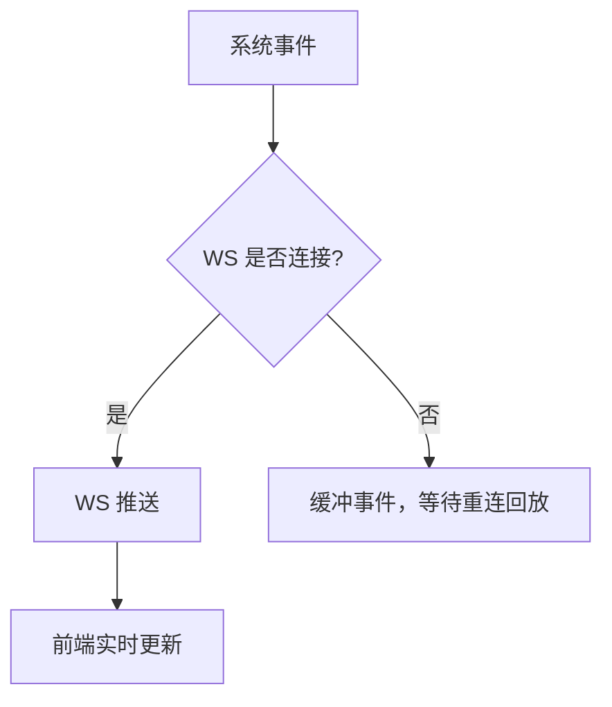
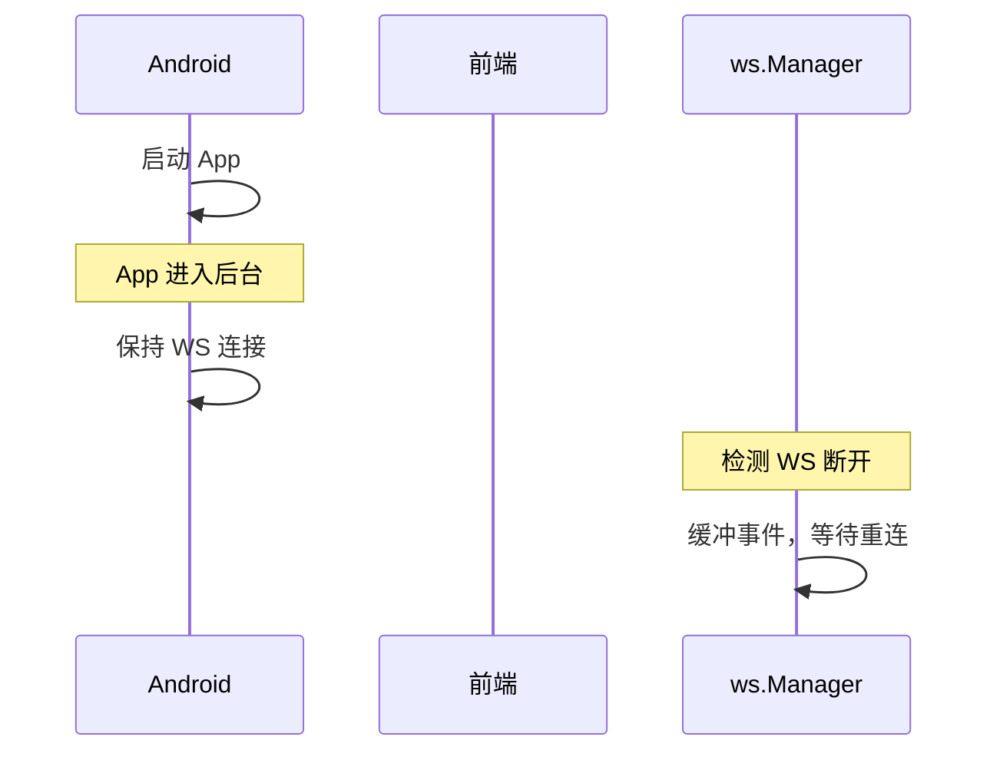

# 推送通知

推送通知让用户在手机息屏时也能收到 AI 执行完成、任务更新、权限审批等提醒。系统使用 WebSocket 作为实时通道，在线时通过 WebSocket 接收实时事件，离线时缓冲事件等待重连回放。Android 后台服务管理 SSH 端口转发的生命周期，确保推送通道始终可用。

## 流程图

### 推送策略

### WebSocket 事件生命周期

## 功能与设计要点

### 功能清单

- **WebSocket 实时事件**：在线时通过 WebSocket 接收实时事件（session_update、task_update 等），延迟更低、信息更丰富
- **事件缓冲与回放**：WebSocket 断线期间的事件缓冲在服务端，重连后自动回放。确保不丢失关键通知
- **任务完成推送预览**：WebSocket 通知包含任务完成的响应摘要预览文本和 `Done:` 前缀，用户不用打开 App 就能判断任务是否成功
- **权限审批推送**：ACP 后端请求工具调用审批时，WebSocket 通知包含工具名称（如 `execute_command`、`write_file`），用户可以及时审批，避免因未审批而阻塞 AI 执行

### 设计要点

- **推送是 WS 的后备而非替代**：推送通知有延迟、有字数限制、无法交互——在线时始终优先使用 WebSocket
- **断线缓冲窗口有限（10s）**：WebSocket 断线后只缓冲 10s 内的事件，超过的事件丢失。这是存储和时效性的权衡——太久之前的事件对用户已无意义
