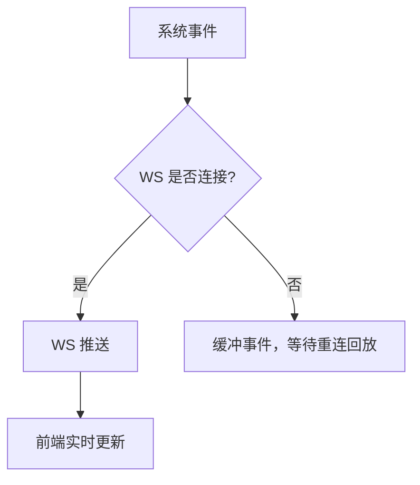
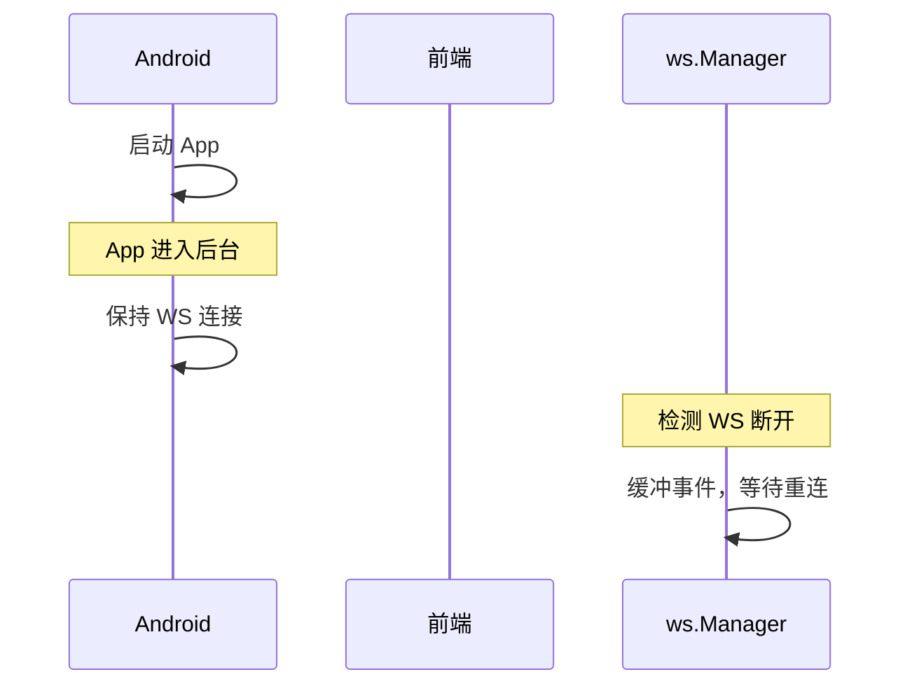
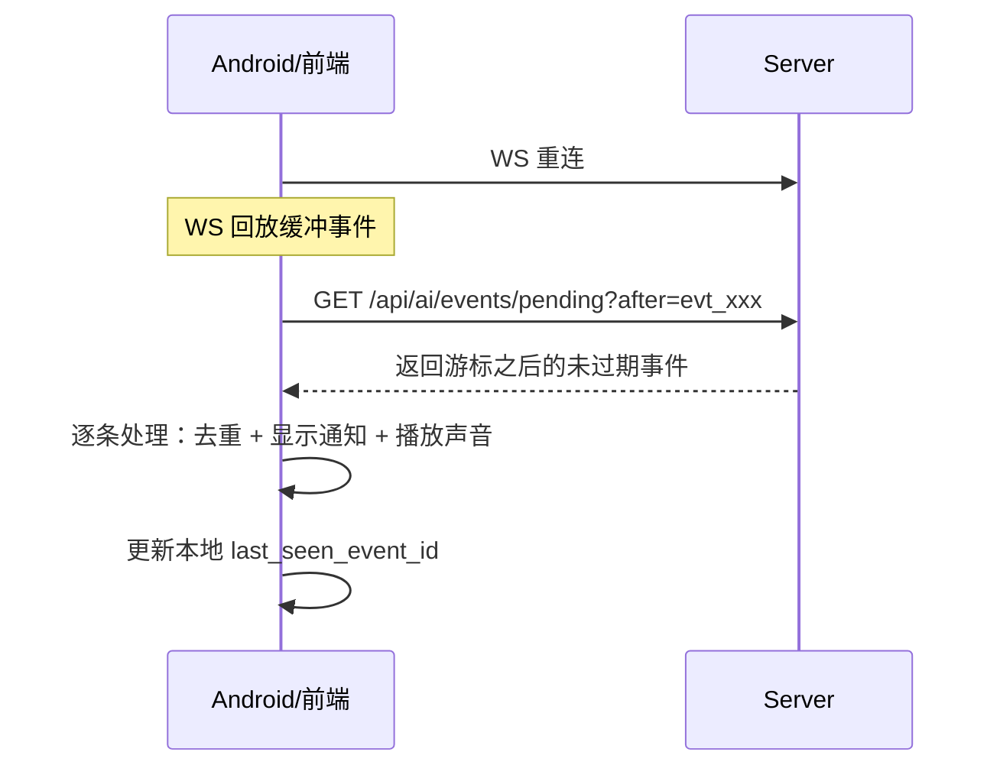

# 推送通知

推送通知让用户在手机息屏时也能收到 AI 执行完成、任务更新、权限审批等提醒。系统使用 WebSocket 作为实时通道，在线时通过 WebSocket 接收实时事件，离线时缓冲事件等待重连回放。Android 后台服务管理 SSH 端口映射的生命周期，确保推送通道始终可用。企业推送（钉钉/飞书）适用于无法直接访问 Web 界面但 IM 始终在线的场景。

## 流程图

### 推送策略

### WebSocket 事件生命周期

## 功能与设计要点

### 功能清单

- **WebSocket 实时事件**：在线时通过 WebSocket 接收实时事件（session_update、task_update 等），延迟更低、信息更丰富
- **事件缓冲与回放**：WebSocket 断线期间的事件缓冲在服务端，重连后自动回放。确保不丢失关键通知
- **任务完成推送预览**：WebSocket 通知包含任务完成的响应摘要预览文本和 `Done:` 前缀，用户不用打开 App 就能判断任务是否成功
- **权限审批推送**：ACP 后端请求工具调用审批时，WebSocket 通知包含工具名称（如 `execute_command`、`write_file`），用户可以及时审批，避免因未审批而阻塞 AI 执行

### 设计要点

- **推送是 WS 的后备而非替代**：推送通知有延迟、有字数限制、无法交互——在线时始终优先使用 WebSocket
- **断线缓冲窗口有限（10s）**：WebSocket 断线后只缓冲 10s 内的事件，超过的事件进入离线持久化

## 离线事件持久化

设备关机或网络断开期间，WS 连接丢失，10s 缓冲窗口内的事件也会丢失。为了确保离线期间的关键通知不丢失，系统将终端状态事件持久化到 `pending_events` 表。

### 持久化策略

- **只持久化终端状态事件**：`session_update`（completed/cancelled/permission_pending）、`task_update`（completed/failed/cancelled）
- **全局事件日志**：不按 client_id 分区，所有客户端共享同一个事件日志
- **条件存储**：仅当存在断开连接的客户端时才写入（`HasDisconnectedClients()`），避免所有客户端在线时的写放大
- **Write-ahead**：先存储后广播，确保事件日志无间隙
- **客户端游标**：每个客户端在本地持久化 `last_seen_event_id`，重连时用 `after` 参数拉取游标之后的事件
- **TTL**：
  - 终端状态事件（completed/cancelled/failed）：24 小时
  - 权限审批事件（permission_pending）：7 天（防止离线期间权限请求被清理导致 agent 死锁）
- **容量上限**：最大 1000 条，超出丢弃最旧的

### 拉取流程

### 去重

- **前端**：`processedEventIds` Set（cap 100），WS 回放和 pending fetch 共享同一去重集合
- **Android**：`processedEventIds` LinkedHashSet（cap 100），防止 WS 回放 + pending fetch 产生重复通知

## 钉钉企业推送

当配置 `push_mode: "dingtalk"` 时，系统通过钉钉企业机器人将事件推送到用户钉钉单聊。适用于企业内网部署场景——用户可能无法直接访问 ClawBench Web 界面，但钉钉始终在线。钉钉和飞书推送共享 `internal/push/common/` 包的接口（`PushDB`、`SessionMessenger`、`SubscriberInfo`）和会话命令解析逻辑（`ParseSessionCommand`、`ResolveShortSessionID`），保证两个平台的交互行为一致。

### 架构

- **Stream API 长连接**：`Manager`（`internal/push/dingtalk/manager.go`）通过钉钉 Stream SDK（`open-dingtalk/dingtalk-stream-sdk-go`）建立长轮询连接，注册 ChatBot 回调处理单聊消息
- **Markdown 单聊消息**：`SendMarkdownMessage()`（`internal/push/dingtalk/sender.go`）调用 `/v1.0/robot/oToMessages/batchSend` API，以 `sampleMarkdown` 格式发送，4000 字符截断（`truncateForDingTalk`）
- **DB Outbox 可靠投递**：`PushSessionEvent()` / `PushTaskEvent()`（`internal/push/dingtalk/push.go`）遍历 DB 订阅者列表逐个发送。**当 WS 客户端在线时抑制推送**——避免重复通知。订阅者数据由 `internal/service/dingtalk_subscribers.go` 管理
- **交互式命令**：用户在钉钉单聊中发 `@{短ID} 消息内容` 即可向对应会话发送消息。`handleSessionCommand()`（`internal/push/dingtalk/session_command.go`）解析短 ID、匹配运行中会话、入队消息。`handleSessionList()` 列出最近会话按项目分组
- **热重载**：`hotReloadDingTalk()`（`cmd/server/main.go`）检测凭证变更后原地重配置或重启 Manager，无需重启服务

### 初始化桥接

为避免 `push/dingtalk` 与 `service` 包的循环依赖，`cmd/server/main.go` 定义 `dingtalkDBAdapter` 和 `dingtalkSessionMessenger` 桥接结构，将 `DingtalkDB` / `SessionMessenger` 接口适配到 `service` 包函数。启动时注册适配器、创建 Manager、启动 Stream 连接

## 飞书企业推送

当配置 `push_mode: "feishu"` 时，系统通过飞书企业自建应用将事件推送到用户飞书单聊。与钉钉推送功能对齐，适用于企业内网部署场景——用户可能无法直接访问 ClawBench Web 界面，但飞书始终在线。

### 架构

- **Lark SDK WebSocket 长连接**：`Manager`（`internal/push/feishu/manager.go`）通过飞书 Lark SDK（`larksuite/oapi-sdk-go/v3/ws`）建立 WebSocket 长连接，注册事件回调处理单聊消息。连接生命周期含 OnReady/OnError/OnDisconnected/OnReconnected 四个钩子
- **交互式卡片（Interactive Card）**：`SendPostMessage()`（`internal/push/feishu/sender.go`）调用 `/open-apis/im/v1/messages` API，使用 `msg_type="interactive"` 发送交互式卡片消息，支持 Markdown 渲染（飞书 Post 消息不支持 Markdown 渲染，需用交互式卡片）。4000 字符截断（`truncateForFeishu`）
- **DB Outbox 可靠投递**：`PushSessionEvent()` / `PushTaskEvent()`（`internal/push/feishu/push.go`）遍历 DB 订阅者列表逐个发送。**当 WS 客户端在线时抑制推送**——避免重复通知。订阅者数据由 `internal/service/feishu_subscribers.go` 管理，存储在 `feishu_subscribers` 表（`user_id`、`chat_id`、`user_name`、`source`）
- **交互式命令**：用户在飞书单聊中发 `@{短ID} 消息内容` 即可向对应会话发送消息。`handleSessionCommand()`（`internal/push/feishu/stream.go`）解析短 ID、匹配运行中会话、入队消息。`handleSessionList()` 列出最近会话按项目分组
- **热重载**：`hotReloadFeishu()`（`cmd/server/main.go`）检测凭证变更后原地重配置或重启 Manager，无需重启服务。`Reconfigure()` 返回 `NeedsRestart` 标志区分可原地更新与需重启的变更

### 初始化桥接

与钉钉采用相同模式：`cmd/server/main.go` 定义 `feishuDBAdapter` 和 `feishuSessionMessenger` 桥接结构，将 `FeishuDB` / `SessionMessenger` 接口适配到 `service` 包函数。启动时注册适配器、创建 Manager、启动 WebSocket 连接

### 钉钉与飞书的差异

| 维度 | 钉钉 | 飞书 |
|------|------|------|
| 连接方式 | Stream SDK 长轮询 | Lark SDK WebSocket |
| 消息格式 | `sampleMarkdown` 单聊消息 | `interactive` 交互式卡片（支持 Markdown 渲染） |
| 截断限制 | 4000 字符 | 4000 runes（~12000 bytes CJK） |
| SDK 依赖 | `open-dingtalk/dingtalk-stream-sdk-go` | `larksuite/oapi-sdk-go/v3/ws` |
