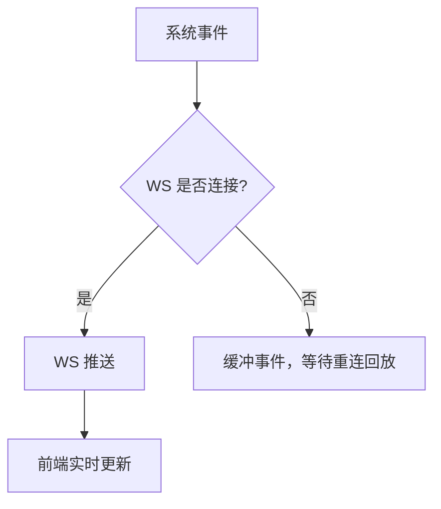
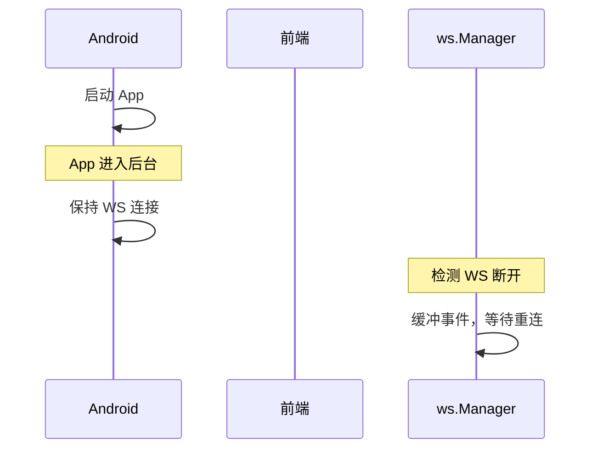
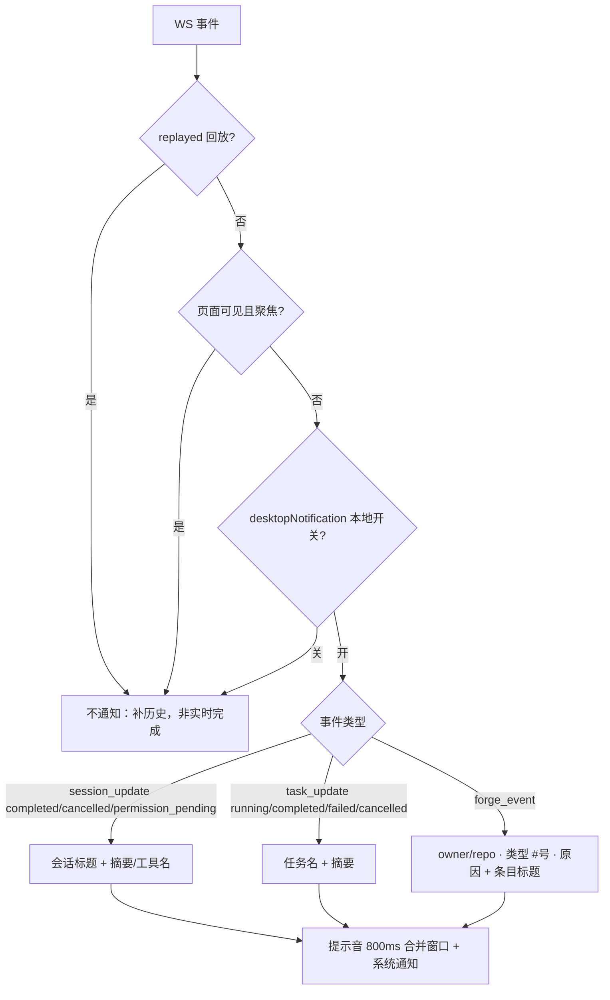
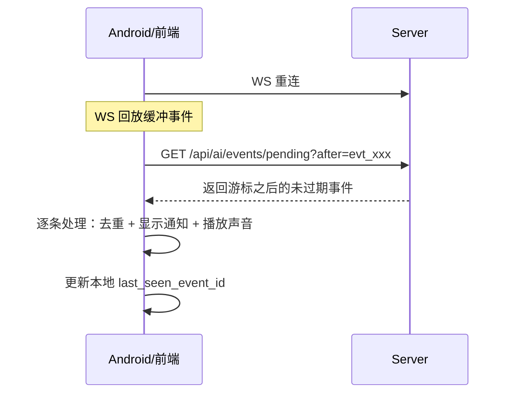

# 推送通知

推送通知让用户在手机息屏时也能收到 AI 执行完成、任务更新、权限审批等提醒。系统使用 WebSocket 作为实时通道，在线时通过 WebSocket 接收实时事件，离线时缓冲事件等待重连回放。Android 后台服务管理 SSH 端口映射的生命周期，确保推送通道始终可用。企业推送（钉钉/飞书）适用于无法直接访问 Web 界面但 IM 始终在线的场景。

## 流程图

### 推送策略

### WebSocket 事件生命周期

## 功能与设计要点

### 功能清单

- **WebSocket 实时事件**：在线时通过 WebSocket 接收实时事件（session_update、task_update、forge_event 等），延迟更低、信息更丰富
- **通知音效开关**：`notificationSound` 本地设置（默认开启）控制 `playNotificationSound()` 是否播放——关闭后 Web Audio API 不再初始化，防止打断蓝牙耳机的音乐播放
- **应用内通知开关**：`inAppNotification` 本地设置（默认开启）控制应用内完成通知是否弹出。关闭后 `App.vue` 的 `handleCompletionEvent` 在入队前早返回，只拦新事件——已在屏幕上的卡片保留至自动关闭。该开关只管卡片，提示音与系统/IM 推送各有独立开关，互不影响
- **应用内完成通知**：会话/任务/仓库事件到达时，若用户未在查看该会话，滑入一张纯通知卡片——标题 + 单行纯文本摘要 + agent 图标，只有"点击整卡跳转（顺带标记已读）"与"关闭"两个操作，5 秒自动关闭。事件覆盖与系统通知**完全对齐**（会话 3 种状态 + 任务 4 种状态 + forge 六种），唯一不对齐的是焦点条件（系统通知要求失焦，卡片只要求"用户没在看该会话"）。桌面端右下角滑入、移动端顶部滑下；定位层 `pointer-events: none` 不拦截页面点击，也不再支持点空白处关闭。队列上限 3 条，同仓库的 forge 事件合并为「N 条新变化」。详见 `docs/spec/features/completion-popup.md`
- **桌面端通知开关**：`desktopNotification` 本地设置（默认开启，旧键 `browserNotification` 自动迁移）控制 `showBrowserNotification()` 是否投递系统通知。命名用「桌面端」而非「浏览器」：Electron 宿主下走主进程原生通知，根本不是浏览器通知，而那也是本开关最有价值的场景。**与 `push_mode` 完全解耦**——`push_mode` 选的是手机/IM 通道（原生推送 / 钉钉 / 飞书 / 关闭），而本开关只管「这台桌面要不要弹系统通知」。二者解耦的原因：把系统通知挂在 `push_mode === 'native'` 上时，任何选了钉钉/飞书的用户会连带失去桌面端提醒，而那个开关对他们不可达。开关在 `showBrowserNotification()` 内部统一判定，因此会话、任务、forge 三类生产者自动遵守
- **设置页小节划分**：推送通知页按使用场景分四节——「应用内通知」（完成卡片 + 提示音，均本地即时生效）、「浏览器通知」（系统通知开关，本地即时生效，**浏览器与 App 模式都渲染**）、「桌面与系统」（悬浮状态窗 + 灵动岛，app-only，浏览器模式下整卡隐藏）、「移动端通知」（推送模式面板，服务端设置，改完点保存）
- **桌面壳系统通知**：Electron 宿主下 `showBrowserNotification()` 优先走 `native.nativeNotify(title, body, nav)`（`useNotification.ts`），由主进程 `desktop/src/main/notification.ts` 弹原生 OS 通知。这条路径**不依赖页面 JS 存活**，因此窗口最小化/隐藏时仍能弹出——这正是桌面壳相对浏览器标签页的核心价值（浏览器会节流/冻结后台标签的事件循环，页面内 `new Notification()` 不会触发）。点击通知经 `clawbench-open-session` / `clawbench-open-task` 派发到渲染进程；冷启动时通知先于页面加载到达，导航载荷暂存在 `pendingNavigation`，由前端 `getPendingNavigation()` 取走后再跳转
- **事件缓冲与回放**：WebSocket 断线期间的事件缓冲在服务端，重连后自动回放。确保不丢失关键通知
- **任务完成推送预览**：WebSocket 通知包含任务完成的响应摘要预览文本和 `Done:` 前缀，用户不用打开 App 就能判断任务是否成功
- **权限审批推送**：ACP 后端请求工具调用审批时，WebSocket 通知包含工具名称（如 `execute_command`、`write_file`），用户可以及时审批，避免因未审批而阻塞 AI 执行
- **仓库事件系统通知**：`forge_event`（议题/合并请求/流水线的 opened/closed/merged/reopened/commented/pipeline_done）在页面失焦时弹系统通知，标题形如 `owner/repo · 合并请求 #42 · 已合并`，正文为条目标题，点击切到「议题与合并」页签。与钉钉/飞书推送互不影响：IM 推送受 `forge.notify.*` 服务端开关门控，系统通知受本地 `desktopNotification` 门控
- **跨项目仓库事件点击切项目**：forge 面板与未读角标都是**项目作用域**的，而 `forge_event` 广播到所有客户端。因此事件携带 `event.project_path`（`ForgeRepoRef.ProjectPath`，非身份字段——`Key()` 忽略它，同一仓库被两个项目绑定仍是一个轮询/防抖单元）；点击时若目标项目不是当前项目，先 `hotSwitchProject` 再切页签，否则会落到当前项目的面板、而那一行并不存在。切换失败则回退到当前项目的面板（不静默失败）
- **提示音按窗口合并**：一次 forge 轮询会循环派发整批事件（`forge_syncer.go` 每仓库 drain 一批），逐条播放会让 ~350ms 的提示音重叠成噪音。`playNotificationSound()` 内置 800ms 合并窗口，窗口内的重复调用直接返回（通知本身仍逐条显示，且已按条目去重）。窗口外的新通知照常发声

### 桌面端系统通知的触发条件

### 设计要点

- **推送是 WS 的后备而非替代**：推送通知有延迟、有字数限制、无法交互——在线时始终优先使用 WebSocket
- **系统通知与 IM 推送是两个独立通道**：`desktopNotification`（本地）管桌面端的系统通知；`push_mode`（服务端）管手机原生推送与钉钉/飞书。二者不互为门控，一个用户可能两者都开。`forge_event` 的 WS 广播与未读角标**不受任何通知开关影响**——角标回答「有没有新变化」，开关回答「要不要打扰」
- **回放事件永不通知**：`fetchPendingEvents()` 拉取的和 WS 重连缓冲回放的（`replayed: true`）都是补历史，用户并未亲眼看到事件发生，因此抑制通知与未读自动清除
- **断线缓冲窗口有限（10s）**：WebSocket 断线后只缓冲 10s 内的事件，超过的事件进入离线持久化
- **终态推送去重守卫**：服务端用 `terminalPushDone` 标记（`sync.Map`，按 sessionID）保证同一会话只发送一次终态推送——防止 done/cancel 并发竞态导致"完成"与"取消"双重矛盾通知。终态事件统一由 `markDoneAndSendFinal` 触发，新会话开始时重置标记

## 离线事件持久化

设备关机或网络断开期间，WS 连接丢失，10s 缓冲窗口内的事件也会丢失。为了确保离线期间的关键通知不丢失，系统将终端状态事件持久化到 `pending_events` 表。

### 持久化策略

- **只持久化终端状态事件**：`session_update`（completed/cancelled/permission_pending）、`task_update`（completed/failed/cancelled）
- **全局事件日志**：不按 client_id 分区，所有客户端共享同一个事件日志
- **条件存储**：按**会话**判定——只有当「所有已连接客户端都订阅了该事件所属会话」时才跳过写入（`AllConnectedClientsSubscribe(sessionID)`），避免所有客户端都在看这个会话时的写放大。**不能用「是否存在断开的客户端」判定**：浏览器可能连着 WS、却没有该会话的订阅（重连换连接后重订阅尚未落地），此时事件实时投递被丢，若也不落库就永久丢失——客户端会只显示助手回复、没有用户提问，直到整页刷新重载历史。非会话级事件（如 `task_update`）保持无条件存储
- **Write-ahead**：先存储后广播，确保事件日志无间隙
- **客户端游标**：每个客户端维护 `last_seen_event_id` 游标（前端为会话级内存态，重启后置空；Android 端持久化到设备），收到终态事件时同步推进，重连时用 `after` 参数拉取游标之后的事件。前端只同步 Android 设备游标、不反向读取——避免后台推送重复投递用户在前台已看到的事件
- **TTL**：
  - 终端状态事件（completed/cancelled/failed）：24 小时
  - 权限审批事件（permission_pending）：7 天（防止离线期间权限请求被清理导致 agent 死锁）
- **容量上限**：最大 1000 条，超出丢弃最旧的

### 拉取流程

### 去重

- **前端**：`processedEventIds` Set（cap 100），WS 回放和 pending fetch 共享同一去重集合
- **Android**：`processedEventIds` LinkedHashSet（cap 100），防止 WS 回放 + pending fetch 产生重复通知

## 钉钉企业推送

当配置 `push_mode: "dingtalk"` 时，系统通过钉钉企业机器人将事件推送到用户钉钉单聊。适用于企业内网部署场景——用户可能无法直接访问 ClawBench Web 界面，但钉钉始终在线。钉钉和飞书推送共享 `internal/push/common/` 包的接口（`PushDB`、`SessionMessenger`、`SubscriberInfo`）和会话命令解析逻辑（`ParseSessionCommand`、`ResolveShortSessionID`），保证两个平台的交互行为一致。

### 架构

- **Stream API 长连接**：`Manager`（`internal/push/dingtalk/manager.go`）通过钉钉 Stream SDK（`open-dingtalk/dingtalk-stream-sdk-go`）建立长轮询连接，注册 ChatBot 回调处理单聊消息
- **Markdown 单聊消息**：`SendMarkdownMessage()`（`internal/push/dingtalk/sender.go`）调用 `/v1.0/robot/oToMessages/batchSend` API，以 `sampleMarkdown` 格式发送，4000 字符截断（`truncateForDingTalk`）
- **DB Outbox 可靠投递**：`PushSessionEvent()` / `PushTaskEvent()`（`internal/push/dingtalk/push.go`）遍历 DB 订阅者列表逐个发送。**当 WS 客户端在线时抑制推送**——避免重复通知。订阅者数据由 `internal/service/dingtalk_subscribers.go` 管理
- **交互式命令**：用户在钉钉单聊中发 `@{短ID} 消息内容` 即可向对应会话发送消息。`handleSessionCommand()`（`internal/push/dingtalk/session_command.go`）解析短 ID、匹配运行中会话、入队消息。`handleSessionList()` 列出最近会话按项目分组。消息正文**保留多行**——解析正则使用 `(?s)` 内联标志使 `.` 匹配换行，否则 `@会话ID` 后的多行消息会被截断为第一行；钉钉与飞书共用 `ParseSessionCommand`，一处修复两边生效
- **粘性会话（无 ID 默认发送）**：不带 `@{短ID}` 的文本、以及文件/图片消息，一律发往该用户**最近一次成功发送过的会话**（`last_session_id`，见下）。首次使用（无记录）回复「发送 /ls 查看会话列表」。`/ls` 是显式列出会话列表的命令，取代了旧的隐式行为（任何无 `@` 前缀的消息都回列表）。用户显式 `@{短ID}` 发送成功后会把粘性目标切换到该会话；**发送失败不切换**，否则用户的下一条无前缀消息会静默进入一个刚拒绝过它的会话
- **收发文件与图片**：用户向机器人发送文件（`msgtype=file`）或图片（`msgtype=picture`）时，机器人下载并以**纯附件消息**（`content=""`、`files=[entry]`）发往目标会话。下载为两步：先用 `downloadCode` 换临时下载链接（`POST /v1.0/robot/messageFiles/download`），再 GET 该链接。落盘到该会话项目的 `.clawbench/uploads/`，与网页上传同目录；大小上限复用 `upload.max_size_mb`（超限回复提示并丢弃，不留半截文件）。回调**立即 ack**，下载在 goroutine 中异步执行——钉钉会重投未及时 ack 的帧，同步下载会造成重复消息
- **富文本（文字 + 图片同发）**：用户在同一条消息里既写文字又贴图时，钉钉投递为 `msgtype=richText`，其内容在 `content.richText` 数组里（`{"text":"..."}` 与 `{"downloadCode":"...","type":"picture"}` 混合），而 **`data.Text.Content` 为空**。因此不能拿 `data.Text.Content` 去路由：那样既丢掉 `@{短ID}` 目标、也丢掉图片，还会把**空消息**发进会话（历史缺陷）。`parseInbound`（`internal/push/dingtalk/stream.go`）统一解析各类型：文本片段**直接拼接不加分隔符**（它们是同一行的分段），有 `downloadCode` 的元素即为待下载图片（不依赖 `type` 字段，官方只定义 `picture`），并去重。`extractMedia` 的单附件语义保持不变
- **未知类型不再发空消息**：`audio`/`video`/`unknownMsgType` 等既无文本也无可下载内容时，回复「暂不支持该消息类型」，而不是向会话发送空字符串
- **热重载**：`hotReloadDingTalk()`（`cmd/server/main.go`）检测凭证变更后原地重配置或重启 Manager，无需重启服务

### 初始化桥接

为避免 `push/dingtalk` 与 `service` 包的循环依赖，`cmd/server/main.go` 定义 `dingtalkDBAdapter` 和 `dingtalkSessionMessenger` 桥接结构，将 `DingtalkDB` / `SessionMessenger` 接口适配到 `service` 包函数。启动时注册适配器、创建 Manager、启动 Stream 连接

## 飞书企业推送

当配置 `push_mode: "feishu"` 时，系统通过飞书企业自建应用将事件推送到用户飞书单聊。与钉钉推送功能对齐，适用于企业内网部署场景——用户可能无法直接访问 ClawBench Web 界面，但飞书始终在线。

### 架构

- **Lark SDK WebSocket 长连接**：`Manager`（`internal/push/feishu/manager.go`）通过飞书 Lark SDK（`larksuite/oapi-sdk-go/v3/ws`）建立 WebSocket 长连接，注册事件回调处理单聊消息。连接生命周期含 OnReady/OnError/OnDisconnected/OnReconnected 四个钩子
- **交互式卡片（Interactive Card）**：`SendPostMessage()`（`internal/push/feishu/sender.go`）调用 `/open-apis/im/v1/messages` API，使用 `msg_type="interactive"` 发送交互式卡片消息，支持 Markdown 渲染（飞书 Post 消息不支持 Markdown 渲染，需用交互式卡片）。4000 字符截断（`truncateForFeishu`）
- **DB Outbox 可靠投递**：`PushSessionEvent()` / `PushTaskEvent()`（`internal/push/feishu/push.go`）遍历 DB 订阅者列表逐个发送。**当 WS 客户端在线时抑制推送**——避免重复通知。订阅者数据由 `internal/service/feishu_subscribers.go` 管理，存储在 `feishu_subscribers` 表（`user_id`、`chat_id`、`user_name`、`source`）
- **交互式命令**：用户在飞书单聊中发 `@{短ID} 消息内容` 即可向对应会话发送消息。`handleSessionCommand()`（`internal/push/feishu/stream.go`）解析短 ID、匹配运行中会话、入队消息。`handleSessionList()` 列出最近会话按项目分组
- **粘性会话与收发文件**：与钉钉行为对齐——不带 `@{短ID}` 的文本和文件/图片消息发往该用户最近成功发送过的会话；`/ls` 显式列出会话；无记录时回复选择提示。文件（`message_type=file`，`file_key`）与图片（`message_type=image`，`image_key`）通过 `GET /open-apis/im/v1/messages/{message_id}/resources/{file_key}?type=file|image` 下载（`type` 按消息类型取 `file` 或 `image`），以纯附件消息发往目标会话。落盘目录与大小上限同钉钉；回调同样立即 ack、下载异步
- **富文本（文字 + 图片同发）**：飞书对应 `msgtype=post`，内容在 `{"zh_cn":{"title":...,"content":[[{"tag":"text",...},{"tag":"img","image_key":...}]]}}`。`extractTextContent` 只取文本，因此内嵌 `` 会被静默丢弃（历史缺陷）。`parsePost`（`internal/push/feishu/stream.go`）同时收集 `tag=="img"` 的 `image_key` 与正文；`extractTextContent` 的输出保持原样（它前置 title，且有测试固化），路由改用**不含 title 的正文**
- **热重载**：`hotReloadFeishu()`（`cmd/server/main.go`）检测凭证变更后原地重配置或重启 Manager，无需重启服务。`Reconfigure()` 返回 `NeedsRestart` 标志区分可原地更新与需重启的变更

### 两端共用的分发与路由语义

两个后端的分发结构一致：**先解析 → 再路由 → 再下载 → 一次发送**。

- **用解析出的文本路由，而非原始字段**：钉钉 richText 与飞书 post 的文本都不在「裸文本字段」里，直接拿原始字段会丢目标、丢附件、并发出空消息。这是「`@会话id` + 图片同发」失效的根因
- **路由变体与投递变体分离**：飞书 post 的 title 会前置到正文，而 `SessionCmdRe` 是 `^` 锚定且**没有** `(?m)`（实测 `"My Title\n@deadbeef hi"` 匹配失败、`"@deadbeef hi"` 成功）。因此路由用去 title 的正文，**投递仍用含 title 的完整文本**（用户写的标题不该被吞）
- **媒体路径同样尊重 `@{短ID}`**：此前媒体只认粘性会话。现在与文本路径一致，并在发送成功后 `rememberSession` 移动粘性目标（与文本路径的「失败不切换」一致）
- **附件数量上限**：`common.AttachmentMaxFiles()` 读 `model.UploadMaxFiles`（默认 20），与 `AttachmentMaxBytes()` 同源复用 web 上传设置。一条富文本可内嵌任意张图，每张都是一次 API 调用加一个落盘文件，故需要独立的条数上限；超限截断并在回复里说明
- **部分失败不吞**：多附件下载时成功的照发、失败的在回复里点名；全部失败则只回错误提示，**不发送空消息**
- **单附件路径行为不变**：`file`/`picture`/`image` 仍走原有单附件逻辑，避免影响既有行为与测试

### 初始化桥接

与钉钉采用相同模式：`cmd/server/main.go` 定义 `feishuDBAdapter` 和 `feishuSessionMessenger` 桥接结构，将 `FeishuDB` / `SessionMessenger` 接口适配到 `service` 包函数。启动时注册适配器、创建 Manager、启动 WebSocket 连接

### 钉钉与飞书的差异

| 维度 | 钉钉 | 飞书 |
|------|------|------|
| 连接方式 | Stream SDK 长轮询 | Lark SDK WebSocket |
| 消息格式 | `sampleMarkdown` 单聊消息 | `interactive` 交互式卡片（支持 Markdown 渲染） |
| 截断限制 | 4000 字符 | 4000 runes（~12000 bytes CJK） |
| SDK 依赖 | `open-dingtalk/dingtalk-stream-sdk-go` | `larksuite/oapi-sdk-go/v3/ws` |
| 文件下载 | `downloadCode` → `POST /v1.0/robot/messageFiles/download` → 临时 URL → GET | `file_key`/`image_key` → `GET /open-apis/im/v1/messages/{id}/resources/{key}?type=file\|image` |
| 图片消息类型 | `picture`（仅 `downloadCode`，无文件名） | `image`（`image_key`，无文件名） |

### 消息路由与粘性会话

**路由优先级**（`ClassifyIncoming`）：

| 输入 | 行为 |
|------|------|
| `@{短ID} 文本` | 发往该会话；成功后把粘性目标切到它 |
| `/ls` | 回复最近会话列表（按项目分组） |
| 其它文本 | 发往粘性会话 |
| 文件 / 图片 | 下载后作为纯附件消息发往粘性会话 |
| 粘性目标为空 | 回复「发送 /ls 查看会话列表，用 @会话ID 选择」 |

**粘性目标**存在 `dingtalk_subscribers.last_session_id` / `feishu_subscribers.last_session_id`（`pragma_table_info` 守卫的增量迁移）。空值是正常状态——首次使用、或数据库来自该列存在之前——此时必须回退到提示，而不是替用户猜一个会话。

**附件落盘**（`internal/push/common/attachment.go`）：写入会话所属项目的 `.clawbench/uploads/`，与网页上传端点同目录，因此 AI 提示、文件管理器和附件抽屉都把它们当普通上传处理。

- 文件名经 `SanitizeFilename` 清洗：剥离目录分量（远端可传 `../../etc/passwd`）、替换 Windows/Shell 敏感字符、保留扩展名、超长截断。文件名**绝不能**引入路径分隔符，否则 `filepath.Join` 会逃出上传目录
- 重名按序号递增（与网页上传一致），不覆盖
- 大小上限复用 `upload.max_size_mb`；超限在下载过程中即拒绝并删除半截文件
- 提示注入复用 `model.ApplyAttachmentPrefixes`（`internal/model/attachment_prompt.go`），与网页上传同一条路径。`content=""` 的纯附件消息是合法的——会话标题由 `titleFromFileEntries` 兜底

**回调必须立即 ack**：钉钉与飞书都会重投未及时确认的事件，而下载需要两次网络往返。因此媒体下载在 goroutine 中执行，处理函数立刻返回；下载完成后再通过会话 webhook（钉钉）或消息 API（飞书）回复结果。

**push 发送必须自带 queueID（回复顺序）**：IM 发送没有网页端那样的前端 `queueId`，`sendMessageToSessionFromPush` 因此自己生成一个（`newPushQueueID`）并同时传给执行与 `user_message` 事件。这个 id 是**唯一能把回复锚定到它回答的那个问题**的键：`run_turn` 把它写进 streaming 助手行的 `queue_id` 并经 `stream_start.queue_id` 下发，前端据此把回复重锚到同 `queueId` 的问题气泡上。

缺了它前端会退化为「锚到最新一条用户消息」，而 `stream_start` 由**异步**执行 goroutine 发出、`user_message` 在 `LaunchSessionExecution` 返回后才发，因此 `stream_start` 常常先到——此时「最新用户消息」还是**上一个**问题，回复就排到了自己问题的上方（刷新后 DB 重建才恢复）。

### 订阅时的实时运行状态补发

客户端在 AI 运行中途订阅某会话时，必须补齐渲染该回合所需的**两侧**状态：`OnSubscribe` 先补发 **问题气泡**（`user_message`，由 streaming 行的 `queue_id` 反查用户行），再补发 `stream_start`（含同一 `queue_id`）。实现见 `StreamHub.EmitLiveRunStateToClient`。

**顺序不能颠倒**：`stream_start` 是回复的锚点，它靠 `queue_id` 找到问题气泡；问题气泡不在数组里时，回复会渲染在自己问题之上（或干脆没有用户气泡），只有整页刷新重载历史才能恢复。这也解释了「只有助手消息、没有用户消息」这一症状——晚订阅的客户端拿到了助手侧（`stream_start` + 内容流），却从未拿到问题侧。

### 事件丢弃与写前日志的边界

`EmitToSession` 在会话无订阅者时**不能直接 return**：`StreamHub.Emit` 是写前日志（`pending_events`）唯一的落库点，提前返回会让事件既未投递也未持久化，重连重放也无法补偿。因此无订阅者时仍要把事件交给写前日志，由 `StoreNotifiableEvent` 按上述**会话级**条件决定是否真正落库（投递丢弃计数照常记录）。
