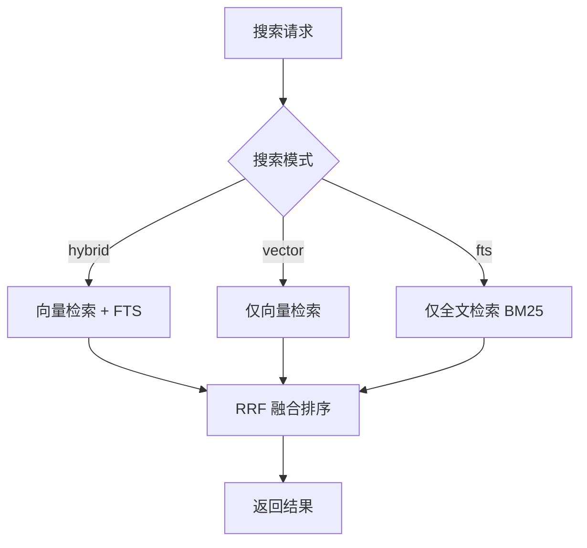

# RAG 检索

RAG（Retrieval-Augmented Generation）让用户搜索历史对话内容——"上次我让 Claude 修那个 bug 时它怎么说的？"不需要翻遍历史记录，语义搜索直接找到相关对话。系统将聊天消息分块、向量化、存入 SQLite vec0 向量索引，支持向量检索、全文检索和混合检索三种模式。向量化（vector embedding）可通过 `rag.vector_enabled` 配置独立开关——关闭后退化为纯 FTS 模式，适合无嵌入服务的场景。

## 流程图

### RAG 索引流程

```mermaid
sequenceDiagram
    participant service
    participant indexer
    participant EmbeddingClient
    participant SQLite

    service->>indexer: 新消息（indexed=0）
    indexer->>indexer: 分块（512 token，重叠）
    indexer->>indexer: 过滤 thinking/tool_use
    indexer->>indexer: ExtractLastAnswerFromBlocks（仅结论）
    indexer->>EmbeddingClient: POST {BaseURL}/v1/embeddings
    Note over EmbeddingClient: 默认 Ollama/BGE-M3
    兼容任意 OpenAI 协议端点
    EmbeddingClient-->>indexer: 向量
    indexer->>SQLite: 存储分块+向量（vec0）+FTS 索引
    indexer->>service: 标记 indexed=1
```

### RAG 搜索流程



## 功能与设计要点

### 功能清单

- **语义搜索**：用自然语言搜索历史对话，不依赖精确关键词匹配。用户描述问题即可找到相关历史，降低检索门槛
- **向量嵌入可独立开关**：`rag.vector_enabled` 配置控制向量嵌入（默认 true），FTS 全文检索始终启用。关闭向量嵌入后退化为纯 FTS 模式，适合无嵌入服务的场景
- **混合检索**：向量检索捕获语义相似性，BM25 全文检索捕获关键词匹配，两者通过 RRF（Reciprocal Rank Fusion）融合排序。搜索模式通过 `rag.search_mode` 配置控制（hybrid/vector/fts），FTS 模式始终可用，不依赖嵌入服务是否在线——比单一检索模式更全面
- **过滤条件**：支持按项目、后端、角色、会话、时间范围过滤。缩小搜索范围，提高结果精度
- **增量索引**：新消息自动标记为待索引，Indexer 轮询处理（5s 间隔，批次大小由 `rag.batch_size` 配置，默认 50，热生效）。不影响聊天主流程的响应速度
- **索引重建按「丢弃哪一层」分三种粒度，统一为「标记失效 + 索引器执行」**：`POST /api/rag/rebuild` 带 `kind` 参数（省略默认 `fts`），三者区别在于失效范围，也就是索引器要重做多少工作——`fts` 只失效 `chunk_text_segmented`（重跑分词，不动分块与向量；用于换分词器/词典，或修复分词器不可用时入库的历史数据）；`vector` 只失效向量（重嵌入，不动分块与分词；用于换嵌入模型）；`full` 删除全部 chunk，由索引器从 `chat_history` 重新分块、分词、嵌入（**唯一会重新分块的粒度**，改了 `rag.chunk_size`/`chunk_overlap` 后必须用它才生效）。三者的共同实现是「标记失效 → 唤醒索引器」：handler 只做标记，索引器按有界批次（`resegmentBatchSize = 200`）处理，因此可中断、进度可观测。三种粒度共用 `RebuildCoordinator` 的同一把互斥（此前 FTS 与向量各用一套标志，理论上可并发），重复触发返回 409
- **全量重建必须删干净，不能只重置 `indexed` 标记**：`full` 走 `ResetAllChunksForFullRebuild`（清 FTS → 删 chunk → drop `rag_vec`）+ `service.ResetAllIndexed`，让索引器重新分块。之所以不能只把 `indexed` 置 0 让它「自然重建」：`insertOneChunk` 只按 `(message_id, chunk_index)` 替换同位置的行，消息重新分块后若 chunk 数变少，多出来的高位 chunk **永远不会被删除**——旧文本会一直留在索引里可被搜到。全删重来没有尾部可残留（实测：小 chunk 索引 4 行 → 改大 chunk 重索引后仍剩 4 行，其中 2 行是陈旧数据）。代价是全量重建会连向量一起重建，`vector_enabled` 开启时依赖嵌入服务在线，不可用则只能写入文本、向量检索缺失直到服务恢复
- **FTS 重建必须重跑分词，否则是空操作**：FTS5 自身的 `rebuild` 命令只按建表时固定的 `tokenize='unicode61'` 重新读取**已存储**的分词列，无法重跑 gse 分词——分词发生在 Go 侧入库之前（`indexer.go` 的 `SegmentText(tc.Text)`）。因此「仅重建索引」会产出与原来逐字节相同的索引内容，在分词器变更或历史数据入库时分词器不可用（`segmenter == nil` 使 `SegmentText` 退化为原样返回，整句 CJK 被 unicode61 当成单个 token）的情况下完全无效。现在由索引器的 `resegmentPending` 阶段重跑分词，分词在写锁**外**完成，仅 UPDATE 与 FTS 改写入锁（实测 44k chunk / 38MB 文本：分词 149s 占 99.9%，读行 0.09s）。分词器不可用时**在标记前**就返回 503 并**不做任何修改**——否则会用未切分原文覆盖已正确分词的数据
- **重写外部内容 FTS5 表必须用 delete+insert，不能 UPDATE**：`rag_chunks_fts` 是 external-content 表（`content='rag_chunks'`），FTS5 通过读**内容表**来定位要删除的词项。若先更新内容表再 `UPDATE` FTS 行，FTS5 会拿新值去找旧词项，直接损坏索引（`database disk image is malformed`，实测在 CJK 上必现、纯英文短文本偶然掩盖）。正确写法是 `INSERT INTO rag_chunks_fts(rag_chunks_fts, rowid, ...) VALUES('delete', ...)` 带上**旧值**，再 insert 新值
- **重建异步执行（长任务不得内联在请求里）**：`POST /api/rag/rebuild` 只标记失效并立即返回 **202**，客户端轮询 `GET /api/rag/rebuild/status`。这是被真实故障逼出来的设计：最初内联执行，而重建在 44k chunk 的库上耗时 **2m45s**，超过前端统一请求超时（`API_TIMEOUT_MS = 10s`），导致**服务端 status=200 成功、前端却弹「重建索引失败」**（日志可见 200 与 duration=2m44.97s 并存）。状态快照 `status` 含 `idle`/`running`/`done`/`error`/`cancelled`/**`blocked`**（后者表示工作无法完成，如向量重建期间嵌入服务不可用，不会停在 0% 不动），`total`/`processed` 由存储层待处理计数派生而非本地累加，因此与索引器的并发处理进度始终一致；另通过 WS 广播 `rag_rebuild`。前端 `useRagRebuild` 负责触发 + 轮询：瞬时轮询失败**不**判定为失败（任务仍在服务端跑），面板卸载即停止轮询，轮询放弃时提示「仍在后台进行」而非报错
- **索引器有唤醒通道，重建起步不等轮询周期**：索引器主循环除 ticker 外还 select `wakeCh`，`Trigger()` 非阻塞投递。ticker（`poll_interval`，默认 5s）只作兜底：新消息由 DB 写入产生、索引器无法感知，且它还兼着「嵌入服务恢复后自动补嵌入」的职责，不能删。重建标记后立即 `Trigger()`，进度条不会先干等一个周期
- **索引进度与磁盘占用**：`GET /api/rag/status` 返回索引进度（总消息数、已索引数、已嵌入数、嵌入模式）以及**索引磁盘占用**（`fts_size_bytes` / `vec_size_bytes`，分别汇总 FTS 与向量索引的逻辑页占用），设置面板格式化展示。前端 `useRagStatus` composable 轮询 status 端点并计算实时索引/嵌入速度（基于相邻两次轮询的差值），在设置页显示索引健康度与占用
- **自动清理**：超过 `RetentionDays`（默认 90 天）的软删除数据定期清理，防止索引无限增长
- **会话聚合搜索**：`RAGSessionSearch()` 在向量/FTS 搜索基础上按 `session_id` 聚合结果——返回 `SessionSearchResult`（含 `session_id`、`title`、`score`、`match_count`、分块列表），每会话最多 5 个分块。分块携带字符级偏移用于高亮。**搜索同时走两条独立通道**：内容通道（`rag_chunks`，向量/FTS）与**名称通道**（`chat_sessions.title` 上的 `LIKE`）。名称通道存在的原因是内容索引只能按消息内容命中——用户改过的自定义标题（`title_source='custom'`）、由文件条目生成的标题、以及被截断到 50 字的自动标题（`chat.go` `maybeAutoTitleSessionTx`），都无法用名字从内容索引里找回来，而用户改名的动机恰恰是「以后好找」。名称查询先分词（`SegmentTokens`）再逐词 AND（多词收窄结果），长度不足 2 rune 的分词噪声（空格、标点、单个汉字）被丢弃——否则「会话搜索」里的空格会匹配到几乎所有标题；若丢弃后一无所剩，则退回整串字面匹配，使单字标题仍可搜到。`%`/`_`/`\` 经 `escapeLikePattern` 转义并配 `ESCAPE '\'`，ASCII 大小写不敏感（SQLite `LIKE` 只折叠 A-Z）。**名称命中排在内容命中之前**（用户输入的是记得的名字），两通道都命中的会话只出现一次并保留内容分块，同时带 `title_match`/`title_match_positions`（标题内字符级偏移，用于高亮）/`title_only`（仅名称命中、无分块，详情页改用 `GET /api/rag/session-first-message` 懒加载首条消息，与浏览态一致）；`sort` 为 `newest`/`oldest` 时按会话时间重排，名称置顶不再保留。相关性排序下名称命中内部与内容命中内部各自按评分降序、并以 `session_id` 兜底（`sort.Slice` 非稳定，仅名称命中同分，无兜底则顺序随机）。**RAG 未配置（`GlobalStore == nil`）时不再返回 503**：名称通道是纯 SQL，仍返回 `title_match` 结果，响应 `mode` 为 `recent`，使未启用 RAG 的部署至少能按名字找会话。名称通道复用内容通道的全部过滤（project / `archived` / `session_type` / 时间区间 / `session_id` / `exclude_session_id`，后者是 `/cb-chatsearch` 把自己排除在结果外的机制），两批结果来自同一总体。前端 `SessionSearchDrawer` 提供搜索结果列表 + 钻取详情两种视图，详情页将偏移转换为 DOM 高亮标记，列表与详情标题按 `title_match_positions` 高亮并显示「名称匹配」徽标。`useSessionSearch` composable 封装搜索 API 调用，带防抖和 RAG 可用性缓存。搜索顶部提供检索模式（混合/全文）、归档筛选（全部/未归档/已归档，`archived` 参数）与排序（相关性/最新优先/最早优先，`sort` 参数）三个下拉；相关性保留检索评分排序，时间排序在检索结果集之上按会话 `created_at` 重排；归档筛选在会话元数据回填后生效，浏览态与搜索态一致。搜索输入下方另有一行可横滑的时间段 chips（全部时间/今天/近 7 天/近 30 天/自定义，`from`/`to` 参数），选「自定义」时展开两个日期输入框；日期为 date-only 格式，后端 `normalizeTimeBound` 将其按**本地日历日**展开为对应的 UTC 区间文本（`00:00:00` ~ `23:59:59.999999`）再与存储值比较——`chat_sessions.created_at` 由 `DEFAULT CURRENT_TIMESTAMP` 填充、`rag_chunks.created_at` 由 `time.Time` 绑定，两者都是 UTC 文本；若直接按 UTC 解析纯日期，UTC+8 下"今天"会偏移成当地 08:00 至次日 07:59，漏掉凌晨创建的会话。搜索态按命中消息时间过滤、浏览态按会话创建时间过滤。浏览态（未输入关键词）不显示检索模式标签（无检索发生），列表不携带任何消息内容，避免对每个会话做首条消息子查询拖慢加载；进入某会话详情时再通过 `GET /api/rag/session-first-message?session_id=<id>` 懒加载其首条消息作为预览（支持已归档会话）。浏览态取消数量上限，改为游标分页（`cursor` + `cursor_id`，响应 `has_more`）配合前端 IntersectionObserver 滚动懒加载，可无限加载全部会话
- **消息聚类分析**：将跨所有会话的相似用户消息自动分组为"消息集群"，帮助用户识别自己的常见提问模式。用户触发按需计算（`POST /api/chat/message-clusters/compute`），后端执行三阶段管线：提取（top 5000 条用户消息统计）→ 聚类（Union-Find 算法，三级相似度优先：向量嵌入余弦相似 > FTS Sorensen-Dice 词汇重叠 > 精确去重）→ 缓存（结果存入 DB）。计算进度通过 `cluster_progress` WS 事件实时推送，完成后通过 `GET /api/chat/message-clusters` 获取缓存结果。已被设为快捷发送的消息变体自动过滤，只展示未设置的集群——引导用户将常见提问转为快捷发送

### 设计要点

- **统一 SQLite 存储**：聊天消息和向量索引都存储在 SQLite 中，向量索引使用 sqlite-vec 纯 Go 扩展的 vec0 虚拟表（余弦相似度）。SQLite 的 WAL 模式适合高频写入，vec0 虚拟表支持高效向量搜索——无需引入额外的数据库依赖
- **优雅降级**：如果 `rag.vector_enabled` 为 false 或 OpenAI 兼容嵌入端点（默认 `http://localhost:11434` Ollama）不可用，退化为 FTS-only 索引和搜索。`BaseURL` 与 `Model` 由用户在 `rag.{base_url,model}` 配置；任何 OpenAI 兼容服务都可作为嵌入后端，后续嵌入 API 恢复后自动回填向量——嵌入服务不是强制依赖
- **自适应嵌入维度**：从 API 响应自动检测向量维度，维度变化时重建表。支持切换嵌入模型而无需手动迁移
- **分块使用结论提取**：助手消息分块前先经 `ExtractLastAnswerFromBlocks` 提取最终结论（与摘要管线共享算法），而非拼接所有文本块——工具调用前的中间推理对搜索无价值，只增加噪音和索引体积
- **中文分词用 gse**：BM25 全文检索使用 gse 分词器处理中文文本——中文搜索不依赖外部分词服务。分词器在启动时由 `InitSegmenter` 用 gse 编译期内嵌的 zh 词典初始化（`seg.LoadDictEmbed("zh")`）。**不可退回文件式 `seg.LoadDict()`**：它通过 `runtime.Caller` 用烧进二进制的构建期源码路径反推词典目录，只在仍保有该 Go module cache 的构建机上可用，发布二进制 / Docker 镜像 / Android 包一律加载失败并静默退化为 `segmenter == nil`。此时 `SegmentText` 返回原文、`SegmentTokens` 退化为空白切分，而 FTS5 建表用的是 `tokenize='unicode61'`——它不认识中文词边界，整句 CJK 会被索引成**单个 token**，导致任何短于整句的查询都无法命中（英文不受影响）。`TestSegmenter_UsesEmbeddedDictionary` 以源码级断言守住这一点，因为该失败在构建机上不可观测（路径恰好存在）
- **占用查询必须走索引**：`IndexDiskUsage` 曾用 `SUM(CASE WHEN name LIKE 'prefix%')` 过滤 `dbstat`，该写法无法命中 dbstat 的名称索引，退化为对库内每个 page 的全扫描——实测 13.9GB 库单次查询约 57s，导致设置面板打开时 `/api/rag/status` 挂起近一分钟。改为 `WHERE name IN (SELECT name FROM sqlite_master WHERE name LIKE ...)` 后由名称索引驱动，57s → 0.28s。小库上看不出差异，因此用 EXPLAIN QUERY PLAN 断言查询计划防止回归
