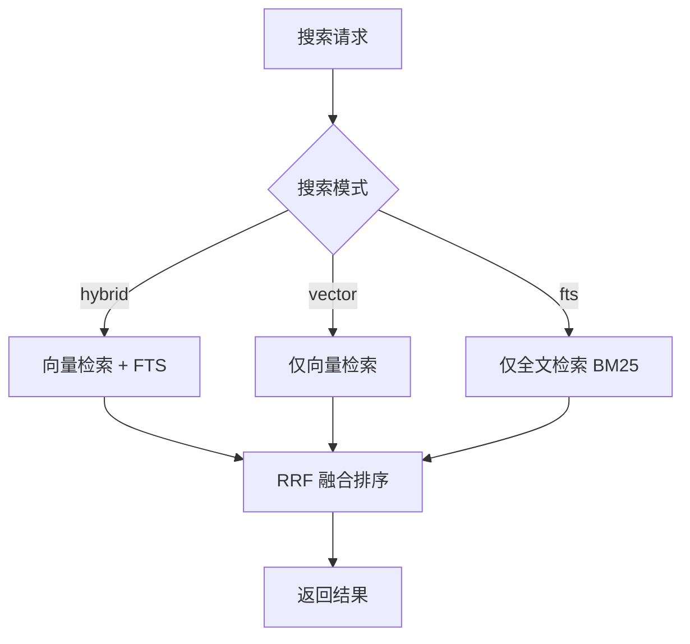

# RAG 检索

RAG（Retrieval-Augmented Generation）让用户搜索历史对话内容——"上次我让 Claude 修那个 bug 时它怎么说的？"不需要翻遍历史记录，语义搜索直接找到相关对话。系统将聊天消息分块、向量化、存入 SQLite vec0 向量索引，支持向量检索、全文检索和混合检索三种模式。向量化（vector embedding）可通过 `rag.vector_enabled` 配置独立开关——关闭后退化为纯 FTS 模式，适合无嵌入服务的场景。

## 流程图

### RAG 索引流程

```mermaid
sequenceDiagram
    participant service
    participant indexer
    participant EmbeddingClient
    participant SQLite

    service->>indexer: 新消息（indexed=0）
    indexer->>indexer: 分块（512 token，重叠）
    indexer->>indexer: 过滤 thinking/tool_use
    indexer->>indexer: ExtractLastAnswerFromBlocks（仅结论）
    indexer->>EmbeddingClient: POST {BaseURL}/v1/embeddings
    Note over EmbeddingClient: 默认 Ollama/BGE-M3
    兼容任意 OpenAI 协议端点
    EmbeddingClient-->>indexer: 向量
    indexer->>SQLite: 存储分块+向量（vec0）+FTS 索引
    indexer->>service: 标记 indexed=1
```

### RAG 搜索流程



## 功能与设计要点

### 功能清单

- **语义搜索**：用自然语言搜索历史对话，不依赖精确关键词匹配。用户描述问题即可找到相关历史，降低检索门槛
- **向量嵌入可独立开关**：`rag.vector_enabled` 配置控制向量嵌入（默认 true），FTS 全文检索始终启用。关闭向量嵌入后退化为纯 FTS 模式，适合无嵌入服务的场景
- **混合检索**：向量检索捕获语义相似性，BM25 全文检索捕获关键词匹配，两者通过 RRF（Reciprocal Rank Fusion）融合排序。比单一检索模式更全面
- **过滤条件**：支持按项目、后端、角色、会话、时间范围过滤。缩小搜索范围，提高结果精度
- **增量索引**：新消息自动标记为待索引，Indexer 轮询处理（5s 间隔，50 条/批）。不影响聊天主流程的响应速度
- **索引进度跟踪**：`GET /api/rag/status` 返回索引进度（总消息数、已索引数、已嵌入数、嵌入模式）；`GET /api/rag/message-index-status?id=<id>` 查询单条消息的 FTS 和向量嵌入状态。前端 `useRagStatus` composable 轮询 status 端点并计算实时索引/嵌入速度（基于相邻两次轮询的差值），在设置页显示索引健康度
- **自动清理**：超过 `RetentionDays`（默认 90 天）的软删除数据定期清理，防止索引无限增长
- **会话聚合搜索**：`RAGSessionSearch()` 在向量/FTS 搜索基础上按 `session_id` 聚合结果——返回 `SessionSearchResult`（含 `session_id`、`title`、`score`、`match_count`、分块列表），每会话最多 5 个分块。分块携带字符级偏移用于高亮。前端 `SessionSearchDrawer` 提供搜索结果列表 + 钻取详情两种视图，详情页将偏移转换为 DOM 高亮标记。`useSessionSearch` composable 封装搜索 API 调用，带防抖和 RAG 可用性缓存
- **消息聚类分析**：将跨所有会话的相似用户消息自动分组为"消息集群"，帮助用户识别自己的常见提问模式。用户触发按需计算（`POST /api/chat/message-clusters/compute`），后端执行三阶段管线：提取（top 5000 条用户消息统计）→ 聚类（Union-Find 算法，三级相似度优先：向量嵌入余弦相似 > FTS Sorensen-Dice 词汇重叠 > 精确去重）→ 缓存（结果存入 DB）。计算进度通过 `cluster_progress` WS 事件实时推送，完成后通过 `GET /api/chat/message-clusters` 获取缓存结果。已被设为快捷发送的消息变体自动过滤，只展示未设置的集群——引导用户将常见提问转为快捷发送

### 设计要点

- **统一 SQLite 存储**：聊天消息和向量索引都存储在 SQLite 中，向量索引使用 sqlite-vec 纯 Go 扩展的 vec0 虚拟表（余弦相似度）。SQLite 的 WAL 模式适合高频写入，vec0 虚拟表支持高效向量搜索——无需引入额外的数据库依赖
- **优雅降级**：如果 `rag.vector_enabled` 为 false 或 OpenAI 兼容嵌入端点（默认 `http://localhost:11434` Ollama）不可用，退化为 FTS-only 索引和搜索。`BaseURL` 与 `Model` 由用户在 `rag.{base_url,model}` 配置；任何 OpenAI 兼容服务都可作为嵌入后端，后续嵌入 API 恢复后自动回填向量——嵌入服务不是强制依赖
- **自适应嵌入维度**：从 API 响应自动检测向量维度，维度变化时重建表。支持切换嵌入模型而无需手动迁移
- **分块使用结论提取**：助手消息分块前先经 `ExtractLastAnswerFromBlocks` 提取最终结论（与摘要管线共享算法），而非拼接所有文本块——工具调用前的中间推理对搜索无价值，只增加噪音和索引体积
- **中文分词用 gse**：BM25 全文检索使用 gse 分词器处理中文文本，gse 不可用时退化为字符级分词——中文搜索不依赖外部分词服务
