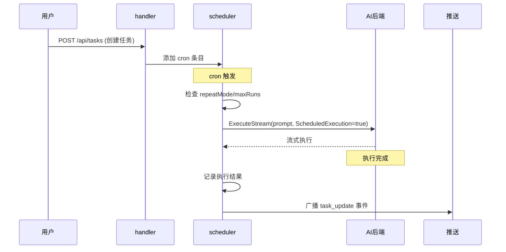
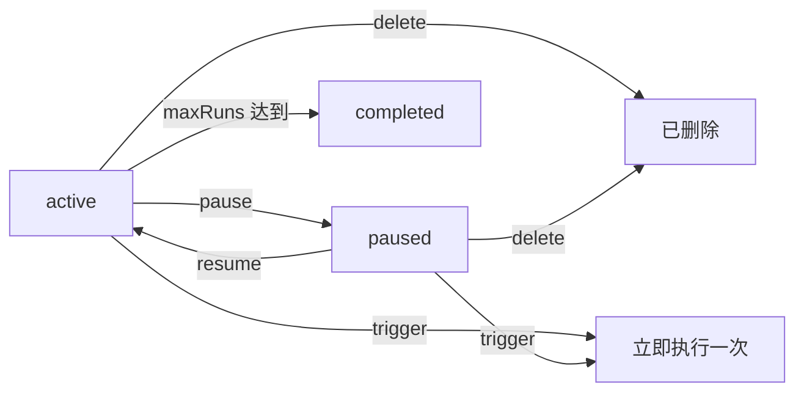
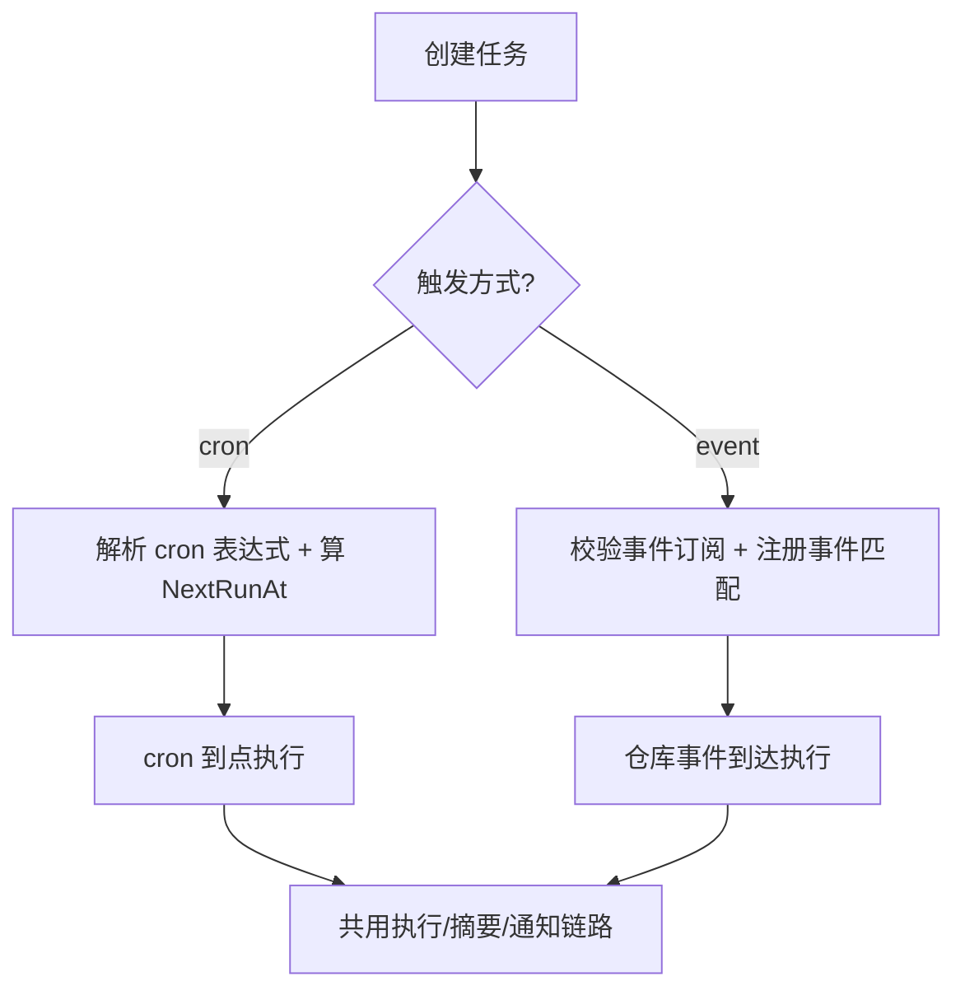

# 任务

任务让 AI 按计划自动执行——每天凌晨跑代码审查、每周一生成文档、每小时检查 GitHub Issues。任务由 cron 调度器驱动，到点后启动 AI 后端执行，完成后推送摘要通知。执行结果可以续接为交互式对话，让用户从 AI 的自动执行结果直接进入追问模式。这套机制让 AI 从"被动应答"变为"主动执行"，是 ClawBench 区别于普通聊天界面的核心能力。

任务有两种触发方式（`triggerMode`）：**cron**（默认，按表达式定时）与 **event**（由 GitHub/GitLab 事件唤起，见 [Forge 集成](forge-integration.md)）。两者共用同一套执行、摘要、通知与续接链路，只在"何时触发"和"prompt 是否注入事件上下文"上分叉。

## 流程图

### 任务从创建到执行

### 任务状态流转

### 两种触发方式

## 功能与设计要点

### 功能清单

- **cron 调度**：支持标准 cron 表达式定义执行计划（如 `0 10 * * 1` 每周一 10:00）。这是最灵活的调度方式，覆盖了从"每小时"到"每月"的各种需求
- **事件触发**：任务可选「触发方式：事件」，订阅 GitHub/GitLab 事件（`issue.opened`、`pr.merged`、`pipeline_done` 等，按 kind 分域，merged 仅 PR；CI 完成是仓库级事件故用裸键）。事件到达即执行，prompt 前置只读的事件上下文块（按事件类型条件渲染适用变量）。让任务从"按时间跑"扩展到"仓库有事就跑"，是 [Forge 集成](forge-integration.md) 的自动化出口
- **手动触发**：`trigger` 命令立即执行一次任务，不影响 cron 计划。适合"我想现在跑一次看看效果"的场景。仅适用于 cron 任务——事件触发任务的 prompt 依赖触发时注入的事件上下文（`{{TITLE}}` / `{{URL}}` 等），手动执行没有事件可注入，后端对这类任务返回 409 `TaskEventTriggerUnsupported`，前端也不展示执行按钮
- **暂停与恢复**：暂停任务不删除 cron 条目，恢复后继续按计划执行。用户临时不需要某个任务时可以暂停而非删除
- **执行限制**：`maxRuns` 限制任务最大执行次数，`repeatMode` 控制重复模式。避免任务无限执行消耗资源
- **执行历史**：每次执行的结果、摘要、耗时都有记录，支持分页查询。用户可以回溯任务执行情况
- **执行级已读**：未读按**执行记录逐条**计数（`task_executions.read_at`），不再用"任务级水位线"——水位线无法表达"第 3 次执行看过了、第 5 次没看"。单条执行可标记已读，也有「全部标为已读」一键清空；任务 tab 的未读**不会因为切到该 tab 自动清零**（曾有此行为，但它会在任务列表加载失败时把徽标错误归零），只有真正打开执行详情或点「全部标为已读」才清
- **摘要推送**：任务完成后生成结果摘要，通过 WebSocket 推送通知。通知包含 `Done:` 前缀和响应预览文本，用户一眼可知任务是否成功
- **续接对话**：执行完成后用户可从任务执行详情中点击"继续对话"，将执行结果续接为新的交互式聊天会话。新会话继承源会话的消息、摘要和 `external_session_id`（支持 `--resume`），标题前缀为执行时间戳 `[MM-DD HH:MM]`。任务不再是"执行完就结束"，用户可以基于 AI 的自动执行结果继续深入探讨
- **运行中流式状态**：查看正在执行的任务详情时，消息始终标记为流式状态（streaming），前端展示"生成中"指示器而非已完成答案——DB 中的内容仅为部分结果，不应呈现为最终回复。运行期间摘要标签页不可用，避免展示不完整的摘要
- **ACP 自动审批**：ACP 传输的任务自动启用工具调用审批，避免因无人在场审批工具调用而无限阻塞。任务无人值守，权限审批必须自动通过

### 设计要点

- **防递归靠提示词层**：任务管理指令只在用户显式使用 `/cb-task` 时注入（`internal/handler/clawbench_command.go`），因此定时执行期间 AI 的上下文中不含创建任务的用法说明。历史上还依赖过 `CLAWBENCH_SCHEDULED=1` 环境变量与 CLI 内的守卫，二者随 `clawbench task` 子命令移除而失效；`ScheduledExecution` 标志仍传给后端，但仅用于 pi 的 `--no-session`，**不承担防递归职责**（`scheduler.go` 中声称它在 handler 层防递归的注释已过时）。事件触发任务另有身份级防递归——抑制 AI 自身账号产生的写操作事件（见 [Forge 集成](forge-integration.md)）
- **触发方式在调度器入口分叉**：`triggerMode` 为 `event` 的任务跳过 cron 解析与 `NextRunAt` 计算，改为注册到事件匹配表；加载时排除出 cron 注册、恢复时重新加入事件监听。两种任务共用 `SessionExecutor` 执行，差异仅在于 prompt 是否注入事件上下文
- **执行摘要由 AI 生成**：任务执行完成后，系统调用 summarizer 将 AI 回复压缩为摘要，用于推送通知和历史记录。摘要保留 Markdown 格式（与 TTS 摘要不同），约 30% 原文长度
- **续接对话继承会话身份**：续接的新会话继承源会话的 Agent、模型、思考深度和 `external_session_id`，保证对话上下文和 CLI 会话连续性。已存在的续接会话会被复用（已归档的自动恢复），避免重复创建
- **硬删除而非归档**：与聊天会话不同，任务使用硬删除。任务定义是用户主动管理的配置项，删除意味着"我不再需要这个任务"
- **调度器使用 robfig/cron**：标准库级调度器，可靠且久经考验。运行时执行记录存储在内存中，重启后从数据库恢复
- **SessionExecutor 统一执行**：任务和交互式聊天共用 `SessionExecutor`，通过 `RunConfig.Mode = ModeScheduled` 控制差异化行为（无 SSE 转发、i18n 错误等）。消除了 handler 和 scheduler 中的重复执行逻辑
